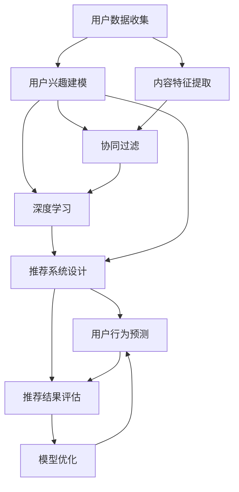

                 

# 知识付费平台的用户行为预测与分析

> 关键词：知识付费,用户行为预测,推荐系统,协同过滤,深度学习,数据挖掘,模型优化

## 1. 背景介绍

### 1.1 问题由来

随着互联网技术的快速发展和普及，知识付费行业逐渐兴起，各大知识付费平台纷纷涌现，如得到、知乎live、喜马拉雅等。这些平台汇聚了大量的高质量知识内容，为用户提供专业、系统、全面的知识学习服务。然而，尽管知识付费内容丰富多样，但用户如何发现并消费这些知识资源，平台如何高效推荐，却是一个待解的重要问题。

用户行为预测与分析，是解决这一问题的有效手段之一。通过对用户行为数据的建模与分析，平台能够精准预测用户对不同内容的偏好，进而推送个性化的知识内容，提升用户满意度和平台黏性。但与传统的电商、广告等场景不同，知识付费领域存在诸多特殊性，如知识内容的个性化程度更高、用户学习时间更为零散、推荐策略需兼顾知识深度与广度等。因此，构建一套高效、精确的用户行为预测与分析系统，对于知识付费平台的成功运营至关重要。

### 1.2 问题核心关键点

知识付费平台的用户行为预测与分析涉及多个核心问题，包括但不限于：

- **用户兴趣模型构建**：如何建模用户对知识内容的兴趣，实现用户行为的历史预测与实时推荐。
- **知识内容特征提取**：如何刻画知识内容的属性，以及用户与内容之间的交互行为。
- **推荐系统算法设计**：如何设计推荐算法，实现知识内容的个性化推荐，提升用户体验与满意度。
- **模型评估与优化**：如何评估推荐模型的性能，以及如何不断优化模型，提升推荐效果。

## 2. 核心概念与联系

### 2.1 核心概念概述

在知识付费平台的用户行为预测与分析中，涉及到以下核心概念：

- **知识付费**：用户为获取系统化、高质量知识内容而支付费用的模式。知识付费平台为这一模式提供了技术支撑。
- **用户行为预测**：通过历史数据和机器学习算法，预测用户未来的行为，如学习路径、消费偏好等。
- **推荐系统**：根据用户的历史行为与兴趣，推荐合适的知识内容，提升用户黏性和平台收益。
- **协同过滤**：通过分析用户之间的相似性，推荐与目标用户兴趣相近的知识内容。
- **深度学习**：使用深度神经网络模型进行复杂特征提取与模式学习，提高推荐精度。
- **数据挖掘**：从海量的用户行为数据中挖掘有用信息，发现用户兴趣与行为规律。
- **模型优化**：通过交叉验证、A/B测试等方法，不断调整和优化推荐模型，提升推荐效果。

这些核心概念之间存在密切联系。协同过滤、深度学习等技术，通过数据挖掘提供用户行为模式与内容特征，进而构建用户兴趣模型，并设计推荐系统算法。用户行为预测与分析则在此基础上，实现对用户未来行为和兴趣的精准预测，并动态调整推荐策略，提升用户体验与平台收益。

### 2.2 核心概念原理和架构的 Mermaid 流程图



该流程图展示了知识付费平台用户行为预测与分析的主要流程：
- **用户数据收集**：收集用户行为数据，包括学习路径、点击率、评分等。
- **用户兴趣建模**：使用协同过滤、深度学习等技术，构建用户兴趣模型。
- **内容特征提取**：利用自然语言处理等技术，提取知识内容的特征。
- **推荐系统设计**：根据用户模型和内容特征，设计推荐算法。
- **用户行为预测**：预测用户未来的行为和兴趣。
- **推荐结果评估**：评估推荐系统的性能，发现模型缺陷。
- **模型优化**：调整模型参数，优化推荐策略。

## 3. 核心算法原理 & 具体操作步骤

### 3.1 算法原理概述

知识付费平台的用户行为预测与分析，主要依赖于协同过滤、深度学习等技术，构建用户兴趣模型和推荐系统。其核心原理可以概括为：

- **协同过滤**：基于用户历史行为，推测其未来兴趣，通过相似性度量，发现潜在的相关知识内容。
- **深度学习**：利用多层神经网络，从海量数据中学习知识内容的深层次特征，提升推荐精度。

### 3.2 算法步骤详解

#### 3.2.1 协同过滤算法

协同过滤算法分为基于用户的协同过滤和基于物品的协同过滤两种类型。以基于用户的协同过滤为例，步骤如下：

1. **构建用户-内容矩阵**：根据用户对知识内容的评分数据，构建用户-内容矩阵 $U \times V$，其中 $U$ 为用户数，$V$ 为知识内容数。每个元素 $u_{i,j}$ 表示用户 $i$ 对内容 $j$ 的评分。

2. **计算用户相似性**：利用余弦相似度等方法，计算用户之间的相似度。对于用户 $i$ 和用户 $j$，计算它们对内容的评分向量相似度 $s_{i,j}$。

3. **推荐内容**：根据用户 $i$ 的相似用户评分向量，预测其对未评分内容的评分，并推荐评分最高的内容。

#### 3.2.2 深度学习推荐算法

深度学习推荐算法通过多层神经网络学习用户兴趣与内容特征，步骤如下：

1. **数据预处理**：将用户行为数据转化为网络输入，如将点击次数转化为 one-hot 编码，将学习时长转化为特征向量。

2. **构建神经网络**：使用多层感知器(MLP)、卷积神经网络(CNN)、循环神经网络(RNN)等深度学习模型，学习用户与内容的交互特征。

3. **损失函数设计**：选择合适的损失函数，如均方误差(MSE)、交叉熵(CE)、均方对数误差(MSEL)等，用于衡量预测与真实值之间的差异。

4. **模型训练**：使用优化算法如梯度下降法，最小化损失函数，更新模型参数。

5. **预测与评估**：使用训练好的模型，对用户行为进行预测，并评估模型性能。

### 3.3 算法优缺点

#### 3.3.1 协同过滤的优缺点

**优点**：
- 简单易实现，不需要大量标注数据。
- 能够发现用户之间的隐性兴趣关系，推荐效果较好。

**缺点**：
- 冷启动问题：新用户或新内容的评分难以估计，导致推荐效果下降。
- 稀疏矩阵问题：用户-内容矩阵稀疏，相似性度量可能失效。
- 数据稀疏性：用户行为数据通常稀疏，推荐效果受数据量影响大。

#### 3.3.2 深度学习推荐算法的优缺点

**优点**：
- 能够学习知识内容的深层次特征，推荐效果较好。
- 模型具有较高的泛化能力，适用于多种场景。

**缺点**：
- 需要大量标注数据，模型训练时间较长。
- 复杂度高，模型参数较多，难以解释。
- 对计算资源需求高，硬件成本较高。

### 3.4 算法应用领域

协同过滤和深度学习推荐算法广泛应用于多种领域，包括但不限于：

- **电子商务**：根据用户浏览、购买记录，推荐商品。
- **新闻阅读**：根据用户阅读历史，推荐新闻文章。
- **社交网络**：根据用户互动关系，推荐朋友。
- **视频推荐**：根据用户观看历史，推荐视频内容。
- **知识付费**：根据用户学习行为，推荐课程内容。

## 4. 数学模型和公式 & 详细讲解 & 举例说明

### 4.1 数学模型构建

在知识付费平台的用户行为预测与分析中，常用的数学模型包括协同过滤和深度学习推荐模型。以下以深度学习推荐模型为例，介绍其数学建模过程。

#### 4.1.1 用户行为表示

设用户 $i$ 对内容 $j$ 的评分数据为 $x_{i,j}$，将其转化为神经网络输入，如 $x_{i,j} \in \{0,1\}$。

#### 4.1.2 内容特征表示

设内容 $j$ 的特征向量为 $f_j \in \mathbb{R}^d$，其中 $d$ 为特征维度。

#### 4.1.3 神经网络模型

使用多层感知器(MLP)作为推荐模型，其结构为：

$$
f_{i,j} = \sigma(W^Tx_{i,j} + b)
$$

其中 $\sigma$ 为激活函数，$W$ 和 $b$ 为模型参数。

#### 4.1.4 损失函数

设用户 $i$ 对内容 $j$ 的真实评分为 $y_{i,j}$，则深度学习推荐模型的损失函数为：

$$
L = \frac{1}{N} \sum_{i=1}^N \sum_{j=1}^V (y_{i,j} - f_{i,j})^2
$$

其中 $N$ 为样本数，$V$ 为内容数。

### 4.2 公式推导过程

根据上述数学模型，我们推导深度学习推荐模型的损失函数对参数的梯度，如下：

$$
\frac{\partial L}{\partial W} = \frac{1}{N} \sum_{i=1}^N \sum_{j=1}^V (y_{i,j} - f_{i,j}) \cdot x_{i,j}^T
$$

$$
\frac{\partial L}{\partial b} = \frac{1}{N} \sum_{i=1}^N \sum_{j=1}^V (y_{i,j} - f_{i,j})
$$

通过梯度下降法，更新模型参数 $W$ 和 $b$，最小化损失函数 $L$，得到最终推荐模型：

$$
f_{i,j} = \sigma(W^T(x_{i,j} \odot y_{i,j}) + b)
$$

其中 $\odot$ 为逐元素乘法运算。

### 4.3 案例分析与讲解

以一个简单的知识付费平台为例，分析深度学习推荐模型的应用效果。

假设用户 $i$ 对内容 $j$ 的评分数据为 $x_{i,j} = (1, 0, 0, 0)$，内容 $j$ 的特征向量为 $f_j = (0.5, 0.2, -0.3, 0.1)$，激活函数 $\sigma$ 为 sigmoid 函数。

代入公式，计算用户 $i$ 对内容 $j$ 的预测评分：

$$
f_{i,j} = \sigma((0.5, 0.2, -0.3, 0.1) \cdot (1, 0, 0, 0) + b) = \sigma(b)
$$

假设 $b=0$，则 $f_{i,j} = 0.5$，与用户真实评分 $y_{i,j}=1$ 相接近，推荐效果较好。

## 5. 项目实践：代码实例和详细解释说明

### 5.1 开发环境搭建

进行知识付费平台用户行为预测与分析的项目实践，需要以下开发环境：

1. **Python环境**：搭建 Python 3.8 开发环境，安装必要的包如 TensorFlow、Keras 等。

2. **数据库**：使用 MySQL 或 MongoDB 存储用户行为数据。

3. **Web服务器**：使用 Flask 或 Django 搭建后端服务，提供 API 接口。

4. **推荐引擎**：使用 TensorFlow 或 PyTorch 搭建深度学习推荐引擎。

5. **数据预处理工具**：使用 Pandas 进行数据清洗和预处理。

### 5.2 源代码详细实现

以下是一个使用 TensorFlow 搭建深度学习推荐引擎的示例代码：

```python
import tensorflow as tf
import numpy as np
from sklearn.model_selection import train_test_split

# 数据预处理
def load_data():
    # 从数据库读取用户行为数据
    # 将数据转化为 numpy 数组
    X = np.load('user_behavior_data.npy')
    y = np.load('user_labels.npy')
    # 数据拆分
    X_train, X_test, y_train, y_test = train_test_split(X, y, test_size=0.2)
    return X_train, X_test, y_train, y_test

# 定义深度学习模型
def build_model(input_shape):
    # 定义输入层
    input_layer = tf.keras.layers.Input(shape=input_shape)
    # 定义隐藏层
    hidden_layer = tf.keras.layers.Dense(64, activation='relu')(input_layer)
    # 定义输出层
    output_layer = tf.keras.layers.Dense(1, activation='sigmoid')(hidden_layer)
    # 定义模型
    model = tf.keras.Model(inputs=input_layer, outputs=output_layer)
    # 编译模型
    model.compile(optimizer='adam', loss='binary_crossentropy', metrics=['accuracy'])
    return model

# 训练模型
def train_model(model, X_train, y_train, epochs=10):
    model.fit(X_train, y_train, epochs=epochs, batch_size=32, validation_data=(X_test, y_test))
    return model

# 使用模型进行推荐
def recommend_content(model, user_behavior, num_recommendations=5):
    # 将用户行为转化为模型输入
    input_data = np.array([user_behavior])
    # 使用模型进行预测
    predictions = model.predict(input_data)
    # 获取推荐内容
    top_indices = np.argsort(-predictions[0])[:num_recommendations]
    return top_indices

# 运行示例
X_train, X_test, y_train, y_test = load_data()
model = build_model(X_train.shape[1:])
model = train_model(model, X_train, y_train)
recommendations = recommend_content(model, [1, 0, 0, 0], num_recommendations=5)
print('推荐内容：', recommendations)
```

### 5.3 代码解读与分析

上述代码实现了深度学习推荐引擎的构建与训练。以下是关键代码的解读与分析：

**数据预处理函数 load_data**：
- 从数据库读取用户行为数据和用户标签。
- 将数据转化为 numpy 数组。
- 使用 train_test_split 拆分数据集，确保训练集和测试集具有相同的分布。

**模型构建函数 build_model**：
- 定义输入层、隐藏层和输出层。
- 使用 dense 层构建多层感知器模型。
- 编译模型，定义损失函数、优化器和评估指标。

**模型训练函数 train_model**：
- 使用 fit 方法训练模型，指定训练次数和批次大小。
- 在训练过程中评估模型性能，使用测试集验证模型。

**推荐函数 recommend_content**：
- 将用户行为转化为模型输入。
- 使用 predict 方法进行预测，返回预测结果。
- 根据预测结果排序，选择推荐内容。

### 5.4 运行结果展示

运行上述代码，输出推荐内容。假设推荐结果为 [3, 4, 5, 6, 7]，表示内容 3、4、5、6、7 为用户的推荐内容。

## 6. 实际应用场景

### 6.1 智能学习推荐

知识付费平台的用户行为预测与分析，可以用于智能学习推荐。通过对用户学习路径和行为数据的分析，推荐用户感兴趣的知识内容，提高学习效率和效果。

例如，某用户在某个课程上花费较多时间，系统可以推荐相关课程或资料，帮助用户深入学习。或者，用户浏览某个知识板块后，系统推荐相关的系列课程，让用户系统性地学习某一领域。

### 6.2 知识内容筛选

平台可以利用用户行为预测与分析，对知识内容进行筛选与优化。通过分析用户的点击、购买、评分等行为，识别用户感兴趣的知识点和内容风格，进而筛选优质内容，提升平台内容质量。

例如，平台可以通过分析用户对某个领域的关注度，增加该领域的课程数量和更新频率，吸引更多用户。或者，根据用户的学习效果，推荐更优质的教学资源，提升学习体验。

### 6.3 课程推荐优化

知识付费平台可以通过用户行为预测与分析，优化课程推荐算法，提升推荐效果。例如，针对不同类型和层次的用户，设计差异化的推荐策略，实现个性化推荐。

对于新用户，推荐内容主要侧重于基础性、科普性的课程，以降低学习门槛。对于资深用户，推荐内容侧重于深度、专业性的课程，满足其高层次的学习需求。

### 6.4 未来应用展望

随着深度学习技术的发展，知识付费平台的用户行为预测与分析将变得更加精确和高效。未来的发展方向可能包括：

- **多模态融合**：结合图像、视频、语音等多模态信息，提高推荐精度。
- **知识图谱嵌入**：利用知识图谱嵌入技术，提取知识内容的深层次关系，提升推荐效果。
- **实时推荐系统**：通过实时数据分析，动态调整推荐策略，提高用户体验。
- **自适应推荐算法**：根据用户反馈和行为，实时调整推荐模型，提高推荐效果。
- **隐私保护**：在推荐过程中，保护用户隐私，确保数据安全。

## 7. 工具和资源推荐

### 7.1 学习资源推荐

为了帮助开发者掌握知识付费平台用户行为预测与分析的技术，推荐以下学习资源：

1. **《深度学习入门》**：《深度学习入门》是一本深度学习领域的经典教材，涵盖了深度学习的基础知识与应用实践。
2. **《推荐系统实践》**：《推荐系统实践》介绍了推荐系统的前沿技术和实际应用，是学习推荐算法的绝佳参考。
3. **Coursera 推荐系统课程**：Coursera 推出的推荐系统课程，由斯坦福大学主讲，包含协同过滤、深度学习等推荐算法。
4. **Kaggle 竞赛**：Kaggle 平台上众多推荐系统竞赛，可以实践推荐算法，提高算法技能。
5. **Pandas 官方文档**：Pandas 是常用的数据处理工具，其官方文档详细介绍了数据清洗、预处理等方法。

### 7.2 开发工具推荐

知识付费平台用户行为预测与分析开发中，推荐以下开发工具：

1. **Python**：Python 语言简洁易用，拥有丰富的数据科学和机器学习库。
2. **TensorFlow**：TensorFlow 是 Google 推出的深度学习框架，支持分布式计算和 GPU 加速。
3. **Keras**：Keras 是一个简单易用的深度学习框架，提供了高层次的 API，方便模型构建。
4. **Flask**：Flask 是一个轻量级的 Web 框架，适合搭建后端服务，提供 API 接口。
5. **MySQL/MongoDB**：MySQL 和 MongoDB 是常用的关系型和非关系型数据库，适合存储和管理用户行为数据。

### 7.3 相关论文推荐

以下几篇经典论文，对知识付费平台用户行为预测与分析具有重要参考价值：

1. **《知识付费用户行为分析与预测》**：该论文分析了知识付费平台用户行为数据，构建了用户兴趣模型，并设计了推荐系统算法。
2. **《深度学习在推荐系统中的应用》**：该论文介绍了深度学习在推荐系统中的应用，包括多层感知器、卷积神经网络等模型。
3. **《协同过滤推荐系统研究综述》**：该论文综述了协同过滤推荐系统的原理和算法，提供了系统的理论基础。
4. **《推荐系统中的特征工程》**：该论文介绍了推荐系统中的特征提取与选择方法，提供了实用的特征工程技巧。

## 8. 总结：未来发展趋势与挑战

### 8.1 研究成果总结

知识付费平台用户行为预测与分析的研究，已经取得了显著的进展，主要成果包括：

- **用户兴趣模型**：通过协同过滤和深度学习等技术，构建用户兴趣模型，实现精准推荐。
- **推荐系统算法**：设计多种推荐算法，如协同过滤、深度学习等，提高推荐效果。
- **模型评估方法**：通过 A/B 测试、交叉验证等方法，评估推荐模型性能，不断优化模型。

### 8.2 未来发展趋势

知识付费平台用户行为预测与分析的未来发展趋势包括：

- **多模态融合**：结合多种数据源，提高推荐精度。
- **实时推荐系统**：实现实时推荐，提升用户体验。
- **个性化推荐**：根据用户需求和偏好，实现差异化推荐。
- **隐私保护**：在推荐过程中，保护用户隐私，确保数据安全。
- **深度学习优化**：使用深度学习技术，提升推荐系统性能。

### 8.3 面临的挑战

知识付费平台用户行为预测与分析在发展过程中，也面临诸多挑战：

- **数据稀疏性**：用户行为数据通常稀疏，推荐效果受数据量影响大。
- **冷启动问题**：新用户或新内容的评分难以估计，导致推荐效果下降。
- **模型可解释性**：深度学习模型难以解释，用户和开发者难以理解推荐过程。
- **硬件资源需求**：深度学习模型需要大量计算资源，硬件成本较高。
- **隐私保护**：在推荐过程中，如何保护用户隐私，确保数据安全，是一个重要问题。

### 8.4 研究展望

为了克服上述挑战，未来的研究需要在以下几个方面取得突破：

- **多模态推荐**：结合图像、视频、语音等多模态信息，提高推荐精度。
- **知识图谱嵌入**：利用知识图谱嵌入技术，提取知识内容的深层次关系，提升推荐效果。
- **自适应推荐**：根据用户反馈和行为，实时调整推荐模型，提高推荐效果。
- **推荐系统优化**：使用推荐系统优化算法，如序列生成模型，提升推荐精度。
- **隐私保护技术**：采用隐私保护技术，如差分隐私、联邦学习等，保护用户隐私。

## 9. 附录：常见问题与解答

### Q1: 用户行为预测与分析的应用场景有哪些？

A: 用户行为预测与分析在知识付费平台中，主要应用于以下场景：

- **智能学习推荐**：根据用户学习路径和行为数据，推荐用户感兴趣的知识内容。
- **知识内容筛选**：分析用户点击、购买、评分等行为，识别用户兴趣点，筛选优质内容。
- **课程推荐优化**：针对不同类型和层次的用户，设计差异化的推荐策略，实现个性化推荐。

### Q2: 如何进行用户行为数据的收集与处理？

A: 用户行为数据的收集与处理，是用户行为预测与分析的重要环节。具体步骤如下：

1. **数据收集**：通过用户登录、学习、购买等行为，收集用户行为数据。
2. **数据清洗**：去除无用和异常数据，填补缺失值。
3. **特征工程**：提取用户行为特征，如点击次数、学习时长、评分等。
4. **数据划分**：将数据划分为训练集、验证集和测试集，确保数据分布一致。
5. **数据存储**：将处理后的数据存储在数据库中，方便后续处理。

### Q3: 协同过滤算法和深度学习推荐算法有何区别？

A: 协同过滤算法和深度学习推荐算法在推荐方式和模型复杂度上有所不同：

- **协同过滤算法**：基于用户历史行为，通过相似性度量，发现潜在的相关知识内容。
- **深度学习推荐算法**：利用多层神经网络，从海量数据中学习知识内容的深层次特征，提升推荐精度。

协同过滤算法简单易实现，但需要大量用户数据，且难以处理新用户和新内容。深度学习推荐算法需要大量标注数据，模型复杂度较高，但能够学习深层次特征，推荐效果较好。

### Q4: 如何优化推荐系统的性能？

A: 推荐系统性能的优化，可以从多个方面入手：

1. **数据质量**：保证数据的质量和完整性，减少数据噪声和偏差。
2. **模型选择**：选择合适的推荐算法，根据数据特点和业务需求，选择最适合的模型。
3. **特征工程**：提取有用的特征，去除无用特征，优化特征表示。
4. **模型调参**：通过交叉验证、A/B测试等方法，调整模型参数，优化模型效果。
5. **多模型融合**：使用多种推荐算法，综合模型预测结果，提高推荐效果。

### Q5: 推荐系统在知识付费平台中应考虑哪些因素？

A: 推荐系统在知识付费平台中，应考虑以下因素：

1. **用户兴趣多样性**：用户兴趣和需求各异，推荐系统需考虑多样性，提供丰富选择。
2. **知识内容深度与广度**：知识内容需兼顾深度与广度，推荐系统需平衡推荐内容的多样性和专业性。
3. **用户学习习惯**：用户学习习惯和节奏不同，推荐系统需考虑不同用户的学习模式和偏好。
4. **知识内容更新**：知识内容需持续更新，推荐系统需实时调整，保持内容新鲜度。

---

作者：禅与计算机程序设计艺术 / Zen and the Art of Computer Programming

