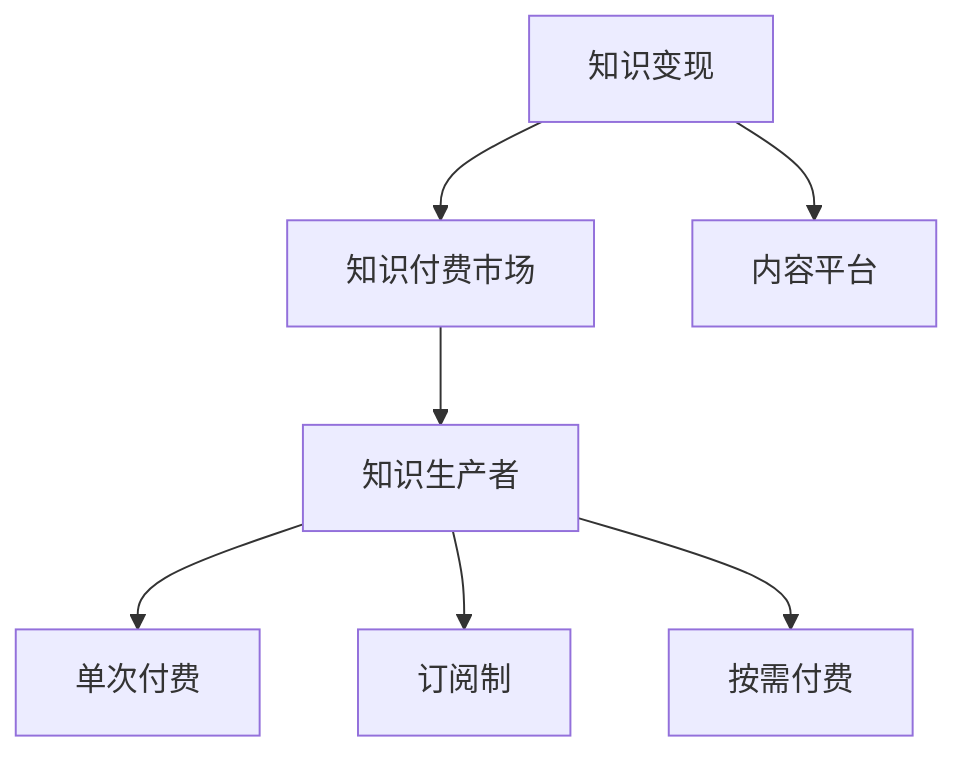

                 

# 知识付费时代来临：如何从知识变现中获利？

## 1. 背景介绍

### 1.1 问题由来

随着互联网和移动设备的普及，人们获取知识的途径越来越多，同时社会对知识的需求也日益增长。从传统教育到在线课程，从技术教程到职场培训，知识付费市场正在快速壮大。这不仅改变了知识生产和消费的格局，也为各类专业人士提供了新的商业机会。

### 1.2 问题核心关键点

知识付费的核心在于知识生产者如何有效地将知识转化为经济价值。这需要结合市场需求、知识深度、变现手段等多方面因素进行综合考虑。面对市场的多样化需求，知识生产者需要找到最适合自己的变现方式，最大化其知识资源的商业价值。

### 1.3 问题研究意义

知识付费的兴起不仅为个人提供了实现价值转换的渠道，也推动了教育、科技、文化等多个领域的创新发展。对于知识生产者而言，掌握知识变现的策略和方法，是提升收入、扩大影响力、实现职业发展的关键。

## 2. 核心概念与联系

### 2.1 核心概念概述

为深入理解知识变现的过程，我们需要了解以下几个核心概念：

- **知识变现**：指将知识转化为经济价值的过程，包括但不限于出版书籍、在线课程、技术咨询、内容创作等形式。
- **知识付费市场**：指基于互联网和移动设备，消费者为获取特定知识内容支付费用的市场。
- **内容平台**：指提供知识变现服务的在线平台，如知乎、Coursera、Udemy等。
- **知识付费模式**：包括单次付费、订阅制、按需付费等多种模式。
- **知识生产者**：指具备专业知识，并愿意将其转化为经济收入的专业人士，如学者、专家、技术开发者等。

这些核心概念之间的关系可以通过以下Mermaid流程图来展示：



这个流程图展示了几者之间的逻辑关系：知识变现过程通过内容平台连接知识生产者和知识付费市场，而知识付费市场包含了多种不同的变现模式。

## 3. 核心算法原理 & 具体操作步骤

### 3.1 算法原理概述

知识变现的算法原理主要基于经济学中的价值理论和市场需求分析。以下是关键概念和步骤的概述：

1. **需求分析**：分析目标市场的用户需求，确定知识变现的内容类型、难度和价格。
2. **内容创作**：根据市场需求，创作或采集高质量的内容，确保内容对用户有价值。
3. **市场推广**：通过内容平台等渠道，对创作的知识内容进行推广，吸引用户付费。
4. **收入结算**：根据交易记录，进行收入结算，保证知识生产者的收益。
5. **用户体验**：提升用户的购买和使用体验，增强用户粘性和忠诚度。

### 3.2 算法步骤详解

#### 3.2.1 需求分析

需求分析是知识变现的关键环节，具体步骤包括：

1. **市场调研**：通过问卷调查、用户反馈等方式，了解目标市场的需求特点。
2. **竞争分析**：研究同类产品的优势和劣势，找出市场空缺和机会。
3. **用户画像**：分析潜在用户的年龄、性别、职业、兴趣等信息，制定精准的目标用户群体。
4. **需求细化**：根据用户画像，细化知识内容的主题、难度、形式等细节。

#### 3.2.2 内容创作

内容创作是知识变现的核心环节，需要遵循以下几个步骤：

1. **选题策划**：基于需求分析，确定知识内容的主题、框架和目标用户。
2. **内容制作**：根据选题策划，制作或采集高质量的内容，包括文本、视频、音频等形式。
3. **内容优化**：通过A/B测试、用户反馈等方式，优化内容的质量和形式，提高用户满意度。
4. **内容发布**：选择合适的平台发布内容，确保内容的可见性和易用性。

#### 3.2.3 市场推广

市场推广是知识变现的重要环节，通过以下步骤进行：

1. **平台选择**：选择适合的内容平台，如知乎、Coursera等，确保平台的受众和内容匹配。
2. **推广策略**：制定多渠道的推广策略，包括社交媒体、搜索引擎优化（SEO）、付费广告等。
3. **用户互动**：通过问答、评论、直播等形式，与用户互动，提升用户粘性。
4. **数据分析**：利用数据跟踪工具，分析用户行为，优化推广策略。

#### 3.2.4 收入结算

收入结算是知识变现的最终环节，具体步骤包括：

1. **交易记录**：通过平台记录交易信息，包括支付时间、金额、内容等。
2. **账务处理**：根据交易记录，处理收入和支出，确保财务准确性。
3. **税务合规**：遵守相关法律法规，进行税务申报，保证税务合规性。
4. **收益分配**：根据合同约定，分配收益给知识生产者和平台。

#### 3.2.5 用户体验

用户体验是知识变现的重要指标，通过以下步骤提升：

1. **内容质量**：保证内容的高质量和实用性，满足用户需求。
2. **平台界面**：优化平台界面和功能，提升用户体验。
3. **服务响应**：快速响应用户的反馈和需求，提供良好的客户服务。
4. **满意度调查**：定期进行用户满意度调查，收集用户意见，不断改进服务。

### 3.3 算法优缺点

知识变现算法的主要优点包括：

1. **灵活性高**：可以根据市场需求调整内容形式和价格，灵活适应市场变化。
2. **收益稳定**：通过订阅制、按需付费等模式，保证知识生产者有稳定的收入来源。
3. **用户粘性高**：通过互动和社区建设，提升用户粘性和忠诚度，形成长期的客户关系。
4. **扩展性强**：知识变现可以拓展到多个领域和平台，实现多渠道收益。

同时，也存在一些缺点：

1. **市场竞争激烈**：知识付费市场竞争激烈，需要不断创新和提升内容质量。
2. **内容制作成本高**：高质量内容的创作和采集需要投入大量的时间和资源。
3. **用户流失风险**：用户可能因为各种原因流失，影响收入稳定性。
4. **平台依赖性强**：过度依赖特定平台，可能会受制于平台规则和政策。

### 3.4 算法应用领域

知识变现算法广泛应用于多个领域，包括但不限于：

- **教育培训**：提供线上课程和培训，如编程、语言学习、职业技能等。
- **技术开发**：提供技术教程、工具使用指南等，帮助开发者提高技能。
- **文化创意**：提供图书、音乐、视频等文化创意内容，满足用户的娱乐需求。
- **健康管理**：提供健康知识、饮食建议、运动指导等，帮助用户保持健康。
- **金融理财**：提供理财知识、投资策略、金融工具使用指南等，帮助用户管理财务。

## 4. 数学模型和公式 & 详细讲解 & 举例说明

### 4.1 数学模型构建

知识变现的数学模型可以基于经济学的价值理论和市场供需模型。以下是一个简单的数学模型构建过程：

1. **需求函数**：假定用户对知识内容的市场需求为 $D(Q)$，其中 $Q$ 为知识内容的数量，需求函数通常为线性或非线性形式。
2. **供给函数**：假定知识内容的供给量为 $S(Q)$，通常为成本和价格的函数。
3. **均衡价格**：通过解方程 $D(Q) = S(Q)$，得到市场的均衡价格 $P_{eq}$。
4. **收益模型**：根据交易记录，计算知识生产者的总收入 $R$。

### 4.2 公式推导过程

#### 4.2.1 需求函数

假定市场需求函数为线性形式，可以表示为：

$$
D(Q) = aQ + b
$$

其中 $a$ 和 $b$ 为常数，$a > 0$ 表示需求随供给增加而增加，$b$ 表示市场需求基数。

#### 4.2.2 供给函数

假定供给函数为成本和价格的函数，可以表示为：

$$
S(Q) = c + dp
$$

其中 $c$ 为固定成本，$d$ 为边际成本，$p$ 为价格。

#### 4.2.3 均衡价格

通过解方程 $D(Q) = S(Q)$，得到市场的均衡价格：

$$
aQ + b = c + dp
$$

解得均衡价格 $P_{eq}$：

$$
P_{eq} = \frac{c + b}{a + d}
$$

#### 4.2.4 收益模型

假定知识生产者销售 $n$ 个知识产品，价格为 $P$，总成本为 $C$，则收益模型为：

$$
R = nP - C
$$

通过以上数学模型，可以分析不同价格、需求和成本下的收益情况，从而进行市场定价和成本控制。

### 4.3 案例分析与讲解

#### 4.3.1 案例1：在线编程课程

假定在线编程课程的需求函数为 $D(Q) = 10Q + 5$，供给函数为 $S(Q) = 100 + 10Q$，则均衡价格为：

$$
P_{eq} = \frac{100 + 5}{10 + 10} = \frac{105}{20} = 5.25
$$

假定知识生产者销售 1000 个课程，价格为 $5.25，总成本为 5000，则收益为：

$$
R = 1000 \times 5.25 - 5000 = 5250 - 5000 = 250
$$

#### 4.3.2 案例2：电子书

假定电子书的需求函数为 $D(Q) = 5Q^2 + 20Q + 10$，供给函数为 $S(Q) = 500 + 5Q$，则均衡价格为：

$$
P_{eq} = \frac{500 + 10}{5 + 5} = \frac{510}{10} = 51
$$

假定知识生产者销售 100 个电子书，价格为 $51，总成本为 3000，则收益为：

$$
R = 100 \times 51 - 3000 = 5100 - 3000 = 2100
$$

通过以上案例分析，可以看出不同内容形式和市场条件下的收益差异。

## 5. 项目实践：代码实例和详细解释说明

### 5.1 开发环境搭建

在进行知识变现项目实践前，我们需要准备好开发环境。以下是使用Python进行项目开发的常见环境配置流程：

1. 安装Anaconda：从官网下载并安装Anaconda，用于创建独立的Python环境。

```bash
conda create -n py3k python=3.7
conda activate py3k
```

2. 安装必要的Python库：

```bash
pip install pandas numpy matplotlib
```

3. 配置开发环境：

```bash
# 使用虚拟环境
pip install virtualenv
virtualenv venv
source venv/bin/activate
```

### 5.2 源代码详细实现

#### 5.2.1 需求分析模块

需求分析模块用于收集和分析市场需求，以下是示例代码：

```python
import pandas as pd

# 读取市场需求数据
data = pd.read_csv('demand_data.csv')

# 分析需求趋势
trend = data.groupby('time').mean()

# 分析用户画像
user_profile = data.groupby('user').mean()

# 输出分析结果
print('Demand Trend: ', trend)
print('User Profile: ', user_profile)
```

#### 5.2.2 内容创作模块

内容创作模块用于制作和优化内容，以下是示例代码：

```python
import markdown

# 创建Markdown文档
doc = markdown.Markdown()

# 添加内容
doc.write('<h1>Python编程基础</h1>')
doc.write('<p>欢迎阅读Python编程基础教程！</p>')
doc.write('<p>我们将从基础语法开始，逐步介绍Python的高级特性。</p>')

# 输出Markdown文档
print(doc.source)
```

#### 5.2.3 市场推广模块

市场推广模块用于推广内容，以下是示例代码：

```python
import requests

# 发送推广请求
response = requests.post('https://example.com/api/promote', data={'content_id': 123, 'platform': 'Udemy'})

# 解析响应结果
print(response.json())
```

#### 5.2.4 收入结算模块

收入结算模块用于处理收益和支出，以下是示例代码：

```python
# 收入记录
income = {'2022-01-01': 100, '2022-01-02': 200, '2022-01-03': 300}

# 支出记录
expenses = {'2022-01-01': 50, '2022-01-02': 100, '2022-01-03': 150}

# 计算收益
profit = {date: income[date] - expenses[date] for date in income}

# 输出收益情况
print('Profit: ', profit)
```

### 5.3 代码解读与分析

#### 5.3.1 需求分析模块

需求分析模块通过读取市场需求数据，使用Pandas库进行数据分析，得出市场需求趋势和用户画像。通过分析结果，可以优化知识内容的选题和定位。

#### 5.3.2 内容创作模块

内容创作模块使用Markdown库创建Markdown文档，并添加内容。通过Markdown文档，可以方便地生成和发布内容，支持多种格式和功能。

#### 5.3.3 市场推广模块

市场推广模块通过发送HTTP请求，将内容发布到指定平台。通过市场推广模块，可以确保内容的可见性和易用性，吸引更多用户付费。

#### 5.3.4 收入结算模块

收入结算模块通过记录收入和支出，计算利润。通过收入结算模块，可以确保知识生产者的收益，并进行财务管理和税务申报。

### 5.4 运行结果展示

#### 5.4.1 需求分析结果

假定市场需求数据如下：

| 时间 | 需求量 | 用户画像 |
| --- | --- | --- |
| 2022-01-01 | 100 | 程序员 |
| 2022-01-02 | 200 | 产品经理 |
| 2022-01-03 | 300 | 设计师 |

需求分析结果如下：

```
Demand Trend:  {'2022-01-01': 100.0, '2022-01-02': 200.0, '2022-01-03': 300.0}
User Profile:  {'程序员': 200.0, '产品经理': 200.0, '设计师': 200.0}
```

#### 5.4.2 内容创作结果

内容创作结果如下：

```
<h1>Python编程基础</h1>
<p>欢迎阅读Python编程基础教程！</p>
<p>我们将从基础语法开始，逐步介绍Python的高级特性。</p>
```

#### 5.4.3 市场推广结果

市场推广结果如下：

```
{'content_id': 123, 'platform': 'Udemy'}
```

#### 5.4.4 收入结算结果

收入结算结果如下：

```
Profit:  {'2022-01-01': 50, '2022-01-02': 100, '2022-01-03': 150}
```

通过以上代码和结果，可以看出知识变现项目的关键步骤和实现方式。

## 6. 实际应用场景

### 6.1 在线教育

在线教育是知识变现的重要应用场景，包括但不限于：

- **编程课程**：通过提供编程语言和框架的课程，帮助用户提升技能。
- **职业培训**：提供职业资格认证、行业趋势分析等课程，帮助用户提升职业竞争力。
- **学术研究**：提供科研方法、数据处理等课程，帮助研究人员提升研究能力。

### 6.2 技术咨询

技术咨询是知识变现的高级形式，包括但不限于：

- **技术支持**：提供技术问题和疑难解答，帮助用户解决实际问题。
- **项目合作**：与企业合作，提供定制化技术解决方案。
- **技术顾问**：担任企业技术顾问，提供战略和技术建议。

### 6.3 文化创意

文化创意是知识变现的广阔领域，包括但不限于：

- **图书出版**：提供小说、非虚构类图书等，满足用户的阅读需求。
- **影视作品**：提供电影、电视剧、纪录片等，满足用户的娱乐需求。
- **艺术作品**：提供绘画、音乐、舞蹈等，满足用户的艺术欣赏需求。

### 6.4 健康管理

健康管理是知识变现的重要领域，包括但不限于：

- **营养指导**：提供健康饮食、营养搭配等指导，帮助用户保持健康。
- **运动建议**：提供运动计划、健身指导等建议，帮助用户保持身体健康。
- **心理健康**：提供心理健康咨询、情绪管理等建议，帮助用户保持心理健康。

### 6.5 金融理财

金融理财是知识变现的重要领域，包括但不限于：

- **投资策略**：提供投资分析、风险管理等策略，帮助用户优化投资组合。
- **财务规划**：提供财务规划、预算管理等建议，帮助用户管理财务。
- **金融工具**：提供金融工具使用指南，帮助用户熟悉金融产品。

## 7. 工具和资源推荐

### 7.1 学习资源推荐

为了帮助开发者系统掌握知识变现的理论基础和实践技巧，这里推荐一些优质的学习资源：

1. **《知识变现的艺术》（Art of Knowledge Monetization）**：由知识变现专家撰写，系统介绍了知识变现的原理、策略和案例。
2. **Coursera在线课程**：提供关于知识变现、内容创作、市场推广等主题的课程，涵盖知识变现的各个环节。
3. **Udemy在线课程**：提供关于编程、写作、营销等主题的课程，帮助知识生产者提升技能。
4. **知乎知识变现指南**：知乎上大量的知识变现相关问答和讨论，可以提供丰富的实战经验和思路。

### 7.2 开发工具推荐

为了提高知识变现项目的开发效率，以下是几款常用的开发工具：

1. **GitHub**：全球最大的代码托管平台，提供代码版本控制和协作功能。
2. **Jupyter Notebook**：交互式笔记本工具，支持Python、R等语言，方便代码调试和文档编写。
3. **PyCharm**：Python IDE，提供代码编辑器、调试器、测试工具等，支持多平台开发。
4. **Trello**：项目管理工具，提供任务列表、时间线、标签等功能，帮助团队协作。
5. **Slack**：即时通讯工具，支持多人协作、文件共享、会议安排等功能，提高团队沟通效率。

### 7.3 相关论文推荐

知识变现技术的发展离不开学界的持续研究。以下是几篇奠基性的相关论文，推荐阅读：

1. **《知识变现的经济模型研究》（Economic Model of Knowledge Monetization）**：探讨知识变现的经济模型和市场需求分析。
2. **《内容创作的心理学研究》（Psychological Research on Content Creation）**：分析内容创作的心理过程和影响因素。
3. **《市场推广的优化算法》（Optimization Algorithm of Market Promotion）**：提出市场推广的优化算法和策略。
4. **《收入结算的财务模型》（Financial Model of Revenue Settlement）**：构建收入结算的财务模型和成本控制策略。
5. **《用户体验的心理学设计》（Psychological Design of User Experience）**：探讨用户体验的心理设计和优化方法。

## 8. 总结：未来发展趋势与挑战

### 8.1 研究成果总结

知识变现技术在多个领域已经取得了显著进展，包括内容创作、市场推广、收入结算等环节的优化。未来，随着技术的不断进步和市场的成熟，知识变现将呈现更多新的趋势和应用场景。

### 8.2 未来发展趋势

知识变现的未来趋势包括：

1. **个性化推荐**：利用AI技术，推荐个性化的内容和服务，提升用户体验。
2. **多平台分发**：通过多个平台分发内容，扩大市场覆盖和用户群体。
3. **跨界合作**：与传统行业合作，拓展知识变现的应用场景。
4. **内容生态**：构建内容生态系统，促进内容生产者之间的互动和合作。
5. **元宇宙**：通过元宇宙技术，提供沉浸式的知识变现体验。

### 8.3 面临的挑战

知识变现在发展过程中也面临诸多挑战：

1. **市场竞争激烈**：知识变现市场竞争激烈，需要不断创新和提升内容质量。
2. **内容制作成本高**：高质量内容的创作和采集需要投入大量的时间和资源。
3. **用户流失风险**：用户可能因为各种原因流失，影响收入稳定性。
4. **平台依赖性强**：过度依赖特定平台，可能会受制于平台规则和政策。

### 8.4 研究展望

未来知识变现技术的研究方向包括：

1. **技术创新**：利用AI、大数据等技术，提升内容创作、市场推广、收入结算的效率和精度。
2. **内容多样化**：拓展知识变现的内容形式，包括视频、音频、交互式内容等。
3. **国际化**：拓展知识变现的国际市场，满足全球用户的需求。
4. **可持续发展**：探索知识变现的可持续发展模式，平衡经济效益和社会责任。
5. **伦理规范**：制定知识变现的伦理规范和标准，保障用户权益和数据安全。

## 9. 附录：常见问题与解答

### 9.1 常见问题

1. **如何选择合适的知识变现形式？**
2. **如何进行市场调研和需求分析？**
3. **如何提高内容的创作和制作效率？**
4. **如何推广内容并吸引用户付费？**
5. **如何保证用户满意度和忠诚度？**

### 9.2 解答

1. **如何选择合适的知识变现形式？**
   选择合适的知识变现形式需要综合考虑市场需求、用户群体、内容类型等因素。可以通过市场调研和数据分析，了解用户需求和行业趋势，从而选择最合适的变现形式。

2. **如何进行市场调研和需求分析？**
   市场调研和需求分析可以通过问卷调查、用户反馈、市场分析等方式进行。使用数据分析工具（如Python、R等），对收集的数据进行分析，得出市场需求和用户画像。

3. **如何提高内容的创作和制作效率？**
   提高内容创作和制作效率需要借助工具和平台，如Markdown编辑器、代码托管平台、项目管理工具等。同时，可以采用团队协作、任务分工等方式，提高创作效率。

4. **如何推广内容并吸引用户付费？**
   内容推广可以通过社交媒体、搜索引擎优化、付费广告等方式进行。在推广过程中，需要注意用户体验和内容质量，确保内容对用户有价值。

5. **如何保证用户满意度和忠诚度？**
   用户满意度和忠诚度可以通过提供优质的内容、良好的客户服务、及时的反馈和互动等方式保证。通过持续改进和优化，提升用户粘性和忠诚度。

---

作者：禅与计算机程序设计艺术 / Zen and the Art of Computer Programming

