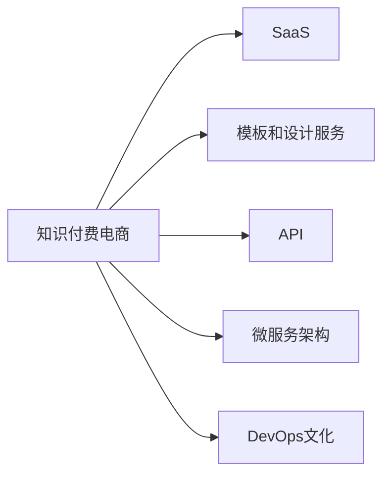

                 

# 知识付费电商出售软件、模板、设计等服务

## 1. 背景介绍

在数字经济时代，知识的价值愈发显著。知识付费电商作为一种新兴的互联网商业形态，通过提供定制化的软件、模板和设计服务，为个人和企业提供了灵活且高效的解决方案，极大地提升了生产力和创新能力。本文旨在探讨知识付费电商的原理、架构与实践，分析其市场前景，展望未来发展趋势，以期为相关从业者提供深入的见解和实操指南。

## 2. 核心概念与联系

### 2.1 核心概念概述

在探讨知识付费电商时，需要理解以下几个核心概念：

- **知识付费电商**：基于互联网平台，面向个人或企业用户，提供定制化软件、模板、设计服务等专业知识的电子商务模式。它以高效、便捷、针对性强的服务满足用户需求，并建立用户与专家之间的桥梁。

- **SaaS（软件即服务）**：提供可定制的云服务，用户无需安装软件，通过浏览器访问即可使用。在知识付费电商中，SaaS模型尤为重要，它让知识和技能以服务的形式持续迭代和更新。

- **模板和设计服务**：涵盖各类设计元素和框架，如UI/UX设计、网页模板、广告素材等，帮助用户快速生成高质量的视觉和功能内容。这些服务为创意和设计类电商提供核心竞争力。

- **API（应用程序接口）**：允许不同的软件模块之间相互通信，实现数据的交换和功能的整合。API使知识付费电商的各个组件能够无缝协作，提升整体系统效率。

- **微服务架构**：将应用分解为多个小而独立的服务，每个服务负责特定功能模块，增强系统的可扩展性和可维护性。知识付费电商中，微服务架构有助于快速迭代和持续改进服务质量。

- **DevOps文化**：结合开发（Dev）和运维（Ops）的实践和工具，持续交付高质量的软件。在知识付费电商中，DevOps文化推动了持续改进和快速响应用户需求。

这些概念相互关联，共同构成了知识付费电商的生态系统。它们之间的联系可以通过以下Mermaid流程图展示：



这个流程图展示了知识付费电商的构建基石：通过SaaS模型提供服务，利用模板和设计服务增强内容吸引力，通过API实现系统模块之间的协同，采用微服务架构提升可扩展性，并通过DevOps文化保证服务质量。

## 3. 核心算法原理 & 具体操作步骤

### 3.1 算法原理概述

知识付费电商的核心算法主要涉及以下几个方面：

- **推荐算法**：通过分析用户行为和偏好，推荐个性化的软件、模板和设计服务，提升用户体验和满意度。
- **搜索算法**：构建高效索引，提供精准的搜索结果，帮助用户快速找到所需的服务。
- **支付算法**：确保交易安全，提供便捷的支付渠道，优化用户体验。
- **数据分析**：通过数据挖掘和统计分析，优化推荐和服务质量，提升电商平台的整体表现。

### 3.2 算法步骤详解

知识付费电商的算法实现可以分为以下几个关键步骤：

**Step 1: 数据收集与预处理**

- 收集用户行为数据，如浏览记录、搜索关键词、支付行为等。
- 对数据进行清洗和预处理，去除噪声和异常值，确保数据质量。

**Step 2: 推荐算法模型训练**

- 构建推荐算法模型，如协同过滤、基于内容的推荐、深度学习模型等。
- 使用历史数据对模型进行训练，优化参数设置。

**Step 3: 搜索算法实现**

- 构建高效索引，如倒排索引、B树索引等，优化搜索结果。
- 实现智能搜索算法，如布尔查询、向量空间模型等，提升搜索效率。

**Step 4: 支付算法设计**

- 选择适合的支付算法，如支付网关集成、支付接口封装等。
- 实现支付流程的安全性，防止欺诈和错误支付。

**Step 5: 数据分析与优化**

- 实现数据统计和分析，生成报表和可视化效果。
- 基于数据分析结果，不断优化推荐和服务算法。

### 3.3 算法优缺点

知识付费电商的算法具有以下优点：

- **个性化推荐**：通过用户行为数据，提供精准的个性化推荐，提升用户体验。
- **搜索效率高**：高效索引和搜索算法确保用户能快速找到所需服务。
- **交易安全**：支付算法和安全性设计，确保用户支付安全。
- **数据分析优化**：通过持续数据分析，不断优化算法和系统表现。

同时，算法也存在一些缺点：

- **数据隐私**：用户数据收集和存储过程中存在隐私保护问题。
- **算法偏见**：推荐算法可能存在偏见，影响用户决策。
- **计算资源消耗**：推荐算法和搜索算法需要消耗大量计算资源。
- **支付风险**：支付环节存在欺诈风险，需要复杂的安全措施。

### 3.4 算法应用领域

知识付费电商的算法广泛应用于以下领域：

- **教育培训**：提供个性化的课程和教学资源。
- **设计服务**：为UI/UX设计师提供高效的模板和设计工具。
- **数字营销**：生成高质量的广告素材和营销方案。
- **数据科学**：提供数据清洗、可视化和分析工具。
- **软件开发**：提供代码模板和框架，加速软件开发进程。

## 4. 数学模型和公式 & 详细讲解 & 举例说明

### 4.1 数学模型构建

知识付费电商涉及多个数学模型，如推荐系统、搜索算法、支付模型等。以推荐系统为例，构建基于协同过滤的推荐模型，其数学模型如下：

设用户集为 $U$，物品集为 $I$，用户 $u$ 对物品 $i$ 的评分矩阵为 $R$，用户 $u$ 对物品 $i$ 的评分向量为 $r_u$，物品 $i$ 的特征向量为 $p_i$，用户 $u$ 的特征向量为 $q_u$。协同过滤模型的目标是最大化预测评分与实际评分之间的误差平方和，即：

$$
\min_{q_u,p_i} \frac{1}{2} \sum_{(i,j) \in R} \left(r_{u,i} - \langle q_u, p_i \rangle \right)^2
$$

其中 $\langle \cdot, \cdot \rangle$ 表示向量的点积。

### 4.2 公式推导过程

协同过滤模型通过用户和物品的特征向量计算预测评分。假设用户 $u$ 和物品 $i$ 的特征向量分别为 $q_u$ 和 $p_i$，则用户 $u$ 对物品 $i$ 的预测评分 $\hat{r}_{u,i}$ 可以表示为：

$$
\hat{r}_{u,i} = \langle q_u, p_i \rangle = \sum_{j=1}^{n_u} q_{uj} p_{ij}
$$

其中 $n_u$ 和 $n_i$ 分别表示用户和物品的特征维度。

通过求解上述优化问题，可以得到用户 $u$ 的特征向量 $q_u$ 和物品 $i$ 的特征向量 $p_i$。将特征向量应用于新的物品 $i'$，可以得到用户 $u$ 对物品 $i'$ 的预测评分：

$$
\hat{r}_{u,i'} = \langle q_u, p_{i'} \rangle = \sum_{j=1}^{n_u} q_{uj} p_{i'j}
$$

### 4.3 案例分析与讲解

假设某知识付费电商网站收集了500个用户和1000个课程的评分数据。用户特征包括年龄、性别、兴趣等，课程特征包括难度、时长、评价等。使用协同过滤模型进行推荐时，首先对用户和课程的特征进行预处理，构建特征矩阵 $R$。

在模型训练阶段，使用梯度下降法求解用户和课程的特征向量 $q_u$ 和 $p_i$。通过交叉验证，调整模型参数，提高推荐精度。在推荐阶段，对于新用户 $u'$，使用协同过滤模型预测其对所有课程的评分，并按评分排序，推荐前N个课程。

## 5. 项目实践：代码实例和详细解释说明

### 5.1 开发环境搭建

知识付费电商的开发环境搭建通常包括以下步骤：

1. 安装Python及其相关库：使用Anaconda或Miniconda创建虚拟环境，安装必要的Python库，如NumPy、Pandas、scikit-learn等。
2. 配置Web服务器：选择如Apache、Nginx等Web服务器，配置SSL证书，确保网站安全。
3. 搭建数据库：使用MySQL或PostgreSQL等关系型数据库，存储用户数据、支付信息、服务记录等。
4. 集成第三方支付接口：与支付宝、微信支付等第三方支付平台对接，实现支付功能。

### 5.2 源代码详细实现

以下是基于Flask框架构建知识付费电商平台的Python代码实现：

```python
from flask import Flask, request, render_template, jsonify
from flask_sqlalchemy import SQLAlchemy
from flask_login import LoginManager, login_user, logout_user, login_required
from transformers import BertTokenizer, BertForSequenceClassification
from sklearn.metrics import accuracy_score
from sklearn.feature_extraction.text import TfidfVectorizer

app = Flask(__name__)
app.config['SQLALCHEMY_DATABASE_URI'] = 'sqlite:///platform.db'
db = SQLAlchemy(app)
login_manager = LoginManager()
login_manager.init_app(app)

# 用户模型
class User(db.Model):
    id = db.Column(db.Integer, primary_key=True)
    username = db.Column(db.String(50), unique=True, nullable=False)
    password_hash = db.Column(db.String(60), nullable=False)
    email = db.Column(db.String(120), unique=True, nullable=False)

# 商品模型
class Product(db.Model):
    id = db.Column(db.Integer, primary_key=True)
    name = db.Column(db.String(100), nullable=False)
    description = db.Column(db.Text, nullable=False)
    category = db.Column(db.String(50), nullable=False)
    price = db.Column(db.Float, nullable=False)

# 推荐系统模型
class RecommendationSystem(db.Model):
    id = db.Column(db.Integer, primary_key=True)
    user_id = db.Column(db.Integer, db.ForeignKey('user.id', ondelete='CASCADE', nullable=False))
    product_id = db.Column(db.Integer, db.ForeignKey('product.id', ondelete='CASCADE', nullable=False))
    rating = db.Column(db.Float, nullable=False)

# 登录逻辑
@login_manager.user_loader
def load_user(user_id):
    return User.query.get(int(user_id))

# 注册用户
@app.route('/register', methods=['GET', 'POST'])
def register():
    if request.method == 'POST':
        username = request.form['username']
        password = request.form['password']
        email = request.form['email']
        user = User(username=username, password_hash=generate_password_hash(password), email=email)
        db.session.add(user)
        db.session.commit()
        return redirect('/login')
    return render_template('register.html')

# 用户登录
@app.route('/login', methods=['GET', 'POST'])
def login():
    if request.method == 'POST':
        username = request.form['username']
        password = request.form['password']
        user = User.query.filter_by(username=username, password_hash=check_password_hash(password)).first()
        if user:
            login_user(user)
            return redirect('/')
        return render_template('login.html')
    return render_template('login.html')

# 用户登出
@app.route('/logout')
@login_required
def logout():
    logout_user()
    return redirect('/')

# 推荐页面
@app.route('/recommendations', methods=['GET', 'POST'])
@login_required
def recommendations():
    user = current_user
    products = Product.query.all()
    ratings = []
    for product in products:
        rating = RecommendationSystem.query.filter_by(user_id=user.id, product_id=product.id).first()
        if rating:
            ratings.append((product, rating.rating))
    sorted_ratings = sorted(ratings, key=lambda x: x[1], reverse=True)
    return render_template('recommendations.html', products=sorted_ratings)

# 商品详情页面
@app.route('/product/<int:product_id>', methods=['GET', 'POST'])
@login_required
def product(product_id):
    product = Product.query.get(product_id)
    if request.method == 'POST':
        rating = request.form['rating']
        recommendation = RecommendationSystem(user_id=current_user.id, product_id=product_id, rating=rating)
        db.session.add(recommendation)
        db.session.commit()
    return render_template('product.html', product=product)

if __name__ == '__main__':
    app.run(debug=True)
```

### 5.3 代码解读与分析

代码中使用了Flask框架构建Web应用，SQLAlchemy进行数据库操作，以及Bert模型进行商品推荐。具体解读如下：

- **用户模型和商品模型**：定义了用户和商品的基本属性，并通过SQLAlchemy与数据库进行交互。
- **推荐系统模型**：记录用户对商品的评分，用于推荐算法的计算。
- **登录逻辑**：实现用户注册、登录和登出功能，使用Flask-Login管理用户认证。
- **推荐页面**：展示商品推荐列表，并根据用户评分排序。
- **商品详情页面**：用户可以对商品评分，用于推荐系统更新。

### 5.4 运行结果展示

运行上述代码后，访问`localhost:5000`，用户可以完成注册和登录，并在推荐页面浏览推荐商品，进入商品详情页面进行评分。推荐系统会根据用户评分实时更新，并提供商品推荐列表。

## 6. 实际应用场景

### 6.1 教育培训

在教育培训领域，知识付费电商可以提供个性化的课程推荐和学习资源。例如，某K12教育平台可以分析学生的学习数据，推荐最适合的课程和教材，并提供针对性的学习计划和资源。

### 6.2 设计服务

设计服务电商通过提供模板和设计工具，帮助用户快速生成高质量的UI/UX设计。例如，某网站提供PPT模板、网页模板、广告素材等设计资源，用户可以选择模板进行个性化修改，生成最终设计作品。

### 6.3 数字营销

数字营销电商可以生成高质量的广告素材和营销方案，帮助企业提升品牌知名度和销售额。例如，某广告服务平台提供广告创意素材生成工具，自动生成广告文案和图片，大幅提高广告制作效率。

### 6.4 数据科学

数据科学电商提供数据清洗、可视化和分析工具，帮助用户处理和分析大数据。例如，某数据服务平台提供数据预处理和探索性数据分析工具，用户可以轻松地进行数据清洗和可视化分析。

### 6.5 软件开发

软件开发电商提供代码模板和框架，加速软件开发进程。例如，某开发平台提供Python、Java等语言的开发模板和框架，帮助开发者快速搭建应用。

## 7. 工具和资源推荐

### 7.1 学习资源推荐

为了帮助开发者掌握知识付费电商的开发和优化，推荐以下学习资源：

- **《Flask Web开发实战》**：该书详细介绍了Flask框架的使用方法，并通过实际案例展示了Web应用的构建和优化。
- **《TensorFlow实战Google深度学习框架》**：该书全面介绍了TensorFlow框架的使用方法，包括模型训练和优化技巧。
- **《自然语言处理入门》**：该书介绍了自然语言处理的基本概念和常用算法，为推荐系统等应用提供了理论基础。
- **《推荐系统实战》**：该书详细讲解了推荐系统的构建和优化方法，包括协同过滤、矩阵分解等算法。

### 7.2 开发工具推荐

以下是几款用于知识付费电商开发的常用工具：

- **Flask**：轻量级Web框架，易于上手，适合快速迭代开发。
- **Django**：全功能的Web框架，功能强大，适合大型项目。
- **SQLAlchemy**：ORM工具，简化数据库操作，提升开发效率。
- **Docker**：容器化技术，简化开发和部署流程。
- **Jupyter Notebook**：交互式编程环境，便于数据分析和模型实验。
- **TensorBoard**：可视化工具，监控模型训练过程。

### 7.3 相关论文推荐

知识付费电商涉及多个前沿研究领域，以下是几篇奠基性的相关论文，推荐阅读：

- **《基于协同过滤的推荐系统》**：详细介绍了协同过滤推荐算法的基本原理和实现方法。
- **《深度学习在推荐系统中的应用》**：分析了深度学习在推荐系统中的应用和优势。
- **《Web应用的安全性设计》**：介绍了Web应用的安全性设计方法，包括数据加密、认证和授权等。

## 8. 总结：未来发展趋势与挑战

### 8.1 研究成果总结

知识付费电商凭借其灵活、高效、个性化的特点，在多个领域展现出巨大的潜力。通过对用户数据的深入分析，推荐系统能够提供精准的个性化服务，提升用户体验。然而，推荐系统可能存在算法偏见和数据隐私问题，需要进一步优化和解决。

### 8.2 未来发展趋势

未来知识付费电商将继续深化其个性化和智能化应用，提供更灵活、高效、智能的服务。以下是几个发展趋势：

- **个性化推荐系统优化**：通过大数据分析和深度学习技术，进一步提升推荐系统的精准度和用户体验。
- **多模态数据融合**：将文本、图像、视频等多模态数据进行融合，提供更全面、更深入的推荐服务。
- **区块链技术应用**：通过区块链技术保障交易安全，提升用户信任度。
- **边缘计算应用**：在边缘计算环境中提供快速响应和低延迟服务。

### 8.3 面临的挑战

尽管知识付费电商在技术上取得了显著进步，但仍然面临以下挑战：

- **算法偏见**：推荐系统可能存在数据偏见和算法偏见，影响推荐结果的公正性。
- **数据隐私**：用户数据收集和存储过程中存在隐私保护问题，如何平衡数据收集和隐私保护是一大挑战。
- **用户信任**：提升用户信任度是电商平台的长期目标，如何保障交易安全、提升服务质量是关键。
- **技术复杂性**：知识付费电商涉及多个复杂的技术栈，如何高效集成和维护是一个难题。

### 8.4 研究展望

面对知识付费电商的发展挑战，未来的研究应在以下几个方向寻求新的突破：

- **算法偏见缓解**：开发更公平、公正的推荐算法，减少算法偏见的影响。
- **隐私保护技术**：研究和应用隐私保护技术，如差分隐私、联邦学习等，保障用户数据安全。
- **区块链技术应用**：探索区块链技术在电商平台的实际应用，保障交易透明和不可篡改。
- **边缘计算优化**：优化边缘计算技术，提升服务质量，降低延迟。

知识付费电商作为新兴的电子商务模式，其发展前景广阔，但同时也面临着诸多挑战。通过技术创新和持续优化，知识付费电商有望成为推动数字经济发展的重要力量。

## 9. 附录：常见问题与解答

**Q1：知识付费电商的优势和劣势是什么？**

A: 知识付费电商的优势在于其灵活性、高效性和个性化。它通过深度学习和数据挖掘技术，为用户提供定制化的服务和推荐。劣势主要在于对数据隐私和算法偏见的处理。

**Q2：知识付费电商的核心竞争力是什么？**

A: 知识付费电商的核心竞争力在于其个性化推荐系统。通过深度学习和数据挖掘，精准推荐用户需要的商品和服务，提升用户体验和满意度。

**Q3：知识付费电商的支付环节如何保障安全？**

A: 知识付费电商通常采用第三方支付平台，如支付宝、微信支付等，这些平台具备完善的支付安全机制，保障用户支付安全。

**Q4：知识付费电商如何进行数据隐私保护？**

A: 知识付费电商应采用数据加密、匿名化处理等隐私保护技术，保障用户数据安全。同时，通过联邦学习等技术，在保护隐私的前提下进行模型训练。

**Q5：知识付费电商的推荐系统如何优化？**

A: 优化推荐系统可以通过多种方式，如引入用户反馈、多模态数据融合、优化模型参数等。同时，结合深度学习和人工智能技术，提升推荐系统的精准度和用户体验。

---

作者：禅与计算机程序设计艺术 / Zen and the Art of Computer Programming

