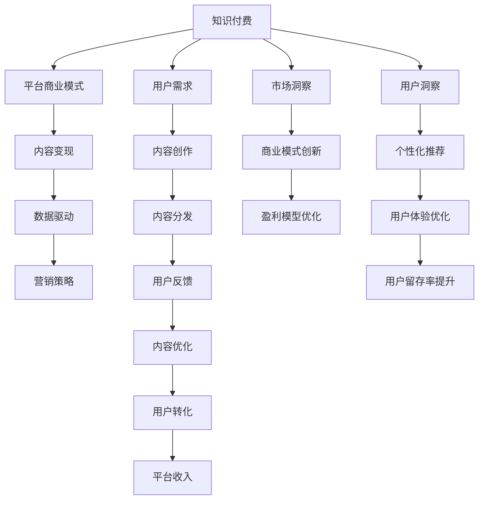

                 

# 知识付费的商业模式与盈利秘诀探究

> 关键词：知识付费,商业模式,盈利秘诀,技术驱动,用户需求,市场洞察,价值创造,数据驱动,营销策略

## 1. 背景介绍

### 1.1 问题由来

知识付费作为互联网经济的一个新兴领域，近年来迅速崛起。伴随信息爆炸时代的到来，用户对知识的需求和获取方式发生了深刻变化。与此同时，内容生产者也面临着信息过载、变现困难等问题，亟需寻找新的收入模式和商业机会。在此背景下，知识付费模式应运而生，通过技术手段，为用户提供个性化、深度化、系统化的知识服务，同时为内容创作者提供稳定的收入来源。

### 1.2 问题核心关键点

知识付费的商业模式主要围绕知识生产和消费、价格制定与策略、市场推广与用户获取、内容变现与价值循环等关键环节展开。本文章将重点关注这些核心关键点，从技术、用户、市场、盈利等维度，全面探讨知识付费模式的内在逻辑与实践路径。

## 2. 核心概念与联系

### 2.1 核心概念概述

为更好地理解知识付费的商业模式，本节将介绍几个密切相关的核心概念：

- 知识付费(Knowledge Pay)：用户为获取知识内容，支付一定的费用。这种模式通过付费机制，激励内容创作者持续生产优质内容，满足用户个性化、深度化的知识需求。

- 平台商业模式(Platform Business Model)：通过构建知识内容供给与需求的平台，连接内容创作者与用户，实现双赢的商业模式。平台为创作者提供变现渠道，为用户获取价值信息。

- 内容变现(Content Monetization)：指将内容转化为有价值的商品或服务，从而实现商业盈利的过程。知识付费模式即是一种典型的内容变现方式。

- 数据驱动(DataSource Driven)：通过大数据分析与挖掘，洞察用户需求、预测市场趋势，指导内容推荐与营销策略，提升平台的用户粘性和变现效率。

- 营销策略(Marketing Strategy)：通过精心设计的营销活动，吸引目标用户群体，提升品牌知名度和用户转化率。

这些核心概念之间的逻辑关系可以通过以下Mermaid流程图来展示：



这个流程图展示出知识付费商业模式的整体结构：

1. 用户需求触发内容创作。
2. 平台通过内容分发满足用户需求。
3. 内容创作者通过内容变现获得收入。
4. 平台利用数据驱动优化内容推荐与营销策略。
5. 用户通过平台获取个性化价值信息。

以上各环节相互支撑，共同推动知识付费平台的发展。

## 3. 核心算法原理 & 具体操作步骤
### 3.1 算法原理概述

知识付费的盈利秘诀，在于精准地匹配用户需求与高质量内容，实现内容的有效传播与变现。算法驱动的平台，通过数据驱动和机器学习技术，能够高效实现这一过程。

在知识付费平台上，数据驱动和机器学习技术主要应用于以下几个方面：

- **个性化推荐系统**：通过分析用户行为数据，推荐用户感兴趣的知识内容。个性化推荐系统可以显著提升用户粘性和留存率。

- **内容分发优化**：通过内容质量和受众特征的多维度分析，合理分配流量，优化内容分发效果，提高内容变现率。

- **用户行为预测**：利用用户历史行为数据，预测用户未来行为，指导精准营销策略。

### 3.2 算法步骤详解

知识付费平台的算法实现，一般包括以下几个关键步骤：

**Step 1: 数据收集与预处理**
- 收集用户行为数据（阅读时长、评分、评论等）和内容质量数据（观看次数、点击率等）。
- 对数据进行清洗、去重、归一化等预处理，确保数据质量。

**Step 2: 特征工程**
- 设计特征向量，提取用户行为、内容质量、用户属性等关键特征。
- 采用PCA、LDA等降维技术，减少特征维度。

**Step 3: 模型训练**
- 选择合适的机器学习模型，如协同过滤、深度神经网络等。
- 使用训练集数据进行模型训练，优化模型参数。

**Step 4: 模型评估**
- 使用验证集数据评估模型性能，根据评估结果调整模型参数。
- 采用AUC、准确率、召回率、F1分数等指标评估推荐系统的效果。

**Step 5: 模型部署**
- 将训练好的模型部署到推荐系统服务器。
- 实时接收用户行为数据，进行实时推荐。

**Step 6: 反馈与优化**
- 定期收集用户反馈，分析用户行为，进行模型优化。
- 使用A/B测试，评估新算法与旧算法的性能差异。

### 3.3 算法优缺点

知识付费平台的算法驱动模式具有以下优点：

1. 提升用户粘性。通过个性化推荐系统，平台可以精准满足用户需求，提升用户满意度。
2. 优化内容分发。合理分配流量，提高内容变现率。
3. 数据驱动决策。利用数据洞察用户行为，指导精准营销策略。

同时，这种模式也存在一定的局限性：

1. 算法复杂度高。个性化推荐和内容分发涉及大量特征提取和模型训练，需要较高计算资源。
2. 模型鲁棒性差。推荐系统的预测效果受数据质量影响较大，可能存在偏差。
3. 隐私保护问题。推荐算法需要收集和分析用户数据，存在隐私泄露风险。

尽管存在这些局限性，但通过合理设计和优化算法，知识付费平台仍然可以有效地利用数据驱动技术，提升盈利能力。

### 3.4 算法应用领域

知识付费平台的算法驱动模式，已经在多个领域得到了广泛应用，例如：

- 在线教育：如Coursera、Udacity等平台，通过个性化推荐，帮助用户选择适合自己的课程。
- 职业培训：如LinkedIn Learning、Udemy，根据用户职业背景，推荐相关技能培训课程。
- 健康医疗：如Ora.com、HealthTap，通过推荐个性化健康咨询和医疗服务。
- 职业发展：如Behance、Dribbble，根据用户作品风格，推荐相关设计类教程和资源。

这些领域的大规模应用，展示了知识付费模式在教育、职业、健康等多个领域的巨大潜力和广泛前景。

## 4. 数学模型和公式 & 详细讲解 & 举例说明

### 4.1 数学模型构建

知识付费平台的算法实现，一般基于以下数学模型：

- **协同过滤推荐系统**：利用用户和内容的评分数据，推荐用户未评分但相似用户评分高的内容。

  $$
  \hat{y}_{ui} = \frac{\sum_{j \neq i} w_{uj} \cdot y_{uj}}{\sum_{j \neq i} w_{uj}} \quad (i \neq j)
  $$

- **深度神经网络推荐系统**：利用用户行为数据和内容质量数据，通过多层神经网络进行内容推荐。

  $$
  \hat{y}_{ui} = \text{sigmoid}(W_u \cdot x_i + b_u)
  $$

### 4.2 公式推导过程

以下以协同过滤推荐系统为例，推导推荐算法的基本公式。

假设有一个用户集合$U$，内容集合$I$，每个用户$u$对内容$i$的评分$y_{ui}$。协同过滤算法的核心思想是寻找用户之间的相似性，基于相似性进行推荐。

设用户$u$和用户$v$的相似度为$s_{uv}$，可以通过余弦相似度、皮尔逊相关系数等方法计算。协同过滤算法的推荐公式如下：

$$
\hat{y}_{ui} = \frac{\sum_{j \neq i} s_{uj} \cdot y_{uj}}{\sum_{j \neq i} s_{uj}}
$$

其中$s_{uj}$表示用户$u$和内容$j$的相似度。

通过不断优化相似度计算方法和推荐公式，协同过滤推荐系统可以逐步提升推荐效果。

### 4.3 案例分析与讲解

某在线教育平台利用协同过滤推荐系统，进行个性化课程推荐。具体步骤如下：

1. 收集用户对各课程的评分数据。
2. 利用用户行为数据，计算用户之间的相似度。
3. 对每个用户，计算相似用户对该课程的评分加权平均值，作为推荐评分。
4. 根据推荐评分，进行课程推荐。

案例分析结果表明，协同过滤推荐系统能够显著提升用户满意度，提高课程购买转化率，提升平台的整体收入。

## 5. 项目实践：代码实例和详细解释说明
### 5.1 开发环境搭建

在进行知识付费平台的算法实践前，我们需要准备好开发环境。以下是使用Python进行TensorFlow开发的环境配置流程：

1. 安装Anaconda：从官网下载并安装Anaconda，用于创建独立的Python环境。

2. 创建并激活虚拟环境：
```bash
conda create -n tf-env python=3.8 
conda activate tf-env
```

3. 安装TensorFlow：根据CUDA版本，从官网获取对应的安装命令。例如：
```bash
conda install tensorflow -c tf -c conda-forge
```

4. 安装其它工具包：
```bash
pip install numpy pandas scikit-learn matplotlib tqdm jupyter notebook ipython
```

完成上述步骤后，即可在`tf-env`环境中开始算法实践。

### 5.2 源代码详细实现

这里我们以在线教育平台的个性化推荐系统为例，给出使用TensorFlow进行协同过滤算法实现的代码实现。

首先，定义协同过滤推荐系统的输入数据：

```python
import tensorflow as tf

# 构建用户和内容的评分矩阵
train_data = tf.keras.layers.experimental.preprocessing.SparseTensor.from_matrix(train_matrix)

# 定义相似度计算函数
def similarity(u, v):
    return tf.nn.cosine_similarity(train_data[u], train_data[v])

# 定义推荐公式
def collaborative_filtering(train_data, similarity):
    return tf.reduce_mean(similarity(train_data, tf.transpose(train_data)), axis=1)
```

然后，定义训练和评估函数：

```python
# 定义训练函数
def train_collaborative_filtering(train_data, epochs):
    for epoch in range(epochs):
        # 训练协同过滤推荐系统
        train_loss = collaborative_filtering(train_data, similarity)
        train_loss = tf.reduce_mean(train_loss)
        train_loss.backward()
        optimizer.apply_gradients(zip(train_loss.backward(), train_data.trainable_weights))
    return train_loss

# 定义评估函数
def evaluate_collaborative_filtering(train_data, test_data, similarity):
    # 计算推荐系统在测试集上的准确率
    predicted_ratings = collaborative_filtering(train_data, similarity)
    return accuracy(predicted_ratings, test_data.labels)
```

最后，启动训练流程并在测试集上评估：

```python
epochs = 10
batch_size = 64

for epoch in range(epochs):
    loss = train_collaborative_filtering(train_data, epochs)
    print(f"Epoch {epoch+1}, train loss: {loss:.3f}")
    
print(f"Epoch {epoch+1}, test accuracy: {evaluate_collaborative_filtering(train_data, test_data, similarity)}")
```

以上就是使用TensorFlow对协同过滤推荐系统进行在线教育平台个性化推荐任务开发的完整代码实现。可以看到，TensorFlow提供了丰富的API和工具，使得协同过滤推荐系统的开发变得相对简单高效。

### 5.3 代码解读与分析

让我们再详细解读一下关键代码的实现细节：

**train_data变量**：
- 定义用户和内容的评分矩阵，用稀疏矩阵表示，其中非零元素表示用户对内容的评分。

**similarity函数**：
- 计算两个用户之间的相似度，采用余弦相似度。

**collaborative_filtering函数**：
- 对每个用户计算其未评分内容的推荐评分，采用协同过滤推荐公式。

**train_collaborative_filtering函数**：
- 训练协同过滤推荐系统，通过反向传播更新模型参数，最小化损失函数。

**evaluate_collaborative_filtering函数**：
- 评估推荐系统在测试集上的准确率，输出评估结果。

**训练流程**：
- 定义总的训练轮数和批量大小，开始循环迭代
- 每个epoch内，在训练集上训练，输出平均loss
- 在测试集上评估，输出准确率

可以看到，TensorFlow的自动微分功能和优化器功能使得协同过滤推荐系统的训练过程变得简洁高效。开发者可以将更多精力放在特征工程、模型优化等高层逻辑上，而不必过多关注底层的实现细节。

当然，工业级的系统实现还需考虑更多因素，如模型的保存和部署、超参数的自动搜索、更灵活的任务适配层等。但核心的推荐范式基本与此类似。

## 6. 实际应用场景
### 6.1 在线教育

知识付费模式在在线教育领域得到了广泛应用。传统教育往往采用统一的课程设计，难以满足不同用户的需求。而知识付费平台通过个性化推荐，将用户引导到最适合自己兴趣和水平的课程，提升了学习的效率和效果。

例如，Coursera平台利用协同过滤算法，推荐用户未选修但学习难度接近的课程。用户可以通过学习路径图，系统了解自己的学习进展，快速找到下一步推荐课程。

### 6.2 职业培训

职业培训市场通常供需不平衡，用户难以找到合适的课程。通过知识付费平台，用户可以根据自身职业背景和技能需求，获得定制化的职业培训课程。

例如，LinkedIn Learning平台根据用户的职业、公司、兴趣等信息，推荐相关技能培训课程，用户可以自主选择感兴趣的课程，有效提升自己的职业技能。

### 6.3 健康医疗

健康医疗领域信息量大且专业性强，普通用户难以筛选出有用信息。知识付费平台通过个性化推荐，为用户推荐实用的健康咨询和医疗服务，提升健康水平。

例如，Ora.com平台根据用户健康数据，推荐个性化的健康咨询服务。用户可以与专业医生进行在线沟通，获得科学的健康建议。

### 6.4 未来应用展望

随着知识付费平台算法的不断演进，未来知识付费模式将会在更多领域得到应用，为各行各业带来变革性影响。

在智慧医疗领域，知识付费平台可以为患者提供个性化的健康咨询和医疗服务，帮助医生制定科学的治疗方案。

在智能教育领域，个性化推荐系统能够帮助学生自主选择适合自己的学习路径，提升学习效果。

在智能家居领域，知识付费平台可以为家庭提供个性化的健康、环保、节能等生活服务，提升家庭生活质量。

此外，在金融、法律、设计、艺术等多个领域，知识付费平台也能提供专业化的知识服务，满足用户的深层次需求。相信随着技术的发展和市场的扩展，知识付费模式将在更多领域大放异彩。

## 7. 工具和资源推荐
### 7.1 学习资源推荐

为了帮助开发者系统掌握知识付费的算法基础和实践技巧，这里推荐一些优质的学习资源：

1. 《推荐系统实战》系列博文：由大模型技术专家撰写，深入浅出地介绍了推荐系统原理、协同过滤算法、深度神经网络等前沿话题。

2. 《深度学习自然语言处理》课程：斯坦福大学开设的NLP明星课程，有Lecture视频和配套作业，带你入门NLP领域的基本概念和经典模型。

3. 《自然语言处理与深度学习》书籍：内容涵盖NLP基础知识和推荐系统原理，适合初学者和进阶者阅读。

4. Kaggle竞赛：参加Kaggle推荐系统竞赛，实践数据驱动算法，提升实战能力。

5. arXiv论文：查阅最新推荐系统论文，跟踪前沿技术进展。

通过对这些资源的学习实践，相信你一定能够快速掌握知识付费平台的算法精髓，并用于解决实际的推荐问题。
###  7.2 开发工具推荐

高效的开发离不开优秀的工具支持。以下是几款用于知识付费平台推荐算法开发的常用工具：

1. TensorFlow：基于Python的开源深度学习框架，灵活动态的计算图，适合快速迭代研究。推荐系统有TensorFlow的预训练模型和工具库支持。

2. PyTorch：基于Python的开源深度学习框架，易于使用且灵活，适合自定义模型的开发。推荐系统也有PyTorch的预训练模型和工具库支持。

3. Scikit-learn：Python机器学习库，提供丰富且易用的算法和工具，支持快速原型开发。

4. Weights & Biases：模型训练的实验跟踪工具，可以记录和可视化模型训练过程中的各项指标，方便对比和调优。与主流深度学习框架无缝集成。

5. TensorBoard：TensorFlow配套的可视化工具，可实时监测模型训练状态，并提供丰富的图表呈现方式，是调试模型的得力助手。

6. Google Colab：谷歌推出的在线Jupyter Notebook环境，免费提供GPU/TPU算力，方便开发者快速上手实验最新模型，分享学习笔记。

合理利用这些工具，可以显著提升知识付费平台推荐算法的开发效率，加快创新迭代的步伐。

### 7.3 相关论文推荐

知识付费平台推荐算法的发展源于学界的持续研究。以下是几篇奠基性的相关论文，推荐阅读：

1. Implicit Collaborative Filtering via Matrix Factorization（隐式协同过滤）：提出矩阵分解的协同过滤方法，是推荐系统的经典算法。

2. Deep Matrix Factorization（深度矩阵分解）：提出使用深度神经网络进行协同过滤，提升推荐效果。

3. Attention-Based Recommender Systems（基于注意力机制的推荐系统）：引入注意力机制，提升推荐系统的个性化和泛化能力。

4. Adaptive Collaborative Filtering（自适应协同过滤）：提出自适应推荐算法，根据用户行为动态调整推荐策略。

5. Bandit Algorithms for Sequential Recommendations（序贯推荐算法）：提出强化学习算法，在推荐系统优化中取得重要进展。

这些论文代表了大模型推荐系统的演进脉络。通过学习这些前沿成果，可以帮助研究者把握学科前进方向，激发更多的创新灵感。

## 8. 总结：未来发展趋势与挑战
### 8.1 总结

本文对知识付费的商业模式进行了全面系统的介绍。首先阐述了知识付费在互联网经济中的兴起背景，明确了个性化推荐系统、内容变现和数据驱动等核心关键点，详细讲解了推荐系统的算法原理和具体操作步骤。通过本文的系统梳理，可以看到，知识付费平台正在成为在线教育、职业培训、健康医疗等领域的核心技术支撑，推动了各行业业务的数字化转型。

通过本文的学习，开发者应掌握推荐算法的数学模型、实现步骤和应用案例，深入理解知识付费平台的商业模式。只有全面掌握相关知识，才能设计出高效、稳定、可扩展的知识付费平台，真正实现用户的价值需求和创作者的变现目标。

### 8.2 未来发展趋势

展望未来，知识付费平台将呈现以下几个发展趋势：

1. 数据驱动决策更加普及。随着数据的积累和分析技术的进步，平台决策将更加智能化和个性化。

2. 推荐算法更加精准。通过深度学习、强化学习等技术，推荐系统将提升个性化推荐效果，提升用户满意度。

3. 平台服务更加多样化。知识付费平台将逐步拓展到更多垂直领域，提供更多样化的知识服务。

4. 用户体验更加优化。通过个性化推荐和内容分发，平台将提升用户粘性和留存率，提高平台整体盈利能力。

5. 人工智能深度融合。平台将深度融合人工智能技术，实现更加智能化的内容生产和推荐。

以上趋势凸显了知识付费平台的广阔前景。这些方向的探索发展，必将进一步提升平台的用户体验和盈利能力，为知识创作者提供更加精准的变现渠道。

### 8.3 面临的挑战

尽管知识付费平台在近年来取得了显著成就，但在迈向更加智能化、普适化应用的过程中，它仍面临诸多挑战：

1. 算法复杂度高。推荐系统涉及大量的特征工程和模型训练，需要较高计算资源。

2. 数据隐私问题。推荐算法需要收集和分析用户数据，存在隐私泄露风险。

3. 用户多样性。不同用户的需求差异巨大，难以用单一算法满足所有用户需求。

4. 内容版权问题。用户付费购买的知识内容可能涉及版权纠纷，平台需要严格管理版权问题。

5. 内容质量问题。平台需要严格审核内容质量，避免低劣内容影响用户体验。

6. 恶意行为防范。平台需要防范恶意内容生产和非法交易行为，保障平台健康发展。

这些挑战需要开发者不断优化算法，保护用户隐私，严格管理内容，防范恶意行为，确保平台的健康发展。

### 8.4 研究展望

面对知识付费平台面临的种种挑战，未来的研究需要在以下几个方面寻求新的突破：

1. 探索无监督推荐算法。摆脱对标注数据的依赖，利用自监督学习、主动学习等无监督方法，提升推荐效果。

2. 研究多模态推荐系统。融合文本、图像、语音等多种模态数据，提升推荐系统表现。

3. 引入因果推断机制。利用因果推断技术，提高推荐系统的稳定性，减少推荐偏差。

4. 开发适应性推荐算法。根据用户行为实时调整推荐策略，提高推荐效果。

5. 集成强化学习。将强化学习算法引入推荐系统，提升个性化推荐效果。

6. 应用区块链技术。利用区块链技术保护用户隐私和版权，提升平台信任度。

这些研究方向的探索，必将引领知识付费平台推荐技术迈向更高的台阶，为平台用户提供更加精准、安全、可靠的知识服务。

## 9. 附录：常见问题与解答

**Q1：知识付费平台的推荐算法是否适用于所有领域？**

A: 知识付费平台的推荐算法在大部分领域都能取得不错的效果，特别是对于有结构化、标准化数据的应用场景。但对于一些无法获取结构化数据，或数据质量低、噪音大的领域，如艺术、设计、时尚等，推荐效果可能不如预期。因此，推荐算法需要根据具体领域的特点进行定制化设计。

**Q2：如何提升知识付费平台的推荐准确率？**

A: 提升推荐准确率需要从数据、模型和算法等多个维度进行优化：
1. 数据清洗：通过数据预处理，去除噪音和异常数据。
2. 特征工程：提取更有效的特征，提升模型性能。
3. 模型选择：选择适合的推荐算法，如协同过滤、深度神经网络等。
4. 模型优化：通过超参数调优和模型集成，提升模型效果。
5. A/B测试：通过实验对比，评估新算法与旧算法的性能差异。

**Q3：知识付费平台如何保护用户隐私？**

A: 保护用户隐私是知识付费平台的重要责任。可以通过以下措施：
1. 数据匿名化：对用户数据进行去标识化处理，保护用户隐私。
2. 数据加密：对敏感数据进行加密存储和传输，防止数据泄露。
3. 隐私政策：制定明确的隐私政策，公开数据使用范围和处理方式。
4. 用户授权：在收集用户数据前，获取用户明确授权，保护用户知情权。
5. 区块链技术：利用区块链技术，记录数据使用轨迹，保障数据安全性。

**Q4：知识付费平台如何应对用户多样性需求？**

A: 应对用户多样性需求需要从多个方面进行优化：
1. 多模态推荐：融合文本、图像、语音等多种模态数据，提升推荐效果。
2. 定制化推荐：根据用户兴趣和行为，提供定制化推荐服务。
3. 数据驱动决策：利用数据挖掘技术，深入理解用户需求和行为，提供精准推荐。
4. 用户反馈：及时收集用户反馈，动态调整推荐策略，提升用户体验。

**Q5：知识付费平台的推荐系统如何应对版权问题？**

A: 知识付费平台需要严格管理版权问题，可以从以下几个方面进行优化：
1. 版权认证：在用户付费前，进行版权认证，确保内容合法。
2. 版权追踪：通过区块链技术，记录内容版权信息，保护版权所有者权益。
3. 用户授权：在内容上传前，获取作者明确授权，确保内容合法。
4. 版权保护：利用数字水印、加密技术等手段，保护内容版权。

通过以上措施，知识付费平台可以在保障用户权益的同时，避免版权纠纷，实现健康发展。

---

作者：禅与计算机程序设计艺术 / Zen and the Art of Computer Programming

