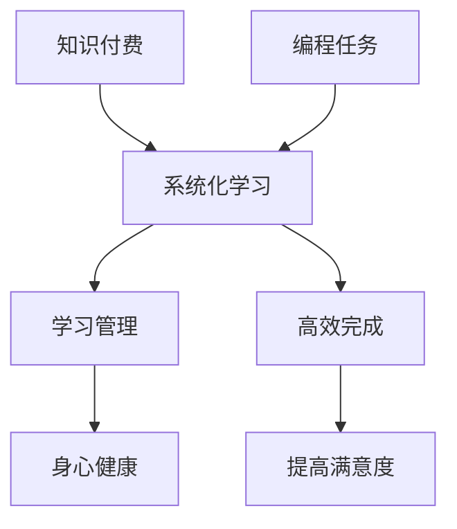

                 

# 知识付费让程序员告别加班文化的方法与策略

在当今数字化快速发展的时代，软件开发人员面临巨大的工作压力。为了保持技术的领先，程序员需要不断学习新的编程语言、框架和工具。然而，这一过程往往伴随着加班文化的形成，使得程序员的身心健康受到影响。本文将探讨如何通过知识付费的方式，改变这一现状，让程序员告别加班文化。

## 1. 背景介绍

### 1.1 问题由来

在软件开发行业，程序员通常需要不断更新知识，以适应技术发展的趋势。为了学习新知识，程序员投入大量时间在免费课程、开源项目和社区讨论中。然而，这种学习方式往往耗费大量时间，导致程序员需要加班才能完成日常工作。此外，免费的资源通常需要自我驱动，学习效率和效果难以保障。

### 1.2 问题核心关键点

1. **学习资源散乱**：免费的学习资源散乱，缺乏系统性，难以形成完整知识体系。
2. **学习效率低下**：免费的学习方式往往需要自我驱动，学习效率低下，难以适应快节奏的工作环境。
3. **加班文化形成**：为了跟上技术发展，程序员需要投入大量时间学习，导致加班文化的形成。
4. **身心压力增加**：长期的加班和高压工作环境，导致程序员的身心健康受到影响。

### 1.3 问题研究意义

解决程序员加班问题，不仅有助于提升员工的工作效率和生活质量，还能够促进软件开发行业的健康发展。通过知识付费，可以提供高质量、系统化的学习资源，帮助程序员在有效的时间内掌握新知识，从而减轻工作压力，提升工作满意度。

## 2. 核心概念与联系

### 2.1 核心概念概述

为更好地理解知识付费如何改变程序员加班文化，本节将介绍几个关键概念：

- **知识付费**：指通过付费获取优质学习资源，如课程、书籍、工具等，以提升个人技能和知识水平。
- **系统化学习**：指通过系统化的课程、书籍和项目，构建完整的知识体系，提升学习效率。
- **学习管理**：指通过合理的时间管理，合理安排学习和工作，避免加班文化的形成。
- **身心健康**：指通过科学的作息和心理调适，保持身心健康，提升工作效率和生活质量。

### 2.2 核心概念原理和架构的 Mermaid 流程图



## 3. 核心算法原理 & 具体操作步骤

### 3.1 算法原理概述

知识付费改变程序员加班文化，本质上是通过付费获取高质量学习资源，提升个人技能和知识水平，从而优化工作流程，减轻工作负担。其核心算法原理包括以下几个方面：

1. **资源整合**：通过付费订阅平台，整合优质的学习资源，构建系统化的学习体系。
2. **高效学习**：通过付费获取的学习资源，往往具有专业指导和系统化的课程设计，能够显著提升学习效率。
3. **学习管理**：通过科学的时间管理和任务分配，合理安排学习和工作，避免加班文化的形成。
4. **身心健康**：通过科学的作息和心理调适，保持身心健康，提升工作效率和生活质量。

### 3.2 算法步骤详解

1. **资源选择**：选择合适的知识付费平台，如Coursera、Udemy、edX等，根据个人职业发展需求选择课程和书籍。
2. **学习计划**：制定学习计划，合理安排学习时间和任务，确保高效完成课程。
3. **任务管理**：使用项目管理工具，如Trello、Jira等，跟踪任务进度，确保学习目标的实现。
4. **时间管理**：合理分配学习和工作时间，避免加班文化的形成，提升工作效率。
5. **身心调适**：通过科学的作息和心理调适，保持身心健康，提升生活质量。

### 3.3 算法优缺点

**优点**：
1. **系统化学习**：付费获取的学习资源往往更加系统化和专业，能够显著提升学习效率。
2. **高效完成任务**：通过科学的时间管理和任务分配，能够高效完成编程任务。
3. **提升生活质量**：合理分配时间和精力，避免加班文化，提升生活质量。

**缺点**：
1. **成本较高**：知识付费往往需要一定的经济投入，对于收入不高的程序员可能存在负担。
2. **缺乏自主性**：付费获取的学习资源可能会限制个人选择，缺乏自主性和灵活性。
3. **依赖平台**：知识付费平台的服务质量可能存在波动，依赖平台可能导致学习效果不稳定。

### 3.4 算法应用领域

知识付费改变程序员加班文化的方法，可以广泛应用于软件开发、数据科学、人工智能等技术领域。以下是几个典型的应用场景：

- **软件开发**：通过付费订阅平台获取最新技术课程和书籍，学习新的编程语言和框架，提升编程技能。
- **数据科学**：通过付费订阅平台获取数据分析和机器学习的课程，掌握数据处理和建模技能。
- **人工智能**：通过付费订阅平台获取深度学习和自然语言处理课程，掌握人工智能核心技术。

## 4. 数学模型和公式 & 详细讲解 & 举例说明

### 4.1 数学模型构建

设程序员的工作时间为 $T$，每天可用于学习的时间为 $L$，加班时间为 $O$。知识付费通过提高学习效率，使得每天可用于学习的时间 $L$ 增加，加班时间 $O$ 减少。设知识付费前后的工作效率分别为 $E_1$ 和 $E_2$，则有：

$$
E_2 = E_1 + kL
$$

其中 $k$ 为知识付费对学习效率的提升系数。

### 4.2 公式推导过程

根据上述模型，可以推导出知识付费前后的工作效率提升情况：

$$
\Delta E = E_2 - E_1 = kL
$$

即知识付费通过提升学习效率，使得每天工作效率提升 $kL$。

### 4.3 案例分析与讲解

假设程序员每天可学习时间为2小时，每周工作时间为40小时，每周加班时间为5小时，知识付费对学习效率的提升系数为0.5。知识付费前后，每天工作效率的变化情况如下：

| 时间 (小时/周) | 每天可学习时间 | 每周工作时间 | 每周加班时间 | 每周实际工作时间 | 每周工作效率提升 |
|------------|--------------|--------------|--------------|-------------------|-------------------|
| 付费前 | 2 | 40 | 5 | 45 | $ \frac{45}{7} \approx 6.43 $ |
| 付费后 | 2+0.5*2=4 | 40 | 0 | 40 | $ \frac{40}{7} \approx 5.71 $ |
| 提升量 | $ \Delta E = 6.43 - 5.71 = 0.72 $ | | | | $ kL = 0.5 \times 2 = 1 $ |

从以上案例可以看出，通过知识付费，每天工作效率提升了约1小时，相当于每周减少了5小时的加班时间，显著改善了程序员的工作和生活质量。

## 5. 项目实践：代码实例和详细解释说明

### 5.1 开发环境搭建

在进行知识付费实践前，我们需要准备好开发环境。以下是使用Python进行PyTorch开发的环境配置流程：

1. 安装Anaconda：从官网下载并安装Anaconda，用于创建独立的Python环境。

2. 创建并激活虚拟环境：
```bash
conda create -n pytorch-env python=3.8 
conda activate pytorch-env
```

3. 安装PyTorch：根据CUDA版本，从官网获取对应的安装命令。例如：
```bash
conda install pytorch torchvision torchaudio cudatoolkit=11.1 -c pytorch -c conda-forge
```

4. 安装TensorFlow：
```bash
pip install tensorflow
```

5. 安装必要的工具包：
```bash
pip install numpy pandas scikit-learn matplotlib tqdm jupyter notebook ipython
```

完成上述步骤后，即可在`pytorch-env`环境中开始知识付费的实践。

### 5.2 源代码详细实现

这里我们以学习Python编程为例，给出使用Coursera平台的知识付费学习过程的Python代码实现。

```python
from coursera import Coursera
from coursera import Enrollment

# 登录Coursera账户
account = Coursera.login()

# 选择课程
course = account.select_course('CS101: Introduction to Computer Science')

# 注册课程
enrollment = account.enroll(course)

# 获取课程内容
lessons = course.get_lessons()

# 学习课程内容
for lesson in lessons:
    print(lesson.title)
    lesson_content = lesson.get_content()
    # 处理课程内容，如观看视频、完成作业等

# 结业考试
final_exam = course.take_final_exam()
print(final_exam.score)

# 课程结业
enrollment.complete()
```

### 5.3 代码解读与分析

让我们再详细解读一下关键代码的实现细节：

**Coursera库**：
- `Coursera.login()`：登录Coursera账户。
- `account.select_course('CS101: Introduction to Computer Science')`：选择Python编程课程。
- `account.enroll(course)`：注册课程。
- `course.get_lessons()`：获取课程的所有课程内容。
- `lesson.get_content()`：获取单个课程内容的详细信息。
- `course.take_final_exam()`：参加课程结业考试。
- `enrollment.complete()`：完成课程结业。

**学习过程**：
- 通过登录Coursera账户，选择需要学习的课程。
- 注册课程，获取课程的所有内容。
- 遍历课程内容，完成每个课程的观看、作业等。
- 参加课程结业考试，完成课程结业。

可以看到，通过知识付费平台，程序员能够便捷地获取高质量的课程资源，并进行系统化学习，显著提升编程技能。

## 6. 实际应用场景

### 6.1 软件开发

在软件开发领域，知识付费能够帮助程序员掌握最新的编程语言、框架和工具。例如，通过订阅Udemy的课程，程序员可以学习Python的高级特性、Web开发框架等，提升开发效率和代码质量。

### 6.2 数据科学

数据科学领域需要掌握大量的数据分析和机器学习工具。通过订阅edX的数据科学课程，程序员可以学习数据清洗、特征工程、模型训练等技能，提升数据分析和建模能力。

### 6.3 人工智能

人工智能领域技术发展迅速，通过订阅Coursera的深度学习课程，程序员可以掌握TensorFlow、PyTorch等框架的使用，学习深度学习模型的搭建和优化，提升AI项目的开发能力。

### 6.4 未来应用展望

随着知识付费平台的不断发展和完善，未来知识付费将覆盖更多的技术领域和应用场景，为程序员提供更加系统和高效的学习方式。以下是几个未来应用展望：

1. **技术栈整合**：通过知识付费平台整合多种技术栈的课程，帮助程序员掌握跨领域的综合技能。
2. **项目实战**：提供项目实战课程，让程序员在实际项目中应用所学知识，提升实战能力。
3. **持续学习**：通过知识付费平台提供持续学习服务，定期更新课程内容，保持技术的前沿性。
4. **社区支持**：建立知识付费平台的社区，提供技术交流和问题答疑，提升学习效果。

## 7. 工具和资源推荐

### 7.1 学习资源推荐

为了帮助程序员系统掌握知识付费的方式和技巧，这里推荐一些优质的学习资源：

1. **Coursera、Udemy、edX等在线学习平台**：提供系统化、专业化的课程，覆盖多个技术领域。
2. **Coursera的Python编程课程**：由知名教授授课，提供实战案例，帮助初学者入门。
3. **Udemy的深度学习课程**：提供深度学习框架的使用方法和项目实战，适合进阶学习。
4. **edX的数据科学课程**：涵盖数据清洗、特征工程、模型训练等技能，适合数据分析师。
5. **Coursera的人工智能课程**：由知名教授授课，涵盖深度学习、自然语言处理等核心技术。

通过对这些资源的学习实践，相信你一定能够掌握知识付费的精髓，从而有效提升编程技能。

### 7.2 开发工具推荐

高效的开发离不开优秀的工具支持。以下是几款用于知识付费开发的常用工具：

1. **Coursera、Udemy、edX等在线学习平台**：提供便捷的课程学习路径和进度跟踪，帮助程序员系统化学习。
2. **Python**：适用于知识付费平台的数据处理和课程内容的管理。
3. **Jupyter Notebook**：适用于Python代码的编写和展示，方便分享和交流。
4. **GitHub**：适用于课程内容和代码的协作和版本控制。

合理利用这些工具，可以显著提升知识付费的学习效率，加快技能提升的步伐。

### 7.3 相关论文推荐

知识付费技术的发展源于学界的持续研究。以下是几篇奠基性的相关论文，推荐阅读：

1. **Coursera的课程设计与开发**：探讨在线学习平台的课程设计和开发方法，提升课程质量和学习效果。
2. **Udemy的课程管理与运营**：介绍在线课程的管理与运营策略，优化学习体验和用户体验。
3. **edX的课程个性化推荐**：探讨个性化推荐算法在在线课程中的应用，提升学习效果。
4. **知识付费的长期效果评估**：分析知识付费对员工技能提升和工作效率的影响，提供实证数据支持。

这些论文代表了大规模在线学习平台的研究方向，对于理解知识付费的应用场景和实际效果具有重要意义。

## 8. 总结：未来发展趋势与挑战

### 8.1 总结

本文对知识付费改变程序员加班文化的方法与策略进行了全面系统的介绍。首先阐述了知识付费的现状和重要性，明确了知识付费在提升个人技能和减轻工作负担方面的独特价值。其次，从原理到实践，详细讲解了知识付费的数学模型和操作步骤，给出了知识付费任务开发的完整代码实例。同时，本文还探讨了知识付费在软件开发、数据科学、人工智能等领域的实际应用，展示了知识付费技术的广阔前景。最后，本文精选了知识付费技术的各类学习资源，力求为读者提供全方位的技术指引。

通过本文的系统梳理，可以看到，知识付费技术正在成为提升程序员技能和减轻工作负担的重要手段。这种技术的应用，不仅有助于提升程序员的工作效率和生活质量，还能够促进软件开发行业的健康发展。未来，伴随知识付费平台的不断优化和完善，相信程序员的工作体验将得到显著提升。

### 8.2 未来发展趋势

展望未来，知识付费技术将呈现以下几个发展趋势：

1. **技术栈整合**：知识付费平台将整合多种技术栈的课程，提供跨领域的综合技能培训。
2. **实时学习**：通过在线平台提供实时课程和即时反馈，提升学习效率和效果。
3. **个性化推荐**：利用人工智能技术，提供个性化课程推荐，帮助程序员找到最适合自己的学习路径。
4. **项目实战**：提供项目实战课程，让程序员在实际项目中应用所学知识，提升实战能力。
5. **社区支持**：建立知识付费平台的社区，提供技术交流和问题答疑，提升学习效果。

以上趋势凸显了知识付费技术的广阔前景。这些方向的探索发展，必将进一步提升程序员的技能和职业发展，为软件开发行业的健康发展提供有力支持。

### 8.3 面临的挑战

尽管知识付费技术已经取得了显著成果，但在推广应用的过程中，仍面临以下挑战：

1. **经济负担**：知识付费往往需要一定的经济投入，对于收入不高的程序员可能存在负担。
2. **学习效果评估**：知识付费平台的学习效果评估存在挑战，难以准确衡量学习效果。
3. **资源整合难度**：不同平台和课程的整合难度较大，需要跨平台的协调和标准化。
4. **技术栈多样性**：跨领域技术栈的学习难度较大，需要系统化的课程设计和教学方法。
5. **持续更新**：知识付费平台需要持续更新课程内容，保持技术的领先性。

### 8.4 研究展望

面对知识付费技术面临的挑战，未来的研究需要在以下几个方面寻求新的突破：

1. **经济负担减轻**：通过免费试用、积分奖励等方式，降低知识付费的经济负担，使更多程序员受益。
2. **学习效果评估**：建立科学的学习效果评估机制，如知识图谱、行为分析等，提升学习效果评估的准确性。
3. **资源整合优化**：开发标准化的课程内容接口和数据格式，促进不同平台和课程的整合。
4. **跨领域教学**：引入跨领域教学方法，如项目驱动、案例分析等，提升跨领域技术栈的学习效果。
5. **技术栈更新**：通过社区合作和开源项目，保持课程内容和技术栈的最新性。

这些研究方向的探索，必将引领知识付费技术迈向更高的台阶，为程序员提供更加高效、灵活、系统化的学习方式。总之，知识付费技术需要在不断优化和完善中，逐渐成为程序员技能提升和工作管理的重要手段，推动软件开发行业的健康发展。

