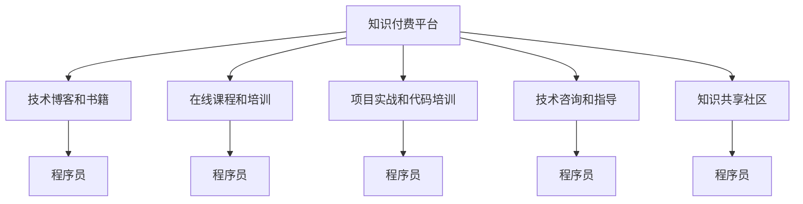

                 

# 知识付费让程序员告别朝九晚五

在互联网和技术飞速发展的今天，程序员这一职业已不再是朝九晚五的“传统”工作模式，而是逐渐成为了充满挑战和机遇的新领域。然而，对于许多程序员来说，长时间的工作和高强度的工作压力仍然是难以避免的挑战。本文将探讨知识付费这一新兴趋势，如何为程序员们带来新的机遇，帮助他们告别朝九晚五的生活，探索更加灵活和自由的工作方式。

## 1. 背景介绍

### 1.1 问题由来
随着科技的快速发展，特别是人工智能、大数据、区块链等领域的兴起，编程技能变得愈发重要。然而，传统的“坐班”模式不再能够满足技术迭代和项目需求快速变化的要求。程序员们常常面临高强度、长时间的工作压力，导致身心疲惫，甚至引发职业倦怠。

### 1.2 问题核心关键点
程序员如何能够打破传统的工作模式，既能提升自身的技术水平，又能实现更加灵活的工作时间和地点？知识付费这一新兴趋势的出现，为这个问题提供了一个全新的答案。

## 2. 核心概念与联系

### 2.1 核心概念概述
知识付费指的是知识生产者通过向用户提供有价值的内容，换取用户支付费用的商业模式。在程序员这一职业中，这不仅包括技术博客、书籍、在线课程等传统内容，还包括项目实战、代码培训、技术咨询等多种形式。

- **技术博客和书籍**：这些内容为程序员提供了系统的学习资源，帮助他们掌握新的编程语言、框架和工具。
- **在线课程和培训**：通过视频教学、在线辅导等方式，程序员可以快速掌握特定技能，同时可以在灵活的时间安排中进行学习。
- **项目实战和代码培训**：通过参与实际项目，程序员可以直接锻炼实战能力，提升解决问题的能力。
- **技术咨询和指导**：经验丰富的程序员可以提供针对性的技术支持，帮助他人解决实际问题。

### 2.2 核心概念原理和架构的 Mermaid 流程图(Mermaid 流程节点中不要有括号、逗号等特殊字符)



这个流程图展示了知识付费平台与程序员之间的各种互动关系。通过不同的知识形式，程序员可以获取和交换有价值的信息，实现个人和职业的成长。

## 3. 核心算法原理 & 具体操作步骤
### 3.1 算法原理概述

知识付费的核心算法原理主要围绕内容推荐和价值评估展开。内容推荐算法通过分析用户的浏览、搜索、购买行为，推荐用户可能感兴趣的内容，从而提高用户满意度和留存率。价值评估算法则通过分析内容的价值（如用户反馈、分享次数、评论等），对内容进行评分，确保高质量内容能够得到更多的曝光和奖励。

### 3.2 算法步骤详解

1. **内容采集与标注**：平台从多个渠道采集内容，并对内容进行标注和分类，建立内容库。
2. **用户画像建立**：通过分析用户的历史行为数据，建立用户的兴趣和需求画像。
3. **内容推荐算法设计**：使用协同过滤、内容推荐算法（如基于内容的推荐、基于矩阵分解的推荐）等技术，为用户推荐可能感兴趣的内容。
4. **价值评估模型构建**：使用机器学习算法（如深度学习、随机森林等）对内容进行价值评估，计算内容的评分。
5. **个性化推荐与价值激励**：根据用户的画像和内容评分，动态调整推荐策略，同时提供内容创作者的价值激励机制（如付费分成、广告收入等），鼓励高质量内容的生产。

### 3.3 算法优缺点

**优点**：
- **高效学习**：知识付费平台提供的海量学习资源，使得程序员能够高效地掌握新技能。
- **灵活性**：程序员可以根据自己的时间安排进行学习，无需固定工作时间。
- **多样性**：内容形式多样，包括博客、视频、实战项目等，满足不同需求。

**缺点**：
- **成本问题**：部分高质量内容需要付费，对于经济状况不佳的程序员来说，可能构成负担。
- **内容质量参差不齐**：平台上的内容质量存在差异，需要用户自己筛选和判断。
- **技术门槛**：部分内容涉及复杂的技术，可能需要一定的学习曲线。

### 3.4 算法应用领域

知识付费在程序员领域的应用主要集中在以下几个方面：

- **技术技能提升**：通过在线课程、书籍等资源，程序员可以快速掌握新的编程语言、框架和工具。
- **实战经验积累**：通过参与实际项目和代码培训，程序员可以直接锻炼实战能力。
- **技术咨询服务**：经验丰富的程序员可以通过知识付费平台提供技术咨询，帮助他人解决实际问题。
- **个性化学习路径**：通过平台推荐，程序员可以根据自己的兴趣和需求，选择适合自己的学习路径。

## 4. 数学模型和公式 & 详细讲解 & 举例说明

### 4.1 数学模型构建

知识付费平台的推荐系统可以通过协同过滤和矩阵分解等方法构建推荐模型。协同过滤方法基于用户的相似性进行推荐，而矩阵分解则通过分解用户行为矩阵，发现潜在特征，进行内容推荐。

### 4.2 公式推导过程

以协同过滤算法为例，假设用户集为 $U$，物品集为 $I$，用户对物品的评分矩阵为 $R \in \mathbb{R}^{m \times n}$，其中 $m$ 为用户数，$n$ 为物品数。协同过滤的目标是通过相似性度量，找出与目标用户 $u$ 最相似的用户集 $N(u)$，然后根据 $N(u)$ 的评分来预测目标用户 $u$ 对物品 $i$ 的评分 $r_{ui}$。

设 $\hat{r}_{ui}$ 为预测评分，$A \in \mathbb{R}^{m \times m}$ 为相似度矩阵，$B \in \mathbb{R}^{n \times n}$ 为物品相似度矩阵。则协同过滤算法可以表示为：

$$
\hat{r}_{ui} = \sum_{j \in N(u)} \frac{A_{uj} \cdot B_{ji}}{\sqrt{\sum_{k \in N(u)} A_{uk} \cdot B_{ki}}}
$$

### 4.3 案例分析与讲解

以一个在线编程社区为例，社区管理员通过分析用户的行为数据，建立用户的兴趣和需求画像。对于新加入的编程新手，管理员可以通过推荐系统推荐一些基础教程和实战项目，帮助他们快速入门。对于有经验的开发者，管理员则可以通过推荐系统提供进阶的课程和技术咨询，满足他们的深入学习需求。

## 5. 项目实践：代码实例和详细解释说明

### 5.1 开发环境搭建

知识付费平台的开发环境搭建需要考虑多个方面，包括服务器环境、数据库搭建、前端开发等。以下是一个简单的搭建流程：

1. **服务器环境**：使用AWS或阿里云等云服务提供商，搭建Web服务器和数据库服务器。
2. **数据库搭建**：使用MySQL或PostgreSQL等关系型数据库，搭建内容库、用户信息库和行为记录库。
3. **前端开发**：使用React或Vue等前端框架，开发知识付费平台的用户界面，包括课程浏览、搜索、推荐等功能。

### 5.2 源代码详细实现

以下是一个简单的知识付费平台的代码实现：

```python
# 用户数据管理
class User:
    def __init__(self, id, name, email, password):
        self.id = id
        self.name = name
        self.email = email
        self.password = password
    
    def get_interest(self):
        # 根据历史行为，计算兴趣
        pass
    
# 内容数据管理
class Content:
    def __init__(self, id, title, description, category, price):
        self.id = id
        self.title = title
        self.description = description
        self.category = category
        self.price = price
    
    def get_recommendations(self):
        # 根据内容评分和用户兴趣，推荐相关内容
        pass
    
# 推荐系统
class RecommendationSystem:
    def __init__(self, user_data, content_data):
        self.user_data = user_data
        self.content_data = content_data
    
    def get_recommendations(self, user_id):
        # 根据用户兴趣和内容评分，推荐相关内容
        pass
```

### 5.3 代码解读与分析

以上代码实现了一个简单的知识付费平台的基本功能。其中，`User` 类用于管理用户信息，`Content` 类用于管理内容信息，`RecommendationSystem` 类则用于实现推荐算法。

在实际应用中，还需要考虑更多的细节，如用户行为记录、内容评分更新、推荐算法优化等。通过合理的代码设计和算法实现，知识付费平台可以更好地服务于程序员，帮助他们提升技能，实现更加灵活的工作方式。

### 5.4 运行结果展示

运行结果展示部分可以根据实际情况，展示平台的用户增长、课程购买率、用户满意度等关键指标。这些指标不仅可以帮助平台优化推荐算法，还可以为内容创作者提供价值反馈，激励他们创造更多高质量内容。

## 6. 实际应用场景

### 6.1 智慧城市建设

知识付费平台可以为智慧城市建设提供技术支持和人才培训。例如，智慧城市项目中的开发者可以通过平台学习最新的城市管理技术和解决方案，提升技术水平。

### 6.2 企业培训

企业可以利用知识付费平台进行内部培训，帮助员工掌握新技术和新工具，提升企业的创新能力和竞争力。

### 6.3 在线教育

在线教育平台可以借助知识付费平台提供高质量的课程内容，帮助学生和教师建立连接，提升教学效果。

### 6.4 未来应用展望

未来，知识付费平台将不仅仅局限于程序员领域，而是广泛应用于各个行业。通过知识付费，人们可以在任何时间和地点获取知识和技能，打破传统的工作和生活模式。

## 7. 工具和资源推荐

### 7.1 学习资源推荐

- **Coursera**：提供丰富的在线课程，涵盖计算机科学、数据科学等多个领域。
- **Udacity**：提供项目导向的学习资源，帮助学习者通过实战项目掌握技能。
- **GitHub**：提供开源代码库和协作平台，帮助开发者学习和分享代码。

### 7.2 开发工具推荐

- **Visual Studio Code**：轻量级代码编辑器，支持多种编程语言。
- **Git**：版本控制系统，帮助开发者管理代码和协作。
- **Jenkins**：持续集成工具，自动化测试和部署流程。

### 7.3 相关论文推荐

- **"Collaborative Filtering for E-commerce Recommendation Engineering"**：Geng & Yin，研究协同过滤算法在电子商务推荐中的应用。
- **"Matrix Factorization Techniques for Recommender Systems"**：Koren，介绍矩阵分解算法在推荐系统中的应用。

## 8. 总结：未来发展趋势与挑战

### 8.1 研究成果总结

知识付费平台的兴起为程序员提供了全新的学习和工作模式，使得他们能够更加灵活和自由地获取知识和技能。通过算法优化和内容管理，知识付费平台能够提供高质量、个性化、灵活的内容推荐，满足不同用户的需求。

### 8.2 未来发展趋势

未来，知识付费平台将更加智能化和个性化。通过机器学习和人工智能技术，平台能够更精准地分析用户行为，提供更符合用户需求的推荐内容。同时，知识付费平台将更加多元化，涵盖更多领域和职业，提供更全面的知识和技能培训。

### 8.3 面临的挑战

尽管知识付费平台带来了很多便利，但仍然面临一些挑战：
- **内容质量控制**：如何确保平台上的内容质量，避免低质量内容对用户造成误导。
- **用户隐私保护**：如何保护用户的隐私数据，防止数据泄露和滥用。
- **平台激励机制**：如何设计合理的激励机制，确保内容创作者能够持续产出高质量内容。

### 8.4 研究展望

未来的研究需要关注以下方面：
- **个性化推荐算法优化**：通过深度学习和强化学习技术，进一步提升推荐系统的准确性和个性化程度。
- **内容质量评估**：建立完善的内容评估机制，对内容进行科学合理的评价和筛选。
- **用户隐私保护**：采用先进的隐私保护技术，确保用户数据的安全和隐私。

## 9. 附录：常见问题与解答

**Q1：知识付费平台是否适用于所有行业？**

A: 知识付费平台不仅适用于程序员，还适用于教师、医生、艺术家等多个领域。只要需要获取知识和技能的职业，都可以通过知识付费平台进行学习和提升。

**Q2：知识付费平台如何保证内容质量？**

A: 平台可以采用多重审核机制，如用户评价、专家评审、同行评审等，对内容进行质量控制。同时，平台还可以引入AI技术，如文本分析和图像识别，对内容进行自动化审核。

**Q3：知识付费平台如何保护用户隐私？**

A: 平台可以通过数据加密、匿名化处理、用户授权等手段，保护用户的隐私数据。同时，平台需要遵守相关法律法规，确保用户数据的安全和隐私。

**Q4：知识付费平台如何激励内容创作者？**

A: 平台可以通过付费分成、广告收入、流量奖励等多种方式，激励内容创作者产出高质量内容。同时，平台还可以引入社区投票、专家评审等机制，提升内容质量和创作者声誉。

---

作者：禅与计算机程序设计艺术 / Zen and the Art of Computer Programming

