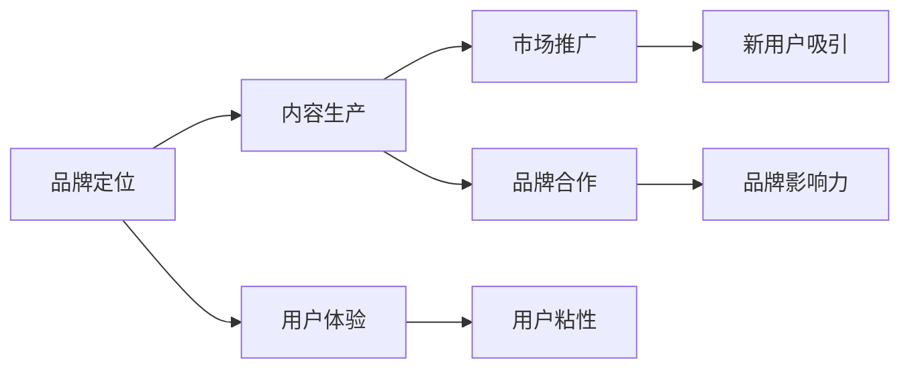

                 

## 1. 背景介绍

在知识付费领域，品牌运营与品牌推广策略显得尤为重要。随着信息爆炸和知识碎片化时代的到来，知识付费平台面临着用户需求多样化、内容同质化等挑战。如何通过品牌运营与推广策略，在激烈的市场竞争中脱颖而出，成为平台持续发展的关键。

### 1.1 问题由来
在知识付费行业，平台之间的竞争日益激烈，用户忠诚度难以维持，内容质量难以持续提升。同时，平台面临着广告收入不足、用户增长缓慢等问题。因此，如何通过品牌运营与推广策略，提升品牌知名度和用户粘性，成为平台的核心目标。

### 1.2 问题核心关键点
品牌运营与品牌推广的核心在于：
- **品牌定位**：确定品牌的核心价值和目标用户群体。
- **内容质量**：提供高质量、多样化的内容，满足用户需求。
- **用户体验**：提升平台的用户体验，增强用户粘性。
- **市场推广**：通过多元化渠道，进行有效宣传，扩大用户基数。
- **品牌合作**：与其他品牌合作，共享资源，提升品牌影响力。

## 2. 核心概念与联系

### 2.1 核心概念概述

品牌运营与品牌推广涉及到多个关键概念，包括但不限于：

- **品牌定位**：确定品牌的目标市场、核心价值和差异化定位。
- **内容生产**：生产优质内容，满足用户需求，提高用户粘性。
- **用户体验**：提升平台易用性、功能丰富度、界面美观度等，增强用户满意度。
- **市场推广**：通过付费广告、内容营销、社交媒体营销等手段，吸引新用户，留住老用户。
- **品牌合作**：与其他品牌合作，通过联合营销、资源互换等方式，提升品牌影响力。

这些概念之间的逻辑关系可以通过以下Mermaid流程图来展示：



### 2.2 核心概念原理和架构的 Mermaid 流程图

由于篇幅限制，这里只提供一个简单的概念图，不包含详细的操作流程图。


## 3. 核心算法原理 & 具体操作步骤

### 3.1 算法原理概述

品牌运营与品牌推广的算法原理主要基于市场营销的理论与方法，包括市场细分、目标市场选择、定位策略、内容营销、社交媒体营销等。这些策略的实施需要结合数据挖掘和分析技术，以量化评估推广效果。

### 3.2 算法步骤详解

品牌运营与品牌推广的一般步骤包括：

1. **品牌定位**：通过市场调研和用户分析，确定品牌的目标市场和核心价值。
2. **内容生产**：根据目标用户的需求和兴趣，生产高质量、多样化、有吸引力的内容。
3. **用户体验优化**：通过用户反馈和数据挖掘，持续优化平台的用户体验，提升用户满意度。
4. **市场推广**：通过多渠道营销，吸引新用户，提升品牌知名度和用户粘性。
5. **品牌合作**：寻找与品牌价值观相符的其他品牌，通过联合营销、资源互换等方式，扩大品牌影响力。

### 3.3 算法优缺点

品牌运营与品牌推广的算法有以下优点：

- **针对性**：能够根据目标市场和用户需求，量身定制推广策略，提高效果。
- **可量化**：通过数据挖掘和分析，可以量化评估推广效果，指导后续优化。
- **高效性**：通过自动化和优化工具，能够提升推广效率，降低人力成本。

缺点包括：

- **复杂性**：需要多方面综合考虑，策略设计较为复杂。
- **风险**：推广效果受多种因素影响，存在不确定性。
- **资源需求**：需要一定的技术投入和数据支持，对资源需求较大。

### 3.4 算法应用领域

品牌运营与品牌推广的算法主要应用于知识付费平台，但也可以应用于其他领域，如在线教育、电子商务、娱乐等。其核心思想和操作方法具有普适性，能够帮助品牌在各个领域提升知名度和用户粘性。

## 4. 数学模型和公式 & 详细讲解 & 举例说明

### 4.1 数学模型构建

品牌运营与品牌推广的数学模型主要基于回归分析、分类算法、聚类分析等。

假设品牌推广的输入特征为 $x_i$，推广效果（如用户增长率、品牌知名度）为 $y$，则可以使用线性回归模型进行建模：

$$ y = \beta_0 + \beta_1 x_1 + \beta_2 x_2 + ... + \beta_n x_n + \epsilon $$

其中，$\beta$ 为回归系数，$\epsilon$ 为误差项。

### 4.2 公式推导过程

以线性回归模型为例，其最小二乘法推导过程如下：

1. 假设样本集为 $\{(x_1, y_1), (x_2, y_2), ..., (x_m, y_m)\}$。
2. 求解最小二乘估计量 $\hat{\beta} = (X^T X)^{-1} X^T y$。
3. 使用测试集验证模型，通过平均误差平方和评估模型性能。

### 4.3 案例分析与讲解

以某知识付费平台为例，使用线性回归模型分析用户增长率与市场推广策略的关系：

1. 收集历史数据，包括广告投放渠道、推广文案、用户增长率等。
2. 建立线性回归模型，求解回归系数。
3. 根据回归系数，优化广告投放策略，提升用户增长率。

## 5. 项目实践：代码实例和详细解释说明

### 5.1 开发环境搭建

在进行品牌运营与品牌推广实践前，我们需要准备好开发环境。以下是使用Python进行Scikit-learn开发的Python环境配置流程：

1. 安装Anaconda：从官网下载并安装Anaconda，用于创建独立的Python环境。

2. 创建并激活虚拟环境：
```bash
conda create -n brand-op-env python=3.8 
conda activate brand-op-env
```

3. 安装Scikit-learn：
```bash
conda install scikit-learn pandas scikit-image matplotlib tqdm jupyter notebook ipython
```

完成上述步骤后，即可在`brand-op-env`环境中开始实践。

### 5.2 源代码详细实现

下面我们以用户增长率预测为例，给出使用Scikit-learn库进行品牌推广效果分析的Python代码实现。

首先，定义数据处理函数：

```python
import pandas as pd
from sklearn.model_selection import train_test_split
from sklearn.linear_model import LinearRegression

def load_data():
    # 加载数据集
    df = pd.read_csv('brand_promotion.csv')
    
    # 数据预处理
    X = df[['ad_channels', 'ad_copy', 'promotion_strategy']]
    y = df['user_growth_rate']
    
    # 数据拆分
    X_train, X_test, y_train, y_test = train_test_split(X, y, test_size=0.2, random_state=42)
    
    return X_train, X_test, y_train, y_test

def predict_user_growth_rate(X_train, y_train, X_test):
    # 线性回归模型拟合
    model = LinearRegression()
    model.fit(X_train, y_train)
    
    # 模型预测
    y_pred = model.predict(X_test)
    
    return y_pred
```

然后，定义评估函数：

```python
from sklearn.metrics import mean_squared_error

def evaluate_model(y_test, y_pred):
    mse = mean_squared_error(y_test, y_pred)
    r2_score = model.score(X_test, y_test)
    print(f'Mean Squared Error: {mse:.3f}')
    print(f'R-squared Score: {r2_score:.3f}')
```

最后，启动预测和评估流程：

```python
X_train, X_test, y_train, y_test = load_data()
y_pred = predict_user_growth_rate(X_train, y_train, X_test)
evaluate_model(y_test, y_pred)
```

以上就是使用Scikit-learn库进行品牌推广效果预测的完整代码实现。可以看到，通过Scikit-learn的强大封装，我们可以用相对简洁的代码完成品牌推广效果的预测分析。

### 5.3 代码解读与分析

让我们再详细解读一下关键代码的实现细节：

**load_data函数**：
- 定义数据加载和预处理流程，将原始数据集转化为模型所需的特征和标签，并进行数据拆分。

**predict_user_growth_rate函数**：
- 定义线性回归模型的训练和预测流程，通过训练数据拟合模型，并用测试数据进行预测。

**evaluate_model函数**：
- 定义模型评估流程，通过计算均方误差和R-squared得分，评估模型性能。

**启动预测和评估流程**：
- 加载数据集，进行模型训练和预测，并评估模型效果。

可以看到，Scikit-learn库使得品牌推广效果预测的代码实现变得简洁高效。开发者可以将更多精力放在模型改进、特征工程等高层逻辑上，而不必过多关注底层的实现细节。

当然，工业级的系统实现还需考虑更多因素，如模型保存和部署、超参数调优、更灵活的特征工程等。但核心的品牌推广效果预测过程基本与此类似。

## 6. 实际应用场景

### 6.1 智能客服系统

智能客服系统通过品牌运营与品牌推广策略，可以显著提升用户满意度和忠诚度。平台可以通过优化客服体验、提升服务质量、个性化推荐等方式，提升用户粘性。

在技术实现上，可以收集用户使用数据，分析用户行为和需求，对智能客服模型进行微调，使其能够更好地理解和响应用户需求。同时，结合品牌营销活动，提升用户对平台的品牌认知度。

### 6.2 金融舆情监测

金融舆情监测是品牌运营与品牌推广的重要应用场景。平台可以通过监测社交媒体、新闻报道、财经博客等渠道，了解市场舆情，及时调整品牌策略。

在技术实现上，可以收集金融领域相关的舆情数据，利用自然语言处理技术进行情感分析和主题分类，及时发现负面舆情，采取应对措施。同时，结合品牌推广活动，提升品牌在金融市场的知名度和信任度。

### 6.3 个性化推荐系统

个性化推荐系统是品牌运营与品牌推广的重要工具。平台可以通过收集用户行为数据，分析用户兴趣和偏好，推送个性化的内容和服务，提升用户粘性。

在技术实现上，可以收集用户浏览、点击、购买等行为数据，利用机器学习技术进行推荐模型训练，生成个性化推荐列表。同时，结合品牌推广活动，提升用户对平台的品牌认知度。

### 6.4 未来应用展望

随着品牌运营与品牌推广技术的不断发展，其应用场景将更加广泛，为品牌在各个领域带来新的机遇。

在智慧医疗领域，基于品牌运营与品牌推广的系统可以提升品牌在医疗领域的知名度和信任度，帮助医疗机构进行品牌推广和客户管理。

在智能教育领域，品牌运营与品牌推广系统可以提升品牌在教育领域的知名度和美誉度，帮助教育机构进行品牌推广和课程推荐。

在智慧城市治理中，品牌运营与品牌推广系统可以提升品牌在城市管理领域的知名度和影响力，帮助城市管理部门进行品牌推广和市民服务。

此外，在企业生产、社会治理、文娱传媒等众多领域，品牌运营与品牌推广系统也将不断涌现，为品牌在各个领域带来新的机遇。

## 7. 工具和资源推荐

### 7.1 学习资源推荐

为了帮助开发者系统掌握品牌运营与品牌推广的理论基础和实践技巧，这里推荐一些优质的学习资源：

1. **《数据驱动的品牌管理》**：详细介绍了品牌运营与品牌推广的理论基础和方法论，适合品牌管理从业人员参考。

2. **《品牌营销：理论与实践》**：结合案例分析，介绍了品牌营销的多种策略和实践，适合品牌运营从业人员参考。

3. **《社交媒体营销》**：介绍了社交媒体营销的理论和实践，适合品牌推广从业人员参考。

4. **《Google Analytics：数据分析与品牌管理》**：介绍了Google Analytics在品牌管理中的应用，适合品牌运营从业人员参考。

5. **《品牌管理案例分析》**：通过分析知名品牌的成功案例，介绍了品牌运营与品牌推广的实战经验，适合品牌管理从业人员参考。

通过对这些资源的学习实践，相信你一定能够快速掌握品牌运营与品牌推广的精髓，并用于解决实际的营销问题。

### 7.2 开发工具推荐

高效的开发离不开优秀的工具支持。以下是几款用于品牌运营与品牌推广开发的常用工具：

1. **Google Analytics**：数据分析工具，帮助品牌管理者分析用户行为和流量来源，进行品牌推广效果评估。

2. **Hootsuite**：社交媒体管理工具，帮助品牌管理者管理和优化社交媒体账号，提升品牌曝光度。

3. **SEMrush**：SEO分析工具，帮助品牌管理者优化网站搜索引擎排名，提升品牌知名度。

4. **SurveyMonkey**：在线调研工具，帮助品牌管理者收集用户反馈和需求，进行品牌推广策略优化。

5. **Brandwatch**：社交媒体监控工具，帮助品牌管理者实时监测品牌声誉和市场舆情，及时调整品牌策略。

6. **HubSpot**：市场营销自动化工具，帮助品牌管理者进行市场推广、客户管理等，提升品牌运营效率。

合理利用这些工具，可以显著提升品牌运营与品牌推广的效率，加快创新迭代的步伐。

### 7.3 相关论文推荐

品牌运营与品牌推广技术的发展源于学界的持续研究。以下是几篇奠基性的相关论文，推荐阅读：

1. **《品牌管理理论与实践》**：介绍了品牌管理的基本概念和理论，适合品牌管理从业人员参考。

2. **《品牌推广策略与效果评估》**：分析了多种品牌推广策略及其效果评估方法，适合品牌推广从业人员参考。

3. **《品牌运营中的数据分析》**：介绍了品牌运营中数据分析的理论和实践，适合品牌运营从业人员参考。

4. **《社交媒体与品牌推广》**：分析了社交媒体在品牌推广中的作用和策略，适合品牌推广从业人员参考。

这些论文代表了大品牌运营与品牌推广技术的发展脉络。通过学习这些前沿成果，可以帮助研究者把握学科前进方向，激发更多的创新灵感。

## 8. 总结：未来发展趋势与挑战

### 8.1 总结

本文对品牌运营与品牌推广策略进行了全面系统的介绍。首先阐述了品牌运营与品牌推广的重要性，明确了品牌定位、内容生产、用户体验、市场推广、品牌合作等关键策略。其次，从原理到实践，详细讲解了品牌推广效果预测的数学模型和算法，给出了品牌推广效果预测的完整代码实例。同时，本文还广泛探讨了品牌运营与品牌推广在多个行业领域的应用前景，展示了品牌推广范式的巨大潜力。

通过本文的系统梳理，可以看到，品牌运营与品牌推广策略已经成为品牌在各个领域发展的重要手段，极大地提升了品牌的知名度和用户粘性。未来，伴随品牌运营与品牌推广技术的不断演进，相信品牌将在更广阔的领域发挥更大的作用，为人类社会的进步带来深远影响。

### 8.2 未来发展趋势

展望未来，品牌运营与品牌推广技术将呈现以下几个发展趋势：

1. **数字化转型**：品牌运营与品牌推广将更加数字化、智能化，通过数据分析、机器学习等技术，提升品牌推广的精准性和效果。

2. **个性化营销**：品牌运营与品牌推广将更加注重个性化，根据用户行为和偏好，提供定制化内容和服务，提升用户粘性。

3. **跨平台整合**：品牌运营与品牌推广将打破平台壁垒，实现跨渠道整合，提升品牌曝光度和影响力。

4. **数据驱动决策**：品牌运营与品牌推广将更加依赖数据驱动，通过数据分析和算法优化，指导品牌推广策略的制定和调整。

5. **自动化工具**：品牌运营与品牌推广将更加自动化，通过智能推荐、自动化监测等工具，提升品牌推广效率。

这些趋势凸显了品牌运营与品牌推广技术的广阔前景。这些方向的探索发展，必将进一步提升品牌推广的精准性和效果，帮助品牌在更广阔的领域实现价值最大化。

### 8.3 面临的挑战

尽管品牌运营与品牌推广技术已经取得了显著成就，但在迈向更加智能化、普适化应用的过程中，仍面临诸多挑战：

1. **数据隐私和安全**：品牌推广过程中涉及大量用户数据，如何保护用户隐私和安全，是一个重要挑战。

2. **内容质量控制**：品牌推广过程中，内容质量和真实性难以保证，容易产生误导性信息，需要建立严格的内容审核机制。

3. **市场竞争激烈**：品牌推广过程中，市场竞争激烈，如何在竞争中脱颖而出，需要更多的创新和策略优化。

4. **技术资源需求**：品牌推广过程中，需要大量的技术资源支持，包括数据挖掘、算法优化、平台搭建等，对资源需求较大。

5. **品牌管理复杂**：品牌运营与品牌推广过程中，需要综合考虑多个因素，包括品牌定位、市场环境、用户需求等，策略设计较为复杂。

这些挑战需要品牌管理者不断探索和优化，才能实现品牌推广的持续成功。

### 8.4 研究展望

面对品牌运营与品牌推广所面临的挑战，未来的研究需要在以下几个方面寻求新的突破：

1. **隐私保护技术**：开发更高效、更安全的隐私保护技术，保护用户数据隐私和安全。

2. **内容生成技术**：开发高质量、多样化的内容生成技术，提升品牌推广的内容质量。

3. **自动化工具优化**：优化自动化推广工具，提升推广效率，降低人力成本。

4. **策略优化算法**：开发更智能、更精准的品牌推广策略优化算法，提高推广效果。

5. **数据驱动决策**：构建数据驱动的品牌管理决策系统，提升品牌运营与品牌推广的决策精准性。

这些研究方向将为品牌运营与品牌推广技术的进一步发展提供重要支撑，帮助品牌在激烈的市场竞争中取得更大的成功。

## 9. 附录：常见问题与解答

**Q1：品牌推广过程中如何保护用户数据隐私？**

A: 品牌推广过程中，保护用户数据隐私需要采取以下措施：
1. 遵守数据保护法律法规，如GDPR、CCPA等。
2. 对用户数据进行加密存储和传输，防止数据泄露。
3. 采用匿名化技术，去除用户标识信息，保护用户隐私。
4. 建立严格的数据访问权限管理，限制数据访问权限。
5. 定期进行数据审计和风险评估，及时发现和修复安全漏洞。

**Q2：品牌推广效果预测的算法原理是什么？**

A: 品牌推广效果预测的算法原理主要基于回归分析和机器学习。通过收集历史推广数据，建立回归模型，对推广效果进行预测。具体步骤如下：
1. 收集历史推广数据，包括广告渠道、推广文案、推广效果等。
2. 对数据进行预处理，去除噪声和异常值。
3. 建立回归模型，使用最小二乘法、岭回归等算法，求解回归系数。
4. 使用测试集验证模型，通过均方误差、R-squared等指标评估模型效果。
5. 根据模型结果，优化推广策略，提升品牌推广效果。

**Q3：品牌推广过程中如何进行用户行为分析？**

A: 品牌推广过程中，用户行为分析可以通过以下方法实现：
1. 收集用户数据，包括浏览记录、购买记录、互动记录等。
2. 对数据进行清洗和预处理，去除噪声和异常值。
3. 使用数据分析工具，如Google Analytics、Tableau等，对用户行为进行分析。
4. 根据分析结果，调整推广策略，提升品牌推广效果。
5. 定期对用户行为进行跟踪和分析，及时调整推广策略。

**Q4：品牌推广过程中如何提升品牌曝光度？**

A: 品牌推广过程中，提升品牌曝光度可以通过以下方法实现：
1. 通过社交媒体平台，发布品牌宣传内容，提升品牌曝光度。
2. 参加行业展会、研讨会等活动，提升品牌知名度。
3. 在搜索引擎优化（SEO）上下功夫，提升品牌在搜索引擎中的排名。
4. 通过品牌合作、联合营销等方式，扩大品牌影响力。
5. 定期进行品牌形象设计，提升品牌识别度。

---

作者：禅与计算机程序设计艺术 / Zen and the Art of Computer Programming

