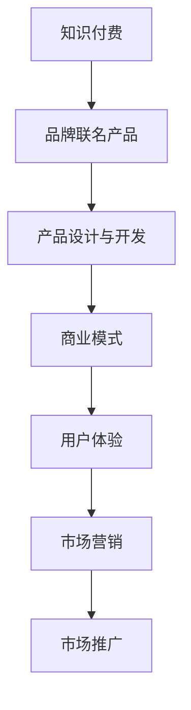

                 

# 知识付费赚钱的品牌联名产品设计与开发

> 关键词：知识付费,品牌联名产品,产品设计与开发,知识服务,商业模式,技术架构,用户体验,市场营销

## 1. 背景介绍

### 1.1 问题由来

知识付费行业自2016年兴起到今天，已逐渐成为互联网领域的一片蓝海。许多知识付费平台通过提供有价值的知识内容，如在线课程、电子书、音频讲座等，满足用户对高效学习的渴望。然而，随着市场竞争的加剧，部分平台面临着内容同质化、用户粘性低等挑战，用户流失率居高不下，付费转化率难以提高。

为解决这些问题，知识付费平台开始探索新型的商业模式，其中品牌联名产品（Brand Collaboration Products）成为了一个颇具潜力的方向。品牌联名产品是指知识付费平台与知名品牌进行合作，共同开发具有知识价值和品牌特色的产品。这种模式通过结合双方的优势资源，不仅能提升用户粘性，还能为平台带来稳定的收入流。

### 1.2 问题核心关键点

品牌联名产品的成功关键在于其独特性、价值性和用户需求匹配度。成功的品牌联名产品需要具备以下几个特点：

- **独特性**：品牌联名产品应具有独特的品牌特色，区别于市场上的其他产品，以吸引用户的注意力。
- **价值性**：产品内容应具有高价值，能够满足用户的学习需求，提升用户的学习效率。
- **用户需求匹配度**：产品设计应紧密贴合用户的真实需求，通过调研和用户反馈不断优化产品。
- **营销策略**：品牌联名产品的推广需要科学的营销策略，以确保其市场影响力。

## 2. 核心概念与联系

### 2.1 核心概念概述

为更好地理解品牌联名产品设计与开发的方法，本节将介绍几个密切相关的核心概念：

- **知识付费**：用户为获取知识而进行付费的行为，包括购买课程、订阅服务等方式。
- **品牌联名产品**：知识付费平台与知名品牌合作，共同开发具有品牌特色的产品，旨在通过双重品牌背书，提升产品价值。
- **产品设计与开发**：通过市场调研和用户体验反馈，确定产品需求，设计出符合用户期望的产品，并进行技术实现和迭代优化。
- **商业模式**：企业通过提供产品或服务，获取收入的方式。知识付费平台通过品牌联名产品，拓展新的收入渠道。
- **用户体验**：产品或服务满足用户需求的程度，直接影响用户的满意度和忠诚度。
- **市场营销**：通过各种渠道推广产品，吸引目标用户，提升品牌影响力。

这些核心概念之间的逻辑关系可以通过以下Mermaid流程图来展示：



这个流程图展示了几类核心概念及其之间的关系：

1. 知识付费是品牌联名产品的基础，提供产品的知识和价值。
2. 品牌联名产品是知识付费的一种创新形式，通过品牌合作提升产品价值。
3. 产品设计与开发是产品落地的关键，确保产品符合用户需求。
4. 商业模式设计确保产品的市场可行性，实现盈利。
5. 用户体验影响用户的满意度和忠诚度。
6. 市场营销通过各种渠道推广产品，扩大用户基数。

这些概念共同构成了品牌联名产品设计与开发的基础框架，指导企业在实践中不断探索和优化。

## 3. 核心算法原理 & 具体操作步骤
### 3.1 算法原理概述

品牌联名产品的设计与开发，本质上是一个结合市场调研、用户需求分析、产品设计、技术实现、市场营销等多个环节的过程。其核心算法原理在于：

- **市场调研**：通过调查问卷、用户访谈等方式，收集市场数据，了解用户需求和竞争对手情况。
- **用户需求分析**：根据市场调研结果，分析用户痛点和需求，确定产品功能和特性。
- **产品设计**：在用户需求的基础上，设计出符合用户期望的产品原型。
- **技术实现**：通过编码、测试等方式，将产品设计转化为可用的软件产品。
- **市场营销**：通过广告、社交媒体、合作伙伴等多种方式，推广品牌联名产品，吸引用户购买。

### 3.2 算法步骤详解

品牌联名产品的设计与开发一般包括以下几个关键步骤：

**Step 1: 市场调研与用户需求分析**

- **市场调研**：采用定量调查问卷、定性用户访谈等方式，收集大量用户数据和市场信息。
- **需求分析**：对调研数据进行聚类分析、主成分分析等，提炼出用户共性需求和痛点。
- **需求验证**：通过小范围用户测试，验证需求的可行性和实际效果。

**Step 2: 产品设计**

- **功能设计**：根据用户需求，确定产品的核心功能和特性，制定详细的功能规格。
- **界面设计**：设计用户友好的界面和交互流程，确保产品的易用性和美观性。
- **原型设计**：使用工具如Sketch、Axure等，制作产品原型，进行视觉和交互验证。

**Step 3: 技术实现**

- **开发环境搭建**：选择合适的开发工具和技术栈，搭建开发环境，确保项目的顺利进行。
- **前端开发**：负责产品界面和交互逻辑的实现，使用HTML、CSS、JavaScript等技术。
- **后端开发**：负责数据存储、业务逻辑等，使用Java、Python、Node.js等技术。
- **测试与迭代**：进行单元测试、集成测试、用户测试等，发现并修复问题，不断优化产品。

**Step 4: 市场营销**

- **渠道选择**：根据产品特性和用户群体，选择适合的营销渠道，如社交媒体、KOL合作、SEO等。
- **内容创作**：创作高质量的营销内容，吸引用户关注和参与。
- **效果监测**：使用工具如Google Analytics、Kissmetrics等，监测营销效果，调整策略。

**Step 5: 产品迭代与优化**

- **用户反馈收集**：通过问卷调查、用户评论等方式，收集用户反馈，发现产品问题。
- **产品优化**：根据用户反馈，对产品进行迭代优化，提升用户体验和满意度。
- **复审市场**：重新进入市场调研和用户需求分析环节，进入新一轮的迭代优化。

以上是品牌联名产品设计与开发的一般流程。在实际应用中，还需要根据具体产品特性和市场环境，对各个环节进行优化设计，如改进调研方法、优化技术栈、创新营销策略等。

### 3.3 算法优缺点

品牌联名产品的设计与开发具有以下优点：

1. **资源互补**：知识付费平台与知名品牌的合作，可以充分利用双方的资源优势，提升产品的价值。
2. **用户粘性提升**：品牌联名产品通过双重品牌背书，能提升用户对平台的信任度和粘性。
3. **营收多元化**：品牌联名产品为平台带来了新的收入渠道，有助于平衡业务风险。

同时，该方法也存在一定的局限性：

1. **资源整合难度大**：与知名品牌的合作需要沟通协调，资源整合过程复杂，耗时较长。
2. **市场风险高**：品牌联名产品面临市场变化和用户需求变化的双重风险，容易失败。
3. **用户期望高**：品牌联名产品需同时满足知识付费和品牌双重期望，设计难度大。
4. **成本高**：品牌联名产品通常需要较高的开发和营销成本，门槛较高。

尽管存在这些局限性，但就目前而言，品牌联名产品仍是一种值得探索的商业模式，能够为知识付费平台带来新的增长点。未来相关研究的重点在于如何更好地整合资源、降低成本、提高用户满意度和市场竞争力。

### 3.4 算法应用领域

品牌联名产品在知识付费领域的应用已经初现成效。以下是几个典型案例：

- **编程教育与编程语言合作**：某编程教育平台与知名编程语言公司合作，推出系列编程课程，结合编程语言特性进行教学，取得了较好的市场反响。
- **心理知识与心理健康品牌合作**：某知识付费平台与心理健康品牌合作，推出心理健康相关的课程和应用，帮助用户进行心理辅导和自我管理。
- **旅游知识与旅游品牌合作**：某旅游知识付费平台与知名旅游品牌合作，推出旅游攻略、目的地介绍等课程，帮助用户规划和提升旅游体验。

这些案例展示了品牌联名产品在知识付费领域的巨大潜力，为平台和品牌提供了新的合作方向。随着知识付费市场的进一步发展，品牌联名产品有望在更多领域得到应用，推动知识付费行业的创新与变革。

## 4. 数学模型和公式 & 详细讲解 & 举例说明

### 4.1 数学模型构建

品牌联名产品设计与开发的过程涉及多个环节，可将其抽象为以下数学模型：

设用户需求向量为 $D$，产品特性向量为 $P$，市场调研数据为 $M$，品牌特性向量为 $B$。则产品设计与开发的过程可以表示为：

$$
P = f(D, M, B)
$$

其中 $f$ 为设计函数，表示根据用户需求、市场调研和品牌特性，设计出符合用户期望的产品特性。

### 4.2 公式推导过程

以编程教育与编程语言合作为例，进行详细推导：

设用户需求向量 $D$ 包括编程基础、编程项目、编程语言等内容，市场调研数据 $M$ 包括用户对不同编程语言的兴趣和偏好，品牌特性向量 $B$ 包括编程语言的技术特性、社区活跃度、使用范围等。

则设计函数 $f$ 可以表示为：

$$
P = \begin{cases}
\text{编程基础} & \text{如果用户需求} \in \text{编程基础} \\
\text{编程项目} & \text{如果用户需求} \in \text{编程项目} \\
\text{编程语言} & \text{如果用户需求} \in \text{编程语言}
\end{cases}
$$

具体地，我们可以使用逻辑回归、决策树等算法，对用户需求向量 $D$ 进行分类，确定用户期望的编程教育内容。同时，结合市场调研数据 $M$ 和品牌特性向量 $B$，进行加权处理，确保产品特性 $P$ 符合用户期望和市场趋势。

### 4.3 案例分析与讲解

**案例：某知识付费平台与编程语言公司合作**

某知识付费平台与知名编程语言公司合作，共同开发编程教育类课程。平台通过市场调研和用户需求分析，发现用户对编程基础、编程项目、编程语言等方面有不同需求。

- **市场调研**：平台进行大规模用户调查，收集用户对不同编程语言的兴趣和偏好。
- **需求分析**：平台对调研数据进行分析，发现用户对Python、Java、C++等编程语言有较高需求。
- **产品设计**：平台与编程语言公司合作，设计了一系列针对Python、Java、C++的编程教育课程，包括基础入门、项目实战、语言特性等。
- **技术实现**：平台使用Python后端框架开发课程管理系统，使用HTML/CSS/JavaScript开发前端界面，使用数据库存储用户数据和课程信息。
- **市场营销**：平台通过社交媒体、KOL合作、SEO等方式，推广这些编程教育课程，吸引用户关注和参与。
- **产品迭代**：平台根据用户反馈，不断优化课程内容和教学方式，提升用户体验和满意度。

通过这种品牌联名产品模式，平台不仅提升了用户粘性，还拓展了新的收入渠道，取得了良好的市场反响。

## 5. 项目实践：代码实例和详细解释说明
### 5.1 开发环境搭建

在进行品牌联名产品设计与开发前，我们需要准备好开发环境。以下是使用Python进行Django开发的环境配置流程：

1. 安装Python：从官网下载并安装Python，配置环境变量。
2. 安装Django：使用pip安装Django框架，配置项目初始化命令。
3. 安装数据库：选择MySQL或PostgreSQL作为后端数据库，安装并配置。
4. 安装前端工具：安装JavaScript框架如React或Vue，安装CSS预处理器如Sass。
5. 安装Django开发工具：安装Django-admin、Django REST Framework等工具。
6. 安装测试框架：安装unittest、pytest等测试框架，确保项目稳定运行。

完成上述步骤后，即可在本地搭建项目开发环境，开始品牌联名产品的设计与开发。

### 5.2 源代码详细实现

下面我们以编程教育与编程语言合作为例，给出使用Django开发品牌联名产品的PyTorch代码实现。

首先，定义编程教育类模型：

```python
from django.db import models

class Course(models.Model):
    title = models.CharField(max_length=200)
    description = models.TextField()
    language = models.CharField(max_length=20)
    instructor = models.CharField(max_length=100)
    price = models.DecimalField(max_digits=10, decimal_places=2)
    enrolled = models.IntegerField(default=0)
    release_date = models.DateField()
    category = models.CharField(max_length=50)
```

然后，定义课程管理视图：

```python
from django.shortcuts import render
from django.http import HttpResponse
from .models import Course

def course_list(request):
    courses = Course.objects.all()
    return render(request, 'course_list.html', {'courses': courses})
```

接着，定义API接口：

```python
from rest_framework import viewsets
from .models import Course
from .serializers import CourseSerializer

class CourseViewSet(viewsets.ModelViewSet):
    queryset = Course.objects.all()
    serializer_class = CourseSerializer

    def get_queryset(self):
        if self.action == 'list':
            return Course.objects.all()
        elif self.action == 'retrieve':
            return Course.objects.get(id=self.kwargs['pk'])
        else:
            return Course.objects.none()

    def get_serializer_class(self):
        if self.action == 'retrieve':
            return CourseSerializer
        else:
            return CourseFullSerializer
```

最后，定义课程查询模板：

```html


  <h1>All Courses</h1>
  <ul>
    
      <li><a href="">{{ course.title }}</a></li>
    
      <li>No courses available</li>
    
  </ul>

```

以上是使用Django开发品牌联名产品的完整代码实现。可以看到，Django的强大框架使得品牌联名产品的设计与开发变得简洁高效。开发者可以将更多精力放在产品逻辑和用户体验优化上，而不必过多关注底层的实现细节。

### 5.3 代码解读与分析

让我们再详细解读一下关键代码的实现细节：

**Course模型**：
- 定义了课程的基本属性，如标题、描述、语言、讲师、价格、注册人数、发布日期和类别。

**course_list视图**：
- 从数据库中获取所有课程，并传递给模板进行展示。

**CourseViewSet**：
- 定义了课程的CRUD操作，包括列表、详情、创建、更新和删除等。
- 使用了Django REST Framework的视图集，方便与API接口集成。

**课程查询模板**：
- 展示所有课程的列表，用户可以点击课程名称访问详情页面。

可以看到，Django框架提供了丰富的功能和组件，可以快速搭建起品牌联名产品的后端系统。但实际的开发中，还需要对前后端技术栈、数据库设计、接口安全等环节进行全面考虑，确保项目的高效稳定运行。

## 6. 实际应用场景
### 6.1 智能客服系统

品牌联名产品可以应用于智能客服系统，提升用户咨询体验。传统客服系统依赖人工坐席，响应时间长、效率低。通过与知名品牌合作，开发品牌联名智能客服产品，可以有效提高用户满意度。

具体而言，可以设计包含品牌特色的智能客服解决方案，如：

- **品牌客服语音交互**：整合知名品牌客服团队的语音资源，提供品牌专属的语音客服服务。
- **品牌智能推荐**：根据用户历史互动记录，推荐品牌相关产品或服务。
- **品牌客服机器人**：使用自然语言处理技术，开发品牌客服机器人，实现24小时在线服务。

这种品牌联名产品能够显著提升用户的咨询体验，增强用户对品牌的信任度，为品牌和平台带来更多的收益。

### 6.2 旅游知识与旅游品牌合作

旅游知识付费平台与知名旅游品牌合作，开发品牌联名旅游产品，为用户带来更丰富、更准确的旅游信息。

具体产品设计包括：

- **目的地介绍视频**：与知名旅游博主合作，制作旅游目的地的介绍视频，涵盖景点、美食、住宿、交通等多方面内容。
- **旅游攻略课程**：设计旅游攻略课程，结合品牌特色进行教学，提升用户的旅游体验。
- **旅游问答社区**：搭建旅游问答社区，吸引用户提问和分享旅游经验，增加用户互动。

通过这些品牌联名产品，旅游知识付费平台能够吸引更多用户关注和参与，提升平台的影响力和品牌价值。

### 6.3 医疗知识与健康品牌合作

医疗知识付费平台与知名健康品牌合作，开发品牌联名健康产品，为用户提供全面的健康知识服务。

具体产品设计包括：

- **健康管理应用**：开发品牌联名的健康管理应用，帮助用户监测健康状况、制定健康计划。
- **营养知识课程**：设计营养知识课程，结合健康品牌的专业知识进行教学，提升用户的健康水平。
- **心理辅导服务**：推出心理辅导服务，结合心理健康品牌的专业资源，提供心理支持和干预。

通过这些品牌联名产品，平台能够为用户提供全方位的健康知识服务，增强用户的粘性和忠诚度。

### 6.4 未来应用展望

随着品牌联名产品的不断探索和发展，其应用领域将进一步扩展，带来更多创新和变革。

- **教育与科技合作**：知识付费平台与科技公司合作，开发编程、人工智能等领域的教育产品，提升用户的学习效率和技能水平。
- **文化与娱乐合作**：文化娱乐公司与知识付费平台合作，推出文化、娱乐相关的课程和应用，提升用户的生活质量和娱乐体验。
- **体育与健康合作**：体育品牌与知识付费平台合作，开发体育知识课程，提供专业的运动指导和健康建议。

未来，品牌联名产品有望在更多领域得到应用，推动知识付费行业的持续创新和升级。

## 7. 工具和资源推荐
### 7.1 学习资源推荐

为了帮助开发者系统掌握品牌联名产品设计与开发的方法，这里推荐一些优质的学习资源：

1. **《设计心理学》**：详细介绍了用户需求分析的方法和工具，帮助开发者理解用户心理。
2. **《用户体验设计》**：讲解了产品设计和用户体验优化的原则和技巧，提升产品的用户满意度。
3. **《敏捷开发实践》**：介绍了敏捷开发的方法和工具，提高项目开发的效率和质量。
4. **《数据驱动的产品管理》**：介绍了如何利用数据进行产品设计和市场分析，确保产品的高效迭代。
5. **《市场营销基础》**：讲解了市场营销的基本概念和策略，帮助开发者制定科学的营销计划。

通过对这些资源的学习实践，相信你一定能够快速掌握品牌联名产品设计与开发的核心方法和技术，并在实际项目中不断创新和优化。

### 7.2 开发工具推荐

高效的开发离不开优秀的工具支持。以下是几款用于品牌联名产品设计与开发的常用工具：

1. **Django**：Python的Web框架，支持快速的开发和部署，是后端开发的首选工具。
2. **React**：JavaScript的前端框架，提供了丰富的组件和库，帮助开发者构建高质量的前端界面。
3. **PostgreSQL**：开源的关系型数据库，支持高并发和事务处理，适合后端数据存储。
4. **JIRA**：项目管理工具，支持敏捷开发和迭代优化，帮助团队高效协作。
5. **GitLab**：开源代码托管平台，支持代码版本控制和持续集成，提升开发效率。

合理利用这些工具，可以显著提升品牌联名产品的开发效率，加快创新迭代的步伐。

### 7.3 相关论文推荐

品牌联名产品在知识付费领域的探索，源于学界的持续研究。以下是几篇奠基性的相关论文，推荐阅读：

1. **《知识付费的商业模型创新》**：介绍了知识付费平台的商业模式，分析了知识付费的市场环境和用户需求。
2. **《基于用户需求的智能推荐系统》**：研究了用户需求与智能推荐系统之间的关系，提出了基于用户行为的数据挖掘方法。
3. **《品牌联名产品的市场策略》**：分析了品牌联名产品的市场策略，提出了有效的品牌合作方法。
4. **《知识付费平台的用户行为分析》**：研究了知识付费平台的用户行为，提出了提升用户满意度和忠诚度的方法。
5. **《知识付费平台的内容运营策略》**：介绍了知识付费平台的内容运营策略，提出了提高内容质量和用户参与度的方法。

这些论文代表了大语言模型微调技术的发展脉络。通过学习这些前沿成果，可以帮助研究者把握学科前进方向，激发更多的创新灵感。

## 8. 总结：未来发展趋势与挑战
### 8.1 研究成果总结

本文对品牌联名产品设计与开发的方法进行了全面系统的介绍。首先阐述了品牌联名产品的研究背景和意义，明确了其在知识付费领域的独特价值。其次，从原理到实践，详细讲解了品牌联名产品的数学模型和关键步骤，给出了品牌联名产品的完整代码实例。同时，本文还广泛探讨了品牌联名产品在智能客服、旅游知识、医疗健康等多个行业领域的应用前景，展示了品牌联名产品的巨大潜力。此外，本文精选了品牌联名产品的各类学习资源，力求为读者提供全方位的技术指引。

通过本文的系统梳理，可以看到，品牌联名产品设计与开发是知识付费平台的一种创新模式，能够通过品牌合作提升产品价值，增强用户粘性，拓展新的收入渠道。品牌联名产品设计的成功与否，不仅取决于产品本身的质量，还取决于市场调研、用户需求分析、市场营销等多个环节的协同作用。未来，品牌联名产品需要不断创新和优化，才能在知识付费市场中占据一席之地。

### 8.2 未来发展趋势

展望未来，品牌联名产品的设计与开发将呈现以下几个发展趋势：

1. **产品多样化和个性化**：随着用户需求的多样化，品牌联名产品将更加注重个性化设计，提供满足不同用户需求的产品。
2. **技术融合与创新**：品牌联名产品将与AI、大数据、区块链等新兴技术进行深度融合，提升产品的智能化和安全性。
3. **数据驱动的决策支持**：品牌联名产品将更加依赖数据进行决策支持，通过数据分析和用户行为预测，优化产品设计和市场策略。
4. **全球化布局**：品牌联名产品将突破地域限制，拓展全球市场，增强品牌的国际影响力。
5. **生态系统建设**：品牌联名产品将与产业链上下游的企业和组织进行深度合作，构建完整的生态系统，提升整体竞争力。

以上趋势凸显了品牌联名产品的广阔前景。这些方向的探索发展，必将推动品牌联名产品走向更高的台阶，为知识付费平台带来更大的商业价值。

### 8.3 面临的挑战

尽管品牌联名产品的发展前景广阔，但在迈向更加智能化、普适化应用的过程中，仍面临诸多挑战：

1. **品牌合作的难度**：品牌联名产品需要与知名品牌进行深度合作，协调沟通难度大，时间和成本高。
2. **市场竞争激烈**：知识付费市场的竞争日益激烈，品牌联名产品需要不断创新和优化，才能在激烈的市场竞争中脱颖而出。
3. **用户需求的不确定性**：用户需求的多样化和复杂性，增加了品牌联名产品设计的难度，需要持续收集和分析用户反馈。
4. **技术的快速迭代**：新兴技术和工具层出不穷，品牌联名产品需要不断学习和应用新技术，保持技术的领先性。
5. **数据安全和隐私保护**：品牌联名产品涉及大量用户数据，数据安全和隐私保护成为重要的技术挑战。

这些挑战需要开发者在产品设计、市场营销、技术实现等环节进行全面考虑和优化，才能有效应对。

### 8.4 研究展望

面对品牌联名产品面临的挑战，未来的研究需要在以下几个方面寻求新的突破：

1. **敏捷开发与持续集成**：引入敏捷开发和持续集成的方法，提高品牌联名产品的开发效率和质量。
2. **用户数据驱动的决策支持**：利用大数据和机器学习技术，进行用户行为分析和需求预测，优化产品设计和市场策略。
3. **品牌联名产品的跨行业应用**：探索品牌联名产品在更多行业领域的创新应用，推动品牌联名产品的多样化发展。
4. **区块链技术的应用**：结合区块链技术，提升品牌联名产品的安全性和透明性，保障用户权益。
5. **智能客服和推荐系统的深度融合**：将智能客服和推荐系统与品牌联名产品深度融合，提升用户体验和满意度。

这些研究方向的探索，必将引领品牌联名产品走向更高的台阶，为知识付费平台带来更大的商业价值。面向未来，品牌联名产品需要不断创新和优化，才能在知识付费市场中占据一席之地。

## 9. 附录：常见问题与解答

**Q1：品牌联名产品的核心优势是什么？**

A: 品牌联名产品的核心优势在于其独特的品牌特色和双重品牌背书。知名品牌的影响力和知识付费平台的专业知识相结合，能提升产品的价值和用户的信任度。品牌联名产品不仅满足用户的学习需求，还能提供品牌特色，提升用户的体验和满意度。

**Q2：品牌联名产品的设计和开发难点有哪些？**

A: 品牌联名产品的设计和开发难点主要集中在以下几个方面：
1. **品牌合作的难度**：与知名品牌合作需要协调沟通，时间和成本高。
2. **用户需求的不确定性**：用户需求的多样化和复杂性，增加了产品设计的难度，需要持续收集和分析用户反馈。
3. **技术的快速迭代**：新兴技术和工具层出不穷，品牌联名产品需要不断学习和应用新技术，保持技术的领先性。

**Q3：品牌联名产品的市场推广策略有哪些？**

A: 品牌联名产品的市场推广策略包括：
1. **社交媒体营销**：通过微博、微信、抖音等社交媒体平台，推广品牌联名产品，吸引用户关注和参与。
2. **KOL合作**：与知名博主、网红等合作，通过他们的影响力，推广品牌联名产品。
3. **SEO优化**：通过搜索引擎优化，提升品牌联名产品在搜索引擎中的排名，吸引更多用户访问。
4. **内容营销**：通过制作高质量的营销内容，如视频、文章等，吸引用户关注和参与。
5. **活动推广**：通过举办线上线下活动，增加品牌联名产品的曝光率，提升用户参与度。

通过这些推广策略，品牌联名产品能够快速扩大市场影响力，吸引更多的用户关注和参与。

---

作者：禅与计算机程序设计艺术 / Zen and the Art of Computer Programming

