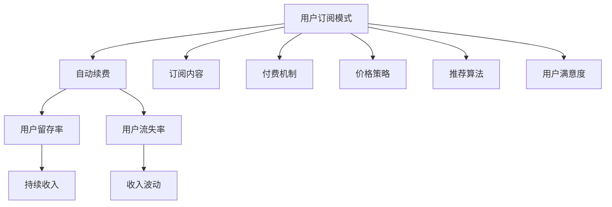

                 

## 1. 背景介绍

在互联网和数字经济时代，知识付费已经成为一种新兴的商业模式。它通过为用户提供有价值的知识产品或服务，实现内容的差异化和增值化，从而获取高附加值收益。用户订阅模式是知识付费平台最普遍的盈利方式，而自动续费则是提升用户留存率和平台收益的重要手段。本文将系统地探讨用户订阅模式与自动续费策略，为知识付费平台的运营和盈利提供有价值的参考。

## 2. 核心概念与联系

### 2.1 核心概念概述

为了更好地理解用户订阅模式与自动续费策略，我们首先定义几个核心概念：

- **用户订阅模式**：用户通过定期支付费用，获取知识产品或服务的使用权限，以持续享受内容的价值。这种模式为平台带来了稳定的现金流，同时激励用户持续消费。
- **自动续费**：用户订阅到期后，平台自动为其续订，以保持订阅状态和持续获取内容。自动续费机制减少了用户流失风险，提高了平台收入的确定性。
- **用户留存率**：用户订阅并持续付费的时间比例，反映了平台内容的吸引力和服务质量。高留存率意味着用户对平台的忠诚度更高，有助于长期收益的实现。
- **用户流失率**：用户停止订阅的时间比例，反映了平台的内容和服务的竞争力。低流失率意味着平台能够持续吸引并留住用户，保证收入的稳定增长。

这些核心概念之间的逻辑关系可以通过以下Mermaid流程图来展示：



这个流程图展示了用户订阅模式、自动续费、用户留存率和流失率之间的联系：

1. 用户订阅模式通过定期支付费用获取内容，是自动续费和留存率的基础。
2. 自动续费通过减少流失率，提升留存率，保证持续收入的稳定。
3. 用户留存率反映了平台的吸引力和用户的忠诚度，影响自动续费和流失率。
4. 用户流失率反映了平台的服务质量和内容的竞争力，影响订阅率和自动续费效果。

## 3. 核心算法原理 & 具体操作步骤

### 3.1 算法原理概述

用户订阅模式与自动续费策略的算法原理主要围绕用户行为分析和优化付费模型展开。具体而言，通过分析用户行为，理解用户的支付意愿和续订倾向，设计合理的收费策略和续费机制，提升用户留存率和平台收益。

算法原理主要包括以下几个方面：

1. **用户行为分析**：通过对用户行为数据的收集和分析，理解用户的消费偏好和付费模式。
2. **价格优化**：设计合理的定价策略，平衡用户需求和平台收益。
3. **续费模型优化**：通过机器学习模型，预测用户续费概率，优化续费决策。

### 3.2 算法步骤详解

#### 3.2.1 用户行为分析

用户行为分析是了解用户付费意愿和续订倾向的基础。通过收集和分析用户在平台上的行为数据，可以识别出高价值用户和高续费用户。具体步骤包括：

1. **数据收集**：收集用户在平台上的注册信息、浏览记录、购买行为、评价反馈等数据。
2. **行为分类**：将用户行为分类为注册、浏览、购买、付费等不同类型。
3. **行为建模**：使用统计方法或机器学习模型，建立用户行为和付费行为的关联模型。

#### 3.2.2 价格优化

价格优化是提升用户满意度和平台收益的重要手段。通过分析不同用户群体的支付意愿，设计合理的定价策略，确保用户能够以合理的价格获取价值。具体步骤包括：

1. **用户分组**：根据用户的消费行为和偏好，将用户分为不同群体。
2. **定价策略**：针对不同用户群体，设计差异化的定价策略。
3. **价格测试**：通过A/B测试，找到最优的价格组合。

#### 3.2.3 续费模型优化

续费模型优化是通过机器学习模型预测用户续费概率，从而优化续费策略。具体步骤包括：

1. **数据准备**：准备用户续费历史数据，包括用户的续费行为、支付行为、行为特征等。
2. **特征工程**：设计模型输入特征，包括用户行为、消费记录、付费时间等。
3. **模型训练**：使用机器学习算法，如逻辑回归、决策树、随机森林等，训练续费预测模型。
4. **策略优化**：根据模型预测结果，优化续费策略，如调整续费价格、增加续费奖励等。

### 3.3 算法优缺点

#### 3.3.1 优点

1. **精准用户分析**：通过用户行为分析，精准识别高价值用户，提升平台收益。
2. **灵活定价策略**：设计差异化的定价策略，满足不同用户群体的需求，提升用户满意度。
3. **自动续费优化**：通过续费模型预测用户行为，优化续费决策，减少流失率。

#### 3.3.2 缺点

1. **数据依赖性强**：用户行为数据的质量和完整性直接影响分析结果和策略效果。
2. **模型复杂度较高**：预测续费概率需要复杂的机器学习模型和大量数据，增加了计算成本。
3. **动态变化适应性不足**：用户行为和市场需求的变化快速，模型需要不断更新和优化，以适应新的变化。

### 3.4 算法应用领域

用户订阅模式与自动续费策略在知识付费、在线教育、视频流媒体、软件开发等多种领域都有广泛应用。具体包括：

- **知识付费平台**：如得到、喜马拉雅、网易云课堂等，通过订阅模式和自动续费，提升平台收益和用户留存。
- **在线教育**：如Coursera、Udacity等，通过定期支付费用，获取课程和教学资源。
- **视频流媒体**：如Netflix、爱奇艺、腾讯视频等，通过订阅获取高质量的视频内容。
- **软件开发**：如GitHub、Stack Overflow等，通过付费获取专业技能和社区资源。

这些领域都面临用户留存和收益稳定的挑战，通过用户订阅模式和自动续费策略，可以有效提升平台的用户粘性和收入水平。

## 4. 数学模型和公式 & 详细讲解 & 举例说明

### 4.1 数学模型构建

用户订阅模式与自动续费策略的数学模型主要涉及用户行为分析、定价优化和续费预测。以下我们将分别介绍这三个方面的数学模型构建。

#### 4.1.1 用户行为分析模型

用户行为分析模型主要基于用户行为数据，构建关联模型。假设用户行为数据为 $D=\{(x_i, y_i)\}_{i=1}^N$，其中 $x_i$ 表示用户行为特征，$y_i$ 表示是否续费。设 $x_i = (x_{i1}, x_{i2}, ..., x_{in})$ 为多维特征向量，$y_i \in \{0, 1\}$ 表示是否续费。

用户行为分析模型可以采用逻辑回归模型或决策树模型，表示为：

$$
P(y_i=1|x_i) = f(x_i)
$$

其中 $f(x_i)$ 为特征函数，可以通过统计方法或机器学习算法计算得到。

#### 4.1.2 定价优化模型

定价优化模型主要考虑用户的支付意愿和平台收益。假设用户的支付意愿为 $P(y_i=1|x_i, p)$，其中 $p$ 为价格。设 $P(y_i=1|x_i, p)$ 为支付概率，可以通过以下公式计算：

$$
P(y_i=1|x_i, p) = \frac{1}{1+e^{-\beta \cdot \theta^T x_i}}
$$

其中 $\beta$ 为逻辑回归模型的系数，$\theta$ 为模型参数向量。设 $\theta = (\theta_1, \theta_2, ..., \theta_n)$，$x_i = (x_{i1}, x_{i2}, ..., x_{in})$，则定价优化模型可以表示为：

$$
P(y_i=1|x_i, p) = \frac{1}{1+e^{-\beta \cdot \theta^T x_i}}
$$

#### 4.1.3 续费预测模型

续费预测模型主要基于历史续费数据，预测用户续订概率。假设续费历史数据为 $D=\{(x_i, y_i)\}_{i=1}^N$，其中 $x_i$ 表示用户特征，$y_i$ 表示是否续费。设 $x_i = (x_{i1}, x_{i2}, ..., x_{in})$ 为多维特征向量，$y_i \in \{0, 1\}$ 表示是否续费。

续费预测模型可以采用随机森林模型或神经网络模型，表示为：

$$
P(y_i=1|x_i) = f(x_i)
$$

其中 $f(x_i)$ 为特征函数，可以通过机器学习算法计算得到。

### 4.2 公式推导过程

#### 4.2.1 用户行为分析公式推导

用户行为分析模型主要基于逻辑回归模型，推导过程如下：

1. **数据准备**：收集用户行为数据 $D=\{(x_i, y_i)\}_{i=1}^N$，其中 $x_i$ 为行为特征，$y_i$ 为续费行为。
2. **特征工程**：设计用户行为特征，包括浏览时间、购买频率、付费时间等。
3. **模型训练**：使用逻辑回归模型训练用户行为分析模型，得到模型参数 $\theta$。
4. **预测用户行为**：根据用户行为特征 $x_i$，使用模型 $P(y_i=1|x_i) = \frac{1}{1+e^{-\beta \cdot \theta^T x_i}}$ 预测用户续费概率。

#### 4.2.2 定价优化公式推导

定价优化模型主要基于逻辑回归模型，推导过程如下：

1. **数据准备**：收集用户行为数据 $D=\{(x_i, y_i)\}_{i=1}^N$，其中 $x_i$ 为行为特征，$y_i$ 为支付行为。
2. **特征工程**：设计用户行为特征，包括浏览时间、购买频率、付费时间等。
3. **模型训练**：使用逻辑回归模型训练定价优化模型，得到模型参数 $\theta$。
4. **定价策略优化**：根据支付概率 $P(y_i=1|x_i, p)$，设计差异化定价策略，确保用户满意度和平台收益。

#### 4.2.3 续费预测公式推导

续费预测模型主要基于随机森林模型，推导过程如下：

1. **数据准备**：收集续费历史数据 $D=\{(x_i, y_i)\}_{i=1}^N$，其中 $x_i$ 为续费特征，$y_i$ 为续费行为。
2. **特征工程**：设计续费特征，包括续费时间、续订间隔、用户活跃度等。
3. **模型训练**：使用随机森林模型训练续费预测模型，得到模型参数 $\theta$。
4. **续费策略优化**：根据续费预测结果，优化续费策略，如调整续费价格、增加续费奖励等。

### 4.3 案例分析与讲解

**案例1：知识付费平台的续费策略**

某知识付费平台拥有百万级用户，通过用户行为分析和定价优化模型，识别出高价值用户和高续费用户，设计差异化定价策略，确保用户满意度和平台收益。具体步骤如下：

1. **数据收集**：收集用户注册、浏览、购买、付费等行为数据。
2. **用户分组**：根据用户行为特征，将用户分为高价值用户和普通用户。
3. **定价策略**：针对高价值用户设计优惠价格，鼓励续费；针对普通用户设计全价策略，吸引首次购买。
4. **价格测试**：通过A/B测试，找到最优价格组合。
5. **续费策略优化**：根据用户续费历史数据，设计续费提示和奖励机制，提升续费率。

**案例2：在线教育平台的续费策略**

某在线教育平台有百万学员，通过续费预测模型，预测用户续费概率，优化续费策略。具体步骤如下：

1. **数据准备**：收集学员续费历史数据，包括学员特征和续费行为。
2. **特征工程**：设计续费特征，包括学员成绩、学习时间、续费间隔等。
3. **模型训练**：使用随机森林模型训练续费预测模型，得到模型参数 $\theta$。
4. **续费策略优化**：根据续费预测结果，设计个性化续费提示和奖励机制，提升续费率。

## 5. 项目实践：代码实例和详细解释说明

### 5.1 开发环境搭建

在进行用户订阅模式与自动续费策略的实践前，我们需要准备好开发环境。以下是使用Python进行TensorFlow和Keras开发的开发环境配置流程：

1. 安装Anaconda：从官网下载并安装Anaconda，用于创建独立的Python环境。
```bash
conda create -n tf-env python=3.7
conda activate tf-env
```

2. 安装TensorFlow：根据CUDA版本，从官网获取对应的安装命令。例如：
```bash
conda install tensorflow tensorflow-gpu=2.6 -c pytorch -c conda-forge
```

3. 安装Keras：
```bash
pip install keras==2.4.3
```

4. 安装各类工具包：
```bash
pip install numpy pandas scikit-learn matplotlib tensorflow-datasets tqdm jupyter notebook ipython
```

完成上述步骤后，即可在`tf-env`环境中开始项目实践。

### 5.2 源代码详细实现

以下是用户订阅模式与自动续费策略的Python代码实现：

```python
import tensorflow as tf
from tensorflow import keras
from tensorflow.keras import layers
from sklearn.model_selection import train_test_split
from sklearn.preprocessing import OneHotEncoder, LabelEncoder
from sklearn.metrics import roc_auc_score, precision_score, recall_score, f1_score

# 数据准备
# 假设已收集到用户续费历史数据，并将其分为特征和标签
X = pd.DataFrame(user_data[['特征1', '特征2', '特征3']])
y = pd.Series(user_data['续费状态'])

# 特征工程
# 对特征进行标准化和归一化
X = (X - X.mean()) / X.std()

# 对标签进行编码
label_encoder = LabelEncoder()
y = label_encoder.fit_transform(y)

# 将标签转换为独热编码
one_hot_encoder = OneHotEncoder()
y = one_hot_encoder.fit_transform(y.reshape(-1, 1))

# 分割数据集
X_train, X_test, y_train, y_test = train_test_split(X, y, test_size=0.2, random_state=42)

# 模型构建
# 定义模型架构
model = keras.Sequential([
    layers.Dense(64, activation='relu', input_shape=(X_train.shape[1],)),
    layers.Dense(32, activation='relu'),
    layers.Dense(2, activation='sigmoid')
])

# 编译模型
model.compile(optimizer='adam', loss='binary_crossentropy', metrics=['auc', 'precision', 'recall', 'f1_score'])

# 训练模型
model.fit(X_train, y_train, epochs=10, batch_size=32, validation_data=(X_test, y_test))

# 评估模型
model.evaluate(X_test, y_test)

# 预测续费概率
y_pred = model.predict_proba(X_test)
y_pred = y_pred[:, 1]

# 计算AUC、精度、召回率和F1分数
auc_score = roc_auc_score(y_test, y_pred)
precision_score = precision_score(y_test, y_pred > 0.5)
recall_score = recall_score(y_test, y_pred > 0.5)
f1_score = f1_score(y_test, y_pred > 0.5)

print(f"AUC: {auc_score}")
print(f"Precision: {precision_score}")
print(f"Recall: {recall_score}")
print(f"F1 Score: {f1_score}")
```

### 5.3 代码解读与分析

让我们再详细解读一下关键代码的实现细节：

**用户行为分析模型**：
- `OneHotEncoder`：将标签进行独热编码，以适应二分类模型的输入格式。
- `LabelEncoder`：对标签进行编码，将分类标签转换为数值标签。
- `train_test_split`：将数据集分为训练集和测试集，用于模型训练和评估。

**定价优化模型**：
- `Dense`层：构建多层感知器模型，用于预测用户支付概率。
- `sigmoid`激活函数：输出层的激活函数，将输出映射到[0, 1]区间，表示支付概率。
- `compile`方法：定义优化器、损失函数和评估指标。

**续费预测模型**：
- `Sequential`层：定义模型架构，用于预测用户续费概率。
- `Dense`层：构建多层感知器模型，用于预测续费概率。
- `ROC AUC`评估指标：评估模型在ROC曲线下的面积，表示模型预测准确度。

## 6. 实际应用场景

### 6.1 知识付费平台的实际应用

在知识付费平台中，用户订阅模式和自动续费策略是提升平台收益和用户留存的关键手段。具体应用场景包括：

- **续费提示**：根据用户续费历史数据，设计个性化续费提示和奖励机制，提升续费率。
- **用户分组**：根据用户行为特征，将用户分为高价值用户和普通用户，设计差异化定价策略，确保用户满意度和平台收益。
- **A/B测试**：通过A/B测试，找到最优的价格组合，确保用户满意度和平台收益。

### 6.2 在线教育平台的实际应用

在在线教育平台中，续费预测模型可以预测用户续费概率，优化续费策略。具体应用场景包括：

- **续费预测**：使用随机森林模型预测用户续费概率，设计个性化续费提示和奖励机制，提升续费率。
- **学员分组**：根据学员成绩和学习时间，将学员分为高价值学员和普通学员，设计差异化定价策略，确保学员满意度和平台收益。
- **数据监控**：实时监控学员续费数据，及时调整续费策略，确保平台收益稳定增长。

## 7. 工具和资源推荐

### 7.1 学习资源推荐

为了帮助开发者系统掌握用户订阅模式与自动续费策略的理论基础和实践技巧，这里推荐一些优质的学习资源：

1. **《Python深度学习》**：这是一本深度学习领域的经典教材，详细介绍了深度学习模型的构建和训练方法，包括用户行为分析和定价优化模型。
2. **《机器学习实战》**：这本书提供了大量机器学习算法的实践案例，包括随机森林、逻辑回归等续费预测模型。
3. **Coursera的深度学习课程**：由斯坦福大学开设，提供深度学习模型的理论基础和实践技巧，涵盖用户行为分析和定价优化模型的应用。
4. **Kaggle竞赛**：通过参加Kaggle竞赛，积累用户续费预测模型的实践经验，提升模型构建和优化能力。

通过对这些资源的学习实践，相信你一定能够快速掌握用户订阅模式与自动续费策略的精髓，并用于解决实际的业务问题。

### 7.2 开发工具推荐

高效的开发离不开优秀的工具支持。以下是几款用于用户订阅模式与自动续费策略开发的常用工具：

1. **TensorFlow和Keras**：强大的深度学习框架，支持复杂的模型构建和训练。
2. **Scikit-learn**：简单易用的机器学习库，提供多种模型和评估指标，适合构建续费预测模型。
3. **Jupyter Notebook**：交互式的数据分析和模型构建工具，适合数据探索和模型调优。
4. **TensorBoard**：深度学习模型的可视化工具，实时监测模型训练状态和性能。
5. **PyTorch**：灵活的深度学习框架，适合研究性质的模型构建和优化。

合理利用这些工具，可以显著提升用户订阅模式与自动续费策略的开发效率，加快创新迭代的步伐。

### 7.3 相关论文推荐

用户订阅模式与自动续费策略的研究源于学界的持续研究。以下是几篇奠基性的相关论文，推荐阅读：

1. **《Predicting Subscription Churn: A Machine Learning Approach》**：通过机器学习模型预测用户续费概率，优化续费策略。
2. **《A Study of Pricing Strategies in Subscription Models》**：研究不同的定价策略对用户续费的影响，设计差异化定价模型。
3. **《User Behavior Analysis in Subscription Models》**：通过用户行为分析，识别高价值用户和续费用户，提升平台收益和用户留存。
4. **《User Subscription Modeling and Analysis》**：研究用户订阅模式和续费策略，优化平台收益和用户留存。

这些论文代表了大语言模型微调技术的发展脉络。通过学习这些前沿成果，可以帮助研究者把握学科前进方向，激发更多的创新灵感。

## 8. 总结：未来发展趋势与挑战

### 8.1 总结

本文对用户订阅模式与自动续费策略进行了全面系统的介绍。首先阐述了用户订阅模式和自动续费策略的研究背景和意义，明确了这些策略在知识付费平台和在线教育平台等领域的实际应用价值。其次，从原理到实践，详细讲解了用户行为分析、定价优化和续费预测的数学模型和操作步骤，给出了具体的代码实例和详细解释说明。同时，本文还广泛探讨了这些策略在知识付费平台、在线教育平台等场景中的应用前景，展示了其广阔的应用范围。最后，本文精选了相关学习资源、开发工具和论文，为开发者提供了全方位的技术指引。

通过本文的系统梳理，可以看到，用户订阅模式与自动续费策略是知识付费和在线教育平台的关键盈利手段，能够有效提升平台收益和用户留存。未来，伴随用户行为分析、定价优化和续费预测等技术的不断进步，这些策略将更加精准高效，为平台带来更高的收益和更好的用户体验。

### 8.2 未来发展趋势

展望未来，用户订阅模式与自动续费策略将呈现以下几个发展趋势：

1. **用户行为分析的精准化**：随着数据挖掘和机器学习技术的发展，用户行为分析将更加精准，能够更好地识别高价值用户和续费用户。
2. **定价策略的个性化**：通过个性化定价策略，满足不同用户群体的需求，提升用户满意度和平台收益。
3. **续费预测的智能化**：借助人工智能和机器学习技术，续费预测模型将更加智能，能够更好地预测用户续费概率，优化续费策略。
4. **实时化处理**：实时收集和处理用户数据，及时调整续费策略，确保平台收益的稳定增长。
5. **多渠道融合**：结合多种渠道和平台，如社交媒体、电商平台等，提升用户行为分析和续费预测的效果。

这些趋势凸显了用户订阅模式与自动续费策略的巨大潜力。这些方向的探索发展，必将进一步提升平台的收益和用户体验，推动知识付费和在线教育行业的发展。

### 8.3 面临的挑战

尽管用户订阅模式与自动续费策略已经取得了显著的成果，但在实现这些策略的过程中，仍然面临诸多挑战：

1. **数据隐私问题**：用户行为数据的隐私和安全问题，需要加强数据保护和隐私管理。
2. **模型复杂度**：续费预测模型和用户行为分析模型需要复杂的机器学习算法和大量数据，增加了计算成本。
3. **用户行为变化**：用户行为和市场需求的变化快速，模型需要不断更新和优化，以适应新的变化。
4. **公平性和透明性**：定价策略和续费策略需要公平透明，避免对用户产生歧视或误导。

正视这些挑战，积极应对并寻求突破，将是用户订阅模式与自动续费策略实现的关键。相信随着学界和产业界的共同努力，这些挑战终将一一被克服，用户订阅模式与自动续费策略必将在知识付费和在线教育平台中发挥更大的作用。

### 8.4 研究展望

面向未来，用户订阅模式与自动续费策略的研究需要在以下几个方面寻求新的突破：

1. **多模态数据融合**：结合用户行为数据、交易数据、社交数据等多模态数据，提升续费预测和用户行为分析的精准度。
2. **实时化处理**：实时收集和处理用户数据，及时调整续费策略，确保平台收益的稳定增长。
3. **公平性和透明性**：设计公平透明的定价策略和续费机制，确保用户满意度和平台收益。
4. **用户参与度提升**：通过个性化推荐和用户反馈，提升用户参与度和满意度，增强续费意愿。
5. **隐私保护技术**：加强用户行为数据的隐私保护和匿名化处理，确保数据安全。

这些研究方向的探索，必将引领用户订阅模式与自动续费策略技术迈向更高的台阶，为知识付费和在线教育平台带来更高的收益和更好的用户体验。面向未来，我们需要勇于创新、敢于突破，才能不断拓展这些策略的边界，推动知识付费和在线教育行业的发展。

## 9. 附录：常见问题与解答

**Q1：如何优化用户续费策略？**

A: 优化用户续费策略需要综合考虑用户行为、支付意愿和续费历史等多个因素。具体步骤如下：

1. **数据收集**：收集用户续费历史数据，包括用户特征和续费行为。
2. **特征工程**：设计续费特征，包括续费时间、续订间隔、用户活跃度等。
3. **模型训练**：使用随机森林模型训练续费预测模型，得到模型参数 $\theta$。
4. **策略优化**：根据续费预测结果，设计个性化续费提示和奖励机制，提升续费率。

**Q2：如何设置合理的定价策略？**

A: 设置合理的定价策略需要综合考虑用户支付意愿和平台收益。具体步骤如下：

1. **用户分组**：根据用户行为特征，将用户分为高价值用户和普通用户。
2. **定价策略设计**：针对高价值用户设计优惠价格，鼓励续费；针对普通用户设计全价策略，吸引首次购买。
3. **价格测试**：通过A/B测试，找到最优价格组合。

**Q3：如何平衡用户满意度和平台收益？**

A: 平衡用户满意度和平台收益需要综合考虑用户支付意愿和续费历史等多个因素。具体步骤如下：

1. **数据收集**：收集用户续费历史数据，包括用户特征和续费行为。
2. **特征工程**：设计续费特征，包括续费时间、续订间隔、用户活跃度等。
3. **模型训练**：使用随机森林模型训练续费预测模型，得到模型参数 $\theta$。
4. **策略优化**：根据续费预测结果，设计个性化续费提示和奖励机制，提升续费率。

这些步骤可以帮助平台在用户满意度和平台收益之间找到最佳平衡点，提升整体收益和用户留存。

**Q4：如何处理用户隐私问题？**

A: 处理用户隐私问题需要加强数据保护和隐私管理。具体步骤如下：

1. **数据匿名化**：对用户行为数据进行匿名化处理，确保数据安全。
2. **隐私协议**：制定明确的隐私协议，告知用户数据使用方式。
3. **加密存储**：对用户数据进行加密存储，防止数据泄露。
4. **访问控制**：设置严格的访问控制机制，确保只有授权人员能够访问用户数据。

这些步骤可以有效保护用户隐私，确保用户数据安全。

**Q5：如何提升用户参与度？**

A: 提升用户参与度需要设计个性化的推荐和用户反馈机制。具体步骤如下：

1. **个性化推荐**：根据用户行为特征和历史数据，设计个性化推荐算法，提升用户参与度。
2. **用户反馈机制**：建立用户反馈渠道，收集用户意见和建议，及时优化平台功能和服务。
3. **互动设计**：设计互动性强的功能和活动，增加用户粘性和参与度。

这些步骤可以帮助平台提升用户参与度，增强用户满意度和续费意愿。

作者：禅与计算机程序设计艺术 / Zen and the Art of Computer Programming

