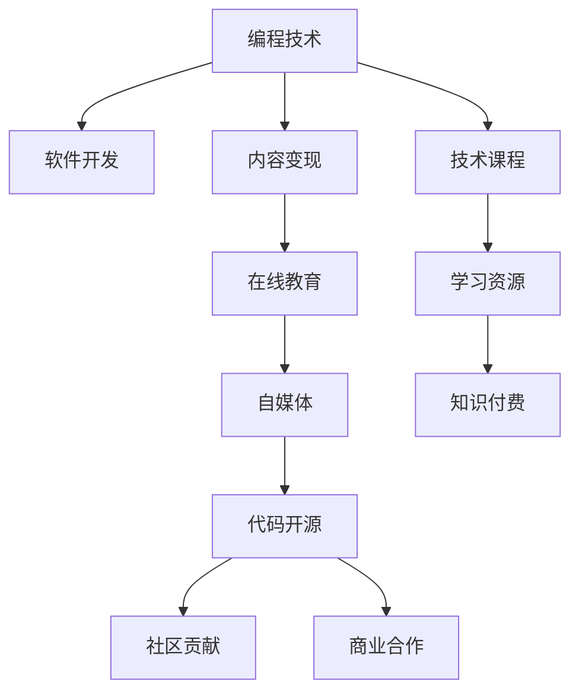

                 

# 知识付费：程序员实现财富自由的新途径

> 关键词：知识付费,程序员,财富自由,自媒体,编程技术,软件开发,在线教育,技术课程,内容变现

## 1. 背景介绍

在当今知识爆炸的时代，如何有效获取、应用知识，并从中获得个人收益，已成为许多人的关注焦点。随着互联网和移动技术的飞速发展，知识付费模式应运而生，为有知识的个体提供了新的商业机会。对于程序员这一群体而言，这不仅是职业技能的提升，更是一条通往财富自由的新途径。

### 1.1 知识付费兴起的原因

知识付费的兴起，主要得益于以下几个方面：

- **信息爆炸与知识稀缺**：互联网时代，信息量大爆炸，但优质内容稀缺。
- **时间成本**：在信息泛滥的时代，通过筛选和获取有效信息需要大量时间。
- **学习成本**：线下课程、培训费用昂贵，线上教育相对更加便宜。
- **个性化需求**：用户越来越倾向于选择更适合自己的知识产品。

这些因素共同驱动了知识付费市场的快速发展。

### 1.2 程序员与知识付费

程序员这一群体，具备较强的自学能力和对新技术的敏感性，这使得他们更有可能通过知识付费实现自我增值。特别是那些具备较高技术水平和丰富经验的资深程序员，他们不仅自身在不断学习新技术、提升技能，也开始尝试通过知识输出分享自己的专业经验，从而获取收入。

## 2. 核心概念与联系

### 2.1 核心概念概述

在探讨程序员如何通过知识付费实现财富自由之前，我们首先明确几个核心概念：

- **知识付费**：用户为获取知识或技能而支付费用，知识提供者通过内容变现获得收入。
- **编程技术**：编程语言、开发框架、软件工程等相关技术。
- **自媒体**：通过互联网平台（如博客、视频网站、社交媒体等）传播个人思想和信息。
- **内容变现**：将有价值的内容转化为货币收益的过程。
- **软件开发**：从需求分析、设计、编码到测试、维护的整个过程。
- **在线教育**：借助互联网进行知识传播和技能培训，主要形式包括在线课程、直播授课、学习社区等。
- **技术课程**：针对特定技术领域进行系统性培训的课程。
- **代码开源**：程序员通过发布自己编写的代码，让他人免费使用，并从中获取社区贡献或商业合作机会。

### 2.2 核心概念联系

这些核心概念之间的联系，可以通过以下Mermaid流程图来展示：



这个流程图展示了几组核心概念之间的逻辑关系：

1. 编程技术作为软件开发的基础，不断推动技术课程的更新。
2. 技术课程和在线教育是知识付费的主要形式，同时也是内容变现的途径之一。
3. 自媒体和代码开源是程序员自我品牌打造的方式，通过这些渠道可以将自己的技术成果转化为经济收益。
4. 内容变现不仅限于知识付费，还可以通过商业合作、技术咨询等多种方式进行。

## 3. 核心算法原理 & 具体操作步骤

### 3.1 算法原理概述

对于程序员而言，利用知识付费模式实现财富自由，可以采用以下步骤：

1. **选择专业领域**：根据自身擅长的技术领域选择专业方向，如前端开发、后端开发、人工智能等。
2. **建立自媒体平台**：通过博客、视频网站、社交媒体等渠道建立个人品牌。
3. **创作高质量内容**：发布与专业领域相关的高质量技术文章、教程、项目案例等。
4. **建立知识付费体系**：通过付费文章、视频课程、在线讲座等形式，将知识转化为货币收益。
5. **拓展商业合作**：与企业、组织合作，提供技术咨询、软件开发、项目培训等服务。

### 3.2 算法步骤详解

以下将详细介绍每个步骤的具体操作方法：

#### 3.2.1 选择专业领域

选择合适的专业领域是成功的基础。可以从以下几个方面考虑：

- **市场需求**：了解当前市场上对哪类技术的需求较大。
- **个人兴趣**：选择自己真正感兴趣的技术领域，长期坚持才能持续输出高质量内容。
- **竞争环境**：分析现有市场上的竞争者，找出差异化点。

#### 3.2.2 建立自媒体平台

建立自媒体平台主要分为以下步骤：

1. **选择平台**：根据内容形式选择合适的平台，如博客（如Medium、CSDN）、视频网站（如YouTube、Bilibili）、社交媒体（如Twitter、LinkedIn）等。
2. **设置账号**：创建账号，并进行个性化设置，如头像、签名、联系方式等。
3. **发布内容**：定期发布专业相关的技术文章、项目案例、视频教程等。
4. **互动交流**：积极与粉丝互动，回复评论，建立良好的社区氛围。

#### 3.2.3 创作高质量内容

高质量的内容是吸引用户的关键。以下是一些具体的创作建议：

1. **内容结构**：文章结构清晰，包含引言、正文、结论等部分。
2. **实用价值**：内容要有实际应用价值，解决读者具体问题。
3. **图文并茂**：利用代码片段、图表、动画等增加内容的可读性。
4. **持续更新**：定期更新内容，保持平台活跃度。
5. **用户反馈**：根据用户反馈不断改进内容。

#### 3.2.4 建立知识付费体系

知识付费体系的建立需要以下步骤：

1. **内容打包**：将优质内容打包为付费文章、视频课程、在线讲座等形式。
2. **定价策略**：根据内容难度、价值等设定合理价格。
3. **支付平台**：选择合适的支付平台，如PayPal、微信支付、支付宝等。
4. **内容分发**：通过自媒体平台、邮件列表等方式分发付费内容。
5. **客户服务**：提供客户支持和反馈渠道，提升用户满意度。

#### 3.2.5 拓展商业合作

拓展商业合作可以通过以下途径：

1. **技术咨询**：为企业提供技术咨询，解决实际问题。
2. **软件开发**：承接软件开发项目，提供完整的解决方案。
3. **项目培训**：为企业或个人提供项目培训，提升技能。
4. **开源项目**：发布开源项目，吸引社区贡献和商业合作。

### 3.3 算法优缺点

#### 3.3.1 优点

1. **提升技能**：持续输出技术内容，不断提升自身技术水平。
2. **扩大影响力**：通过自媒体平台扩大个人影响力，建立品牌。
3. **多元收入**：不仅有知识付费收入，还有技术咨询、软件开发等多种收入来源。
4. **灵活工作**：时间安排自由，可以根据个人情况灵活安排工作时间。

#### 3.3.2 缺点

1. **时间和精力投入大**：需要投入大量时间和精力进行内容创作和平台维护。
2. **竞争激烈**：技术领域竞争激烈，需要持续创新和提升。
3. **市场变化快**：技术市场变化快，需要不断学习和适应新技术。
4. **收入不稳定**：知识付费和商业合作的收入可能受市场波动影响，存在一定的不确定性。

### 3.4 算法应用领域

知识付费模式不仅适用于程序员，更适用于所有有知识、有技能的人。以下是几个具体的应用领域：

- **教育培训**：老师、学者通过在线课程、直播讲座等形式，将专业知识传授给学生。
- **自媒体**：作家、艺术家通过博客、视频平台分享创意和作品，吸引粉丝订阅和打赏。
- **技术咨询**：资深工程师为企业提供技术支持，帮助企业解决技术难题。
- **软件开发**：自由职业者通过开源项目、接单开发等方式，获得商业收入。
- **产品推广**：企业通过品牌专家、行业领袖的知识分享，提升产品知名度。
- **知识营销**：品牌通过专家讲座、技术白皮书等形式，提升品牌价值和市场影响力。

## 4. 数学模型和公式 & 详细讲解 & 举例说明

### 4.1 数学模型构建

假设程序员A在知识付费平台上有$N$篇技术文章，每篇文章$i$的阅读次数为$R_i$，价格为$P_i$，订阅用户数为$S_i$，平均订阅价格为$A$。则知识付费的总收入$I$可以表示为：

$$
I = \sum_{i=1}^N (P_i \times S_i)
$$

其中$P_i$和$S_i$为文章的定价和订阅量，均值为$A$。

### 4.2 公式推导过程

在实际计算中，知识付费收入主要受以下几个因素影响：

1. **文章质量**：高质量文章更能吸引用户订阅，提高$S_i$。
2. **定价策略**：合理的定价策略能最大化$P_i \times S_i$。
3. **市场规模**：平台的用户数量$U$越大，总收入$I$越高。
4. **推广效果**：有效的推广策略能提升文章曝光率，吸引更多用户订阅。

设$x_i$为文章$i$的质量评分，$y_i$为文章$i$的订阅量，则有：

$$
S_i = x_i \times k_1 \times U
$$

$$
P_i = a \times \frac{x_i}{x_{max}} + b
$$

其中$k_1$为订阅量与质量评分的线性关系系数，$a$、$b$为定价模型的参数，$x_{max}$为最大质量评分。

### 4.3 案例分析与讲解

假设程序员A有三篇技术文章，质量评分分别为3、5、7，订阅量分别为100、200、300。平台的用户数量为1000，定价模型参数为$a=0.1$、$b=10$。则总收入$I$和平均订阅价格$A$可以计算如下：

$$
S_1 = 3 \times k_1 \times 1000
$$

$$
P_1 = 0.1 \times \frac{3}{10} + 10 = 10.3
$$

$$
S_2 = 5 \times k_1 \times 1000
$$

$$
P_2 = 0.1 \times \frac{5}{10} + 10 = 10.5
$$

$$
S_3 = 7 \times k_1 \times 1000
$$

$$
P_3 = 0.1 \times \frac{7}{10} + 10 = 10.7
$$

$$
I = 10.3 \times 100 + 10.5 \times 200 + 10.7 \times 300 = 10300 + 2100 + 3210 = 15410
$$

$$
A = \frac{I}{N} = \frac{15410}{3} = 5140
$$

## 5. 项目实践：代码实例和详细解释说明

### 5.1 开发环境搭建

1. **Python环境**：安装最新版本的Python，推荐使用Anaconda。
2. **开发工具**：
   - **IDE**：Visual Studio Code、PyCharm、Sublime Text等。
   - **数据库**：SQLite、MySQL、MongoDB等。
   - **Web框架**：Flask、Django、FastAPI等。
3. **版本控制**：Git、GitHub、GitLab等。

### 5.2 源代码详细实现

以下是一个简单的代码示例，展示如何通过Python Flask框架搭建知识付费平台：

```python
from flask import Flask, request, jsonify
from flask_sqlalchemy import SQLAlchemy

app = Flask(__name__)
app.config['SQLALCHEMY_DATABASE_URI'] = 'sqlite:///data.db'
db = SQLAlchemy(app)

class Article(db.Model):
    id = db.Column(db.Integer, primary_key=True)
    title = db.Column(db.String(255), nullable=False)
    content = db.Column(db.Text, nullable=False)
    quality = db.Column(db.Float, nullable=False)
    price = db.Column(db.Float, nullable=False)
    views = db.Column(db.Integer, nullable=False)
    subscribers = db.Column(db.Integer, nullable=False)

@app.route('/articles', methods=['POST'])
def create_article():
    data = request.json
    article = Article(title=data['title'], content=data['content'], quality=data['quality'], price=data['price'])
    db.session.add(article)
    db.session.commit()
    return jsonify({'message': 'Article created successfully'})

@app.route('/articles/<id>', methods=['GET'])
def get_article(id):
    article = Article.query.get(id)
    views = article.views
    subscribers = article.subscribers
    total_views = views + subscribers
    return jsonify({'id': article.id, 'title': article.title, 'content': article.content, 'quality': article.quality, 'price': article.price, 'views': total_views})

@app.route('/articles', methods=['DELETE'])
def delete_article():
    article_id = request.args.get('id')
    article = Article.query.get(article_id)
    db.session.delete(article)
    db.session.commit()
    return jsonify({'message': 'Article deleted successfully'})

@app.route('/articles/<id>', methods=['PUT'])
def update_article(id):
    data = request.json
    article = Article.query.get(id)
    article.price = data['price']
    article.views = data['views']
    db.session.commit()
    return jsonify({'message': 'Article updated successfully'})

if __name__ == '__main__':
    app.run(debug=True)
```

### 5.3 代码解读与分析

该示例代码实现了一个简单的知识付费平台，包括文章创建、获取、删除和更新功能。通过Flask框架和SQLAlchemy ORM，可以方便地实现文章数据库的增删改查。

### 5.4 运行结果展示

在运行上述代码后，可以在本地访问`localhost:5000`地址，进行文章操作。通过该平台，可以轻松创建、管理、统计文章信息，并进行知识付费。

## 6. 实际应用场景

### 6.1 自媒体内容变现

通过自媒体平台，程序员可以将技术文章、视频教程等内容变现。例如，某程序员在Medium上发布了一系列关于Python编程的文章，获得大量订阅和打赏，从而获得稳定收入。

### 6.2 在线教育平台

在线教育平台如Udemy、Coursera等，广泛吸纳了各类技术专家，通过发布付费课程和培训讲座，帮助学生提升技能。某资深前端开发工程师在Udemy上发布了一系列JavaScript课程，获得了数万订阅用户，每年收入数十万美元。

### 6.3 技术咨询与软件开发

技术咨询和软件开发是程序员主要的商业合作形式。某高级工程师在GitHub上发布了多个开源项目，吸引了大量社区贡献和商业合作机会。同时，他也为企业提供技术咨询和定制开发服务，获得高额收入。

## 7. 工具和资源推荐

### 7.1 学习资源推荐

1. **《程序员代码面试指南》**：该书系统介绍了面试中常见技术问题，提供大量代码示例和解析。
2. **LeetCode**：在线编程题库，提供大量编程题和算法题，适合练习编程技巧。
3. **Coursera**：在线教育平台，提供来自世界顶级大学和公司的课程，涵盖多个技术领域。
4. **TED Talks**：TED演讲视频，涵盖多个科技领域，提供大量学习素材。
5. **YouTube**：视频平台，提供大量技术教学视频，适合自学和深入理解技术细节。

### 7.2 开发工具推荐

1. **Visual Studio Code**：轻量级、功能强大的代码编辑器，支持多种语言和插件。
2. **Git**：版本控制系统，适合团队协作和代码管理。
3. **Docker**：容器化技术，适合开发和部署复杂环境下的应用。
4. **JIRA**：项目管理工具，适合团队协作和任务跟踪。
5. **Slack**：团队沟通工具，适合实时协作和信息传递。

### 7.3 相关论文推荐

1. **《程序化语言行为》**：该书探讨了程序语言的设计原则和编程技巧，适合深入理解编程技术。
2. **《软件工程：原则与实践》**：该书系统介绍了软件开发的原则和方法，适合实际开发和项目管理。
3. **《面向对象编程：思想与实践》**：该书探讨了面向对象编程的思想和方法，适合深入理解编程范式。

## 8. 总结：未来发展趋势与挑战

### 8.1 研究成果总结

本文系统介绍了程序员如何通过知识付费模式实现财富自由。从选择专业领域、建立自媒体平台、创作高质量内容、建立知识付费体系、拓展商业合作等多个方面，详细讲解了知识付费的具体操作方法。

### 8.2 未来发展趋势

1. **AI与知识付费结合**：随着AI技术的进步，智能推荐、内容自动生成等技术将广泛应用于知识付费平台，提升用户体验和内容质量。
2. **数据驱动内容优化**：通过数据分析，优化内容发布策略和用户订阅行为，提升内容变现效果。
3. **多元化内容形式**：除了文章和视频，还可以通过直播、互动课程等形式提供更丰富的学习体验。
4. **社区建设**：通过社区建设，增强用户粘性和互动性，建立忠实粉丝群体。
5. **内容生态系统**：通过内容合作和资源共享，构建开放的知识付费生态系统。

### 8.3 面临的挑战

1. **市场竞争激烈**：知识付费市场竞争激烈，需要持续创新和提升内容质量。
2. **内容版权问题**：内容侵权问题频发，需要加强版权保护。
3. **用户粘性不足**：如何吸引和留住用户，提升平台活跃度。
4. **内容同质化**：内容同质化问题严重，需要差异化内容设计和独特价值主张。
5. **收入不稳定**：知识付费收入受市场波动影响，存在一定的不确定性。

### 8.4 研究展望

1. **知识图谱与内容推荐**：通过知识图谱技术，提供更精准的内容推荐，提升用户阅读体验。
2. **AI辅助创作**：利用AI技术辅助内容创作，提高生产效率和内容质量。
3. **区块链与版权保护**：利用区块链技术，实现内容版权的自动认证和保护。
4. **跨平台内容分发**：通过跨平台内容分发，扩大受众范围，提升平台影响力。
5. **社区与内容变现**：通过社区建设，实现内容变现，增强用户粘性。

## 9. 附录：常见问题与解答

**Q1: 程序员如何选择知识付费平台？**

A: 程序员在选择知识付费平台时，需要考虑以下几个因素：

1. **平台用户量**：用户量大的平台更容易获得流量和曝光。
2. **平台规则**：了解平台的规则和收费标准，选择合适的支付方式。
3. **平台功能**：平台功能是否齐全，如文章管理、订阅统计等。
4. **用户评价**：查看其他用户对该平台的评价和反馈。

**Q2: 如何提高知识付费文章质量？**

A: 提高知识付费文章质量可以从以下几个方面入手：

1. **深入研究技术**：持续学习新技术，掌握最新技术动态。
2. **内容结构清晰**：文章结构清晰，包含引言、正文、结论等部分。
3. **图文并茂**：利用代码片段、图表、动画等增加内容的可读性。
4. **用户反馈**：根据用户反馈不断改进内容。
5. **定期更新**：定期更新内容，保持平台活跃度。

**Q3: 程序员如何进行有效的市场营销？**

A: 程序员进行有效的市场营销可以从以下几个方面入手：

1. **建立个人品牌**：通过博客、社交媒体等渠道建立个人品牌，增加曝光度。
2. **参与技术社区**：积极参与技术社区，发布和分享技术内容。
3. **优化SEO**：优化文章SEO，提高搜索引擎排名，增加流量。
4. **社交媒体营销**：利用社交媒体平台进行推广和营销，吸引更多用户关注。
5. **联合推广**：与其他内容创作者或社区合作，共同推广内容。

**Q4: 程序员如何应对知识付费市场的不确定性？**

A: 程序员应对知识付费市场的不确定性可以从以下几个方面入手：

1. **多元化内容形式**：除了文章和视频，还可以通过直播、互动课程等形式提供更丰富的学习体验。
2. **数据驱动内容优化**：通过数据分析，优化内容发布策略和用户订阅行为，提升内容变现效果。
3. **社区建设**：通过社区建设，增强用户粘性和互动性，建立忠实粉丝群体。
4. **内容生态系统**：通过内容合作和资源共享，构建开放的知识付费生态系统。
5. **跨平台内容分发**：通过跨平台内容分发，扩大受众范围，提升平台影响力。

**Q5: 如何平衡个人兴趣与市场需求？**

A: 程序员在平衡个人兴趣与市场需求时，可以从以下几个方面入手：

1. **了解市场需求**：了解当前市场上对哪类技术的需求较大。
2. **选择感兴趣的技术领域**：选择自己真正感兴趣的技术领域，长期坚持才能持续输出高质量内容。
3. **市场调研**：进行市场调研，了解用户需求和反馈，调整内容方向。
4. **差异化内容设计**：提供独特价值主张，差异化内容设计。
5. **持续改进**：持续改进内容，保持与市场需求的同步。

---

作者：禅与计算机程序设计艺术 / Zen and the Art of Computer Programming

