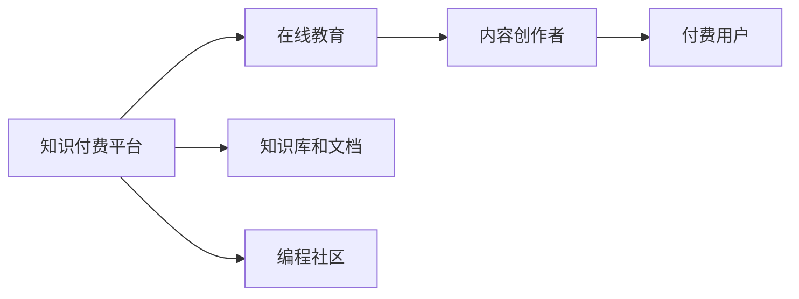

                 

# 知识付费：程序员的新型赚钱方式

## 1. 背景介绍

随着信息爆炸和知识迭代速度的加快，互联网用户对知识的需求日益增长。知识付费，即用户通过付费方式获取专业知识，已成为一种日益普及的学习方式。在知识付费市场中，程序员作为一个典型的技术人群，其知识与技能具有显著的市场需求。

### 1.1 问题由来

近十年来，互联网行业快速发展，程序员的岗位需求量激增。然而，由于程序员技术的复杂性和更新速度，新手和在职人员都面临着学习成本高、学习时间短等挑战。

一方面，传统的教学模式往往难以满足程序员的学习需求。学校课程与企业需求存在差距，书籍和文档更新速度较慢，线下课程往往费用高昂且时间限制性强。另一方面，开发者社区和开源项目虽然提供了大量资源，但质量参差不齐，新手难以甄别真伪。

### 1.2 问题核心关键点

知识付费为程序员提供了一种高效、便捷的学习渠道，通过付费获取优质、系统的教学内容，显著提升了学习效率和质量。这种模式在程序员群体中逐渐普及，已形成庞大的市场。

程序员知识付费的主要需求包括：
- 高效获取最新技术
- 高质量的课程和文档
- 快速的答疑和支持
- 个性化的学习方案

## 2. 核心概念与联系

### 2.1 核心概念概述

为更好地理解程序员知识付费的原理与实践，本节将介绍几个关键概念及其联系：

- **知识付费平台**：以“内容付费”模式运行的在线学习平台，提供各类知识、技能和经验分享。典型代表包括Coursera、Udacity、网易云课堂等。
- **在线教育**：通过互联网提供的各类课程和培训，涵盖从基础到高级的各类知识点。
- **知识库和文档**：程序员常用的编程语言、框架、工具等方面的详细参考资料。
- **编程社区**：程序员聚集的在线交流平台，如Stack Overflow、GitHub等。
- **内容创作者**：通过知识付费平台上传知识内容，获取收益的专家、教练和经验丰富的开发者。

这些概念之间的逻辑关系可以通过以下Mermaid流程图来展示：



这个流程图展示了这个系统的工作原理：

1. 知识付费平台汇聚各种在线教育资源和文档资料。
2. 内容创作者上传优质内容，平台对内容进行审核后发布。
3. 用户通过付费方式获取内容。
4. 用户与内容创作者之间的交互和反馈，进一步优化课程内容。

## 3. 核心算法原理 & 具体操作步骤
### 3.1 算法原理概述

知识付费平台的运营过程包括内容上传、审核、定价、分销和用户获取等环节，涉及数据处理、机器学习、推荐系统等算法。

其核心算法包括：
- **推荐算法**：根据用户历史行为数据推荐课程和内容，以提升用户满意度。
- **定价策略**：基于市场调研和课程难度，制定合适的课程价格，吸引用户付费。
- **内容审核**：通过图像识别、自然语言处理等技术，对课程内容进行审核，保证内容的准确性和质量。
- **用户画像**：通过数据分析，刻画用户的学习偏好、知识水平、职业背景等特征，优化个性化推荐。

### 3.2 算法步骤详解

#### 3.2.1 内容上传与审核

**内容上传流程**：
1. 内容创作者注册并登录知识付费平台。
2. 创建课程或文档，填写标题、描述、大纲、课程计划等信息。
3. 上传课程内容，可以是视频、文本、代码等。
4. 提交审核，审核通过后发布到平台。

**内容审核流程**：
1. 自动审核：平台通过图像识别技术检查课程内容中的图片、代码等，检测是否包含版权信息、广告等敏感内容。
2. 人工审核：平台专家团队对内容进行详细审核，确保内容的准确性、适用性和合规性。

#### 3.2.2 推荐算法

**用户行为数据收集**：
1. 点击、浏览、评分、购买等行为，作为用户兴趣和偏好数据。
2. 用户反馈，如评价、评论、问题解答等，进一步丰富用户画像。

**推荐模型构建**：
1. 协同过滤：基于用户历史行为推荐相关课程，如用户A购买了课程X，则推荐给A类似用户B。
2. 内容推荐：基于课程标签和关键词推荐相关课程，如课程A和B有相同标签，则推荐给学习A的用户。
3. 混合推荐：结合协同过滤和内容推荐，生成更准确的推荐结果。

**推荐效果评估**：
1. 召回率：推荐内容中包含用户感兴趣内容的比率。
2. 准确率：推荐内容与用户实际选择内容的一致性。

#### 3.2.3 定价策略

**市场调研**：
1. 通过问卷调查、市场分析等方式，了解目标用户愿意支付的价格。
2. 评估课程内容难度和深度，确定内容价值。

**定价模型**：
1. 基于内容价值的定价：课程内容复杂度、难度、长度等。
2. 动态定价：根据市场需求和竞争情况调整课程价格。
3. 订阅制与单次付费结合：用户可以选择单次付费或长期订阅。

### 3.3 算法优缺点

知识付费平台的算法具有以下优点：
- 高效推荐：通过协同过滤和内容推荐，用户可以快速获取高质量的课程和学习资源。
- 个性化服务：根据用户行为数据和反馈，生成个性化的推荐，提升用户满意度。
- 动态定价：根据市场需求和课程价值动态调整价格，增加收益。

同时，这些算法也存在以下缺点：
- 过度依赖数据：推荐系统的效果取决于数据量和质量，小规模平台可能数据不足。
- 冷启动问题：新用户缺乏历史行为数据，难以进行个性化推荐。
- 成本高昂：复杂的推荐算法和数据处理需要大量计算资源。
- 隐私风险：用户数据收集和存储可能面临隐私泄露的风险。

### 3.4 算法应用领域

知识付费平台覆盖了多个应用场景：
- 技能培训：程序员可以通过付费获取技术栈、算法和架构等相关课程。
- 项目实战：结合实际项目进行编程训练，如Web开发、移动应用、数据科学等。
- 知识普及：获取通用编程知识和编程习惯，提升编程水平。
- 软件开发工具：学习使用各种编程工具、框架和库。
- 在线问答：通过问答形式解决编程中遇到的问题。

## 4. 数学模型和公式 & 详细讲解 & 举例说明
### 4.1 数学模型构建

知识付费平台的推荐系统一般采用协同过滤、内容推荐等方法，构建推荐模型的数学模型如下：

**协同过滤模型**：
1. 用户-物品矩阵：$R \in \mathbb{R}^{U\times I}$，其中$U$为用户数，$I$为物品数。$R_{ui}$表示用户$u$对物品$i$的评分，$R_{ui}=0$表示未评分。
2. 用户和物品向量：$U \in \mathbb{R}^{U\times F}$，$I \in \mathbb{R}^{I\times F}$，$F$为特征数。
3. 用户-物品向量表示：$\mathbf{u}=\mathbf{R} \times \mathbf{I}^T$。
4. 评分预测：$\hat{R}_{ui}=\mathbf{u}^T \times \mathbf{v}_i$。

**内容推荐模型**：
1. 文本特征向量化：使用TF-IDF、Word2Vec、BERT等方法，将课程内容转换为向量。
2. 文本相似度计算：$\text{similarity}(a,b)=\mathbf{a}^T \times \mathbf{b}$，其中$\mathbf{a}$、$\mathbf{b}$为文本向量。
3. 内容推荐：$\text{rank}(i)=\text{similarity}(i, \text{related})$。

### 4.2 公式推导过程

**协同过滤模型推导**：
设$R_{ui}=1$表示用户$u$评分了物品$i$，$R_{ui}=0$表示未评分。用户向量为$\mathbf{u}=(u_1,u_2,\ldots,u_F)$，物品向量为$\mathbf{v}_i=(v_{i1},v_{i2},\ldots,v_{iF})$。
用户$u$对物品$i$的评分预测为$\hat{R}_{ui}=\mathbf{u}^T \times \mathbf{v}_i$。

**内容推荐模型推导**：
设课程内容向量为$\mathbf{a}$，相关课程向量为$\mathbf{b}$。
文本相似度计算公式为$\text{similarity}(a,b)=\mathbf{a}^T \times \mathbf{b}$。
内容推荐公式为$\text{rank}(i)=\text{similarity}(i, \text{related})$。

### 4.3 案例分析与讲解

**案例1：编程课程推荐**

用户$u$学习了Java课程，未学习Python课程。平台可以根据用户历史学习行为，推荐类似的课程。

设$R_{uj}=1$表示用户$u$学习了课程$j$。
用户向量为$\mathbf{u}=(u_1,u_2,\ldots,u_F)$。
未学习课程向量为$\mathbf{j}=(0,0,\ldots,1,0,\ldots)$。

预测用户对课程$j$的评分$\hat{R}_{uj}=\mathbf{u}^T \times \mathbf{j}=\sum_{k=1}^F u_k \times j_k$。
高评分课程推荐给用户$u$。

**案例2：Python框架推荐**

用户$u$学习了Django框架，平台可以根据用户历史学习行为，推荐其他主流框架。

设$R_{uJ}=1$表示用户$u$学习了框架$J$。
用户向量为$\mathbf{u}=(u_1,u_2,\ldots,u_F)$。
未学习框架向量为$\mathbf{J}=(0,0,\ldots,1,0,\ldots)$。

预测用户对框架$J$的评分$\hat{R}_{uJ}=\mathbf{u}^T \times \mathbf{J}=\sum_{k=1}^F u_k \times J_k$。
高评分框架推荐给用户$u$。

## 5. 项目实践：代码实例和详细解释说明
### 5.1 开发环境搭建

在进行知识付费平台开发前，我们需要准备好开发环境。以下是使用Python进行Flask开发的环境配置流程：

1. 安装Anaconda：从官网下载并安装Anaconda，用于创建独立的Python环境。

2. 创建并激活虚拟环境：
```bash
conda create -n flask-env python=3.8 
conda activate flask-env
```

3. 安装Flask：
```bash
pip install Flask
```

4. 安装相关库：
```bash
pip install pandas numpy scikit-learn Flask-RESTful
```

完成上述步骤后，即可在`flask-env`环境中开始知识付费平台开发。

### 5.2 源代码详细实现

下面以推荐系统为例，给出使用Flask构建知识付费平台的Python代码实现。

```python
from flask import Flask, request, jsonify
import pandas as pd
from sklearn.metrics.pairwise import cosine_similarity

app = Flask(__name__)

# 用户行为数据
data = {
    'user1': {'c1': 1, 'c2': 1, 'c3': 0, 'c4': 0},
    'user2': {'c1': 0, 'c2': 1, 'c3': 1, 'c4': 1},
    'user3': {'c1': 0, 'c2': 1, 'c3': 1, 'c4': 0},
    'c1': {'p1': 4, 'p2': 5, 'p3': 3},
    'c2': {'p1': 3, 'p2': 2, 'p3': 5},
    'c3': {'p1': 4, 'p2': 1, 'p3': 2},
    'c4': {'p1': 2, 'p2': 3, 'p3': 1}
}

# 课程评分矩阵
R = pd.DataFrame(data, index=['user1', 'user2', 'user3'], columns=['c1', 'c2', 'c3', 'c4'])

# 课程内容特征向量
content = {'c1': {'p1': 0.7, 'p2': 0.4, 'p3': 0.3},
           'c2': {'p1': 0.2, 'p2': 0.5, 'p3': 0.3},
           'c3': {'p1': 0.5, 'p2': 0.4, 'p3': 0.1},
           'c4': {'p1': 0.3, 'p2': 0.2, 'p3': 0.5}}

# 预测用户评分
def predict_score(user, content):
    user_vector = pd.Series(data[user], name=user).values
    user_matrix = pd.DataFrame(data.values(), index=data.index, columns=data.columns)
    user_matrix[user] = user_vector
    content_vector = pd.Series(content[user], name=user).values
    content_matrix = pd.DataFrame(content.values(), index=content.index, columns=content.columns)
    content_matrix[user] = content_vector
    predict_matrix = user_matrix.dot(content_matrix)
    return predict_matrix

# 获取推荐课程
@app.route('/recommend', methods=['POST'])
def recommend():
    user = request.json['user']
    courses = predict_score(user, content)
    top_3 = sorted([(i, v) for i, v in courses.items()], key=lambda x: x[1], reverse=True)[:3]
    return jsonify(top_3)

if __name__ == '__main__':
    app.run(debug=True)
```

### 5.3 代码解读与分析

**Flask框架**：
- 使用Flask框架搭建Web服务，提供推荐接口。
- 通过`request`模块获取用户ID。

**预测评分**：
- 通过数据构建用户行为矩阵`R`和课程内容特征向量`content`。
- 定义`predict_score`函数，根据用户ID和课程ID计算预测评分。
- 返回预测评分最高的课程ID列表。

**Web接口**：
- 通过`@app.route`装饰器定义接口路径`/recommend`。
- 接收用户ID，调用`predict_score`函数，返回推荐课程。
- 使用`jsonify`方法返回JSON格式的推荐结果。

**运行测试**：
- 启动Flask服务，运行`app.run(debug=True)`。
- 使用`curl`命令测试接口，如`curl -X POST -H 'Content-Type: application/json' -d '{"user": "user1"}' http://localhost:5000/recommend`。

## 6. 实际应用场景

### 6.1 在线教育平台

知识付费平台已经成为在线教育的重要组成部分，通过课程订阅和单次购买，用户可以快速获得高质量的教育资源。

**实际应用**：
- 编程语言：Java、Python、C++等。
- 软件开发：前端、后端、数据库、云计算等。
- 人工智能：机器学习、深度学习、自然语言处理等。

**技术实现**：
- 提供完整课程体系，包括理论讲解、实战项目、案例分析等。
- 提供课程评估和反馈机制，持续优化课程质量。
- 提供在线编程环境，实时测试代码。

**效果展示**：
- 用户数量不断增长，课程订阅率提升。
- 课程评分和满意度持续提升，平台口碑良好。

### 6.2 技术博客和开源项目

知识付费平台还可以作为技术博客和开源项目的知识分享平台。

**实际应用**：
- 技术博客：记录程序员的学习心得、技术栈选择、项目经验等。
- 开源项目：提供实用的开源代码库、工具和库，方便开发者学习和使用。

**技术实现**：
- 支持丰富的内容形式，包括文本、代码、视频等。
- 提供社区讨论和问答功能，促进技术交流。
- 提供代码托管和版本控制，方便开发者协作。

**效果展示**：
- 用户和开发者活跃，内容质量高。
- 社区贡献持续增长，影响力扩大。

### 6.3 企业内训平台

知识付费平台还可以作为企业内训的平台，提升员工技术水平和竞争力。

**实际应用**：
- 技术培训：企业内部技术培训课程。
- 技术交流：技术人员分享技术经验和心得。
- 项目管理：提供项目管理和协作工具。

**技术实现**：
- 根据员工岗位需求，定制培训课程。
- 提供在线学习平台，方便员工随时学习。
- 提供项目管理工具，支持团队协作。

**效果展示**：
- 员工技术水平提升，工作效率提高。
- 企业创新能力增强，竞争力提升。

## 7. 工具和资源推荐

### 7.1 学习资源推荐

为了帮助开发者掌握知识付费平台的开发和运营，这里推荐一些优质的学习资源：

1. **《Python Web Development with Flask》**：Flask框架官方文档，提供详细的开发指南和示例代码。
2. **《推荐系统实践》**：深入浅出地介绍了推荐算法原理和实现细节。
3. **《Python Machine Learning》**：Scikit-learn机器学习库官方文档，提供丰富的API和示例代码。
4. **《Coursera》和《Udacity》**：在线教育平台，提供大量高质量的编程课程和项目。
5. **《Kaggle》**：数据科学竞赛平台，提供大量开源数据集和模型竞赛。

通过对这些资源的学习实践，相信你一定能够快速掌握知识付费平台的开发和运营，为程序员提供高效便捷的学习渠道。

### 7.2 开发工具推荐

高效的开发离不开优秀的工具支持。以下是几款用于知识付费平台开发的常用工具：

1. **Flask**：轻量级Web框架，易用性强，适合开发小型应用。
2. **Django**：全栈Web框架，功能强大，适合开发大型应用。
3. **SQLite**：轻量级数据库，适合开发小规模应用。
4. **PostgreSQL**：关系型数据库，适合开发中大型应用。
5. **Redis**：内存数据库，适合处理高并发请求。

合理利用这些工具，可以显著提升知识付费平台的开发效率，加速创新迭代的步伐。

### 7.3 相关论文推荐

知识付费平台的开发涉及多学科知识，需要多领域的理论支持。以下是几篇奠基性的相关论文，推荐阅读：

1. **《推荐系统：协同过滤算法》**：介绍协同过滤算法的原理和实现细节。
2. **《知识图谱与推荐系统》**：探讨知识图谱在推荐系统中的应用。
3. **《深度学习在自然语言处理中的应用》**：深入分析深度学习在NLP中的应用，包括BERT、GPT等模型的介绍。
4. **《编程语言的学习与教学》**：探讨编程语言学习的教学方法和策略。
5. **《大规模在线教育平台》**：介绍大规模在线教育平台的架构和运营经验。

这些论文代表了大语言模型微调技术的发展脉络。通过学习这些前沿成果，可以帮助研究者把握学科前进方向，激发更多的创新灵感。

## 8. 总结：未来发展趋势与挑战

### 8.1 总结

本文对程序员知识付费的概念和应用进行了全面系统的介绍。首先阐述了知识付费平台在程序员群体中的普及和发展，明确了知识付费在提高学习效率和质量方面的独特价值。其次，从原理到实践，详细讲解了知识付费平台的推荐算法和运营流程，给出了详细的代码实现和分析。同时，本文还探讨了知识付费在在线教育、技术博客、企业内训等多个场景的应用，展示了其广阔的前景。最后，本文精选了知识付费平台的各类学习资源，力求为读者提供全方位的技术指引。

通过本文的系统梳理，可以看到，知识付费平台为程序员提供了一种高效、便捷的学习渠道，显著提升了学习效率和质量。未来，伴随知识付费市场的不断发展，知识付费平台将进一步拓展应用场景，为程序员的学习和成长提供更多可能。

### 8.2 未来发展趋势

展望未来，知识付费平台将呈现以下几个发展趋势：

1. **个性化推荐系统**：通过更复杂、更准确的推荐算法，提供更符合用户需求的学习内容。
2. **课程内容优化**：利用人工智能技术，持续优化课程内容和教学方式，提高学习效果。
3. **学习分析与反馈**：通过数据分析，提供详细的学习报告和学习建议，帮助用户提升学习效率。
4. **社区互动与交流**：加强用户与内容创作者之间的互动和交流，形成良好的社区氛围。
5. **跨平台集成**：与各类社交平台、开发工具、项目管理工具等进行深度集成，提升平台价值。

以上趋势凸显了知识付费平台的未来潜力，这些方向的探索发展，必将进一步提升平台的智能化水平，为程序员提供更加优质的学习体验。

### 8.3 面临的挑战

尽管知识付费平台已经取得了一定的成效，但在迈向更加智能化、普适化应用的过程中，它仍面临着诸多挑战：

1. **数据隐私与安全**：用户数据的收集和使用可能面临隐私泄露和数据安全的风险。
2. **内容质量控制**：低质量内容的存在可能影响用户体验和平台口碑。
3. **技术门槛高**：开发和运营知识付费平台需要较高的技术水平和资源投入。
4. **市场竞争激烈**：各类知识付费平台众多，如何脱颖而出需要独特的差异化策略。
5. **用户粘性不足**：用户流失率高，平台如何提高用户粘性，保持用户活跃度。

这些挑战需要开发者和平台运营者共同面对和解决，才能确保知识付费平台的可持续发展。

### 8.4 研究展望

面对知识付费平台面临的挑战，未来的研究需要在以下几个方面寻求新的突破：

1. **数据隐私保护**：引入区块链和匿名化技术，保护用户隐私数据。
2. **内容质量提升**：引入自动化内容审核机制，提升内容质量和可信度。
3. **平台智能化**：引入自然语言处理和机器学习技术，提升平台智能化水平。
4. **用户粘性提升**：通过社区互动和个性化推荐，增强用户粘性。
5. **市场差异化**：根据目标用户需求，提供差异化的内容和服务，满足用户多样化需求。

这些研究方向的探索，必将引领知识付费平台向更高的台阶发展，为程序员提供更优质的学习体验，推动程序员技术的进步。

## 9. 附录：常见问题与解答

**Q1：知识付费平台如何保证内容质量？**

A: 平台通过多种方式保证内容质量，包括：
- 内容审核：专家团队对课程进行详细审核，确保内容的准确性和质量。
- 用户反馈：通过用户评分和评价，筛选出优质课程。
- 课程更新：定期更新课程内容，保持内容的及时性和前沿性。

**Q2：如何优化知识付费平台的推荐算法？**

A: 可以通过以下方式优化推荐算法：
- 引入多种推荐策略，如协同过滤、内容推荐等。
- 利用用户行为数据，生成更准确的推荐结果。
- 使用机器学习算法，持续优化推荐模型。
- 引入个性化推荐技术，提升推荐效果。

**Q3：知识付费平台如何提升用户粘性？**

A: 可以通过以下方式提升用户粘性：
- 提供优质的学习内容，满足用户需求。
- 加强社区互动和交流，增强用户归属感。
- 提供实时学习分析和反馈，帮助用户提升学习效果。
- 提供多样化的学习形式，如视频、代码、文档等。

**Q4：知识付费平台如何保护用户隐私？**

A: 可以通过以下方式保护用户隐私：
- 引入匿名化技术，保护用户数据隐私。
- 采用区块链技术，确保数据传输的安全性。
- 制定隐私保护政策，明确用户数据的使用和保护措施。

这些问题的解答，可以为知识付费平台的开发者和运营者提供参考，确保平台的健康发展。

---

作者：禅与计算机程序设计艺术 / Zen and the Art of Computer Programming

