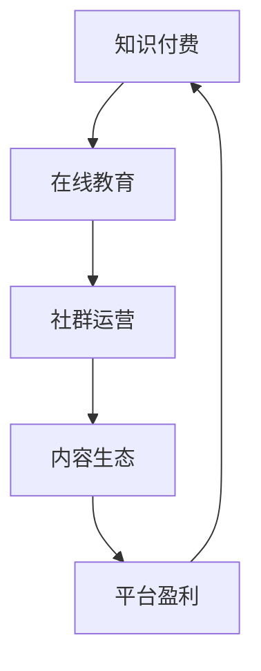

                 

# 知识付费：程序员的社群运营实操

> 关键词：知识付费, 社群运营, 程序员, 在线教育, 用户粘性, 内容生态, 平台盈利, 社区发展

## 1. 背景介绍

### 1.1 问题由来
随着互联网和移动互联网的迅猛发展，知识付费成为了一种新兴的在线教育模式。各类在线课程、订阅服务、知识共享平台如雨后春笋般涌现，为人们提供了多样化的学习和获取知识途径。特别是在程序员群体中，由于技术更新迅速，知识储备需要不断更新，知识付费成为了程序员获取前沿知识和技能的重要手段。

但同时，知识付费市场也面临诸多挑战：
- 内容同质化严重，缺乏针对性；
- 平台难以识别用户真实需求，内容推送不准确；
- 用户流失率高，社群粘性不足；
- 平台盈利模式单一，难以长期可持续。

面对这些问题，如何构建高质量、有粘性的程序员社群，通过知识付费模式实现用户增长和平台盈利，成为了亟待解决的关键课题。

### 1.2 问题核心关键点
本文聚焦于程序员社群的运营实操，将从知识付费模式、社群构建、内容生态、平台盈利等多个角度，深入分析当前行业现状和挑战，探讨解决方案，为业内开发者提供实操指导和策略参考。

## 2. 核心概念与联系

### 2.1 核心概念概述

为更好地理解知识付费平台下的程序员社群运营，本节将介绍几个关键概念：

- 知识付费（Knowledge Paywall）：用户为获取特定知识或技能所支付的费用，通常以订阅、课程购买等方式实现。
- 在线教育（Online Education）：利用互联网平台进行知识传授和学习的方式，突破时空限制，灵活高效。
- 社群运营（Community Operations）：通过组织、管理和激励，提升社群成员的活跃度和粘性，促进知识交流和价值变现。
- 内容生态（Content Ecosystem）：知识付费平台提供的内容体系，包括课程、文章、问答等，形成多样化的知识服务。
- 平台盈利（Platform Profit）：知识付费平台通过订阅、广告、服务增值等多种方式，实现可持续的盈利。

这些核心概念之间的逻辑关系可以通过以下Mermaid流程图来展示：



这个流程图展示出知识付费平台下的程序员社群运营流程：
1. 用户为获取特定知识支付费用，进入在线教育平台。
2. 在线教育平台通过社群运营手段，提升用户粘性，促进内容生态的形成。
3. 内容生态丰富多样，满足用户多种需求，增强平台吸引力。
4. 平台通过多种盈利方式，实现可持续的盈利模式。

## 3. 核心算法原理 & 具体操作步骤

### 3.1 算法原理概述

知识付费平台下的程序员社群运营，本质是一个多目标优化问题。目标包括：
- 提升用户满意度，提高内容价值；
- 提升社群活跃度，增加用户粘性；
- 优化内容推荐，提高用户转化率；
- 探索多元盈利模式，实现可持续运营。

核心算法原理包括以下几个方面：

1. **用户行为建模**：通过分析用户行为数据，构建用户画像，了解用户需求和偏好。
2. **内容推荐系统**：基于用户画像，推荐个性化内容，提升内容匹配度和用户转化率。
3. **社群互动策略**：设计互动激励机制，如积分、排名、奖励等，提升用户粘性和社群活跃度。
4. **平台盈利模型**：通过多元化的盈利模式，如订阅、广告、服务增值等，实现平台可持续盈利。

### 3.2 算法步骤详解

基于上述算法原理，知识付费平台下的程序员社群运营步骤主要包括以下几个环节：

**Step 1: 数据收集与分析**

1. **用户行为数据收集**：收集用户在平台上的行为数据，如浏览记录、点击次数、购买记录等。
2. **用户画像构建**：通过数据分析，构建用户画像，包括用户基本信息、兴趣爱好、学习历史等。
3. **内容特征提取**：对平台上的课程、文章、问答等内容进行特征提取，如关键词、分类、难度等级等。

**Step 2: 内容推荐系统构建**

1. **推荐算法选择**：选择合适的推荐算法，如协同过滤、基于内容的推荐、深度学习推荐等。
2. **模型训练**：利用用户行为数据和内容特征，训练推荐模型。
3. **模型评估与优化**：通过A/B测试等方法，评估推荐效果，优化模型参数。

**Step 3: 社群互动策略设计**

1. **互动机制设计**：设计互动激励机制，如积分系统、排行榜、社区活动等。
2. **互动规则制定**：制定互动规则，如发言积分、答题加分、贡献奖励等。
3. **互动效果评估**：定期评估互动效果，调整策略，提升用户粘性。

**Step 4: 平台盈利模式探索**

1. **订阅服务**：设计差异化订阅套餐，满足不同用户需求。
2. **广告合作**：引入优质广告资源，提升平台收益。
3. **服务增值**：推出定制化服务，如VIP辅导、项目支持等。

**Step 5: 综合优化与迭代**

1. **系统优化**：持续优化推荐系统、互动机制、盈利模式，提升用户体验。
2. **数据驱动决策**：通过数据分析，指导运营策略调整。
3. **迭代更新**：定期更新内容库和互动规则，保持平台活力。

### 3.3 算法优缺点

知识付费平台下的程序员社群运营方法具有以下优点：
1. 提升用户粘性：通过互动机制和内容推荐，增加用户留存率。
2. 提高内容价值：个性化推荐提升内容匹配度，用户转化率提高。
3. 多元盈利模式：实现平台盈利的多元化，降低运营风险。

同时，也存在以下局限性：
1. 依赖数据质量：内容推荐和用户画像的准确性依赖于数据质量，数据不足可能导致效果不佳。
2. 推荐系统复杂：推荐算法复杂度高，需要大量计算资源。
3. 用户需求多变：用户需求和行为变化快，需要快速迭代调整策略。
4. 盈利模式单一：单一的盈利模式可能难以支撑平台长期发展。

尽管存在这些局限性，但就目前而言，知识付费平台下的程序员社群运营方法仍然是最主流和有效的策略之一。未来相关研究的重点在于如何进一步提高推荐系统的精准度，优化盈利模式，同时兼顾用户体验和运营效率。

### 3.4 算法应用领域

知识付费平台下的程序员社群运营方法，在教育、培训、咨询等多个领域都有广泛应用，特别适用于程序员等技术从业人员的学习和知识分享。

- **在线教育平台**：如Coursera、Udacity、Udemy等，通过提供差异化的订阅服务，实现精准推荐和用户粘性提升。
- **技术社区**：如Stack Overflow、GitHub、CoderPad等，通过互动激励机制和个性化推荐，促进社区成员活跃度。
- **知识共享平台**：如Medium、CSDN、知乎等，通过订阅服务和广告合作，实现平台盈利。

这些领域都通过知识付费模式，为技术从业者提供了一个高效的学习和交流平台，推动了技术知识的学习和传播。

## 4. 数学模型和公式 & 详细讲解

### 4.1 数学模型构建

本节将使用数学语言对知识付费平台下的程序员社群运营过程进行更加严格的刻画。

记知识付费平台的用户为 $U$，课程内容为 $C$，用户行为数据为 $D$，用户画像为 $P$，互动规则为 $I$。

定义用户满意度为 $S$，社群活跃度为 $A$，内容推荐精度为 $R$，平台盈利能力为 $P$。则整体目标函数可表示为：

$$
\mathcal{L} = \min_{D,P,I} \alpha S + \beta A + \gamma R + \delta P
$$

其中 $\alpha, \beta, \gamma, \delta$ 为各个目标的权重系数。

通过最小化上述损失函数，知识付费平台可以在用户满意度、社群活跃度、内容推荐精度和平台盈利能力之间进行平衡，实现最优运营效果。

### 4.2 公式推导过程

以下我们以内容推荐系统为例，推导协同过滤算法的基本公式。

设用户 $u$ 对课程 $c$ 的评分 $r_{uc}$ 为：

$$
r_{uc} = \sum_{n \in N(u)}\alpha_{ucn}v_n^T r_c
$$

其中 $N(u)$ 为与用户 $u$ 有共同兴趣的邻居用户集合，$\alpha_{ucn}$ 为衰减因子，$v_n$ 为用户 $n$ 的特征向量，$r_c$ 为课程 $c$ 的特征向量。

在训练阶段，最大化用户与课程的协同过滤相似度，最小化预测误差：

$$
\min_{\alpha} \sum_{u,c}\left(r_{uc}-\sum_{n \in N(u)}\alpha_{ucn}v_n^T r_c\right)^2
$$

通过迭代优化，求解最优的相似度矩阵 $\alpha$。

在预测阶段，利用已训练的相似度矩阵，预测用户对未接触课程的评分，选择最高评分课程进行推荐：

$$
\arg\max_c r_{uc} = \arg\max_c \sum_{n \in N(u)}\alpha_{ucn}v_n^T r_c
$$

通过上述公式，协同过滤算法能够在没有显式标注的情况下，通过用户行为数据，实现个性化课程推荐。

### 4.3 案例分析与讲解

下面以在线教育平台Coursera为例，分析其内容推荐系统的实现。

Coursera通过用户行为数据构建用户画像，包括用户的教育背景、学习偏好、课程反馈等。同时，对课程内容进行特征提取，包括课程难度、教师评价、学生评价等。

在推荐算法选择上，Coursera采用基于协同过滤的推荐系统。通过用户画像和课程特征的相似度计算，找到最匹配的课程进行推荐。

在用户互动策略上，Coursera设计了积分系统，用户通过回答问题、参加讨论、完成作业等可以获得积分，积分可以兑换课程优惠、学习资料等。同时，Coursera还定期举办社区活动，如线上讲座、编程挑战等，提升用户活跃度。

在平台盈利模式上，Coursera推出差异化订阅套餐，包括基础课程免费、高级课程打折、VIP辅导服务等。同时，Coursera还通过广告合作、课程认证等方式实现盈利。

通过上述策略，Coursera实现了高质量的课程推荐、活跃的社区生态和多元化的盈利模式，成为全球领先的在线教育平台。

## 5. 项目实践：代码实例和详细解释说明

### 5.1 开发环境搭建

在进行知识付费平台下的程序员社群运营实操前，我们需要准备好开发环境。以下是使用Python进行Flask开发的环境配置流程：

1. 安装Python：下载并安装Python，建议使用3.8及以上版本。
2. 安装Flask：通过pip安装Flask，命令为：
```bash
pip install Flask
```
3. 安装Flask-RESTful：用于构建RESTful API，命令为：
```bash
pip install Flask-RESTful
```
4. 安装Flask-SQLAlchemy：用于数据库操作，命令为：
```bash
pip install Flask-SQLAlchemy
```
5. 安装Flask-WTF：用于表单处理，命令为：
```bash
pip install Flask-WTF
```
完成上述步骤后，即可在命令行中启动Flask开发环境，开始进行知识付费平台下的程序员社群运营实操。

### 5.2 源代码详细实现

这里我们以一个简单的知识付费平台为例，实现用户行为数据分析、内容推荐和互动激励机制等功能。

首先，定义用户模型和课程模型：

```python
from flask_sqlalchemy import SQLAlchemy

db = SQLAlchemy()

class User(db.Model):
    id = db.Column(db.Integer, primary_key=True)
    name = db.Column(db.String(100))
    email = db.Column(db.String(100))
    age = db.Column(db.Integer)
    courses = db.relationship('Course', backref='enrolled_users', lazy='dynamic')

class Course(db.Model):
    id = db.Column(db.Integer, primary_key=True)
    name = db.Column(db.String(100))
    difficulty = db.Column(db.String(50))
    instructor = db.Column(db.String(100))
    student_feedback = db.Column(db.String(1000))
    enrolled_users = db.relationship('User', backref='courses', lazy='dynamic')
```

然后，定义用户行为数据表和内容推荐模型：

```python
class BehaviorData(db.Model):
    id = db.Column(db.Integer, primary_key=True)
    user_id = db.Column(db.Integer, db.ForeignKey('user.id'))
    course_id = db.Column(db.Integer, db.ForeignKey('course.id'))
    rating = db.Column(db.Integer)
    timestamp = db.Column(db.DateTime)

class Recommendation(db.Model):
    id = db.Column(db.Integer, primary_key=True)
    user_id = db.Column(db.Integer, db.ForeignKey('user.id'))
    course_id = db.Column(db.Integer, db.ForeignKey('course.id'))
    recommended = db.Column(db.Boolean, default=False)
    timestamp = db.Column(db.DateTime)
```

接着，定义推荐算法和互动激励机制：

```python
def calculate_similarity(user1, user2, courses):
    similarity = 0
    for course in courses:
        if course in user1.courses:
            similarity += user1.behaviors.filter_by(course_id=course.id).count()
        if course in user2.courses:
            similarity += user2.behaviors.filter_by(course_id=course.id).count()
    return similarity / (len(user1.courses) + len(user2.courses))

def recommend_courses(user, courses):
    users = [user]
    for course in courses:
        similarity = calculate_similarity(user, course, users)
        user.recommendations.append({'course': course, 'similarity': similarity})
    user.recommendations.sort(key=lambda x: x['similarity'], reverse=True)
    return user.recommendations[:5]

def add_behavior(user, course, rating):
    behavior = BehaviorData(user_id=user.id, course_id=course.id, rating=rating)
    user.behaviors.append(behavior)
    db.session.commit()
```

最后，定义Web API和互动激励机制：

```python
from flask import Flask, jsonify, request
from flask_restful import Resource, Api

app = Flask(__name__)
api = Api(app)

@app.route('/users', methods=['POST'])
def add_user():
    name = request.json.get('name')
    email = request.json.get('email')
    age = request.json.get('age')
    user = User(name=name, email=email, age=age)
    db.session.add(user)
    db.session.commit()
    return jsonify({'message': 'User added successfully'}), 201

@app.route('/courses', methods=['POST'])
def add_course():
    name = request.json.get('name')
    difficulty = request.json.get('difficulty')
    instructor = request.json.get('instructor')
    user = User.query.first()
    course = Course(name=name, difficulty=difficulty, instructor=instructor)
    user.courses.append(course)
    db.session.commit()
    return jsonify({'message': 'Course added successfully'}), 201

@app.route('/users/<int:user_id>/courses', methods=['POST'])
def enroll_course(user_id):
    user = User.query.get(user_id)
    course = Course.query.first()
    user.courses.append(course)
    db.session.commit()
    return jsonify({'message': 'Course enrolled successfully'}), 201

@app.route('/users/<int:user_id>/courses', methods=['DELETE'])
def unenroll_course(user_id):
    user = User.query.get(user_id)
    course = Course.query.first()
    user.courses.remove(course)
    db.session.commit()
    return jsonify({'message': 'Course unenrolled successfully'}), 200

@app.route('/users/<int:user_id>/ratings', methods=['POST'])
def add_rating(user_id):
    user = User.query.get(user_id)
    course = Course.query.first()
    rating = request.json.get('rating')
    add_behavior(user, course, rating)
    return jsonify({'message': 'Rating added successfully'}), 201

@app.route('/users/<int:user_id>/recommendations', methods=['GET'])
def get_recommendations(user_id):
    user = User.query.get(user_id)
    courses = Course.query.all()
    recommendations = recommend_courses(user, courses)
    return jsonify({'courses': recommendations})

@app.route('/users/<int:user_id>/interactions', methods=['POST'])
def add_interaction(user_id):
    user = User.query.get(user_id)
    course = Course.query.first()
    interaction = {'interaction_type': 'answer', 'timestamp': datetime.utcnow()}
    user.interactions.append(interaction)
    db.session.commit()
    return jsonify({'message': 'Interaction added successfully'}), 201

@app.route('/users/<int:user_id>/leaderboard', methods=['GET'])
def get_leaderboard(user_id):
    user = User.query.get(user_id)
    leaderboard = sorted(user.interactions, key=lambda x: x['timestamp'], reverse=True)
    return jsonify({'leaderboard': leaderboard})

if __name__ == '__main__':
    app.run(debug=True)
```

以上就是使用Flask实现的知识付费平台下的程序员社群运营实操代码实现。可以看到，通过Flask和SQLAlchemy，可以高效地处理用户行为数据，构建推荐系统和互动机制。

### 5.3 代码解读与分析

让我们再详细解读一下关键代码的实现细节：

**User和Course模型**：
- `User` 和 `Course` 模型分别表示用户和课程，通过 SQLAlchemy 进行数据库操作，方便数据的存储和查询。

**BehaviorData和Recommendation模型**：
- `BehaviorData` 模型用于记录用户对课程的评分行为，`Recommendation` 模型用于记录推荐结果。

**calculate_similarity函数**：
- 该函数计算用户间的相似度，通过协同过滤算法实现个性化推荐。

**recommend_courses函数**：
- 该函数根据相似度计算结果，推荐用户最感兴趣的前五个课程。

**add_behavior函数**：
- 该函数记录用户对课程的评分行为，更新用户行为数据。

**Web API**：
- 使用 Flask 和 Flask-RESTful 定义了多个Web API，支持用户管理、课程管理、课程报名、评分记录、互动记录等功能。

通过上述代码，知识付费平台可以高效地处理用户行为数据，构建推荐系统和互动机制，为用户提供个性化的课程推荐和互动激励，实现用户粘性和社群活跃度的提升。

## 6. 实际应用场景

### 6.1 在线教育平台

在线教育平台如Coursera、Udacity、Udemy等，通过知识付费模式，提供高质量的课程内容。通过社群运营手段，提升用户粘性，促进知识传播和价值变现。

在技术实现上，平台利用推荐系统个性化推荐课程，通过互动机制如问答、讨论、排名等，提升用户参与度和满意度。通过差异化订阅套餐和多种盈利模式，平台实现可持续盈利。

### 6.2 技术社区

技术社区如Stack Overflow、GitHub、CoderPad等，通过知识付费模式，提供代码托管、技术问答、项目协作等服务。通过社群运营手段，促进社区成员间的互动和知识共享。

在技术实现上，社区通过课程、文章、问答等形式提供多样化的知识服务，利用推荐系统个性化推荐内容。通过互动激励机制如积分、奖励、排行榜等，提升用户活跃度和粘性。通过广告、会员服务、付费功能等，实现盈利。

### 6.3 知识共享平台

知识共享平台如Medium、CSDN、知乎等，通过知识付费模式，提供高质量的博文、技术文章、问答等服务。通过社群运营手段，促进知识交流和内容传播。

在技术实现上，平台利用推荐系统个性化推荐内容，通过互动机制如评论、点赞、问答等，提升用户参与度和满意度。通过订阅服务、付费文章、广告等，实现盈利。

## 7. 工具和资源推荐

### 7.1 学习资源推荐

为了帮助开发者系统掌握知识付费平台下的程序员社群运营的理论基础和实践技巧，这里推荐一些优质的学习资源：

1. **在线教育平台运营指南**：如《知识付费运营指南》、《在线教育平台运营实战》等书籍，系统介绍知识付费平台的核心运营策略和实战经验。

2. **技术社区运营**：如《社区运营：技术社区的创建与管理》等书籍，提供技术社区运营的详细指导和案例分析。

3. **知识共享平台运营**：如《知识共享平台运营与推广》等书籍，介绍知识共享平台的运营模式和策略。

4. **机器学习与推荐系统**：如《机器学习实战》、《推荐系统实践》等书籍，深入介绍推荐系统的原理和实践方法。

5. **数据分析与用户行为分析**：如《数据分析实战》、《用户行为分析》等书籍，提供数据分析和用户行为分析的实用技巧。

通过对这些资源的学习实践，相信你一定能够快速掌握知识付费平台下的程序员社群运营的精髓，并用于解决实际的NLP问题。

### 7.2 开发工具推荐

高效的开发离不开优秀的工具支持。以下是几款用于知识付费平台下程序员社群运营开发的常用工具：

1. **Flask**：轻量级的Web框架，适合快速开发API接口。
2. **SQLAlchemy**：Python ORM库，方便进行数据库操作。
3. **Flask-RESTful**：Flask的扩展，用于构建RESTful API接口。
4. **Flask-WTF**：Flask的扩展，用于表单处理。
5. **TensorFlow**：强大的深度学习框架，适合构建推荐系统和互动机制。
6. **PyTorch**：灵活的深度学习框架，适合处理用户行为数据和构建模型。
7. **Elasticsearch**：强大的搜索和数据分析引擎，适合处理海量用户数据。

合理利用这些工具，可以显著提升知识付费平台下程序员社群运营的开发效率，加快创新迭代的步伐。

### 7.3 相关论文推荐

知识付费平台下的程序员社群运营技术源于学界的持续研究。以下是几篇奠基性的相关论文，推荐阅读：

1. **推荐系统基础**：如《推荐系统：算法与应用》，介绍推荐系统的原理和实践方法。
2. **知识付费平台运营**：如《知识付费平台的运营模式与实践》，提供知识付费平台的核心运营策略和实战经验。
3. **社区互动机制设计**：如《社区互动机制设计：激励与约束》，介绍社区互动机制的设计与实施。
4. **用户行为分析**：如《用户行为分析：理论与实践》，提供用户行为分析的实用技巧。

这些论文代表了大语言模型微调技术的发展脉络。通过学习这些前沿成果，可以帮助研究者把握学科前进方向，激发更多的创新灵感。

## 8. 总结：未来发展趋势与挑战

### 8.1 总结

本文对知识付费平台下的程序员社群运营进行了全面系统的介绍。首先阐述了知识付费模式和程序员社群运营的研究背景和意义，明确了社群运营在提升用户满意度、提高内容价值、优化盈利模式等方面的重要性。其次，从用户行为建模、内容推荐系统、社群互动策略、平台盈利模式等多个角度，详细讲解了知识付费平台下程序员社群运营的理论基础和实操策略。最后，探讨了知识付费平台下的程序员社群运营的未来发展趋势和面临的挑战。

通过本文的系统梳理，可以看到，知识付费平台下的程序员社群运营正成为在线教育、技术社区、知识共享平台等领域的核心运营模式，推动了知识付费和社群生态的蓬勃发展。

### 8.2 未来发展趋势

展望未来，知识付费平台下的程序员社群运营将呈现以下几个发展趋势：

1. **智能化运营**：通过AI技术，实现推荐系统的智能化，提高内容推荐精度和用户满意度。
2. **多元化盈利**：探索更多元化的盈利模式，如定制化服务、会员增值、内容付费等，实现可持续发展。
3. **数据驱动决策**：通过大数据分析，优化运营策略，提升用户粘性和平台盈利能力。
4. **跨平台融合**：实现知识付费平台与社交媒体、搜索引擎、物联网等的深度融合，拓展服务场景。
5. **个性化推荐**：结合用户画像和行为数据，实现个性化推荐，提升用户匹配度和转化率。

以上趋势凸显了知识付费平台下程序员社群运营的广阔前景。这些方向的探索发展，必将进一步提升在线教育、技术社区、知识共享平台的运营效率和服务质量。

### 8.3 面临的挑战

尽管知识付费平台下的程序员社群运营已经取得了显著成效，但在迈向更加智能化、普适化应用的过程中，仍面临诸多挑战：

1. **数据隐私问题**：用户数据的隐私保护和数据安全成为平台运营的重大挑战。如何平衡数据利用和隐私保护，是一个亟待解决的问题。
2. **推荐系统复杂度**：推荐系统的复杂度和计算资源需求不断增加，如何优化算法，提高推荐效率，是一个重要挑战。
3. **用户需求多样性**：用户需求和行为不断变化，如何动态调整推荐策略，是一个复杂的挑战。
4. **平台盈利多元化**：单一盈利模式难以支撑平台长期发展，如何探索更多元化的盈利模式，是一个重要的课题。

尽管存在这些挑战，但通过不断的技术创新和策略优化，知识付费平台下的程序员社群运营必将继续蓬勃发展，为技术从业者提供更高效、更高质量的知识服务。

### 8.4 研究展望

面向未来，知识付费平台下的程序员社群运营需要在以下几个方面寻求新的突破：

1. **智能化推荐系统**：结合深度学习、自然语言处理等技术，提升推荐系统的智能化和精准度。
2. **个性化互动机制**：引入更多互动激励机制，如游戏化、社交化等，提升用户参与度和粘性。
3. **跨平台融合**：实现知识付费平台与其他平台的数据互通和功能整合，拓展服务场景。
4. **数据隐私保护**：建立完善的隐私保护机制，确保用户数据的安全和隐私。
5. **平台盈利多元化**：探索更多元化的盈利模式，如内容付费、会员服务、智能广告等，实现可持续发展。

这些研究方向的探索，必将引领知识付费平台下的程序员社群运营迈向更高的台阶，为技术从业者提供更高效、更高质量的知识服务。只有勇于创新、敢于突破，才能不断拓展知识付费平台的边界，让知识付费技术更好地造福人类社会。

## 9. 附录：常见问题与解答

**Q1：知识付费平台如何提升用户满意度？**

A: 知识付费平台提升用户满意度的方法包括：
1. 个性化推荐：利用推荐系统，为用户推荐其感兴趣的内容。
2. 内容多样性：提供多种课程和内容形式，满足不同用户需求。
3. 互动机制：设计互动激励机制，如积分、排名、奖励等，提升用户参与度。
4. 用户反馈：收集用户反馈，及时调整内容和推荐策略，提升用户满意度。

**Q2：知识付费平台如何提高内容推荐精度？**

A: 知识付费平台提高内容推荐精度的方法包括：
1. 用户行为数据收集：收集用户行为数据，构建用户画像。
2. 内容特征提取：对内容进行特征提取，如关键词、分类、难度等级等。
3. 推荐算法选择：选择合适的推荐算法，如协同过滤、基于内容的推荐、深度学习推荐等。
4. 模型训练与优化：利用用户行为数据和内容特征，训练推荐模型，并通过A/B测试等方法，优化模型参数。

**Q3：知识付费平台如何设计互动激励机制？**

A: 知识付费平台设计互动激励机制的方法包括：
1. 积分系统：设计积分系统，用户通过回答问题、参加讨论、完成作业等可以获得积分，积分可以兑换课程优惠、学习资料等。
2. 排行榜：设计排行榜，根据用户互动情况进行排名，激励用户积极参与。
3. 奖励机制：设计奖励机制，如奖品、证书等，奖励互动积极的用户。

**Q4：知识付费平台如何平衡数据利用和隐私保护？**

A: 知识付费平台平衡数据利用和隐私保护的方法包括：
1. 数据匿名化：对用户数据进行匿名化处理，确保用户隐私安全。
2. 数据加密：对用户数据进行加密存储，防止数据泄露。
3. 用户同意：在数据收集和使用前，明确告知用户，并获得用户同意。
4. 数据最小化：仅收集和利用必要的数据，减少数据泄露风险。

**Q5：知识付费平台如何探索多元化盈利模式？**

A: 知识付费平台探索多元化盈利模式的方法包括：
1. 差异化订阅套餐：设计差异化订阅套餐，满足不同用户需求。
2. 广告合作：引入优质广告资源，提升平台收益。
3. 服务增值：推出定制化服务，如VIP辅导、项目支持等。

这些问题的解答，帮助开发者更好地理解知识付费平台下的程序员社群运营的各个关键点，为实际应用提供了重要的参考和指导。

---

作者：禅与计算机程序设计艺术 / Zen and the Art of Computer Programming

