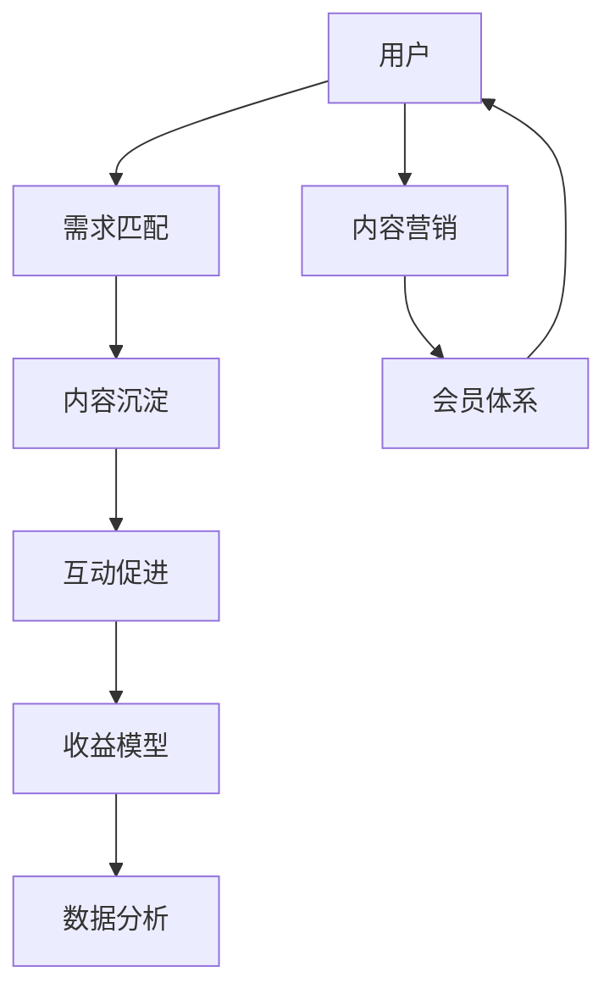

                 

# 知识付费：程序员的社群运营指南

> 关键词：知识付费,程序员,社群运营,用户增长,课程开发,内容营销,会员体系,数据分析

## 1. 背景介绍

### 1.1 问题由来
随着互联网的迅猛发展和技术的不断进步，越来越多的在线教育平台如雨后春笋般涌现，知识付费成为新常态。特别是在编程和IT领域，知识的更新迭代速度惊人，终身学习已成为行业从业者的共识。因此，如何构建高效、互动、有价值的知识付费社群，已经成为程序员社区关注的重点。

### 1.2 问题核心关键点
1. **需求匹配**：识别潜在用户的需求，通过精准的社群运营吸引和留存优质用户。
2. **内容沉淀**：构建系统的课程体系，确保社群内容的专业性和持续更新。
3. **互动促进**：通过多样化的互动形式促进用户之间的交流和协作。
4. **收益模型**：设计合理的收费模式和激励机制，实现社群的良性循环。
5. **数据驱动**：运用数据分析工具，持续优化社群运营策略。

### 1.3 问题研究意义
在技术快速迭代和用户需求多样的背景下，知识付费社群的建设不仅可以满足程序员的学习需求，还能推动技术交流、资源共享和职业发展。构建一个良性循环、充满活力的知识付费社群，对于提升程序员的学习效率、扩大社区影响力、促进技术生态的繁荣具有重要意义。

## 2. 核心概念与联系

### 2.1 核心概念概述

1. **知识付费**：指用户通过付费获取高质量教育内容和服务的一种模式。知识付费打破了传统的免费学习模式，有助于提升课程质量和用户黏性。

2. **社群运营**：指通过线上线下的方式，组织和管理特定主题的社区，旨在促进用户之间的交流和学习。社群运营的核心在于内容建设、用户互动和社群氛围的维护。

3. **用户增长**：指通过策略和工具，吸引更多的潜在用户加入社群，并提高现有用户的活跃度和留存率。用户增长策略包括内容营销、邮件营销、社交媒体推广等。

4. **课程开发**：指设计并开发高质量的课程内容，确保课程的专业性、实用性和趣味性，以吸引和满足用户的学习需求。

5. **内容营销**：指通过各种渠道和方式，推广课程内容和社群活动，吸引潜在用户关注和参与。内容营销的重点是内容的质量和创新性。

6. **会员体系**：指设计会员等级、特权和激励机制，以提升用户忠诚度和参与度。会员体系可以包括积分、勋章、专属内容等。

7. **数据分析**：指通过数据分析工具和方法，对社群的用户行为、课程效果等进行跟踪和分析，以优化运营策略和提升用户体验。

这些核心概念之间通过线上线下互动、内容沉淀、数据驱动等环节紧密相连，构成了一个完整的知识付费社群运营框架。

### 2.2 核心概念原理和架构的 Mermaid 流程图



这个流程图展示了知识付费社群运营的核心流程：用户需求匹配→内容沉淀→互动促进→收益模型→数据分析。同时，内容营销和会员体系贯穿始终，确保社群的良性循环。

## 3. 核心算法原理 & 具体操作步骤

### 3.1 算法原理概述

知识付费社群的运营是一个多维度的复杂系统，涉及用户行为分析、课程内容设计、互动机制优化等多个方面。这里介绍几种核心算法原理：

1. **用户行为分析**：通过数据分析工具，识别用户行为模式和需求，优化社群运营策略。
2. **课程内容设计**：采用目标驱动的设计原则，确保课程内容的实用性和持续更新。
3. **互动机制优化**：通过多样化的互动形式，如问答、讨论、小组协作等，提升用户参与度和社群活跃度。
4. **收益模型设计**：结合免费和付费模式，设计合理的收费和激励机制，实现社群的良性循环。

### 3.2 算法步骤详解

1. **需求分析**：
   - 使用问卷调查、用户反馈等工具，收集用户对课程内容、学习方式和互动形式的需求。
   - 分析用户的行为数据，如浏览历史、互动频率等，了解用户的学习偏好和问题点。

2. **内容规划**：
   - 根据需求分析结果，设计课程大纲，确定课程目标和知识点。
   - 邀请行业专家和技术大牛，联合开发高质量课程内容，确保课程的专业性和实用性。

3. **互动设计**：
   - 设计多样化的互动形式，如在线问答、小组讨论、项目合作等，促进用户之间的交流和协作。
   - 通过社区平台提供丰富的学习资源，如代码示例、案例分析、作业反馈等，增加学习的趣味性和实用性。

4. **收益模型设计**：
   - 设计多样化的收费模式，如基础会员免费、高级会员付费、特定课程单次购买等。
   - 设立积分和勋章系统，激励用户积极参与社群活动和学习，提升用户忠诚度。

5. **数据分析优化**：
   - 使用数据分析工具，如Google Analytics、Mixpanel等，对用户行为和课程效果进行实时跟踪和分析。
   - 根据分析结果，不断优化社群运营策略，提高用户满意度和社区活跃度。

### 3.3 算法优缺点

**优点**：
1. **系统性**：通过系统化的运营流程，确保社群运营的有序性和高效性。
2. **可量化**：利用数据分析工具，可以实时跟踪和优化运营策略，提升社群运营效果。
3. **灵活性**：可以根据用户需求和市场变化，灵活调整课程内容和互动形式，满足用户多样化需求。

**缺点**：
1. **成本高**：高质量课程内容的制作和数据分析工具的使用，都需要一定的初期投入。
2. **复杂性**：社群运营涉及多个环节，需要多部门协同工作，管理复杂。
3. **依赖性强**：对行业专家的依赖度较高，课程内容的质量和更新频率直接影响用户满意度。

### 3.4 算法应用领域

知识付费社群的运营模式可以广泛应用于各种领域，如编程、设计、营销、人力资源等。以下是几个典型应用场景：

1. **编程社群**：面向程序员和开发者，提供从入门到进阶的课程内容，通过编程挑战、代码评审、项目合作等方式促进交流和协作。
2. **设计社群**：面向设计师和创意人员，提供设计软件教程、创意设计课程、设计案例分享等，通过设计大赛、设计讲座等方式激发创意灵感。
3. **营销社群**：面向市场营销人员，提供市场分析、广告投放、社交媒体营销等课程，通过项目实战、案例研讨等方式提升实战能力。
4. **人力资源社群**：面向HR和招聘人员，提供招聘技巧、HR工具、企业文化等课程，通过在线招聘会、HR论坛等方式促进招聘和人才交流。

## 4. 数学模型和公式 & 详细讲解 & 举例说明

### 4.1 数学模型构建

知识付费社群的运营涉及多个变量和多个目标，可以使用系统工程的方法进行模型构建。以编程社群为例，可以构建以下模型：

1. **用户增长模型**：
   - 设定用户增长目标，如月活跃用户数、新用户增长率等。
   - 建立预测模型，根据历史数据和市场趋势，预测未来的用户增长情况。

2. **课程评估模型**：
   - 设定课程评估指标，如用户评分、课程完成率、用户反馈等。
   - 建立评估模型，对课程效果进行实时监控和分析，及时调整课程内容和教学方法。

3. **互动效果模型**：
   - 设定互动效果指标，如互动频率、用户参与度等。
   - 建立效果模型，对互动形式和内容进行优化，提升用户互动效果和社群活跃度。

### 4.2 公式推导过程

以用户增长模型为例，假设用户增长率为$r$，初始用户数为$u_0$，则用户增长模型可以表示为：

$$
u_t = u_0(1+r)^t
$$

其中，$u_t$表示时间$t$时的用户数，$u_0$表示初始用户数，$r$表示用户增长率，$t$表示时间。

通过这个公式，可以预测未来某一时刻的用户数量，为社群运营提供数据支持。

### 4.3 案例分析与讲解

以编程社群为例，我们可以使用用户增长模型进行实际预测。假设某编程社群的初始用户数为1000，月增长率为20%，则一年后的用户数可以计算为：

$$
u_{12} = 1000(1+0.2)^{12} \approx 5372
$$

根据预测结果，社群运营者可以有针对性地调整运营策略，如增加内容更新频率、提升课程质量等，以实现用户增长目标。

## 5. 项目实践：代码实例和详细解释说明

### 5.1 开发环境搭建

1. **选择平台**：
   - 可以选择自建平台，如Django、Flask等Web框架，也可以利用现成的知识付费平台，如知识星球、网易云课堂等。
   - 使用AWS、阿里云等云服务平台，提供服务器、数据库、CDN等服务，确保平台稳定运行。

2. **用户管理**：
   - 使用OAuth 2.0协议，实现用户登录和权限管理，确保用户数据安全。
   - 设计用户角色和权限，如普通用户、高级用户、管理员等，通过角色和权限控制访问权限。

### 5.2 源代码详细实现

以Python为例，使用Django框架开发一个知识付费平台。以下是一个简化的代码实现：

```python
# 用户注册视图
def register(request):
    if request.method == 'POST':
        form = RegistrationForm(request.POST)
        if form.is_valid():
            user = form.save()
            login(request, user)
            return redirect('home')
    else:
        form = RegistrationForm()
    return render(request, 'register.html', {'form': form})

# 课程浏览视图
def course_list(request):
    courses = Course.objects.all()
    return render(request, 'course_list.html', {'courses': courses})

# 课程详情视图
def course_detail(request, course_id):
    course = get_object_or_404(Course, pk=course_id)
    return render(request, 'course_detail.html', {'course': course})
```

### 5.3 代码解读与分析

这段代码实现了用户注册和课程浏览功能。注册视图通过表单验证，将用户信息保存到数据库中，并自动登录。课程浏览视图从数据库中获取所有课程信息，并在模板中渲染展示。

### 5.4 运行结果展示

运行上述代码，可以在浏览器中访问用户注册页面和课程浏览页面，展示注册用户信息和课程列表。

## 6. 实际应用场景

### 6.1 编程社群

**案例**：某知名编程社区通过知识付费模式运营，提供高质量编程课程和编程挑战，吸引了大量程序员参与。

**应用**：
1. **课程内容**：提供从Python基础到高级编程课程，涵盖数据结构、算法、Web开发等多个领域。
2. **编程挑战**：定期发布编程挑战和竞赛，激发用户学习和交流兴趣。
3. **互动形式**：提供代码评审、代码讨论、项目合作等功能，促进用户之间的交流和协作。

**效果**：社群用户数从初期的不足1000人增长到超过10万人，每月活跃用户数超过5万，成为业界知名的编程学习社区。

### 6.2 设计社群

**案例**：某设计社区通过知识付费模式运营，提供设计软件教程和设计案例分享，吸引设计师和创意人员加入。

**应用**：
1. **课程内容**：提供Photoshop、Illustrator等设计软件教程，以及平面设计、UI设计案例分享。
2. **设计大赛**：定期举办设计大赛和创意挑战，激发用户创作热情。
3. **互动形式**：提供设计作品展示、设计讲座、设计讨论等功能，促进用户之间的交流和灵感碰撞。

**效果**：社群用户数从初期的不足500人增长到超过2万人，每月活跃用户数超过1.5万，成为业界知名的设计学习社区。

### 6.3 营销社群

**案例**：某营销社区通过知识付费模式运营，提供市场分析、广告投放、社交媒体营销等课程，吸引市场营销人员加入。

**应用**：
1. **课程内容**：提供市场分析、SEO优化、社交媒体营销等课程，涵盖市场策略、广告投放、数据分析等多个领域。
2. **实战项目**：提供实战项目和案例分析，帮助用户提升实战能力。
3. **互动形式**：提供营销讲座、项目实战、案例研讨等功能，促进用户之间的交流和协作。

**效果**：社群用户数从初期的不足2000人增长到超过5万人，每月活跃用户数超过3万，成为业界知名的营销学习社区。

## 7. 工具和资源推荐

### 7.1 学习资源推荐

1. **《知识付费：如何构建高效的社群》**：介绍知识付费社群的运营策略、内容设计、用户互动等，为社群运营提供系统性指导。
2. **《用户增长：社群运营实战指南》**：提供用户增长、数据分析、内容营销等实战技巧，帮助社群运营者提升用户增长效果。
3. **《课程开发：从需求到交付》**：涵盖课程设计、内容制作、评估优化等多个环节，确保课程内容的专业性和实用性。

### 7.2 开发工具推荐

1. **Django**：Python的Web开发框架，提供了丰富的模块和工具，支持快速开发和管理知识付费平台。
2. **Flask**：轻量级的Web开发框架，适用于中小型知识付费平台的开发。
3. **知识星球**：专业的知识付费平台，提供用户管理、课程发布、支付集成等功能，简化开发流程。

### 7.3 相关论文推荐

1. **《知识付费：市场需求与运营策略》**：分析知识付费市场的需求特点和运营策略，为社群运营提供理论支撑。
2. **《知识付费社区的用户增长模型研究》**：通过数学模型和数据分析工具，研究用户增长规律和预测方法，为社群运营提供数据支持。
3. **《知识付费社区的课程评估与优化》**：提出课程评估指标和评估方法，对课程内容进行优化，提升课程效果。

## 8. 总结：未来发展趋势与挑战

### 8.1 总结

本文系统介绍了知识付费社群的运营策略，包括用户需求匹配、内容沉淀、互动促进、收益模型和数据分析等方面。通过详细分析用户行为和课程效果，提出了系统的运营框架和具体的实施步骤。结合实际案例，展示了知识付费社群的运营效果和未来潜力。

### 8.2 未来发展趋势

1. **内容多样化**：未来知识付费内容将更加多样化，涵盖编程、设计、营销等多个领域，满足不同用户的多样化需求。
2. **互动智能化**：通过人工智能技术，实现智能推荐、智能互动等功能，提升用户学习体验和社群活跃度。
3. **运营数据化**：利用大数据和人工智能技术，实现运营数据实时分析和智能化决策，提升运营效果和用户体验。
4. **服务个性化**：通过个性化推荐和定制化服务，提升用户满意度和忠诚度。
5. **生态系统化**：构建完整的知识生态系统，促进用户之间的交流和协作，实现知识共享和价值变现。

### 8.3 面临的挑战

1. **内容质量**：高质量内容的制作和更新需要大量的资源和精力，如何确保课程内容的专业性和实用性是一大挑战。
2. **用户获取**：在激烈的市场竞争中，如何吸引和留存优质用户，提升用户增长效果，仍然是一大难题。
3. **互动效果**：多样化的互动形式需要不断优化和创新，如何提升用户互动效果和社群活跃度，仍然是一大挑战。
4. **数据分析**：运营数据的实时分析和智能化决策需要强大的数据支持和人工智能技术，如何提升数据分析的精度和效率，仍然是一大挑战。

### 8.4 研究展望

1. **内容生成**：探索人工智能技术在知识内容生成中的应用，提升内容创作效率和多样性。
2. **个性化推荐**：研究个性化推荐算法，提升用户学习体验和课程推荐效果。
3. **互动优化**：探索多样化的互动形式和智能化互动技术，提升用户互动效果和社群活跃度。
4. **运营智能化**：利用大数据和人工智能技术，实现运营数据实时分析和智能化决策，提升运营效果和用户体验。
5. **生态构建**：构建完整的知识生态系统，促进用户之间的交流和协作，实现知识共享和价值变现。

## 9. 附录：常见问题与解答

**Q1：知识付费社群的运营难点有哪些？**

A: 知识付费社群的运营难点主要包括以下几个方面：
1. **内容质量**：高质量课程内容的制作和更新需要大量的资源和精力，如何确保课程内容的专业性和实用性是一大挑战。
2. **用户获取**：在激烈的市场竞争中，如何吸引和留存优质用户，提升用户增长效果，仍然是一大难题。
3. **互动效果**：多样化的互动形式需要不断优化和创新，如何提升用户互动效果和社群活跃度，仍然是一大挑战。
4. **数据分析**：运营数据的实时分析和智能化决策需要强大的数据支持和人工智能技术，如何提升数据分析的精度和效率，仍然是一大挑战。

**Q2：如何设计有效的互动形式？**

A: 设计有效的互动形式需要考虑以下几个方面：
1. **多样性**：提供多种互动形式，如在线问答、讨论、小组协作等，满足不同用户的需求。
2. **互动性**：设计具有互动性的互动形式，如代码评审、项目合作、设计作品展示等，促进用户之间的交流和协作。
3. **奖励机制**：设立积分、勋章等奖励机制，激励用户积极参与社群活动和学习，提升用户忠诚度。
4. **及时反馈**：提供及时的反馈和评价，帮助用户改进和提升，增强互动效果。

**Q3：知识付费社群的用户增长策略有哪些？**

A: 知识付费社群的用户增长策略主要包括以下几个方面：
1. **内容营销**：通过内容营销推广社群，吸引潜在用户关注和参与，提高用户增长效果。
2. **社交媒体推广**：利用社交媒体平台推广社群，扩大社群影响力，提升用户增长效果。
3. **用户推荐**：通过用户推荐机制，鼓励用户邀请朋友加入社群，提高用户增长效果。
4. **活动策划**：策划社群活动和挑战，激发用户兴趣和参与度，提升用户增长效果。
5. **激励机制**：设立积分、勋章等激励机制，吸引用户积极参与社群活动和学习，提升用户增长效果。

**Q4：知识付费社群的收益模型有哪些？**

A: 知识付费社群的收益模型主要包括以下几个方面：
1. **基础会员付费**：通过设置基础会员和高级会员，满足不同用户的需求，实现收益多样化。
2. **课程单次购买**：提供特定课程的单次购买服务，满足用户个性化需求。
3. **项目合作收费**：通过项目合作和定制化服务，实现高价值用户的收益提升。
4. **广告和赞助**：通过广告和赞助，增加社群的收入来源，实现收益多样化。
5. **知识变现**：通过知识变现和商业合作，提升社群的经济效益，实现收益多样化。

---

作者：禅与计算机程序设计艺术 / Zen and the Art of Computer Programming

