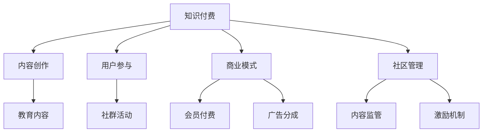

                 

# 知识付费：程序员的社群运营方案

> 关键词：知识付费、程序员、社群运营、内容创作、用户参与、商业模式、社区管理、激励机制

## 1. 背景介绍

### 1.1 问题由来
随着互联网的普及和技术的进步，知识付费模式正成为各行各业新的经济增长点。对于程序员群体而言，知识付费不仅是获取专业技能、掌握最新技术、提升职业发展的有效途径，也是解决信息过载、时间碎片化、技术迭代快等问题的有力工具。如何构建一个高质量、可持续的知识付费平台，吸引程序员参与，提供价值内容，实现商业化运营，是一个值得深入探讨的问题。

### 1.2 问题核心关键点
知识付费平台的核心在于内容质量和用户粘性。而针对程序员群体，内容创作和社区管理显得尤为重要。因此，本文将从程序员社群运营的角度出发，探讨如何搭建一个适合程序员的知识付费平台。

## 2. 核心概念与联系

### 2.1 核心概念概述

为更好地理解程序员社群运营的知识付费方案，本节将介绍几个密切相关的核心概念：

- 知识付费（Knowledge-as-a-Service, KaaS）：指通过付费方式，提供特定知识服务或技能培训的商业模式。这种模式以在线教育和咨询为主，覆盖各种专业知识领域。

- 程序员社群（Developer Community）：指由具有共同兴趣、技能和目标的程序员组成的社交网络。社群中成员互相学习、分享经验、解决技术问题。

- 内容创作（Content Creation）：指提供具有教育意义、实用价值的信息或技能培训，如编程技巧、框架介绍、项目实战等。

- 用户参与（User Engagement）：指激发用户活跃度、提高用户粘性的策略和手段，如社区讨论、知识竞赛、技术挑战等。

- 商业模式（Business Model）：指知识付费平台的盈利方式，如会员订阅、课程付费、咨询收费、广告分成等。

- 社区管理（Community Management）：指维护社群秩序、激励社群活跃、管理社群内容的管理策略。

这些核心概念之间的逻辑关系可以通过以下Mermaid流程图来展示：



这个流程图展示的知识付费平台的各个核心组件及其之间的关系：

1. 知识付费平台以内容为核心，吸引用户注册和使用。
2. 内容创作是平台吸引用户的关键，提供高质量的编程实战、技术分享等内容。
3. 用户参与提升平台粘性，通过社群活动、知识竞赛等方式活跃用户。
4. 商业模式是平台持续运营的保障，通过会员付费、广告分成等方式实现盈利。
5. 社区管理确保平台秩序，通过内容监管、激励机制等方式维护社群活力。

## 3. 核心算法原理 & 具体操作步骤
### 3.1 算法原理概述

知识付费平台的运营机制可以抽象为一个反馈循环系统。用户通过购买服务、参与讨论、提供反馈等方式为平台贡献价值，而平台则通过提供高质量内容、优化用户体验、激励用户参与等方式回馈用户。该系统中的关键算法包括内容推荐算法、用户行为分析、参与度激励算法等。

形式化地，假设知识付费平台有 $N$ 个用户和 $M$ 个内容，用户对内容的评价和参与度可以通过评分系统 $R$ 来量化。设 $\mathcal{U} = \{u_1, u_2, ..., u_N\}$ 为所有用户集合，$\mathcal{C} = \{c_1, c_2, ..., c_M\}$ 为所有内容集合，$R_{u,c}$ 为用户 $u$ 对内容 $c$ 的评分，$R_{u,c} \in [0, 5]$。则平台的目标是最大化用户的满意度，即最大化平均评分 $\overline{R}$：

$$
\overline{R} = \frac{1}{N} \sum_{u=1}^{N} \sum_{c=1}^{M} R_{u,c}
$$

平台通过内容推荐算法 $\mathcal{A}$ 和用户行为分析算法 $\mathcal{B}$，根据用户评分和参与度动态调整推荐内容和参与活动。同时，通过参与度激励算法 $\mathcal{I}$ 提高用户粘性和活跃度。

### 3.2 算法步骤详解

**Step 1: 数据收集与预处理**

1. 收集用户数据，包括注册信息、购买记录、浏览记录、评分记录等。
2. 收集内容数据，包括课程名称、发布时间、课程时长、讲师信息等。
3. 对数据进行预处理，去除噪音数据，填充缺失值。

**Step 2: 内容推荐算法**

1. 使用协同过滤算法（如基于用户的协同过滤、基于物品的协同过滤）计算用户与内容的相关度。
2. 利用深度学习模型（如RNN、LSTM、Transformer）对用户行为进行建模，预测用户可能感兴趣的内容。
3. 根据用户评分和预测结果，对推荐列表进行排序。

**Step 3: 用户行为分析算法**

1. 分析用户的行为数据，包括点击次数、观看时长、课程完成度等。
2. 使用机器学习模型（如决策树、随机森林、梯度提升树）对用户行为进行建模，预测用户活跃度和流失风险。
3. 根据预测结果，制定个性化的内容推送策略。

**Step 4: 参与度激励算法**

1. 设计激励机制，如积分系统、排行榜、会员权益等，鼓励用户参与内容创作和社区讨论。
2. 分析用户参与度，使用统计学方法（如聚类分析、时间序列分析）识别高价值用户和潜在流失用户。
3. 根据用户特征，制定个性化的激励策略，提高用户粘性。

**Step 5: 社区管理算法**

1. 使用监督学习算法（如分类器、聚类算法）对内容进行分类和标注，确保内容质量。
2. 使用规则引擎和自动化工具对社区内容进行监管，避免垃圾信息和违规内容。
3. 利用自然语言处理技术（如情感分析、实体识别）分析社区讨论，及时处理负面言论。

### 3.3 算法优缺点

知识付费平台的运营算法具有以下优点：
1. 精准推荐：通过协同过滤和深度学习算法，提供个性化的内容推荐，满足用户多样化需求。
2. 用户预测：使用机器学习模型分析用户行为，预测流失风险，提前进行干预。
3. 激励效果：通过积分系统、排行榜等激励机制，提升用户活跃度。
4. 内容监管：使用分类器和规则引擎，确保社区内容的健康有序。

同时，该算法也存在一定的局限性：
1. 数据依赖：算法的有效性和精度高度依赖于数据质量和数据量，数据不足可能导致算法失效。
2. 冷启动问题：新用户和内容在初期缺乏数据支持，推荐效果可能不理想。
3. 算法复杂：复杂的机器学习模型和深度学习模型需要较强的计算资源，部署和维护成本较高。
4. 用户隐私：算法在数据分析和用户行为预测过程中涉及用户隐私，需要严格遵守数据保护法规。

尽管存在这些局限性，但就目前而言，知识付费平台的运营算法仍是大规模应用的主要范式。未来相关研究的重点在于如何进一步降低算法对数据的依赖，提高算法的可解释性和隐私保护水平，同时兼顾推荐效果和运营效率。

### 3.4 算法应用领域

知识付费平台的运营算法在教育培训、技术交流、知识传播等多个领域中都有广泛应用，例如：

- 编程课程推荐：根据用户的编程经验、学习进度、兴趣爱好推荐适合的编程课程。
- 技术资讯分享：对技术博客、开源项目、技术会议等资源进行分类和推荐，帮助用户及时掌握最新技术动态。
- 职业发展指导：通过数据分析，为不同阶段的开发者提供职业发展建议和就业指导。
- 技术社区互动：设计激励机制，促进技术社区内的知识共享和经验交流。
- 企业培训管理：为企业员工提供定制化的在线培训课程，提升员工技能。

这些应用场景展示了运营算法在大规模知识付费平台中的强大应用潜力，极大地推动了知识传播和技能培训的发展。

## 4. 数学模型和公式 & 详细讲解  
### 4.1 数学模型构建

本节将使用数学语言对知识付费平台的内容推荐算法进行更加严格的刻画。

假设知识付费平台有 $N$ 个用户和 $M$ 个课程内容，设用户 $u$ 对课程 $c$ 的评分 $R_{u,c} \in [0, 5]$，用户 $u$ 的观看时长 $T_{u,c} \in [0, t_{max}]$，其中 $t_{max}$ 为课程最大观看时长。设内容 $c$ 的质量 $Q_c \in [0, 1]$。

定义用户对课程的满意度为 $S_{u,c} = R_{u,c} \times T_{u,c}$，则平台的目标是最大化所有用户满意度的总和：

$$
\max_{R, T, Q} \sum_{u=1}^{N} \sum_{c=1}^{M} S_{u,c}
$$

在实践中，我们通常使用矩阵分解、协同过滤等技术对用户-内容评分矩阵进行分解，得到用户特征 $\mathbf{U}$ 和内容特征 $\mathbf{V}$：

$$
R_{u,c} = \mathbf{U}_u \mathbf{V}_c^T
$$

其中 $\mathbf{U}_u \in \mathbb{R}^k$ 为第 $u$ 个用户向量，$\mathbf{V}_c \in \mathbb{R}^k$ 为第 $c$ 个内容向量。$k$ 为特征维度。

同时，使用深度学习模型（如LSTM、Transformer）对用户行为进行建模，预测用户对课程的观看时长 $T_{u,c}$：

$$
T_{u,c} = \mathcal{M}(\mathbf{U}_u, \mathbf{V}_c)
$$

其中 $\mathcal{M}$ 为深度学习模型，$\mathbf{U}_u$ 和 $\mathbf{V}_c$ 为模型的输入特征。

此外，平台还可以对内容进行质量打分 $Q_c$，使用监督学习方法进行建模，如：

$$
Q_c = \mathcal{S}(\mathbf{V}_c)
$$

其中 $\mathcal{S}$ 为监督学习模型，$\mathbf{V}_c$ 为模型的输入特征。

### 4.2 公式推导过程

以下我们以协同过滤算法为例，推导推荐算法的基本思路。

设用户 $u$ 对课程 $c$ 的评分 $R_{u,c} = \mathbf{U}_u \mathbf{V}_c^T$，则推荐算法的目标是最大化用户对课程的满意度 $S_{u,c} = R_{u,c} \times T_{u,c}$。我们可以将其分解为两个子问题：最大化用户特征和课程特征的内积，以及最大化观看时长 $T_{u,c}$。

将内积部分带入目标函数，得：

$$
\max_{R, T, Q} \sum_{u=1}^{N} \sum_{c=1}^{M} \mathbf{U}_u \mathbf{V}_c^T \times T_{u,c} = \max_{R, T, Q} \sum_{u=1}^{N} \mathbf{U}_u \mathbf{V}_c^T \times \mathcal{M}(\mathbf{U}_u, \mathbf{V}_c) + \mathcal{S}(\mathbf{V}_c)
$$

在优化过程中，为了降低计算复杂度，我们通常使用矩阵分解技术，将 $\mathbf{U}_u$ 和 $\mathbf{V}_c$ 近似表示为低秩矩阵 $X_u \in \mathbb{R}^{n \times k}$ 和 $Y_c \in \mathbb{R}^{m \times k}$，其中 $n$ 和 $m$ 分别为用户和内容的数量，$k$ 为特征维度。则推荐算法可以表示为：

$$
R_{u,c} = X_u^T Y_c
$$

使用梯度下降等优化算法，最大化目标函数，得：

$$
\max_{X, Y} \sum_{u=1}^{N} \sum_{c=1}^{M} X_u^T Y_c \times \mathcal{M}(X_u, Y_c) + \mathcal{S}(Y_c)
$$

通过求解上述优化问题，得到用户特征和内容特征的最优解 $X$ 和 $Y$，即可构建推荐算法。

## 5. 项目实践：代码实例和详细解释说明
### 5.1 开发环境搭建

在进行知识付费平台开发前，我们需要准备好开发环境。以下是使用Python进行Django开发的环境配置流程：

1. 安装Anaconda：从官网下载并安装Anaconda，用于创建独立的Python环境。

2. 创建并激活虚拟环境：
```bash
conda create -n django-env python=3.8 
conda activate django-env
```

3. 安装Django：
```bash
pip install django
```

4. 安装Gunicorn：
```bash
pip install gunicorn
```

5. 安装Django rest framework：
```bash
pip install django-rest-framework
```

6. 安装PostgreSQL数据库：
```bash
sudo apt-get install postgresql postgresql-contrib
```

7. 创建数据库和用户：
```bash
sudo -u postgres psql
CREATE DATABASE myproject;
CREATE USER myuser WITH PASSWORD 'mypassword';
ALTER ROLE myuser SET client_encoding TO 'utf8';
ALTER ROLE myuser SET default_transaction_isolation TO 'read committed';
ALTER ROLE myuser SET timezone TO 'UTC';
GRANT ALL PRIVILEGES ON DATABASE myproject TO myuser;
```

完成上述步骤后，即可在`django-env`环境中开始项目开发。

### 5.2 源代码详细实现

下面我以编程课程推荐为例，给出使用Django进行知识付费平台开发的基础代码实现。

首先，定义课程和用户模型：

```python
from django.db import models

class Course(models.Model):
    name = models.CharField(max_length=100)
    duration = models.DurationField()
    quality = models.FloatField()
    
class User(models.Model):
    name = models.CharField(max_length=100)
    watch_time = models.DurationField()
```

然后，定义推荐系统模型：

```python
from django.db.models.functions import Cast
from django.db.models import Count, Value

class Recommendation(models.Model):
    user = models.ForeignKey(User, on_delete=models.CASCADE)
    course = models.ForeignKey(Course, on_delete=models.CASCADE)
    score = models.FloatField()

    def get_recommendations(self, user_id, top_n=5):
        user = User.objects.get(id=user_id)
        courses = Course.objects.annotate(
            watch_time=Cast('watch_time', models.DurationField()).value('hours'),
            quality=Cast('quality', models.FloatField()).value('float')
        ).order_by('-quality', '-watch_time').values('id', 'name', 'duration')
        
        user_data = User.objects.filter(id=user_id).values('id', 'watch_time', 'quality')
        
        recommendations = []
        for course in courses:
            user_score = sum([
                self.user_data.filter(id=user_id).aggregate(Sum('watch_time')),
                self.user_data.filter(id=user_id).aggregate(Avg('quality'))
            ])
            if user_score:
                recommendations.append((course['id'], course['name'], course['duration'], course['quality']))
        
        recommendations = sorted(recommendations, key=lambda x: x[3] * x[2], reverse=True)[:top_n]
        return recommendations
```

最后，启动Django项目，并测试推荐系统：

```python
from django.http import JsonResponse

def get_recommendations(request):
    user_id = request.GET.get('user_id')
    recommendations = Recommendation.get_recommendations(user_id)
    return JsonResponse({'courses': recommendations})
```

以上就是使用Django开发知识付费平台基础推荐系统的完整代码实现。可以看到，利用Django框架，我们可以高效地实现用户管理和推荐系统的构建。

### 5.3 代码解读与分析

让我们再详细解读一下关键代码的实现细节：

**User和Course模型**：
- `User` 模型：包含用户基本信息和观看时长。
- `Course` 模型：包含课程名称、课程时长、课程质量等属性。

**Recommendation模型**：
- 在推荐系统中，使用`get_recommendations`方法对课程进行评分和排序，并返回推荐列表。
- 使用`annotate`方法对`Course`模型进行数据预处理，将观看时长和课程质量转换为可比较的数值类型。
- 根据用户数据和课程数据计算推荐分数，并使用`sorted`方法对推荐列表进行排序。

**Django视图函数**：
- `get_recommendations`函数：接受GET请求，获取用户ID，调用`get_recommendations`方法获取推荐列表，并以JSON格式返回。

可以看到，Django框架提供了强大的工具和灵活的语法，使得知识付费平台开发变得更加高效和直观。开发者可以利用Django提供的ORM、模板、表单等组件，快速搭建出功能完备的网站，并通过RESTful API实现数据的存储和访问。

当然，工业级的系统实现还需考虑更多因素，如前端交互设计、用户界面优化、安全性等。但核心的推荐范式基本与此类似。

## 6. 实际应用场景
### 6.1 智能学习助手

知识付费平台可以作为智能学习助手的后台，提供个性化学习推荐和辅导服务。例如，通过分析学生的学习进度、考试成绩和课程评分，平台可以推荐适合的课程和资料，帮助学生提升学习效果。

在技术实现上，可以集成学生学习管理系统（LMS），实时收集学生的学习数据，并进行分析和处理。同时，与在线教育平台和题库服务进行联动，提供综合的学习方案和练习题库，让学生在知识付费平台中就能获得全方位支持。

### 6.2 技术博客社区

知识付费平台可以构建一个技术博客社区，聚集程序员群体，分享知识和经验。平台可以为博客作者提供订阅、打赏、广告分成等多种变现方式，激发作者创作热情。

在社区运营中，可以通过内容推荐算法，展示热门文章和用户互动，增加社区活跃度。同时，设计激励机制，如最佳博客奖、技术大牛榜等，吸引更多程序员加入，提高社区整体水平。

### 6.3 企业技术培训

知识付费平台可以为企业提供定制化的技术培训服务，帮助企业员工提升技术技能。平台可以根据员工的职业发展阶段和岗位需求，推荐适合的课程和教材，制定个性化的学习计划。

在企业培训管理中，可以通过数据挖掘和分析，评估培训效果，优化课程内容和教学方法，提升培训效率。同时，为员工提供学习进度跟踪和成绩评估，帮助员工明确学习目标和方向。

### 6.4 未来应用展望

随着知识付费平台的不断发展和技术进步，未来还将涌现更多应用场景，为程序员群体带来更多价值。

在智慧医疗领域，知识付费平台可以为医护人员提供专业培训和资讯，提升医疗水平和服务质量。

在智能教育领域，平台可以为学生提供个性化学习方案和智能辅导，促进教育公平，提高教育质量。

在智慧城市治理中，平台可以为市政工作者提供技术培训和知识服务，提升城市管理的智能化和高效性。

此外，在企业生产、社会治理、文娱传媒等众多领域，知识付费平台也将不断扩展应用边界，为各行各业提供知识和技能支持。

## 7. 工具和资源推荐
### 7.1 学习资源推荐

为了帮助开发者系统掌握知识付费平台的技术基础和实战技能，这里推荐一些优质的学习资源：

1. 《Python编程：从入门到实践》：一本适合初学者的Python入门书籍，涵盖Python基础语法和常用库。

2. Django官方文档：Django框架的官方文档，提供了详尽的API和教程，适合进阶学习和项目实践。

3. Django REST framework官方文档：Django REST框架的官方文档，详细介绍了RESTful API开发的相关技术和实践。

4. 《深度学习入门：基于Python的理论与实现》：一本深度学习入门书籍，介绍了深度学习的基本理论和常用算法。

5. TensorFlow官方文档：TensorFlow框架的官方文档，提供了丰富的API和教程，适合深度学习应用开发。

6. Coursera《机器学习》课程：斯坦福大学的机器学习课程，涵盖机器学习的基本理论和应用。

通过对这些资源的学习实践，相信你一定能够快速掌握知识付费平台的技术要点，并用于解决实际的运营问题。

### 7.2 开发工具推荐

高效的开发离不开优秀的工具支持。以下是几款用于知识付费平台开发的工具：

1. PyCharm：一款强大的Python IDE，提供丰富的代码编辑器和调试工具，适合Python开发。

2. VS Code：一款轻量级的跨平台代码编辑器，支持多种编程语言和插件，适合快速开发和调试。

3. Git：一款版本控制系统，支持多人协作开发和代码管理，适合团队协作开发。

4. Docker：一款容器化平台，支持快速部署和容器化应用，适合云计算和云原生应用。

5. Docker Compose：一款容器编排工具，支持多容器应用和服务的编排，适合复杂系统部署。

6. Ansible：一款自动化部署工具，支持自动化配置和部署，适合大规模应用部署。

合理利用这些工具，可以显著提升知识付费平台开发效率，加速创新迭代的步伐。

### 7.3 相关论文推荐

知识付费平台的成功运营离不开理论研究的支持。以下是几篇奠基性的相关论文，推荐阅读：

1. "Deep Collaborative Filtering"：斯坦福大学论文，介绍了协同过滤算法的原理和应用。

2. "Factorization Machines with Log-Loss"：微软亚洲研究院论文，介绍了因子分解机的算法和优化方法。

3. "A Neural Probabilistic Language Model"：深度学习领域的经典论文，介绍了RNN和LSTM的算法原理。

4. "A Comprehensive Survey on Recommender Systems"：KDD 2016年综述论文，全面介绍了推荐系统的算法和技术。

5. "A Survey of Knowledge Graph Embeddings"：KDD 2018年综述论文，介绍了知识图嵌入的算法和技术。

6. "Knowledge Graph-Based Recommender Systems: A Survey"：IEEE JST 2020年综述论文，介绍了基于知识图嵌入的推荐系统。

这些论文代表了大数据、机器学习、自然语言处理等领域的最新进展，对知识付费平台的研究和实践具有重要的指导意义。

## 8. 总结：未来发展趋势与挑战
### 8.1 总结

本文对知识付费平台的运营机制进行了全面系统的介绍。首先阐述了知识付费平台的核心价值和运营关键点，明确了内容创作和社区管理的重要性。其次，从算法原理到具体操作步骤，详细讲解了知识付费平台的内容推荐算法、用户行为分析、参与度激励算法和社区管理算法。同时，本文还探讨了知识付费平台的实际应用场景和未来发展趋势。

通过本文的系统梳理，可以看到，知识付费平台是一个集内容创作、用户参与、社区管理、商业变现于一体的复杂系统。开发者需要从多个维度进行深入研究，才能真正构建出高效、稳定、可扩展的知识付费平台。

### 8.2 未来发展趋势

展望未来，知识付费平台的发展趋势将呈现以下几个方向：

1. 内容多样化：除了传统的编程课程，还将涌现更多技术博客、开源项目、技术会议等多样化的内容形式，满足用户多层次需求。

2. 技术深度化：将深度学习、知识图嵌入、自然语言处理等前沿技术引入知识付费平台，提升内容的精准度和互动性。

3. 社交网络化：利用社交网络技术，将知识付费平台打造成程序员社群的社交平台，增强用户粘性和社区活力。

4. 个性化服务：通过大数据分析和机器学习技术，实现个性化推荐和个性化学习方案，提升用户满意度和平台竞争力。

5. 智能化运营：利用人工智能技术，提升平台的管理和运营效率，实现自动化的课程推荐、内容审核、用户画像等。

以上趋势凸显了知识付费平台的广阔前景。这些方向的探索发展，必将进一步提升知识付费平台的性能和服务水平，为程序员群体提供更多价值和便利。

### 8.3 面临的挑战

尽管知识付费平台具有广阔的发展前景，但在迈向更加智能化、普适化应用的过程中，仍面临诸多挑战：

1. 内容质量问题：高质量内容的创作和积累需要大量时间和资源投入，平台需要持续不断地吸引和培养内容创作者。

2. 用户粘性问题：用户流失率高，需要设计有效的激励机制和社区管理策略，提升用户粘性和活跃度。

3. 技术实现问题：知识付费平台的复杂性和多维度需求，需要开发和集成多种技术栈和工具，增加了技术实现难度。

4. 商业变现问题：如何平衡用户体验和商业收益，设计合理的定价策略和分成机制，是一个重要挑战。

5. 数据隐私问题：用户数据的安全和隐私保护，是平台运营的关键，需要严格的法规遵从和技术措施。

6. 法律合规问题：平台的合规性要求高，需要符合相关法律法规和标准规范。

正视知识付费平台面临的这些挑战，积极应对并寻求突破，将是大规模知识付费平台持续运营的保障。相信随着学界和产业界的共同努力，这些挑战终将一一被克服，知识付费平台必将在构建人机协同的智能时代中扮演越来越重要的角色。

### 8.4 研究展望

面对知识付费平台所面临的种种挑战，未来的研究需要在以下几个方面寻求新的突破：

1. 探索自适应推荐算法：根据用户的学习进度和反馈，动态调整推荐策略，提升推荐效果。

2. 引入外部知识资源：与外部知识库、开源社区等进行深度融合，提供更加全面和深入的知识服务。

3. 提升内容创作效率：利用AI生成技术、自然语言处理技术，自动生成和优化课程内容，减轻内容创作者负担。

4. 优化用户行为分析：使用更先进的机器学习模型，分析用户行为模式，提升预测精度和响应速度。

5. 增强社区管理策略：利用情感分析、话题模型等技术，自动发现和处理社区中的负面言论和不当行为。

6. 设计用户激励机制：引入积分系统、排行榜、任务奖励等多种激励方式，提升用户参与度和社区活跃度。

这些研究方向的探索，必将引领知识付费平台的不断进步和创新，为程序员群体提供更加丰富和高效的知识服务。面向未来，知识付费平台需要从数据、算法、技术、业务等多个维度协同发力，共同推动知识传播和技能培训的发展。

