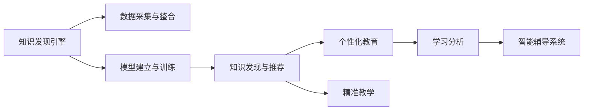
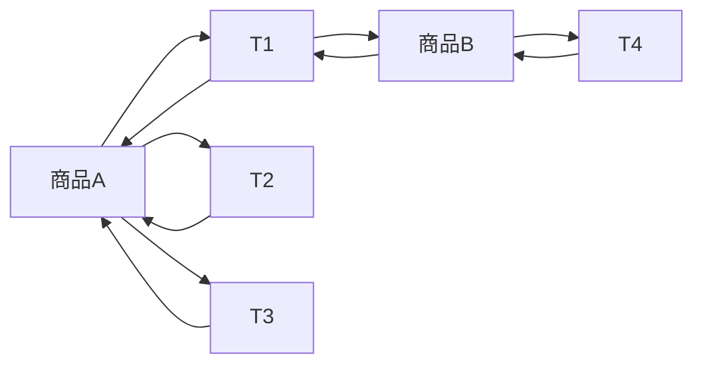

                 

# 知识发现引擎与未来教育模式的变革

> 关键词：知识发现引擎, 个性化教育, 人工智能, 机器学习, 数据驱动, 教育技术, 智能辅导系统, 教育评估, 大数据分析, 学习分析

## 1. 背景介绍

### 1.1 问题由来

随着信息技术的迅猛发展，教育领域正经历着一场深刻的变革。传统的“填鸭式”教育模式已经无法满足新时代的要求，个性化教育和精准教学成为了新的教育方向。然而，个性化教育的实现离不开数据驱动，传统的教育模式难以有效处理和利用大规模、复杂多变的数据。知识发现引擎应运而生，作为基于人工智能的数据分析工具，其目标是通过对教育数据的深入挖掘和分析，实现个性化教育、精准教学，重塑教育模式。

### 1.2 问题核心关键点

知识发现引擎的核心关键点在于其能够对教育数据进行智能化分析，发现隐含的规律和模式，并据此提供个性化的学习方案。这包括：

- **数据采集与整合**：集成多源异构的教育数据，形成统一的教育数据仓库。
- **模型建立与训练**：利用机器学习算法建立知识发现模型，对数据进行深入挖掘。
- **知识发现与推荐**：通过挖掘数据中的知识，生成个性化推荐，指导学习路径。
- **评估与优化**：对学习效果进行实时评估，并根据评估结果不断优化推荐模型。

### 1.3 问题研究意义

知识发现引擎在教育领域的应用，有助于实现个性化、精准化的教学，提高教育质量和效率。具体而言：

1. **提升学习效果**：通过个性化推荐，学习者可以根据自身特点选择合适的学习内容和路径，提高学习效率。
2. **增强教学互动**：实时评估和反馈机制，使教师能够及时调整教学策略，增强教学互动和效果。
3. **优化资源配置**：通过对学习数据的分析，优化教育资源配置，提高教育资源的利用率。
4. **推动教育公平**：利用知识发现引擎，可以为偏远地区和资源匮乏的学校提供高质量的教学支持，缩小教育差距。
5. **促进教育创新**：为教育研究提供大数据支撑，推动教育模式、教学方法、评估体系的创新。

## 2. 核心概念与联系

### 2.1 核心概念概述

为更好地理解知识发现引擎及其在教育中的应用，本节将介绍几个关键概念：

- **知识发现引擎(Knowledge Discovery Engine, KDE)**：基于人工智能的数据挖掘工具，旨在从大规模数据中发现隐含的知识模式和规律，生成个性化推荐。
- **个性化教育**：根据学生的特点和需求，提供定制化的学习方案，实现个性化学习。
- **精准教学**：通过数据分析和模型预测，实现对学生学习状态的精确把握和个性化指导。
- **学习分析(Learning Analytics)**：利用数据分析技术，对学习过程和效果进行持续监测和评估，提供教学改进依据。
- **智能辅导系统**：结合知识发现和个性化推荐，为学习者提供即时、精准的辅导支持。

这些核心概念之间通过以下Mermaid流程图展示其联系：



### 2.2 核心概念原理和架构

知识发现引擎的基本架构包括数据预处理、模型训练、知识发现和推荐输出等环节。

**数据预处理**：
- 数据清洗：去除噪声数据，填补缺失值。
- 特征工程：提取和选择影响学习的关键特征。
- 数据标准化：对数据进行归一化和标准化处理。

**模型训练**：
- 选择合适的机器学习算法，如决策树、随机森林、神经网络等。
- 通过交叉验证和超参数调优，优化模型性能。
- 使用历史学习数据对模型进行训练，形成知识发现模型。

**知识发现**：
- 通过挖掘数据中的关联规则、聚类分析、分类模型等，发现隐含的知识规律。
- 利用数据挖掘技术，识别出学生的学习行为模式和知识盲点。
- 生成个性化推荐，指导学习路径和资源配置。

**推荐输出**：
- 根据学习者的特点和需求，生成个性化的学习资源和路径。
- 实时监控学习者的学习状态，提供即时反馈和指导。
- 对学习效果进行评估，优化推荐模型，提升学习效果。

## 3. 核心算法原理 & 具体操作步骤

### 3.1 算法原理概述

知识发现引擎的核心算法基于数据挖掘和机器学习技术，其原理是通过对大规模教育数据的分析，发现隐含的知识规律，生成个性化推荐。主要算法包括：

- **关联规则学习**：通过频繁项集和关联规则，发现数据中的隐含关联。
- **聚类分析**：将相似的学习者或学习行为聚为一类，进行分类和群体分析。
- **分类与回归**：利用分类和回归模型，预测学习者的学习行为和效果。
- **序列模式挖掘**：通过时间序列分析，发现学习行为中的模式和趋势。
- **神经网络**：利用深度学习模型，提取复杂的非线性特征，提升知识发现能力。

### 3.2 算法步骤详解

知识发现引擎的实现主要包括以下几个步骤：

**Step 1: 数据采集与整合**
- 采集各类教育数据，包括学习行为数据、学习资源数据、评估数据等。
- 使用ETL工具进行数据清洗和标准化处理，形成统一的教育数据仓库。

**Step 2: 模型建立与训练**
- 选择合适的机器学习算法，如决策树、随机森林、神经网络等。
- 使用历史学习数据对模型进行训练，优化模型参数。
- 通过交叉验证和超参数调优，提升模型性能。

**Step 3: 知识发现与推荐**
- 通过关联规则学习、聚类分析、分类与回归、序列模式挖掘等技术，发现隐含的知识规律。
- 生成个性化推荐，指导学习路径和资源配置。
- 实时监控学习者的学习状态，提供即时反馈和指导。

**Step 4: 评估与优化**
- 对学习效果进行评估，分析推荐模型的性能。
- 根据评估结果，优化推荐模型，提升学习效果。

### 3.3 算法优缺点

知识发现引擎的优势在于其能够从大规模数据中发现隐含的知识规律，生成个性化推荐，提升教育质量。其缺点主要包括：

- **数据质量要求高**：需要高质量、完整、一致的教育数据，否则可能会影响分析结果。
- **模型复杂度高**：复杂的算法模型对计算资源和存储空间有较高要求。
- **结果可解释性不足**：生成的推荐模型往往缺乏可解释性，难以理解其内部逻辑。
- **技术门槛高**：知识发现和机器学习技术门槛较高，需要专业的数据科学家和工程师。

### 3.4 算法应用领域

知识发现引擎在教育领域具有广泛的应用前景，主要包括以下几个方面：

1. **个性化学习资源推荐**：通过分析学习者的兴趣和需求，推荐适合的教材、视频、习题等学习资源。
2. **学习路径规划**：根据学习者的特点和目标，生成个性化的学习路径，帮助学习者高效学习。
3. **智能辅导系统**：结合知识发现和个性化推荐，为学习者提供即时、精准的辅导支持。
4. **学习效果评估**：通过分析学习数据，评估学习效果，提供教学改进建议。
5. **教育资源优化**：通过对学习数据的分析，优化教育资源配置，提高教育资源利用率。

## 4. 数学模型和公式 & 详细讲解 & 举例说明

### 4.1 数学模型构建

知识发现引擎的数学模型主要基于机器学习算法和数据挖掘技术，用于从教育数据中发现隐含的知识规律。以下以关联规则学习为例，介绍其数学模型的构建。

**关联规则学习模型**：
- 设数据集为 $D=\{T_1, T_2, ..., T_n\}$，每个事务 $T_i$ 包含若干项 $I_{i,j}$。
- 设项集的频率为 $\text{count}(I)$，项集的度为 $\text{support}(I)$。
- 关联规则 $R$ 表示 $I_1 \rightarrow I_2$，其中 $I_1 \cap I_2 = \emptyset$。
- 关联规则的置信度为 $\text{conf}(R)=\frac{\text{count}(T)}{\text{count}(T \cap I_1)}$，其中 $T$ 为包含 $I_1$ 的事务集合。
- 关联规则的兴趣度为 $\text{int}(R)=\text{conf}(R) \times \text{support}(I_1) \times (1-\text{support}(I_2))$。

### 4.2 公式推导过程

关联规则学习公式推导如下：

1. 计算项集的频率和支持度：
$$
\text{count}(I_j) = \sum_{i=1}^{n} \delta_{I_j}(T_i)
$$
$$
\text{support}(I_j) = \frac{\text{count}(I_j)}{\sum_{i=1}^{n} \delta_{I_j}(T_i)}
$$

2. 计算关联规则的置信度和兴趣度：
$$
\text{conf}(R) = \frac{\text{count}(T)}{\text{count}(T \cap I_1)}
$$
$$
\text{int}(R) = \text{conf}(R) \times \text{support}(I_1) \times (1-\text{support}(I_2))
$$

### 4.3 案例分析与讲解

假设有一个包含多个交易事务的数据集 $D=\{T_1, T_2, ..., T_n\}$，每个事务包含若干项 $I_{i,j}$。我们想发现“购物篮分析”中的关联规则，即哪些商品之间经常一起购买。

**Step 1: 数据预处理**
- 对数据进行清洗，去除噪声数据。
- 对数据进行归一化处理，统一度量单位。

**Step 2: 关联规则挖掘**
- 计算项集的频率和支持度。
- 生成候选关联规则，并计算置信度和兴趣度。
- 筛选置信度和兴趣度均大于预设阈值的规则。

**Step 3: 结果分析**
- 生成关联规则表，展示关联规则及其置信度和兴趣度。
- 可视化展示关联规则，如图，展示商品之间的关联。



## 5. 项目实践：代码实例和详细解释说明

### 5.1 开发环境搭建

在进行知识发现引擎的开发前，我们需要准备好开发环境。以下是使用Python进行PyTorch开发的环境配置流程：

1. 安装Anaconda：从官网下载并安装Anaconda，用于创建独立的Python环境。

2. 创建并激活虚拟环境：
```bash
conda create -n pytorch-env python=3.8 
conda activate pytorch-env
```

3. 安装PyTorch：根据CUDA版本，从官网获取对应的安装命令。例如：
```bash
conda install pytorch torchvision torchaudio cudatoolkit=11.1 -c pytorch -c conda-forge
```

4. 安装TensorFlow：由Google主导开发的开源深度学习框架，生产部署方便，适合大规模工程应用。同样有丰富的预训练语言模型资源。

5. 安装各类工具包：
```bash
pip install numpy pandas scikit-learn matplotlib tqdm jupyter notebook ipython
```

完成上述步骤后，即可在`pytorch-env`环境中开始开发。

### 5.2 源代码详细实现

下面我们以关联规则学习为例，给出使用PyTorch进行教育数据挖掘的Python代码实现。

首先，定义数据集：

```python
from ilagent.agents import freq_sets
from ilagent.utilities import utility_functions as utilities
import numpy as np

# 定义数据集
D = [ 
    {'items': ['book1', 'book2', 'book3'], 'timestamp': 1580889609},
    {'items': ['book1', 'notebook', 'laptop'], 'timestamp': 1580889609},
    {'items': ['book2', 'book3', 'notebook'], 'timestamp': 1580889610},
    {'items': ['book1', 'laptop', 'notebook'], 'timestamp': 1580889611},
    {'items': ['notebook', 'laptop'], 'timestamp': 1580889612}
]
```

然后，定义关联规则学习函数：

```python
def apriori(D, min_support, min_confidence, output):
    # 数据预处理
    items = [set(i) for i in [d['items'] for d in D]]
    timestamps = [d['timestamp'] for d in D]
    
    # 项集挖掘
    freq_sets.set(item_list=items, min_support=min_support, output=output)
    
    # 关联规则挖掘
    for i in range(1, len(items)):
        lhs = freq_sets.items[i-1]
        rhs = freq_sets.items[i]
        if len(rhs) == 1:
            freq_sets.join_sets(lhs, rhs)
            freq_sets.prune_sets(lhs, rhs, min_support, min_confidence)
    
    # 返回结果
    return freq_sets.items
```

接着，进行关联规则挖掘：

```python
# 设置参数
min_support = 0.2
min_confidence = 0.5
output = []

# 关联规则挖掘
items = apriori(D, min_support, min_confidence, output)

# 输出结果
for i in range(len(items)):
    print(f"规则{i+1}: {items[i]}")
```

### 5.3 代码解读与分析

让我们再详细解读一下关键代码的实现细节：

**数据集定义**：
- 定义一个包含多个交易事务的数据集，每个事务包含若干项和发生时间。

**关联规则学习函数**：
- 数据预处理：对数据进行清洗和归一化处理。
- 项集挖掘：使用Apriori算法挖掘项集，计算项集的频率和支持度。
- 关联规则挖掘：生成候选关联规则，计算置信度和兴趣度，筛选置信度和兴趣度均大于预设阈值的规则。

**关联规则挖掘结果**：
- 输出挖掘出的关联规则，展示商品之间的关联关系。

可以看到，通过上述代码，我们可以实现基本的关联规则学习功能，为知识发现引擎的开发提供了参考。

## 6. 实际应用场景

### 6.1 智能辅导系统

智能辅导系统是知识发现引擎的一个重要应用场景，通过个性化推荐和智能辅导，帮助学习者高效学习。

在技术实现上，可以收集学习者的学习行为数据，包括学习时间、学习资源使用情况、答题情况等。通过关联规则学习，挖掘出学习者之间的关联和行为模式。利用挖掘结果，生成个性化推荐，指导学习者选择合适的学习资源和路径。同时，结合知识发现和个性化推荐，提供即时、精准的辅导支持，帮助学习者解决学习难题。

### 6.2 教育资源优化

教育资源优化是知识发现引擎的另一个重要应用场景，通过对学习数据的分析，优化教育资源的配置和使用。

在技术实现上，可以收集学习者的学习行为数据，包括学习时间、学习资源使用情况、学习效果等。通过聚类分析和关联规则学习，识别出学习者的学习行为模式和资源需求。利用挖掘结果，优化教育资源的配置和使用，提高教育资源的利用率。例如，可以根据学习者的需求，推荐适合的教材、视频、习题等学习资源，优化课堂教学和辅导资源。

### 6.3 学习效果评估

学习效果评估是知识发现引擎的重要功能之一，通过对学习数据的分析，评估学习效果，提供教学改进建议。

在技术实现上，可以收集学习者的学习行为数据，包括学习时间、学习资源使用情况、答题情况等。通过分类和回归模型，预测学习者的学习效果。利用挖掘结果，评估学习效果，提供教学改进建议，如调整教学策略、优化学习路径、推荐适合的学习资源等。同时，对学习效果进行实时监控和评估，及时发现学习问题，提供解决方案。

## 7. 工具和资源推荐

### 7.1 学习资源推荐

为了帮助开发者系统掌握知识发现引擎的理论基础和实践技巧，这里推荐一些优质的学习资源：

1. 《数据挖掘与统计学习基础》系列博文：由数据科学家撰写，深入浅出地介绍了数据挖掘和机器学习的基本概念和经典算法。

2. CS229《机器学习》课程：斯坦福大学开设的机器学习课程，有Lecture视频和配套作业，带你入门机器学习的基本理论和应用。

3. 《Python机器学习》书籍：机器学习库scikit-learn的作者所著，全面介绍了如何使用Python进行数据挖掘和机器学习。

4. Weights & Biases：模型训练的实验跟踪工具，可以记录和可视化模型训练过程中的各项指标，方便对比和调优。与主流深度学习框架无缝集成。

5. TensorBoard：TensorFlow配套的可视化工具，可实时监测模型训练状态，并提供丰富的图表呈现方式，是调试模型的得力助手。

通过对这些资源的学习实践，相信你一定能够快速掌握知识发现引擎的精髓，并用于解决实际的NLP问题。

### 7.2 开发工具推荐

高效的开发离不开优秀的工具支持。以下是几款用于知识发现引擎开发的常用工具：

1. PyTorch：基于Python的开源深度学习框架，灵活动态的计算图，适合快速迭代研究。大部分预训练语言模型都有PyTorch版本的实现。

2. TensorFlow：由Google主导开发的开源深度学习框架，生产部署方便，适合大规模工程应用。同样有丰富的预训练语言模型资源。

3. Weights & Biases：模型训练的实验跟踪工具，可以记录和可视化模型训练过程中的各项指标，方便对比和调优。与主流深度学习框架无缝集成。

4. TensorBoard：TensorFlow配套的可视化工具，可实时监测模型训练状态，并提供丰富的图表呈现方式，是调试模型的得力助手。

5. Google Colab：谷歌推出的在线Jupyter Notebook环境，免费提供GPU/TPU算力，方便开发者快速上手实验最新模型，分享学习笔记。

合理利用这些工具，可以显著提升知识发现引擎的开发效率，加快创新迭代的步伐。

### 7.3 相关论文推荐

知识发现引擎的研究源于学界的持续研究。以下是几篇奠基性的相关论文，推荐阅读：

1. Induction of Associations by Examples and Values (AIS)：提出Apriori算法，是关联规则挖掘的经典算法。

2. FPGM: An Efficient Frequent Pattern Growth Algorithm：提出FP-Growth算法，改进Apriori算法，提升效率。

3. Clustering Algorithms by Examples and Values (CAEv)：提出CAEv算法，用于聚类分析和关联规则挖掘。

4. Fast Projective Clustering (FPC)：提出FPC算法，用于高维数据聚类和关联规则挖掘。

5. Association Rules Induction in the Presence of Databases with Missing Values：提出处理缺失数据的关联规则挖掘算法。

这些论文代表了大语言模型微调技术的发展脉络。通过学习这些前沿成果，可以帮助研究者把握学科前进方向，激发更多的创新灵感。

## 8. 总结：未来发展趋势与挑战

### 8.1 总结

本文对知识发现引擎及其在教育中的应用进行了全面系统的介绍。首先阐述了知识发现引擎的研究背景和意义，明确了其在个性化教育、精准教学中的独特价值。其次，从原理到实践，详细讲解了知识发现引擎的数学模型和操作步骤，给出了代码实例和详细解释。同时，本文还广泛探讨了知识发现引擎在智能辅导系统、教育资源优化、学习效果评估等多个行业领域的应用前景，展示了其在教育领域的重要作用。

通过本文的系统梳理，可以看到，知识发现引擎在教育领域的应用前景广阔，通过数据挖掘和机器学习技术，可以为个性化教育和精准教学提供有力支撑。未来，伴随知识发现引擎的持续演进，必将进一步提升教育质量，推动教育模式的创新和变革。

### 8.2 未来发展趋势

展望未来，知识发现引擎将在教育领域呈现以下几个发展趋势：

1. **数据驱动决策**：随着教育数据的不断积累和丰富，知识发现引擎将更加深入地挖掘数据价值，为教育决策提供有力支持。
2. **个性化教育深化**：结合学生学习行为数据和心理特征，实现更加精准、个性化的教育推荐，提升学习效果。
3. **智能辅导系统升级**：通过知识发现引擎，智能辅导系统将更加智能化、个性化，提供更加高效的辅导支持。
4. **教育资源优化**：通过数据分析，优化教育资源的配置和利用，提高教育资源利用率。
5. **学习效果评估改进**：通过大数据分析，评估学习效果，提供个性化的学习改进方案。
6. **跨学科融合**：结合数据科学、教育学、心理学等多学科知识，推动知识发现引擎向更加智能化、人性化的方向发展。

以上趋势凸显了知识发现引擎在教育领域的应用前景，为教育研究和实践提供了新的思路和方法。

### 8.3 面临的挑战

尽管知识发现引擎在教育领域的应用前景广阔，但在实际应用中，仍面临诸多挑战：

1. **数据质量问题**：教育数据的采集和处理需要规范化的标准和方法，否则会影响分析结果的准确性和可靠性。
2. **隐私和安全**：教育数据的敏感性和隐私性，需要采取严格的数据保护措施，防止数据泄露和滥用。
3. **技术复杂性**：知识发现引擎涉及数据挖掘和机器学习技术，对技术要求较高，需要专业的数据科学家和工程师。
4. **结果可解释性**：知识发现引擎生成的推荐模型往往缺乏可解释性，难以理解其内部逻辑。
5. **算法复杂性**：知识发现引擎的算法复杂度高，对计算资源和存储空间有较高要求。

这些挑战需要不断突破和解决，才能推动知识发现引擎在教育领域的应用。

### 8.4 研究展望

面向未来，知识发现引擎的研究需要在以下几个方面寻求新的突破：

1. **数据质量提升**：制定教育数据标准，规范数据采集和处理流程，提升数据质量。
2. **隐私保护机制**：采用隐私保护技术，如差分隐私、联邦学习等，保护教育数据的隐私和安全。
3. **结果可解释性增强**：开发可解释性更强的推荐模型，增强其内部逻辑的可理解性。
4. **算法优化**：简化知识发现引擎的算法模型，提升其计算效率和可扩展性。
5. **跨学科融合**：结合数据科学、教育学、心理学等多学科知识，推动知识发现引擎向更加智能化、人性化的方向发展。
6. **应用场景拓展**：探索知识发现引擎在其他领域的应用，如医疗、金融、物流等，提升其在多场景下的应用价值。

这些研究方向的探索，必将推动知识发现引擎在教育领域的应用，为教育研究和实践提供新的思路和方法。相信随着技术的发展和应用的深化，知识发现引擎必将在教育领域发挥更加重要的作用，推动教育模式的创新和变革。

## 9. 附录：常见问题与解答

**Q1: 知识发现引擎如何处理缺失数据？**

A: 知识发现引擎在处理缺失数据时，一般采用数据插补或删除的方法。具体而言：

1. 数据插补：通过均值、中位数、众数等方法对缺失值进行插补，保持数据完整性。
2. 数据删除：对于缺失值较多的样本，可以考虑删除该样本，以避免对分析结果的干扰。

在实际应用中，可以根据数据特点选择合适的方法进行处理。

**Q2: 知识发现引擎在教育领域的应用有哪些挑战？**

A: 知识发现引擎在教育领域的应用面临以下挑战：

1. 数据质量问题：教育数据的采集和处理需要规范化的标准和方法，否则会影响分析结果的准确性和可靠性。
2. 隐私和安全：教育数据的敏感性和隐私性，需要采取严格的数据保护措施，防止数据泄露和滥用。
3. 技术复杂性：知识发现引擎涉及数据挖掘和机器学习技术，对技术要求较高，需要专业的数据科学家和工程师。
4. 结果可解释性：知识发现引擎生成的推荐模型往往缺乏可解释性，难以理解其内部逻辑。
5. 算法复杂性：知识发现引擎的算法复杂度高，对计算资源和存储空间有较高要求。

这些挑战需要不断突破和解决，才能推动知识发现引擎在教育领域的应用。

**Q3: 知识发现引擎如何生成个性化推荐？**

A: 知识发现引擎生成个性化推荐的过程主要包括以下几个步骤：

1. 数据采集与整合：收集学习者的学习行为数据，包括学习时间、学习资源使用情况、答题情况等。
2. 模型建立与训练：选择合适的机器学习算法，如关联规则学习、聚类分析、分类与回归等，对数据进行建模和训练。
3. 知识发现与推荐：通过挖掘数据中的知识规律，生成个性化推荐，指导学习者选择合适的学习资源和路径。
4. 评估与优化：对推荐模型的性能进行评估，根据评估结果不断优化推荐策略，提升学习效果。

通过上述步骤，知识发现引擎可以生成个性化推荐，帮助学习者高效学习。

**Q4: 知识发现引擎在教育领域的未来应用前景如何？**

A: 知识发现引擎在教育领域的未来应用前景广阔，主要体现在以下几个方面：

1. 数据驱动决策：随着教育数据的不断积累和丰富，知识发现引擎将更加深入地挖掘数据价值，为教育决策提供有力支持。
2. 个性化教育深化：结合学生学习行为数据和心理特征，实现更加精准、个性化的教育推荐，提升学习效果。
3. 智能辅导系统升级：通过知识发现引擎，智能辅导系统将更加智能化、个性化，提供更加高效的辅导支持。
4. 教育资源优化：通过数据分析，优化教育资源的配置和利用，提高教育资源利用率。
5. 学习效果评估改进：通过大数据分析，评估学习效果，提供个性化的学习改进方案。
6. 跨学科融合：结合数据科学、教育学、心理学等多学科知识，推动知识发现引擎向更加智能化、人性化的方向发展。

这些应用前景表明，知识发现引擎在教育领域具有广阔的发展前景，能够为教育研究和实践提供新的思路和方法。

**Q5: 知识发现引擎如何处理异常数据？**

A: 知识发现引擎在处理异常数据时，一般采用数据清洗和异常检测的方法。具体而言：

1. 数据清洗：通过去除噪声数据、填补缺失值等方法，保持数据完整性和一致性。
2. 异常检测：使用统计方法、聚类算法等技术，检测并处理异常数据，避免对分析结果的干扰。

在实际应用中，可以根据数据特点选择合适的方法进行处理。

---

作者：禅与计算机程序设计艺术 / Zen and the Art of Computer Programming

