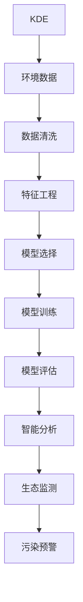

                 

# 知识发现引擎在环境保护中的应用

> 关键词：知识发现引擎,环境保护,数据挖掘,生态监测,污染预警,智能分析

## 1. 背景介绍

### 1.1 问题由来
环境保护是全球面临的重大挑战之一，关系到人类社会的可持续发展。传统的环保方法主要依赖人工监测和经验判断，难以全面覆盖大范围的环境数据，且反应速度较慢。随着信息技术的迅猛发展，知识发现引擎(Knowledge Discovery Engine, KDE)被引入环境保护领域，成为提高环境监测和保护效率的有效工具。知识发现引擎通过自动分析和挖掘海量环境数据，发现环境问题的潜在模式和趋势，辅助环保决策，有效提升环境监测和治理的效果。

### 1.2 问题核心关键点
知识发现引擎在环境保护中的应用，主要涉及以下几个关键点：
- **数据处理**：从多源异构环境数据中提取、清洗和整合数据，形成高质量的训练集和测试集。
- **模型选择**：选择合适的机器学习算法和模型结构，用于环境数据的建模和预测。
- **特征工程**：从原始环境数据中提取有意义的特征，优化模型性能。
- **模型评估**：采用合适的评估指标和方法，对模型进行验证和调优。
- **应用实践**：将模型部署到实际环境监测系统中，实现实时监测和预警。

本文将系统性地介绍知识发现引擎在环境保护中的应用，包括数据处理、模型选择、特征工程、模型评估和应用实践，旨在为环保工作者提供全面的技术指导，推动环境保护技术的进步。

## 2. 核心概念与联系

### 2.1 核心概念概述

知识发现引擎在环境保护中的应用，主要涉及以下核心概念：

- **知识发现引擎(KDE)**：一种数据挖掘技术，用于从大量数据中自动发现隐藏的知识和规律。在环境保护中，知识发现引擎通过对环境数据进行分析和挖掘，辅助决策和预测。

- **环境数据**：指与环境监测和保护相关的各类数据，如水质、空气质量、气象、噪声等。数据来源广泛，包括卫星遥感、传感器网络、物联网等。

- **数据挖掘**：从大量数据中提取出有用的信息和模式，是知识发现引擎的基础。

- **机器学习**：通过数据驱动的算法，训练出能够自动发现和预测环境问题的模型。

- **生态监测**：对生态环境进行持续的监测和评估，及时发现和预警环境问题。

- **污染预警**：通过数据分析和模型预测，提前识别环境污染趋势，采取措施防止污染扩散。

- **智能分析**：利用知识发现引擎和机器学习技术，对复杂环境数据进行智能分析和解释。

这些核心概念通过知识发现引擎这一桥梁，相互联系和作用，共同构成环境保护技术体系。知识发现引擎作为数据挖掘和机器学习的结合点，是实现环境保护智能化和精准化的关键技术。

### 2.2 核心概念原理和架构的 Mermaid 流程图



这个流程图展示了知识发现引擎在环境保护中的作用过程：

1. 环境数据被收集和预处理，确保数据的质量和一致性。
2. 数据通过特征工程被转化成模型可理解的特征集。
3. 选择合适的模型，并对模型进行训练和优化。
4. 通过模型评估，确保模型在实际应用中的性能。
5. 智能分析技术辅助解释模型结果，并应用到生态监测和污染预警中。

## 3. 核心算法原理 & 具体操作步骤

### 3.1 算法原理概述

知识发现引擎在环境保护中的应用，主要依赖于以下算法原理：

- **监督学习**：通过对已标注的环境数据进行训练，模型学习到环境问题与特征之间的映射关系，并进行预测。
- **无监督学习**：从未标注的环境数据中发现潜在模式和异常点，辅助环境监测和预警。
- **强化学习**：通过奖励和惩罚机制，指导模型在实际环境中的应用，提高模型决策的准确性和可靠性。
- **深度学习**：利用深度神经网络模型，处理大规模复杂环境数据，提高模型的预测精度和泛化能力。

### 3.2 算法步骤详解

知识发现引擎在环境保护中的应用，一般包括以下关键步骤：

**Step 1: 数据预处理**
- 收集多源异构环境数据，进行清洗、去噪和归一化。
- 对数据进行缺失值处理、异常值检测和数据整合。

**Step 2: 特征工程**
- 从原始环境数据中提取有意义的特征，如水质指标、气象数据、噪声水平等。
- 应用特征选择和特征降维技术，优化模型性能。

**Step 3: 模型选择**
- 根据任务需求，选择合适的机器学习算法和模型结构。
- 常用的模型包括线性回归、决策树、随机森林、支持向量机、神经网络等。

**Step 4: 模型训练**
- 使用环境数据训练模型，调整模型参数，优化模型性能。
- 常用的优化算法包括梯度下降、Adam、RMSprop等。

**Step 5: 模型评估**
- 采用合适的评估指标，如均方误差、准确率、召回率、F1分数等，评估模型性能。
- 通过交叉验证等方法，验证模型在不同数据集上的表现。

**Step 6: 智能分析**
- 利用模型对环境数据进行智能分析和解释，辅助环境监测和预警。
- 结合专家知识和领域经验，对模型结果进行验证和优化。

**Step 7: 生态监测和污染预警**
- 将模型部署到实际环境监测系统中，实现实时监测和预警。
- 定期更新模型，保持其对环境变化的适应性。

### 3.3 算法优缺点

知识发现引擎在环境保护中的应用，具有以下优点：
1. **高效性**：自动处理大量数据，发现环境问题的潜在模式和趋势，提高监测和保护效率。
2. **全面性**：通过多源异构数据整合，提供全面、准确的环境信息。
3. **可扩展性**：可以适应不同规模和复杂度的环境监测任务。
4. **实时性**：能够实时监测环境数据，及时发现和预警环境问题。

同时，知识发现引擎在环境保护中也存在一些局限性：
1. **数据质量**：环境数据的质量和完整性直接影响模型性能。
2. **算法复杂性**：选择和优化模型需要一定的专业知识和计算资源。
3. **应用成本**：需要投入一定的时间和人力进行数据收集、模型训练和部署。
4. **模型解释性**：部分模型的预测结果难以解释，影响决策的透明度和可信度。

尽管存在这些局限性，知识发现引擎在环境保护中的应用已经取得了显著成果，成为环境保护技术的重要组成部分。

### 3.4 算法应用领域

知识发现引擎在环境保护中的应用，主要涉及以下几个领域：

- **水质监测**：通过对水质数据进行分析和挖掘，发现水质变化趋势，预警水污染事件。
- **空气质量监测**：利用传感器网络和大气监测数据，预测空气污染指数，发布预警信息。
- **噪声监测**：通过噪声传感器数据，识别噪声污染源和传播路径，辅助城市规划。
- **生态系统监测**：对森林、草原等生态系统进行长期监测，评估生态健康状况。
- **环境灾害预警**：利用气象和地质数据，预测自然灾害的发生和影响范围，提高防灾减灾能力。
- **污染源追踪**：通过数据分析和建模，追踪污染物的来源和扩散路径，辅助污染治理。

这些领域的应用，极大地提高了环境监测和保护的效果，推动了环境保护技术的进步。

## 4. 数学模型和公式 & 详细讲解 & 举例说明

### 4.1 数学模型构建

知识发现引擎在环境保护中的应用，主要涉及以下几个数学模型：

- **线性回归模型**：用于预测水质、空气质量等连续变量的变化趋势。
- **分类模型**：如决策树、随机森林、支持向量机等，用于分类预测环境事件（如水污染、空气污染）。
- **聚类模型**：如K-means、层次聚类等，用于发现环境数据的潜在模式和异常点。
- **深度学习模型**：如卷积神经网络（CNN）、长短期记忆网络（LSTM）等，用于处理大规模复杂环境数据。

以线性回归模型为例，假设环境数据集为 $D=\{(x_i, y_i)\}_{i=1}^N$，其中 $x_i$ 为环境特征向量，$y_i$ 为对应环境变量，如水质指标、气温等。线性回归模型的目标是最小化预测值与真实值之间的误差，即：

$$
\min_{\theta} \sum_{i=1}^N (y_i - \theta^T x_i)^2
$$

其中 $\theta$ 为模型参数，包括偏置项和权重项。

### 4.2 公式推导过程

线性回归模型的推导过程如下：

设环境数据的回归函数为 $f(x) = \theta^T x$，其中 $\theta = [\theta_0, \theta_1, ..., \theta_n]^T$ 为模型参数。目标是最小化预测值与真实值之间的平方误差，即：

$$
\min_{\theta} \sum_{i=1}^N (y_i - f(x_i))^2
$$

将 $f(x_i) = \theta^T x_i$ 代入上式，得：

$$
\min_{\theta} \sum_{i=1}^N (y_i - \theta^T x_i)^2
$$

对 $\theta$ 求导，得：

$$
\nabla_{\theta}L(\theta) = -2\sum_{i=1}^N (y_i - \theta^T x_i) x_i
$$

令 $\nabla_{\theta}L(\theta) = 0$，解得：

$$
\theta = (\sum_{i=1}^N x_i x_i^T)^{-1} \sum_{i=1}^N y_i x_i
$$

其中 $\sum_{i=1}^N x_i x_i^T$ 为样本协方差矩阵，$\sum_{i=1}^N y_i x_i$ 为样本特征与目标变量的加权和。

### 4.3 案例分析与讲解

以水质监测为例，假设已知某河段的水质数据 $D=\{(x_i, y_i)\}_{i=1}^N$，其中 $x_i$ 为河段流量、pH值、溶解氧等特征，$y_i$ 为水质指标，如氨氮、总磷等。目标是建立线性回归模型，预测未来河段水质变化。

**Step 1: 数据预处理**
- 收集河段的历史水质数据，进行清洗、去噪和归一化。
- 对数据进行缺失值处理、异常值检测和数据整合。

**Step 2: 特征工程**
- 提取河段流量、pH值、溶解氧等特征。
- 应用特征选择和特征降维技术，如PCA，优化模型性能。

**Step 3: 模型训练**
- 使用历史水质数据训练线性回归模型，调整模型参数。
- 采用梯度下降算法优化模型，确保模型在实际应用中的性能。

**Step 4: 模型评估**
- 使用交叉验证等方法，评估模型在不同数据集上的表现。
- 采用均方误差等评估指标，验证模型的预测精度。

**Step 5: 智能分析**
- 利用模型对未来河段水质进行预测，辅助环境监测和预警。
- 结合专家知识和领域经验，对模型结果进行验证和优化。

通过以上步骤，可以有效利用知识发现引擎和线性回归模型，实现河段水质的智能监测和预警。

## 5. 项目实践：代码实例和详细解释说明

### 5.1 开发环境搭建

在进行项目实践前，我们需要准备好开发环境。以下是使用Python进行项目实践的环境配置流程：

1. 安装Anaconda：从官网下载并安装Anaconda，用于创建独立的Python环境。

2. 创建并激活虚拟环境：
```bash
conda create -n env_name python=3.8 
conda activate env_name
```

3. 安装必要的Python包：
```bash
pip install numpy pandas scikit-learn matplotlib seaborn plotly
```

4. 安装环境监测相关的库：
```bash
pip install pygeos shapely netCDF4 pandas-gbq pyproj fiona
```

5. 安装机器学习相关的库：
```bash
pip install scikit-learn xgboost catboost lightgbm
```

完成上述步骤后，即可在`env_name`环境中开始项目实践。

### 5.2 源代码详细实现

下面以水质监测为例，给出使用Scikit-learn进行线性回归模型训练的代码实现。

```python
import pandas as pd
import numpy as np
from sklearn.model_selection import train_test_split
from sklearn.linear_model import LinearRegression
from sklearn.metrics import mean_squared_error

# 读取水质数据
data = pd.read_csv('water_quality.csv', header=None)

# 数据预处理
X = data.iloc[:, 1:]  # 特征
y = data.iloc[:, 0]  # 目标变量

# 数据分割
X_train, X_test, y_train, y_test = train_test_split(X, y, test_size=0.2, random_state=42)

# 模型训练
model = LinearRegression()
model.fit(X_train, y_train)

# 模型评估
y_pred = model.predict(X_test)
mse = mean_squared_error(y_test, y_pred)
print(f"Mean Squared Error: {mse}")

# 智能分析
X_new = np.array([[25, 6.5, 7.2]])  # 新河段的水质特征
y_new = model.predict(X_new)
print(f"Predicted Water Quality: {y_new}")
```

以上是使用Scikit-learn进行线性回归模型训练的完整代码实现。可以看到，通过简单的几步操作，即可构建并评估一个线性回归模型，用于水质监测。

### 5.3 代码解读与分析

让我们再详细解读一下关键代码的实现细节：

**数据预处理**
- `data.iloc[:, 1:]`：读取数据文件的第二列到最后一列，作为模型特征。
- `data.iloc[:, 0]`：读取数据文件的第一列，作为模型目标变量。

**模型训练**
- `train_test_split`：将数据集划分为训练集和测试集。
- `LinearRegression`：创建线性回归模型。
- `model.fit`：训练模型。

**模型评估**
- `mean_squared_error`：计算均方误差。

**智能分析**
- `model.predict`：使用训练好的模型对新河段的水质进行预测。

可以看到，Scikit-learn提供了丰富的机器学习库，使得模型构建和评估变得异常简单。开发者只需关注数据处理和模型训练细节，即可快速构建高效的环境监测系统。

## 6. 实际应用场景

### 6.1 智能水质监测系统

智能水质监测系统通过知识发现引擎和机器学习模型，实时监测水体水质，发现水质变化趋势，预警水污染事件。该系统通常包括以下几个模块：

1. **数据采集模块**：通过传感器、自动监测站等设备，实时采集水质数据。
2. **数据处理模块**：清洗、去噪、归一化数据，处理缺失值和异常值。
3. **模型训练模块**：选择合适的机器学习模型，训练预测水质变化的模型。
4. **智能分析模块**：对水质数据进行智能分析和解释，辅助环境监测和预警。
5. **预警发布模块**：根据模型预测结果，发布水污染预警信息，通知相关部门采取措施。

### 6.2 空气质量监测系统

空气质量监测系统利用传感器网络和大气监测数据，预测空气污染指数，发布预警信息。该系统通常包括以下几个模块：

1. **数据采集模块**：通过传感器网络，实时采集空气质量数据。
2. **数据处理模块**：清洗、去噪、归一化数据，处理缺失值和异常值。
3. **模型训练模块**：选择合适的机器学习模型，训练预测空气污染指数的模型。
4. **智能分析模块**：对空气数据进行智能分析和解释，辅助环境监测和预警。
5. **预警发布模块**：根据模型预测结果，发布空气污染预警信息，通知相关部门采取措施。

### 6.3 噪声监测系统

噪声监测系统通过传感器网络，实时监测噪声水平，识别噪声污染源和传播路径，辅助城市规划。该系统通常包括以下几个模块：

1. **数据采集模块**：通过传感器网络，实时采集噪声数据。
2. **数据处理模块**：清洗、去噪、归一化数据，处理缺失值和异常值。
3. **模型训练模块**：选择合适的机器学习模型，训练识别噪声污染源和传播路径的模型。
4. **智能分析模块**：对噪声数据进行智能分析和解释，辅助城市规划和噪声治理。
5. **预警发布模块**：根据模型预测结果，发布噪声污染预警信息，通知相关部门采取措施。

### 6.4 未来应用展望

随着知识发现引擎和机器学习技术的不断发展，环境保护领域的智能监测和预警系统将面临更多应用场景。

1. **智能生态系统监测**：通过卫星遥感和传感器网络，实时监测森林、草原等生态系统，评估生态健康状况，发现生态破坏和环境变化趋势。
2. **智能环境灾害预警**：利用气象和地质数据，预测自然灾害的发生和影响范围，提高防灾减灾能力。
3. **智能污染源追踪**：通过数据分析和建模，追踪污染物的来源和扩散路径，辅助污染治理。

## 7. 工具和资源推荐

### 7.1 学习资源推荐

为了帮助开发者系统掌握知识发现引擎和机器学习技术，这里推荐一些优质的学习资源：

1. 《Python数据科学手册》：一本全面介绍Python数据科学库的书籍，涵盖NumPy、Pandas、Scikit-learn等库的使用。
2. 《机器学习实战》：一本实用的机器学习入门书籍，涵盖多种机器学习算法和实战案例。
3. Coursera和edX上的机器学习课程：斯坦福大学、MIT等名校开设的机器学习课程，提供系统性的学习资料和实践指导。
4. Kaggle：一个数据科学竞赛平台，提供丰富的数据集和模型竞赛，帮助开发者实践和提升技能。
5. TensorFlow和PyTorch官方文档：这两个流行的深度学习框架，提供了丰富的API文档和代码示例。

通过对这些资源的学习实践，相信你一定能够快速掌握知识发现引擎和机器学习技术，并用于解决实际的环境保护问题。

### 7.2 开发工具推荐

高效的开发离不开优秀的工具支持。以下是几款用于知识发现引擎和机器学习开发的常用工具：

1. Python：一种简单易学的编程语言，具有丰富的数据科学库和机器学习库。
2. Jupyter Notebook：一个交互式的Python开发环境，支持代码实时运行和结果展示。
3. Anaconda：一个Python环境管理工具，提供了丰富的Python包和依赖管理功能。
4. TensorBoard：一个TensorFlow配套的可视化工具，用于实时监测模型训练状态。
5. Weights & Biases：一个模型训练的实验跟踪工具，记录和可视化模型训练过程中的各项指标。

合理利用这些工具，可以显著提升知识发现引擎和机器学习项目的开发效率，加快创新迭代的步伐。

### 7.3 相关论文推荐

知识发现引擎和机器学习技术的发展源于学界的持续研究。以下是几篇奠基性的相关论文，推荐阅读：

1. 《Gaussian Processes for Machine Learning》：Russell S. Fletcher和Niall J. MacKay合著的书籍，系统介绍了高斯过程在机器学习中的应用。
2. 《The Elements of Statistical Learning》：Tibshirani、Hastie和Friedman合著的书籍，全面介绍了统计学习的方法和应用。
3. 《Deep Learning》：Ian Goodfellow、Yoshua Bengio和Aaron Courville合著的书籍，介绍了深度学习的原理和实践。
4. 《Machine Learning Yearning》：Andrew Ng撰写的书籍，提供了机器学习实践中的实用建议和经验分享。

这些论文代表了大数据和机器学习领域的最新进展，通过学习这些前沿成果，可以帮助研究者把握学科前进方向，激发更多的创新灵感。

## 8. 总结：未来发展趋势与挑战

### 8.1 总结

本文对知识发现引擎在环境保护中的应用进行了全面系统的介绍。首先阐述了知识发现引擎和环境保护的基本概念和核心关键点，明确了其在环境保护中的独特价值。其次，从原理到实践，详细讲解了知识发现引擎在环境保护中的应用步骤，包括数据预处理、特征工程、模型选择、模型训练、模型评估和智能分析，给出了具体的代码实例和详细解读。同时，本文还广泛探讨了知识发现引擎在智能水质监测、空气质量监测、噪声监测等多个领域的应用前景，展示了其在环境保护技术中的巨大潜力。

通过本文的系统梳理，可以看到，知识发现引擎和机器学习技术已经深刻改变了环境保护的方式，提高了监测和保护效率，推动了环境保护技术的进步。未来，伴随知识发现引擎和机器学习技术的不断演进，环境保护领域的智能化和精准化水平必将进一步提升，为环境治理带来更多的创新和突破。

### 8.2 未来发展趋势

展望未来，知识发现引擎在环境保护中的应用将呈现以下几个发展趋势：

1. **自动化程度提升**：随着自动化数据处理和模型训练技术的发展，知识发现引擎在环境保护中的应用将变得更加高效和便捷。
2. **跨领域融合**：知识发现引擎与物联网、云计算、大数据等技术的融合，将拓展其在环境保护中的应用场景。
3. **模型可解释性增强**：通过可解释性技术，增强知识发现引擎的透明度和可信度，提高决策的科学性和合理性。
4. **智能分析能力增强**：结合专家知识和领域经验，利用深度学习、因果推断等技术，增强知识发现引擎的智能分析能力。
5. **实时监测与预警**：通过边缘计算和云计算，实现环境监测和预警的实时化，提高环境治理的响应速度。

以上趋势凸显了知识发现引擎在环境保护中的应用前景，为环境保护技术的智能化和精准化提供了新的方向。

### 8.3 面临的挑战

尽管知识发现引擎在环境保护中的应用已经取得了显著成果，但在迈向更加智能化、普适化应用的过程中，仍面临以下挑战：

1. **数据质量和获取成本**：环境数据的质量和获取成本直接影响模型的性能和应用效果。如何高效、低成本地获取高质量环境数据，是一大难题。
2. **模型复杂度和可解释性**：部分机器学习模型复杂度高，难以解释其内部工作机制和决策逻辑。如何提高模型的可解释性和透明性，仍需进一步研究。
3. **应用场景多样性**：不同环境保护任务具有多样性和复杂性，单一的机器学习模型难以适应所有应用场景。如何构建灵活、可扩展的智能监测系统，是一大挑战。
4. **模型鲁棒性和泛化能力**：知识发现引擎在面对新数据和新场景时，模型的鲁棒性和泛化能力不足。如何提高模型对未知数据和未知场景的适应性，仍需深入研究。

尽管存在这些挑战，知识发现引擎和机器学习技术在环境保护中的应用前景广阔，相信随着学界和产业界的共同努力，这些挑战终将一一被克服，知识发现引擎在环境保护中的应用将迈向更高的台阶，为环境治理提供更大的价值。

### 8.4 研究展望

面对知识发现引擎在环境保护中面临的挑战，未来的研究需要在以下几个方面寻求新的突破：

1. **自动化数据处理**：开发更高效、智能的数据预处理技术，自动化处理多源异构环境数据，降低人工干预成本。
2. **模型可解释性**：引入可解释性技术，提高模型的透明度和可信度，增强模型的决策能力。
3. **跨领域融合**：结合物联网、云计算、大数据等技术，拓展知识发现引擎在环境保护中的应用场景。
4. **智能分析技术**：利用深度学习、因果推断等技术，增强知识发现引擎的智能分析能力。
5. **实时监测与预警**：结合边缘计算和云计算技术，实现环境监测和预警的实时化，提高环境治理的响应速度。

这些研究方向的探索，将引领知识发现引擎在环境保护中的应用进入新的发展阶段，为环境保护技术的智能化和精准化提供更强大的支撑。

## 9. 附录：常见问题与解答

**Q1: 知识发现引擎在环境保护中的应用有哪些？**

A: 知识发现引擎在环境保护中的应用主要包括以下几个方面：
1. 智能水质监测系统，通过机器学习模型实时监测水质变化，预警水污染事件。
2. 空气质量监测系统，利用传感器网络和大气监测数据，预测空气污染指数，发布预警信息。
3. 噪声监测系统，通过传感器网络实时监测噪声水平，识别噪声污染源和传播路径，辅助城市规划。
4. 智能生态系统监测，通过卫星遥感和传感器网络，实时监测森林、草原等生态系统，评估生态健康状况，发现生态破坏和环境变化趋势。
5. 智能环境灾害预警，利用气象和地质数据，预测自然灾害的发生和影响范围，提高防灾减灾能力。
6. 智能污染源追踪，通过数据分析和建模，追踪污染物的来源和扩散路径，辅助污染治理。

这些应用领域展示了知识发现引擎在环境保护中的广泛应用前景。

**Q2: 如何选择知识发现引擎在环境保护中的模型？**

A: 在环境保护中，选择合适的模型需要考虑以下几个方面：
1. 数据类型：根据数据类型选择合适的模型，如分类问题选择决策树、随机森林等，回归问题选择线性回归、支持向量机等。
2. 数据量和计算资源：对于大规模数据，可以选择深度学习模型，如卷积神经网络、长短期记忆网络等，而对于小规模数据，可以选择简单模型，如线性回归、逻辑回归等。
3. 模型解释性：对于需要解释性的任务，可以选择可解释性较高的模型，如决策树、逻辑回归等，而对于不需要解释性的任务，可以选择黑盒模型，如支持向量机、随机森林等。
4. 任务需求：根据任务需求选择适当的模型，如预测水质、空气质量、噪声水平等连续变量，可以选择线性回归、支持向量机等模型，而对于分类问题，如水污染事件分类、空气污染事件分类等，可以选择决策树、随机森林等模型。

通过综合考虑这些因素，可以选择最适合环境保护任务的模型。

**Q3: 知识发现引擎在环境保护中的应用需要注意哪些问题？**

A: 知识发现引擎在环境保护中的应用需要注意以下几个问题：
1. 数据质量：环境数据的质量和完整性直接影响模型的性能，需要确保数据的准确性和一致性。
2. 数据预处理：需要对数据进行清洗、去噪、归一化、缺失值处理等预处理，提高数据的质量。
3. 特征工程：需要从原始环境数据中提取有意义的特征，优化模型性能。
4. 模型选择：需要选择合适的机器学习模型和算法，根据任务需求进行模型选择。
5. 模型训练：需要训练模型，调整模型参数，优化模型性能。
6. 模型评估：需要采用合适的评估指标，验证模型的预测精度和鲁棒性。
7. 模型部署：需要部署模型，实现实时监测和预警。

通过以上步骤，可以有效利用知识发现引擎和机器学习技术，实现环境保护的智能化和精准化。

**Q4: 知识发现引擎在环境保护中的应用有哪些优势？**

A: 知识发现引擎在环境保护中的应用具有以下优势：
1. 高效性：自动处理大量数据，发现环境问题的潜在模式和趋势，提高监测和保护效率。
2. 全面性：通过多源异构数据整合，提供全面、准确的环境信息。
3. 可扩展性：可以适应不同规模和复杂度的环境监测任务。
4. 实时性：能够实时监测环境数据，及时发现和预警环境问题。
5. 智能化：结合专家知识和领域经验，利用深度学习、因果推断等技术，增强知识发现引擎的智能分析能力。

这些优势展示了知识发现引擎在环境保护中的独特价值，为环境保护技术的智能化和精准化提供了新的路径。

---

作者：禅与计算机程序设计艺术 / Zen and the Art of Computer Programming

