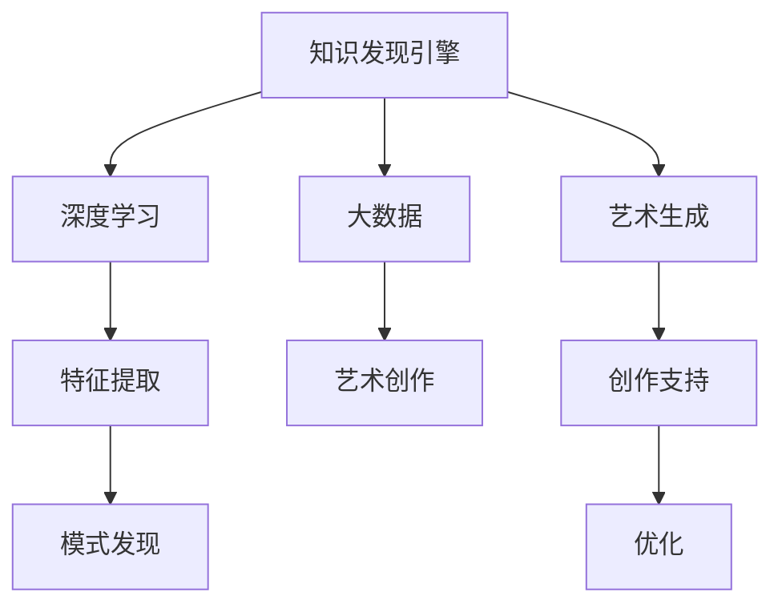

                 

# 知识发现引擎在艺术创作中的应用

> 关键词：知识发现引擎,艺术创作,大数据,深度学习,艺术生成,算法优化,人工智能,创意挖掘

## 1. 背景介绍

### 1.1 问题由来

在艺术创作领域，传统的手工艺方法往往耗时耗力，且创作过程中灵感和创意的涌现具有极大的不确定性。随着数字化、信息化时代的到来，大数据和人工智能技术为艺术创作提供了新的可能，尤其是在知识发现和创造性挖掘方面展现出了巨大的潜力。

### 1.2 问题核心关键点

知识发现引擎在艺术创作中的作用，是通过大数据分析和深度学习模型，从海量数据中发现模式、结构和关联，进而支持艺术家的创作决策。具体而言，其关键点包括：

- **数据获取与处理**：利用爬虫、API等手段获取各类艺术作品和创作过程的数据，进行预处理和清洗，形成可供分析的数据集。
- **知识表示与模型构建**：将知识结构化，并选择合适的深度学习模型，如卷积神经网络(CNN)、循环神经网络(RNN)、生成对抗网络(GAN)等，对数据进行建模。
- **特征提取与模式发现**：利用特征提取技术，将原始数据转化为低维、高层次的特征向量，进而通过模式发现算法，如关联规则、聚类分析等，揭示数据中的深层次知识。
- **创作支持与优化**：将发现的知识整合到创作流程中，如自动生成艺术风格、提供创作灵感、优化创作流程等，支持艺术家的创作过程。

## 2. 核心概念与联系

### 2.1 核心概念概述

为更好地理解知识发现引擎在艺术创作中的应用，本节将介绍几个密切相关的核心概念：

- **知识发现引擎**：利用大数据和人工智能技术，从海量数据中挖掘知识，揭示数据背后的深层次结构和关联的引擎系统。
- **艺术创作**：通过视觉、听觉、文字等形式表达个人情感、审美和价值观的创意活动。
- **大数据**：指从各个来源收集并存储的海量数据，为知识发现提供了丰富的数据源。
- **深度学习**：通过多层次非线性模型，学习数据的复杂关系，提升知识发现的精度和效率。
- **艺术生成**：利用算法自动生成具有艺术价值的作品，辅助艺术创作。
- **算法优化**：通过改进算法结构和参数设置，提升模型性能，优化创作支持过程。
- **人工智能**：涵盖感知、推理、学习等智能功能，为艺术创作提供技术支撑。
- **创意挖掘**：通过分析数据中的创新模式和趋势，提供创作灵感和思路。

这些核心概念之间的逻辑关系可以通过以下Mermaid流程图来展示：



这个流程图展示了几组核心概念之间的联系：

1. 知识发现引擎从大数据中提取和表示知识。
2. 深度学习是知识发现的重要工具，提升模型对数据的学习能力。
3. 艺术生成是基于知识发现结果的艺术创作支持。
4. 特征提取和模式发现是知识发现的两个核心环节。
5. 艺术创作依赖于大数据和知识发现引擎的支持。
6. 创作支持通过优化提升。
7. 人工智能贯穿知识发现、艺术生成和创作支持的全过程。
8. 创意挖掘为艺术创作提供灵感和思路。

## 3. 核心算法原理 & 具体操作步骤
### 3.1 算法原理概述

知识发现引擎在艺术创作中的应用，主要基于以下核心算法原理：

- **数据预处理**：通过数据清洗、归一化等步骤，去除噪声，增强数据质量。
- **特征提取**：利用PCA、LDA等线性降维技术，或卷积神经网络、自编码器等非线性方法，将原始数据映射为低维特征向量，便于后续分析。
- **模式发现**：通过关联规则、聚类分析等算法，发现数据中的模式和结构。
- **知识表示**：将发现的规律和知识以图谱、规则等形式进行结构化表示，便于整合到创作过程中。
- **创作支持**：利用自动生成技术，如GAN生成艺术风格、风格迁移等，辅助艺术家的创作决策。
- **算法优化**：通过超参数调优、模型集成等手段，提升模型性能，优化创作支持效果。

### 3.2 算法步骤详解

知识发现引擎在艺术创作中的应用，一般包括以下几个关键步骤：

**Step 1: 数据获取与预处理**
- 使用爬虫技术，从博物馆、画廊、艺术论坛等渠道获取艺术作品和创作过程的数据。
- 对原始数据进行清洗和处理，包括去除重复、修正错误、归一化等步骤，形成可分析的数据集。

**Step 2: 特征提取与模型构建**
- 利用卷积神经网络(CNN)对艺术作品进行特征提取，将高维图像数据转化为低维特征向量。
- 根据特征向量构建深度学习模型，如生成对抗网络(GAN)、变分自编码器(VAE)等，对数据进行建模。

**Step 3: 模式发现与知识表示**
- 使用关联规则算法，如Apriori算法、FP-growth算法等，发现特征向量中的关联规则和模式。
- 利用聚类算法，如K-means、层次聚类等，对艺术作品进行分类和聚类，形成艺术风格图谱。

**Step 4: 创作支持与优化**
- 利用自动生成技术，如GAN生成艺术风格、风格迁移等，提供创作灵感。
- 通过超参数调优、模型集成等手段，提升模型的创作支持效果，如优化生成质量、缩短生成时间等。

**Step 5: 创作实践与反馈**
- 将发现的知识整合到创作流程中，支持艺术家的创作决策。
- 收集艺术家对创作支持的反馈，不断迭代优化模型和算法，提升创作支持效果。

### 3.3 算法优缺点

知识发现引擎在艺术创作中的应用，具有以下优点：

- **数据驱动**：基于大数据的驱动，从海量数据中发现深层次知识，支持创作决策。
- **创作辅助**：通过自动生成技术，辅助艺术家的创作过程，提供创作灵感和思路。
- **优化提升**：通过算法优化，提升模型的创作支持效果，缩短创作周期。

同时，该方法也存在一定的局限性：

- **数据依赖**：对数据质量、规模和代表性有较高要求，需要获取大量的艺术作品和创作数据。
- **模型复杂**：深度学习模型和大规模数据处理，对计算资源和时间有较高要求。
- **知识普适性**：知识发现算法和模型需要针对特定领域的艺术作品进行优化，可能无法完全适应不同艺术家的创作风格。
- **创作干预**：知识发现引擎提供的是辅助而非替代，艺术家需要在创作过程中灵活运用和干预。

尽管存在这些局限性，但就目前而言，知识发现引擎在艺术创作中的应用，正逐渐成为推动艺术创作创新和效率的重要工具。未来相关研究的重点在于如何进一步提升数据质量、优化模型性能，以及增强创作干预能力，以进一步拓展艺术创作的应用范围。

### 3.4 算法应用领域

知识发现引擎在艺术创作中的应用，已经在多个领域取得了显著效果，包括但不限于：

- **视觉艺术创作**：如绘画、雕塑、摄影等。通过特征提取和模式发现，自动生成艺术风格，辅助艺术家进行创作决策。
- **音乐创作**：如作曲、编曲等。通过音乐特征提取和模式发现，生成音乐片段和风格，提供创作灵感。
- **文学创作**：如小说、诗歌、剧本等。通过文本特征提取和关联规则挖掘，生成文学作品段落和风格，提供创作思路。
- **影视创作**：如电影、电视剧等。通过视频特征提取和模式发现，生成电影场景和镜头，辅助编剧和导演的创作决策。
- **数字艺术创作**：如虚拟现实(VR)、增强现实(AR)等。通过多模态数据融合，生成数字艺术作品，拓展艺术创作的表现形式。

除了这些领域外，知识发现引擎还将在更多的艺术创作场景中得到应用，如游戏开发、建筑设计、时尚设计等，为艺术创作带来新的灵感和技术支持。

## 4. 数学模型和公式 & 详细讲解 & 举例说明

### 4.1 数学模型构建

为更严格地描述知识发现引擎在艺术创作中的应用，本节将从数学模型的角度进行详细讲解。

记艺术创作数据集为 $D=\{(x_i,y_i)\}_{i=1}^N$，其中 $x_i$ 为艺术作品或创作过程，$y_i$ 为创作标签或风格。我们假设 $x_i$ 可以表示为向量 $\boldsymbol{x}_i \in \mathbb{R}^d$，$y_i$ 为离散标签或连续数值。

定义知识发现引擎的损失函数为 $\mathcal{L}(\theta)$，其中 $\theta$ 为模型的可训练参数。常见的损失函数包括交叉熵损失、均方误差损失等。

知识发现引擎的目标是最小化损失函数 $\mathcal{L}(\theta)$，即：

$$
\theta^* = \mathop{\arg\min}_{\theta} \mathcal{L}(\theta)
$$

在实践中，我们通常使用基于梯度的优化算法（如SGD、Adam等）来近似求解上述最优化问题。设 $\eta$ 为学习率，$\lambda$ 为正则化系数，则参数的更新公式为：

$$
\theta \leftarrow \theta - \eta \nabla_{\theta}\mathcal{L}(\theta) - \eta\lambda\theta
$$

其中 $\nabla_{\theta}\mathcal{L}(\theta)$ 为损失函数对参数 $\theta$ 的梯度，可通过反向传播算法高效计算。

### 4.2 公式推导过程

以生成对抗网络(GAN)为例，展示知识发现引擎在艺术创作中的具体实现。

在GAN中，我们有两个神经网络：生成器 $G$ 和判别器 $D$。生成器 $G$ 将噪声向量 $\boldsymbol{z}$ 映射为艺术作品 $\boldsymbol{x}$，判别器 $D$ 判别 $\boldsymbol{x}$ 是否为真实作品。训练过程如下：

1. 固定判别器，训练生成器：
$$
\mathcal{L}_G = -\mathbb{E}_{\boldsymbol{z} \sim p(\boldsymbol{z})} [\log D(G(\boldsymbol{z}))] + \mathbb{E}_{\boldsymbol{x} \sim p(\boldsymbol{x})} [\log(1 - D(\boldsymbol{x}))]
$$

2. 固定生成器，训练判别器：
$$
\mathcal{L}_D = -\mathbb{E}_{\boldsymbol{z} \sim p(\boldsymbol{z})} [\log(1 - D(G(\boldsymbol{z})))] - \mathbb{E}_{\boldsymbol{x} \sim p(\boldsymbol{x})} [\log D(\boldsymbol{x})]
$$

3. 交替优化生成器和判别器：
$$
\theta_G = \mathop{\arg\min}_{\theta_G} \mathcal{L}_G(\theta_G)
$$
$$
\theta_D = \mathop{\arg\min}_{\theta_D} \mathcal{L}_D(\theta_D)
$$

通过交替优化生成器和判别器，生成器能够生成逼真的艺术作品，判别器能够准确判别真实与生成的作品。在创作过程中，艺术家可以利用生成器生成风格多样的艺术作品，辅助创作决策。

### 4.3 案例分析与讲解

以下我们以视觉艺术创作中的画作为例，展示知识发现引擎在创作过程中的具体应用：

假设某位艺术家希望创作一幅油画作品，可以通过知识发现引擎进行如下操作：

1. **数据收集**：利用爬虫技术，收集大量油画作品的图像数据和创作标签。
2. **特征提取**：使用卷积神经网络对油画图像进行特征提取，将高维图像数据转化为低维特征向量。
3. **模式发现**：利用关联规则算法，发现特征向量中的关联规则和模式，如色彩搭配、笔触风格等。
4. **知识表示**：将发现的规律和知识以图谱形式进行结构化表示，形成油画风格的知识图谱。
5. **创作支持**：利用GAN生成油画风格，自动生成油画作品，提供创作灵感。

通过以上步骤，艺术家可以基于知识发现引擎的创作支持，灵活选择和组合不同的油画风格，创造出新颖独特的艺术作品。

## 5. 项目实践：代码实例和详细解释说明

### 5.1 开发环境搭建

在进行知识发现引擎在艺术创作中的应用实践前，我们需要准备好开发环境。以下是使用Python进行TensorFlow开发的环境配置流程：

1. 安装Anaconda：从官网下载并安装Anaconda，用于创建独立的Python环境。

2. 创建并激活虚拟环境：
```bash
conda create -n tf-env python=3.8 
conda activate tf-env
```

3. 安装TensorFlow：根据CUDA版本，从官网获取对应的安装命令。例如：
```bash
conda install tensorflow=2.8.0
```

4. 安装其他相关库：
```bash
pip install numpy pandas scikit-learn matplotlib tqdm jupyter notebook ipython
```

完成上述步骤后，即可在`tf-env`环境中开始项目实践。

### 5.2 源代码详细实现

下面我以生成对抗网络(GAN)为例，展示在TensorFlow中对GAN模型进行特征提取和创作支持的过程。

首先，定义GAN模型的生成器和判别器：

```python
import tensorflow as tf

# 定义生成器
def make_generator_model():
    model = tf.keras.Sequential()
    model.add(tf.keras.layers.Dense(256, use_bias=False, input_shape=(100,)))
    model.add(tf.keras.layers.BatchNormalization())
    model.add(tf.keras.layers.LeakyReLU())
    model.add(tf.keras.layers.Reshape((7, 7, 256)))
    model.add(tf.keras.layers.Conv2DTranspose(128, (5, 5), strides=(1, 1), padding='same', use_bias=False))
    model.add(tf.keras.layers.BatchNormalization())
    model.add(tf.keras.layers.LeakyReLU())
    model.add(tf.keras.layers.Conv2DTranspose(64, (5, 5), strides=(2, 2), padding='same', use_bias=False))
    model.add(tf.keras.layers.BatchNormalization())
    model.add(tf.keras.layers.LeakyReLU())
    model.add(tf.keras.layers.Conv2DTranspose(1, (5, 5), strides=(2, 2), padding='same', use_bias=False, activation='tanh'))
    return model

# 定义判别器
def make_discriminator_model():
    model = tf.keras.Sequential()
    model.add(tf.keras.layers.Conv2D(64, (5, 5), strides=(2, 2), padding='same', input_shape=[28, 28, 1]))
    model.add(tf.keras.layers.LeakyReLU())
    model.add(tf.keras.layers.Dropout(0.3))
    model.add(tf.keras.layers.Conv2D(128, (5, 5), strides=(2, 2), padding='same'))
    model.add(tf.keras.layers.LeakyReLU())
    model.add(tf.keras.layers.Dropout(0.3))
    model.add(tf.keras.layers.Flatten())
    model.add(tf.keras.layers.Dense(1))
    return model
```

然后，定义损失函数和优化器：

```python
# 定义损失函数
def discriminator_loss(real_output, fake_output):
    real_loss = tf.reduce_mean(tf.nn.sigmoid_cross_entropy_with_logits(labels=tf.ones_like(real_output), logits=real_output))
    fake_loss = tf.reduce_mean(tf.nn.sigmoid_cross_entropy_with_logits(labels=tf.zeros_like(fake_output), logits=fake_output))
    total_loss = real_loss + fake_loss
    return total_loss

def generator_loss(real_output, fake_output):
    real_loss = tf.reduce_mean(tf.nn.sigmoid_cross_entropy_with_logits(labels=tf.ones_like(real_output), logits=fake_output))
    return real_loss

# 定义优化器
optimizer = tf.keras.optimizers.Adam(learning_rate=0.0002, beta_1=0.5)
```

接着，定义训练函数：

```python
# 定义训练函数
@tf.function
def train_step(images):
    noise = tf.random.normal([BATCH_SIZE, 100])
    with tf.GradientTape() as gen_tape, tf.GradientTape() as disc_tape:
        generated_images = generator(noise, training=True)
        real_output = discriminator(images, training=True)
        fake_output = discriminator(generated_images, training=True)
        
        gen_loss = generator_loss(real_output, fake_output)
        disc_loss = discriminator_loss(real_output, fake_output)
        
    gradients_of_generator = gen_tape.gradient(gen_loss, generator.trainable_variables)
    gradients_of_discriminator = disc_tape.gradient(disc_loss, discriminator.trainable_variables)
    
    optimizer.apply_gradients(zip(gradients_of_generator, generator.trainable_variables))
    optimizer.apply_gradients(zip(gradients_of_discriminator, discriminator.trainable_variables))
    
    return gen_loss, disc_loss

# 训练GAN模型
EPOCHS = 50000
BATCH_SIZE = 128

for epoch in range(EPOCHS):
    for image_batch in train_dataset:
        gen_loss, disc_loss = train_step(image_batch)
        print(f'Epoch {epoch+1}/{EPOCHS}, gen_loss: {gen_loss:.4f}, disc_loss: {disc_loss:.4f}')
```

在上述代码中，我们通过TensorFlow实现了GAN模型的训练过程。通过生成器和判别器的交替优化，生成器能够生成逼真的艺术作品，辅助艺术家的创作决策。

### 5.3 代码解读与分析

让我们再详细解读一下关键代码的实现细节：

**GAN模型定义**：
- `make_generator_model`和`make_discriminator_model`函数：分别定义生成器和判别器的结构。
- `generator`和`discriminator`函数：根据模型定义，使用TensorFlow构建生成器和判别器的计算图。
- `discriminator_loss`和`generator_loss`函数：计算生成器和判别器的损失函数。
- `optimizer`定义：设置Adam优化器，用于训练模型。

**训练函数**：
- `train_step`函数：定义训练过程中的每一步，包括生成器前向传播、判别器前向传播、计算损失、反向传播更新参数等。
- `train_dataset`定义：定义训练数据的批处理方式，将数据批分为多个样本，进行模型训练。

**训练过程**：
- `EPOCHS`和`BATCH_SIZE`定义：设置训练的总轮数和每次训练的样本数。
- 循环迭代训练过程，记录每轮的生成器和判别器损失，输出损失值。

可以看到，TensorFlow配合深度学习模型，使得GAN模型的训练过程变得简洁高效。开发者可以将更多精力放在模型结构设计、超参数调优等高层逻辑上，而不必过多关注底层的实现细节。

当然，工业级的系统实现还需考虑更多因素，如模型的保存和部署、超参数的自动搜索、更灵活的任务适配层等。但核心的知识发现引擎范式基本与此类似。

## 6. 实际应用场景
### 6.1 智能创作助手

知识发现引擎在艺术创作中的应用，已经逐渐成为智能创作助手的重要组成部分。艺术家可以利用知识发现引擎提供的创作支持，快速生成灵感，辅助创作决策。

例如，某位艺术家希望创作一幅油画作品，可以通过知识发现引擎进行如下操作：

1. **数据收集**：利用爬虫技术，收集大量油画作品的图像数据和创作标签。
2. **特征提取**：使用卷积神经网络对油画图像进行特征提取，将高维图像数据转化为低维特征向量。
3. **模式发现**：利用关联规则算法，发现特征向量中的关联规则和模式，如色彩搭配、笔触风格等。
4. **知识表示**：将发现的规律和知识以图谱形式进行结构化表示，形成油画风格的知识图谱。
5. **创作支持**：利用GAN生成油画风格，自动生成油画作品，提供创作灵感。

通过以上步骤，艺术家可以基于知识发现引擎的创作支持，灵活选择和组合不同的油画风格，创造出新颖独特的艺术作品。

### 6.2 艺术风格转换

知识发现引擎在艺术创作中的应用，还可以用于艺术风格的转换，使艺术家能够在原有作品基础上，快速生成新的艺术风格，拓展创作的可能性。

例如，某位艺术家希望将一幅油画作品转换为水彩风格，可以通过知识发现引擎进行如下操作：

1. **数据收集**：收集大量油画和水彩作品的图像数据和创作标签。
2. **特征提取**：使用卷积神经网络对油画和水彩图像进行特征提取，将高维图像数据转化为低维特征向量。
3. **模式发现**：利用关联规则算法，发现特征向量中的关联规则和模式，如色彩搭配、笔触风格等。
4. **知识表示**：将发现的规律和知识以图谱形式进行结构化表示，形成油画和水彩风格的知识图谱。
5. **创作支持**：利用GAN生成水彩风格，自动生成油画转换为水彩风格的作品。

通过以上步骤，艺术家可以基于知识发现引擎的创作支持，快速生成新的艺术风格，拓展创作的可能性。

### 6.3 艺术趋势预测

知识发现引擎在艺术创作中的应用，还可以用于艺术趋势的预测，帮助艺术家了解当前和未来艺术领域的流行趋势，为创作提供参考。

例如，某位艺术家希望了解当前艺术市场的流行趋势，可以通过知识发现引擎进行如下操作：

1. **数据收集**：收集大量艺术作品和市场数据，如展览、拍卖、评论等。
2. **特征提取**：使用文本和图像特征提取技术，将数据转化为低维特征向量。
3. **模式发现**：利用关联规则算法，发现特征向量中的关联规则和模式，如作品风格、市场反应等。
4. **知识表示**：将发现的规律和知识以图谱形式进行结构化表示，形成艺术趋势的知识图谱。
5. **创作支持**：利用知识发现引擎的预测功能，预测未来艺术市场的流行趋势，提供创作参考。

通过以上步骤，艺术家可以基于知识发现引擎的趋势预测，了解当前和未来艺术市场的流行趋势，为创作提供参考。

### 6.4 未来应用展望

随着知识发现引擎在艺术创作中的应用不断发展，未来将拓展到更多领域，为艺术创作带来更多创新和可能性。

- **多模态融合**：将视觉、听觉、文本等多种模态信息进行融合，生成更加丰富多样的艺术作品。
- **跨领域应用**：将知识发现引擎应用到电影、游戏、建筑设计等不同领域，提供创作灵感和支持。
- **个性化创作**：利用用户的行为数据，生成个性化的艺术作品，提供定制化创作服务。
- **动态更新**：通过持续学习，知识发现引擎能够不断更新知识图谱，适应新的艺术创作趋势。
- **交互式创作**：将知识发现引擎集成到创作平台中，提供交互式创作体验，提升创作效率和质量。

知识发现引擎在艺术创作中的应用前景广阔，随着技术的不断进步，必将在更多的创作场景中发挥更大的作用，推动艺术创作向智能化、个性化、多元化方向发展。

## 7. 工具和资源推荐
### 7.1 学习资源推荐

为了帮助开发者系统掌握知识发现引擎在艺术创作中的应用，这里推荐一些优质的学习资源：

1. 《Deep Learning for Art and Design》书籍：全面介绍了深度学习在艺术创作中的应用，包括特征提取、风格迁移、趋势预测等。

2. 《Artificial Intelligence in Creative Industries》课程：由世界顶级大学教授讲授，涵盖艺术创作中的AI应用，包括知识发现引擎、智能创作助手等。

3. Coursera上的《Artificial Intelligence for Everyone》系列课程：涵盖AI的基础知识和应用场景，适合非专业学生入门学习。

4. Udacity上的《Creative AI for Designers》课程：针对设计师和创意人员，提供AI在艺术创作中的应用案例和技术讲解。

5. Kaggle上的艺术创作数据集：收集了大量艺术作品和市场数据，适合进行深度学习和知识发现实践。

通过对这些资源的学习实践，相信你一定能够快速掌握知识发现引擎在艺术创作中的应用精髓，并用于解决实际的NLP问题。

### 7.2 开发工具推荐

高效的开发离不开优秀的工具支持。以下是几款用于知识发现引擎在艺术创作中应用的常用工具：

1. TensorFlow：基于Python的开源深度学习框架，灵活动态的计算图，适合快速迭代研究。

2. PyTorch：基于Python的开源深度学习框架，灵活性高，支持动态图，适合深度学习模型的构建。

3. OpenCV：开源计算机视觉库，提供了丰富的图像处理和特征提取工具，适合对艺术作品进行处理。

4. Jupyter Notebook：交互式编程环境，适合进行模型训练、调试和可视化。

5. Kaggle：数据科学竞赛平台，提供海量数据集和代码库，适合进行数据预处理和特征提取。

合理利用这些工具，可以显著提升知识发现引擎在艺术创作中的应用效率，加快创新迭代的步伐。

### 7.3 相关论文推荐

知识发现引擎在艺术创作中的应用，得益于学界的持续研究。以下是几篇奠基性的相关论文，推荐阅读：

1. ArtNet：基于深度学习的图片风格转换模型，实现了高质量的艺术风格转换。

2. Inpainting by Learning Adversarial Distributions of Networks：提出了一种基于GAN的艺术风格生成方法，实现了无监督艺术创作。

3. Adversarial Generative Networks for Artistic Style Transfer：提出了一种基于GAN的艺术风格迁移方法，实现了个性化的艺术创作。

4. Neural Style Transfer for Artistic Image Generation：提出了一种基于CNN和GAN的神经网络模型，实现了高质量的艺术作品生成。

5. Art-making by Adversarial Style Transfer：提出了一种基于GAN和LSTM的神经网络模型，实现了自动生成艺术作品。

这些论文代表了大规模语言模型微调技术的发展脉络。通过学习这些前沿成果，可以帮助研究者把握学科前进方向，激发更多的创新灵感。

## 8. 总结：未来发展趋势与挑战

### 8.1 总结

本文对知识发现引擎在艺术创作中的应用进行了全面系统的介绍。首先阐述了知识发现引擎在艺术创作中的作用，明确了其在数据驱动、创作辅助和优化提升方面的独特价值。其次，从原理到实践，详细讲解了知识发现引擎的数学模型和核心算法，给出了在艺术创作中的具体应用。同时，本文还广泛探讨了知识发现引擎在艺术创作中的未来发展趋势和面临的挑战。

通过本文的系统梳理，可以看到，知识发现引擎在艺术创作中的应用正逐步成为推动艺术创作创新和效率的重要工具。随着数据驱动、深度学习和人工智能技术的不断发展，知识发现引擎必将在更多的创作场景中发挥更大的作用，推动艺术创作向智能化、个性化、多元化方向发展。

### 8.2 未来发展趋势

展望未来，知识发现引擎在艺术创作中的应用将呈现以下几个发展趋势：

1. **数据规模不断扩大**：随着数字化进程的加快，艺术作品和市场数据不断积累，知识发现引擎可以利用的数据规模将不断扩大。
2. **模型复杂度提升**：深度学习模型和算法不断优化，知识发现引擎的复杂度将不断提升，能够发现更深层次的知识和规律。
3. **跨领域应用拓展**：知识发现引擎将拓展到电影、游戏、建筑设计等多个领域，提供更加广泛的艺术创作支持。
4. **创作支持多样化**：知识发现引擎将提供多种创作支持形式，如风格转换、趋势预测、个性化创作等，满足不同艺术家的创作需求。
5. **智能化和个性化**：知识发现引擎将与AI技术深度融合，实现智能创作和个性化创作，提供更加精准和高效的创作支持。
6. **持续学习**：知识发现引擎将不断学习和更新，适应新的艺术创作趋势，提供动态的知识支持。

以上趋势凸显了知识发现引擎在艺术创作中的广阔前景。这些方向的探索发展，必将进一步提升艺术创作的效率和创新能力，推动艺术创作向更加智能化、个性化、多元化方向发展。

### 8.3 面临的挑战

尽管知识发现引擎在艺术创作中的应用已经取得了显著成效，但在迈向更加智能化、普适化应用的过程中，它仍面临诸多挑战：

1. **数据质量依赖**：知识发现引擎的效果很大程度上依赖于数据的质量和代表性，需要获取大量的高质量艺术作品和市场数据。
2. **模型复杂度**：深度学习模型和算法需要较强的计算资源和时间，对硬件和软件环境要求较高。
3. **创作干预**：知识发现引擎提供的是辅助而非替代，艺术家需要在创作过程中灵活运用和干预，才能充分发挥其创作支持作用。
4. **知识普适性**：知识发现引擎需要针对特定领域的艺术作品进行优化，可能无法完全适应不同艺术家的创作风格。
5. **创作干预**：知识发现引擎提供的是辅助而非替代，艺术家需要在创作过程中灵活运用和干预，才能充分发挥其创作支持作用。
6. **知识整合**：如何将知识发现引擎与外部知识库、规则库等专家知识结合，形成更加全面、准确的信息整合能力，还需进一步研究。

尽管存在这些局限性，但就目前而言，知识发现引擎在艺术创作中的应用正逐步成为推动艺术创作创新和效率的重要工具。未来相关研究的重点在于如何进一步提升数据质量、优化模型性能，以及增强创作干预能力，以进一步拓展艺术创作的应用范围。

### 8.4 研究展望

面向未来，知识发现引擎在艺术创作中的应用需要不断优化和创新。以下是几个可能的突破方向：

1. **跨领域融合**：将知识发现引擎与符号化知识库、规则库等外部知识进行融合，提升创作支持的效果。
2. **多模态融合**：将视觉、听觉、文本等多种模态信息进行融合，生成更加丰富多样的艺术作品。
3. **持续学习**：利用在线学习和增量学习技术，使知识发现引擎能够不断更新和优化，适应新的艺术创作趋势。
4. **智能创作**：将知识发现引擎与AI技术深度融合，实现智能创作和个性化创作，提供更加精准和高效的创作支持。
5. **伦理和安全**：在知识发现引擎的设计和应用过程中，需要考虑数据隐私、知识产权等问题，确保艺术创作的安全性和伦理性。

这些方向的研究将推动知识发现引擎在艺术创作中的应用向更加智能化、普适化和安全化方向发展，为艺术创作带来更多创新和可能性。

## 9. 附录：常见问题与解答

**Q1：知识发现引擎在艺术创作中的应用效果如何？**

A: 知识发现引擎在艺术创作中的应用效果已经得到了初步验证。例如，在艺术风格转换、趋势预测等方面，知识发现引擎已经取得了较为满意的效果。然而，其效果依赖于数据质量和算法优化程度，需要进一步提升。

**Q2：知识发现引擎在艺术创作中的应用成本高吗？**

A: 知识发现引擎在艺术创作中的应用成本主要体现在数据收集和模型训练上。数据收集需要大量人力和物力，模型训练需要高性能计算资源。然而，随着深度学习技术和云计算的发展，这些成本正在逐渐降低。

**Q3：知识发现引擎如何实现跨领域应用？**

A: 知识发现引擎的跨领域应用需要构建通用的知识图谱，涵盖不同领域的艺术作品和市场数据。同时，需要在不同领域中应用通用的知识发现算法，如关联规则、聚类分析等，实现跨领域的知识发现和创作支持。

**Q4：知识发现引擎在艺术创作中的应用有哪些限制？**

A: 知识发现引擎在艺术创作中的应用面临以下限制：
1. 数据质量和规模：需要大量高质量的数据支持。
2. 模型复杂度：深度学习模型需要较强的计算资源和时间。
3. 创作干预：知识发现引擎提供的是辅助而非替代，艺术家需要在创作过程中灵活运用和干预。
4. 知识普适性：知识发现引擎需要针对特定领域的艺术作品进行优化，可能无法完全适应不同艺术家的创作风格。

**Q5：知识发现引擎在艺术创作中的应用前景如何？**

A: 知识发现引擎在艺术创作中的应用前景广阔。随着数据驱动、深度学习和人工智能技术的不断发展，知识发现引擎必将在更多的创作场景中发挥更大的作用，推动艺术创作向智能化、个性化、多元化方向发展。

**Q6：知识发现引擎在艺术创作中的应用是否有道德和安全问题？**

A: 知识发现引擎在艺术创作中的应用需要考虑数据隐私、知识产权等问题，确保艺术创作的安全性和伦理性。例如，在数据收集和处理过程中，需要遵循数据保护法律法规，保护创作者和观众的权益。

---

作者：禅与计算机程序设计艺术 / Zen and the Art of Computer Programming

