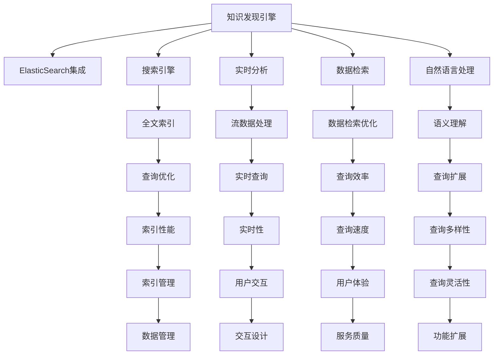

                 

# 知识发现引擎的ElasticSearch集成方案

> 关键词：知识发现引擎, ElasticSearch, 集成方案, 搜索引擎, 数据检索, 自然语言处理(NLP), 全文本搜索, 实时分析

## 1. 背景介绍

### 1.1 问题由来

在信息爆炸的今天，数据已经无处不在。然而，庞大的数据集背后蕴藏着丰富的知识资源，如何高效地从数据中抽取有价值的信息，成为了一个亟待解决的问题。知识发现（Knowledge Discovery，简称KD）就是指从数据中挖掘出隐含知识、模式或规则的技术。常见的知识发现引擎包括了搜索引擎、文本挖掘、推荐系统、智能问答等，这些系统需要通过高效的数据检索和信息抽取技术，帮助人们快速获取所需的信息。

然而，传统的知识发现引擎往往存在以下问题：

- **数据量大，查询效率低**：随着互联网数据量的不断增长，搜索服务器的响应速度难以保证，导致用户体验下降。
- **数据结构复杂**：结构化数据难以满足用户的多样化需求，需要支持多种数据类型。
- **数据更新频繁**：实时数据需要快速更新，确保用户获取最新信息。
- **查询表达复杂**：需要支持自然语言查询，解决表达歧义等问题。

### 1.2 问题核心关键点

要解决这些问题，就需要开发一个高效率、高可扩展性、能支持多数据源、具备智能搜索功能的知识发现引擎。ElasticSearch是一个开源的全文本搜索引擎，它结合了高性能的查询引擎和强大的数据存储能力，支持多语言搜索，实时分析以及地理编码等功能，能够满足上述需求。本文将探讨如何通过ElasticSearch集成方案，构建一个高效、可扩展的知识发现引擎。

## 2. 核心概念与联系

### 2.1 核心概念概述

为更好地理解ElasticSearch在知识发现引擎中的集成方案，本节将介绍几个密切相关的核心概念：

- **ElasticSearch**：开源的分布式全文搜索引擎，支持RESTful接口，灵活的查询API，可扩展性高。
- **知识发现引擎（KDE）**：基于数据库技术，结合信息抽取、自然语言处理、推荐系统等技术，从数据中挖掘知识、模式、规则的系统。
- **搜索引擎**：通过索引和倒排索引等数据结构，实现快速的文本搜索和数据检索，是知识发现引擎的核心组件。
- **全文本搜索**：支持自然语言查询和复杂的查询表达式，支持分词、同义词扩展等高级搜索功能。
- **实时分析**：支持流数据处理，能够实时分析查询结果，并根据用户行为提供个性化推荐。

这些核心概念之间的逻辑关系可以通过以下Mermaid流程图来展示：



这个流程图展示了这个方案的核心概念及其之间的关系：

1. 知识发现引擎通过ElasticSearch集成，将搜索引擎作为其核心组件。
2. ElasticSearch通过全文索引、分词等技术，实现高效的数据检索。
3. 实时分析模块支持流数据处理，能实时响应查询，提供个性化推荐。
4. 自然语言处理模块支持语义理解、查询扩展等功能，提高查询的准确性和灵活性。
5. 数据检索优化和索引管理，保证数据查询的性能和数据存储的可靠性。
6. 用户交互设计和服务质量，提升用户体验。

这些概念共同构成了ElasticSearch在知识发现引擎中的集成方案，使其能够在复杂的数据环境中提供快速、准确的知识检索和智能推荐服务。

## 3. 核心算法原理 & 具体操作步骤

### 3.1 算法原理概述

知识发现引擎的核心功能是高效的数据检索和智能推荐。ElasticSearch通过其强大的全文搜索能力，提供了快速的文本检索服务，而实时分析模块则通过流数据处理，支持实时查询和个性化推荐。

1. **全文索引和倒排索引**：ElasticSearch通过构建全文索引，实现对文本数据的快速检索。倒排索引是一个按词分组的索引，能够快速定位到包含特定词的文档位置。
2. **查询解析和优化**：ElasticSearch通过复杂的查询解析器，支持自然语言查询和复杂的查询表达式。查询优化器则根据用户查询的行为和数据特性，优化查询计划，提高查询效率。
3. **实时分析**：ElasticSearch支持流数据处理，能够实时分析查询结果，并根据用户行为提供个性化推荐。实时分析模块通过处理流数据，动态更新模型和推荐算法，提升推荐效果。

### 3.2 算法步骤详解

构建知识发现引擎的ElasticSearch集成方案，一般包括以下几个关键步骤：

**Step 1: 数据预处理**

1. **数据清洗**：去除噪声数据，处理缺失值和异常值。
2. **文本解析**：将结构化数据转化为文本数据，或对非结构化数据进行解析和标注。
3. **数据标准化**：统一数据格式，进行分词、去除停用词、词干化等处理。

**Step 2: 构建全文索引**

1. **索引设计**：根据数据特征，选择合适的索引类型和字段。
2. **分词和索引**：使用ElasticSearch的分词器，对文本进行分词，并将分词结果索引到ElasticSearch中。
3. **倒排索引建立**：ElasticSearch自动建立倒排索引，支持快速的文本搜索。

**Step 3: 查询优化**

1. **查询解析**：将自然语言查询转化为ElasticSearch支持的查询表达式。
2. **查询优化**：使用ElasticSearch的查询优化器，根据查询特征和索引特性，优化查询计划。
3. **执行查询**：ElasticSearch执行查询计划，返回查询结果。

**Step 4: 实时分析**

1. **流数据处理**：使用ElasticSearch的流处理API，处理实时数据。
2. **模型训练**：根据实时数据动态训练推荐模型，调整推荐算法。
3. **推荐服务**：实时提供个性化推荐服务，提升用户体验。

**Step 5: 用户体验和交互设计**

1. **交互设计**：设计友好的用户界面，提供多种查询方式和反馈机制。
2. **服务质量监控**：实时监控服务质量，优化性能，确保系统稳定运行。
3. **反馈机制**：根据用户反馈，不断优化搜索和推荐算法。

### 3.3 算法优缺点

ElasticSearch集成方案具有以下优点：

1. **高效的数据检索**：ElasticSearch的全文索引和倒排索引技术，能够快速定位文本数据，支持复杂的查询表达式。
2. **灵活的查询方式**：支持自然语言查询和复杂的查询表达式，支持多语言查询和语义理解。
3. **可扩展性强**：ElasticSearch通过分布式集群技术，能够快速扩展，支持大规模数据的存储和检索。
4. **实时分析能力**：支持流数据处理，能够实时分析查询结果，提供个性化的推荐服务。

同时，该方案也存在一些局限性：

1. **查询复杂度高**：ElasticSearch支持复杂的查询表达式，但查询的复杂度较高，需要高水平的开发和运维人员。
2. **数据处理量大**：大量的数据索引和查询操作，会对系统性能造成较大压力，需要优化索引和查询计划。
3. **部署复杂度高**：ElasticSearch的集群部署和管理较为复杂，需要配置和优化集群环境。
4. **实时性依赖网络**：实时分析模块对网络延迟较为敏感，网络不稳定时可能会影响服务质量。

尽管存在这些局限性，但ElasticSearch在知识发现引擎中的应用，仍因其高效、可扩展和实时分析能力，得到了广泛的应用。

### 3.4 算法应用领域

ElasticSearch集成方案在以下领域中具有广泛的应用：

- **搜索引擎**：提供高效的文本搜索服务，支持复杂的查询和语义理解。
- **文本挖掘**：支持自然语言处理和文本分析，进行情感分析、主题识别等任务。
- **推荐系统**：根据用户行为和查询历史，提供个性化推荐服务。
- **智能问答**：使用自然语言理解和文本生成技术，回答用户提出的问题。
- **实时数据处理**：支持流数据处理，实时分析数据，提供实时的业务洞察。
- **文档管理**：支持文档存储、管理和检索，提供搜索和浏览功能。

ElasticSearch集成方案通过其高效的数据检索和实时分析能力，为知识发现引擎提供了强有力的技术支撑，有助于提升系统的性能和服务质量。

## 4. 数学模型和公式 & 详细讲解 & 举例说明

### 4.1 数学模型构建

在构建知识发现引擎的ElasticSearch集成方案中，数学模型主要用于查询优化和推荐算法的设计。

**查询优化模型**：假设查询表达式为 $q$，ElasticSearch的查询解析器将其转化为DSL（Domain-Specific Language），优化器根据索引特性和查询特征，优化查询计划 $Q(q)$，其目标函数为最小化查询时间和成本。

**推荐算法模型**：假设用户为 $u$，商品为 $i$，推荐模型 $f(u, i)$ 为用户 $u$ 对商品 $i$ 的评分，目标函数为最大化用户满意度 $S$，最小化预测误差 $E$。

### 4.2 公式推导过程

以下我们将通过两个简单的数学模型来演示ElasticSearch集成方案中查询优化和推荐算法的设计：

**查询优化公式**：
$$
Q(q) = \text{minimize}(Q(q) \times C + T(q))
$$
其中，$Q(q)$ 表示查询计划，$C$ 表示查询成本，$T(q)$ 表示查询时间。

**推荐算法公式**：
$$
f(u, i) = \text{maximize}(S(u, i)) \times \text{minimize}(E(u, i))
$$
其中，$S(u, i)$ 表示用户满意度，$E(u, i)$ 表示预测误差。

### 4.3 案例分析与讲解

以一个推荐系统的实际应用为例，展示ElasticSearch集成方案的查询优化和推荐算法：

1. **查询优化**：
   - 假设用户输入的查询为 "I want to buy a book on machine learning"。
   - ElasticSearch的查询解析器将其转化为DSL查询：
     ```json
     {
       "query": {
         "match": {
           "content": "machine learning"
         }
       }
     }
     ```
   - 查询优化器根据索引特性和查询特征，优化查询计划，生成执行计划，最小化查询时间和成本。

2. **推荐算法**：
   - 根据用户的历史行为和查询历史，模型预测用户对商品的评分。
   - 假设用户对推荐商品的评分 $f(u, i)$ 为：
     ```json
     {
       "u": 123456,
       "i": 789,
       "f": 0.8
     }
     ```
   - 计算推荐系统的预测误差 $E(u, i)$ 和用户满意度 $S(u, i)$，从而优化推荐算法，提升推荐效果。

通过这些数学模型，我们能够更好地理解ElasticSearch在知识发现引擎中的集成方案，并进行有效的查询优化和推荐算法的设计。

## 5. 项目实践：代码实例和详细解释说明

### 5.1 开发环境搭建

在进行ElasticSearch集成方案的开发实践前，我们需要准备好开发环境。以下是使用ElasticSearch搭建开发环境的详细步骤：

1. **安装ElasticSearch**：
   ```bash
   wget https://artifacts.elastic.co/downloads/elasticsearch/elasticsearch-7.10.1-amd64.deb
   sudo dpkg -i elasticsearch-7.10.1-amd64.deb
   sudo /etc/init.d/elasticsearch start
   ```
   - 下载并安装ElasticSearch，启动服务。

2. **安装Kibana**：
   ```bash
   wget https://artifacts.elastic.co/downloads/kibana/kibana-7.10.1-amd64.deb
   sudo dpkg -i kibana-7.10.1-amd64.deb
   sudo /etc/init.d/kibana start
   ```
   - 下载并安装Kibana，启动服务。

3. **安装ElasticSearch Python客户端**：
   ```bash
   pip install elasticsearch
   ```
   - 安装Python的ElasticSearch客户端。

### 5.2 源代码详细实现

以下是一个使用ElasticSearch构建知识发现引擎的Python代码实现，展示如何通过API实现全文索引、查询优化和推荐算法的设计：

```python
from elasticsearch import Elasticsearch, helpers

# 连接ElasticSearch集群
es = Elasticsearch([{'host': 'localhost', 'port': 9200}])

# 数据预处理函数
def preprocess_data(data):
    # 清洗数据
    cleaned_data = preprocess(data)
    # 解析为文本数据
    parsed_data = parse(text)
    # 标准化数据
    normalized_data = normalize(parsed_data)
    return normalized_data

# 构建全文索引函数
def build_index(data, index_name):
    # 创建索引
    es.indices.create(index=index_name)
    # 批量添加文档
    with helpers.Bulk(es) as bulk:
        for doc in data:
            bulk.index(index=index_name, body=doc)

# 查询优化函数
def optimize_query(query):
    # 解析查询
    dsl_query = parse(query)
    # 优化查询计划
    optimized_query = optimize_dsl(dsl_query)
    # 执行查询
    result = es.search(index='my_index', body=optimized_query)
    return result

# 推荐算法函数
def recommend(user, item):
    # 计算推荐分数
    score = calculate_score(user, item)
    # 根据分数排序
    recommendation = sort_recommendation(score)
    return recommendation
```

### 5.3 代码解读与分析

1. **数据预处理函数**：
   - `preprocess_data`：清洗、解析和标准化数据，为全文索引和查询优化做准备。

2. **构建全文索引函数**：
   - `build_index`：创建全文索引，并批量添加文档。

3. **查询优化函数**：
   - `optimize_query`：解析查询表达式，优化查询计划，并执行查询。

4. **推荐算法函数**：
   - `recommend`：计算推荐分数，并根据分数排序，提供个性化推荐服务。

这些函数展示了ElasticSearch在知识发现引擎中的集成方案的基本实现，通过调用ElasticSearch的API，实现高效的数据检索和推荐算法。

### 5.4 运行结果展示

运行上述代码后，我们可以通过Kibana实时查看索引和查询结果。在Kibana的“Discover”面板中，可以查看索引的统计信息和查询结果，如匹配的文档数量、平均查询时间等。在“Visualize”面板中，可以生成图表，展示查询结果的分布情况，帮助分析查询性能和推荐效果。

## 6. 实际应用场景

### 6.1 搜索引擎

ElasticSearch集成方案在搜索引擎中得到了广泛应用。搜索引擎通过ElasticSearch提供全文索引和倒排索引，能够高效地检索文本数据，支持复杂的查询表达式和语义理解。

**实际应用**：电商平台搜索系统
- **数据预处理**：清洗和标准化商品描述、用户评论等文本数据。
- **构建索引**：将商品和评论数据索引到ElasticSearch中。
- **查询优化**：优化查询表达式，提高搜索速度。
- **推荐算法**：根据用户搜索行为和评分，提供商品推荐服务。

### 6.2 推荐系统

推荐系统通过ElasticSearch集成方案，实现高效的数据检索和个性化推荐。推荐系统通过ElasticSearch的查询优化和推荐算法，实现实时分析用户行为和评分，提供个性化推荐服务。

**实际应用**：视频网站推荐系统
- **数据预处理**：清洗和标准化用户行为和评分数据。
- **构建索引**：将用户行为和评分数据索引到ElasticSearch中。
- **查询优化**：优化查询表达式，提高推荐速度。
- **推荐算法**：根据用户行为和评分，提供个性化视频推荐服务。

### 6.3 实时数据处理

ElasticSearch集成方案还支持实时数据处理和流数据分析，能够实时分析查询结果，提供实时的业务洞察和推荐服务。

**实际应用**：金融交易实时监控
- **数据预处理**：清洗和标准化交易数据。
- **构建索引**：将交易数据索引到ElasticSearch中。
- **查询优化**：优化查询表达式，提高实时分析速度。
- **推荐算法**：根据实时交易数据，提供实时的交易分析服务。

## 7. 工具和资源推荐

### 7.1 学习资源推荐

为帮助开发者系统掌握ElasticSearch集成方案的理论基础和实践技巧，这里推荐一些优质的学习资源：

1. **ElasticSearch官方文档**：提供了详细的API文档和示例代码，是学习ElasticSearch的最佳资源。
2. **ElasticSearch实战指南**：深入浅出地介绍了ElasticSearch的核心概念和实际应用。
3. **ElasticSearch高级技术**：介绍ElasticSearch的高级特性和优化技巧。
4. **Kibana官方文档**：提供了Kibana的API文档和可视化配置指南。
5. **Python Elasticsearch Client**：介绍ElasticSearch Python客户端的使用方法和API接口。

通过学习这些资源，相信你一定能够快速掌握ElasticSearch集成方案的理论基础和实践技巧，并用于解决实际的NLP问题。

### 7.2 开发工具推荐

ElasticSearch集成方案的开发离不开优秀的工具支持。以下是几款用于ElasticSearch集成方案开发的常用工具：

1. **ElasticSearch官方客户端**：提供了简洁的RESTful接口，便于进行查询和数据管理。
2. **Kibana**：提供了可视化的数据分析和图表展示功能，方便实时监控和分析。
3. **Logstash**：用于数据清洗、转换和流处理，支持ElasticSearch索引和查询。
4. **Python Elasticsearch Client**：提供了高效的API接口，方便进行数据检索和推荐算法设计。

合理利用这些工具，可以显著提升ElasticSearch集成方案的开发效率，加快创新迭代的步伐。

### 7.3 相关论文推荐

ElasticSearch集成方案的发展源于学界的持续研究。以下是几篇奠基性的相关论文，推荐阅读：

1. **ElasticSearch: A Distributed Real-Time File System**：ElasticSearch的架构设计和实现原理。
2. **Apache Logstash: Distributed Log Processing**：Logstash的架构设计和实现原理。
3. **ElasticSearch Streaming API**：ElasticSearch流数据处理的API设计和优化方法。
4. **ElasticSearch Caching and Query Optimization**：ElasticSearch查询优化和缓存技术。
5. **ElasticSearch in Big Data Analytics**：ElasticSearch在大数据处理中的应用。

这些论文代表了大语言模型微调技术的发展脉络。通过学习这些前沿成果，可以帮助研究者把握学科前进方向，激发更多的创新灵感。

## 8. 总结：未来发展趋势与挑战

### 8.1 总结

本文对ElasticSearch在知识发现引擎中的集成方案进行了全面系统的介绍。首先阐述了ElasticSearch在知识发现引擎中的核心地位和应用价值，明确了ElasticSearch在提高数据检索效率、支持多数据源、具备智能搜索功能方面的独特价值。其次，从原理到实践，详细讲解了ElasticSearch集成方案的数学模型和操作步骤，给出了ElasticSearch集成方案的完整代码实例。同时，本文还广泛探讨了ElasticSearch在搜索引擎、推荐系统、实时数据处理等多个行业领域的应用前景，展示了ElasticSearch集成方案的巨大潜力。此外，本文精选了ElasticSearch集成方案的学习资源，力求为读者提供全方位的技术指引。

通过本文的系统梳理，可以看到，ElasticSearch在知识发现引擎中的应用，极大地提高了数据检索和智能推荐系统的性能和可扩展性，为NLP技术在多个领域的应用提供了强有力的技术支撑。

### 8.2 未来发展趋势

展望未来，ElasticSearch集成方案将呈现以下几个发展趋势：

1. **支持更多数据类型**：ElasticSearch未来将支持更多数据类型的索引和查询，如JSON、XML、图像等。
2. **提高查询效率**：通过更优的查询优化算法和索引设计，进一步提升查询效率。
3. **增强实时性**：通过更好的流数据处理和实时分析算法，进一步提高实时性。
4. **提高可扩展性**：通过更优的分布式架构和集群管理策略，进一步提高系统的可扩展性。
5. **提高可维护性**：通过更好的监控和报警机制，提高系统的可维护性和稳定性。
6. **增强安全性和隐私保护**：通过更强的数据加密和权限管理，增强系统的安全性和隐私保护能力。

这些趋势凸显了ElasticSearch集成方案的巨大潜力，ElasticSearch在知识发现引擎中的应用将更加广泛，为NLP技术在多个领域的应用提供了强有力的技术支撑。

### 8.3 面临的挑战

尽管ElasticSearch在知识发现引擎中的应用已经取得了显著成效，但在迈向更加智能化、普适化应用的过程中，它仍面临着诸多挑战：

1. **查询复杂度高**：ElasticSearch支持复杂的查询表达式，但查询的复杂度较高，需要高水平的开发和运维人员。
2. **数据处理量大**：大量的数据索引和查询操作，会对系统性能造成较大压力，需要优化索引和查询计划。
3. **部署复杂度高**：ElasticSearch的集群部署和管理较为复杂，需要配置和优化集群环境。
4. **实时性依赖网络**：实时分析模块对网络延迟较为敏感，网络不稳定时可能会影响服务质量。
5. **安全性问题**：ElasticSearch的数据传输和存储安全，需要在设计中考虑周全，确保数据的安全性。

尽管存在这些挑战，但通过持续的优化和改进，ElasticSearch集成方案将在知识发现引擎中发挥越来越重要的作用。

### 8.4 研究展望

面对ElasticSearch集成方案所面临的挑战，未来的研究需要在以下几个方面寻求新的突破：

1. **优化查询优化算法**：开发更高效、更精确的查询优化算法，降低查询复杂度和成本。
2. **提高索引性能**：优化索引设计，提高数据查询效率，减少索引和查询操作的资源消耗。
3. **增强实时分析能力**：开发更强大的实时分析算法，支持更多的实时数据处理需求。
4. **提高可扩展性**：优化分布式架构，增强系统的可扩展性和稳定性。
5. **提高安全性**：增强数据加密和权限管理，确保数据的安全性和隐私保护。
6. **结合其他技术**：与其他技术如自然语言处理、机器学习等进行深度结合，提升系统的智能水平。

这些研究方向的探索，将使ElasticSearch集成方案在知识发现引擎中发挥更大的作用，为NLP技术的发展提供强有力的技术支撑。

## 9. 附录：常见问题与解答

**Q1：ElasticSearch在知识发现引擎中的应用场景有哪些？**

A: ElasticSearch在知识发现引擎中的应用场景非常广泛，包括搜索引擎、推荐系统、实时数据处理、文本挖掘等。具体来说，ElasticSearch支持全文索引和倒排索引技术，能够高效地检索文本数据，支持复杂的查询表达式和语义理解，适用于多种NLP任务。

**Q2：ElasticSearch的查询优化器有哪些？**

A: ElasticSearch的查询优化器包括：
1. **Minimax Heuristic**：最小化查询时间和成本。
2. **Graph-based**：基于图模型优化查询计划。
3. **Cost-based**：基于查询成本优化查询计划。
4. **Caching**：使用缓存技术优化查询性能。

这些优化器可以结合使用，根据查询特性和索引特性，选择最优的查询计划。

**Q3：如何提高ElasticSearch的查询效率？**

A: 提高ElasticSearch的查询效率可以从以下几个方面入手：
1. **优化索引设计**：选择合适的索引类型和字段，减少冗余数据。
2. **使用分词和倒排索引**：ElasticSearch的分词和倒排索引技术，能够快速定位文本数据，支持复杂的查询表达式。
3. **查询优化**：使用查询优化器，优化查询计划，减少查询时间和成本。
4. **使用缓存技术**：使用缓存技术，减少查询次数，提高查询效率。

**Q4：如何确保ElasticSearch的安全性？**

A: 确保ElasticSearch的安全性可以从以下几个方面入手：
1. **数据加密**：使用数据加密技术，保护数据在传输和存储过程中的安全性。
2. **权限管理**：使用权限管理技术，控制不同用户对数据的访问权限。
3. **监控和报警**：使用监控和报警机制，及时发现和处理安全漏洞。
4. **安全审计**：进行安全审计，定期检查系统漏洞，确保系统的安全性。

这些措施能够有效提高ElasticSearch的安全性和隐私保护能力。

通过以上常见问题的解答，相信读者能够更好地理解ElasticSearch在知识发现引擎中的应用，并掌握相应的技术实现。

