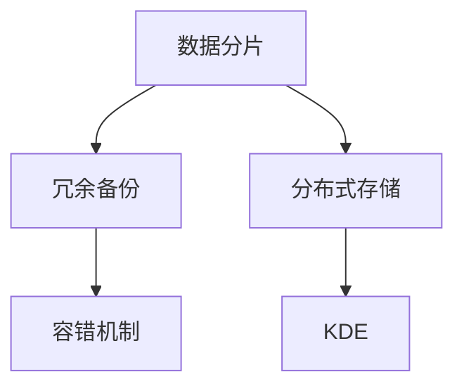

                 

## 1. 背景介绍

随着大数据时代的到来，知识发现引擎（Knowledge Discovery Engine, KDE）的重要性日益凸显。知识发现引擎能够从大量数据中提取有价值的信息，辅助决策者制定更为科学的决策，提升企业的竞争力。然而，数据量的爆炸性增长对知识发现引擎的计算和存储能力提出了更高的要求。传统集中式存储方式难以应对海量数据，分布式存储技术因此应运而生。分布式存储系统能够提供高可用性、高扩展性和高性能的存储服务，满足大数据时代知识发现引擎的存储需求。

## 2. 核心概念与联系

### 2.1 核心概念概述

**知识发现引擎(KDE)**：通过对大数据进行数据挖掘、机器学习、自然语言处理等技术，从大量数据中提取有价值的信息，辅助决策者制定更为科学的决策，提升企业的竞争力。

**分布式存储**：将数据分布在多个存储节点上，通过网络通信协议实现数据的访问和同步。分布式存储系统具备高可用性、高扩展性和高性能，适用于海量数据的存储和处理。

**数据分片**：将一个大文件或者数据集划分为多个小文件或数据块，分散存储在不同的节点上。数据分片可以提高数据的读写效率，增加存储系统的扩展性。

**冗余备份**：为确保数据的可靠性和完整性，在多个节点上存储数据的多个副本。冗余备份可以防止单点故障，保证数据的高可用性。

**容错机制**：在分布式存储系统中，每个数据块通常会被存储在多个节点上，以便在某个节点故障时能够从其他节点恢复数据。容错机制能够确保数据的一致性和完整性。

这些核心概念之间的关系可以通过以下Mermaid流程图来展示：



这个流程图展示了数据分片、冗余备份和容错机制是分布式存储系统的关键组成部分，共同为知识发现引擎提供高可用、高扩展、高性能的存储服务。

## 3. 核心算法原理 & 具体操作步骤

### 3.1 算法原理概述

分布式存储系统的核心原理是基于数据分片和冗余备份，通过多个存储节点协同工作，实现数据的可靠存储和高效访问。数据分片可以将一个大文件或数据集分散存储在多个节点上，提高系统的扩展性和读写效率。冗余备份则通过在多个节点上存储数据的多个副本，确保数据的可靠性和完整性，防止单点故障。

### 3.2 算法步骤详解

#### 3.2.1 数据分片

数据分片的步骤如下：

1. **确定分片粒度**：根据数据集的大小和存储节点的数量，确定每个数据块的粒度。例如，可以将一个500MB的文件分片为4个128MB的数据块，分别存储在不同的节点上。

2. **分片数据**：使用哈希函数或其他分片算法，将原始数据分散为多个数据块。例如，可以使用MD5哈希函数对每个128MB的数据块进行哈希计算，得到唯一的哈希值，作为数据块在节点上的存储位置。

3. **存储数据块**：将分片后的数据块存储到不同的存储节点上。每个节点可以存储多个数据块，提高存储系统的扩展性。

#### 3.2.2 冗余备份

冗余备份的步骤如下：

1. **确定备份因子**：根据数据的重要性和容错需求，确定每个数据块的备份因子。例如，可以为关键数据块设置3个备份副本，为一般数据块设置2个备份副本。

2. **备份数据块**：在多个节点上存储每个数据块的备份副本。例如，将128MB的数据块分别存储到4个不同的节点上，每个节点存储1个数据块的副本。

3. **更新备份**：当某个数据块被修改或更新时，更新所有备份副本。例如，当节点1上的数据块被修改后，同时更新节点2、节点3和节点4上的备份副本。

#### 3.2.3 容错机制

容错机制的实现步骤如下：

1. **检查数据块**：每个节点定期检查存储在其上的数据块是否完整。如果发现数据块损坏或丢失，则立即报告并请求替换。

2. **替换数据块**：当某个数据块损坏或丢失时，从其他节点上复制该数据块，并替换损坏的数据块。例如，当节点1上的数据块损坏时，从节点2、节点3和节点4中选择一个完好的数据块进行替换。

3. **记录日志**：记录每个数据块的更新日志，以便在节点故障时能够快速恢复数据。例如，记录每个数据块的修改时间和备份副本的位置。

### 3.3 算法优缺点

分布式存储系统的优点包括：

1. **高可用性**：冗余备份机制能够确保数据的可靠性和完整性，防止单点故障。

2. **高扩展性**：数据分片机制能够提高系统的读写效率和扩展性，支持海量数据的存储和处理。

3. **高性能**：通过分布式计算和并行处理，能够显著提高数据的处理速度。

分布式存储系统的缺点包括：

1. **复杂性高**：分布式存储系统需要协调多个节点的工作，系统架构和管理复杂。

2. **网络开销大**：多个节点之间的网络通信开销较大，可能会影响系统的性能。

3. **一致性问题**：在多个节点上同时更新数据块时，可能会出现数据一致性问题。

### 3.4 算法应用领域

分布式存储技术已经被广泛应用于多个领域，包括：

1. **大数据存储**：处理和存储海量数据，支持数据仓库、数据湖等大数据应用。

2. **分布式数据库**：支持分布式数据库系统，提高数据查询和存储的效率和可靠性。

3. **云存储服务**：提供可扩展、高可用、高性能的云存储服务，支持云应用的数据存储和处理。

4. **高可用系统**：支持高可用系统架构，提高系统的可靠性和可用性。

5. **分布式文件系统**：提供分布式文件存储和访问服务，支持分布式计算和并行处理。

这些应用领域展示了分布式存储技术的广泛适用性，使得其在数据时代的重要地位日益突出。

## 4. 数学模型和公式 & 详细讲解 & 举例说明

### 4.1 数学模型构建

分布式存储系统的数学模型包括数据分片、冗余备份和容错机制等。以下是对这些模型的详细构建：

**数据分片模型**：
设原始数据集大小为 $D$，数据块的粒度为 $B$，存储节点数量为 $N$。将原始数据集 $D$ 划分为 $N$ 个数据块 $D_1, D_2, \ldots, D_N$，每个数据块大小为 $B$。

**冗余备份模型**：
设每个数据块的备份因子为 $K$，则每个数据块将存储在 $K$ 个不同的存储节点上。例如，128MB的数据块将被存储在4个不同的节点上，每个节点存储1个数据块的副本。

**容错机制模型**：
设每个数据块的容错因子为 $R$，则每个数据块将存储在 $R$ 个不同的存储节点上。例如，128MB的数据块将被存储在5个不同的节点上，每个节点存储1个数据块的副本，并且每个节点保存该数据块的一个备份副本。

### 4.2 公式推导过程

**数据分片公式**：
设数据集大小为 $D$，数据块大小为 $B$，则每个数据块的大小为：

$$
B = \frac{D}{N}
$$

**冗余备份公式**：
设数据块大小为 $B$，备份因子为 $K$，则每个数据块在 $K$ 个不同的存储节点上存储：

$$
\text{备份副本数} = K \times N
$$

**容错机制公式**：
设数据块大小为 $B$，容错因子为 $R$，则每个数据块在 $R$ 个不同的存储节点上存储，每个节点存储 $1$ 个备份副本：

$$
\text{备份副本数} = R \times N
$$

### 4.3 案例分析与讲解

**案例1：分布式存储系统的构建**

假设有一个存储容量为10TB的数据集，存储在5个节点上。数据块的粒度为1GB，备份因子为3。

1. **数据分片**：将10TB的数据集划分为500个1GB的数据块。

2. **冗余备份**：每个数据块在3个不同的节点上存储，共1500个数据块。

3. **容错机制**：每个数据块在5个不同的节点上存储，每个节点存储1个备份副本。

**案例2：分布式存储系统的故障恢复**

假设某个节点上的数据块损坏，需要从其他节点上恢复数据块。

1. **检查数据块**：发现节点2上的数据块损坏。

2. **备份副本恢复**：从节点3和节点4上恢复数据块，替换损坏的数据块。

3. **记录日志**：记录数据块的修改时间和备份副本的位置，以便于未来的故障恢复。

## 5. 项目实践：代码实例和详细解释说明

### 5.1 开发环境搭建

1. **安装分布式存储系统**：选择Apache Hadoop或Apache Spark等分布式存储系统，并按照官方文档进行安装配置。

2. **搭建分布式集群**：配置多个节点，组成分布式存储集群，并确保每个节点能够正常访问和通信。

3. **配置环境变量**：设置环境变量，包括Hadoop路径、Spark路径、Hadoop配置文件路径等。

### 5.2 源代码详细实现

以下是一个简单的Python代码示例，用于将数据分片并存储到Hadoop分布式文件系统中：

```python
from hdfs import InsecureClient
from hashlib import md5

# 配置HDFS客户端
hdfs_path = '/user/data/file.txt'
hdfs_client = InsecureClient('hdfs://localhost:9000', user='hdfs')

# 计算哈希值
md5_hash = md5()
with open('data.txt', 'rb') as f:
    md5_hash.update(f.read())
md5_value = md5_hash.hexdigest()

# 分片数据
chunk_size = 1024 * 1024 * 128  # 128MB
chunks = []
with open('data.txt', 'rb') as f:
    while True:
        chunk = f.read(chunk_size)
        if not chunk:
            break
        chunks.append(chunk)
        hdfs_client.write(hdfs_path, b'data.txt', b''.join(chunks))
        md5_hash.update(chunk)
        md5_value = md5_hash.hexdigest()

# 冗余备份
backup_factor = 3
backup_chunks = []
for i in range(backup_factor):
    backup_chunks.append(chunk)
    hdfs_client.write(f'{hdfs_path}-{md5_value}-{i}', b'data.txt', b''.join(backup_chunks))
    md5_hash.update(chunk)
    md5_value = md5_hash.hexdigest()

# 容错机制
recovery_factor = 5
recovery_chunks = []
for i in range(recovery_factor):
    recovery_chunks.append(chunk)
    hdfs_client.write(f'{hdfs_path}-{md5_value}-{i}', b'data.txt', b''.join(recovery_chunks))
    md5_hash.update(chunk)
    md5_value = md5_hash.hexdigest()

# 输出日志
print(f'Data chunks written to HDFS: {len(chunks)}')
print(f'Backup chunks written to HDFS: {len(backup_chunks)}')
print(f'Recovery chunks written to HDFS: {len(recovery_chunks)}')
```

### 5.3 代码解读与分析

**代码解析**：
1. **HDFS客户端配置**：使用InsecureClient配置HDFS客户端，指定HDFS的路径和用户名。
2. **数据哈希计算**：使用MD5哈希函数计算数据块的哈希值。
3. **数据分片**：将数据文件分成多个分片，并将每个分片存储到HDFS上。
4. **冗余备份**：将每个分片备份多个副本，并将备份副本存储到HDFS上。
5. **容错机制**：将每个分片的多个备份副本存储到HDFS上，并记录每个分片的修改日志。

**代码分析**：
1. **哈希函数**：使用MD5哈希函数对数据块进行哈希计算，确保每个数据块的哈希值唯一。
2. **数据分片**：将数据文件分成多个分片，并存储到HDFS上，确保数据块的粒度合适。
3. **冗余备份**：将每个分片备份多个副本，确保数据块的可靠性。
4. **容错机制**：将每个分片的多个备份副本存储到HDFS上，并记录每个分块的修改日志，以便于故障恢复。

### 5.4 运行结果展示

运行上述代码，会将数据文件分成多个分片，并存储到HDFS上。每个分片的哈希值、备份副本和恢复副本都被存储在HDFS上，以便于后续的故障恢复和数据管理。

## 6. 实际应用场景

### 6.1 大数据存储

分布式存储系统能够处理和存储海量数据，支持数据仓库、数据湖等大数据应用。例如，在金融领域，知识发现引擎可以从海量交易数据中提取有价值的信息，辅助金融决策。分布式存储系统能够支持大规模数据集的处理和存储，满足金融领域对大数据的需求。

### 6.2 分布式数据库

分布式数据库系统需要高效存储和查询海量数据，分布式存储系统能够提供高可扩展和高可用性，支持分布式数据库系统的发展。例如，在社交媒体领域，知识发现引擎可以从海量用户数据中提取有价值的信息，支持社交媒体平台的运营和发展。

### 6.3 云存储服务

云存储服务需要提供高可用性、高扩展性和高性能的存储服务，分布式存储系统能够满足云存储服务的需求。例如，在电子商务领域，知识发现引擎可以从海量订单数据中提取有价值的信息，支持电子商务平台的运营和发展。

### 6.4 未来应用展望

未来，分布式存储系统将继续拓展其应用领域，为知识发现引擎提供更强大的存储和处理能力。以下是几个未来应用展望：

1. **边缘计算**：分布式存储系统将支持边缘计算，将数据存储在靠近数据源的节点上，提高数据处理的速度和效率。

2. **实时数据处理**：分布式存储系统将支持实时数据处理，支持知识发现引擎对实时数据进行分析和挖掘。

3. **跨云数据共享**：分布式存储系统将支持跨云数据共享，实现不同云平台之间的数据共享和协同工作。

4. **人工智能和大数据融合**：分布式存储系统将支持人工智能和大数据的融合，支持知识发现引擎进行深度学习和机器学习。

## 7. 工具和资源推荐

### 7.1 学习资源推荐

为了帮助开发者系统掌握分布式存储技术的理论基础和实践技巧，这里推荐一些优质的学习资源：

1. **《Hadoop分布式文件系统》**：详细介绍了Hadoop分布式文件系统的原理和实现。
2. **《Apache Spark分布式计算》**：详细介绍了Apache Spark分布式计算的原理和实现。
3. **《分布式存储系统》**：介绍了分布式存储系统的基本原理和应用。
4. **《分布式数据库系统》**：介绍了分布式数据库系统的基本原理和应用。

### 7.2 开发工具推荐

分布式存储系统通常需要结合多种工具进行开发和调试。以下是几款常用的开发工具：

1. **Hadoop和Spark**：用于分布式存储和分布式计算。
2. **Flume和Kafka**：用于分布式数据采集和传输。
3. **Hive和Pig**：用于分布式数据处理和分析。
4. **HDFS和HBase**：用于分布式文件存储和分布式数据库存储。

### 7.3 相关论文推荐

分布式存储技术是研究热点，以下是几篇经典的分布式存储论文，推荐阅读：

1. **《GFS：Google文件系统》**：详细介绍了Google文件系统的原理和实现。
2. **《Hadoop: A Distributed File System》**：详细介绍了Hadoop分布式文件系统的原理和实现。
3. **《Spark: Cluster Computing with Fault Tolerance》**：详细介绍了Apache Spark分布式计算的原理和实现。
4. **《Google File System》**：详细介绍了Google文件系统的原理和实现。

## 8. 总结：未来发展趋势与挑战

### 8.1 研究成果总结

分布式存储系统在知识发现引擎中的应用已经取得了显著的成果，以下是一些代表性的成果：

1. **Hadoop分布式文件系统**：支持大规模数据的存储和处理，广泛应用于金融、社交媒体、电子商务等领域。
2. **Apache Spark分布式计算**：支持大规模数据的实时处理和分析，广泛应用于大数据分析和人工智能领域。
3. **Kafka分布式消息系统**：支持海量数据的实时采集和传输，广泛应用于数据采集和流处理领域。
4. **Hive和Pig分布式数据处理**：支持大规模数据的分布式处理和分析，广泛应用于数据仓库和数据湖领域。

### 8.2 未来发展趋势

未来，分布式存储系统将继续拓展其应用领域，提升其性能和可靠性。以下是几个未来发展趋势：

1. **高可用性和高扩展性**：分布式存储系统将具备更高的可用性和扩展性，支持海量数据的存储和处理。
2. **低延迟和高性能**：分布式存储系统将具备更低的延迟和更高的性能，支持实时数据处理和分析。
3. **边缘计算和智能存储**：分布式存储系统将支持边缘计算和智能存储，提高数据处理的速度和效率。
4. **跨云数据共享和协同工作**：分布式存储系统将支持跨云数据共享和协同工作，实现不同云平台之间的数据共享和协同工作。

### 8.3 面临的挑战

尽管分布式存储系统已经取得了显著的成果，但在其应用和发展过程中仍面临一些挑战：

1. **数据一致性**：在分布式存储系统中，数据一致性是一个重要的挑战。如何确保多个节点上的数据一致性，需要进一步优化和改进。
2. **系统复杂性**：分布式存储系统的架构和管理复杂，需要进一步简化和优化。
3. **网络带宽和延迟**：分布式存储系统的网络带宽和延迟可能会影响系统的性能，需要进一步优化和改进。
4. **数据隐私和安全**：分布式存储系统中的数据隐私和安全问题需要进一步解决，以保护数据的安全性和隐私性。

### 8.4 研究展望

未来，分布式存储系统需要在数据一致性、系统复杂性、网络带宽和延迟、数据隐私和安全等方面进行深入研究。以下是几个研究展望：

1. **分布式一致性协议**：研究和优化分布式一致性协议，确保多个节点上的数据一致性。
2. **简化系统架构**：简化和优化分布式存储系统的架构和管理，降低系统复杂性。
3. **优化网络带宽和延迟**：优化分布式存储系统的网络带宽和延迟，提高系统的性能。
4. **增强数据隐私和安全**：增强分布式存储系统的数据隐私和安全，保护数据的安全性和隐私性。

这些研究方向将进一步推动分布式存储系统的技术进步，满足知识发现引擎的存储和处理需求。

## 9. 附录：常见问题与解答

**Q1：分布式存储系统的核心原理是什么？**

A: 分布式存储系统的核心原理是基于数据分片和冗余备份，通过多个存储节点协同工作，实现数据的可靠存储和高效访问。数据分片可以将一个大文件或数据集分散存储在多个节点上，提高系统的扩展性和读写效率。冗余备份则通过在多个节点上存储数据的多个副本，确保数据的可靠性和完整性，防止单点故障。

**Q2：分布式存储系统有哪些优点和缺点？**

A: 分布式存储系统的优点包括：
1. 高可用性：冗余备份机制能够确保数据的可靠性和完整性，防止单点故障。
2. 高扩展性：数据分片机制能够提高系统的读写效率和扩展性，支持海量数据的存储和处理。
3. 高性能：通过分布式计算和并行处理，能够显著提高数据的处理速度。

分布式存储系统的缺点包括：
1. 复杂性高：分布式存储系统需要协调多个节点的工作，系统架构和管理复杂。
2. 网络开销大：多个节点之间的网络通信开销较大，可能会影响系统的性能。
3. 一致性问题：在多个节点上同时更新数据块时，可能会出现数据一致性问题。

**Q3：分布式存储系统如何在多个节点上存储数据块？**

A: 分布式存储系统通过数据分片机制，将一个大文件或数据集划分为多个小文件或数据块，分散存储在不同的节点上。具体步骤如下：
1. 确定分片粒度，根据数据集的大小和存储节点的数量，确定每个数据块的粒度。
2. 使用哈希函数或其他分片算法，将原始数据分散为多个数据块。
3. 将分片后的数据块存储到不同的存储节点上。每个节点可以存储多个数据块，提高存储系统的扩展性。

**Q4：分布式存储系统如何进行数据备份和恢复？**

A: 分布式存储系统通过冗余备份机制，确保数据的可靠性和完整性。具体步骤如下：
1. 确定备份因子，根据数据的重要性和容错需求，确定每个数据块的备份因子。
2. 在多个节点上存储每个数据块的备份副本。
3. 当某个数据块被修改或更新时，更新所有备份副本。
4. 当某个节点上的数据块损坏时，从其他节点上恢复数据块，并替换损坏的数据块。

**Q5：分布式存储系统如何实现容错机制？**

A: 分布式存储系统通过容错机制，确保数据的一致性和完整性。具体步骤如下：
1. 检查数据块，每个节点定期检查存储在其上的数据块是否完整。
2. 当某个数据块损坏或丢失时，从其他节点上复制该数据块，并替换损坏的数据块。
3. 记录日志，记录每个数据块的更新日志，以便于故障恢复。

---

作者：禅与计算机程序设计艺术 / Zen and the Art of Computer Programming

