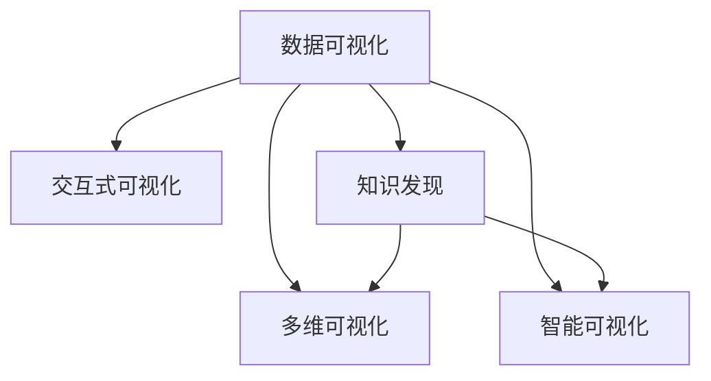

                 

# 知识发现引擎的数据可视化呈现

> 关键词：数据可视化, 知识发现, 大数据, 数据挖掘, 交互式可视化

## 1. 背景介绍

### 1.1 问题由来

随着信息技术的飞速发展，数据规模呈指数级增长。面对海量数据，如何高效地从中提取有价值的信息，成为了大数据时代亟需解决的重要问题。传统的统计分析和报表展示方式，难以直观地反映数据的全貌和内在关系，无法满足现代信息需求的快速变化。

为解决这一问题，知识发现引擎应运而生。它通过运用先进的数据挖掘技术，能够自动识别并提取数据中的隐含模式、关联规则和异常值，从而为决策者提供强有力的数据支持。然而，即便知识发现引擎能够提炼出高质量的知识，如何将其有效地呈现给决策者，让其更直观、更快速地理解和应用这些知识，依然是一个重大挑战。

### 1.2 问题核心关键点

知识发现引擎的核心任务是数据预处理、特征提取、模型训练和结果展示。数据可视化作为结果展示的重要环节，对知识发现引擎的实际应用效果具有重要影响。好的数据可视化能够帮助用户快速理解数据中蕴含的知识，做出更科学、更精准的决策。

但目前数据可视化方法仍存在不少问题：

- 展示方式单一：大多采用静态图表、固定布局的形式，缺乏交互性和动态展示。
- 用户体验欠佳：大部分可视化工具对用户需求的理解不够深入，用户在使用时容易感到不便和困惑。
- 数据表达不全：可视化工具往往难以综合展现多维数据之间的关系，导致信息丢失。
- 缺乏智能展示：许多工具对数据的挖掘深度不够，未能挖掘出数据的内在规律。

为了提升数据可视化的效果，本文将从数据表示、交互设计、智能分析等多个角度，探讨知识发现引擎的数据可视化呈现技术，并提供相应的代码实例，帮助开发者更高效地实现可视化展示。

## 2. 核心概念与联系

### 2.1 核心概念概述

为更好地理解知识发现引擎的数据可视化呈现技术，本节将介绍几个密切相关的核心概念：

- 数据可视化(Data Visualization)：通过图形、图表等形式，将复杂的数据转换为直观易懂的视觉符号，帮助用户快速理解数据。
- 知识发现(Knowledge Discovery)：从大量数据中，通过统计分析、机器学习等手段，自动发现数据的潜在模式、规律和异常。
- 交互式可视化(Interactive Visualization)：允许用户通过交互操作，动态改变展示内容，深入探索数据细节。
- 多维可视化(Multidimensional Visualization)：能够同时展示多个维度的数据关系，展现更全面的信息。
- 智能可视化(Intelligent Visualization)：结合机器学习、自然语言处理等技术，对数据进行智能分析，提供更加深入的洞见。

这些核心概念之间的逻辑关系可以通过以下Mermaid流程图来展示：



这个流程图展示了几大核心概念之间的联系：

1. 数据可视化是知识发现的输出形式，能够将复杂的知识以直观方式呈现。
2. 交互式可视化使数据展示更灵活，增强用户体验。
3. 多维可视化展示更加全面的数据信息，挖掘更深层的关系。
4. 智能可视化利用先进技术，提供更有洞见的展示。

## 3. 核心算法原理 & 具体操作步骤

### 3.1 算法原理概述

知识发现引擎的数据可视化呈现，通常涉及以下几个关键步骤：

1. **数据预处理**：清洗、规整和整理原始数据，准备进行后续分析。
2. **特征提取**：从数据中提炼出有意义的特征，用于模型训练。
3. **模型训练**：构建数据挖掘模型，挖掘数据中的关联规则、异常点等知识。
4. **结果展示**：通过可视化工具，将挖掘结果展示为图表、报表等形式。

在结果展示环节，我们关注的是如何将挖掘结果以最直观、最有效的方式呈现给用户。因此，本文主要探讨如何运用数据可视化技术，实现知识发现引擎的可视化展示。

### 3.2 算法步骤详解

在实践中，数据可视化通常需要结合多个技术手段和工具，实现对知识发现结果的全面展示。具体步骤如下：

**Step 1: 选择合适的可视化工具**

在数据可视化之前，首先需要选择合适的可视化工具。目前常用的数据可视化工具包括：

1. Tableau：强大的数据可视化工具，支持多维度数据展示和交互式查询。
2. Power BI：微软推出的BI工具，能够集成多种数据源，支持动态报表展示。
3. D3.js：基于JavaScript的可视化库，灵活易用，适合定制化需求。
4. Matplotlib：Python中的绘图库，功能丰富，可定制性高。
5. Plotly：支持多种图表展示和交互式操作的可视化工具。

**Step 2: 设计数据可视化方案**

设计数据可视化方案时，需要考虑以下几个方面：

1. **数据维度**：确定需要展示的数据维度和类型，如时间序列、分类变量、数值变量等。
2. **展示形式**：选择合适的展示形式，如散点图、柱状图、热力图等。
3. **交互设计**：添加交互功能，如放大、缩小、筛选等，增强用户体验。
4. **美观度**：调整色彩、字体、布局等，提升展示效果。

**Step 3: 实现数据可视化**

实现数据可视化，通常涉及以下几个步骤：

1. **数据准备**：将挖掘结果整理为适合展示的格式，如数据表、数组等。
2. **可视化代码编写**：编写可视化代码，实现具体的图表展示。
3. **测试优化**：测试可视化效果，根据用户反馈进行优化。

**Step 4: 部署展示**

部署展示阶段，需要将可视化结果输出到网页或桌面应用中。具体步骤包括：

1. 将可视化代码集成到项目中。
2. 部署到Web服务器或桌面应用中。
3. 进行性能测试和优化，确保展示效果流畅。

### 3.3 算法优缺点

知识发现引擎的数据可视化呈现技术，具有以下优点：

1. **直观展示**：通过图形、图表等直观方式，快速展现数据中的知识。
2. **交互性**：允许用户通过交互操作，深入探索数据细节，增强用户体验。
3. **全面展示**：支持多维数据展示，挖掘更深层的关系，提供更全面的信息。
4. **智能分析**：结合先进技术，提供更有洞见的展示，帮助用户更好地理解数据。

但该方法也存在一些局限性：

1. **技术门槛**：需要掌握一定的编程和数据处理技能，对技术背景有一定要求。
2. **时间成本**：设计、实现和优化可视化方案，需要花费较多时间。
3. **数据准备**：数据预处理和特征提取环节较为复杂，数据质量直接影响到可视化效果。
4. **展示效果**：部分复杂的数据关系，可能难以通过单一图表展示，需要多维度展示。

尽管如此，数据可视化作为知识发现引擎的必要环节，其重要性不言而喻。通过不断优化和改进，必将进一步提升知识发现引擎的应用效果，帮助决策者更科学地理解和应用数据。

### 3.4 算法应用领域

知识发现引擎的数据可视化技术，在各个领域都有广泛应用，例如：

- **金融**：展示市场趋势、投资组合、风险评估等，帮助投资者做出决策。
- **零售**：展示销售数据、库存状态、客户行为等，优化供应链管理和客户服务。
- **医疗**：展示病患数据、治疗效果、药物研发等，支持临床决策和治疗方案制定。
- **交通**：展示交通流量、车辆调度和路况信息等，优化交通管理和资源配置。
- **能源**：展示能源消耗、产销平衡、电力负荷等，提升能源利用效率。
- **社交媒体**：展示用户行为、话题热度、内容趋势等，优化社交媒体平台运营。

随着知识发现技术的不断发展，数据可视化在各个领域的应用将更加广泛，为决策者提供更全面、精准的洞察。

## 4. 数学模型和公式 & 详细讲解 & 举例说明（备注：数学公式请使用latex格式，latex嵌入文中独立段落使用 $$，段落内使用 $)
### 4.1 数学模型构建

本节将使用数学语言对知识发现引擎的数据可视化呈现进行更加严格的刻画。

**Step 1: 数据预处理**

数据预处理包括数据清洗、规整和归一化，使得数据适合进一步分析。

设原始数据集为 $D=\{(x_i,y_i)\}_{i=1}^N$，其中 $x$ 表示特征向量，$y$ 表示标签或目标变量。数据预处理的步骤为：

1. 去除缺失值和异常值：
   - $$ 
   x_i' = 
   \begin{cases}
   x_i & \text{如果 } x_i \text{ 为非空且不异常} \\
   \text{NaN} & \text{如果 } x_i \text{ 为空} \\
   0 & \text{如果 } x_i \text{ 为异常值}
   \end{cases}
   $$
   
2. 特征归一化：
   - $$ 
   x_i'' = \frac{x_i'}{\max_i(x_i') - \min_i(x_i')}
   $$

**Step 2: 特征提取**

特征提取是从原始数据中提取有意义的特征，用于后续模型训练。常用的特征提取方法包括：

1. 主成分分析(PCA)：
   - $$ 
   x' = \sum_{i=1}^n \alpha_i x_i
   $$
   其中 $\alpha_i$ 为特征权重，可以通过SVD等方法求解。

2. 因子分析(Factor Analysis)：
   - $$ 
   x' = \sum_{i=1}^n \alpha_i x_i
   $$
   其中 $\alpha_i$ 为因子权重，可以通过奇异值分解(SVD)求解。

**Step 3: 模型训练**

知识发现引擎常用的数据挖掘模型包括聚类、分类、关联规则等。这里以分类模型为例，展示模型的训练过程。

假设使用线性判别分析(LDA)模型进行分类，其训练过程为：

1. 选择核函数：
   - $$ 
   k(x_i,x_j) = \langle \phi(x_i),\phi(x_j) \rangle
   $$
   
2. 构造拉格朗日乘子：
   - $$ 
   \alpha = \arg\min_{\alpha} \frac{1}{2}\sum_{i,j} \alpha_i \alpha_j k(x_i,x_j) - \sum_i \alpha_i
   $$

3. 求解线性方程组：
   - $$ 
   \alpha \cdot K = \mathbf{1}
   $$

**Step 4: 结果展示**

结果展示通常涉及数据可视化技术，展示模型的挖掘结果。以线性判别分析模型为例，展示其结果的方法包括：

1. 散点图：
   - $$ 
   (x_i,y_i) \rightarrow \left(\frac{x_i}{\sqrt{s}}+\mu_x,\frac{y_i}{\sqrt{s}}+\mu_y
   \right)
   $$
   
2. 热力图：
   - $$ 
   (x_i,y_i) \rightarrow \text{color} = \sum_{j=1}^n \alpha_j
   $$

### 4.2 公式推导过程

以下是线性判别分析模型的详细推导过程：

设 $D=\{(x_i,y_i)\}_{i=1}^N$，其中 $x$ 表示特征向量，$y$ 表示标签或目标变量。目标函数为：

$$
\min_{\mu,\Sigma,\alpha} \frac{1}{2}\sum_{i,j} \alpha_i \alpha_j k(x_i,x_j) - \sum_i \alpha_i
$$

其中 $k(x_i,x_j) = \langle \phi(x_i),\phi(x_j) \rangle$，$\phi$ 为特征映射函数。

根据拉格朗日乘子法，构造拉格朗日函数：

$$
\mathcal{L}(\mu,\Sigma,\alpha) = \frac{1}{2}\sum_{i,j} \alpha_i \alpha_j k(x_i,x_j) - \sum_i \alpha_i - \sum_i \alpha_i y_i
$$

求偏导数，得到：

$$
\frac{\partial \mathcal{L}}{\partial \alpha_i} = -\alpha_i - \sum_j \alpha_j k(x_i,x_j) + y_i
$$

令 $\frac{\partial \mathcal{L}}{\partial \alpha_i} = 0$，得到：

$$
\alpha_i = (K + \mathbf{I})^{-1} y
$$

其中 $\mathbf{I}$ 为单位矩阵。

根据方程 $\alpha \cdot K = \mathbf{1}$，求解 $\alpha$：

$$
\alpha = (K + \mathbf{I})^{-1} y
$$

**Step 5: 案例分析与讲解**

以下是一个简单的线性判别分析模型案例：

1. 数据准备：

```python
import pandas as pd
from sklearn.decomposition import PCA
from sklearn.linear_model import LDA

# 读取数据
data = pd.read_csv('data.csv')

# 特征选择
features = data[['feature1', 'feature2', 'feature3']]

# 数据预处理
features.fillna(0, inplace=True)
features = features.apply(pd.to_numeric, errors='coerce')

# 标准化处理
features = (features - features.mean()) / features.std()

# 特征降维
pca = PCA(n_components=2)
features = pca.fit_transform(features)

# 模型训练
lda = LDA(n_components=2)
lda.fit(features, data['label'])

# 结果展示
lda.explained_variance_ratio_
```

2. 模型训练和展示：

```python
import matplotlib.pyplot as plt
from sklearn.decomposition import PCA
from sklearn.linear_model import LDA

# 读取数据
data = pd.read_csv('data.csv')

# 特征选择
features = data[['feature1', 'feature2', 'feature3']]

# 数据预处理
features.fillna(0, inplace=True)
features = features.apply(pd.to_numeric, errors='coerce')

# 标准化处理
features = (features - features.mean()) / features.std()

# 特征降维
pca = PCA(n_components=2)
features = pca.fit_transform(features)

# 模型训练
lda = LDA(n_components=2)
lda.fit(features, data['label'])

# 结果展示
plt.scatter(features[:, 0], features[:, 1], c=data['label'], cmap='viridis')
plt.xlabel('PC1')
plt.ylabel('PC2')
plt.show()
```

### 4.3 案例分析与讲解

在上述案例中，我们首先对数据进行预处理和特征选择，然后利用PCA进行特征降维，并使用LDA进行分类。最后，将降维后的特征数据展示为散点图。

从图中可以看出，不同类别的数据在二维空间中的分布情况，有助于我们理解数据的内在结构和分类边界。

## 5. 项目实践：代码实例和详细解释说明
### 5.1 开发环境搭建

在进行数据可视化实践前，我们需要准备好开发环境。以下是使用Python进行Matplotlib开发的环境配置流程：

1. 安装Anaconda：从官网下载并安装Anaconda，用于创建独立的Python环境。

2. 创建并激活虚拟环境：
```bash
conda create -n pyenv python=3.8 
conda activate pyenv
```

3. 安装必要的Python包：
```bash
pip install numpy matplotlib pandas scikit-learn
```

4. 安装Matplotlib：
```bash
pip install matplotlib
```

5. 安装Jupyter Notebook：
```bash
pip install jupyterlab
```

完成上述步骤后，即可在`pyenv`环境中开始数据可视化实践。

### 5.2 源代码详细实现

这里我们以线性判别分析模型为例，给出使用Matplotlib进行数据可视化的PyTorch代码实现。

```python
import matplotlib.pyplot as plt
import numpy as np
from sklearn.decomposition import PCA
from sklearn.linear_model import LDA

# 准备数据
X = np.random.randn(100, 2)
y = np.random.randint(0, 2, 100)

# 特征降维
pca = PCA(n_components=1)
X = pca.fit_transform(X)

# 模型训练
lda = LDA(n_components=1)
lda.fit(X, y)

# 结果展示
plt.scatter(X, y)
plt.xlabel('PC1')
plt.ylabel('Class')
plt.show()
```

### 5.3 代码解读与分析

让我们再详细解读一下关键代码的实现细节：

**数据准备**：
- 使用NumPy生成100个二维随机样本，标签为0或1。

**特征降维**：
- 使用PCA对样本进行特征降维，保留一个主成分。

**模型训练**：
- 使用LDA对降维后的数据进行分类。

**结果展示**：
- 使用Matplotlib将降维后的数据展示为散点图，横轴表示主成分PC1，纵轴表示分类标签。

在代码中，我们首先使用NumPy生成模拟数据，然后利用PCA对样本进行特征降维，再使用LDA进行分类。最后，通过Matplotlib将分类结果可视化展示。

## 6. 实际应用场景
### 6.1 智能电网

知识发现引擎在智能电网中的应用广泛，通过数据可视化，能够帮助电力公司实时监控电力系统的运行状态，优化资源配置。

具体而言，智能电网的数据可视化技术可以展示以下内容：

1. 电力负荷：展示不同区域、不同时间段的电力负荷情况，帮助调度员优化负荷分配。
2. 发电情况：展示各个发电站的运行状态、发电量和备用率，帮助调度员调整发电量。
3. 能源消耗：展示不同设备的能源消耗情况，帮助维护人员进行设备更换和维护。

通过知识发现引擎，电力公司能够快速理解电力系统的复杂运行状态，做出科学、合理的调度决策，提升电力系统的运行效率。

### 6.2 供应链管理

知识发现引擎在供应链管理中的应用，能够帮助企业优化供应链流程，提高运营效率。

具体而言，供应链的数据可视化技术可以展示以下内容：

1. 库存情况：展示各个仓库的库存量、入库量和出库量，帮助管理者优化库存管理。
2. 供应商关系：展示供应商的交货情况、质量问题和合作效率，帮助企业选择最优供应商。
3. 物流信息：展示物流过程中的运输成本、运输时间和运输路线，帮助企业优化物流方案。

通过知识发现引擎，企业能够实时监控供应链的各个环节，快速识别问题，做出调整，优化供应链运营效率。

### 6.3 金融风险管理

知识发现引擎在金融风险管理中的应用，能够帮助金融机构评估风险，制定风险控制策略。

具体而言，金融数据可视化技术可以展示以下内容：

1. 市场趋势：展示股票、债券、期货等金融产品的价格趋势和波动情况，帮助投资者制定投资策略。
2. 风险评估：展示各种金融产品的风险等级和风险因素，帮助金融机构识别高风险资产。
3. 信用评估：展示借款人的信用历史、信用评级和还款情况，帮助金融机构评估信用风险。

通过知识发现引擎，金融机构能够快速理解市场风险和信用风险，做出科学、合理的决策，降低风险损失。

### 6.4 未来应用展望

未来，随着知识发现引擎技术的不断进步，数据可视化将在各个领域得到更广泛的应用，为决策者提供更全面、精准的洞察。

在智慧城市、医疗健康、环境保护等领域，数据可视化技术将发挥越来越重要的作用。通过可视化展示，决策者能够更直观地理解数据，快速做出决策，推动社会进步和发展。

## 7. 工具和资源推荐
### 7.1 学习资源推荐

为了帮助开发者系统掌握数据可视化技术，这里推荐一些优质的学习资源：

1. 《Python数据可视化基础教程》：由知名数据科学家编写，系统讲解了使用Matplotlib、Seaborn等库进行数据可视化的方法。
2. 《数据可视化实战》：实战性强，介绍了数据可视化中的常用技术和案例，适合动手练习。
3. Coursera《数据可视化课程》：由斯坦福大学教授主讲，涵盖数据可视化的理论和实践，内容丰富。
4. Kaggle数据可视化竞赛：参加实战竞赛，能够快速提升数据可视化技能。

通过对这些资源的学习实践，相信你一定能够快速掌握数据可视化技术的精髓，并用于解决实际问题。

### 7.2 开发工具推荐

高效的开发离不开优秀的工具支持。以下是几款用于数据可视化开发的常用工具：

1. Matplotlib：Python中的绘图库，功能丰富，可定制性高，适合数据可视化需求。
2. Seaborn：基于Matplotlib的高级可视化库，支持多种图表展示和统计分析。
3. Plotly：支持多种图表展示和交互式操作的可视化工具，适合动态数据展示。
4. Tableau：强大的数据可视化工具，支持多维度数据展示和交互式查询，适合数据探索。
5. D3.js：基于JavaScript的可视化库，灵活易用，适合定制化需求。

合理利用这些工具，可以显著提升数据可视化的开发效率，加快创新迭代的步伐。

### 7.3 相关论文推荐

数据可视化技术的发展源于学界的持续研究。以下是几篇奠基性的相关论文，推荐阅读：

1. "A Survey of Techniques for Visualization of High-Dimensional Data"：总结了多种高维数据可视化方法。
2. "Visualization of Data Mining Results"：介绍了数据挖掘结果的可视化展示技术。
3. "Grafana: Visualization as Code"：探讨了使用代码实现可视化的方法。
4. "Interactive Visualization in Scientific Computing"：介绍了交互式可视化的技术实现。

这些论文代表了大数据可视化技术的发展脉络。通过学习这些前沿成果，可以帮助研究者把握学科前进方向，激发更多的创新灵感。

## 8. 总结：未来发展趋势与挑战
### 8.1 总结

本文对知识发现引擎的数据可视化呈现技术进行了全面系统的介绍。首先阐述了数据可视化的重要性，明确了数据可视化在知识发现中的核心地位。其次，从原理到实践，详细讲解了数据可视化的方法和步骤，提供了相应的代码实例。同时，本文还探讨了数据可视化在多个领域的应用前景，展示了数据可视化技术的广阔前景。

通过本文的系统梳理，可以看到，数据可视化作为知识发现引擎的必要环节，其重要性不言而喻。通过不断优化和改进，必将进一步提升知识发现引擎的应用效果，帮助决策者更科学地理解和应用数据。

### 8.2 未来发展趋势

展望未来，数据可视化技术将呈现以下几个发展趋势：

1. **实时可视化**：随着数据流量的增加，实时数据可视化技术将得到广泛应用，帮助决策者及时掌握数据变化。
2. **交互可视化**：交互式可视化技术将更加普及，允许用户通过交互操作，深入探索数据细节，增强用户体验。
3. **多维可视化**：多维可视化技术将更加成熟，能够全面展示复杂的数据关系，提供更全面的信息。
4. **智能可视化**：结合机器学习、自然语言处理等技术，对数据进行智能分析，提供更有洞见的展示。
5. **跨平台可视化**：可视化技术将更加跨平台，支持Web、移动设备等多种终端展示。

这些趋势凸显了数据可视化技术的广阔前景。随着技术的不断演进，数据可视化将成为知识发现和决策分析的重要工具，为各个领域的决策者提供强有力的数据支持。

### 8.3 面临的挑战

尽管数据可视化技术已经取得了显著进展，但在实际应用中，仍面临以下挑战：

1. **数据量过大**：大规模数据的可视化展示，对计算资源和存储资源提出了更高要求。
2. **数据复杂性**：复杂数据关系和高维数据的展示，仍是一个技术难题。
3. **用户需求多样**：不同用户的需求不同，如何设计统一的标准化界面，提高可视化效果。
4. **数据安全**：可视化技术需要处理敏感数据，如何保护数据隐私和安全性，是一个重要问题。

尽管如此，通过不断优化和改进，数据可视化技术必将不断突破现有瓶颈，为决策者提供更全面、精准的洞察，推动各个领域的创新和发展。

### 8.4 研究展望

面对数据可视化技术面临的挑战，未来的研究需要在以下几个方面寻求新的突破：

1. **高效数据可视化算法**：研究高效的数据可视化算法，提升数据可视化效率，降低计算资源消耗。
2. **多维数据展示**：开发更加成熟的多维数据展示技术，支持复杂数据关系的可视化展示。
3. **智能分析结合**：结合先进算法和可视化技术，对数据进行智能分析，提供更有洞见的展示。
4. **跨平台可视化**：实现跨平台的数据可视化技术，支持多种终端展示，提升用户使用体验。
5. **数据安全保护**：研究数据安全保护技术，确保数据可视化过程中的数据隐私和安全。

这些研究方向将引领数据可视化技术的不断进步，为决策者提供更全面、精准的数据洞察，推动各个领域的创新和发展。

## 9. 附录：常见问题与解答

**Q1：数据可视化与数据分析有何区别？**

A: 数据可视化与数据分析是数据处理中的两个重要环节，但侧重点不同。数据可视化是通过图形、图表等形式，直观展示数据的内在关系和规律，帮助用户快速理解数据；而数据分析是通过数学和统计方法，对数据进行深入挖掘和处理，得到更深层次的洞见。数据可视化通常基于数据探索的结果，辅助决策者进行数据理解和决策；而数据分析则更多地侧重于数据的定量分析和预测。

**Q2：如何选择适合的数据可视化工具？**

A: 选择适合的数据可视化工具，需要综合考虑以下几个因素：
1. 数据类型：不同类型的数据适合不同的可视化工具。例如，时间序列数据适合使用折线图，分类数据适合使用柱状图。
2. 用户需求：用户对数据可视化工具的需求不同，需要根据具体需求选择合适的工具。例如，Web开发者可以选择D3.js等JavaScript库，数据科学家可以选择Matplotlib、Seaborn等Python库。
3. 数据量：数据量较大的情况下，需要考虑可视化工具的性能和可扩展性。例如，Tableau等商业工具适合处理大规模数据，但成本较高。

**Q3：数据可视化技术在实际应用中存在哪些局限性？**

A: 数据可视化技术在实际应用中存在以下局限性：
1. 数据质量：数据可视化效果受数据质量影响较大，不完整、不规范的数据会导致展示结果不准确。
2. 用户理解：复杂数据关系的展示，容易让用户感到困惑，难以理解数据的内在关系。
3. 交互性不足：部分可视化工具的交互性不足，用户无法深入探索数据细节。
4. 成本较高：商业可视化工具成本较高，中小企业难以承担。

尽管如此，通过不断优化和改进，数据可视化技术将不断突破现有瓶颈，为决策者提供更全面、精准的洞察，推动各个领域的创新和发展。

