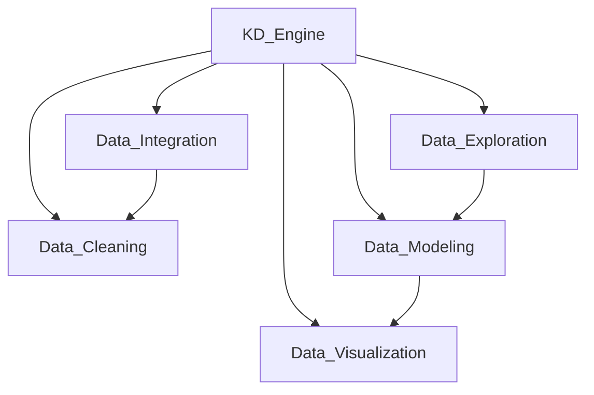
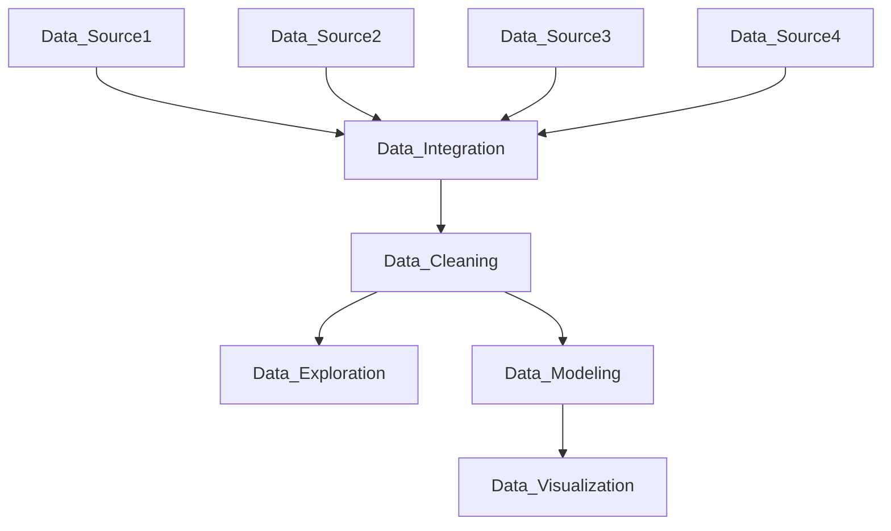

                 

## 1. 背景介绍

在人工智能和大数据时代，数据驱动型决策和智能分析正逐渐成为企业获取竞争优势的关键。知识发现(Knowledge Discovery, KD)，即通过数据挖掘和统计分析，从大量数据中提取知识与洞察，辅助决策制定，成为了企业智能化转型和数字化发展的核心需求。为了实现这一目标，构建一个高效、灵活、可扩展的知识发现引擎成为当务之急。

知识发现引擎(KD Engine)，作为连接数据与知识的桥梁，负责从数据中提取、存储、检索和展示知识。它的构建依赖于多种数据源，包括关系型数据库、非关系型数据库、文件系统、数据仓库、数据湖等。本文将围绕数据源获取与处理展开讨论，探讨如何构建高效的知识发现引擎。

## 2. 核心概念与联系

为了更好地理解知识发现引擎的数据源获取与处理，我们将介绍几个核心概念及其相互联系。

### 2.1 核心概念概述

- **知识发现引擎(KD Engine)**：从数据中自动挖掘、整合和提取知识的过程。主要涉及数据集成、数据清洗、数据探索、数据建模和数据可视等步骤。
- **数据源(Data Source)**：存储数据的基本单位，包括数据库、文件系统、API接口等。
- **数据集成(Data Integration)**：将不同数据源的数据整合、转换和加载到统一的数据仓库或数据湖。
- **数据清洗(Data Cleaning)**：从数据中识别和处理噪声、缺失值和不一致性问题，提升数据质量。
- **数据探索(Data Exploration)**：对数据进行可视化分析和交互式探索，发现潜在规律和模式。
- **数据建模(Data Modeling)**：利用统计学、机器学习和人工智能等方法，从数据中建立模型和规则，提取知识。
- **数据可视化(Data Visualization)**：将数据和知识转换为图表、图形等视觉形式，辅助决策分析。

这些核心概念之间紧密相连，共同构成了知识发现引擎的基础架构。如图1所示：



图1: 知识发现引擎核心概念及其联系

### 2.2 核心概念原理和架构的 Mermaid 流程图

如图2所示，知识发现引擎的数据源获取与处理流程包括数据集成、数据清洗、数据探索、数据建模和数据可视化五个环节。



图2: 知识发现引擎数据源获取与处理流程

## 3. 核心算法原理 & 具体操作步骤

### 3.1 算法原理概述

知识发现引擎的数据源获取与处理，本质上是一个数据集成与清洗的过程。其核心思想是：通过一系列标准化的技术手段，将来自不同数据源的数据进行整合、转换和清洗，确保数据的一致性、完整性和准确性，为后续的数据探索、建模和可视化提供基础支持。

### 3.2 算法步骤详解

知识发现引擎的数据源获取与处理一般包括以下几个关键步骤：

1. **数据集成(Data Integration)**：
    - 连接数据源：通过JDBC、API接口等方式连接不同类型的数据源。
    - 数据转换：将数据从源格式转换为目标格式，支持不同的数据源类型，如SQL、JSON、CSV等。
    - 数据加载：将转换后的数据加载到数据仓库或数据湖中。

2. **数据清洗(Data Cleaning)**：
    - 数据预处理：包括数据去重、重复数据检测、缺失值处理等。
    - 数据转换：对数据进行归一化、标准化、编码等操作，确保数据格式一致。
    - 异常值处理：检测并修正数据中的异常值，提升数据质量。

3. **数据探索(Data Exploration)**：
    - 数据可视化：通过图表、图形等方式展示数据分布、趋势和关联性。
    - 数据统计：计算数据的基本统计量，如均值、中位数、标准差等。
    - 数据模式发现：使用聚类、分类等技术，发现数据中的模式和规律。

4. **数据建模(Data Modeling)**：
    - 特征工程：选择、构建和转换特征，提高模型的预测能力。
    - 模型选择：选择合适的机器学习模型，如线性回归、决策树、随机森林等。
    - 模型训练：使用训练集训练模型，优化模型参数。

5. **数据可视化(Data Visualization)**：
    - 数据展示：将模型结果以图表、图形等形式展示出来。
    - 交互式分析：提供交互式界面，支持用户进行深度探索和分析。
    - 仪表盘建设：将分析结果集成到仪表盘中，供领导层进行决策支持。

### 3.3 算法优缺点

知识发现引擎的数据源获取与处理方法具有以下优点：
1. 灵活性高：能够连接各种类型的数据源，支持异构数据的整合。
2. 效率高：使用标准化技术，可以批量处理大量数据，减少人工操作。
3. 可扩展性强：支持水平扩展，适应大规模数据处理需求。
4. 数据质量高：通过数据清洗和预处理，提升数据一致性和准确性。

同时，该方法也存在一些局限性：
1. 依赖数据源：需要依赖稳定的数据源，否则数据集成和清洗效果将受到影响。
2. 数据多样性：面对多样化的数据类型和格式，需要灵活处理。
3. 数据隐私：在数据整合和共享过程中，需注意数据隐私和安全问题。
4. 技术复杂度：技术实现较为复杂，需要专业技术人员支持。

尽管存在这些局限性，但就目前而言，知识发现引擎的数据源获取与处理仍是数据驱动型决策和智能分析的重要手段。未来相关研究将更加关注如何进一步提升数据集成与清洗的自动化水平，确保数据的质量和安全，同时降低技术实现的复杂度。

### 3.4 算法应用领域

知识发现引擎的数据源获取与处理技术在多个领域中得到了广泛应用，包括但不限于：

1. **商业智能(Business Intelligence, BI)**：从企业内部的业务数据中提取洞见，支持业务决策。
2. **市场营销(Marketing)**：分析客户行为数据，优化营销策略和投放效果。
3. **金融风控(Financial Risk Control)**：评估金融产品风险，制定风险控制措施。
4. **医疗健康(Healthcare)**：提取医疗数据中的模式和关联性，提升医疗服务质量。
5. **公共安全(Public Security)**：分析社会事件数据，预测和预防安全风险。
6. **物流管理(Logistics Management)**：优化物流路径和库存管理，提升运营效率。
7. **环境监测(Environmental Monitoring)**：从环境数据中提取趋势和模式，支持环境治理决策。

这些领域都需要高效的知识发现引擎来支撑数据的整合、清洗和分析，为决策提供有力支持。

## 4. 数学模型和公式 & 详细讲解 & 举例说明

### 4.1 数学模型构建

知识发现引擎的数据源获取与处理涉及多个步骤，每个步骤都可以建立相应的数学模型。以下以数据集成和数据清洗为例，介绍其数学模型构建。

#### 4.1.1 数据集成模型

数据集成的目标是将来自不同数据源的数据整合到统一的数据仓库或数据湖中。以SQL数据源为例，数据集成的基本模型如下：

$$
\begin{aligned}
&\min_{\theta} \sum_{i=1}^{n} \|f(x_i; \theta) - y_i\|^2 \\
&f(x_i; \theta) = \begin{cases}
x_i \text{ if source type } = \text{SQL}, \\
transform(x_i; \theta) \text{ if source type } = \text{JSON/CSV}.
\end{cases}
\end{aligned}
$$

其中，$x_i$ 表示第 $i$ 个数据源的数据，$y_i$ 表示目标数据仓库的数据，$f(x_i; \theta)$ 表示数据转换函数，$\theta$ 为数据转换的参数。

#### 4.1.2 数据清洗模型

数据清洗的目标是检测并修正数据中的噪声、缺失值和不一致性问题。以缺失值处理为例，数据清洗的模型如下：

$$
\min_{\theta} \sum_{i=1}^{n} \|y_i - f(x_i; \theta)\|^2
$$

其中，$y_i$ 表示第 $i$ 个数据源的数据，$x_i$ 表示经过清洗后的数据，$f(x_i; \theta)$ 表示缺失值填充函数，$\theta$ 为缺失值填充的参数。

### 4.2 公式推导过程

以SQL数据源为例，数据集成的详细推导过程如下：

1. **连接操作**：将多个SQL表进行连接，生成一个新的数据表。
2. **数据转换**：将SQL数据转换为目标数据格式，支持不同的数据类型，如日期、数字、字符串等。
3. **数据加载**：将转换后的数据加载到数据仓库或数据湖中。

数据清洗的详细推导过程如下：

1. **去重操作**：检测并删除重复数据，保证数据的一致性。
2. **缺失值处理**：检测并填补缺失值，提高数据完整性。
3. **异常值检测**：检测并修正异常值，提升数据质量。

### 4.3 案例分析与讲解

以金融风控为例，数据源获取与处理的具体流程如下：

1. **数据集成**：
    - 连接企业内部的关系型数据库和数据湖。
    - 将SQL数据转换为目标数据格式，加载到数据仓库中。
    - 通过SQL查询语句，获取需要的数据子集。

2. **数据清洗**：
    - 检测并删除重复客户信息。
    - 填补缺失值，如客户年龄、收入等。
    - 检测并修正异常值，如客户的收入超过合理范围。

3. **数据探索**：
    - 使用数据可视化工具，展示客户年龄、收入等数据分布。
    - 计算均值、中位数等统计量，评估客户群体的特征。
    - 使用聚类算法，发现不同客户群体的特征。

4. **数据建模**：
    - 选择适合的机器学习模型，如随机森林、逻辑回归等。
    - 使用训练集训练模型，优化模型参数。
    - 使用测试集评估模型效果，计算准确率、召回率等指标。

5. **数据可视化**：
    - 使用仪表盘工具，展示模型的预测结果。
    - 提供交互式界面，支持用户进行深度探索和分析。
    - 将分析结果集成到仪表盘中，供领导层进行决策支持。

## 5. 项目实践：代码实例和详细解释说明

### 5.1 开发环境搭建

在进行数据源获取与处理实践前，我们需要准备好开发环境。以下是使用Python进行PySpark开发的环境配置流程：

1. 安装Anaconda：从官网下载并安装Anaconda，用于创建独立的Python环境。
2. 创建并激活虚拟环境：
```bash
conda create -n pyspark-env python=3.8 
conda activate pyspark-env
```

3. 安装PySpark：根据CUDA版本，从官网获取对应的安装命令。例如：
```bash
conda install pyspark -c pyspark -c conda-forge
```

4. 安装各类工具包：
```bash
pip install numpy pandas scikit-learn matplotlib tqdm jupyter notebook ipython
```

完成上述步骤后，即可在`pyspark-env`环境中开始数据源获取与处理实践。

### 5.2 源代码详细实现

下面我以金融风控为例，给出使用PySpark进行数据源获取与处理的PySpark代码实现。

首先，定义数据清洗函数：

```python
from pyspark.sql.functions import col, when, concat

def clean_data(df):
    df = df.drop_duplicates('customer_id')
    df = df.dropna()
    df = df.withColumn('income', when(df['income'] > 100000, df['income']).otherwise(0))
    df = df.withColumn('age', when(df['age'].isnull(), 30).otherwise(df['age']))
    df = df.withColumn('address', when(df['address'].isnull(), 'Unknown').otherwise(df['address']))
    return df
```

然后，定义数据集成函数：

```python
from pyspark.sql import SparkSession
from pyspark.sql.functions import col, when, concat

def integrate_data(spark, source_type, source_path, target_path):
    if source_type == 'SQL':
        df = spark.read.format('jdbc').options(url=source_url, driver='sqlserver').load()
    elif source_type == 'CSV':
        df = spark.read.csv(source_path, header=True, inferSchema=True)
    elif source_type == 'JSON':
        df = spark.read.json(source_path)

    df = clean_data(df)
    df.write.format('parquet').save(target_path)
```

最后，启动数据集成与清洗流程：

```python
spark = SparkSession.builder.appName('Data Integration and Cleaning').getOrCreate()

integrate_data(spark, 'SQL', 'jdbc:sqlserver://localhost:1433;databaseName=mydb;user=myuser;password=mypassword', 'target_path')
```

以上就是使用PySpark进行金融风控任务数据源获取与处理的完整代码实现。可以看到，通过Spark的强大处理能力和丰富的数据操作函数，可以实现高效的数据集成与清洗。

### 5.3 代码解读与分析

让我们再详细解读一下关键代码的实现细节：

**clean_data函数**：
- `drop_duplicates`：删除重复记录。
- `dropna`：删除缺失值。
- `when`：条件表达式，用于处理缺失值和异常值。
- `concat`：连接字符串，处理地址等字符串类型的异常值。

**integrate_data函数**：
- `read`函数：读取不同的数据源。
- `clean_data`：调用数据清洗函数。
- `write`函数：将处理后的数据保存为parquet格式，便于后续处理和分析。

**数据集成流程**：
- 使用Spark的`read`函数读取SQL数据库、CSV文件或JSON文件。
- 调用`clean_data`函数进行数据清洗，包括去重、删除缺失值、处理异常值等。
- 使用`write`函数将清洗后的数据保存为parquet格式，支持高效的数据探索和分析。

## 6. 实际应用场景

### 6.1 商业智能(BI)

商业智能系统依赖于高效的数据源获取与处理技术，将企业内部的运营数据、客户数据、财务数据等整合到一起，进行综合分析和可视化展示。通过数据集成与清洗，BI系统能够提供精准的业务洞见，支持管理层制定决策。

### 6.2 市场营销(Marketing)

市场营销系统需要分析客户行为数据，发现潜在客户，优化广告投放。通过数据集成与清洗，市场营销系统能够整合多渠道的数据，如网站流量、社交媒体互动、客户反馈等，支持精准营销和效果评估。

### 6.3 金融风控(Financial Risk Control)

金融风控系统需要评估金融产品的风险，制定风险控制措施。通过数据集成与清洗，金融风控系统能够整合客户的交易数据、信用数据、行为数据等，支持风险预测和信用评估。

### 6.4 医疗健康(Healthcare)

医疗健康系统需要分析患者数据，提高诊疗效率和医疗服务质量。通过数据集成与清洗，医疗健康系统能够整合患者病历、药品记录、检查结果等数据，支持疾病诊断和治疗决策。

### 6.5 公共安全(Public Security)

公共安全系统需要分析社会事件数据，预测和预防安全风险。通过数据集成与清洗，公共安全系统能够整合社会事件、犯罪记录、监控数据等，支持安全预警和事件管理。

### 6.6 物流管理(Logistics Management)

物流管理系统需要优化物流路径和库存管理，提升运营效率。通过数据集成与清洗，物流管理系统能够整合供应链数据、仓储数据、运输数据等，支持物流规划和实时监控。

### 6.7 环境监测(Environmental Monitoring)

环境监测系统需要分析环境数据，支持环境治理决策。通过数据集成与清洗，环境监测系统能够整合各类传感器数据、监测数据等，支持环境预警和数据可视化。

## 7. 工具和资源推荐

### 7.1 学习资源推荐

为了帮助开发者系统掌握知识发现引擎的数据源获取与处理技术，这里推荐一些优质的学习资源：

1. 《大数据处理实战》系列博文：由大数据技术专家撰写，深入浅出地介绍了大数据处理的基础知识和最佳实践。
2. 《大数据技术实战》课程：清华大学开设的在线课程，涵盖大数据技术的基础和应用。
3. 《数据科学与工程》书籍：该书详细介绍了数据科学的原理和应用，包括数据清洗、数据建模等内容。
4. Hadoop官方文档：Apache Hadoop的官方文档，提供了全面的数据处理和分布式计算知识。
5. Spark官方文档：Apache Spark的官方文档，提供了丰富的数据处理和SparkSQL使用指南。

通过对这些资源的学习实践，相信你一定能够快速掌握知识发现引擎的数据源获取与处理技术，并用于解决实际的NLP问题。

### 7.2 开发工具推荐

高效的开发离不开优秀的工具支持。以下是几款用于知识发现引擎开发的工具：

1. PySpark：基于Scala的Spark API，提供丰富的数据处理函数和分布式计算支持。
2. Apache Hadoop：一个开源分布式计算框架，支持海量数据的处理和分析。
3. Apache Flink：一个开源流处理框架，支持实时数据处理和分布式计算。
4. Apache Kafka：一个开源的消息队列系统，支持数据流的高效传输和处理。
5. Apache Hive：一个基于Hadoop的数据仓库系统，支持数据的存储和查询。
6. Apache HBase：一个基于Hadoop的分布式数据库系统，支持大规模数据的存储和检索。

合理利用这些工具，可以显著提升知识发现引擎的开发效率，加速创新迭代的步伐。

### 7.3 相关论文推荐

知识发现引擎的数据源获取与处理技术的发展源于学界的持续研究。以下是几篇奠基性的相关论文，推荐阅读：

1. "The Mastering of Data Warehousing Techniques"（数据仓库技术精要）：描述了数据仓库的构建流程和关键技术。
2. "Data Mining: Concepts and Techniques"（数据挖掘概念和技术）：介绍了数据挖掘的原理和应用。
3. "A Survey on Data Cleaning Techniques"（数据清洗技术综述）：总结了数据清洗的技术方法。
4. "Data Integration in Databases"（数据库中的数据集成）：探讨了数据集成的基本方法和技术。
5. "Knowledge Discovery in Databases: An Overview"（数据库中的知识发现）：概述了知识发现的基本流程和技术。

这些论文代表了大数据处理和知识发现技术的发展脉络。通过学习这些前沿成果，可以帮助研究者把握学科前进方向，激发更多的创新灵感。

## 8. 总结：未来发展趋势与挑战

### 8.1 研究成果总结

本文对知识发现引擎的数据源获取与处理方法进行了全面系统的介绍。首先阐述了数据源获取与处理技术的研究背景和意义，明确了其在数据驱动型决策和智能分析中的重要价值。其次，从原理到实践，详细讲解了数据集成、数据清洗、数据探索、数据建模和数据可视化的核心步骤，给出了具体的数据源获取与处理代码实现。同时，本文还广泛探讨了数据源获取与处理技术在商业智能、市场营销、金融风控等领域的实际应用场景，展示了其广泛的应用前景。

### 8.2 未来发展趋势

展望未来，知识发现引擎的数据源获取与处理技术将呈现以下几个发展趋势：

1. 自动化水平提升：随着人工智能和大数据技术的发展，自动化数据清洗和集成技术将越来越成熟，进一步降低人工干预，提升处理效率。
2. 数据质量优化：数据源的丰富性和多样性将进一步提升，数据清洗和预处理技术将不断优化，确保数据的一致性和准确性。
3. 实时处理能力增强：实时数据流处理技术将不断发展，支持对数据的高效实时分析和处理，为决策支持提供更即时、精准的信息。
4. 跨领域数据融合：数据源和数据格式的异构性将进一步增强，跨领域数据融合技术将逐渐普及，支持多源数据的高效整合和利用。
5. 数据可视化智能化：交互式数据可视化工具将不断创新，通过自然语言查询、语音输入等方式，支持更高效、智能的数据探索和分析。

### 8.3 面临的挑战

尽管知识发现引擎的数据源获取与处理技术已经取得了显著成果，但在迈向更加智能化、高效化的应用过程中，仍面临诸多挑战：

1. 数据隐私保护：在数据整合和共享过程中，如何保护个人隐私和企业机密，防止数据泄露和滥用，将是重要的研究方向。
2. 数据质量控制：面对多样化的数据类型和格式，如何高效、准确地进行数据清洗和预处理，仍是一大难题。
3. 跨领域数据融合：不同领域的数据格式和语义差异大，如何建立统一的数据标准和规范，实现跨领域数据的有效融合，还需进一步探索。
4. 计算资源限制：处理大规模数据集需要强大的计算资源，如何在资源受限的情况下高效地进行数据处理，将是未来的重要挑战。
5. 技术实现复杂度：数据源获取与处理技术需要综合考虑数据格式、数据源类型、数据质量等多种因素，实现起来较为复杂，需要技术积累和专业支持。

### 8.4 研究展望

面对知识发现引擎数据源获取与处理技术所面临的挑战，未来的研究需要在以下几个方面寻求新的突破：

1. 探索自动化和智能化的数据清洗与集成方法：开发更加自动化的数据处理技术，通过机器学习、深度学习等手段，提升数据清洗和集成的效率和准确性。
2. 研究数据隐私保护技术：结合区块链、密码学等技术，建立数据隐私保护机制，确保数据处理过程中的隐私和安全。
3. 开发跨领域数据融合技术：建立统一的数据标准和规范，开发高效的数据融合算法，支持不同领域数据的有效整合和利用。
4. 优化计算资源配置：引入云计算、边缘计算等技术，优化计算资源配置，提升大规模数据处理能力。
5. 结合自然语言处理技术：引入自然语言处理技术，提升数据探索和可视化的智能化水平，增强用户互动体验。

这些研究方向的探索，必将引领知识发现引擎技术迈向更高的台阶，为数据驱动型决策和智能分析提供更加高效、智能、安全的技术支持。

## 9. 附录：常见问题与解答

**Q1：知识发现引擎的数据源获取与处理是否适用于所有类型的数据？**

A: 知识发现引擎的数据源获取与处理技术适用于多种类型的数据，包括关系型数据库、非关系型数据库、文件系统、数据仓库、数据湖等。但面对一些特殊的非结构化数据，如文本、图像、视频等，需要结合具体的处理技术，进行特殊处理。

**Q2：如何高效地进行数据集成和清洗？**

A: 高效的数据集成和清洗需要综合考虑数据源类型、数据格式、数据量等因素，采用合适的方法和工具。常用的技术包括ETL工具、大数据处理框架、数据清洗算法等。在具体实现时，需要注意数据预处理、异常值检测、缺失值处理等关键步骤，确保数据的一致性和准确性。

**Q3：知识发现引擎在应用过程中需要注意哪些问题？**

A: 知识发现引擎在应用过程中需要注意以下几个问题：
1. 数据隐私：在数据处理过程中，需要确保数据隐私和安全，防止数据泄露和滥用。
2. 数据质量：确保数据的一致性、完整性和准确性，避免数据噪音和误差。
3. 数据标准化：建立统一的数据标准和规范，支持跨领域数据的有效融合和利用。
4. 计算资源：高效利用计算资源，支持大规模数据的处理和分析。
5. 技术实现：选择合适的大数据处理技术和工具，提升处理效率和精度。

**Q4：如何实现数据源的灵活连接和转换？**

A: 实现数据源的灵活连接和转换，可以使用各种大数据处理框架和技术，如Hadoop、Spark、ETL工具等。在具体实现时，需要考虑数据源类型、数据格式、数据量等因素，选择合适的连接和转换方法，如JDBC、API接口、文件读写等。

**Q5：知识发现引擎的未来发展方向是什么？**

A: 知识发现引擎的未来发展方向包括自动化和智能化、数据隐私保护、跨领域数据融合、计算资源优化、智能化数据可视化等。通过这些技术手段，知识发现引擎将进一步提升数据处理效率和精度，支持更加高效、智能、安全的数据驱动型决策和智能分析。

综上所述，知识发现引擎的数据源获取与处理技术在数据驱动型决策和智能分析中具有重要价值。通过深入理解其核心概念和原理，采用合适的技术和工具，可以有效解决实际应用中的数据处理问题，为数据驱动型决策和智能分析提供有力支持。随着技术的不断发展，知识发现引擎将继续在各行各业中发挥重要作用，推动数字化转型的进程。

