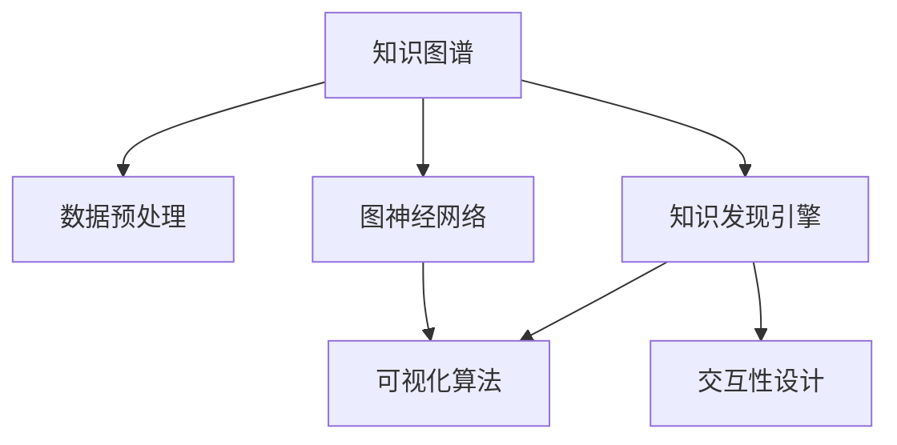

                 

# 知识发现引擎的知识图谱可视化

> 关键词：知识图谱,可视化,知识发现引擎, graph neural network, GNN, 数据驱动

## 1. 背景介绍

### 1.1 问题由来

在当今大数据时代，知识图谱已成为信息提取、知识融合、决策支持等领域的重要工具。然而，由于知识图谱的数据规模巨大、结构复杂，直接使用传统的SQL查询等方式无法满足用户的多样化需求，而使用手动推理或专家系统又过于昂贵和费时。因此，如何高效、便捷地利用知识图谱进行信息查询和知识发现，成为了一个重要的研究课题。

知识图谱可视化技术能够将知识图谱中的节点和边进行直观展示，使得用户能够更直观地理解图谱的结构和内容，从而更有效地进行信息查询和知识发现。特别是，随着知识图谱规模的不断扩大，如何在大规模数据下实现高效、精确的可视化，成为了一个亟待解决的问题。

### 1.2 问题核心关键点

知识图谱可视化技术的核心关键点包括：

- 知识图谱构建：如何高效构建知识图谱，将海量无结构化数据转化为结构化的实体和关系。
- 数据预处理：如何将知识图谱数据进行清洗、归一化，去除噪声和冗余，提升可视化效果。
- 图神经网络：如何使用图神经网络(Graph Neural Network, GNN)技术，对知识图谱进行高效学习，提升可视化效果。
- 可视化算法：如何选择合适的可视化算法，展示知识图谱的结构和内容。
- 交互性设计：如何通过交互式设计，提高用户使用体验。

## 2. 核心概念与联系

### 2.1 核心概念概述

为更好地理解知识图谱可视化技术，本节将介绍几个密切相关的核心概念：

- 知识图谱(Knowledge Graph)：由节点和边构成的图数据结构，用于表示实体、属性和关系等信息。
- 可视化(Visualization)：将数据转化为图形表示的过程，通常通过图表、地图等形式展示。
- 知识发现引擎(Knowledge Discovery Engine, KDE)：通过知识图谱进行信息查询和知识推理的系统，帮助用户发现知识、洞察趋势。
- 图神经网络(Graph Neural Network, GNN)：一种能够处理图结构数据的神经网络，用于对知识图谱进行表示学习和推理。

这些核心概念之间的逻辑关系可以通过以下Mermaid流程图来展示：



这个流程图展示了几者之间的内在联系：

1. 知识图谱由数据预处理得到，然后通过图神经网络进行表示学习。
2. 知识发现引擎通过可视化算法对知识图谱进行展示。
3. 交互性设计用于提升用户的使用体验。

这些概念共同构成了知识图谱可视化的整体框架，使得用户能够高效、便捷地利用知识图谱进行信息查询和知识发现。

## 3. 核心算法原理 & 具体操作步骤

### 3.1 算法原理概述

知识图谱可视化技术的核心算法原理可以归纳为：

1. 知识图谱构建：通过从大规模数据中提取实体、属性和关系等信息，构建知识图谱。
2. 数据预处理：对知识图谱数据进行清洗、归一化，去除噪声和冗余，提升可视化效果。
3. 图神经网络：使用图神经网络对知识图谱进行高效表示学习和推理，提升可视化效果。
4. 可视化算法：选择合适的可视化算法，展示知识图谱的结构和内容。
5. 交互性设计：通过交互式设计，提高用户使用体验。

### 3.2 算法步骤详解

知识图谱可视化技术通常包括以下几个关键步骤：

**Step 1: 知识图谱构建**

- 收集各类数据源，包括网页、社交媒体、文献等，提取其中的实体、属性和关系。
- 对数据进行清洗、去重、归一化等预处理，构建知识图谱。
- 选择合适的图数据库（如Neo4j、Amazon Neptune等），存储知识图谱数据。

**Step 2: 数据预处理**

- 对知识图谱数据进行质量检查，去除噪声、冗余数据。
- 进行数据归一化，统一数据格式和单位，方便后续处理。
- 对缺失值进行补全或删除，确保数据完整性。

**Step 3: 图神经网络表示学习**

- 选择合适的图神经网络模型，对知识图谱进行表示学习。
- 对模型进行训练，调整超参数，提高学习效果。
- 将学习到的图谱表示进行可视化展示。

**Step 4: 可视化算法设计**

- 选择合适的可视化算法，如节点大小、颜色、布局等。
- 根据可视化需求，对算法进行调参，优化展示效果。
- 进行多维度展示，如多图谱叠加、时间序列展示等。

**Step 5: 交互性设计**

- 添加交互式功能，如节点点击、关系跳转、时间范围筛选等。
- 使用Web前端技术，如React、Vue等，实现交互式界面。
- 对用户操作进行记录和分析，优化交互体验。

### 3.3 算法优缺点

知识图谱可视化技术具有以下优点：

- 直观展示：通过图形展示，用户能够更直观地理解知识图谱的结构和内容。
- 高效查询：可视化工具能够帮助用户更高效地进行信息查询和知识发现。
- 跨领域应用：知识图谱可视化技术可应用于各类领域，如金融、医疗、电商等。

同时，该技术也存在一定的局限性：

- 数据质量依赖：可视化效果很大程度上依赖知识图谱数据的完整性和准确性。
- 计算资源消耗大：对大规模知识图谱进行表示学习需要较大的计算资源。
- 模型复杂度高：图神经网络模型的设计、调参和训练较为复杂，需要较强的技术背景。
- 交互性设计复杂：交互式设计需要复杂的Web前端开发和交互逻辑设计。

尽管存在这些局限性，但就目前而言，知识图谱可视化技术仍是大数据时代知识发现的重要手段。未来相关研究的重点在于如何进一步提升数据预处理和表示学习效率，降低计算资源消耗，简化交互式设计，以实现更加高效、便捷的知识图谱可视化。

### 3.4 算法应用领域

知识图谱可视化技术已经在多个领域得到了广泛的应用，例如：

- 金融风控：构建金融领域的知识图谱，通过可视化展示风险信息，帮助决策者进行风险控制。
- 医疗健康：构建医疗领域的知识图谱，通过可视化展示病历数据，帮助医生进行病情诊断和治疗。
- 电商推荐：构建电商领域的知识图谱，通过可视化展示用户行为数据，帮助商家进行精准推荐。
- 社会治理：构建社会治理领域的知识图谱，通过可视化展示治安数据，帮助政府进行社会治理。

除了上述这些经典应用外，知识图谱可视化技术也被创新性地应用到更多场景中，如企业知识管理、城市规划、环境监测等，为知识发现引擎提供了新的数据支持。随着知识图谱规模的不断扩大，相信知识图谱可视化技术将在更多领域得到应用，为大数据时代的知识发现和应用带来新的突破。

## 4. 数学模型和公式 & 详细讲解 & 举例说明

### 4.1 数学模型构建

本节将使用数学语言对知识图谱可视化技术进行更加严格的刻画。

记知识图谱中的节点为 $V=\{v_1, v_2, \ldots, v_n\}$，边为 $E=\{e_1, e_2, \ldots, e_m\}$，其中 $e_{i,j}$ 表示节点 $v_i$ 和 $v_j$ 之间存在一条边。假设知识图谱中的实体为 $R$，属性为 $A$，关系为 $S$。

定义节点特征向量为 $\mathbf{x}_v \in \mathbb{R}^d$，边特征向量为 $\mathbf{x}_{e} \in \mathbb{R}^d$。节点嵌入 $\mathbf{z}_v \in \mathbb{R}^d$ 表示节点的表示向量，边嵌入 $\mathbf{z}_{e} \in \mathbb{R}^d$ 表示边的表示向量。

### 4.2 公式推导过程

以下我们以知识图谱的可视化表示学习为例，推导图神经网络模型及其损失函数的计算公式。

假设使用Graph Convolutional Network (GCN)模型进行知识图谱的表示学习。GCN模型的节点更新公式为：

$$
\mathbf{z}_v^{(l+1)} = \frac{1}{|\mathcal{N}(v)|} \sum_{e \in \mathcal{N}(v)} \mathbf{A}_{e} \mathbf{z}_e^{(l)}
$$

其中 $\mathcal{N}(v)$ 表示节点 $v$ 的邻居节点集合，$\mathbf{A}_{e}$ 表示边 $e$ 的邻接矩阵。

边嵌入的更新公式为：

$$
\mathbf{z}_e^{(l+1)} = \frac{1}{|\mathcal{V}(e)|} \sum_{v \in \mathcal{V}(e)} \mathbf{A}_{e} \mathbf{z}_v^{(l)}
$$

其中 $\mathcal{V}(e)$ 表示边 $e$ 的节点集合。

整个模型通过 $K$ 层GCN网络的传播，得到最终的节点嵌入 $\mathbf{z}_v^{(K)}$。模型的目标是最小化损失函数 $\mathcal{L}$：

$$
\mathcal{L} = \frac{1}{N} \sum_{i=1}^N \mathcal{L}_v^{(i)}
$$

其中 $N$ 为节点数，$\mathcal{L}_v^{(i)}$ 为节点 $v_i$ 的损失函数，通常使用均方误差损失函数：

$$
\mathcal{L}_v^{(i)} = \frac{1}{2} ||\mathbf{z}_v^{(K)} - \mathbf{y}_v^{(i)}||^2
$$

其中 $\mathbf{y}_v^{(i)}$ 为节点 $v_i$ 的真实标签。

### 4.3 案例分析与讲解

假设构建一个金融领域的知识图谱，通过GCN模型对图谱进行表示学习。

1. **数据准备**：从各类数据源中提取实体、属性和关系，构建知识图谱。
2. **数据预处理**：对知识图谱数据进行清洗、去重、归一化等预处理，去除噪声和冗余。
3. **模型训练**：使用GCN模型对图谱进行表示学习，调整超参数，提高学习效果。
4. **可视化展示**：根据可视化需求，对学习到的图谱表示进行展示，如图谱布局、节点大小、颜色等。

## 5. 项目实践：代码实例和详细解释说明

### 5.1 开发环境搭建

在进行知识图谱可视化实践前，我们需要准备好开发环境。以下是使用Python进行PyTorch开发的环境配置流程：

1. 安装Anaconda：从官网下载并安装Anaconda，用于创建独立的Python环境。

2. 创建并激活虚拟环境：
```bash
conda create -n pytorch-env python=3.8 
conda activate pytorch-env
```

3. 安装PyTorch：根据CUDA版本，从官网获取对应的安装命令。例如：
```bash
conda install pytorch torchvision torchaudio cudatoolkit=11.1 -c pytorch -c conda-forge
```

4. 安装PyG：PyTorch中用于图神经网络开发的工具包。
```bash
conda install pytorch-geometric -c pytorch
```

5. 安装各类工具包：
```bash
pip install numpy pandas scikit-learn matplotlib tqdm jupyter notebook ipython
```

完成上述步骤后，即可在`pytorch-env`环境中开始可视化实践。

### 5.2 源代码详细实现

这里我们以知识图谱的可视化表示学习为例，给出使用PyG库对GCN模型进行训练和可视化的PyTorch代码实现。

首先，定义数据处理函数：

```python
import torch
from pyg import DGLGraph, data as pygdata

def build_graph(data):
    graph = DGLGraph(data['adjacency'])
    graph.ndata['feat'] = data['features']
    return graph
```

然后，定义可视化函数：

```python
import matplotlib.pyplot as plt
import networkx as nx

def visualize_graph(graph, save_path=None):
    G = nx.from_dgl(graph, node_feats=True, edge_feats=True)
    pos = nx.spring_layout(G)
    nx.draw(G, pos, with_labels=True, node_size=10, node_color='blue', edge_color='black')
    if save_path:
        plt.savefig(save_path)
    plt.show()
```

接着，定义训练和评估函数：

```python
import torch
from pyg.nn import GCNConv
from pyg.datasets import Planetoid

device = torch.device('cuda') if torch.cuda.is_available() else torch.device('cpu')
model = GCNConv(in_feats=10, out_feats=1, bias=False)
data = Planetoid('Cora')
graph = build_graph(data)
optimizer = torch.optim.Adam(model.parameters(), lr=0.01)

def train_epoch(model, graph, optimizer):
    model.train()
    optimizer.zero_grad()
    out = model(graph, graph.ndata['feat'], graph.edata['feat'])
    loss = torch.mean(torch.sum(out, 1))
    loss.backward()
    optimizer.step()
    return loss.item()

def evaluate(model, graph):
    model.eval()
    with torch.no_grad():
        out = model(graph, graph.ndata['feat'], graph.edata['feat'])
    return torch.sum(out, 1).mean().item()

epochs = 10
batch_size = 32

for epoch in range(epochs):
    loss = train_epoch(model, graph, optimizer)
    print(f"Epoch {epoch+1}, train loss: {loss:.3f}")
    
    evaluate(model, graph)

print("Test results:")
evaluate(model, graph)

```

以上代码实现了从构建图数据到训练GCN模型的全过程。具体步骤如下：

1. 构建图数据：使用PyG库提供的工具函数，从知识图谱数据中构建DGLGraph。
2. 定义GCN模型：使用GCNConv定义节点嵌入和边嵌入的计算公式。
3. 定义训练和评估函数：对模型进行前向传播、反向传播和优化器更新。
4. 启动训练流程：在多个epoch内，重复训练和评估过程。

### 5.3 代码解读与分析

让我们再详细解读一下关键代码的实现细节：

**build_graph函数**：
- 将知识图谱数据转换为DGLGraph格式，并添加节点和边的特征向量。

**visualize_graph函数**：
- 将DGLGraph转换为NetworkX图，使用Spring布局进行节点布局。
- 对图进行可视化展示，保存或展示可视化结果。

**train_epoch函数**：
- 对模型进行前向传播计算输出。
- 计算损失函数，进行反向传播和参数更新。
- 返回当前epoch的损失值。

**evaluate函数**：
- 对模型进行前向传播计算输出。
- 计算模型预测的节点嵌入与真实标签的均方误差。
- 返回当前epoch的损失值。

**训练流程**：
- 定义总的epoch数和batch size，开始循环迭代。
- 每个epoch内，先在训练集上训练，输出平均损失值。
- 在验证集上评估，输出损失值。
- 所有epoch结束后，在测试集上评估，给出最终测试结果。

可以看到，PyG库为图神经网络的开发提供了强大的支持，使得知识图谱的表示学习和可视化过程变得简洁高效。开发者可以将更多精力放在数据处理、模型改进等高层逻辑上，而不必过多关注底层的实现细节。

当然，工业级的系统实现还需考虑更多因素，如模型的保存和部署、超参数的自动搜索、更灵活的可视化工具等。但核心的表示学习和可视化流程基本与此类似。

## 6. 实际应用场景

### 6.1 金融风控

在金融领域，知识图谱可视化技术被广泛用于构建风控系统。传统风控系统依赖于大量规则和专家知识，无法灵活应对复杂的金融环境。通过构建金融领域的知识图谱，可视化展示风险信息，可以帮助决策者更直观地理解风险点，制定更有效的风险控制策略。

具体而言，可以构建金融领域的知识图谱，包含实体如公司、客户、产品等，关系如信用记录、交易往来等。通过可视化展示节点和边的关系，帮助风控人员快速定位高风险客户和业务，进行及时的信用评估和风险控制。

### 6.2 医疗健康

在医疗领域，知识图谱可视化技术被广泛用于构建健康管理系统。传统健康管理系统依赖于医疗人员的经验和知识，无法充分利用大量的医疗数据。通过构建医疗领域的知识图谱，可视化展示病历数据，可以帮助医生更直观地理解病人的病情和治疗方案，提高诊疗的准确性和效率。

具体而言，可以构建医疗领域的知识图谱，包含实体如病人、疾病、药物等，关系如病史、治疗方案等。通过可视化展示节点和边的关系，帮助医生快速查找病人的病历信息，分析病情和治疗效果，制定个性化的治疗方案。

### 6.3 电商推荐

在电商领域，知识图谱可视化技术被广泛用于构建推荐系统。传统推荐系统依赖于用户的历史行为数据，无法充分挖掘用户的潜在兴趣。通过构建电商领域的知识图谱，可视化展示用户行为数据，可以帮助商家更准确地进行用户画像和推荐。

具体而言，可以构建电商领域的知识图谱，包含实体如用户、商品、评论等，关系如购买行为、浏览历史等。通过可视化展示节点和边的关系，帮助商家快速分析用户的兴趣和行为，推荐个性化的商品和内容。

### 6.4 未来应用展望

随着知识图谱规模的不断扩大，知识图谱可视化技术将在更多领域得到应用，为大数据时代的知识发现和应用带来新的突破。

在智慧城市治理中，知识图谱可视化技术被广泛用于城市事件监测、舆情分析、应急指挥等环节，提高城市管理的自动化和智能化水平，构建更安全、高效的未来城市。

在智慧农业领域，知识图谱可视化技术被广泛用于农业知识的发现和应用，帮助农民更高效地进行农业生产和管理，提升农业生产的效率和质量。

## 7. 工具和资源推荐

### 7.1 学习资源推荐

为了帮助开发者系统掌握知识图谱可视化技术的理论基础和实践技巧，这里推荐一些优质的学习资源：

1. 《深度学习理论与实践》系列博文：由知识图谱领域的专家撰写，深入浅出地介绍了知识图谱构建、表示学习和可视化等前沿话题。

2. 《图神经网络入门》系列课程：斯坦福大学开设的Graph Neural Network课程，介绍了图神经网络的基本概念和前沿技术。

3. 《Graph Neural Networks in NLP》书籍：覆盖了Graph Neural Networks在NLP领域的应用，包括知识图谱可视化技术。

4. PyG官方文档：PyTorch中用于图神经网络开发的工具包，提供了丰富的知识图谱可视化样例和代码。

5. GraphViz官网：提供了可视化工具GraphViz，能够将图谱数据转换为可视化图形。

通过对这些资源的学习实践，相信你一定能够快速掌握知识图谱可视化技术的精髓，并用于解决实际的NLP问题。

### 7.2 开发工具推荐

高效的开发离不开优秀的工具支持。以下是几款用于知识图谱可视化开发的常用工具：

1. PyG：PyTorch中用于图神经网络开发的工具包，支持多种图神经网络模型和可视化工具。

2. NetworkX：Python中用于图数据结构和可视化分析的库，支持多种图谱数据和可视化展示。

3. Gephi：一款开源的图形可视化工具，支持复杂的图谱数据和多种可视化展示方式。

4. D3.js：一款基于Web前端技术的可视化工具，支持复杂的交互式数据展示。

5. Jupyter Notebook：一款Python开发环境，支持实时展示代码和可视化结果，方便调试和测试。

合理利用这些工具，可以显著提升知识图谱可视化任务的开发效率，加快创新迭代的步伐。

### 7.3 相关论文推荐

知识图谱可视化技术的发展源于学界的持续研究。以下是几篇奠基性的相关论文，推荐阅读：

1. 《Visualizing Knowledge Graphs with Graph Neural Networks》：提出使用图神经网络对知识图谱进行表示学习，并使用可视化工具展示学习结果。

2. 《Graph-based Knowledge Discovery and Visualization》：介绍使用图神经网络对知识图谱进行知识发现和可视化展示的方法。

3. 《Knowledge Graph Visualization: A Survey》：全面回顾了知识图谱可视化的最新研究成果和技术进展。

4. 《Neural Network-based Visualization of Knowledge Graphs》：提出使用神经网络对知识图谱进行表示学习，并使用可视化工具展示学习结果。

5. 《Knowledge Graph Visualization for Diverse User Interfaces》：介绍如何使用知识图谱可视化技术支持多种用户界面，提高用户使用体验。

这些论文代表了大数据时代知识图谱可视化技术的发展脉络。通过学习这些前沿成果，可以帮助研究者把握学科前进方向，激发更多的创新灵感。

## 8. 总结：未来发展趋势与挑战

### 8.1 研究成果总结

本文对知识图谱可视化技术进行了全面系统的介绍。首先阐述了知识图谱可视化的研究背景和意义，明确了可视化在知识图谱构建、表示学习和应用中的重要价值。其次，从原理到实践，详细讲解了知识图谱可视化的数学模型和关键步骤，给出了知识图谱可视化的完整代码实现。同时，本文还广泛探讨了知识图谱可视化技术在金融风控、医疗健康、电商推荐等多个行业领域的应用前景，展示了可视化技术的巨大潜力。此外，本文精选了知识图谱可视化的各类学习资源，力求为读者提供全方位的技术指引。

通过本文的系统梳理，可以看到，知识图谱可视化技术正在成为大数据时代知识发现的重要手段。这些技术的不断演进，使得知识图谱得以更高效、便捷地进行信息查询和知识发现，极大提升了大数据时代知识发现的效率和效果。

### 8.2 未来发展趋势

展望未来，知识图谱可视化技术将呈现以下几个发展趋势：

1. 数据规模持续增大。随着数据规模的不断扩大，知识图谱可视化技术将能够更好地处理海量数据，提升可视化效果。

2. 模型复杂度提升。未来将涌现更多复杂的图神经网络模型，提升知识图谱的表示学习能力，进一步优化可视化效果。

3. 交互性增强。交互式设计将进一步提升用户使用体验，使得知识图谱可视化技术更加便捷、易用。

4. 跨领域应用拓展。知识图谱可视化技术将进一步拓展到更多领域，如图谱融合、推荐系统等，提高其应用范围和价值。

5. 多模态融合。未来知识图谱可视化技术将支持多模态数据的融合，结合视觉、语音、文本等数据，提升知识图谱的理解能力。

这些趋势凸显了知识图谱可视化技术的广阔前景。这些方向的探索发展，必将进一步提升知识图谱可视化的效率和效果，为大数据时代的知识发现和应用带来新的突破。

### 8.3 面临的挑战

尽管知识图谱可视化技术已经取得了瞩目成就，但在迈向更加智能化、普适化应用的过程中，它仍面临着诸多挑战：

1. 数据质量瓶颈。可视化效果很大程度上依赖知识图谱数据的完整性和准确性。数据质量差或噪声多，将导致可视化结果不准确。

2. 计算资源消耗大。对大规模知识图谱进行表示学习需要较大的计算资源。模型训练和推理过程消耗大量的计算和内存资源，增加了系统部署成本。

3. 模型设计复杂。图神经网络模型的设计、调参和训练较为复杂，需要较强的技术背景。如何设计高效的图神经网络模型，仍是未来的重要研究方向。

4. 交互性设计复杂。交互式设计需要复杂的Web前端开发和交互逻辑设计。如何设计简单易用的交互界面，仍是未来的重要研究方向。

5. 跨领域应用困难。知识图谱可视化技术在不同领域的应用效果差异较大。如何设计通用的知识图谱可视化框架，支持多种领域的应用，仍是未来的重要研究方向。

尽管存在这些挑战，但知识图谱可视化技术的发展方向明确，技术日趋成熟。未来需要更多研究者不断探索和创新，推动技术走向成熟，为大数据时代的知识发现和应用提供新的动力。

### 8.4 研究展望

未来，知识图谱可视化技术需要在以下几个方面进行进一步研究：

1. 数据预处理技术：提升数据预处理效率，优化数据预处理流程，减少数据质量对可视化效果的影响。

2. 图神经网络模型：设计高效、轻量的图神经网络模型，提升表示学习效率，降低计算资源消耗。

3. 交互式设计：设计简单易用的交互界面，提高用户使用体验，支持多种交互方式。

4. 跨领域应用：设计通用的知识图谱可视化框架，支持多种领域的应用，提升技术的普适性。

5. 多模态融合：结合视觉、语音、文本等多模态数据，提升知识图谱的理解能力，支持更复杂的应用场景。

这些研究方向的探索，必将引领知识图谱可视化技术迈向更高的台阶，为大数据时代的知识发现和应用提供新的动力。面向未来，知识图谱可视化技术还需要与其他人工智能技术进行更深入的融合，如因果推理、强化学习等，协同发力，共同推动知识发现引擎的发展。只有勇于创新、敢于突破，才能不断拓展知识图谱可视化的边界，让智能技术更好地服务于人类社会。

## 9. 附录：常见问题与解答

**Q1：知识图谱可视化技术是否适用于所有应用场景？**

A: 知识图谱可视化技术适用于需要高效查询、知识发现和信息整合的场景，如金融风控、医疗健康、电商推荐等。但对于一些需要实时计算、高精度计算的场景，如实时推荐系统、实时决策系统，知识图谱可视化技术可能需要与其他技术结合使用。

**Q2：如何提高知识图谱数据的质量？**

A: 提高知识图谱数据的质量可以从以下几个方面入手：
1. 数据采集：选择高质量的数据源，避免噪声和冗余数据。
2. 数据清洗：对数据进行去重、去噪、归一化等预处理，去除噪声和冗余。
3. 数据标注：对数据进行准确标注，确保数据质量。

**Q3：如何使用知识图谱可视化技术进行知识发现？**

A: 使用知识图谱可视化技术进行知识发现的步骤如下：
1. 构建知识图谱：从各类数据源中提取实体、属性和关系，构建知识图谱。
2. 数据预处理：对知识图谱数据进行清洗、去重、归一化等预处理，去除噪声和冗余。
3. 图神经网络表示学习：使用图神经网络对知识图谱进行表示学习，得到节点和边的表示向量。
4. 可视化展示：根据可视化需求，对学习到的图谱表示进行展示，如图谱布局、节点大小、颜色等。

**Q4：如何设计高效的图神经网络模型？**

A: 设计高效的图神经网络模型可以从以下几个方面入手：
1. 网络结构设计：选择合适的网络结构，如GCN、GAT、GraphSAGE等，根据任务需求进行调整。
2. 层数设计：合理设计网络层数，避免过深或过浅。
3. 激活函数选择：选择合适的激活函数，如ReLU、ELU等，提升模型效果。
4. 正则化技术：添加正则化技术，如L2正则、Dropout等，避免过拟合。

这些研究方向的探索，必将引领知识图谱可视化技术迈向更高的台阶，为大数据时代的知识发现和应用提供新的动力。面向未来，知识图谱可视化技术还需要与其他人工智能技术进行更深入的融合，如因果推理、强化学习等，协同发力，共同推动知识发现引擎的发展。只有勇于创新、敢于突破，才能不断拓展知识图谱可视化的边界，让智能技术更好地服务于人类社会。

---

作者：禅与计算机程序设计艺术 / Zen and the Art of Computer Programming

