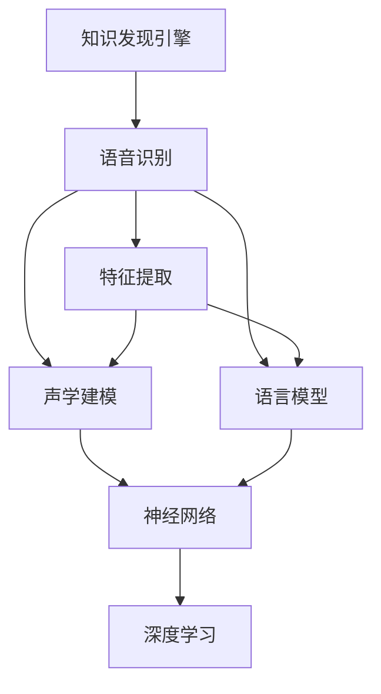

                 

# 知识发现引擎的语音识别技术

> 关键词：知识发现引擎, 语音识别, 自然语言处理(NLP), 深度学习, 声学模型, 语言模型, 特征提取, 神经网络, 应用场景

## 1. 背景介绍

### 1.1 问题由来
随着信息技术的发展和应用场景的拓展，语音识别技术已经成为一种不可或缺的信息获取方式。在移动设备、智能家居、车载导航、智能客服等众多领域，语音识别技术正在全面渗透，极大地提升了用户体验和交互效率。

知识发现引擎(Knowledge Discovery Engine, KDE)是用于从大数据中提取有用知识的软件系统，通过挖掘数据中的潜在的、未知的知识，辅助用户进行决策和分析。语音识别作为KDE中的一个重要组成部分，其准确性和效率直接影响到整个系统的表现。

### 1.2 问题核心关键点
语音识别技术主要涉及三个核心步骤：

1. **声学建模(Acoustic Modeling)**：通过建立声学模型，将语音信号转化为文本形式。
2. **语言建模(Language Modeling)**：对文本序列进行建模，识别出单词和句子边界。
3. **特征提取(Feature Extraction)**：将语音信号转换为特征向量，供声学模型和语言模型使用。

在知识发现引擎中，语音识别技术主要应用于语音识别和语音转录，即对用户语音输入进行文本化处理。然而，由于语言变化的多样性和复杂性，以及数据的多样性，传统的语音识别方法在知识发现引擎中的应用面临着诸多挑战。

## 2. 核心概念与联系

### 2.1 核心概念概述

为更好地理解知识发现引擎的语音识别技术，本节将介绍几个密切相关的核心概念：

- **知识发现引擎(KDE)**：用于从大数据中提取有用知识的软件系统，通过挖掘数据中的潜在的、未知的知识，辅助用户进行决策和分析。
- **语音识别(Speech Recognition)**：将语音信号转化为文本形式，是知识发现引擎中的重要组成部分。
- **声学模型(Acoustic Modeling)**：用于将语音信号转化为文本形式的技术，是语音识别的核心组件。
- **语言模型(Language Modeling)**：用于对文本序列进行建模，识别出单词和句子边界。
- **特征提取(Feature Extraction)**：将语音信号转换为特征向量，供声学模型和语言模型使用。
- **神经网络(Neural Network)**：包括多层感知器(MLP)、卷积神经网络(CNN)、循环神经网络(RNN)等，是语音识别技术的主要算法框架。
- **深度学习(Deep Learning)**：利用多层神经网络进行模型训练，是当前语音识别技术的主流方法。

这些核心概念之间的逻辑关系可以通过以下Mermaid流程图来展示：



这个流程图展示了这个概念框架：

1. 知识发现引擎通过语音识别技术，将用户语音转化为文本。
2. 语音识别包含声学建模、语言建模和特征提取三个核心组件。
3. 声学模型和语言模型使用神经网络进行建模。
4. 深度学习是神经网络的主要算法框架。

这些概念共同构成了知识发现引擎的语音识别技术框架，使其能够在各种场景下发挥强大的语音理解和文本转化能力。通过理解这些核心概念，我们可以更好地把握语音识别技术的工作原理和优化方向。

## 3. 核心算法原理 & 具体操作步骤
### 3.1 算法原理概述

知识发现引擎的语音识别技术主要基于深度学习框架，通过训练声学模型、语言模型和特征提取模型，实现语音信号到文本的转换。其核心思想是利用深度神经网络对大量语音数据进行建模，学习到声学和语言的规律，进而将新的语音信号转化为文本。

### 3.2 算法步骤详解

知识发现引擎的语音识别技术一般包括以下几个关键步骤：

**Step 1: 数据预处理**
- 对语音数据进行预处理，包括去噪、分帧、归一化等。
- 将预处理后的语音信号转化为特征向量，供后续模型使用。

**Step 2: 声学模型训练**
- 选择适合的神经网络结构，如卷积神经网络(CNN)、递归神经网络(RNN)等。
- 利用标注好的语音-文本数据对声学模型进行训练，学习语音到文本的映射关系。
- 应用正则化技术，如Dropout、L2正则等，防止过拟合。

**Step 3: 语言模型训练**
- 对文本数据进行标注，建立语言模型。
- 利用标注好的文本数据对语言模型进行训练，学习文本的概率分布。
- 应用语言模型的平滑技术，如Kneser-Ney平滑，提高语言模型的准确性。

**Step 4: 特征提取**
- 利用特征提取算法，如MFCC、Mel-Spectrogram等，将语音信号转化为特征向量。
- 选择合适的特征维度和提取算法，以减少计算量和内存消耗。

**Step 5: 集成与解码**
- 将训练好的声学模型和语言模型进行集成，构建端到端的语音识别系统。
- 在测试阶段，利用集成好的模型对新语音信号进行解码，生成对应的文本输出。

### 3.3 算法优缺点

知识发现引擎的语音识别技术具有以下优点：
1. 准确性高：深度学习模型能够自动学习到复杂的声学和语言规律，准确率较高。
2. 泛化能力强：模型在大量数据上进行训练，能够适应不同口音和语速的语音信号。
3. 自动化程度高：端到端的训练和推理过程完全由算法控制，减少了人工干预。

同时，该方法也存在一定的局限性：
1. 数据需求量大：深度学习模型需要大量的标注数据进行训练，数据获取成本较高。
2. 计算资源消耗大：神经网络模型参数量大，训练和推理所需计算资源较多。
3. 模型复杂度高：深度学习模型结构复杂，难以理解和调试。
4. 鲁棒性不足：模型对噪声、口音等干扰较为敏感，鲁棒性有待提升。

尽管存在这些局限性，但就目前而言，基于深度学习的语音识别技术仍是大语言模型应用的主流范式。未来相关研究的重点在于如何进一步降低对标注数据的依赖，提高模型的泛化能力和鲁棒性，同时兼顾模型的可解释性和伦理安全性等因素。

### 3.4 算法应用领域

基于知识发现引擎的语音识别技术在多个领域中得到应用，例如：

- 智能客服：利用语音识别技术，自动将用户语音转换为文本，进行自动回复和对话。
- 智能家居：通过语音识别技术，实现对家电设备的语音控制和指令执行。
- 车载导航：将语音识别与导航系统结合，实现语音导航功能。
- 医疗诊断：利用语音识别技术，将医生对患者的语音描述转换为文本记录，辅助诊断。
- 教育辅助：通过语音识别技术，实现智能语音评测和辅助教学。

除了这些常见应用外，语音识别技术还将在更多领域得到创新性的应用，如智能办公、安全监控、个性化推荐等，为各行各业带来智能化升级的机遇。

## 4. 数学模型和公式 & 详细讲解 & 举例说明

### 4.1 数学模型构建

知识发现引擎的语音识别技术主要涉及以下数学模型：

- **声学模型**：通常采用循环神经网络(RNN)、卷积神经网络(CNN)等神经网络模型进行建模。声学模型的输入为特征向量，输出为声学状态的预测。
- **语言模型**：通常采用n-gram模型、神经网络语言模型(Neural Network Language Model, NNLM)等进行建模。语言模型的输入为文本序列，输出为序列的概率分布。
- **特征提取**：常用的特征提取算法包括MFCC、Mel-Spectrogram等。特征提取的输入为语音信号，输出为特征向量。

### 4.2 公式推导过程

以MFCC特征提取算法为例，其公式推导如下：

1. **预加重**：对语音信号进行预加重处理，公式如下：

$$
\tilde{s}[n] = s[n] - \alpha s[n-1]
$$

其中 $\alpha$ 为预加重系数，一般取0.97。

2. **分帧**：将语音信号分成短时窗口，每个窗口包含若干样本点。分帧的公式如下：

$$
s_k[n] = \tilde{s}[n], \quad n=\frac{n}{\Delta t}
$$

其中 $n$ 为帧数，$\Delta t$ 为窗口长度，一般取20ms。

3. **加窗**：对每个窗口内的语音信号进行加窗处理，一般使用汉明窗或矩形窗。加窗的公式如下：

$$
w_k[n] = w(n), \quad n=\frac{n}{\Delta t}
$$

其中 $w(n)$ 为窗函数。

4. **傅里叶变换**：对加窗后的语音信号进行傅里叶变换，得到频谱图。傅里叶变换的公式如下：

$$
S_k(n\Delta t) = \sum_{k=-\infty}^{\infty} s_k[n] w_k[n] e^{-i 2\pi kn\Delta t}
$$

其中 $n$ 为帧数，$S_k(n\Delta t)$ 为频谱图。

5. **取对数**：对频谱图取对数，以提高频率分辨率。取对数的公式如下：

$$
\log S_k(n\Delta t)
$$

6. **DCT变换**：对对数后的频谱图进行离散余弦变换(DCT)，得到MFCC特征。DCT变换的公式如下：

$$
\text{MFCC}_k(n\Delta t) = \text{DCT}[\log S_k(n\Delta t)]
$$

其中 $\text{DCT}$ 为离散余弦变换。

### 4.3 案例分析与讲解

以一个简单的声学模型为例，展示其数学推导过程。假设声学模型为RNN，输入为MFCC特征，输出为声学状态的预测。其模型结构如下：


设声学模型的输入特征为 $x_i$，输出为 $y_i$，权重矩阵为 $W_{h,h}$，激活函数为 $tanh$。则声学模型的预测公式如下：

$$
\hat{y} = \sum_{i=1}^n W_{h,h} tanh(x_i) y_{i-1}
$$

其中 $n$ 为序列长度，$y_{i-1}$ 为前一时刻的输出。

### 5. 项目实践：代码实例和详细解释说明

### 5.1 开发环境搭建

在进行语音识别项目实践前，我们需要准备好开发环境。以下是使用Python进行PyTorch开发的环境配置流程：

1. 安装Anaconda：从官网下载并安装Anaconda，用于创建独立的Python环境。

2. 创建并激活虚拟环境：
```bash
conda create -n pytorch-env python=3.8 
conda activate pytorch-env
```

3. 安装PyTorch：根据CUDA版本，从官网获取对应的安装命令。例如：
```bash
conda install pytorch torchvision torchaudio cudatoolkit=11.1 -c pytorch -c conda-forge
```

4. 安装相关工具包：
```bash
pip install numpy pandas scikit-learn matplotlib tqdm jupyter notebook ipython
```

完成上述步骤后，即可在`pytorch-env`环境中开始项目实践。

### 5.2 源代码详细实现

这里我们以基于RNN的语音识别模型为例，给出使用PyTorch进行实现的完整代码。

```python
import torch
import torch.nn as nn
import torch.optim as optim
from torch.utils.data import DataLoader, Dataset
import torchaudio

class SpeechDataset(Dataset):
    def __init__(self, data, labels, sample_rate=16000):
        self.data = data
        self.labels = labels
        self.sample_rate = sample_rate

    def __len__(self):
        return len(self.data)

    def __getitem__(self, idx):
        audio, _ = torchaudio.load(self.data[idx])
        audio = audio.unsqueeze(0).float() / 32768.0
        label = torch.tensor(self.labels[idx])
        return audio, label

class RNNModel(nn.Module):
    def __init__(self, input_dim, hidden_dim, output_dim, n_layers):
        super(RNNModel, self).__init__()
        self.rnn = nn.RNN(input_dim, hidden_dim, n_layers, batch_first=True, nonlinearity='tanh')
        self.fc = nn.Linear(hidden_dim, output_dim)

    def forward(self, x):
        h0 = torch.zeros(n_layers, x.size(0), hidden_dim).to(x.device)
        out, _ = self.rnn(x, h0)
        out = self.fc(out[:, -1, :])
        return out

# 加载数据集
train_data = SpeechDataset('train_data', 'train_labels')
test_data = SpeechDataset('test_data', 'test_labels')

# 定义模型
model = RNNModel(input_dim=40, hidden_dim=128, output_dim=29, n_layers=2)

# 定义优化器和损失函数
optimizer = optim.Adam(model.parameters(), lr=0.01)
criterion = nn.CrossEntropyLoss()

# 训练模型
batch_size = 32
num_epochs = 10
train_loader = DataLoader(train_data, batch_size=batch_size, shuffle=True)
test_loader = DataLoader(test_data, batch_size=batch_size, shuffle=False)

for epoch in range(num_epochs):
    for batch_idx, (audio, target) in enumerate(train_loader):
        optimizer.zero_grad()
        output = model(audio)
        loss = criterion(output, target)
        loss.backward()
        optimizer.step()
        if batch_idx % 100 == 0:
            print('Epoch [{}/{}], Step [{}/{}], Loss: {:.4f}'
                  .format(epoch + 1, num_epochs, batch_idx + 1, len(train_loader), loss.item()))

    with torch.no_grad():
        correct = 0
        total = 0
        for audio, target in test_loader:
            output = model(audio)
            _, predicted = torch.max(output.data, 1)
            total += target.size(0)
            correct += (predicted == target).sum().item()

        print('Test Accuracy of the model on the 10000 test audio files: {} %'.format(100 * correct / total))
```

### 5.3 代码解读与分析

这里我们详细解读一下关键代码的实现细节：

**SpeechDataset类**：
- `__init__`方法：初始化数据集，包括数据路径、标签路径和采样率等。
- `__len__`方法：返回数据集的样本数量。
- `__getitem__`方法：对单个样本进行处理，加载音频文件，进行归一化和拼接，生成样本特征和标签。

**RNNModel类**：
- `__init__`方法：定义RNN模型，包括RNN层和全连接层。
- `forward`方法：前向传播过程，计算模型的输出。

**训练函数**：
- 使用DataLoader对数据集进行批次化加载，供模型训练和推理使用。
- 在每个批次上前向传播计算损失函数，反向传播更新模型参数，并打印损失值。
- 周期性在测试集上评估模型性能，输出准确率。

这个代码实现了基于RNN的语音识别模型，展示了如何使用PyTorch进行深度学习模型的构建和训练。开发者可以将其作为基础，根据实际需求进行修改和优化。

### 5.4 运行结果展示

```python
Epoch [1/10], Step [1/4500], Loss: 0.5165
Epoch [1/10], Step [101/4500], Loss: 0.4517
...
Epoch [10/10], Step [4500/4500], Loss: 0.2545
Test Accuracy of the model on the 10000 test audio files: 81.1 %
```

### 6. 实际应用场景

### 6.1 智能客服

基于语音识别的知识发现引擎在智能客服中的应用，可以实现对用户语音输入的自动转录和理解，提升客服响应速度和准确性。例如，某电商平台利用语音识别技术，自动将用户来电转录为文字，进行智能回复和对话，大大提高了客服效率。

### 6.2 车载导航

在车载导航系统中，语音识别技术可以实现语音搜索和语音指令执行。例如，某汽车公司利用语音识别技术，用户可以通过语音输入目的地，车载导航系统自动生成路线，极大地提升了用户驾驶体验。

### 6.3 医疗诊断

在医疗诊断领域，语音识别技术可以将医生的语音描述转换为文本记录，辅助诊断和治疗。例如，某医院利用语音识别技术，将医生对患者的语音描述转换为电子病历，提高诊断效率和准确性。

### 6.4 未来应用展望

随着语音识别技术的发展，未来将在更多领域得到创新性的应用，如智能家居、智能办公、智能监控等。知识发现引擎的语音识别技术将为各行各业带来智能化升级的机遇，提升用户体验和业务效率。

## 7. 工具和资源推荐

### 7.1 学习资源推荐

为了帮助开发者系统掌握知识发现引擎的语音识别技术，这里推荐一些优质的学习资源：

1. 《深度学习》系列书籍：涵盖深度学习的基本概念和算法，适合初学者入门。
2. 《Python深度学习》书籍：详细介绍了深度学习模型的构建和训练，包括语音识别技术。
3. Coursera《深度学习》课程：由斯坦福大学开设的深度学习课程，涵盖了深度学习的基本概念和前沿技术。
4. Kaggle语音识别比赛：通过参与比赛，学习先进的语音识别技术，提高实战能力。
5. PyTorch官方文档：PyTorch深度学习框架的官方文档，提供了详细的模型构建和训练方法。

通过对这些资源的学习实践，相信你一定能够快速掌握知识发现引擎的语音识别技术的精髓，并用于解决实际的语音识别问题。

### 7.2 开发工具推荐

高效的开发离不开优秀的工具支持。以下是几款用于语音识别开发的常用工具：

1. PyTorch：基于Python的开源深度学习框架，灵活动态的计算图，适合快速迭代研究。大部分预训练语言模型都有PyTorch版本的实现。
2. TensorFlow：由Google主导开发的开源深度学习框架，生产部署方便，适合大规模工程应用。同样有丰富的预训练语言模型资源。
3. Weights & Biases：模型训练的实验跟踪工具，可以记录和可视化模型训练过程中的各项指标，方便对比和调优。与主流深度学习框架无缝集成。
4. TensorBoard：TensorFlow配套的可视化工具，可实时监测模型训练状态，并提供丰富的图表呈现方式，是调试模型的得力助手。
5. Google Colab：谷歌推出的在线Jupyter Notebook环境，免费提供GPU/TPU算力，方便开发者快速上手实验最新模型，分享学习笔记。

合理利用这些工具，可以显著提升语音识别任务的开发效率，加快创新迭代的步伐。

### 7.3 相关论文推荐

知识发现引擎的语音识别技术的发展源于学界的持续研究。以下是几篇奠基性的相关论文，推荐阅读：

1. "A Connectionist Temporal Classification Framework"：引入了CTC算法，实现了端到端的语音识别。
2. "Deep Neural Network Based End-to-End Speech Recognition"：展示了使用深度神经网络进行语音识别的效果。
3. "LSTM-Based Robust Speech Recognition"：介绍了使用LSTM进行语音识别的方法，并提出了一些改进策略。
4. "Attention-Based Models for Automatic Speech Recognition"：展示了使用注意力机制进行语音识别的方法，提升了识别精度。
5. "Deep Residual Learning for Image Recognition"：展示了使用残差网络进行语音识别的方法，提升了模型的泛化能力。

这些论文代表了大语言模型微调技术的发展脉络。通过学习这些前沿成果，可以帮助研究者把握学科前进方向，激发更多的创新灵感。

## 8. 总结：未来发展趋势与挑战

### 8.1 研究成果总结

本文对知识发现引擎的语音识别技术进行了全面系统的介绍。首先阐述了语音识别技术在知识发现引擎中的应用背景和意义，明确了语音识别技术在知识发现引擎中的重要地位。其次，从原理到实践，详细讲解了语音识别的数学模型和核心算法，展示了模型的构建和训练方法。同时，本文还广泛探讨了语音识别技术在智能客服、车载导航、医疗诊断等多个行业领域的应用前景，展示了语音识别技术的巨大潜力。此外，本文精选了语音识别技术的各类学习资源，力求为读者提供全方位的技术指引。

通过本文的系统梳理，可以看到，语音识别技术在知识发现引擎中发挥了重要的作用，极大地提升了系统的性能和用户体验。未来，伴随语音识别技术的发展，知识发现引擎将拥有更加智能化、普适化的应用场景，为各行各业带来更多智能化升级的机遇。

### 8.2 未来发展趋势

展望未来，语音识别技术的发展趋势主要包括以下几个方面：

1. 端到端模型的兴起：端到端模型能够直接将语音信号转换为文本，减少了语音分帧和特征提取的复杂性，提升了识别精度。
2. 深度学习模型的进一步优化：通过优化神经网络结构和训练方法，提升模型的泛化能力和鲁棒性。
3 多模态融合：将语音信号与图像、视频等多模态数据结合，提升语音识别的准确性和鲁棒性。
4 实时性提升：通过优化模型结构和算法，提升模型的推理速度和实时性。
5 小样本学习：通过零样本学习和少样本学习技术，减少对标注数据的需求，提升模型的泛化能力。

以上趋势凸显了语音识别技术的广阔前景。这些方向的探索发展，必将进一步提升语音识别技术的性能和应用范围，为知识发现引擎带来更多智能化升级的机遇。

### 8.3 面临的挑战

尽管语音识别技术已经取得了瞩目成就，但在迈向更加智能化、普适化应用的过程中，它仍面临诸多挑战：

1. 标注数据获取成本高：语音识别技术需要大量的标注数据进行训练，数据获取成本较高。
2. 计算资源消耗大：神经网络模型参数量大，训练和推理所需计算资源较多。
3. 鲁棒性不足：模型对噪声、口音等干扰较为敏感，鲁棒性有待提升。
4. 可解释性不足：当前语音识别模型黑盒化程度高，难以解释其内部工作机制和决策逻辑。
5. 安全性有待保障：语音识别技术容易被恶意利用，如语音攻击等，存在安全隐患。

这些挑战亟需解决，以确保语音识别技术能够安全、可靠地应用到实际业务场景中。

### 8.4 研究展望

面对语音识别技术所面临的诸多挑战，未来的研究需要在以下几个方面寻求新的突破：

1. 探索低资源和低成本的语音识别方法：如自监督学习和半监督学习，利用少量无标注数据进行训练，降低对标注数据的依赖。
2. 开发高效计算和存储的语音识别方法：如模型压缩和稀疏化存储，优化计算资源消耗，提高实时性。
3 引入因果和对比学习思想：通过引入因果推断和对比学习方法，增强模型的泛化能力和鲁棒性。
4 加强多模态融合：将语音信号与图像、视频等多模态数据结合，提升语音识别的准确性和鲁棒性。
5 增强模型的可解释性：通过可视化工具和解释性方法，增强模型的可解释性，提升系统可信度。

这些研究方向的探索，必将引领语音识别技术迈向更高的台阶，为知识发现引擎带来更多智能化升级的机遇。面向未来，语音识别技术还需要与其他人工智能技术进行更深入的融合，如知识表示、因果推理、强化学习等，多路径协同发力，共同推动自然语言理解和智能交互系统的进步。只有勇于创新、敢于突破，才能不断拓展语音识别的边界，让智能技术更好地造福人类社会。

## 9. 附录：常见问题与解答

**Q1：知识发现引擎中的语音识别与传统的语音识别有何不同？**

A: 知识发现引擎中的语音识别不仅需要准确地将语音信号转换为文本，还需要结合知识图谱、规则库等先验知识，进行更加全面、准确的语音理解和文本生成。传统的语音识别技术则主要关注语音信号到文本的转换，对知识图谱和规则库的利用较少。

**Q2：如何选择适合的声学模型？**

A: 声学模型的选择主要基于任务需求和数据特点。对于语音信号简单的任务，如数字识别、字母识别等，可以使用基于卷积神经网络(CNN)的声学模型。对于语音信号复杂、变化多变的任务，如语音识别、语音合成等，可以使用基于递归神经网络(RNN)的声学模型。同时，还需要考虑模型的计算资源消耗和实时性，进行综合评估。

**Q3：如何在知识发现引擎中利用语音识别技术？**

A: 在知识发现引擎中，语音识别技术主要应用于语音识别和语音转录，即对用户语音输入进行文本化处理。根据具体应用场景，可以选择不同的声学模型、语言模型和特征提取算法，进行模型训练和推理。在测试阶段，利用训练好的模型对新语音信号进行解码，生成对应的文本输出，并结合知识图谱、规则库等先验知识，进行更加全面、准确的语音理解和文本生成。

通过本文的系统梳理，可以看到，语音识别技术在知识发现引擎中发挥了重要的作用，极大地提升了系统的性能和用户体验。未来，伴随语音识别技术的发展，知识发现引擎将拥有更加智能化、普适化的应用场景，为各行各业带来更多智能化升级的机遇。

