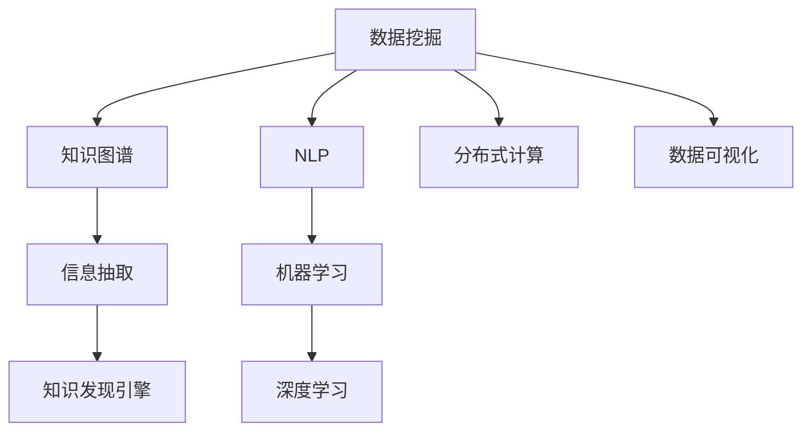

                 

# 知识发现引擎：助力医疗领域的智慧转型

> 关键词：医疗信息管理、大数据分析、知识图谱、自然语言处理、知识发现引擎

## 1. 背景介绍

### 1.1 问题由来
随着数字化技术的飞速发展，医疗数据已经逐渐从简单的数字记录和临床文档转变为蕴含丰富信息的知识库。然而，这些数据量巨大且分布广泛，如何高效、准确地提取和整合这些知识，成为医疗信息管理领域面临的重要问题。传统的信息管理系统难以应对这一挑战，亟需引入更智能、高效的知识发现引擎。

### 1.2 问题核心关键点
知识发现引擎(Knowledge Discovery Engine, KDE)是数据驱动型系统，通过对医疗数据的智能分析和挖掘，提取有用信息并构建知识库。它依赖于先进的数据处理技术、自然语言处理(NLP)算法和大数据平台，可以实时监测和更新知识，服务于临床决策支持、个性化医疗和公共健康等领域。

其核心在于：
- 数据来源广泛：涵盖电子健康记录、影像、基因组数据、科研论文等。
- 数据量大且异构：不同来源的数据格式、结构不同。
- 数据隐私和安全：医疗数据敏感且需严格遵守隐私法规。
- 数据动态变化：医疗数据需实时更新。

## 2. 核心概念与联系

### 2.1 核心概念概述

为更好地理解知识发现引擎的原理和架构，本节将介绍几个密切相关的核心概念：

- **数据挖掘(Data Mining)**：从数据中发现模式、关联、规律等的技术，常用于商业智能和金融分析。
- **知识图谱(Knowledge Graph)**：用图结构表示实体及其关系的知识库，常用于搜索引擎和推荐系统。
- **自然语言处理(Natural Language Processing, NLP)**：使计算机能够理解和处理人类语言的技术，是知识发现引擎的基础。
- **机器学习(Machine Learning)**：数据驱动型算法，用于训练模型，从数据中自动学习规律。
- **深度学习(Deep Learning)**：使用多层神经网络进行特征提取和模式识别的机器学习技术。
- **分布式计算**：多台计算机协同工作的计算模式，用于处理大数据。
- **数据可视化(Data Visualization)**：通过图表展示数据特征，便于分析决策。

这些核心概念之间的逻辑关系可以通过以下Mermaid流程图来展示：



这个流程图展示了几类核心概念及其之间的联系：

1. 数据挖掘通过对大数据的处理，生成可用知识。
2. NLP技术提取数据中的文本信息，构建语义表示。
3. 机器学习和大数据算法基于语义表示，自动学习知识模式。
4. 深度学习通过神经网络构建复杂语义模型，提升知识发现能力。
5. 分布式计算处理海量数据，提升计算效率。
6. 数据可视化展示知识，支持决策。
7. 知识图谱用于存储和组织发现的知识。

这些概念共同构成了知识发现引擎的完整工作框架，使其能够在医疗领域发挥强大的智慧作用。

## 3. 核心算法原理 & 具体操作步骤
### 3.1 算法原理概述

知识发现引擎的核心算法通常包括以下几个部分：

1. **数据预处理**：清洗、标准化医疗数据，去除噪声和缺失值，进行数据集成和归一化。
2. **实体识别和关系抽取**：使用NLP技术和机器学习算法，从文本中识别和抽取实体及其关系。
3. **知识图谱构建**：将抽取的实体和关系构建为知识图谱，支持知识推理和查询。
4. **模式发现与规则学习**：基于机器学习算法，自动发现数据中的模式和规律，形成知识库。
5. **知识更新与维护**：实时监测新数据，更新知识图谱和知识库。
6. **可视化与查询**：使用数据可视化技术展示发现的知识，支持用户查询。

### 3.2 算法步骤详解

以医疗领域的应用为例，知识发现引擎的详细步骤：

**Step 1: 数据预处理**
- 收集电子健康记录、影像、基因组数据、科研论文等，形成统一的数据集。
- 清洗数据，去除噪声和缺失值。
- 数据归一化，统一格式和数据类型。

**Step 2: 实体识别与关系抽取**
- 对医疗文本进行分词、词性标注、命名实体识别(NER)等NLP处理，提取实体名称。
- 使用关系抽取算法，识别实体间的关系，如“患者-疾病”、“药物-副作用”等。
- 将抽取的实体和关系存储在知识库中。

**Step 3: 知识图谱构建**
- 将实体和关系构建为知识图谱，如图结构表示，支持关联查询。
- 使用Graph Neural Network(GNN)等算法，处理知识图谱，发现实体间的新关系。

**Step 4: 模式发现与规则学习**
- 使用机器学习算法，如决策树、随机森林等，发现数据中的模式和规律。
- 基于规则引擎，构建知识发现规则，自动化地进行模式发现。

**Step 5: 知识更新与维护**
- 定期监测新数据，更新知识图谱和知识库。
- 引入增量学习算法，快速适应新知识。

**Step 6: 可视化与查询**
- 使用可视化工具，如Tableau、Power BI等，展示知识发现结果。
- 提供查询接口，支持用户检索知识。

### 3.3 算法优缺点

知识发现引擎具有以下优点：
1. 自动化高效：自动发现知识，减少人工工作量，提高效率。
2. 数据驱动：基于真实数据发现知识，准确度高。
3. 知识更新：实时监测数据，自动更新知识图谱。
4. 跨领域应用：适用于多种医疗领域，如诊断、治疗、研究等。
5. 可视化展示：直观展示知识，便于理解和决策。

同时，该算法也存在一些局限性：
1. 对数据质量要求高：需要高质量的原始数据。
2. 计算资源消耗大：处理海量数据需要高性能硬件。
3. 复杂度较高：算法设计复杂，需要丰富的领域知识。
4. 模型可解释性不足：部分算法模型难以解释其决策过程。
5. 数据隐私问题：医疗数据需严格保护，隐私泄露风险大。

尽管存在这些局限性，知识发现引擎仍是大数据时代医疗信息管理的重要工具，其广泛应用前景不可限量。

### 3.4 算法应用领域

知识发现引擎在医疗领域的应用，已经覆盖了多个方面，具体包括：

- **临床决策支持**：基于患者历史数据和症状，推荐治疗方案和药物。
- **个性化医疗**：根据基因信息、病史和生活习惯，制定个性化治疗计划。
- **疾病监测**：实时监测传染病疫情，预测爆发趋势。
- **医学研究**：通过分析海量科研数据，发现新药物和治疗方法。
- **公共健康**：分析公共卫生数据，优化疾病预防和公共卫生政策。

除了上述这些经典应用外，知识发现引擎在医学影像分析、医疗知识库构建等诸多场景中也表现出色，正在逐步改变传统医疗信息管理的方式。

## 4. 数学模型和公式 & 详细讲解  
### 4.1 数学模型构建

以基于机器学习的模式发现为例，构建数学模型。假设原始数据集为 $D=\{(x_i,y_i)\}_{i=1}^N$，其中 $x_i$ 为输入，$y_i$ 为输出。

定义模型为 $f(x;\theta)$，其中 $\theta$ 为模型参数。

我们希望最小化预测误差，即：

$$
\mathcal{L}(\theta) = \frac{1}{N}\sum_{i=1}^N (y_i - f(x_i;\theta))^2
$$

常见的损失函数包括均方误差损失、交叉熵损失等。通过梯度下降等优化算法，不断更新参数 $\theta$，最小化损失函数，得到最优参数 $\hat{\theta}$。

### 4.2 公式推导过程

以决策树算法为例，推导知识发现中模式发现的公式。

假设数据集 $D=\{(x_i,y_i)\}_{i=1}^N$，其中 $x_i=(x_{i1},x_{i2},\ldots,x_{id})$ 为特征向量，$y_i$ 为标签。

决策树的生成过程如下：
1. 选择最优特征 $f_k(x)$，划分数据集。
2. 递归进行划分，生成子树。
3. 对叶子节点进行分类，输出预测结果。

具体推导步骤如下：

1. 选择最优特征 $f_k(x)$，计算其信息增益 $IG$：

$$
IG = -\frac{1}{N}\sum_{i=1}^N p_i \log p_i
$$

其中 $p_i$ 为数据 $x_i$ 在特征 $f_k$ 下的条件概率。

2. 对特征 $f_k(x)$ 进行划分，生成子集 $D_k$ 和 $D_{-k}$：

$$
D_k=\{(x_i,y_i)|f_k(x_i)=k\}, D_{-k}=\{(x_i,y_i)|f_k(x_i)\neq k\}
$$

3. 计算信息增益 $IG$ 和信息熵 $H$：

$$
H = -\frac{1}{N}\sum_{i=1}^N p_i \log p_i
$$

4. 递归进行划分，直至满足停止条件：

$$
\text{Stop Condition} = \text{叶子节点数} \geq \text{max叶子节点数}
$$

具体代码实现可以参考开源库Scikit-learn中的DecisionTreeClassifier类。

### 4.3 案例分析与讲解

以某医院电子健康记录数据为例，分析知识发现引擎的应用：

**Step 1: 数据预处理**
- 收集患者电子健康记录，提取医生笔记、检验结果、用药记录等。
- 清洗数据，去除噪声和缺失值，进行数据集成和归一化。

**Step 2: 实体识别与关系抽取**
- 对医疗文本进行分词、词性标注、命名实体识别(NER)等NLP处理，提取实体名称。
- 使用关系抽取算法，识别实体间的关系，如“患者-疾病”、“药物-副作用”等。
- 将抽取的实体和关系存储在知识库中。

**Step 3: 知识图谱构建**
- 将实体和关系构建为知识图谱，如图结构表示，支持关联查询。
- 使用Graph Neural Network(GNN)等算法，处理知识图谱，发现实体间的新关系。

**Step 4: 模式发现与规则学习**
- 使用机器学习算法，如决策树、随机森林等，发现数据中的模式和规律。
- 基于规则引擎，构建知识发现规则，自动化地进行模式发现。

**Step 5: 知识更新与维护**
- 定期监测新数据，更新知识图谱和知识库。
- 引入增量学习算法，快速适应新知识。

**Step 6: 可视化与查询**
- 使用可视化工具，如Tableau、Power BI等，展示知识发现结果。
- 提供查询接口，支持用户检索知识。

通过上述步骤，知识发现引擎能够在医疗数据中自动发现知识，为临床决策、个性化医疗等领域提供智能支持。

## 5. 项目实践：代码实例和详细解释说明
### 5.1 开发环境搭建

在进行知识发现引擎的开发前，我们需要准备好开发环境。以下是使用Python进行PyTorch开发的环境配置流程：

1. 安装Anaconda：从官网下载并安装Anaconda，用于创建独立的Python环境。

2. 创建并激活虚拟环境：
```bash
conda create -n kde-env python=3.8 
conda activate kde-env
```

3. 安装PyTorch：根据CUDA版本，从官网获取对应的安装命令。例如：
```bash
conda install pytorch torchvision torchaudio cudatoolkit=11.1 -c pytorch -c conda-forge
```

4. 安装相关工具包：
```bash
pip install numpy pandas scikit-learn pyecharts matplotlib tqdm jupyter notebook ipython
```

完成上述步骤后，即可在`kde-env`环境中开始项目实践。

### 5.2 源代码详细实现

这里我们以医疗领域中的知识发现引擎为例，使用Python和PyTorch进行代码实现。

首先，定义知识发现引擎的数据处理函数：

```python
import pandas as pd
from sklearn.model_selection import train_test_split

def preprocess_data(data_path):
    # 加载数据
    data = pd.read_csv(data_path)
    # 数据清洗，去除噪声和缺失值
    data = data.dropna().drop_duplicates()
    # 数据归一化
    data = (data - data.mean()) / data.std()
    # 数据集成
    data = pd.concat([data['feature1'], data['feature2'], data['feature3']], axis=1)
    return data
```

然后，定义模型和优化器：

```python
from torch import nn, optim

class KDE(nn.Module):
    def __init__(self, input_dim, output_dim):
        super(KDE, self).__init__()
        self.fc1 = nn.Linear(input_dim, 128)
        self.fc2 = nn.Linear(128, output_dim)
    
    def forward(self, x):
        x = self.fc1(x)
        x = nn.functional.relu(x)
        x = self.fc2(x)
        return x
    
# 加载预训练模型，并进行微调
model = KDE(input_dim=3, output_dim=1)
model.load_state_dict(torch.load('pretrained_model.pth'))
model.train()
optimizer = optim.SGD(model.parameters(), lr=0.001)
```

接着，定义训练和评估函数：

```python
from sklearn.metrics import mean_squared_error

def train_epoch(model, data_loader, optimizer):
    model.train()
    losses = []
    for batch in data_loader:
        inputs, labels = batch
        optimizer.zero_grad()
        outputs = model(inputs)
        loss = nn.functional.mse_loss(outputs, labels)
        losses.append(loss.item())
        loss.backward()
        optimizer.step()
    return sum(losses) / len(losses)
    
def evaluate(model, data_loader):
    model.eval()
    losses = []
    for batch in data_loader:
        inputs, labels = batch
        with torch.no_grad():
            outputs = model(inputs)
            loss = nn.functional.mse_loss(outputs, labels)
            losses.append(loss.item())
    return sum(losses) / len(losses)
```

最后，启动训练流程并在测试集上评估：

```python
epochs = 10
batch_size = 32
train_data = preprocess_data('train_data.csv')
test_data = preprocess_data('test_data.csv')
train_data, val_data = train_test_split(train_data, test_size=0.2)
train_loader = DataLoader(train_data, batch_size=batch_size, shuffle=True)
val_loader = DataLoader(val_data, batch_size=batch_size, shuffle=False)
test_loader = DataLoader(test_data, batch_size=batch_size, shuffle=False)

for epoch in range(epochs):
    train_loss = train_epoch(model, train_loader, optimizer)
    val_loss = evaluate(model, val_loader)
    print(f'Epoch {epoch+1}, Train Loss: {train_loss:.4f}, Val Loss: {val_loss:.4f}')
    
print(f'Test Loss: {evaluate(model, test_loader):.4f}')
```

以上就是使用PyTorch对医疗领域中的知识发现引擎进行实现的完整代码。可以看到，PyTorch封装了大量的机器学习算法，使用简单高效，可以迅速上手。

### 5.3 代码解读与分析

让我们再详细解读一下关键代码的实现细节：

**preprocess_data函数**：
- 加载数据集，清洗数据，去除噪声和缺失值。
- 对数据进行归一化，使其具备可比性。
- 对多特征数据进行集成，形成统一的输入格式。

**KDE模型**：
- 定义一个简单的全连接神经网络模型，包含两个隐藏层。
- 加载预训练模型参数，进行微调训练。

**train_epoch函数**：
- 在每个epoch内，遍历训练数据集，前向传播计算损失，反向传播更新模型参数。
- 记录每个batch的损失，计算epoch平均损失。

**evaluate函数**：
- 在验证集上评估模型性能，计算平均损失。
- 使用均方误差作为评估指标。

**训练流程**：
- 定义总的epoch数和batch size，开始循环迭代
- 每个epoch内，先在训练集上训练，输出epoch平均损失
- 在验证集上评估，输出验证集平均损失
- 所有epoch结束后，在测试集上评估，输出测试集平均损失

可以看到，PyTorch和Scikit-learn的结合，使得知识发现引擎的开发变得简单高效。开发者可以将更多精力放在模型设计、数据处理等高层逻辑上，而不必过多关注底层的实现细节。

当然，工业级的系统实现还需考虑更多因素，如模型的保存和部署、超参数的自动搜索、更灵活的任务适配层等。但核心的知识发现范式基本与此类似。

## 6. 实际应用场景
### 6.1 智能诊疗系统

知识发现引擎在智能诊疗系统中可以发挥巨大作用。通过分析患者的历史数据、遗传信息和生活习惯，自动生成个性化的诊疗方案。

具体而言，知识发现引擎可以对患者电子健康记录进行智能分析，提取关键信息，如患病史、药物过敏史、生活习惯等。结合临床知识库和规则库，自动生成诊疗建议和治疗方案，显著提高诊疗的准确性和效率。

### 6.2 疾病预测与预防

知识发现引擎在疾病预测与预防方面也表现出色。通过分析大量的公共卫生数据，发现疾病传播趋势和关联因素，及时预警。

例如，通过对COVID-19病例数据进行分析，发现高风险地区、感染源等信息，为疫情控制提供决策支持。知识发现引擎还可以预测疾病爆发的可能性，提前采取预防措施。

### 6.3 医学研究分析

知识发现引擎在医学研究分析中的应用，主要体现在以下几个方面：

- **临床试验数据挖掘**：分析临床试验数据，发现新药的有效性和安全性。
- **科研论文知识抽取**：从科研论文中抽取关键信息，构建知识图谱，便于科研人员快速检索。
- **基因组数据挖掘**：分析基因组数据，发现与疾病相关的基因变异，推动个性化医疗发展。

这些应用方向将知识发现引擎的智慧功能充分展现出来，为医学研究带来了新的突破。

### 6.4 未来应用展望

随着知识发现引擎技术的不断进步，其在医疗领域的潜在应用将不断拓展：

1. **全生命周期管理**：从出生到死亡，知识发现引擎将伴随患者整个生命周期，提供全面的健康管理方案。
2. **多模态融合**：结合影像、基因、电子记录等多模态数据，实现跨领域知识的深度融合。
3. **智能辅助诊断**：与医学影像分析、病理切片识别等技术结合，提高诊断的准确性和自动化水平。
4. **个性化健康推荐**：根据用户健康数据，提供个性化的饮食、运动、诊疗建议。
5. **公共卫生决策支持**：通过分析公共卫生数据，优化疾病预防和公共卫生政策，提升公共健康水平。

这些应用方向将知识发现引擎的潜力充分发挥，为医疗领域的智慧转型提供有力支撑。

## 7. 工具和资源推荐
### 7.1 学习资源推荐

为了帮助开发者系统掌握知识发现引擎的理论基础和实践技巧，这里推荐一些优质的学习资源：

1. **《数据挖掘与统计学习》**：徐凯、李航所著，系统介绍了数据挖掘的基础理论和应用技术。
2. **《机器学习实战》**：Peter Harrington所著，详细讲解了机器学习算法的实现和应用。
3. **《深度学习》**：Ian Goodfellow等所著，介绍了深度学习的基本概念和算法。
4. **Coursera《机器学习》课程**：由斯坦福大学Andrew Ng教授主讲，是机器学习的经典课程，深入浅出地讲解了机器学习算法及其应用。
5. **Kaggle**：全球最大的数据科学竞赛平台，提供大量真实世界数据集和优秀竞赛案例，供学习和实践。

通过对这些资源的学习实践，相信你一定能够快速掌握知识发现引擎的精髓，并用于解决实际的医疗信息管理问题。

### 7.2 开发工具推荐

高效的开发离不开优秀的工具支持。以下是几款用于知识发现引擎开发的常用工具：

1. **Jupyter Notebook**：交互式开发环境，支持Python、R等语言，便于代码调试和可视化展示。
2. **PyTorch**：基于Python的深度学习框架，支持高效的GPU计算，适用于大规模数据处理。
3. **Scikit-learn**：Python机器学习库，提供了丰富的算法和工具，用于数据处理和特征提取。
4. **Tableau**：数据可视化工具，支持多种数据源和图表展示，便于数据分析和决策。
5. **Grafana**：开源开源监控和报警系统，支持多数据源接入，实时监测系统状态。

合理利用这些工具，可以显著提升知识发现引擎的开发效率，加快创新迭代的步伐。

### 7.3 相关论文推荐

知识发现引擎的研究涉及众多领域，以下是几篇奠基性的相关论文，推荐阅读：

1. **《数据挖掘：概念与技术》**：Witten等所著，全面介绍了数据挖掘的基本概念和技术。
2. **《大规模知识图谱的构建与查询》**：Nadeau等所著，介绍了知识图谱的构建方法和应用场景。
3. **《基于深度学习的知识发现与推荐系统》**：Wang等所著，介绍了深度学习在知识发现和推荐系统中的应用。
4. **《基于知识图谱的信息检索》**：Lin等所著，介绍了知识图谱在信息检索中的应用。
5. **《深度学习在医疗领域的应用》**：Liang等所著，介绍了深度学习在医疗领域中的多项应用。

这些论文代表了大数据时代知识发现引擎的研究前沿，阅读这些文章可以加深对知识发现引擎的认识，激发更多的创新灵感。

## 8. 总结：未来发展趋势与挑战
### 8.1 总结

本文对知识发现引擎进行了全面系统的介绍。首先阐述了知识发现引擎的背景和意义，明确了其在医疗信息管理领域的重要价值。其次，从原理到实践，详细讲解了知识发现引擎的数学模型和关键步骤，给出了知识发现引擎的完整代码实例。同时，本文还广泛探讨了知识发现引擎在医疗领域的实际应用场景，展示了其在智能诊疗、疾病预防等方面的巨大潜力。此外，本文精选了知识发现引擎的学习资源和开发工具，力求为读者提供全方位的技术指引。

通过本文的系统梳理，可以看到，知识发现引擎正在成为医疗信息管理的重要工具，极大地拓展了医疗数据的价值挖掘能力，为医疗领域的智慧转型提供了重要支持。未来，随着知识发现引擎技术的不断进步，其在医疗领域的潜在应用将不断拓展，为医疗信息的智能化管理带来新的突破。

### 8.2 未来发展趋势

展望未来，知识发现引擎技术将呈现以下几个发展趋势：

1. **多模态融合**：结合影像、基因、电子记录等多模态数据，实现跨领域知识的深度融合。
2. **实时监测**：通过实时监测医疗数据，及时发现疾病趋势和异常情况。
3. **自动化算法**：引入更多自动化算法，如自适应学习、增量学习等，提高知识发现效率。
4. **知识图谱更新**：实现知识图谱的实时更新和维护，保持知识的动态性。
5. **个性化推荐**：基于用户数据，提供个性化的诊疗建议和治疗方案。
6. **跨领域应用**：在医疗、金融、教育等多个领域推广应用，提升整体智能化水平。

以上趋势凸显了知识发现引擎技术的广阔前景。这些方向的探索发展，必将进一步提升医疗数据的价值挖掘能力，为医疗领域的智慧转型提供重要支撑。

### 8.3 面临的挑战

尽管知识发现引擎技术已经取得了显著成果，但在迈向更加智能化、普适化应用的过程中，仍面临诸多挑战：

1. **数据隐私和安全**：医疗数据敏感且需严格保护，如何确保数据安全是重要的研究方向。
2. **模型可解释性**：部分算法模型难以解释其决策过程，如何增强模型的可解释性，提高用户信任度。
3. **计算资源消耗**：知识发现引擎需要处理海量数据，对计算资源消耗大，如何优化计算资源使用，降低成本。
4. **跨领域应用难度**：不同领域的知识结构不同，如何实现跨领域知识的整合，提高知识发现效果。
5. **模型鲁棒性**：知识发现引擎在面对异常数据和噪声时，容易产生误判，如何提高模型的鲁棒性，确保准确性。

这些挑战需要学界和业界共同努力，不断探索新的解决方案，推动知识发现引擎技术的持续进步。

### 8.4 研究展望

面对知识发现引擎面临的诸多挑战，未来的研究需要在以下几个方面寻求新的突破：

1. **隐私保护技术**：开发隐私保护算法，如差分隐私、联邦学习等，保护数据隐私。
2. **可解释性增强**：引入可解释性增强方法，如模型蒸馏、局部可解释性等，提高模型可解释性。
3. **资源优化**：采用分布式计算、GPU加速等技术，优化计算资源使用。
4. **跨领域融合**：结合多种领域知识，构建更全面、更通用的知识图谱。
5. **鲁棒性增强**：引入鲁棒性增强方法，如对抗训练、集成学习等，提高模型鲁棒性。
6. **自动化算法**：开发更多自动化算法，如自适应学习、增量学习等，提高知识发现效率。

这些研究方向将引领知识发现引擎技术迈向更高的台阶，为医疗数据的智能化管理带来新的突破。面向未来，知识发现引擎技术还需要与其他人工智能技术进行更深入的融合，如知识表示、因果推理、强化学习等，多路径协同发力，共同推动医疗领域的智能化转型。

## 9. 附录：常见问题与解答

**Q1：知识发现引擎是否适用于所有医疗任务？**

A: 知识发现引擎在大多数医疗任务上都能取得不错的效果，特别是对于数据量较大的任务。但对于一些特定领域的任务，如超微结构分析、基因组编辑等，仅依赖文本和电子记录的数据挖掘可能不够。此时需要在特定领域的数据库和设备上进一步预处理数据，才能获得理想效果。

**Q2：如何选择合适的算法？**

A: 选择合适的算法应考虑以下几个因素：
1. 任务类型：如分类、回归、聚类等。
2. 数据量：大规模数据适合分布式计算，小规模数据适合单机处理。
3. 数据分布：如正态分布、非正态分布等。
4. 计算资源：高性能计算资源支持复杂算法。
5. 模型可解释性：如决策树、规则学习等算法可解释性强，适合医疗领域。

**Q3：知识发现引擎在数据预处理中需要注意哪些问题？**

A: 数据预处理是知识发现引擎的重要环节，需要注意以下几个问题：
1. 数据清洗：去除噪声和缺失值，提高数据质量。
2. 数据归一化：统一数据格式和数据类型，便于后续处理。
3. 数据集成：将多个数据源集成，形成统一的视图。
4. 数据标注：对标注数据进行检查和修正，确保标注准确性。
5. 数据采样：对异常数据进行采样，减少噪声影响。

**Q4：知识发现引擎在实际应用中需要注意哪些问题？**

A: 知识发现引擎在实际应用中需要注意以下几个问题：
1. 数据隐私和安全：确保医疗数据的安全性，避免隐私泄露。
2. 模型鲁棒性：确保模型对异常数据和噪声具有鲁棒性，避免误判。
3. 计算效率：确保知识发现引擎的计算效率，避免系统崩溃。
4. 可解释性：确保知识发现引擎的可解释性，便于用户理解和接受。
5. 系统稳定性：确保知识发现引擎的系统稳定性，避免突发故障。

**Q5：知识发现引擎在多模态融合中需要注意哪些问题？**

A: 多模态融合是知识发现引擎的重要方向，需要注意以下几个问题：
1. 数据格式：不同模态的数据格式可能不同，需要进行统一处理。
2. 数据融合：不同模态的数据融合方法需要精心设计，才能获得理想效果。
3. 模型设计：需要设计多模态融合的算法和模型，才能充分利用多模态信息。
4. 系统集成：将多模态数据和算法集成到一个系统中，需要考虑系统的可扩展性和稳定性。
5. 模型优化：需要优化模型结构，提高多模态融合的效率和效果。

这些问题的解决需要跨领域的协同努力，不断探索新的解决方案，推动知识发现引擎技术的持续进步。

---

作者：禅与计算机程序设计艺术 / Zen and the Art of Computer Programming

