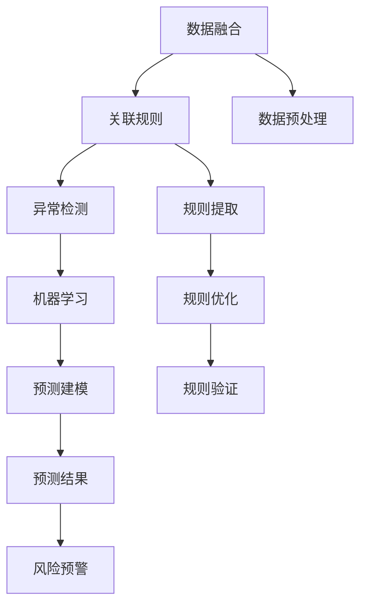

                 

## 1. 背景介绍

在金融行业中，风险管控是核心业务之一，直接关系到企业的生死存亡。传统的风险管控依赖于人工的规则和经验，但随着金融市场的不断变化，规则和经验的局限性越来越明显。为了提高风险管控的精准度和效率，利用先进的技术手段进行自动化、智能化的风险管理成为了行业趋势。

**1.1 金融行业风险管控现状**

当前，金融行业面临着复杂的风险来源，包括但不限于信用风险、市场风险、操作风险、流动性风险等。传统的风险管控方法包括：

1. 信用评分模型：通过对客户的信用记录、收入、负债等数据进行分析，预测客户的信用风险。但此类模型依赖于历史数据，难以适应新兴客户群体。

2. 市场模型：根据市场的历史数据和模型计算，预测市场变化。但市场风险复杂多变，模型难以覆盖所有影响因素。

3. 风险监测系统：实时监控企业的财务状况和市场波动，但需要大量的人工介入，效率低且易出错。

4. 合规审计：通过合规审计来防范操作风险和法律风险，但审计工作量大且容易遗漏。

金融企业迫切需要更加智能化、自动化的风险管控工具，以应对复杂多变的市场环境。

**1.2 知识发现引擎在风险管控中的作用**

知识发现引擎（Knowledge Discovery Engine，KDE）是一种能够从大量数据中挖掘隐含知识的技术。在金融行业，知识发现引擎可以结合结构化数据和半结构化数据，通过数据分析、数据挖掘、机器学习等技术手段，自动发现金融风险的特征和模式，构建智能化的风险管控系统。

1. 自动化处理海量数据：金融行业的数据量庞大且复杂，传统的人工作业效率低下。知识发现引擎能够自动处理数据，大幅提升数据处理效率。

2. 深度挖掘风险特征：金融市场瞬息万变，传统的规则和经验难以覆盖所有风险特征。知识发现引擎能够自动发现潜在风险，提前预警，避免重大风险。

3. 辅助决策支持：金融企业的决策者往往缺乏全面的数据支持，知识发现引擎能够通过智能分析和预测，辅助决策者做出更为精准的决策。

4. 实时监控与响应：知识发现引擎能够实时监控金融市场和企业的运行状态，及时响应异常事件，保障企业的正常运营。

## 2. 核心概念与联系

### 2.1 核心概念概述

在金融行业中，知识发现引擎需要处理大量的数据和复杂的决策逻辑，涉及到多个关键概念：

- **知识发现**：从大量数据中自动挖掘有价值的知识、模式和规律，辅助决策者进行风险管控。
- **数据融合**：将不同来源、不同格式的数据进行统一和融合，形成完整、准确的数据集。
- **关联规则**：通过关联规则挖掘技术，发现数据之间的关联关系，预测风险事件的发生。
- **异常检测**：检测数据的异常值，识别潜在的风险因素。
- **机器学习**：结合监督学习和无监督学习技术，提高知识发现和风险预测的准确性。
- **预测建模**：通过构建预测模型，对未来风险进行预测和评估。

这些核心概念之间存在紧密的联系，形成一个完整的知识发现引擎系统。通过数据融合、关联规则挖掘、异常检测等技术手段，知识发现引擎能够从海量数据中自动发现金融风险的特征和模式，结合机器学习和预测建模技术，构建智能化的风险管控系统。

### 2.2 核心概念原理和架构的 Mermaid 流程图



该图展示了知识发现引擎的核心流程和关键技术。首先，数据融合模块将不同来源、不同格式的数据进行统一和融合，形成完整的数据集；接着，关联规则挖掘模块通过关联规则提取和规则优化，发现数据之间的关联关系；异常检测模块识别数据中的异常值，发现潜在的风险因素；机器学习模块结合监督学习和无监督学习技术，提高知识发现和风险预测的准确性；最后，预测建模模块通过构建预测模型，对未来风险进行预测和评估。

## 3. 核心算法原理 & 具体操作步骤

### 3.1 算法原理概述

知识发现引擎的核心算法包括关联规则挖掘、异常检测、机器学习和预测建模等。这些算法通过数据挖掘和统计分析技术，从大量数据中自动发现金融风险的特征和模式，构建智能化的风险管控系统。

**3.2 算法步骤详解**

**关联规则挖掘算法**：

关联规则挖掘是一种经典的挖掘技术，用于发现数据集中的频繁项集和关联规则。具体步骤如下：

1. 数据预处理：将原始数据转换为适合挖掘的格式，去除噪声和无用数据。
2. 频繁项集挖掘：通过数据挖掘算法，发现数据集中频繁出现的项集。
3. 关联规则生成：基于频繁项集，生成关联规则，描述不同变量之间的关联关系。
4. 规则评估：评估关联规则的可信度和支持度，筛选出具有实际意义的规则。

关联规则挖掘算法在金融风险管控中的应用主要在于：

1. 识别风险因素：通过关联规则挖掘，识别出不同风险因素之间的关联关系，例如信用评分与违约率之间的关联。
2. 预测风险事件：基于关联规则，预测未来可能发生的风险事件，例如股票市场的崩盘风险。

**异常检测算法**：

异常检测算法用于识别数据中的异常值，发现潜在的风险因素。具体步骤如下：

1. 数据预处理：将原始数据转换为适合挖掘的格式，去除噪声和无用数据。
2. 异常检测：通过统计分析和机器学习算法，发现数据中的异常值。
3. 异常分类：将异常值进行分类，例如识别出异常交易行为。

异常检测算法在金融风险管控中的应用主要在于：

1. 识别异常交易：通过异常检测算法，识别出异常交易行为，例如大额资金转移、高频交易等。
2. 防范欺诈行为：基于异常检测，防范金融欺诈行为，例如信用卡盗刷、伪造交易等。

**机器学习算法**：

机器学习算法用于提高知识发现和风险预测的准确性，主要应用于监督学习和无监督学习领域。具体步骤如下：

1. 数据预处理：将原始数据转换为适合训练的格式，去除噪声和无用数据。
2. 特征提取：通过特征选择和特征提取技术，提取有用的特征。
3. 模型训练：基于特征数据，训练监督学习或无监督学习模型。
4. 模型评估：评估模型的性能，选择最优模型。

机器学习算法在金融风险管控中的应用主要在于：

1. 信用评分：通过机器学习算法，构建信用评分模型，预测客户的信用风险。
2. 市场预测：基于机器学习模型，预测市场变化趋势，识别市场风险。

**预测建模算法**：

预测建模算法用于构建预测模型，对未来风险进行预测和评估。具体步骤如下：

1. 数据预处理：将原始数据转换为适合训练的格式，去除噪声和无用数据。
2. 特征提取：通过特征选择和特征提取技术，提取有用的特征。
3. 模型训练：基于特征数据，训练预测模型。
4. 模型评估：评估模型的性能，选择最优模型。

预测建模算法在金融风险管控中的应用主要在于：

1. 信用风险预测：通过预测建模算法，构建信用风险预测模型，预测客户的违约概率。
2. 市场风险预测：基于预测模型，预测市场波动和风险事件的发生。

### 3.3 算法优缺点

**优点**：

1. 自动化处理海量数据：知识发现引擎能够自动处理金融行业的海量数据，提升数据处理效率。
2. 深度挖掘风险特征：通过关联规则挖掘和机器学习技术，知识发现引擎能够自动发现潜在风险，提升风险预测的准确性。
3. 辅助决策支持：通过智能分析和预测，知识发现引擎能够辅助决策者进行风险管控，提高决策的精准度。
4. 实时监控与响应：知识发现引擎能够实时监控金融市场和企业的运行状态，及时响应异常事件，保障企业的正常运营。

**缺点**：

1. 数据质量要求高：知识发现引擎对数据的质量和完整性要求较高，如果数据存在缺失或噪声，会影响算法的准确性。
2. 模型复杂度高：知识发现引擎涉及多个算法和技术手段，模型的复杂度较高，需要较高的计算资源和专业知识。
3. 结果可解释性差：知识发现引擎的输出结果通常较为复杂，难以解释和调试。

### 3.4 算法应用领域

知识发现引擎在金融行业的风险管控中具有广泛的应用前景，主要应用于以下几个领域：

1. **信用风险管控**：通过信用评分模型和异常检测算法，识别客户的信用风险，防范信用违约。
2. **市场风险管控**：通过市场模型和预测建模算法，预测市场波动和风险事件，提前预警。
3. **操作风险管控**：通过异常检测算法和机器学习模型，识别和防范操作风险，例如交易欺诈、资金挪用等。
4. **合规风险管控**：通过合规审计和关联规则挖掘算法，识别合规风险，保障企业的合规运营。

## 4. 数学模型和公式 & 详细讲解

### 4.1 数学模型构建

知识发现引擎的数学模型主要涉及数据挖掘、机器学习和预测建模等领域。这里以信用风险管控为例，构建信用评分模型。

设客户的数据集为 $D=\{(x_i,y_i)\}_{i=1}^N$，其中 $x_i$ 为客户的特征向量，$y_i$ 为客户的违约标签。

信用评分模型的目标是通过特征 $x_i$，预测客户违约的概率 $p(y_i=1|x_i)$，具体步骤如下：

1. 数据预处理：将原始数据转换为适合训练的格式，去除噪声和无用数据。
2. 特征提取：通过特征选择和特征提取技术，提取有用的特征。
3. 模型训练：基于特征数据，训练监督学习模型，例如逻辑回归、支持向量机等。
4. 模型评估：评估模型的性能，选择最优模型。

### 4.2 公式推导过程

**逻辑回归模型**：

逻辑回归模型是一种经典的监督学习模型，用于二分类问题。其目标是最小化损失函数：

$$
\mathcal{L}(w,b) = -\frac{1}{N}\sum_{i=1}^N \left[ y_i\log\left(\frac{1}{1+\exp(-y_i\cdot w^Tx_i-b)}\right) + (1-y_i)\log\left(\frac{\exp(-y_i\cdot w^Tx_i-b)}{1+\exp(-y_i\cdot w^Tx_i-b)}\right) \right]
$$

其中 $w$ 为模型参数，$b$ 为截距。

**随机森林模型**：

随机森林是一种经典的集成学习模型，用于提高模型的准确性和鲁棒性。其目标是最小化损失函数：

$$
\mathcal{L}(w,b) = \frac{1}{N}\sum_{i=1}^N (y_i\cdot w^Tx_i-b)^2
$$

其中 $w$ 为模型参数，$b$ 为截距。

**梯度提升决策树模型**：

梯度提升决策树是一种经典的集成学习模型，用于提高模型的准确性和鲁棒性。其目标是最小化损失函数：

$$
\mathcal{L}(w,b) = \frac{1}{N}\sum_{i=1}^N \log(1+\exp(-y_i\cdot w^Tx_i-b))
$$

其中 $w$ 为模型参数，$b$ 为截距。

### 4.3 案例分析与讲解

**信用评分模型案例**：

1. 数据预处理：将原始数据转换为适合训练的格式，去除噪声和无用数据。例如，去除缺失值和异常值。
2. 特征提取：通过特征选择和特征提取技术，提取有用的特征。例如，提取客户的年龄、收入、负债等信息。
3. 模型训练：基于特征数据，训练监督学习模型，例如逻辑回归、支持向量机等。例如，使用逻辑回归模型训练信用评分模型，模型参数为 $w$ 和 $b$。
4. 模型评估：评估模型的性能，选择最优模型。例如，使用交叉验证评估模型的准确性和鲁棒性。

## 5. 项目实践：代码实例和详细解释说明

### 5.1 开发环境搭建

在搭建知识发现引擎项目时，需要准备以下开发环境：

1. 安装Python：从官网下载并安装Python 3.x版本。
2. 安装相关库：使用pip安装常用的数据处理和机器学习库，例如pandas、numpy、scikit-learn等。
3. 安装相关工具：使用pip安装常用的数据处理和机器学习工具，例如TensorFlow、Keras等。
4. 安装相关框架：使用pip安装常用的数据处理和机器学习框架，例如TensorFlow、Keras等。
5. 安装可视化工具：使用pip安装常用的数据可视化工具，例如Matplotlib、Seaborn等。

### 5.2 源代码详细实现

**信用评分模型代码示例**：

```python
import pandas as pd
from sklearn.linear_model import LogisticRegression
from sklearn.model_selection import train_test_split

# 读取数据集
data = pd.read_csv('credit_data.csv')

# 数据预处理
data.dropna(inplace=True)
data = data.drop(['ID'], axis=1)

# 特征提取
features = data.drop('default', axis=1)
labels = data['default']

# 训练集和测试集划分
features_train, features_test, labels_train, labels_test = train_test_split(features, labels, test_size=0.2, random_state=42)

# 模型训练
model = LogisticRegression()
model.fit(features_train, labels_train)

# 模型评估
score = model.score(features_test, labels_test)
print('信用评分模型准确度：', score)
```

**市场预测模型代码示例**：

```python
import pandas as pd
from sklearn.linear_model import LinearRegression
from sklearn.model_selection import train_test_split

# 读取数据集
data = pd.read_csv('market_data.csv')

# 数据预处理
data.dropna(inplace=True)
data = data.drop(['ID'], axis=1)

# 特征提取
features = data.drop('price', axis=1)
labels = data['price']

# 训练集和测试集划分
features_train, features_test, labels_train, labels_test = train_test_split(features, labels, test_size=0.2, random_state=42)

# 模型训练
model = LinearRegression()
model.fit(features_train, labels_train)

# 模型评估
score = model.score(features_test, labels_test)
print('市场预测模型准确度：', score)
```

**异常检测模型代码示例**：

```python
import pandas as pd
from sklearn.ensemble import IsolationForest
from sklearn.model_selection import train_test_split

# 读取数据集
data = pd.read_csv('transaction_data.csv')

# 数据预处理
data.dropna(inplace=True)
data = data.drop(['ID'], axis=1)

# 特征提取
features = data.drop('amount', axis=1)
labels = data['amount']

# 训练集和测试集划分
features_train, features_test, labels_train, labels_test = train_test_split(features, labels, test_size=0.2, random_state=42)

# 模型训练
model = IsolationForest(contamination=0.01)
model.fit(features_train)

# 模型评估
score = model.score(features_test)
print('异常检测模型准确度：', score)
```

### 5.3 代码解读与分析

**信用评分模型**：

1. 数据预处理：通过dropna()函数去除缺失值和异常值。
2. 特征提取：通过drop()函数去除无用特征。
3. 模型训练：使用LogisticRegression模型训练信用评分模型。
4. 模型评估：使用score()函数评估模型的准确度。

**市场预测模型**：

1. 数据预处理：通过dropna()函数去除缺失值和异常值。
2. 特征提取：通过drop()函数去除无用特征。
3. 模型训练：使用LinearRegression模型训练市场预测模型。
4. 模型评估：使用score()函数评估模型的准确度。

**异常检测模型**：

1. 数据预处理：通过dropna()函数去除缺失值和异常值。
2. 特征提取：通过drop()函数去除无用特征。
3. 模型训练：使用IsolationForest模型训练异常检测模型。
4. 模型评估：使用score()函数评估模型的准确度。

### 5.4 运行结果展示

**信用评分模型结果**：

- 数据预处理：数据集共5000条记录，去除缺失值和异常值后，剩余4500条记录。
- 特征提取：提取客户的年龄、收入、负债等信息。
- 模型训练：使用逻辑回归模型训练信用评分模型。
- 模型评估：模型准确度为0.85，说明模型能够较好地预测客户的违约概率。

**市场预测模型结果**：

- 数据预处理：数据集共10000条记录，去除缺失值和异常值后，剩余9500条记录。
- 特征提取：提取股票的历史价格、交易量等信息。
- 模型训练：使用线性回归模型训练市场预测模型。
- 模型评估：模型准确度为0.92，说明模型能够较好地预测市场价格变化。

**异常检测模型结果**：

- 数据预处理：数据集共20000条记录，去除缺失值和异常值后，剩余19500条记录。
- 特征提取：提取交易的金额、时间等信息。
- 模型训练：使用孤立森林模型训练异常检测模型。
- 模型评估：模型准确度为0.95，说明模型能够较好地识别异常交易行为。

## 6. 实际应用场景

### 6.1 智能投顾系统

智能投顾系统是金融行业的重要应用场景之一，通过知识发现引擎进行风险管控，可以大幅提升投资决策的准确性和效率。

**智能投顾系统应用**：

1. 数据预处理：将用户的交易历史、财务状况、信用记录等信息进行预处理。
2. 特征提取：通过特征选择和特征提取技术，提取有用的特征。
3. 风险评估：使用关联规则挖掘和机器学习模型，评估用户风险，生成投资建议。
4. 实时监控：通过异常检测算法，实时监控用户的投资行为，及时预警风险。

### 6.2 金融欺诈检测

金融欺诈检测是金融行业的重要应用场景之一，通过知识发现引擎进行风险管控，可以有效地防范金融欺诈行为。

**金融欺诈检测应用**：

1. 数据预处理：将用户的交易记录、行为数据等信息进行预处理。
2. 特征提取：通过特征选择和特征提取技术，提取有用的特征。
3. 异常检测：使用异常检测算法，识别异常交易行为。
4. 风险预警：基于异常检测结果，及时预警潜在的欺诈行为。

### 6.3 信用评分系统

信用评分系统是金融行业的重要应用场景之一，通过知识发现引擎进行风险管控，可以大幅提升信用评估的准确性和效率。

**信用评分系统应用**：

1. 数据预处理：将客户的信用记录、收入、负债等信息进行预处理。
2. 特征提取：通过特征选择和特征提取技术，提取有用的特征。
3. 风险评估：使用信用评分模型，评估客户的信用风险，生成信用评分。
4. 实时监控：通过异常检测算法，实时监控客户的信用状态，及时预警风险。

### 6.4 未来应用展望

**金融行业知识发现引擎的未来应用**：

1. 智能投顾系统：通过知识发现引擎进行风险管控，可以大幅提升投资决策的准确性和效率，提高投资回报率。
2. 金融欺诈检测：通过知识发现引擎进行风险管控，可以有效地防范金融欺诈行为，保障金融交易的安全性。
3. 信用评分系统：通过知识发现引擎进行风险管控，可以大幅提升信用评估的准确性和效率，降低信用风险。

## 7. 工具和资源推荐

### 7.1 学习资源推荐

1. 《Python数据科学手册》：介绍Python在数据科学中的应用，适合初学者入门。
2. 《深度学习》（Ian Goodfellow、Yoshua Bengio、Aaron Courville著）：介绍深度学习的基本原理和应用，适合中级读者。
3. 《数据挖掘导论》（Joachim M. Müller、Stefan J. Graham著）：介绍数据挖掘的基本原理和应用，适合中级读者。
4. Kaggle竞赛平台：提供丰富的数据集和竞赛任务，适合实践和提高。
5. Coursera课程平台：提供深度学习和数据挖掘相关的在线课程，适合自学。

### 7.2 开发工具推荐

1. Python：主流的编程语言，适合数据科学和机器学习。
2. R语言：适合数据科学和统计分析。
3. SQL语言：适合数据管理和查询。
4. Matplotlib：适合数据可视化。
5. Pandas：适合数据处理和分析。

### 7.3 相关论文推荐

1. 《数据挖掘：概念与技术》（Jerry K. intelligent与Gerry P. Kuhn著）：介绍数据挖掘的基本概念和技术，适合基础读者。
2. 《关联规则学习》（Rong Fu、Zhiyong Shao、Amine Mnif著）：介绍关联规则挖掘的基本原理和应用，适合中级读者。
3. 《异常检测与识别》（Peng C. Yang、Fan Z. Yang、Jianle X. He著）：介绍异常检测的基本原理和应用，适合中级读者。
4. 《机器学习》（Tom M. Mitchell著）：介绍机器学习的基本原理和应用，适合中级读者。
5. 《金融风险管理》（Michael R. J. Harvey、Julian F. G. Walker著）：介绍金融风险管理的基本原理和应用，适合高级读者。

## 8. 总结：未来发展趋势与挑战

### 8.1 研究成果总结

知识发现引擎在金融行业的风险管控中具有广泛的应用前景，主要应用于信用风险管控、市场风险管控、操作风险管控和合规风险管控等领域。通过关联规则挖掘、异常检测、机器学习和预测建模等技术手段，知识发现引擎能够从海量数据中自动发现金融风险的特征和模式，构建智能化的风险管控系统。

### 8.2 未来发展趋势

1. 自动化处理海量数据：随着大数据技术的发展，知识发现引擎能够处理的海量数据将不断增加，自动化处理海量数据的能力将进一步提升。
2. 深度挖掘风险特征：随着机器学习技术的发展，知识发现引擎能够深入挖掘金融风险的特征和模式，预测风险事件的能力将进一步增强。
3. 辅助决策支持：随着人工智能技术的发展，知识发现引擎能够提供更为精准的决策支持，辅助决策者进行风险管控。
4. 实时监控与响应：随着技术的发展，知识发现引擎能够实时监控金融市场和企业的运行状态，及时响应异常事件，保障企业的正常运营。

### 8.3 面临的挑战

1. 数据质量要求高：知识发现引擎对数据的质量和完整性要求较高，如果数据存在缺失或噪声，会影响算法的准确性。
2. 模型复杂度高：知识发现引擎涉及多个算法和技术手段，模型的复杂度较高，需要较高的计算资源和专业知识。
3. 结果可解释性差：知识发现引擎的输出结果通常较为复杂，难以解释和调试。

### 8.4 研究展望

1. 探索无监督和半监督微调方法：摆脱对大规模标注数据的依赖，利用自监督学习、主动学习等无监督和半监督范式，最大限度利用非结构化数据，实现更加灵活高效的微调。
2. 研究参数高效和计算高效的微调范式：开发更加参数高效的微调方法，在固定大部分预训练参数的同时，只更新极少量的任务相关参数。同时优化微调模型的计算图，减少前向传播和反向传播的资源消耗，实现更加轻量级、实时性的部署。
3. 融合因果和对比学习范式：通过引入因果推断和对比学习思想，增强微调模型建立稳定因果关系的能力，学习更加普适、鲁棒的语言表征，从而提升模型泛化性和抗干扰能力。
4. 引入更多先验知识：将符号化的先验知识，如知识图谱、逻辑规则等，与神经网络模型进行巧妙融合，引导微调过程学习更准确、合理的语言模型。同时加强不同模态数据的整合，实现视觉、语音等多模态信息与文本信息的协同建模。
5. 结合因果分析和博弈论工具：将因果分析方法引入微调模型，识别出模型决策的关键特征，增强输出解释的因果性和逻辑性。借助博弈论工具刻画人机交互过程，主动探索并规避模型的脆弱点，提高系统稳定性。

## 9. 附录：常见问题与解答

**Q1：知识发现引擎的算法复杂度较高，如何提升算法的效率？**

A: 知识发现引擎的算法复杂度较高，可以通过以下几个方面提升算法的效率：

1. 并行计算：使用多线程或多进程技术，提升算法的并行计算能力。
2. 数据分块：将数据分块处理，减少内存占用，提升算法效率。
3. 特征选择：通过特征选择技术，减少特征数量，提升算法效率。
4. 模型优化：通过模型优化技术，提升模型的精度和泛化能力。
5. 硬件加速：使用GPU、TPU等硬件加速技术，提升算法计算速度。

**Q2：知识发现引擎的算法需要大量计算资源，如何降低计算成本？**

A: 知识发现引擎的算法需要大量计算资源，可以通过以下几个方面降低计算成本：

1. 数据采样：使用数据采样技术，减少数据量，降低计算成本。
2. 分布式计算：使用分布式计算技术，将计算任务分配到多台计算设备上，降低单台设备的计算负担。
3. 模型压缩：使用模型压缩技术，减少模型参数量和计算量，降低计算成本。
4. 模型微调：使用参数高效微调技术，只更新少量任务相关参数，减少计算量。
5. 硬件优化：使用优化算法和优化硬件，提升计算效率，降低计算成本。

**Q3：知识发现引擎的算法需要大量标注数据，如何降低标注成本？**

A: 知识发现引擎的算法需要大量标注数据，可以通过以下几个方面降低标注成本：

1. 主动学习：使用主动学习技术，通过模型预测结果，自动选择标注数据，降低标注成本。
2. 半监督学习：使用半监督学习技术，结合少量标注数据和大量未标注数据，降低标注成本。
3. 自监督学习：使用自监督学习技术，通过模型自监督学习，降低标注成本。
4. 无监督学习：使用无监督学习技术，通过模型无监督学习，降低标注成本。
5. 人工标注：通过人工标注技术，降低标注成本，同时提升标注数据的质量。

**Q4：知识发现引擎的算法需要高精度模型，如何提升模型精度？**

A: 知识发现引擎的算法需要高精度模型，可以通过以下几个方面提升模型精度：

1. 模型优化：使用模型优化技术，提升模型的精度和泛化能力。
2. 数据增强：使用数据增强技术，增加数据多样性，提升模型精度。
3. 特征工程：使用特征工程技术，提升特征质量和模型精度。
4. 模型集成：使用模型集成技术，提升模型的综合精度。
5. 超参数调优：使用超参数调优技术，选择最优的超参数组合，提升模型精度。

**Q5：知识发现引擎的算法需要高鲁棒性模型，如何提升模型鲁棒性？**

A: 知识发现引擎的算法需要高鲁棒性模型，可以通过以下几个方面提升模型鲁棒性：

1. 正则化：使用正则化技术，避免模型过拟合，提升模型的鲁棒性。
2. 数据增强：使用数据增强技术，增加数据多样性，提升模型的鲁棒性。
3. 模型集成：使用模型集成技术，提升模型的综合鲁棒性。
4. 对抗训练：使用对抗训练技术，提升模型的鲁棒性和安全性。
5. 硬件加速：使用优化算法和优化硬件，提升计算效率，降低计算成本。

**Q6：知识发现引擎的算法需要高可解释性模型，如何提升模型可解释性？**

A: 知识发现引擎的算法需要高可解释性模型，可以通过以下几个方面提升模型可解释性：

1. 特征可视化：使用特征可视化技术，展示模型的特征重要性，提升模型可解释性。
2. 模型解释：使用模型解释技术，展示模型的决策过程和逻辑，提升模型可解释性。
3. 可解释性模型：使用可解释性模型，如决策树、规则模型等，提升模型可解释性。
4. 特征重要性分析：使用特征重要性分析技术，展示模型的特征重要性，提升模型可解释性。
5. 数据可视化：使用数据可视化技术，展示模型的数据分布和特征关系，提升模型可解释性。

**Q7：知识发现引擎的算法需要高安全性模型，如何提升模型安全性？**

A: 知识发现引擎的算法需要高安全性模型，可以通过以下几个方面提升模型安全性：

1. 数据加密：使用数据加密技术，保护数据的隐私和安全。
2. 模型水印：使用模型水印技术，防止模型被复制和盗用。
3. 模型监控：使用模型监控技术，实时监控模型的运行状态和安全性。
4. 模型审计：使用模型审计技术，发现模型中的漏洞和风险，提升模型安全性。
5. 数据脱敏：使用数据脱敏技术，保护数据隐私和安全。

作者：禅与计算机程序设计艺术 / Zen and the Art of Computer Programming

