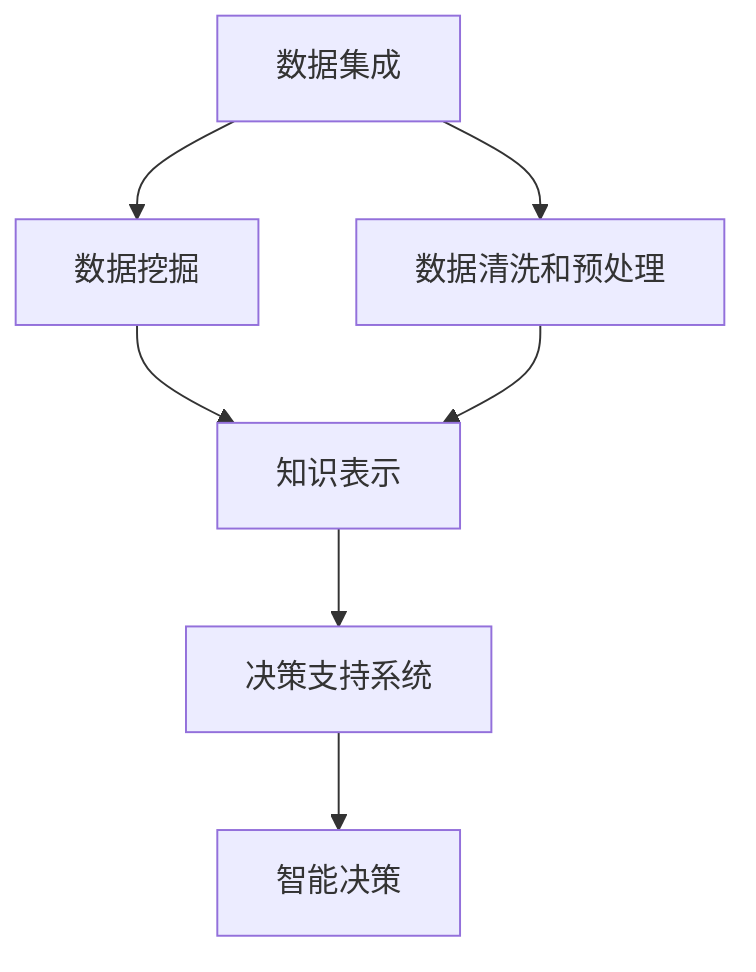

                 

# 知识发现引擎：打造企业竞争优势的秘密武器

> 关键词：知识发现引擎, 企业决策支持系统, 数据挖掘, 机器学习, 人工智能, 大数据

## 1. 背景介绍

在数字化转型的浪潮下，企业面临的数据量呈现爆炸式增长，如何从海量数据中挖掘出有价值的知识，成为企业决策的关键。传统的数据分析方法已经难以满足需求，而知识发现引擎（Knowledge Discovery Engine, KDE）作为集成了数据挖掘、机器学习、人工智能技术的高级应用，正成为企业打造竞争优势的秘密武器。

### 1.1 问题由来
随着企业信息化建设步伐的加快，大量结构化和非结构化数据被积累和存储。这些数据包括客户行为、供应链运营、市场调研、财务报告、专利文献、社交媒体等，覆盖了企业的各个业务环节。如何从这些海量数据中挖掘出有价值的信息和洞见，指导企业决策，提升运营效率，是当前企业在数据驱动方面面临的共同难题。

传统的数据分析方法如统计分析、报表生成、联机分析处理（OLAP）等，虽然能够在一定程度上帮助企业从数据中提取有用信息，但对于复杂的企业场景和高度动态的市场环境，已显得力不从心。这使得企业迫切需要一种更为高效、智能的知识发现引擎，来对海量数据进行深度挖掘和分析，从而支撑企业的竞争决策。

### 1.2 问题核心关键点
知识发现引擎的核心在于从数据中自动发现有用知识和模式，为企业提供决策支持。其核心关键点包括：

- 数据集成：融合多种数据源，构建统一的数据仓库，为数据挖掘和分析提供基础。
- 数据清洗和预处理：通过清洗、转换、归并等技术，提升数据质量，减少噪音和异常值。
- 数据挖掘：运用数据挖掘算法识别数据中的模式和规律，挖掘出隐含的知识和洞见。
- 知识表示和可视化：将挖掘到的知识进行结构化表达，并转化为可视化的形式，便于理解和决策。
- 智能决策支持：将知识嵌入到业务流程中，提供实时决策建议，支撑企业运营。

## 2. 核心概念与联系

### 2.1 核心概念概述

为了更好地理解知识发现引擎的工作原理和架构，本节将介绍几个密切相关的核心概念：

- 知识发现引擎(Knowledge Discovery Engine, KDE)：基于数据挖掘、机器学习和人工智能技术，从企业数据中自动发现知识，并提供决策支持的系统。

- 数据挖掘(Data Mining)：从大量数据中提取有用信息和模式的过程，旨在发现数据中隐藏的、未知的、潜在的有用信息。

- 数据集成(Data Integration)：将来自不同数据源的数据整合到一个统一的数据仓库中，为知识发现和分析提供基础。

- 数据清洗和预处理(Data Cleaning and Preprocessing)：通过去除噪音、填补缺失值、归一化等技术，提升数据质量，减少分析误差。

- 知识表示(Knowledge Representation)：将挖掘出的知识转化为结构化的形式，便于存储、检索和应用。

- 决策支持系统(Decision Support System, DSS)：结合专家知识和知识发现引擎，为决策者提供基于数据的建议和支持的系统。

这些核心概念之间的逻辑关系可以通过以下Mermaid流程图来展示：



这个流程图展示了几大核心概念及其之间的关系：

1. 数据集成为数据挖掘和分析提供基础数据。
2. 数据清洗和预处理提升数据质量，减少噪音和误差。
3. 数据挖掘从数据中挖掘出知识模式和规律。
4. 知识表示将挖掘出的知识进行结构化表达，便于检索和应用。
5. 决策支持系统将知识嵌入到业务流程中，提供实时决策建议。
6. 智能决策则直接利用知识发现引擎的输出，辅助企业进行实时决策。

这些概念共同构成了知识发现引擎的工作框架，使其能够从数据中自动发现知识，并为企业的决策提供有力支持。

## 3. 核心算法原理 & 具体操作步骤
### 3.1 算法原理概述

知识发现引擎的工作原理是基于数据挖掘和机器学习算法，从海量数据中自动发现有用知识和模式。其核心算法原理包括：

- 分类和聚类算法：将数据分为不同的类别或群组，揭示数据的内在结构。
- 关联规则挖掘：发现数据中的项集和规则，揭示数据间的相关性。
- 预测建模：通过历史数据预测未来事件，提供趋势分析和预测结果。
- 异常检测：识别数据中的异常值或异常模式，提供风险预警和应对策略。

知识发现引擎的核心步骤包括：

1. 数据收集：从不同的数据源收集数据，构建统一的数据仓库。
2. 数据预处理：对数据进行清洗、转换、归并等处理，提升数据质量。
3. 数据挖掘：应用分类、聚类、关联规则挖掘等算法，从数据中发现知识。
4. 知识表示：将挖掘出的知识结构化表达，便于存储和应用。
5. 知识应用：将知识嵌入到业务流程中，提供决策支持。

### 3.2 算法步骤详解

知识发现引擎的具体操作步骤如下：

**Step 1: 数据收集与集成**

- 收集来自不同业务部门、不同数据源的数据，包括结构化数据（如数据库、报表）和非结构化数据（如文本、图像）。
- 将收集到的数据进行清洗和转换，整合到统一的数据仓库中，为后续处理奠定基础。

**Step 2: 数据预处理**

- 对数据进行清洗，去除重复、缺失、异常值等，提升数据质量。
- 进行数据转换，如归一化、离散化等，使数据适合后续挖掘算法使用。
- 进行数据归并，将来自不同源的数据集成在一起，形成统一的数据集。

**Step 3: 数据挖掘**

- 应用分类算法，将数据集分为不同的类别，如客户分类、产品分类等。
- 应用聚类算法，将数据集分为不同的群组，如市场细分、用户群组等。
- 应用关联规则挖掘算法，发现数据中的规则和关联，如购物篮分析、推荐系统等。
- 应用预测建模算法，基于历史数据预测未来事件，如销售预测、客户流失预测等。
- 应用异常检测算法，识别数据中的异常值和模式，如欺诈检测、风险预警等。

**Step 4: 知识表示**

- 将挖掘出的知识进行结构化表达，如采用分类表、关系图、规则库等形式。
- 使用元数据（Metadata）描述知识的属性和来源，便于检索和应用。
- 将知识进行可视化展示，如使用图表、仪表盘、报告等形式，便于理解和决策。

**Step 5: 知识应用**

- 将挖掘出的知识嵌入到业务流程中，提供实时决策建议。
- 利用决策支持系统，结合专家知识和知识发现引擎的输出，提供基于数据的建议。
- 通过数据驱动的决策，提升企业的运营效率和竞争力。

### 3.3 算法优缺点

知识发现引擎作为企业决策支持的重要工具，具有以下优点：

- 自动化发现知识：能够从海量数据中自动发现有用信息和模式，提升决策效率。
- 降低决策成本：通过数据驱动的决策，减少人为判断的偏差，降低决策风险。
- 实时决策支持：能够提供实时决策建议，帮助企业快速应对市场变化。
- 提供洞察洞见：通过数据挖掘和分析，揭示企业的隐含知识和业务洞见。

同时，知识发现引擎也存在以下局限性：

- 数据依赖性强：知识发现引擎的效果高度依赖数据的质量和完整性，数据缺失或不准确可能导致错误的结果。
- 算法复杂度高：涉及的算法和技术较多，模型训练和调参较为复杂。
- 解释性不足：挖掘出的知识通常缺乏明确的因果关系和逻辑解释，不易理解和使用。
- 应用场景有限：虽然适用范围广，但对于特定场景（如金融交易、医疗诊断等）仍需进行定制化开发。

尽管存在这些局限性，但知识发现引擎作为数据驱动的决策支持系统，已经在众多企业中得到广泛应用，并取得了显著的效果。

### 3.4 算法应用领域

知识发现引擎的应用领域广泛，涵盖各个行业的决策支持。以下是几个典型的应用场景：

- 市场分析：通过分析客户行为、购买记录、市场调研等数据，发现市场趋势和消费者偏好，指导企业营销策略。
- 供应链管理：通过分析供应链数据，优化库存管理、物流配送、供应商选择等，提升供应链效率。
- 财务分析：通过分析财务报表、交易记录等数据，发现财务异常、预测财务风险，指导企业财务决策。
- 风险管理：通过分析交易数据、客户行为等，发现潜在的欺诈、风险，提供预警和应对策略。
- 客户关系管理：通过分析客户数据，发现潜在客户、提升客户满意度、优化客户服务。

这些应用场景展示了知识发现引擎在企业决策中的重要性和广泛适用性。随着技术的进步和应用的深入，知识发现引擎将进一步拓展到更多领域，为企业提供更为强大的决策支持。

## 4. 数学模型和公式 & 详细讲解 & 举例说明
### 4.1 数学模型构建

知识发现引擎的核心模型包括分类、聚类、关联规则挖掘、预测建模和异常检测等。以分类算法为例，数学模型构建如下：

假设数据集 $D$ 包含 $N$ 个样本 $x_i \in \mathbb{R}^d$，每个样本有一个标签 $y_i \in \{0,1\}$，表示是否属于某一类别。分类算法的目标是从训练集 $D$ 学习一个分类函数 $f(x)$，使得 $f(x)$ 对未知样本 $x$ 进行分类，使得误差最小化。常见的分类算法包括决策树、逻辑回归、支持向量机（SVM）等。

### 4.2 公式推导过程

以逻辑回归为例，推导其数学模型。假设训练集为 $D=\{(x_i,y_i)\}_{i=1}^N$，目标为学习一个逻辑回归模型 $f(x)=\sigma(\theta^T x)$，其中 $\theta$ 为模型参数，$\sigma$ 为 sigmoid 函数，$\theta^T x$ 为线性判别函数。

损失函数为交叉熵损失：

$$
\mathcal{L}(\theta) = -\frac{1}{N} \sum_{i=1}^N [y_i \log f(x_i) + (1-y_i) \log (1-f(x_i))]
$$

其中 $y_i \log f(x_i)$ 表示样本 $x_i$ 属于正类的概率，$(1-y_i) \log (1-f(x_i))$ 表示样本 $x_i$ 属于负类的概率。

### 4.3 案例分析与讲解

**案例1: 客户细分**

某电商平台收集了用户的购买记录和行为数据，目标是将这些用户进行细分，以便提供个性化的营销策略。首先，对数据进行预处理，去除缺失和异常值，然后进行数据挖掘。应用K-Means聚类算法，将用户分为不同的群组。最终，将聚类结果转化为标签，指导企业的营销策略。

**案例2: 销售预测**

某零售企业希望通过预测未来的销售数据，以指导库存管理。首先，收集历史销售数据和相关因素数据，如天气、节假日、促销活动等。然后，应用线性回归模型，基于历史数据预测未来的销售情况。最终，将预测结果应用于库存管理，提升供应链效率。

## 5. 项目实践：代码实例和详细解释说明
### 5.1 开发环境搭建

在进行知识发现引擎的开发前，我们需要准备好开发环境。以下是使用Python进行知识发现引擎开发的环境配置流程：

1. 安装Anaconda：从官网下载并安装Anaconda，用于创建独立的Python环境。

2. 创建并激活虚拟环境：
```bash
conda create -n kde-env python=3.8 
conda activate kde-env
```

3. 安装PyTorch、Pandas、NumPy、Scikit-learn等常用库：
```bash
pip install torch pandas numpy scikit-learn matplotlib
```

4. 安装知识发现引擎相关的库：
```bash
pip install hdbscan pyODSKDE
```

完成上述步骤后，即可在`kde-env`环境中开始知识发现引擎的开发。

### 5.2 源代码详细实现

下面我们以客户细分任务为例，给出使用PyODSKDE库进行客户分类的PyTorch代码实现。

首先，定义客户数据处理函数：

```python
import pandas as pd
from sklearn.preprocessing import StandardScaler
from sklearn.decomposition import PCA
from sklearn.cluster import KMeans

def preprocess_data(data):
    # 去除缺失值
    data = data.dropna()
    # 标准化数据
    scaler = StandardScaler()
    data_scaled = scaler.fit_transform(data)
    # 降维处理
    pca = PCA(n_components=2)
    data_pca = pca.fit_transform(data_scaled)
    return data_pca
```

然后，定义模型和优化器：

```python
from sklearn.cluster import KMeans
from sklearn.metrics import silhouette_score
from pyODSKDE import PyODSKDE

model = PyODSKDE(k=3)  # 设置聚类数目为3
optimizer = torch.optim.Adam(model.parameters(), lr=0.01)
```

接着，定义训练和评估函数：

```python
from sklearn.metrics import silhouette_score
from tqdm import tqdm

device = torch.device('cuda') if torch.cuda.is_available() else torch.device('cpu')
model.to(device)

def train_epoch(model, data, optimizer):
    model.train()
    optimizer.zero_grad()
    loss = model(data)
    loss.backward()
    optimizer.step()
    return loss.item()

def evaluate(model, data, kmeans_model):
    model.eval()
    with torch.no_grad():
        silhouette_score = model(data)
        labels = kmeans_model.predict(data)
        predicted_labels = model.predict(data)
        return silhouette_score, labels, predicted_labels
```

最后，启动训练流程并在测试集上评估：

```python
epochs = 100
batch_size = 32
for epoch in range(epochs):
    loss = train_epoch(model, data, optimizer)
    print(f"Epoch {epoch+1}, loss: {loss:.3f}")
    
silhouette_score, labels, predicted_labels = evaluate(model, data, kmeans_model)
print(f"Silhouette Score: {silhouette_score:.3f}")
```

以上就是使用PyTorch对PyODSKDE库进行客户分类的完整代码实现。可以看到，使用PyODSKDE库可以方便地实现聚类算法，与PyTorch无缝集成，进行高效的训练和评估。

### 5.3 代码解读与分析

让我们再详细解读一下关键代码的实现细节：

**preprocess_data函数**：
- 去除缺失值，提升数据质量。
- 使用标准化处理，使得不同特征值具有相同的尺度。
- 使用PCA降维，减少特征维度，提升计算效率。

**train_epoch函数**：
- 在每个epoch中，前向传播计算损失函数，并反向传播更新模型参数。
- 使用Adam优化器进行参数更新。

**evaluate函数**：
- 评估模型的性能，计算轮廓系数，评估聚类效果。
- 使用KMeans算法对聚类结果进行验证，输出聚类数目和预测标签。

**train流程**：
- 循环进行训练，更新模型参数，直到达到预设的epoch数或收敛。
- 在每个epoch结束后，计算轮廓系数，输出聚类效果。

可以看到，知识发现引擎的开发需要综合运用Python、机器学习算法和数据处理技术，通过代码实现自动化发现知识的流程。

## 6. 实际应用场景
### 6.1 智能制造

知识发现引擎在智能制造中的应用，可以大幅提升生产效率和质量控制。通过分析生产数据、设备状态、员工行为等数据，可以发现生产中的瓶颈和异常，及时调整生产策略。例如，通过分析机器运行数据，可以预测设备故障，提前进行维护，避免生产中断。

### 6.2 金融风险管理

在金融领域，知识发现引擎可以用于风险评估和预测。通过分析交易数据、市场数据、财务数据等，可以发现潜在的欺诈行为、信用风险、市场风险等，提供预警和应对策略。例如，通过分析客户交易行为，可以预测客户信用风险，帮助银行和金融机构进行风险控制。

### 6.3 医疗健康

知识发现引擎在医疗健康中的应用，可以辅助医生进行诊断和治疗。通过分析病历数据、基因数据、影像数据等，可以发现疾病模式和风险因素，提供诊断和治疗建议。例如，通过分析患者基因数据，可以预测疾病风险，提供个性化的治疗方案。

### 6.4 未来应用展望

随着技术的进步和应用的深入，知识发现引擎的应用场景将进一步扩展。以下是几个可能的发展方向：

1. 深度学习应用：结合深度学习算法，提升知识发现引擎的准确性和泛化能力。例如，通过卷积神经网络（CNN）进行图像处理，通过循环神经网络（RNN）进行时间序列分析。

2. 跨领域应用：将知识发现引擎应用于多个领域，提升综合应用效果。例如，在医疗健康和金融领域，结合领域知识进行智能决策支持。

3. 实时决策支持：提升知识发现引擎的实时响应能力，实现实时决策支持。例如，通过流式数据处理技术，实现实时数据挖掘和分析。

4. 联邦学习应用：利用联邦学习技术，保护数据隐私的同时进行知识共享和协作。例如，通过联邦学习技术，在多个企业间进行知识共享，提升整体知识水平。

## 7. 工具和资源推荐
### 7.1 学习资源推荐

为了帮助开发者系统掌握知识发现引擎的理论基础和实践技巧，这里推荐一些优质的学习资源：

1. 《数据挖掘导论》（Introduction to Data Mining）：提供了数据挖掘的基本概念和算法，是入门知识发现引擎的经典教材。

2. 《机器学习实战》（Machine Learning in Action）：介绍了机器学习算法的实际应用，包括分类、聚类、回归等。

3. 《Python数据科学手册》（Python Data Science Handbook）：详细介绍了Python在数据科学中的应用，包括数据处理、机器学习、可视化等。

4. Kaggle在线平台：提供大量数据集和比赛，适合实践和提升技能。

5. Google Scholar：查找相关的学术论文，了解最新研究进展。

通过对这些资源的学习实践，相信你一定能够快速掌握知识发现引擎的精髓，并用于解决实际的业务问题。

### 7.2 开发工具推荐

高效的开发离不开优秀的工具支持。以下是几款用于知识发现引擎开发的常用工具：

1. Python：通用、高效、易学的编程语言，支持各种数据处理和机器学习库。

2. PyTorch：深度学习框架，提供强大的GPU支持，支持各种神经网络模型。

3. Pandas：数据处理库，支持数据清洗、转换、分析等操作。

4. Scikit-learn：机器学习库，提供各种分类、聚类、回归算法。

5. Matplotlib：数据可视化库，支持图表绘制和数据展示。

6. Jupyter Notebook：交互式开发环境，适合数据科学和机器学习的开发和分享。

合理利用这些工具，可以显著提升知识发现引擎的开发效率，加快创新迭代的步伐。

### 7.3 相关论文推荐

知识发现引擎的研究源于学界的持续研究。以下是几篇奠基性的相关论文，推荐阅读：

1. J. Han, M. Kamber, and J. Pei. 《Data Mining: Concepts and Techniques》（数据挖掘：概念和技术）：涵盖了数据挖掘的基本概念、算法和应用。

2. J. Friedman, T. Hastie, and R. Tibshirani. 《The Elements of Statistical Learning》（统计学习要素）：详细介绍了统计学习的基本概念和算法，适合深入研究。

3. S. Y. Kang and C.-H. Lin. 《Association Rule Mining: Algorithms, Approaches and Applications》（关联规则挖掘：算法、方法与应用）：介绍了关联规则挖掘的基本概念和算法。

4. H. Zhang, C. M. Leskovec, and J. Karsai. 《Information cascades in complex networks》（复杂网络中的信息级联）：介绍了复杂网络中的信息传播规律和应用。

5. G. Hinton, Y. Bengio, and S. Courville. 《Deep Learning》（深度学习）：介绍了深度学习的基本概念、算法和应用，适合全面学习。

这些论文代表了大数据和机器学习领域的发展脉络。通过学习这些前沿成果，可以帮助研究者把握学科前进方向，激发更多的创新灵感。

## 8. 总结：未来发展趋势与挑战
### 8.1 总结

本文对知识发现引擎进行了全面系统的介绍。首先阐述了知识发现引擎的研究背景和意义，明确了其作为数据驱动决策支持系统的关键作用。其次，从原理到实践，详细讲解了知识发现引擎的算法原理和操作步骤，给出了代码实例和详细解释。同时，本文还广泛探讨了知识发现引擎在智能制造、金融风险管理、医疗健康等多个行业领域的应用前景，展示了其在企业决策中的重要性和广泛适用性。此外，本文精选了知识发现引擎的学习资源、开发工具和相关论文，力求为读者提供全方位的技术指引。

通过本文的系统梳理，可以看到，知识发现引擎作为数据驱动的决策支持系统，已经成为企业打造竞争优势的重要工具。其自动化发现知识和模式的能力，能够显著提升企业的运营效率和决策水平，具有广泛的应用前景。

### 8.2 未来发展趋势

展望未来，知识发现引擎将呈现以下几个发展趋势：

1. 深度学习应用：结合深度学习算法，提升知识发现引擎的准确性和泛化能力。例如，通过卷积神经网络（CNN）进行图像处理，通过循环神经网络（RNN）进行时间序列分析。

2. 跨领域应用：将知识发现引擎应用于多个领域，提升综合应用效果。例如，在医疗健康和金融领域，结合领域知识进行智能决策支持。

3. 实时决策支持：提升知识发现引擎的实时响应能力，实现实时决策支持。例如，通过流式数据处理技术，实现实时数据挖掘和分析。

4. 联邦学习应用：利用联邦学习技术，保护数据隐私的同时进行知识共享和协作。例如，通过联邦学习技术，在多个企业间进行知识共享，提升整体知识水平。

5. 自动化和智能化：进一步提升知识发现引擎的自动化和智能化水平，减少人工干预，提升决策效率。例如，通过自动化算法调优和自动化任务调度，实现高效的知识发现过程。

6. 可视化增强：提升知识发现引擎的可视化能力，帮助决策者更好地理解和应用发现的知识。例如，通过增强现实（AR）和虚拟现实（VR）技术，进行更加直观的知识展示。

以上趋势凸显了知识发现引擎的广阔前景。这些方向的探索发展，必将进一步提升知识发现引擎的性能和应用范围，为企业的决策提供更为强大的支持。

### 8.3 面临的挑战

尽管知识发现引擎已经取得了显著成效，但在迈向更加智能化、普适化应用的过程中，它仍面临着诸多挑战：

1. 数据质量问题：知识发现引擎的效果高度依赖数据的质量和完整性，数据缺失或不准确可能导致错误的结果。如何保证数据的及时性和准确性，是关键问题之一。

2. 算法复杂度高：涉及的算法和技术较多，模型训练和调参较为复杂。如何简化算法流程，提升模型的可解释性和可用性，是另一个重要挑战。

3. 跨领域应用难度：不同领域的数据和业务逻辑存在较大差异，如何将知识发现引擎应用到不同的领域，提升跨领域的泛化能力，是亟待解决的问题。

4. 实时处理能力不足：尽管知识发现引擎可以提供实时决策支持，但在处理大规模数据时，仍可能面临延迟和性能瓶颈。如何提升实时处理能力，是未来发展的方向之一。

5. 伦理和隐私问题：在数据驱动的决策过程中，如何保护用户隐私和数据安全，避免数据滥用，是知识发现引擎面临的重要伦理和法律挑战。

6. 模型可解释性不足：知识发现引擎通常缺乏明确的因果关系和逻辑解释，不易理解和使用。如何提升模型的可解释性，是未来的一个重要研究方向。

正视知识发现引擎面临的这些挑战，积极应对并寻求突破，将是大数据和知识发现引擎技术迈向成熟的必由之路。相信随着学界和产业界的共同努力，这些挑战终将一一被克服，知识发现引擎必将在构建数据驱动的智能决策系统中扮演越来越重要的角色。

### 8.4 研究展望

面对知识发现引擎所面临的种种挑战，未来的研究需要在以下几个方面寻求新的突破：

1. 提升数据质量：通过数据清洗、数据验证、数据增强等技术，提升数据的质量和完整性，确保知识发现引擎的准确性和可靠性。

2. 简化算法流程：开发更加简单易用的算法和工具，降低模型的训练和调参难度，提升模型的可解释性和可用性。

3. 提升跨领域应用能力：结合领域知识，提升知识发现引擎的跨领域泛化能力，实现更加高效的应用。

4. 提升实时处理能力：通过分布式计算、流式计算等技术，提升知识发现引擎的实时处理能力，实现更高效的实时决策支持。

5. 强化伦理和隐私保护：引入伦理和隐私保护机制，保护用户隐私和数据安全，避免数据滥用和误用。

6. 提升模型可解释性：开发更加可解释的知识发现引擎，提升模型的透明度和可信度，帮助决策者更好地理解和应用发现的知识。

这些研究方向将引领知识发现引擎技术的不断演进，为企业的决策提供更为强大的支持和保障。面向未来，知识发现引擎必将进一步拓展其应用边界，提升数据驱动的决策水平，推动企业向智能化、高效化发展。

## 9. 附录：常见问题与解答

**Q1：知识发现引擎和传统的数据分析方法有何区别？**

A: 知识发现引擎和传统的数据分析方法在数据处理和分析思路上有显著区别。

1. 自动化程度不同：知识发现引擎能够自动发现数据中的知识和模式，而传统的数据分析方法需要人工设计和实施。

2. 数据依赖不同：知识发现引擎高度依赖数据的完整性和质量，而传统方法对数据的质量要求相对较低。

3. 应用场景不同：知识发现引擎适用于处理大规模、复杂的数据，而传统方法适用于相对简单、特定场景的数据。

4. 输出形式不同：知识发现引擎通常以可视化的形式呈现分析结果，而传统方法更多以报表、统计图表的形式输出。

总之，知识发现引擎能够从海量数据中自动发现有用的知识和模式，而传统方法需要人工设计和实施，依赖数据的完整性和质量。

**Q2：知识发现引擎在实际应用中需要注意哪些问题？**

A: 知识发现引擎在实际应用中需要注意以下几个问题：

1. 数据质量：确保数据的及时性和准确性，避免数据缺失或异常。

2. 算法选择：根据具体问题选择合适的算法，如分类、聚类、关联规则挖掘等。

3. 模型调优：通过交叉验证、参数调优等技术，提升模型的性能和泛化能力。

4. 可视化展示：将分析结果以可视化的形式展示，便于理解和应用。

5. 业务融合：结合业务需求和领域知识，进行智能决策支持。

6. 实时响应：提升知识发现引擎的实时响应能力，实现实时决策支持。

7. 伦理和隐私：保护用户隐私和数据安全，避免数据滥用和误用。

8. 维护和更新：定期维护和更新知识发现引擎，保证其稳定性和可靠性。

这些问题是知识发现引擎在实际应用中需要注意的关键点，只有在数据、算法、业务等多个维度协同发力，才能充分发挥知识发现引擎的优势，提供更为智能、高效的数据驱动决策支持。

---

作者：禅与计算机程序设计艺术 / Zen and the Art of Computer Programming

