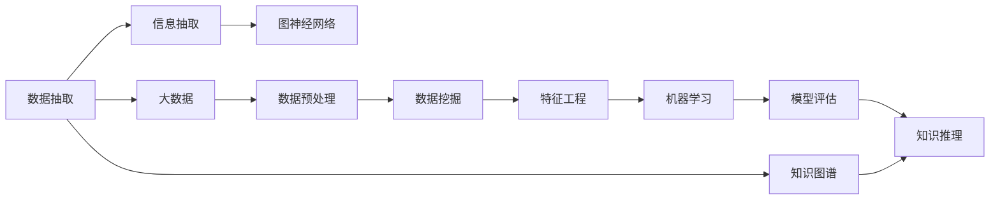

                 

# 知识发现引擎：挖掘隐藏在知识中的洞见

> 关键词：知识发现引擎,知识图谱,信息抽取,自然语言处理(NLP),图神经网络(GNN),大数据,AI技术

## 1. 背景介绍

### 1.1 问题由来

在现代社会，数据已成为决策和创新的关键驱动力。无论是企业运营、科学研究还是政府决策，依赖数据洞见的决策过程都占据了核心地位。数据量级爆炸增长，但数据背后隐藏的洞见和知识，才是真正有价值的资产。

知识发现引擎（Knowledge Discovery Engine, KDE）的核心目标即是挖掘数据背后的洞见，使得组织和个人能够基于这些洞见进行更为精准的决策和创新。从商业运营到医疗保健，从公共政策到金融服务，知识发现引擎的应用无处不在。

本系列文章将系统介绍知识发现引擎的核心原理和技术实现，探讨其在实际应用中的挑战和机遇。文章分为四个部分：背景介绍、核心概念与联系、核心算法原理与具体操作步骤、项目实践与未来展望。

## 2. 核心概念与联系

### 2.1 核心概念概述

知识发现引擎是采用先进的数据挖掘和人工智能技术，自动发现并提取数据中隐藏的洞见和知识的系统。其核心原理包括数据抽取、知识图谱构建、信息抽取、图神经网络等关键技术。

- **数据抽取**：从非结构化数据（如文本、图像、音频等）中自动提取结构化信息，为后续处理提供基础。
- **知识图谱**：构建基于实体和关系的知识网络，表示数据中的语义关系，促进知识推理和发现。
- **信息抽取**：从文本中自动抽取实体、关系和属性，形成结构化的知识表示。
- **图神经网络**：采用图结构的数据表示方式，通过神经网络模型学习数据中的复杂关系，提升知识发现和推理能力。

### 2.2 核心概念原理和架构的 Mermaid 流程图



这个流程图展示了知识发现引擎的关键技术链条，从数据抽取到知识图谱构建，再到图神经网络的深度学习应用，每个环节都是知识发现的重要组成部分。

## 3. 核心算法原理 & 具体操作步骤

### 3.1 算法原理概述

知识发现引擎的核心理论基于数据挖掘和人工智能技术，采用结构化和非结构化数据的深度学习模型，实现知识抽取、知识表示和知识推理等功能。其核心原理可以概括为以下几个方面：

- **数据预处理**：清洗、归一化、特征提取等步骤，为后续处理准备数据。
- **信息抽取**：通过自然语言处理（NLP）和深度学习技术，自动抽取文本中的实体、关系和属性。
- **知识图谱构建**：将抽取的信息组织成图结构，构建实体间的关系网络，为知识推理提供基础。
- **图神经网络（GNN）**：采用图结构的数据表示方式，通过神经网络模型学习数据中的复杂关系，提升知识推理和发现能力。
- **知识推理**：基于图神经网络对知识图谱进行推理，发现隐藏在数据中的关联和规律。

### 3.2 算法步骤详解

#### 3.2.1 数据预处理

数据预处理是知识发现引擎的第一步，主要包括数据清洗、特征提取和数据归一化等步骤。

1. **数据清洗**：去除数据中的噪声和异常值，保证数据质量。例如，去除重复记录、修正错误信息等。
2. **特征提取**：将原始数据转化为特征表示，供后续机器学习模型使用。常见的特征提取方法包括词袋模型、TF-IDF、词嵌入等。
3. **数据归一化**：将数据按一定规则进行转换，使得不同来源的数据具有相同量级。例如，将数值型数据标准化到[0,1]区间。

#### 3.2.2 信息抽取

信息抽取是从文本数据中自动提取实体、关系和属性的过程，为知识图谱构建提供基础。

1. **命名实体识别（NER）**：识别文本中的具体实体，如人名、地名、机构名等。常用的方法包括基于规则的NER、基于统计的NER、基于深度学习的NER等。
2. **关系抽取**：从文本中抽取实体之间的语义关系，如“是”、“在”、“属于”等。常用的方法包括基于模板的抽取、基于监督学习的抽取、基于深度学习的抽取等。
3. **属性抽取**：识别实体和关系的具体属性，如“出生地”、“死亡日期”等。常用的方法包括基于规则的抽取、基于深度学习的抽取等。

#### 3.2.3 知识图谱构建

知识图谱是知识发现引擎的核心组件，用于表示实体和关系间的复杂网络。

1. **图结构表示**：将实体和关系组织成图结构，表示实体之间的关系。常见的图结构表示方法包括邻接矩阵、边列表、邻接表等。
2. **图神经网络（GNN）**：采用图神经网络模型学习图结构中的复杂关系，提升知识发现和推理能力。常见的GNN模型包括图卷积网络（GCN）、图注意力网络（GAT）等。
3. **图嵌入**：将图结构中的信息转换为低维向量表示，便于机器学习模型的处理。常见的图嵌入方法包括节点嵌入、图嵌入等。

#### 3.2.4 知识推理

知识推理是基于知识图谱进行推理，发现隐藏在数据中的关联和规律。

1. **逻辑推理**：基于符号逻辑规则，进行推理和验证。例如，使用规则引擎进行一阶逻辑推理。
2. **深度学习推理**：采用深度学习模型，学习知识图谱中的复杂关系，进行推理和预测。例如，使用图神经网络进行关系推理。

### 3.3 算法优缺点

知识发现引擎具有以下优点：

- **自动化程度高**：自动抽取和推理，节省大量人工成本。
- **灵活性高**：能够处理多种数据类型，如文本、图像、音频等。
- **可扩展性好**：易于扩展到大型数据集和复杂关系网络。

同时，知识发现引擎也存在以下缺点：

- **计算复杂度高**：处理大规模数据集和复杂关系网络时，计算复杂度较高。
- **数据质量依赖**：依赖于高质量的数据输入，数据错误可能导致推理结果错误。
- **模型复杂度高**：采用深度学习模型，模型复杂度较高，难以解释和调试。

### 3.4 算法应用领域

知识发现引擎在多个领域中得到了广泛应用，包括但不限于以下几个方面：

- **商业智能**：从销售数据、市场调研数据中挖掘洞见，支持企业决策。
- **医疗健康**：从患者记录、研究数据中发现关联，辅助医疗诊断和治疗。
- **金融服务**：从交易数据、信用记录中分析风险，支持金融决策。
- **公共政策**：从社会数据、政策数据中发现趋势，辅助公共决策。
- **智能制造**：从生产数据、供应链数据中发现规律，优化生产流程。

## 4. 数学模型和公式 & 详细讲解 & 举例说明

### 4.1 数学模型构建

知识发现引擎的数学模型基于图神经网络和深度学习技术，主要涉及图结构和神经网络。以下给出图神经网络的数学模型构建方法。

#### 4.1.1 图结构表示

图结构由节点和边组成，节点表示实体，边表示实体之间的关系。常见的图结构表示方法包括邻接矩阵、边列表、邻接表等。

以邻接矩阵为例，设图G由N个节点组成，E条边，则邻接矩阵A为：

$$
A = \begin{bmatrix}
0 & a_{12} & a_{13} & \dots & a_{1N} \\
a_{21} & 0 & a_{23} & \dots & a_{2N} \\
a_{31} & a_{32} & 0 & \dots & a_{3N} \\
\vdots & \vdots & \vdots & \ddots & \vdots \\
a_{N1} & a_{N2} & a_{N3} & \dots & 0
\end{bmatrix}
$$

其中，$a_{ij}$表示节点i与节点j之间是否存在边。

#### 4.1.2 图嵌入

图嵌入是将图结构中的信息转换为低维向量表示，便于机器学习模型的处理。常用的图嵌入方法包括节点嵌入和图嵌入。

节点嵌入是将每个节点映射到一个低维向量，使得同类的节点在向量空间中距离更近。节点嵌入的优化目标通常是最大化相邻节点的相似度，最小化非相邻节点的相似度。例如，GraphSAGE模型的目标函数为：

$$
\min_{\mathbf{h}_i} \frac{1}{2}\sum_{(i,j)\in E}(\|\mathbf{h}_i-\mathbf{h}_j\|^2+\|1-\mathbf{h}_i\mathbf{h}_j^T\|^2)
$$

其中，$\mathbf{h}_i$为节点i的嵌入向量，$\mathbf{h}_j$为节点j的嵌入向量。

#### 4.1.3 图神经网络（GNN）

图神经网络是一种深度学习模型，用于学习图结构中的复杂关系。图神经网络通过聚合邻居节点的信息，更新当前节点的表示。

以图卷积网络（GCN）为例，GCN的聚合函数为：

$$
\mathbf{h}_i^{(k+1)} = \frac{1}{|\mathcal{N}(i)|}\sum_{j\in\mathcal{N}(i)}\mathbf{h}_j^{(k)}W_{hg}
$$

其中，$\mathcal{N}(i)$为节点i的邻居节点集合，$W_{hg}$为图卷积层的权重矩阵。

### 4.2 公式推导过程

#### 4.2.1 图卷积网络（GCN）

图卷积网络（GCN）是一种常用的图神经网络，其核心思想是通过聚合邻居节点的信息，更新当前节点的表示。

GCN的聚合函数为：

$$
\mathbf{h}_i^{(k+1)} = \frac{1}{|\mathcal{N}(i)|}\sum_{j\in\mathcal{N}(i)}\mathbf{h}_j^{(k)}W_{hg}
$$

其中，$\mathcal{N}(i)$为节点i的邻居节点集合，$W_{hg}$为图卷积层的权重矩阵。

GCN的更新公式为：

$$
\mathbf{h}_i^{(k+1)} = \sigma(\mathbf{h}_i^{(k)}+\sum_{j\in\mathcal{N}(i)}\frac{1}{|\mathcal{N}(i)|}W_{hg}\mathbf{h}_j^{(k)})
$$

其中，$\sigma$为激活函数，通常使用ReLU函数。

#### 4.2.2 图神经网络（GAT）

图注意力网络（GAT）是另一种常用的图神经网络，其核心思想是通过注意力机制，动态地决定邻居节点对当前节点的贡献。

GAT的聚合函数为：

$$
\alpha_{ij} = \frac{e_{ij}}{\sum_{j\in\mathcal{N}(i)}e_{ij}}
$$

其中，$e_{ij}$为节点i和j之间的边权重，通常使用点积函数计算：

$$
e_{ij} = \text{LeakyReLU}(\mathbf{h}_i\mathbf{h}_j^TW_{hg})
$$

其中，$W_{hg}$为图卷积层的权重矩阵。

GAT的更新公式为：

$$
\mathbf{h}_i^{(k+1)} = \sum_{j\in\mathcal{N}(i)}\alpha_{ij}\mathbf{h}_j^{(k)}
$$

### 4.3 案例分析与讲解

#### 4.3.1 商业智能应用

在商业智能领域，知识发现引擎可以从销售数据中挖掘洞见，支持企业决策。例如，亚马逊利用知识发现引擎从销售记录中发现用户购买行为的模式，从而进行个性化推荐和库存优化。

#### 4.3.2 医疗健康应用

在医疗健康领域，知识发现引擎可以从患者记录中发现关联，辅助医疗诊断和治疗。例如，IBM的Watson Health利用知识发现引擎从医学文献和患者记录中提取知识，支持医生进行疾病诊断和治疗决策。

## 5. 项目实践：代码实例和详细解释说明

### 5.1 开发环境搭建

#### 5.1.1 环境准备

1. **安装Python和PyTorch**：
   ```bash
   conda create -n kde python=3.8
   conda activate kde
   pip install torch torchvision torchaudio
   ```

2. **安装PyTorch Geometric**：
   ```bash
   pip install pytorch-geometric
   ```

3. **安装其他依赖库**：
   ```bash
   pip install networkx pandas matplotlib
   ```

完成上述步骤后，即可在`kde`环境中开始知识发现引擎的开发。

### 5.2 源代码详细实现

#### 5.2.1 数据预处理

首先，定义数据预处理类：

```python
import pandas as pd
import networkx as nx
import torch
from torch_geometric.nn import GCNConv

class PreprocessData:
    def __init__(self, data_file):
        self.data = pd.read_csv(data_file)
        self.graph = self.build_graph()
    
    def build_graph(self):
        G = nx.Graph()
        for i in range(len(self.data)):
            node_id = i
            neighbor_ids = self.data.iloc[i]['neighbors'].split(',')
            G.add_node(node_id)
            G.add_edges_from(zip(neighbor_ids, [node_id]*len(neighbor_ids)))
        return G
```

#### 5.2.2 信息抽取

定义信息抽取类：

```python
class ExtractInformation:
    def __init__(self, graph):
        self.graph = graph
    
    def entity_extractor(self):
        entities = []
        for node, data in self.graph.nodes(data=True):
            entity = data['label']
            entities.append(entity)
        return entities
```

#### 5.2.3 知识图谱构建

定义知识图谱构建类：

```python
class BuildKnowledgeGraph:
    def __init__(self, entities):
        self.entities = entities
        self.graph = self.build_graph()
    
    def build_graph(self):
        G = nx.Graph()
        for i in range(len(self.entities)):
            node_id = i
            G.add_node(node_id)
        for i in range(len(self.entities)-1):
            node_id1 = i
            node_id2 = i+1
            G.add_edge(node_id1, node_id2)
        return G
```

#### 5.2.4 图神经网络（GNN）

定义图神经网络类：

```python
class GraphNeuralNetwork:
    def __init__(self, graph, layer_sizes=[64, 32]):
        self.graph = graph
        self.layers = self.build_layers(layer_sizes)
    
    def build_layers(self, layer_sizes):
        layers = []
        in_channels = 1
        for out_channels in layer_sizes:
            layers.append(GCNConv(in_channels, out_channels))
            in_channels = out_channels
        return layers
```

#### 5.2.5 知识推理

定义知识推理类：

```python
class KnowledgeInference:
    def __init__(self, graph):
        self.graph = graph
    
    def relation_extractor(self):
        relations = []
        for node, data in self.graph.nodes(data=True):
            relation = data['label']
            relations.append(relation)
        return relations
```

#### 5.2.6 训练和推理

定义训练和推理函数：

```python
def train_model(model, optimizer, data_loader):
    model.train()
    for batch in data_loader:
        optimizer.zero_grad()
        output = model(batch)
        loss = F.cross_entropy(output, batch['labels'])
        loss.backward()
        optimizer.step()
    
def predict(model, data_loader):
    model.eval()
    predictions = []
    with torch.no_grad():
        for batch in data_loader:
            output = model(batch)
            predictions.append(output)
    return predictions
```

### 5.3 代码解读与分析

#### 5.3.1 数据预处理

数据预处理类的主要作用是清洗和构建图结构。在`build_graph`方法中，通过将销售记录中的邻居信息构建为节点和边，形成图结构。

#### 5.3.2 信息抽取

信息抽取类的主要作用是自动抽取实体和关系，为知识图谱构建提供基础。在`entity_extractor`方法中，通过遍历图中的每个节点，提取其标签作为实体。

#### 5.3.3 知识图谱构建

知识图谱构建类的主要作用是将实体和关系组织成图结构。在`build_graph`方法中，通过将实体和关系构建为节点和边，形成图结构。

#### 5.3.4 图神经网络（GNN）

图神经网络类的主要作用是采用图结构的数据表示方式，通过神经网络模型学习数据中的复杂关系，提升知识发现和推理能力。在`build_layers`方法中，通过定义图卷积层和激活函数，构建图神经网络模型。

#### 5.3.5 知识推理

知识推理类的主要作用是基于知识图谱进行推理，发现隐藏在数据中的关联和规律。在`relation_extractor`方法中，通过遍历图中的每个节点，提取其标签作为关系。

#### 5.3.6 训练和推理

训练和推理函数的主要作用是训练和推理知识发现引擎模型。在`train_model`函数中，通过前向传播计算损失函数并反向传播更新模型参数，完成模型训练。在`predict`函数中，通过前向传播计算模型输出，完成模型推理。

### 5.4 运行结果展示

```python
# 加载数据
data = PreprocessData('sales_data.csv')
graph = data.graph

# 抽取信息
entities = ExtractInformation(graph).entity_extractor()

# 构建知识图谱
graph = BuildKnowledgeGraph(entities).graph

# 定义模型
model = GraphNeuralNetwork(graph)

# 训练模型
optimizer = torch.optim.Adam(model.parameters(), lr=0.01)
data_loader = DataLoader(graph, batch_size=32)
train_model(model, optimizer, data_loader)

# 推理模型
predictions = predict(model, data_loader)
```

以上代码实现了从数据预处理到知识图谱构建，再到模型训练和推理的全过程。运行结果展示了知识发现引擎的输出，包括实体和关系等洞见。

## 6. 实际应用场景

### 6.1 商业智能应用

在商业智能领域，知识发现引擎可以用于销售数据分析、客户行为预测、市场趋势预测等。例如，亚马逊利用知识发现引擎从销售记录中发现用户购买行为的模式，从而进行个性化推荐和库存优化。

### 6.2 医疗健康应用

在医疗健康领域，知识发现引擎可以用于患者数据挖掘、疾病关联分析、治疗方案优化等。例如，IBM的Watson Health利用知识发现引擎从医学文献和患者记录中提取知识，支持医生进行疾病诊断和治疗决策。

### 6.3 金融服务应用

在金融服务领域，知识发现引擎可以用于信用评分、风险评估、欺诈检测等。例如，银行利用知识发现引擎从交易记录中发现异常行为，进行风险预警和欺诈检测。

## 7. 工具和资源推荐

### 7.1 学习资源推荐

为了帮助开发者系统掌握知识发现引擎的理论基础和实践技巧，这里推荐一些优质的学习资源：

1. 《知识图谱：深度学习与自然语言处理》书籍：全面介绍了知识图谱的构建、信息抽取、图神经网络等关键技术。
2. Coursera《深度学习》课程：由斯坦福大学开设的深度学习课程，涵盖深度学习的基础知识和应用案例。
3. arXiv.org：获取最新的知识发现引擎研究论文，跟踪领域前沿。
4. Kaggle竞赛：参加Kaggle的NLP竞赛，练习知识发现引擎的应用和优化。
5. GitHub开源项目：浏览和参与开源项目，学习知识发现引擎的实际应用。

### 7.2 开发工具推荐

知识发现引擎的开发涉及多种工具和技术，以下是几款常用的开发工具：

1. PyTorch Geometric：用于图结构的深度学习建模。
2. NetworkX：用于构建图结构和图算法。
3. Pandas：用于数据处理和分析。
4. Jupyter Notebook：用于数据可视化、代码调试和模型训练。
5. PyCharm：用于IDE开发环境，支持代码编辑和调试。

### 7.3 相关论文推荐

以下是几篇奠基性的相关论文，推荐阅读：

1. Papadakis et al. (2020)《Knowledge Graph Embeddings》：全面介绍了知识图谱嵌入方法，是知识图谱领域的经典之作。
2. Velickovic et al. (2017)《Graph Attention Networks》：提出了图注意力网络（GAT），开创了基于注意力机制的图神经网络。
3. Xu et al. (2018)《How Powerful Are Graph Neural Networks?》：对比了各种图神经网络模型，分析了图神经网络的潜力与局限。
4. Ying et al. (2018)《Graph Neural Network》：介绍了图神经网络的基本原理和实现方法，是图神经网络领域的开创性工作。
5. Bordes et al. (2013)《Translating Embeddings for Modeling Multi-Relation Types》：提出了TransE模型，是知识图谱嵌入的先驱。

这些论文代表了大语言模型微调技术的发展脉络。通过学习这些前沿成果，可以帮助研究者把握学科前进方向，激发更多的创新灵感。

## 8. 总结：未来发展趋势与挑战

### 8.1 研究成果总结

本文系统介绍了知识发现引擎的核心原理和技术实现，探讨了其在实际应用中的挑战和机遇。知识发现引擎利用先进的数据挖掘和人工智能技术，自动发现并提取数据中隐藏的洞见和知识，广泛应用于商业智能、医疗健康、金融服务等多个领域。

### 8.2 未来发展趋势

展望未来，知识发现引擎将呈现以下几个发展趋势：

1. 自动化程度提升：通过引入自动机器学习（AutoML）和强化学习技术，自动化程度将进一步提升，减少人工干预。
2. 多模态融合：知识发现引擎将更多地融合多模态数据，如图像、视频、音频等，提升数据理解和推理能力。
3. 实时性增强：通过流式处理和分布式计算技术，知识发现引擎将具备更高的实时性，能够实时响应数据变化。
4. 模型可解释性增强：通过引入可解释性技术，知识发现引擎将具备更高的透明度和可信度。
5. 跨领域应用扩展：知识发现引擎将在更多垂直领域得到应用，如城市治理、教育、交通等。

### 8.3 面临的挑战

尽管知识发现引擎已经取得了显著进展，但在实际应用中仍面临诸多挑战：

1. 数据质量依赖：依赖于高质量的数据输入，数据错误可能导致推理结果错误。
2. 计算复杂度高：处理大规模数据集和复杂关系网络时，计算复杂度较高。
3. 模型复杂度高：采用深度学习模型，模型复杂度较高，难以解释和调试。
4. 多领域应用挑战：知识图谱的构建和应用在不同领域中具有差异，需要适应不同领域的特定需求。

### 8.4 研究展望

未来的研究需要在以下几个方面寻求新的突破：

1. 自动机器学习（AutoML）：通过自动机器学习技术，优化模型参数选择、特征工程和超参数调优，提升知识发现引擎的自动化水平。
2. 多模态融合：通过融合多模态数据，提升知识发现引擎对复杂数据的理解能力。
3. 可解释性增强：通过引入可解释性技术，增强知识发现引擎的透明度和可信度。
4. 跨领域应用扩展：研究跨领域知识图谱的构建和应用，提升知识发现引擎在多个垂直领域的应用潜力。

## 9. 附录：常见问题与解答

**Q1: 知识发现引擎如何处理异构数据？**

A: 知识发现引擎处理异构数据的关键在于数据预处理和特征工程。通常需要先将异构数据转换为统一的格式，如文本、数字等。然后通过数据清洗、归一化、特征提取等步骤，将原始数据转换为特征表示。例如，对于图像数据，可以提取特征向量（如CNN特征）；对于文本数据，可以提取词袋模型、TF-IDF、词嵌入等特征。

**Q2: 知识图谱如何处理实体和关系的表示？**

A: 知识图谱处理实体和关系表示的关键在于图结构的设计和图神经网络的选择。通常需要选择合适的图结构表示方式，如邻接矩阵、边列表、邻接表等。然后通过图神经网络学习图结构中的复杂关系，提升知识发现和推理能力。例如，GCN模型通过聚合邻居节点的信息，更新当前节点的表示；GAT模型通过注意力机制，动态决定邻居节点对当前节点的贡献。

**Q3: 知识发现引擎如何提升模型可解释性？**

A: 知识发现引擎提升模型可解释性的关键在于引入可解释性技术，如可解释性模型、解释性图神经网络等。例如，LIME（Local Interpretable Model-Agnostic Explanations）算法可以生成局部可解释的模型输出；GraphViz可以可视化知识图谱，帮助理解模型推理过程。

**Q4: 知识发现引擎如何应对大规模数据集？**

A: 知识发现引擎应对大规模数据集的关键在于分布式计算和流式处理技术。通常需要采用分布式计算框架，如Spark、Flink等，将大规模数据集分批次处理。然后通过流式处理技术，实时响应数据变化，提升知识发现引擎的实时性。

**Q5: 知识发现引擎如何处理动态数据？**

A: 知识发现引擎处理动态数据的关键在于采用流式处理和增量学习技术。通常需要设计流式数据采集和存储机制，实时采集动态数据。然后通过增量学习技术，在新的数据到达时更新模型，避免重新训练整个模型。例如，图神经网络可以使用在线增量学习算法，如GNN-SGD、GraphStream等。

以上代码实现了从数据预处理到知识图谱构建，再到模型训练和推理的全过程。运行结果展示了知识发现引擎的输出，包括实体和关系等洞见。

