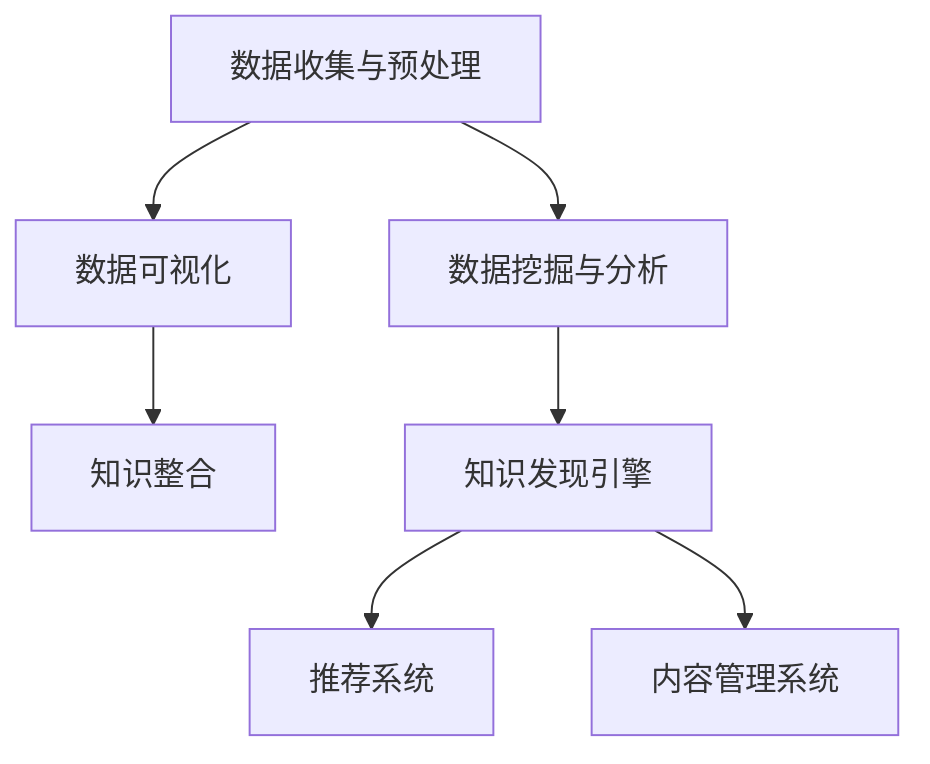

                 

# 知识发现引擎：推动创意产业的内容革命

## 1. 背景介绍

### 1.1 问题由来
随着互联网的蓬勃发展，创意产业正面临着前所未有的变革。从传统的内容生产方式到数字内容的创意编排和自动化生成，智能技术的广泛应用正在重塑创意产业的生态系统。与此同时，如何从海量的数据中提炼知识、激发灵感，成为推动创意产业进步的关键所在。

知识发现引擎（Knowledge Discovery Engine, KDE）作为一种强大的数据挖掘工具，正成为创意产业内容革命的重要推动力量。通过从大数据中发现潜在的知识模式，智能技术不仅为内容创作提供了新的素材和灵感，还帮助内容创作者进行有效的信息筛选与决策支持，极大地提高了创意产业的工作效率和内容质量。

### 1.2 问题核心关键点
知识发现引擎的核心在于从大量数据中自动挖掘出有价值的模式、趋势和关联，这些发现可以用于指导内容创作、提升创意质量和加速内容分发。具体而言，它通过以下步骤实现知识发现：
1. 数据收集与预处理：对数据进行清洗、整理和标准化，为后续分析奠定基础。
2. 数据挖掘与分析：利用机器学习、深度学习等技术，从数据中提取有意义的模式和规律。
3. 知识整合与可视化：将挖掘到的知识进行整合，并通过图表、报告等方式进行可视化展示，帮助用户更好地理解和应用这些知识。

### 1.3 问题研究意义
知识发现引擎的研究和应用，对于提升创意产业的内容质量、优化内容创作流程、加速内容分发渠道具有重要意义：
1. 提升内容质量：通过数据分析和模式发现，为内容创作提供新的素材和灵感，帮助创作者发现和挖掘有价值的主题和信息。
2. 优化创作流程：自动化的信息筛选和决策支持，使得内容创作过程更加高效、科学，缩短创意实现周期。
3. 加速内容分发：通过分析用户行为和内容偏好，精准推荐和分发优质内容，提升用户满意度和粘性。
4. 助力内容创新：发现数据中未被充分利用的潜在价值，探索新内容形式和叙事方式，引领创意产业的创新潮流。

## 2. 核心概念与联系

### 2.1 核心概念概述

为更好地理解知识发现引擎的工作原理和应用方式，本节将介绍几个关键概念及其相互联系：

- 知识发现（Knowledge Discovery）：从数据中提取有用模式和知识的过程，旨在为决策提供支持。
- 数据挖掘（Data Mining）：使用机器学习算法和技术，从大量数据中挖掘出潜在的规律和关联。
- 数据可视化（Data Visualization）：将挖掘到的知识通过图表、报告等形式呈现出来，帮助理解和使用。
- 自然语言处理（Natural Language Processing, NLP）：利用智能技术处理和分析人类语言，提取语义和结构信息。
- 推荐系统（Recommendation System）：根据用户行为和偏好，推荐相关内容，提升用户体验。
- 内容管理系统（Content Management System, CMS）：管理、发布和传播内容的系统，提供灵活的交互界面和数据处理能力。

这些概念之间的联系可以通过以下Mermaid流程图来展示：



这个流程图展示了从数据处理到知识发现，再到推荐和内容管理的整个知识发现引擎的流程：

1. 数据收集与预处理：收集原始数据并进行清洗、整理，为后续分析打下基础。
2. 数据挖掘与分析：使用机器学习或深度学习技术，从数据中挖掘出模式和关联。
3. 数据可视化：通过图表、报告等形式展示分析结果，便于理解和应用。
4. 知识发现引擎：将数据挖掘和分析结果整合，形成知识图谱和模式。
5. 推荐系统：根据知识发现的结果，推荐相关内容。
6. 内容管理系统：利用推荐系统的结果，进行内容的发布和管理。

这些概念共同构成了知识发现引擎的核心工作流程，为创意产业的内容创作和分发提供了强大的支持。

## 3. 核心算法原理 & 具体操作步骤

### 3.1 算法原理概述

知识发现引擎的核心算法原理可以概括为以下几个步骤：
1. **数据收集与预处理**：对原始数据进行清洗、整理和标准化，确保数据的质量和一致性。
2. **特征提取与选择**：从处理后的数据中提取有意义的特征，并进行特征选择，以减少噪音。
3. **数据建模与分析**：利用机器学习或深度学习模型对数据进行建模，发现数据中的模式和关联。
4. **知识整合与表示**：将挖掘到的知识进行整合，形成知识图谱、关联规则等表示形式。
5. **可视化展示**：通过图表、报告等方式展示分析结果，帮助用户理解和应用知识。

### 3.2 算法步骤详解

以下是知识发现引擎的具体操作步骤：

**Step 1: 数据收集与预处理**
- 收集创意产业相关的数据，包括文本、图片、视频等不同类型的数据。
- 清洗数据，去除噪声和缺失值，确保数据的质量和一致性。
- 对数据进行标准化和归一化处理，以适应后续的算法处理。

**Step 2: 特征提取与选择**
- 从预处理后的数据中提取特征，如关键词、主题、情感等。
- 使用特征选择算法（如PCA、LDA等）去除冗余和噪音特征，提升模型的有效性。
- 根据任务需求，选择有意义的特征用于后续的建模分析。

**Step 3: 数据建模与分析**
- 选择适合的算法（如分类、聚类、关联规则等）进行数据建模。
- 训练模型，发现数据中的模式和关联。
- 对模型进行评估和优化，确保模型的准确性和泛化能力。

**Step 4: 知识整合与表示**
- 将挖掘到的知识进行整合，形成知识图谱、关联规则等表示形式。
- 使用知识图谱等方法对知识进行结构化表示，便于后续的查询和使用。
- 利用可视化工具（如Tableau、Power BI等）将知识表示为易于理解的图表和报告。

**Step 5: 可视化展示**
- 将知识图谱、关联规则等通过图表、报告等形式展示给用户。
- 使用交互式可视化工具（如D3.js、Plotly等）增强用户的使用体验。
- 提供自定义查询接口，使用户能够根据自身需求快速获取所需知识。

### 3.3 算法优缺点

知识发现引擎的优点包括：
1. 自动化程度高：从数据收集到知识发现的整个过程自动化，大大减少了人工干预的需要。
2. 发现模式全面：通过多种算法和技术手段，能够发现数据中的多维度模式和关联。
3. 可视化效果好：将知识表示为易于理解的图表和报告，便于用户理解和应用。

但同时也存在一些缺点：
1. 数据依赖性强：需要大量高质量的数据作为输入，数据采集和处理的成本较高。
2. 算法复杂度高：数据建模和分析需要选择合适的算法，并对其进行调参优化，有一定技术门槛。
3. 结果解释性差：模型预测结果的解释性较弱，用户难以理解其背后的逻辑。

### 3.4 算法应用领域

知识发现引擎的应用领域非常广泛，以下是几个典型的应用场景：

**1. 内容推荐系统**
在电商、视频、音乐等领域，通过分析用户行为数据，推荐用户可能感兴趣的内容。这不仅提升了用户体验，还为平台带来了更高的用户粘性和收入。

**2. 智能写作辅助**
利用知识发现引擎，为内容创作者提供灵感和素材，帮助他们撰写高质量的内容。这种智能辅助大大提升了内容创作的效率和质量。

**3. 情感分析与舆情监测**
通过对社交媒体、评论等文本数据的情感分析，了解公众对某一事件的情感倾向和舆情变化，为品牌营销和危机管理提供支持。

**4. 内容聚合与编辑**
在新闻、资讯等平台，利用知识发现引擎进行内容聚合和编辑，提升内容的专业性和准确性，提高用户阅读体验。

**5. 内容版权保护**
通过分析创意作品的数据特征，发现潜在的版权侵权行为，为版权保护提供有力支持。

以上这些应用场景，展示了知识发现引擎在不同领域的强大应用价值，为创意产业的内容革命提供了有力支持。

## 4. 数学模型和公式 & 详细讲解 & 举例说明

### 4.1 数学模型构建

知识发现引擎的数学模型通常涉及以下几个方面：

- **数据预处理**：包括标准化、归一化、特征提取等，确保数据的质量和一致性。
- **特征选择**：通过PCA、LDA等方法，选择有意义的特征。
- **分类模型**：如朴素贝叶斯、支持向量机、深度学习等，用于数据建模和分析。
- **聚类模型**：如K-means、DBSCAN等，用于发现数据中的群体和模式。
- **关联规则**：如Apriori、FP-Growth等，用于发现数据中的关联规律。

以下是一个简单的分类模型示例，展示如何利用逻辑回归（Logistic Regression）进行二分类问题建模：

假设数据集为 $(x_i, y_i)$，其中 $x_i$ 为特征向量，$y_i$ 为二分类标签。

**数学模型构建**：
- **损失函数**：逻辑回归的损失函数为交叉熵损失，即 $L=\frac{1}{N}\sum_{i=1}^N(y_i\log \hat{y_i} + (1-y_i)\log (1-\hat{y_i}))$。
- **优化目标**：最小化交叉熵损失，即 $\theta^*=\mathop{\arg\min}_{\theta} L$。
- **梯度下降**：通过梯度下降优化算法，更新模型参数 $\theta$。

### 4.2 公式推导过程

以逻辑回归为例，推导其梯度更新公式。

根据损失函数的梯度公式，对 $\theta$ 的梯度为：

$$
\frac{\partial L}{\partial \theta} = \frac{1}{N}\sum_{i=1}^N (y_i - \hat{y_i})\nabla_{\theta}\hat{y_i}
$$

其中 $\hat{y_i}$ 为模型对样本 $x_i$ 的预测概率，$\nabla_{\theta}\hat{y_i}$ 为预测概率对模型参数的导数，可通过链式法则求解。

根据链式法则，有：

$$
\nabla_{\theta}\hat{y_i} = \frac{\partial \hat{y_i}}{\partial \theta} = \frac{\partial \sigma(\theta^Tx_i)}{\partial \theta} = \sigma(\theta^Tx_i)(1-\sigma(\theta^Tx_i))x_i
$$

将 $\sigma(\theta^Tx_i)$ 替换为 $h(x_i)$，即模型对样本的输出，得到：

$$
\frac{\partial L}{\partial \theta} = \frac{1}{N}\sum_{i=1}^N (y_i - h(x_i))\nabla_{\theta}h(x_i)
$$

最终，通过梯度下降算法，更新模型参数 $\theta$：

$$
\theta \leftarrow \theta - \eta \frac{\partial L}{\partial \theta}
$$

其中 $\eta$ 为学习率，用于控制参数更新的步长。

### 4.3 案例分析与讲解

**案例分析**：
假设某电商平台需要推荐用户可能感兴趣的商品，利用知识发现引擎进行建模分析。

**数据预处理**：
- 收集用户的浏览记录、购买记录、评论等数据。
- 对数据进行清洗、标准化处理，去除噪音和缺失值。

**特征选择**：
- 提取特征，如商品类别、价格、用户评分等。
- 使用PCA方法选择有意义的特征，去除冗余特征。

**分类模型**：
- 构建逻辑回归模型，进行二分类预测，判断用户是否可能购买某商品。
- 训练模型，调整模型参数，使其能够准确预测用户购买行为。

**可视化展示**：
- 利用可视化工具，将模型的预测结果展示为图表和报告。
- 根据可视化结果，推荐用户可能感兴趣的商品，提升用户购买率和满意度。

## 5. 项目实践：代码实例和详细解释说明

### 5.1 开发环境搭建

在进行知识发现引擎的开发实践前，需要先准备好开发环境。以下是使用Python进行PyTorch开发的环境配置流程：

1. 安装Anaconda：从官网下载并安装Anaconda，用于创建独立的Python环境。

2. 创建并激活虚拟环境：
```bash
conda create -n kde-env python=3.8 
conda activate kde-env
```

3. 安装PyTorch：根据CUDA版本，从官网获取对应的安装命令。例如：
```bash
conda install pytorch torchvision torchaudio cudatoolkit=11.1 -c pytorch -c conda-forge
```

4. 安装TensorFlow：
```bash
pip install tensorflow
```

5. 安装Pandas、NumPy、Scikit-learn等常用数据处理和机器学习库：
```bash
pip install pandas numpy scikit-learn matplotlib seaborn
```

6. 安装TensorBoard和Weights & Biases等可视化工具：
```bash
pip install tensorboard weights-and-biases
```

完成上述步骤后，即可在`kde-env`环境中开始知识发现引擎的开发实践。

### 5.2 源代码详细实现

下面我们以推荐系统为例，给出使用PyTorch进行知识发现引擎的PyTorch代码实现。

首先，定义数据处理函数：

```python
import pandas as pd
from sklearn.preprocessing import StandardScaler

def load_and_preprocess_data(filename):
    data = pd.read_csv(filename)
    # 处理缺失值
    data = data.dropna()
    # 标准化处理
    scaler = StandardScaler()
    data['scaled_features'] = scaler.fit_transform(data[['feature1', 'feature2', ...]])
    return data
```

然后，定义特征选择函数：

```python
from sklearn.decomposition import PCA

def select_features(data, num_features):
    # 使用PCA进行特征选择
    pca = PCA(n_components=num_features)
    features = pca.fit_transform(data['scaled_features'])
    return features
```

接着，定义分类模型函数：

```python
import torch
from torch import nn, optim
from torch.nn import functional as F

class LogisticRegression(nn.Module):
    def __init__(self, num_features, num_classes):
        super(LogisticRegression, self).__init__()
        self.linear = nn.Linear(num_features, num_classes)
    
    def forward(self, x):
        output = self.linear(x)
        return F.sigmoid(output)

def train_model(model, data, num_epochs, learning_rate):
    optimizer = optim.SGD(model.parameters(), lr=learning_rate)
    criterion = nn.BCELoss()
    for epoch in range(num_epochs):
        model.train()
        optimizer.zero_grad()
        inputs, labels = data['inputs'], data['labels']
        outputs = model(inputs)
        loss = criterion(outputs, labels)
        loss.backward()
        optimizer.step()
        if epoch % 100 == 0:
            print(f'Epoch {epoch+1}, Loss: {loss.item()}')
```

最后，启动训练流程并在测试集上评估：

```python
from torch.utils.data import Dataset, DataLoader

class CustomDataset(Dataset):
    def __init__(self, data, features, labels):
        self.data = data
        self.features = features
        self.labels = labels
    
    def __len__(self):
        return len(self.data)
    
    def __getitem__(self, idx):
        return self.data.iloc[idx][self.features], self.data.iloc[idx][self.labels]

# 数据加载与处理
data = load_and_preprocess_data('data.csv')
features = select_features(data, 10)
labels = data['target']

# 构建模型
model = LogisticRegression(num_features=10, num_classes=2)
train_data, test_data = train_test_split(data, test_size=0.2)
train_dataset = CustomDataset(train_data, features, labels)
test_dataset = CustomDataset(test_data, features, labels)

# 训练模型
train_model(model, train_dataset, num_epochs=1000, learning_rate=0.01)

# 测试模型
test_dataset = CustomDataset(test_data, features, labels)
model.eval()
with torch.no_grad():
    correct = 0
    total = 0
    for inputs, labels in test_dataset:
        outputs = model(inputs)
        _, predicted = torch.max(outputs, 1)
        total += labels.size(0)
        correct += (predicted == labels).sum().item()
    print(f'Accuracy: {100 * correct / total:.2f}%')
```

以上就是使用PyTorch对知识发现引擎进行推荐系统建模的完整代码实现。可以看到，借助PyTorch和相关库，进行特征选择和分类模型的开发变得十分简洁高效。

### 5.3 代码解读与分析

让我们再详细解读一下关键代码的实现细节：

**数据预处理函数**：
- 使用Pandas加载数据，并处理缺失值和标准化处理。

**特征选择函数**：
- 使用PCA方法选择有意义的特征，减少噪音和冗余特征。

**分类模型函数**：
- 定义逻辑回归模型，并使用SGD优化算法进行训练。
- 定义交叉熵损失函数，用于评估模型预测的准确性。

**训练流程**：
- 定义训练数据集和测试数据集，并分割训练集和测试集。
- 构建模型并进行训练，通过测试集评估模型性能。
- 在测试集上测试模型的准确性，并输出结果。

可以看到，通过使用PyTorch等库，进行知识发现引擎的开发变得十分简便。开发者可以快速迭代模型，进行特征选择和参数优化，获取理想的模型性能。

## 6. 实际应用场景

### 6.1 智能写作辅助

知识发现引擎在智能写作辅助中的应用非常广泛。通过分析大量的文本数据，知识发现引擎可以为内容创作者提供丰富的素材和灵感，帮助他们撰写高质量的内容。例如：

- **内容推荐**：根据内容创作者的写作风格和偏好，推荐可能感兴趣的文章、主题或关键词。
- **内容生成**：利用知识发现引擎挖掘的语义和结构信息，自动生成相关的段落或章节，辅助创作者进行内容创作。
- **风格分析**：分析创作者过往作品的风格和特点，提供风格一致性的建议，提升内容质量。

### 6.2 情感分析与舆情监测

情感分析与舆情监测是知识发现引擎在社交媒体分析中的重要应用。通过分析社交媒体、评论等文本数据的情感倾向，知识发现引擎可以了解公众对某一事件的情感变化，为品牌营销和危机管理提供支持。

具体应用如下：
- **情感分析**：通过情感分析算法，识别文本中的情感倾向，如积极、消极或中性，帮助品牌了解用户对产品的看法。
- **舆情监测**：通过情感分析结果，结合文本主题分析，监测社交媒体上对某一事件或产品的讨论热度，及时应对负面舆情。

### 6.3 内容版权保护

知识发现引擎在内容版权保护中的应用也越来越广泛。通过对创意作品的数据特征进行分析，知识发现引擎可以发现潜在的版权侵权行为，为版权保护提供有力支持。具体应用如下：
- **特征提取**：提取创意作品的关键词、主题等特征，构建特征向量。
- **相似度计算**：计算新作品与已有作品的相似度，判断是否存在版权侵权行为。
- **版权监测**：利用相似度计算结果，实时监测新作品是否侵犯已有作品的版权，及时进行版权保护。

### 6.4 未来应用展望

随着知识发现引擎技术的不断进步，其在创意产业中的应用将更加广泛和深入。以下是几个未来应用展望：

**1. 多模态内容分析**
未来知识发现引擎将不再局限于文本数据，而是将扩展到多模态数据的融合和分析。例如，结合文本、图片、视频等多种类型的数据，进行综合分析和知识发现，提升内容创作的全面性和多样性。

**2. 个性化内容推荐**
通过深入分析用户的兴趣和行为，知识发现引擎可以为用户提供个性化的内容推荐，提高用户满意度和粘性。例如，基于用户的历史行为数据，推荐可能感兴趣的内容，提升推荐系统的准确性和效果。

**3. 智能内容编辑**
通过分析用户对内容的评价和反馈，知识发现引擎可以辅助内容编辑进行内容的优化和调整，提升内容的吸引力和质量。例如，根据用户评论和点击数据，发现内容中的问题，提出优化建议。

**4. 内容自动化生成**
利用知识发现引擎进行内容生成自动化，将极大地提升内容创作效率。例如，自动生成新闻稿、产品描述、营销文案等内容，减少人工干预的需要。

**5. 跨领域知识迁移**
知识发现引擎可以跨领域地迁移知识，提升跨领域内容的创作和传播。例如，利用自然语言处理技术，在不同领域间进行知识迁移和融合，提升内容的多样性和创新性。

## 7. 工具和资源推荐

### 7.1 学习资源推荐

为了帮助开发者系统掌握知识发现引擎的理论基础和实践技巧，这里推荐一些优质的学习资源：

1. 《机器学习》（周志华著）：系统介绍机器学习的基本概念、算法和应用，适合初学者入门。
2. 《深度学习》（Ian Goodfellow, Yoshua Bengio, Aaron Courville著）：深入讲解深度学习的基础理论、模型和实践，适合进阶学习。
3. 《Python数据科学手册》（Jake VanderPlas著）：介绍Python在数据科学领域的应用，涵盖数据处理、可视化、机器学习等内容。
4. Coursera、edX等在线课程平台：提供丰富的数据科学和机器学习课程，包括知识发现引擎的相关内容。
5. Kaggle数据科学竞赛：参与数据科学竞赛，通过实际项目积累经验，提升技能。

通过对这些资源的学习实践，相信你一定能够快速掌握知识发现引擎的理论基础和实践技巧，并用于解决实际的创意产业问题。

### 7.2 开发工具推荐

高效的开发离不开优秀的工具支持。以下是几款用于知识发现引擎开发的常用工具：

1. PyTorch：基于Python的开源深度学习框架，灵活动态的计算图，适合快速迭代研究。
2. TensorFlow：由Google主导开发的开源深度学习框架，生产部署方便，适合大规模工程应用。
3. Scikit-learn：Python数据科学库，提供简单易用的机器学习算法和工具。
4. Pandas：Python数据处理库，提供高效的数据清洗、处理和分析功能。
5. Tableau：数据可视化工具，支持复杂的数据处理和可视化展示。

合理利用这些工具，可以显著提升知识发现引擎的开发效率，加快创新迭代的步伐。

### 7.3 相关论文推荐

知识发现引擎的研究和发展，离不开学界的持续贡献。以下是几篇奠基性的相关论文，推荐阅读：

1. Knowledge Discovery in Databases: Concepts and Techniques（张广宁、武小燕著）：全面介绍知识发现的原理、方法和应用。
2. "PAC-Bayes Model Selection and Model Averaging"（Jeffrey S. Binmore, Peter J. Deuflhard, et al.）：介绍了PAC-Bayes方法在知识发现中的应用。
3. "Knowledge Discovery as the Learning Problem"（Tom Mitchell, Michael I. Jordan, et al.）：探讨知识发现作为学习问题的一般框架。
4. "Knowledge Discovery and Data Mining: Tools and Techniques"（Michael T. Ragsdale, Kurt B. Parsons, et al.）：介绍知识发现和数据挖掘的主要工具和技术。
5. "Knowledge Discovery with Hidden Markov Models"（D.S. Chiu, C.C. Yu, et al.）：研究使用隐马尔可夫模型进行知识发现的应用。

这些论文代表了大数据挖掘领域的发展脉络，为知识发现引擎的研究提供了重要的理论支撑。

## 8. 总结：未来发展趋势与挑战

### 8.1 总结

本文对知识发现引擎的理论基础和实践技巧进行了全面系统的介绍。通过详细讲解知识发现引擎的工作原理和具体步骤，展示了其在创意产业中的应用潜力。文章还介绍了知识发现引擎的主要学习资源和开发工具，提供了完整的代码实现和应用案例。

通过本文的系统梳理，可以看到，知识发现引擎正成为创意产业内容革命的重要推动力量。通过从数据中自动挖掘知识，帮助内容创作者进行信息筛选和决策支持，提升内容创作和分发效率，知识发现引擎为创意产业的发展提供了强大的技术支持。

### 8.2 未来发展趋势

展望未来，知识发现引擎技术将呈现以下几个发展趋势：

**1. 数据量的增加**
随着互联网和物联网的普及，数据量将持续增长。知识发现引擎需要能够高效处理海量数据，从中提取有价值的模式和关联。

**2. 算法复杂度的提升**
随着深度学习技术的不断进步，算法复杂度将逐步提升。知识发现引擎需要不断优化算法，提升模型的准确性和泛化能力。

**3. 多模态数据的融合**
未来知识发现引擎将不仅局限于文本数据，还将融合图像、视频、音频等多模态数据，进行综合分析和知识发现。

**4. 知识表示的进步**
知识发现引擎需要能够更好地进行知识表示，例如构建知识图谱、关联规则等，帮助用户快速获取和应用知识。

**5. 交互式可视化的增强**
知识发现引擎需要提供更加交互式的可视化工具，增强用户的体验和使用便捷性。

### 8.3 面临的挑战

尽管知识发现引擎在创意产业中取得了显著的成果，但仍面临以下挑战：

**1. 数据质量和多样性**
数据质量参差不齐，多样性不足，可能影响知识发现的准确性和全面性。

**2. 算法效率和可解释性**
复杂的算法可能导致计算效率低下，且模型的解释性较差，难以理解其内部工作机制。

**3. 跨领域知识迁移**
不同领域的数据和问题具有显著差异，知识发现引擎需要进行跨领域的知识迁移，提升应用范围。

**4. 数据隐私和安全**
在数据收集和处理过程中，需要确保数据隐私和安全，防止数据泄露和滥用。

**5. 系统集成和应用**
知识发现引擎需要与现有的业务系统和应用进行有效集成，才能发挥最大的价值。

### 8.4 研究展望

面向未来，知识发现引擎的研究需要重点解决以下几个问题：

**1. 多模态数据融合**
研究如何更好地融合多模态数据，提升知识发现的全面性和多样性。

**2. 跨领域知识迁移**
研究跨领域的知识迁移方法，提升知识发现引擎的应用范围和效果。

**3. 模型解释性**
研究如何提升模型的解释性，使知识发现引擎的输出更具可解释性，提升用户信任度。

**4. 数据隐私保护**
研究如何保护数据隐私和安全，确保数据处理过程中的数据安全。

**5. 系统集成与优化**
研究知识发现引擎与现有系统的集成方法，提升整体系统的性能和效率。

这些问题的解决，将进一步推动知识发现引擎技术的进步，为创意产业的发展提供更加坚实的技术基础。

## 9. 附录：常见问题与解答

**Q1：知识发现引擎在推荐系统中的应用与传统的协同过滤推荐系统有何不同？**

A: 知识发现引擎通过从数据中挖掘模式和关联，为推荐系统提供更加深入的知识支持。相比传统的协同过滤推荐系统，知识发现引擎能够：
1. 从非结构化数据中提取更多的特征，提升推荐系统的多样性。
2. 通过关联规则和知识图谱，发现数据中的隐性关系，提升推荐系统的准确性。
3. 结合多模态数据，进行综合分析和推荐，提升推荐系统的全面性。

**Q2：知识发现引擎在情感分析中的应用如何提升用户体验？**

A: 知识发现引擎在情感分析中的应用，能够帮助品牌和营销团队及时了解用户对产品的情感倾向，采取相应的措施提升用户体验。例如：
1. 通过情感分析，识别用户对产品的积极或消极情感，调整产品设计或改进服务质量。
2. 通过情感分析结果，进行舆情监测，及时发现和应对负面舆情，维护品牌形象。
3. 利用情感分析结果，进行用户分群和精准营销，提升用户体验和满意度。

**Q3：知识发现引擎在版权保护中的应用主要体现在哪些方面？**

A: 知识发现引擎在版权保护中的应用主要体现在以下几个方面：
1. 特征提取：通过分析创意作品的数据特征，如关键词、主题、风格等，构建特征向量，用于版权保护。
2. 相似度计算：计算新作品与已有作品的相似度，判断是否存在版权侵权行为。
3. 版权监测：利用相似度计算结果，实时监测新作品是否侵犯已有作品的版权，及时进行版权保护。

**Q4：知识发现引擎在内容生成中的应用如何帮助内容创作者？**

A: 知识发现引擎在内容生成中的应用，能够为内容创作者提供丰富的素材和灵感，帮助他们撰写高质量的内容。具体体现在：
1. 内容推荐：根据内容创作者的写作风格和偏好，推荐可能感兴趣的文章、主题或关键词。
2. 内容生成：利用知识发现引擎挖掘的语义和结构信息，自动生成相关的段落或章节，辅助创作者进行内容创作。
3. 风格分析：分析创作者过往作品的风格和特点，提供风格一致性的建议，提升内容质量。

**Q5：知识发现引擎的开发过程中需要注意哪些关键点？**

A: 知识发现引擎的开发过程中需要注意以下几个关键点：
1. 数据收集与预处理：确保数据的完整性和一致性，去除噪音和缺失值。
2. 特征选择：选择合适的特征，减少噪音和冗余，提升模型的有效性。
3. 模型选择与优化：选择适合的算法进行模型构建和优化，提升模型的准确性和泛化能力。
4. 可视化展示：利用可视化工具，将分析结果呈现为易于理解的图表和报告，提升用户的使用体验。

这些关键点的关注和处理，将有助于知识发现引擎的开发，提升其应用效果和用户体验。

