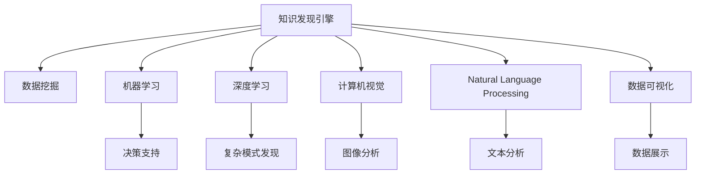

                 

# 知识发现引擎：推动创意产业的创新变革

> 关键词：知识发现引擎, 创意产业, 创新变革, 数据挖掘, 机器学习, 深度学习, 计算机视觉, 自然语言处理, 数据可视化, 人工智能, 大模型

## 1. 背景介绍

### 1.1 问题由来

随着数字化转型和智能技术的快速发展，创意产业已成为全球经济的重要驱动力之一。无论是电影、音乐、文学，还是游戏、广告、设计，创意产业不仅创造了巨大的经济价值，也深刻影响了人类的文化生活和思维模式。然而，创意产业面临诸多挑战，如内容的同质化、创新力的瓶颈、市场需求的波动等。如何通过数据驱动和技术创新，激发创意产业的活力，提升其创新能力，是当前亟待解决的重大问题。

### 1.2 问题核心关键点

在数字化、信息化的浪潮中，大数据和人工智能技术逐渐成为推动创意产业创新的重要工具。特别是在数据挖掘和机器学习领域，通过构建知识发现引擎，从海量数据中挖掘出潜在的创意元素和关联关系，为创意产业提供丰富的数据支持，帮助开发者、创意人员和决策者做出更加精准、高效的决策，从而推动行业的持续创新和发展。

### 1.3 问题研究意义

知识发现引擎通过挖掘数据中的隐含知识和模式，为创意产业带来了新的视角和工具。这不仅有助于打破创意的瓶颈，激发更多新的创意，还能提升创意产品的质量和市场竞争力。同时，知识发现引擎还能够助力企业优化管理流程、提升决策效率，为创意产业带来更高效、更智能的运作模式。因此，研究知识发现引擎对于推动创意产业的创新变革具有重要意义。

## 2. 核心概念与联系

### 2.1 核心概念概述

为更好地理解知识发现引擎在创意产业中的应用，本节将介绍几个密切相关的核心概念：

- 知识发现引擎（Knowledge Discovery Engine, KDE）：通过数据挖掘和机器学习技术，从海量数据中发现潜在的知识模式和关联关系，为创意产业提供数据支持和智能决策工具。
- 创意产业（Creative Industries）：包括影视、音乐、文学、游戏、广告、设计等多个领域，以创意为核心驱动力的产业集群。
- 数据挖掘（Data Mining）：从大量数据中挖掘出有用的信息和知识，帮助决策者发现数据中的隐含模式。
- 机器学习（Machine Learning）：通过训练算法模型，使计算机从数据中学习和提取知识，提高决策的准确性和效率。
- 深度学习（Deep Learning）：一种基于多层神经网络的机器学习技术，能够处理非结构化数据，从数据中发现复杂模式和关联。
- 计算机视觉（Computer Vision）：使用机器学习技术实现图像和视频的分析和理解，为创意产业提供视觉数据支持。
- 自然语言处理（Natural Language Processing, NLP）：通过机器学习技术处理和分析文本数据，为创意产业提供文本数据分析工具。
- 数据可视化（Data Visualization）：将数据转化为图形和图表，直观展示数据中的模式和关联，帮助创意人员理解数据。

这些核心概念之间的逻辑关系可以通过以下Mermaid流程图来展示：



这个流程图展示了知识发现引擎的核心概念及其之间的关系：

1. 知识发现引擎通过数据挖掘和机器学习技术，从大量数据中提取有用的信息。
2. 机器学习和深度学习分别针对不同类型的数据，提升模型复杂度和精度。
3. 计算机视觉和自然语言处理提供专门的数据处理技术，帮助处理图像和文本数据。
4. 数据可视化将数据转化为直观的图形和图表，帮助创意人员理解数据。
5. 决策支持系统利用知识发现引擎提供的智能工具，优化创意产业的决策流程。

这些概念共同构成了知识发现引擎在创意产业中的应用框架，使得其能够充分发挥数据驱动和智能决策的优势。

## 3. 核心算法原理 & 具体操作步骤

### 3.1 算法原理概述

知识发现引擎的核心原理是数据挖掘和机器学习技术，通过训练算法模型，从海量数据中发现潜在的知识模式和关联关系，从而为创意产业提供数据支持和智能决策工具。其主要包括以下几个步骤：

1. **数据预处理**：清洗和整理数据，去除噪声和异常值，进行特征工程和标准化处理。
2. **模型训练**：选择合适的算法模型，如分类、聚类、回归等，训练模型参数，使其能够从数据中学习出有意义的模式。
3. **模式识别**：通过模型预测和分类，发现数据中的潜在关联和知识模式。
4. **结果验证**：对模型预测结果进行验证和评估，确保其准确性和可靠性。
5. **知识应用**：将挖掘出的知识模式应用于创意产业的各个环节，如内容创作、市场分析、用户体验优化等，推动产业创新和发展。

### 3.2 算法步骤详解

知识发现引擎的具体操作步骤可以分为以下几步：

**Step 1: 数据收集与预处理**
- 收集创意产业相关的海量数据，包括文本、图片、音频等不同类型的数据。
- 对数据进行清洗和整理，去除噪声和异常值，进行特征提取和标准化处理。

**Step 2: 模型训练与优化**
- 选择合适的算法模型，如随机森林、神经网络、支持向量机等，进行模型训练。
- 使用交叉验证等方法进行模型优化，确保模型能够泛化到新数据。
- 引入正则化、剪枝等技术，避免过拟合，提高模型泛化能力。

**Step 3: 模式识别与分析**
- 对训练好的模型进行测试和验证，使用准确率、召回率、F1分数等指标评估模型性能。
- 根据模型预测结果，识别数据中的潜在关联和知识模式，如主题分布、情感倾向、用户行为等。
- 使用关联规则、聚类分析等方法，进一步深入分析数据中的隐含知识。

**Step 4: 知识应用与反馈**
- 将挖掘出的知识模式应用于创意产业的各个环节，如内容创作、市场分析、用户体验优化等。
- 收集用户反馈和市场数据，对模型进行不断迭代和优化。
- 定期更新数据集，确保知识发现引擎能够适应数据分布的变化。

### 3.3 算法优缺点

知识发现引擎在创意产业中具有以下优点：
1. 数据驱动：通过数据挖掘和机器学习技术，发现创意产业中的潜在知识和模式，提供数据支持和智能决策工具。
2. 智能决策：通过训练算法模型，提高决策的准确性和效率，优化创意产业的运营和管理。
3. 跨领域应用：能够处理不同类型的数据，如文本、图像、音频等，提供全面的数据分析工具。
4. 促进创新：通过挖掘数据中的隐含知识，激发创意产业的创新能力，推动行业的持续发展。

同时，该方法也存在一定的局限性：
1. 数据依赖：知识发现引擎的效果很大程度上取决于数据的质量和数量，获取高质量数据的成本较高。
2. 模型复杂：复杂的数据挖掘和机器学习模型需要大量计算资源，训练和推理过程较为耗时。
3. 解释性不足：许多知识发现引擎的模型具有"黑盒"特性，难以解释其内部工作机制和决策逻辑。
4. 模型过拟合：过度拟合训练数据可能导致模型泛化能力下降，在实际应用中效果不佳。

尽管存在这些局限性，但就目前而言，知识发现引擎仍是创意产业中重要的数据分析工具，通过不断优化模型和算法，其应用效果将得到进一步提升。

### 3.4 算法应用领域

知识发现引擎在创意产业中已经得到了广泛的应用，覆盖了多个领域，例如：

- **影视产业**：通过分析电影、电视剧等作品的剧情、角色、风格等数据，发现创意元素和关联关系，优化剧本创作和选角流程。
- **音乐产业**：使用音频分析技术，挖掘音乐作品的旋律、节奏、和声等特征，为创作提供灵感和指导。
- **文学产业**：分析小说、诗歌等文本数据，识别主题分布和情感倾向，辅助文学创作和出版决策。
- **游戏产业**：通过用户行为数据分析，优化游戏设计和用户体验，提升游戏产品的市场竞争力。
- **广告产业**：分析广告素材和用户反馈，发现潜在的市场需求和创意元素，优化广告投放策略。
- **设计产业**：使用计算机视觉技术，分析图片和视频数据，提供视觉设计灵感和创意指导。

除了上述这些经典领域外，知识发现引擎还被创新性地应用到更多场景中，如品牌管理、营销策略、创意竞争分析等，为创意产业带来了新的创新思路。

## 4. 数学模型和公式 & 详细讲解 & 举例说明

### 4.1 数学模型构建

知识发现引擎的数学模型构建主要基于机器学习算法，以下以随机森林（Random Forest）为例进行讲解。

**随机森林模型**
随机森林是一种集成学习方法，通过训练多个决策树，利用其平均结果来提高预测准确性。对于创意产业中的文本数据，可以采用朴素贝叶斯分类器、支持向量机等算法进行模型训练。

假设文本数据集为 $D=\{(x_i,y_i)\}_{i=1}^N, x_i \in \mathcal{X}, y_i \in \{0,1\}$，其中 $x_i$ 表示文本，$y_i$ 表示标签（如正面情感、负面情感）。随机森林模型的构建步骤如下：

1. **特征选择**：从文本数据中提取特征，如词频、TF-IDF等，用于训练决策树。
2. **决策树训练**：使用Bootstrap采样和随机特征选择方法，训练多个决策树。
3. **集成预测**：将多个决策树的预测结果进行投票，得出最终的分类结果。

### 4.2 公式推导过程

以下以朴素贝叶斯分类器为例，推导其数学模型和公式。

假设文本数据集为 $D=\{(x_i,y_i)\}_{i=1}^N, x_i \in \mathcal{X}, y_i \in \{0,1\}$，其中 $x_i$ 表示文本，$y_i$ 表示标签。朴素贝叶斯分类器的公式如下：

$$
p(y_i|x_i) = \frac{p(x_i|y_i)p(y_i)}{p(x_i)}
$$

其中，$p(x_i|y_i)$ 表示在标签为 $y_i$ 的情况下，文本 $x_i$ 的概率分布，$p(y_i)$ 表示标签 $y_i$ 的先验概率，$p(x_i)$ 表示文本 $x_i$ 的先验概率。

通过最大化后验概率，可以得出文本 $x_i$ 在标签 $y_i$ 下的概率，从而实现文本分类。

### 4.3 案例分析与讲解

假设我们有一个包含电影评论的文本数据集，标签表示正面情感（1）或负面情感（0）。我们可以使用朴素贝叶斯分类器进行文本分类，步骤如下：

1. **特征选择**：选择文本中的关键词作为特征，如“精彩”、“糟糕”等。
2. **训练模型**：使用训练集数据训练朴素贝叶斯分类器。
3. **预测分类**：将测试集数据输入训练好的模型，得到预测结果。

以下是一个朴素贝叶斯分类器的Python代码实现：

```python
from sklearn.feature_extraction.text import CountVectorizer
from sklearn.naive_bayes import MultinomialNB
from sklearn.model_selection import train_test_split

# 文本数据集
X = ["这部电影真的很精彩", "这部电影太糟糕了"]
y = [1, 0]

# 特征选择
vectorizer = CountVectorizer()
X_vectorized = vectorizer.fit_transform(X)

# 训练模型
clf = MultinomialNB()
clf.fit(X_vectorized, y)

# 预测分类
X_test = ["这部电影不错"]
X_test_vectorized = vectorizer.transform([X_test])
pred = clf.predict(X_test_vectorized)

print(pred)
```

通过上述代码，我们可以使用朴素贝叶斯分类器对电影评论进行情感分类，输出结果为预测标签。

## 5. 项目实践：代码实例和详细解释说明

### 5.1 开发环境搭建

在进行项目实践前，我们需要准备好开发环境。以下是使用Python进行Scikit-learn开发的环境配置流程：

1. 安装Anaconda：从官网下载并安装Anaconda，用于创建独立的Python环境。

2. 创建并激活虚拟环境：
```bash
conda create -n scikit-learn-env python=3.8 
conda activate scikit-learn-env
```

3. 安装Scikit-learn：
```bash
pip install scikit-learn
```

4. 安装其他各类工具包：
```bash
pip install numpy pandas matplotlib jupyter notebook ipython
```

完成上述步骤后，即可在`scikit-learn-env`环境中开始项目实践。

### 5.2 源代码详细实现

下面我们以情感分析任务为例，给出使用Scikit-learn库对朴素贝叶斯分类器进行训练的Python代码实现。

```python
from sklearn.feature_extraction.text import CountVectorizer
from sklearn.naive_bayes import MultinomialNB
from sklearn.model_selection import train_test_split
from sklearn.metrics import classification_report

# 文本数据集
X = ["这部电影真的很精彩", "这部电影太糟糕了"]
y = [1, 0]

# 特征选择
vectorizer = CountVectorizer()
X_vectorized = vectorizer.fit_transform(X)

# 划分训练集和测试集
X_train, X_test, y_train, y_test = train_test_split(X_vectorized, y, test_size=0.2, random_state=42)

# 训练模型
clf = MultinomialNB()
clf.fit(X_train, y_train)

# 预测分类
y_pred = clf.predict(X_test)

# 评估模型
print(classification_report(y_test, y_pred))
```

通过上述代码，我们可以使用朴素贝叶斯分类器对电影评论进行情感分类，并输出分类效果评估报告。

### 5.3 代码解读与分析

让我们再详细解读一下关键代码的实现细节：

**文本数据集定义**
- `X`：包含电影评论的文本数据集。
- `y`：对应文本标签，表示正面情感（1）或负面情感（0）。

**特征选择**
- `CountVectorizer`：使用词频特征选择方法，将文本转化为特征向量。
- `X_vectorized`：特征向量化的文本数据。

**模型训练与预测**
- `MultinomialNB`：定义朴素贝叶斯分类器模型。
- `clf.fit(X_train, y_train)`：训练模型。
- `clf.predict(X_test)`：对测试集进行预测分类。

**结果评估**
- `classification_report(y_test, y_pred)`：输出分类效果评估报告，包括精确率、召回率、F1分数等指标。

通过以上步骤，我们实现了使用朴素贝叶斯分类器进行情感分析的完整代码实现。可以看到，Scikit-learn库提供的高度封装和简单易用的API，使得模型训练和评估变得非常容易。

## 6. 实际应用场景

### 6.1 影视产业

在影视产业中，知识发现引擎可以用于以下应用场景：

- **剧本创作优化**：分析热门电影的剧情结构、角色设置等数据，发现创作灵感和创新元素，优化剧本创作流程。
- **选角推荐**：分析演员的表演风格、角色匹配度等数据，推荐合适的演员人选，提升选角效率和效果。
- **市场趋势分析**：分析票房数据、观众反馈等数据，预测电影市场趋势，指导制作决策。

### 6.2 音乐产业

在音乐产业中，知识发现引擎可以用于以下应用场景：

- **创作灵感挖掘**：分析音乐作品的数据，挖掘旋律、节奏、和声等特征，为音乐创作提供灵感和指导。
- **用户行为分析**：分析音乐用户的听歌记录、喜好等数据，发现用户偏好和需求，优化音乐推荐策略。
- **市场竞争分析**：分析音乐市场的数据，识别竞争对手的优势和劣势，制定市场策略。

### 6.3 文学产业

在文学产业中，知识发现引擎可以用于以下应用场景：

- **主题分布分析**：分析小说、诗歌等文本数据，识别主题分布和情感倾向，辅助文学创作和出版决策。
- **文学风格识别**：分析作家的作品数据，识别其写作风格和特点，为文学研究提供数据支持。
- **用户反馈分析**：分析读者评论和反馈数据，发现文学作品的优缺点，指导创作和改进。

### 6.4 游戏产业

在游戏产业中，知识发现引擎可以用于以下应用场景：

- **用户体验优化**：分析用户行为数据，优化游戏设计和用户体验，提升玩家满意度。
- **游戏内容创作**：分析热门游戏的剧情、角色等数据，发现创意元素和关联关系，指导游戏内容创作。
- **市场分析与策略**：分析市场数据，预测游戏市场趋势，制定游戏策略和推广方案。

## 7. 工具和资源推荐

### 7.1 学习资源推荐

为了帮助开发者系统掌握知识发现引擎的理论基础和实践技巧，这里推荐一些优质的学习资源：

1. 《Python数据科学手册》系列博文：由数据科学领域专家撰写，深入浅出地介绍了数据科学的基本概念和实践方法，包括机器学习、数据挖掘等内容。

2. 《机器学习实战》书籍：详细介绍了机器学习的基本概念和实现方法，涵盖线性回归、分类、聚类等多个机器学习算法。

3. 《Python深度学习》书籍：全面介绍了深度学习的基本概念和实现方法，涵盖神经网络、卷积神经网络、循环神经网络等深度学习模型。

4. 《Python数据可视化》书籍：介绍了数据可视化的基本概念和实现方法，涵盖Matplotlib、Seaborn等多个Python可视化工具。

5. 《Python编程：从入门到实践》书籍：介绍了Python编程的基本概念和实现方法，涵盖数据处理、机器学习等多个应用领域。

通过对这些资源的学习实践，相信你一定能够快速掌握知识发现引擎的理论基础和实践技巧，并用于解决实际的创意产业问题。

### 7.2 开发工具推荐

高效的开发离不开优秀的工具支持。以下是几款用于知识发现引擎开发的常用工具：

1. Jupyter Notebook：用于编写和运行Python代码，支持交互式编程和数据可视化。

2. Matplotlib：用于绘制各种图形和图表，支持多种数据可视化方式。

3. Seaborn：基于Matplotlib的高级可视化库，支持更丰富的数据展示方式。

4. Pandas：用于数据处理和分析，支持多种数据格式和操作方式。

5. Scikit-learn：用于机器学习和数据挖掘，提供丰富的算法模型和工具。

6. TensorFlow和PyTorch：用于深度学习开发，支持大规模神经网络模型的训练和推理。

合理利用这些工具，可以显著提升知识发现引擎的开发效率，加快创新迭代的步伐。

### 7.3 相关论文推荐

知识发现引擎和创意产业的研究源于学界的持续研究。以下是几篇奠基性的相关论文，推荐阅读：

1. 《随机森林：决策树集成方法》（随机森林的原创论文）：介绍了随机森林算法的原理和实现方法，展示了其优异的预测准确性。

2. 《朴素贝叶斯分类器》（朴素贝叶斯分类器的经典论文）：详细介绍了朴素贝叶斯分类器的原理和实现方法，展示了其在文本分类中的高效性。

3. 《深度学习在自然语言处理中的应用》：介绍了深度学习在自然语言处理中的广泛应用，展示了其在文本分类、情感分析、机器翻译等任务中的优越性能。

4. 《计算机视觉中的深度学习》：介绍了深度学习在计算机视觉中的应用，展示了其在图像分类、目标检测、语义分割等任务中的高效性。

这些论文代表了大数据挖掘和机器学习在创意产业中的应用方向，通过学习这些前沿成果，可以帮助研究者把握学科前进方向，激发更多的创新灵感。

## 8. 总结：未来发展趋势与挑战

### 8.1 总结

本文对知识发现引擎在创意产业中的应用进行了全面系统的介绍。首先阐述了知识发现引擎的研究背景和意义，明确了其在推动创意产业创新中的重要价值。其次，从原理到实践，详细讲解了知识发现引擎的数学模型和操作步骤，给出了项目实践的完整代码实例。同时，本文还广泛探讨了知识发现引擎在影视、音乐、文学、游戏等领域的实际应用场景，展示了其在创意产业中的广泛应用前景。此外，本文精选了知识发现引擎的学习资源、开发工具和相关论文，力求为读者提供全方位的技术指引。

通过本文的系统梳理，可以看到，知识发现引擎在创意产业中的应用前景广阔，通过挖掘数据中的隐含知识和模式，为创意产业带来了新的视角和工具。随着数据驱动和技术创新的不断推进，知识发现引擎必将成为创意产业中不可或缺的重要工具，推动创意产业的持续创新和发展。

### 8.2 未来发展趋势

展望未来，知识发现引擎在创意产业中呈现以下几个发展趋势：

1. **数据驱动**：随着大数据和人工智能技术的不断进步，知识发现引擎将更加依赖数据驱动，通过分析海量数据发现隐含知识和模式，提供更丰富的数据支持和智能决策工具。

2. **智能化**：未来知识发现引擎将更加智能化，引入深度学习等先进算法，提高模型的复杂度和精度，发现更加复杂和深层次的关联关系。

3. **跨领域应用**：知识发现引擎将进一步拓展应用领域，涵盖影视、音乐、文学、游戏、广告等多个创意产业，提供全面的数据分析工具。

4. **用户体验优化**：知识发现引擎将更加注重用户体验，通过优化创意产品的设计和推广策略，提升用户满意度和市场竞争力。

5. **个性化推荐**：利用知识发现引擎的数据分析能力，提供个性化推荐服务，提升用户粘性和市场份额。

6. **智能决策支持**：知识发现引擎将更加智能，通过预测和分析，为创意产业提供更加精准和高效的决策支持。

这些趋势凸显了知识发现引擎在创意产业中的重要地位，推动其不断优化和创新，以满足创意产业日益增长的数据需求和智能决策需求。

### 8.3 面临的挑战

尽管知识发现引擎在创意产业中取得了显著成效，但在迈向更加智能化、普适化应用的过程中，仍面临诸多挑战：

1. **数据质量瓶颈**：高质量数据是知识发现引擎的基石，但获取创意产业中的高质量数据成本较高，数据分布不均等问题仍需解决。

2. **模型复杂性**：复杂的数据挖掘和机器学习模型需要大量计算资源，训练和推理过程较为耗时，难以满足实时性需求。

3. **解释性不足**：许多知识发现引擎的模型具有"黑盒"特性，难以解释其内部工作机制和决策逻辑，影响模型的可信度和可靠性。

4. **过拟合问题**：过度拟合训练数据可能导致模型泛化能力下降，在实际应用中效果不佳，需要不断优化模型和算法。

5. **伦理与隐私问题**：知识发现引擎在处理创意产业数据时，需要注意隐私保护和伦理问题，避免数据滥用和伦理风险。

6. **技术落地难题**：知识发现引擎需要与创意产业的多样化场景进行深度融合，技术落地需要克服众多挑战，如资源优化、系统稳定性等。

这些挑战需要学界和产业界共同努力，不断优化技术方案，提高知识发现引擎的性能和可靠性，推动其在创意产业中的广泛应用。

### 8.4 研究展望

面对知识发现引擎所面临的挑战，未来的研究需要在以下几个方面寻求新的突破：

1. **数据增强与清洗**：探索如何通过数据增强和清洗技术，提高数据质量和多样性，降低数据获取成本。

2. **模型优化与并行化**：优化知识发现引擎的算法模型，引入并行化计算技术，提高模型训练和推理效率，满足实时性需求。

3. **解释性与可解释性**：研究可解释性技术，如特征可视化、模型可解释等，提高知识发现引擎的透明性和可信度。

4. **多模态数据融合**：将文本、图像、音频等多模态数据进行融合，构建更加全面和精确的知识发现引擎。

5. **自动化决策支持**：引入自动化决策技术，如强化学习、博弈论等，提高知识发现引擎的智能决策能力。

6. **伦理与安全保障**：研究伦理与安全保障技术，确保知识发现引擎在处理创意产业数据时的隐私保护和伦理约束。

这些研究方向将引领知识发现引擎在创意产业中的创新发展，推动其更好地服务于创意产业的创新与变革。

## 9. 附录：常见问题与解答

**Q1：知识发现引擎与传统的数据挖掘方法有哪些区别？**

A: 知识发现引擎与传统的数据挖掘方法有以下几个区别：

1. **数据驱动**：知识发现引擎更加依赖数据驱动，通过分析海量数据发现隐含知识和模式，提供更丰富的数据支持和智能决策工具。

2. **智能化**：未来知识发现引擎将更加智能化，引入深度学习等先进算法，提高模型的复杂度和精度。

3. **跨领域应用**：知识发现引擎将进一步拓展应用领域，涵盖影视、音乐、文学、游戏等多个创意产业，提供全面的数据分析工具。

4. **用户体验优化**：知识发现引擎将更加注重用户体验，通过优化创意产品的设计和推广策略，提升用户满意度和市场竞争力。

**Q2：如何选择合适的知识发现引擎算法？**

A: 选择合适的知识发现引擎算法需要根据具体应用场景和数据特点进行选择。以下是一些常见的算法及其适用场景：

1. **朴素贝叶斯分类器**：适用于文本分类任务，如情感分析、主题分类等。

2. **随机森林**：适用于数据分类和预测任务，如市场趋势预测、选角推荐等。

3. **支持向量机**：适用于分类和回归任务，如用户行为分析、游戏内容创作等。

4. **深度学习模型**：适用于复杂的数据分析任务，如音乐创作、文学研究等。

5. **关联规则挖掘**：适用于市场分析和用户行为分析，如购物篮分析、用户推荐等。

6. **聚类分析**：适用于数据分组和模式识别，如主题分类、情感分析等。

选择合适的算法需要考虑数据类型、任务需求、计算资源等因素，确保算法能够高效地解决问题。

**Q3：知识发现引擎在创意产业中的应用有哪些潜在的伦理问题？**

A: 知识发现引擎在创意产业中的应用可能涉及以下潜在的伦理问题：

1. **隐私保护**：处理创意产业数据时，需要严格保护用户隐私，确保数据使用合法合规。

2. **版权问题**：知识发现引擎在分析创意作品时，需要遵守版权法规，避免侵犯知识产权。

3. **公平性**：知识发现引擎的输出结果需要公正客观，避免算法偏见和歧视，确保公平公正。

4. **数据安全**：保护创意产业数据的安全性，防止数据泄露和滥用。

5. **伦理审查**：在知识发现引擎的应用中，需要进行伦理审查，确保其符合伦理道德标准。

通过采取严格的隐私保护措施、遵守版权法规、保证算法公正性、加强数据安全保护、进行伦理审查等措施，可以有效应对知识发现引擎在创意产业中的伦理问题，确保其应用的安全性和合规性。

**Q4：知识发现引擎在创意产业中的数据预处理步骤有哪些？**

A: 知识发现引擎在创意产业中的数据预处理步骤主要包括：

1. **数据清洗**：去除噪声和异常值，修正数据格式错误。

2. **数据标准化**：对不同格式的数据进行标准化处理，如归一化、离散化等。

3. **特征选择**：从文本、图像、音频等数据中提取有用的特征，如词频、TF-IDF、音调等。

4. **数据增强**：通过数据增强技术，如回译、近义替换等，扩充数据集，提高模型的泛化能力。

5. **数据分割**：将数据集划分为训练集、验证集和测试集，确保模型在各个环节的稳定性和准确性。

6. **数据可视化**：通过数据可视化工具，如Matplotlib、Seaborn等，直观展示数据分布和特征关系，帮助理解数据。

通过以上数据预处理步骤，可以确保数据的质量和多样性，提高知识发现引擎的模型训练和预测效果。

**Q5：知识发现引擎在创意产业中的数据可视化步骤有哪些？**

A: 知识发现引擎在创意产业中的数据可视化步骤主要包括：

1. **数据准备**：将数据集进行格式化和处理，确保数据能够被可视化工具读取。

2. **选择合适的可视化工具**：根据数据类型和应用需求，选择合适的可视化工具，如Matplotlib、Seaborn、Tableau等。

3. **可视化设计**：设计可视化图表和图形，包括柱状图、折线图、散点图等。

4. **数据展示**：将数据通过可视化工具展示出来，直观展示数据中的模式和关联。

5. **结果分析**：对可视化结果进行分析和解读，提取有用的信息和知识。

6. **互动和动态展示**：通过交互式和动态展示技术，如D3.js、Highcharts等，增强可视化效果。

通过以上数据可视化步骤，可以将复杂的数据转化为直观的图形和图表，帮助创意人员理解数据，提取有用的信息和知识。

---

作者：禅与计算机程序设计艺术 / Zen and the Art of Computer Programming

