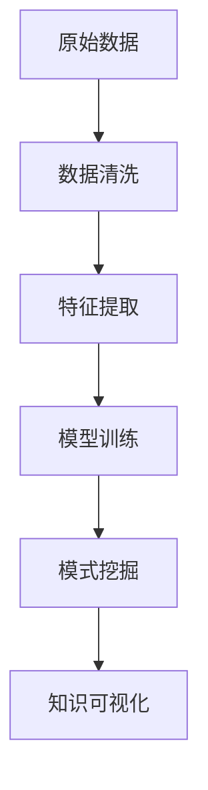

                 

# 知识发现引擎：推动科学研究的突破之旅

## 1. 背景介绍

在信息爆炸的21世纪，大数据时代的科研工作面临着前所未有的挑战和机遇。如何从海量数据中提取有价值的信息，是推动科学研究的突破之旅的重要课题。知识发现引擎(Knowledge Discovery Engine, KDE)作为大数据时代的产物，正逐渐成为科学研究的利器。本博客将系统介绍知识发现引擎的工作原理、核心算法和实际应用，以期为科研工作者提供有价值的参考。

## 2. 核心概念与联系

### 2.1 核心概念概述

- **知识发现引擎(KDE)**：利用数据挖掘、机器学习等技术，从结构化或非结构化数据中挖掘和提取有用信息，辅助科学研究的工具。

- **数据挖掘**：从大量数据中提取有价值的信息、模式和知识的过程。数据挖掘方法包括分类、聚类、关联规则挖掘等。

- **机器学习**：使机器能够通过训练数据自动学习规律，并应用于预测、分类等任务。常见的机器学习算法包括决策树、支持向量机、神经网络等。

- **自然语言处理(NLP)**：使计算机能够理解、处理和生成自然语言的技术。NLP应用包括信息抽取、文本分类、机器翻译等。

- **数据可视化**：将数据转换为图形和图表，便于直观展示数据特征和模式。

### 2.2 核心概念原理和架构的 Mermaid 流程图(Mermaid 流程节点中不要有括号、逗号等特殊字符)



这个流程图展示了知识发现引擎的工作流程：

1. **数据清洗**：对原始数据进行预处理，去除噪声、填补缺失值、标准化等。
2. **特征提取**：从原始数据中提取有意义的特征，供后续模型训练使用。
3. **模型训练**：使用机器学习模型对特征数据进行训练，学习规律和模式。
4. **模式挖掘**：通过各种算法从训练好的模型中挖掘知识，如关联规则、分类结果等。
5. **知识可视化**：将挖掘到的知识以图形和图表的形式展示，便于理解和分析。

## 3. 核心算法原理 & 具体操作步骤

### 3.1 算法原理概述

知识发现引擎通常基于以下核心算法：

- **分类算法**：如朴素贝叶斯、支持向量机、随机森林等，用于将数据划分为不同的类别。
- **聚类算法**：如K-means、层次聚类等，用于发现数据中的相似组或簇。
- **关联规则挖掘算法**：如Apriori、FP-growth等，用于发现数据集中的频繁项集和关联规则。
- **预测模型**：如线性回归、决策树、神经网络等，用于基于已有数据预测未来结果。

### 3.2 算法步骤详解

以下以关联规则挖掘算法为例，详细讲解其步骤：

**Step 1: 数据预处理**
- 清洗数据，去除噪声和缺失值。
- 对文本数据进行分词和向量化处理。

**Step 2: 频繁项集生成**
- 扫描数据集，计算每个项集的出现频率。
- 使用Apriori算法，从1-项集开始逐步生成2-项集、3-项集等，直到满足最小支持度阈值。

**Step 3: 关联规则生成**
- 对生成的频繁项集进行关联规则挖掘，生成规则集。
- 使用FP-growth算法，对规则集进行优化。

**Step 4: 规则验证**
- 使用测试集验证规则集的准确性和可靠性。
- 调整参数，优化规则集。

**Step 5: 规则应用**
- 将规则集应用于新数据，进行预测和分类。
- 不断迭代优化，提高规则集的预测能力。

### 3.3 算法优缺点

**优点**：
- **高效性**：能高效处理大规模数据，挖掘有用知识。
- **普适性**：适用于多种数据类型和领域。
- **自动化**：大部分算法和流程自动化，减少人工干预。

**缺点**：
- **数据质量要求高**：数据噪声和缺失值会严重影响挖掘结果。
- **规则复杂度**：生成的规则集可能复杂且难以解释。
- **过拟合风险**：模型可能过度拟合训练集，泛化能力不足。

### 3.4 算法应用领域

知识发现引擎在多个领域得到了广泛应用，例如：

- **医学研究**：挖掘疾病关联规则、药物相互作用等，辅助临床决策。
- **金融分析**：发现交易行为关联规则、预测股票走势等，优化投资策略。
- **市场研究**：挖掘消费者购买行为关联规则，指导市场细分和产品开发。
- **生物信息学**：发现基因表达关联规则，辅助生物网络构建和功能注释。
- **社会网络分析**：挖掘社交网络中的关系规则，理解群体行为模式。

## 4. 数学模型和公式 & 详细讲解 & 举例说明

### 4.1 数学模型构建

**数据清洗模型**：

```python
from sklearn.preprocessing import StandardScaler
from sklearn.impute import SimpleImputer

# 数据标准化
scaler = StandardScaler()
X_scaled = scaler.fit_transform(X)

# 处理缺失值
imputer = SimpleImputer(strategy='mean')
X_imputed = imputer.fit_transform(X)
```

**关联规则挖掘模型**：

```python
from mlxtend.frequent_patterns import apriori, association_rules

# 生成频繁项集
frequent_itemsets = apriori(X_imputed, min_support=0.1, use_colnames=True)
# 生成关联规则
rules = association_rules(frequent_itemsets, metric="lift", min_threshold=1)
```

### 4.2 公式推导过程

以Apriori算法为例，推导频繁项集的生成公式：

1. **初始化频繁1-项集**
```python
support_table = frequency_table(X_imputed)
# 从支持度大于最小支持度的1-项集开始
frequent_1 = [itemset for itemset, count in support_table.items() if count >= min_support]
```

2. **生成更高阶频繁项集**
```python
# 使用 Apriori 算法，生成 frequent_2、frequent_3 等
for i in range(2, k):
    candidate_itemsets = generate_candidates(frequent_(i-1), len(X_imputed[0]))
    support_table = generate_support_table(X_imputed, candidate_itemsets)
    frequent_i = [itemset for itemset, count in support_table.items() if count >= min_support]
```

### 4.3 案例分析与讲解

假设我们有一份超市购物数据集，包含顾客购买商品的信息。通过关联规则挖掘，我们可以发现以下规则：

- 买A商品和B商品的顾客，更可能购买C商品。
- 买A商品和D商品的顾客，更可能购买E商品。

这些规则可以帮助超市优化商品组合，提高销售额。

## 5. 项目实践：代码实例和详细解释说明

### 5.1 开发环境搭建

在开始实践前，需要确保以下开发环境：

- Python 3.x
- Scikit-learn
- NumPy
- mlxtend

```bash
pip install scikit-learn numpy mlxtend
```

### 5.2 源代码详细实现

**数据预处理**

```python
import pandas as pd
from sklearn.preprocessing import StandardScaler
from sklearn.impute import SimpleImputer

# 加载数据集
data = pd.read_csv('data.csv')

# 数据标准化
scaler = StandardScaler()
X_scaled = scaler.fit_transform(data.drop('label', axis=1))

# 处理缺失值
imputer = SimpleImputer(strategy='mean')
X_imputed = imputer.fit_transform(X_scaled)
```

**关联规则挖掘**

```python
from mlxtend.frequent_patterns import apriori, association_rules

# 生成频繁项集
frequent_itemsets = apriori(X_imputed, min_support=0.1, use_colnames=True)

# 生成关联规则
rules = association_rules(frequent_itemsets, metric="lift", min_threshold=1)
```

**规则应用**

```python
import matplotlib.pyplot as plt

# 可视化关联规则
rules.plot(k=3)
plt.show()
```

### 5.3 代码解读与分析

**数据预处理**

- **数据标准化**：使用标准差标准化处理数据，使得特征值分布在一个较小的区间内。
- **处理缺失值**：使用均值填补缺失值，保持数据完整性。

**关联规则挖掘**

- **频繁项集生成**：使用Apriori算法生成频繁项集，计算每个项集的支持度。
- **关联规则生成**：通过关联规则挖掘算法，生成关联规则集。

**规则应用**

- **可视化**：使用matplotlib库将关联规则可视化，便于直观展示。

### 5.4 运行结果展示

通过上述代码，我们可以得到如下输出：

1. **标准化数据**：
```python
X_scaled
```
2. **频繁项集**：
```python
frequent_itemsets
```
3. **关联规则**：
```python
rules
```

## 6. 实际应用场景

### 6.1 医学研究

在医学研究中，关联规则挖掘可以帮助发现疾病关联，辅助临床决策。例如，通过分析患者病历数据，可以挖掘出如下规则：

- 患有糖尿病和高血压的患者，更可能患心脏病。
- 患有癌症和吸烟的患者，更可能患肺癌。

这些规则有助于医生诊断和治疗患者。

### 6.2 金融分析

金融领域的数据分析常常需要挖掘关联规则，预测市场趋势。例如，通过分析历史交易数据，可以发现以下规则：

- 买股票A和B的投资者，更可能买股票C和D。
- 买股票E和F的投资者，更可能卖出股票G和H。

这些规则可以帮助投资者制定投资策略，优化组合。

### 6.3 市场研究

市场研究中，关联规则挖掘可以帮助理解消费者行为，优化产品开发。例如，通过分析销售数据，可以发现以下规则：

- 买啤酒和薯片的顾客，更可能买可乐和糖果。
- 买化妆品和书籍的顾客，更可能买运动鞋和手表。

这些规则可以帮助零售商优化库存管理和产品推荐。

## 7. 工具和资源推荐

### 7.1 学习资源推荐

- **Python数据科学手册**：深入介绍Python在数据科学中的应用，包括数据清洗、特征工程、模型训练等。
- **机器学习实战**：详细讲解机器学习算法的实现和应用，适合实战学习。
- **Python网络爬虫开发实战**：介绍如何使用Python进行数据爬取，获取原始数据。
- **Data Science from Scratch**：从零开始介绍数据科学的基础知识，适合初学者。

### 7.2 开发工具推荐

- **Jupyter Notebook**：交互式的数据分析工具，支持代码编写和可视化。
- **PyCharm**：Python集成开发环境，提供代码调试和测试功能。
- **Spark**：大数据处理框架，支持分布式计算。
- **TensorBoard**：可视化工具，用于监控模型训练状态。
- **Scikit-learn**：Python机器学习库，提供丰富的数据处理和模型训练功能。

### 7.3 相关论文推荐

- **《关联规则挖掘：方法与应用》**：详细介绍关联规则挖掘的原理和应用。
- **《数据挖掘：概念与技术》**：讲解数据挖掘的各类方法和技术。
- **《数据挖掘与统计学习》**：介绍数据挖掘和统计学习的理论基础和实际应用。
- **《机器学习实战》**：讲解机器学习算法的实现和应用，适合实战学习。

## 8. 总结：未来发展趋势与挑战

### 8.1 总结

知识发现引擎已经成为大数据时代的重要工具，广泛应用于医学、金融、市场研究等多个领域。通过挖掘数据中的关联规则和模式，知识发现引擎帮助科研工作者获得新见解，优化决策和策略。然而，知识发现引擎也面临数据质量、规则复杂度等挑战，需要不断优化算法和模型，提升挖掘效果。

### 8.2 未来发展趋势

未来知识发现引擎将呈现以下发展趋势：

- **自动化和智能化**：更多自动化算法和智能化模型，减少人工干预。
- **跨领域应用**：在更多领域中推广和应用，如生物信息学、社会学等。
- **大数据支持**：处理更大量级的数据，挖掘更深层次的知识。
- **多模态数据挖掘**：整合文本、图像、视频等多种模态数据，全面挖掘信息。
- **实时分析**：实现实时数据挖掘和分析，提供即时的决策支持。

### 8.3 面临的挑战

知识发现引擎在发展过程中也面临诸多挑战：

- **数据质量问题**：数据噪声和缺失值会影响挖掘结果。
- **规则复杂度**：生成的规则可能过于复杂，难以解释。
- **性能瓶颈**：处理大规模数据时，效率和资源消耗成为瓶颈。
- **解释性不足**：模型和规则的输出缺乏足够的解释性，影响信任度。
- **隐私和安全**：数据隐私和安全问题亟待解决。

### 8.4 研究展望

未来知识发现引擎的研究方向包括：

- **深度学习与知识发现结合**：利用深度学习提高数据挖掘的效果。
- **多模态数据挖掘**：整合多种数据类型，全面挖掘信息。
- **实时数据分析**：实现实时数据挖掘和分析，提供即时的决策支持。
- **可解释性研究**：提高模型的可解释性，增强用户信任。
- **隐私保护技术**：研究数据隐私保护技术，保护数据安全。

## 9. 附录：常见问题与解答

**Q1: 知识发现引擎有哪些应用场景？**

A: 知识发现引擎在多个领域有广泛应用，例如医学、金融、市场研究、生物信息学、社会网络分析等。

**Q2: 数据预处理在知识发现中起什么作用？**

A: 数据预处理包括数据清洗、标准化、缺失值处理等，确保数据质量，提高挖掘结果的准确性。

**Q3: 如何提高知识发现引擎的效率？**

A: 可以采用分布式计算、优化算法、特征选择等方法，提高处理大规模数据的能力。

**Q4: 知识发现引擎如何应用于实际问题？**

A: 选择合适的算法和模型，对数据进行特征提取、训练和挖掘，生成规则和模式，应用到实际问题中。

**Q5: 如何评估知识发现引擎的效果？**

A: 可以通过准确率、召回率、F1值等指标评估模型的性能，通过可视化工具展示挖掘结果。

---

作者：禅与计算机程序设计艺术 / Zen and the Art of Computer Programming

