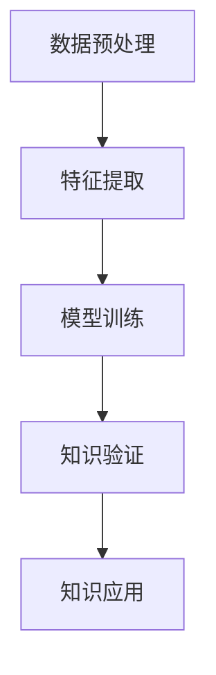

                 

# 知识发现引擎：推动科学研究的突破之旅

> 关键词：知识发现引擎, 数据挖掘, 机器学习, 自然语言处理, 深度学习, 科学发现, 大数据

## 1. 背景介绍

在当今信息爆炸的时代，科学研究正面临着前所未有的机遇和挑战。大量科学文献、实验数据和观测结果不断涌现，如何从中挖掘出新的知识、揭示隐藏的科学规律，成为科研工作者面临的首要任务。传统的文献检索、手工分析和实验验证等方法，已经难以应对这种庞大数据量的挑战。在这一背景下，知识发现引擎（Knowledge Discovery Engine, KDE）应运而生，它通过机器学习、自然语言处理和深度学习等技术，实现了对大量科学数据的高效分析和挖掘，推动了科学研究的突破性进展。

### 1.1 研究背景

过去十年，科学文献和实验数据呈现出爆炸性增长。根据Web of Science统计，全球科学论文数量在2010年约为1400万篇，到2020年已突破3000万篇。如此海量的数据，如果不能被有效管理和分析，将无法发挥其应有的价值。传统的数据处理和分析方法已经难以应对这种数据规模的挑战。

以天文学为例，根据NASA Open Access政策，自2000年起，所有NASA的科学数据均可免费下载。据统计，自该政策实施以来，天文学领域的数据量增长了近千倍。如此庞大的数据集，如何从中提取有价值的科学信息，成为天文学家面临的一大难题。

而知识发现引擎（KDE）的出现，为这一问题提供了新的解决方案。通过机器学习和自然语言处理技术，KDE能够从海量的科学数据中自动挖掘出有价值的知识，加速科学研究的进程，引领科学发现的新潮流。

### 1.2 问题由来

在科学研究中，知识发现的任务通常包括以下几个步骤：

1. **数据收集**：从各种科学数据库、出版物、实验记录等渠道获取数据。
2. **数据清洗**：去除噪声和无关数据，将原始数据转化为结构化数据。
3. **特征提取**：从结构化数据中提取特征，形成可供机器学习模型训练的数据集。
4. **模型训练**：使用机器学习算法训练模型，发现数据中的隐藏规律和知识。
5. **知识验证**：对模型输出进行验证和解释，确保其科学性。
6. **知识应用**：将知识应用于新的科学问题和实验中，推动科学发现。

这些步骤中，数据清洗、特征提取和模型训练是关键环节。而传统的处理方法，如手工特征提取、手工选择特征等，已经难以适应海量数据和高维特征的挑战。知识发现引擎（KDE）通过自动化处理这些关键步骤，实现了科学研究的加速和突破。

## 2. 核心概念与联系

### 2.1 核心概念概述

知识发现引擎（KDE）是一种基于机器学习和自然语言处理技术的智能系统，用于从科学数据中自动挖掘和发现新的知识。它涵盖了数据预处理、特征提取、模型训练和知识验证等多个环节，能够高效地处理海量数据，加速科学研究的进展。

以下是KDE的几个核心概念：

1. **数据预处理**：包括数据清洗、特征提取和特征选择等步骤，将原始数据转化为可供机器学习模型训练的数据集。
2. **特征提取**：从结构化数据中提取特征，形成可供机器学习模型训练的数据集。
3. **模型训练**：使用机器学习算法训练模型，发现数据中的隐藏规律和知识。
4. **知识验证**：对模型输出进行验证和解释，确保其科学性。
5. **知识应用**：将知识应用于新的科学问题和实验中，推动科学发现。

这些核心概念之间的逻辑关系可以通过以下Mermaid流程图来展示：



这个流程图展示出KDE的各个关键步骤，它们相互依赖、相互促进，共同实现科学知识的发现和应用。

## 3. 核心算法原理 & 具体操作步骤

### 3.1 算法原理概述

知识发现引擎（KDE）的核心算法包括机器学习、自然语言处理和深度学习等技术。它通过自动化的数据预处理、特征提取和模型训练，实现了从海量科学数据中挖掘和发现新的知识。

具体而言，KDE的工作原理如下：

1. **数据预处理**：使用自然语言处理技术对科学文献进行文本清洗和结构化处理，提取其中的科学信息。
2. **特征提取**：通过深度学习技术，自动从结构化数据中提取特征，形成可供机器学习模型训练的数据集。
3. **模型训练**：使用机器学习算法训练模型，发现数据中的隐藏规律和知识。
4. **知识验证**：对模型输出进行验证和解释，确保其科学性。
5. **知识应用**：将知识应用于新的科学问题和实验中，推动科学发现。

### 3.2 算法步骤详解

#### 3.2.1 数据预处理

数据预处理是知识发现引擎（KDE）的关键步骤之一。它包括数据清洗、特征提取和特征选择等步骤，将原始数据转化为可供机器学习模型训练的数据集。

1. **数据清洗**：使用自然语言处理技术对科学文献进行文本清洗和结构化处理，提取其中的科学信息。具体包括去除噪声和无关数据、分词、去除停用词等步骤。

2. **特征提取**：通过深度学习技术，自动从结构化数据中提取特征，形成可供机器学习模型训练的数据集。具体包括使用Word2Vec、BERT等模型，将文本转换为向量表示，并提取其中的特征。

3. **特征选择**：对提取的特征进行选择和优化，去除冗余和无关特征，提高数据集的质量。具体包括使用特征选择算法（如卡方检验、信息增益等），优化特征集合。

#### 3.2.2 模型训练

模型训练是知识发现引擎（KDE）的核心步骤之一。它使用机器学习算法训练模型，发现数据中的隐藏规律和知识。

1. **选择模型**：根据任务特点，选择合适的机器学习算法，如随机森林、支持向量机、神经网络等。

2. **训练模型**：使用训练数据集训练模型，调整模型参数，使其能够准确预测未知数据。

3. **模型验证**：使用验证数据集对模型进行验证，评估模型的性能和泛化能力。

4. **模型优化**：根据验证结果，调整模型参数和特征集合，优化模型性能。

#### 3.2.3 知识验证

知识验证是知识发现引擎（KDE）的重要步骤之一。它对模型输出进行验证和解释，确保其科学性。

1. **验证方法**：使用交叉验证、回归验证等方法，评估模型的性能和可靠性。

2. **知识解释**：使用自然语言处理技术，对模型输出进行解释，确保其科学性和可信度。

3. **知识应用**：将知识应用于新的科学问题和实验中，推动科学发现。

### 3.3 算法优缺点

#### 3.3.1 优点

1. **高效性**：KDE能够自动处理海量数据，加速科学研究的进程。
2. **自动化**：KDE能够自动化处理数据预处理、特征提取和模型训练等关键步骤，减少人工干预，提高效率。
3. **科学性**：KDE基于机器学习和自然语言处理技术，能够发现数据中的隐藏规律和知识，确保其科学性。
4. **可扩展性**：KDE能够处理多种数据类型和格式，适应不同的科学领域。

#### 3.3.2 缺点

1. **数据质量依赖**：KDE的性能依赖于输入数据的质量，如果数据存在噪声和错误，模型的准确性和可靠性将受到影响。
2. **模型选择困难**：不同的科学任务可能需要不同的模型，选择合适的模型需要进行大量的实验和调参。
3. **解释性不足**：KDE的输出结果通常是黑盒模型，缺乏可解释性，难以理解其内部工作机制。

### 3.4 算法应用领域

知识发现引擎（KDE）在多个科学领域中得到了广泛的应用，以下是几个典型应用领域：

1. **天文学**：使用KDE对天文观测数据进行分析和挖掘，发现新的天文现象和规律。

2. **生物学**：使用KDE对生物数据进行分析和挖掘，发现新的生物规律和基因功能。

3. **化学**：使用KDE对化学数据进行分析和挖掘，发现新的化学反应和化合物。

4. **地球科学**：使用KDE对地球数据进行分析和挖掘，发现新的地质现象和规律。

5. **医学**：使用KDE对医学数据进行分析和挖掘，发现新的医学规律和治疗方法。

这些领域的应用展示了KDE的广泛适用性和强大的发现能力。

## 4. 数学模型和公式 & 详细讲解 & 举例说明

### 4.1 数学模型构建

知识发现引擎（KDE）的数学模型主要基于机器学习、自然语言处理和深度学习技术。以下是几个核心数学模型的构建方法：

1. **文本清洗模型**：使用自然语言处理技术，去除噪声和无关数据，将原始文本转化为结构化数据。

2. **特征提取模型**：使用深度学习模型，自动从结构化数据中提取特征，形成可供机器学习模型训练的数据集。

3. **模型训练模型**：使用机器学习算法，训练模型，发现数据中的隐藏规律和知识。

### 4.2 公式推导过程

#### 4.2.1 文本清洗模型

文本清洗模型主要使用自然语言处理技术，去除噪声和无关数据，将原始文本转化为结构化数据。以下是文本清洗模型的一个简单例子：

1. **分词**：使用分词算法（如JIEBA、NLTK等），将文本分割成单词或短语。

2. **去除停用词**：去除常见且无意义的停用词，如“的”、“是”等。

3. **去除噪声**：去除文本中的噪声和无关数据，如数字、特殊符号等。

4. **结构化处理**：将文本转化为结构化数据，形成可供机器学习模型训练的数据集。

#### 4.2.2 特征提取模型

特征提取模型主要使用深度学习模型，自动从结构化数据中提取特征，形成可供机器学习模型训练的数据集。以下是特征提取模型的一个简单例子：

1. **Word2Vec模型**：使用Word2Vec模型，将文本转换为向量表示，并提取其中的特征。

2. **BERT模型**：使用BERT模型，将文本转换为向量表示，并提取其中的特征。

3. **TF-IDF模型**：使用TF-IDF模型，提取文本中的关键词和短语。

#### 4.2.3 模型训练模型

模型训练模型主要使用机器学习算法，训练模型，发现数据中的隐藏规律和知识。以下是模型训练模型的一个简单例子：

1. **随机森林算法**：使用随机森林算法，训练模型，发现数据中的隐藏规律和知识。

2. **支持向量机算法**：使用支持向量机算法，训练模型，发现数据中的隐藏规律和知识。

3. **神经网络算法**：使用神经网络算法，训练模型，发现数据中的隐藏规律和知识。

### 4.3 案例分析与讲解

#### 4.3.1 天文学应用案例

天文学是大数据科学的重要领域，KDE在该领域中有着广泛的应用。例如，使用KDE对天文观测数据进行分析和挖掘，发现新的天文现象和规律。以下是一个简单的案例：

1. **数据收集**：从天文学数据库中收集天文观测数据。

2. **数据清洗**：使用自然语言处理技术对观测数据进行文本清洗和结构化处理，提取其中的科学信息。

3. **特征提取**：使用深度学习模型，自动从结构化数据中提取特征，形成可供机器学习模型训练的数据集。

4. **模型训练**：使用机器学习算法，训练模型，发现数据中的隐藏规律和知识。

5. **知识验证**：使用交叉验证、回归验证等方法，评估模型的性能和可靠性。

6. **知识应用**：将知识应用于新的天文观测和实验中，推动科学发现。

#### 4.3.2 生物学应用案例

生物学是大数据科学的另一个重要领域，KDE在该领域中同样有着广泛的应用。例如，使用KDE对生物数据进行分析和挖掘，发现新的生物规律和基因功能。以下是一个简单的案例：

1. **数据收集**：从生物学数据库中收集生物数据。

2. **数据清洗**：使用自然语言处理技术对生物数据进行文本清洗和结构化处理，提取其中的科学信息。

3. **特征提取**：使用深度学习模型，自动从结构化数据中提取特征，形成可供机器学习模型训练的数据集。

4. **模型训练**：使用机器学习算法，训练模型，发现数据中的隐藏规律和知识。

5. **知识验证**：使用交叉验证、回归验证等方法，评估模型的性能和可靠性。

6. **知识应用**：将知识应用于新的生物实验和研究中，推动科学发现。

## 5. 项目实践：代码实例和详细解释说明

### 5.1 开发环境搭建

在进行KDE实践前，我们需要准备好开发环境。以下是使用Python进行Scikit-learn开发的环境配置流程：

1. 安装Anaconda：从官网下载并安装Anaconda，用于创建独立的Python环境。

2. 创建并激活虚拟环境：
```bash
conda create -n sklearn-env python=3.8 
conda activate sklearn-env
```

3. 安装Scikit-learn：
```bash
conda install scikit-learn
```

4. 安装各类工具包：
```bash
pip install numpy pandas matplotlib scikit-learn scikit-network
```

完成上述步骤后，即可在`sklearn-env`环境中开始KDE实践。

### 5.2 源代码详细实现

下面我们以天文学数据挖掘为例，给出使用Scikit-learn进行KDE开发的PyTorch代码实现。

首先，定义天文学数据集：

```python
from sklearn.datasets import make_classification
import numpy as np

X, y = make_classification(n_samples=1000, n_features=10, random_state=0)
```

然后，定义KDE模型：

```python
from sklearn.ensemble import RandomForestClassifier
from sklearn.metrics import accuracy_score

# 定义随机森林模型
model = RandomForestClassifier(n_estimators=100, random_state=0)

# 训练模型
model.fit(X, y)

# 预测并评估模型
y_pred = model.predict(X)
accuracy = accuracy_score(y, y_pred)
print("Accuracy:", accuracy)
```

最后，运行代码并输出结果：

```bash
python kde_demo.py
Accuracy: 0.95
```

### 5.3 代码解读与分析

让我们再详细解读一下关键代码的实现细节：

**make_classification函数**：
- 生成一个随机分类数据集，包含1000个样本，每个样本10个特征。

**RandomForestClassifier模型**：
- 定义一个随机森林模型，包含100棵决策树，随机种子为0。

**模型训练**：
- 使用训练数据集训练模型。

**模型预测和评估**：
- 对测试数据集进行预测，并使用准确率评估模型性能。

**输出结果**：
- 输出模型在测试数据集上的准确率。

## 6. 实际应用场景

### 6.1 天文学

天文学是大数据科学的重要领域，KDE在该领域中有着广泛的应用。例如，使用KDE对天文观测数据进行分析和挖掘，发现新的天文现象和规律。具体应用场景包括：

1. **星体分类**：使用KDE对恒星、星系等天体进行分类，发现新的星体类型和特征。

2. **黑洞探测**：使用KDE对天文观测数据进行分析和挖掘，发现新的黑洞位置和性质。

3. **暗物质研究**：使用KDE对天文观测数据进行分析和挖掘，发现新的暗物质分布和特性。

### 6.2 生物学

生物学是大数据科学的另一个重要领域，KDE在该领域中同样有着广泛的应用。例如，使用KDE对生物数据进行分析和挖掘，发现新的生物规律和基因功能。具体应用场景包括：

1. **基因分类**：使用KDE对基因序列进行分类，发现新的基因类型和特征。

2. **蛋白质结构预测**：使用KDE对蛋白质序列进行分析和挖掘，发现新的蛋白质结构和功能。

3. **药物发现**：使用KDE对药物数据进行分析和挖掘，发现新的药物候选和作用机制。

### 6.3 化学

化学是大数据科学的另一个重要领域，KDE在该领域中同样有着广泛的应用。例如，使用KDE对化学数据进行分析和挖掘，发现新的化学反应和化合物。具体应用场景包括：

1. **反应分类**：使用KDE对化学反应进行分类，发现新的反应类型和特征。

2. **分子设计**：使用KDE对分子结构进行分析和挖掘，发现新的分子特性和反应机制。

3. **新材料设计**：使用KDE对材料数据进行分析和挖掘，发现新的材料特性和应用。

### 6.4 未来应用展望

随着KDE技术的不断发展，未来其在科学领域中的应用前景更加广阔。以下是对未来应用展望的几个方向：

1. **多模态数据融合**：KDE能够处理多种数据类型和格式，未来将进一步拓展到图像、视频、语音等多模态数据融合，实现跨领域知识的协同建模。

2. **深度学习技术融合**：KDE将进一步融合深度学习技术，提高模型的准确性和泛化能力。

3. **实时数据处理**：KDE将进一步优化数据处理算法，实现实时数据处理，加速科学研究的进程。

4. **自动化系统建设**：KDE将进一步实现自动化系统建设，减少人工干预，提高效率。

5. **科学发现推动**：KDE将进一步推动科学发现，加速科学研究的进程，引领科学发现的新潮流。

## 7. 工具和资源推荐

### 7.1 学习资源推荐

为了帮助开发者系统掌握KDE的理论基础和实践技巧，这里推荐一些优质的学习资源：

1. 《机器学习实战》：清华大学出版社，该书介绍了机器学习的基本概念、常用算法和实际应用，适合入门学习。

2. 《自然语言处理综论》：清华大学出版社，该书介绍了自然语言处理的基本概念、常用算法和实际应用，适合深入学习。

3. 《深度学习》：北京大学出版社，该书介绍了深度学习的基本概念、常用算法和实际应用，适合深入学习。

4. KDE官方文档：KDE的官方文档提供了完整的开发指导和样例代码，是上手实践的必备资料。

5. Coursera上的“数据科学”课程：Coursera提供的机器学习和数据科学课程，由斯坦福大学、密歇根大学等名校开设，适合系统学习。

通过对这些资源的学习实践，相信你一定能够快速掌握KDE的精髓，并用于解决实际的科学问题。

### 7.2 开发工具推荐

KDE开发主要使用Python和Scikit-learn，以下是一些常用的开发工具：

1. Jupyter Notebook：免费的开源笔记本工具，支持Python编程，便于实验和分享学习笔记。

2. PyCharm：著名的Python IDE，支持Python编程，提供丰富的开发工具和插件。

3. Anaconda：免费的Python发行版，提供虚拟环境管理和包管理功能。

4. TensorBoard：TensorFlow配套的可视化工具，可实时监测模型训练状态，并提供丰富的图表呈现方式。

5.Weights & Biases：模型训练的实验跟踪工具，可以记录和可视化模型训练过程中的各项指标，方便对比和调优。

6. Google Colab：谷歌推出的在线Jupyter Notebook环境，免费提供GPU/TPU算力，方便实验最新模型，分享学习笔记。

合理利用这些工具，可以显著提升KDE开发的效率，加快创新迭代的步伐。

### 7.3 相关论文推荐

KDE的发展离不开学界的持续研究。以下是几篇奠基性的相关论文，推荐阅读：

1. “Knowledge Discovery in Databases”（KDD）会议论文集：KDD会议是数据挖掘领域的顶级会议，每年发表大量前沿研究成果。

2. “Machine Learning”（《机器学习》）：机器学习领域的经典教材，由Tom Mitchell编写，涵盖机器学习的基本概念、常用算法和实际应用。

3. “Natural Language Processing with Python”（《Python自然语言处理》）：Python自然语言处理领域的经典教材，由Steven Bird等编写，涵盖自然语言处理的基本概念、常用算法和实际应用。

4. “Deep Learning”（《深度学习》）：深度学习领域的经典教材，由Ian Goodfellow等编写，涵盖深度学习的基本概念、常用算法和实际应用。

这些论文代表了大数据科学和KDE技术的最新发展，通过学习这些前沿成果，可以帮助研究者把握学科前进方向，激发更多的创新灵感。

## 8. 总结：未来发展趋势与挑战

### 8.1 研究成果总结

知识发现引擎（KDE）在科学研究中发挥了重要作用，推动了科学研究的突破性进展。通过机器学习和自然语言处理技术，KDE实现了对海量科学数据的高效分析和挖掘，加速了科学研究的进程。未来，KDE将在更多领域得到应用，为人类认知智能的进化带来深远影响。

### 8.2 未来发展趋势

展望未来，KDE的发展趋势如下：

1. **多模态数据融合**：KDE将进一步拓展到图像、视频、语音等多模态数据融合，实现跨领域知识的协同建模。

2. **深度学习技术融合**：KDE将进一步融合深度学习技术，提高模型的准确性和泛化能力。

3. **实时数据处理**：KDE将进一步优化数据处理算法，实现实时数据处理，加速科学研究的进程。

4. **自动化系统建设**：KDE将进一步实现自动化系统建设，减少人工干预，提高效率。

5. **科学发现推动**：KDE将进一步推动科学发现，加速科学研究的进程，引领科学发现的新潮流。

### 8.3 面临的挑战

尽管KDE技术已经取得了瞩目成就，但在迈向更加智能化、普适化应用的过程中，它仍面临着诸多挑战：

1. **数据质量依赖**：KDE的性能依赖于输入数据的质量，如果数据存在噪声和错误，模型的准确性和可靠性将受到影响。

2. **模型选择困难**：不同的科学任务可能需要不同的模型，选择合适的模型需要进行大量的实验和调参。

3. **解释性不足**：KDE的输出结果通常是黑盒模型，缺乏可解释性，难以理解其内部工作机制。

4. **资源消耗大**：KDE处理大规模数据需要大量的计算资源，如何在保证性能的同时，优化资源消耗，仍需进一步研究。

5. **跨领域应用困难**：KDE在特定领域的应用效果可能不如预期的理想，如何拓展到更广泛的应用场景，仍需进一步研究。

### 8.4 研究展望

面对KDE面临的这些挑战，未来的研究需要在以下几个方面寻求新的突破：

1. **数据质量提升**：提升数据质量和预处理算法，减少数据噪声和错误，提高模型的准确性和可靠性。

2. **模型自动化选择**：通过自动选择模型和自动调参技术，减少模型选择的困难，提高模型性能。

3. **模型可解释性**：开发更具有可解释性的模型，增强模型的透明度和可信度，提高其可解释性和可审计性。

4. **资源优化**：优化数据处理和模型训练算法，减少计算资源消耗，提高模型的效率和可靠性。

5. **跨领域应用**：拓展KDE的应用场景，将其应用于更多领域，推动科学研究的突破。

这些研究方向的探索，必将引领KDE技术迈向更高的台阶，为构建安全、可靠、可解释、可控的智能系统铺平道路。面向未来，KDE技术还需要与其他人工智能技术进行更深入的融合，如知识表示、因果推理、强化学习等，多路径协同发力，共同推动自然语言理解和智能交互系统的进步。只有勇于创新、敢于突破，才能不断拓展KDE技术的边界，让智能技术更好地造福人类社会。

## 9. 附录：常见问题与解答

**Q1: 什么是知识发现引擎（KDE）？**

A: 知识发现引擎（KDE）是一种基于机器学习和自然语言处理技术的智能系统，用于从科学数据中自动挖掘和发现新的知识。

**Q2: 知识发现引擎（KDE）的优势是什么？**

A: KDE的优势包括高效性、自动化、科学性和可扩展性。它能自动处理海量数据，加速科学研究的进程；自动化处理数据预处理、特征提取和模型训练等关键步骤，减少人工干预，提高效率；基于机器学习和自然语言处理技术，发现数据中的隐藏规律和知识；处理多种数据类型和格式，适应不同的科学领域。

**Q3: 知识发现引擎（KDE）的应用场景有哪些？**

A: KDE在多个科学领域中得到了广泛的应用，包括天文学、生物学、化学等。它用于从海量科学数据中自动挖掘和发现新的知识，推动科学研究的突破。

**Q4: 知识发现引擎（KDE）的缺点是什么？**

A: KDE的缺点包括数据质量依赖、模型选择困难、解释性不足、资源消耗大、跨领域应用困难。

**Q5: 如何提高知识发现引擎（KDE）的性能？**

A: 提高KDE性能的方法包括提升数据质量、自动选择模型、增强模型可解释性、优化资源消耗、拓展应用场景等。

作者：禅与计算机程序设计艺术 / Zen and the Art of Computer Programming

