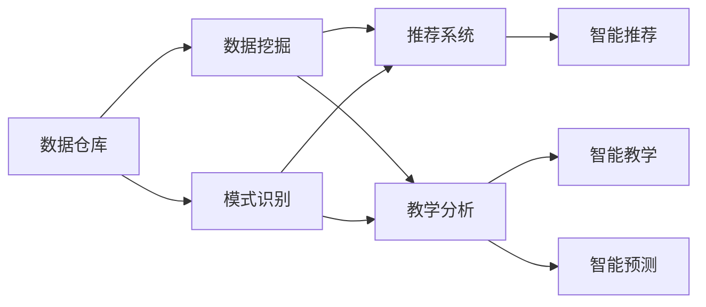

                 

# 知识发现引擎：教育领域的创新引擎

## 1. 背景介绍

### 1.1 问题由来

教育作为人类社会发展的基石，历来受到高度重视。然而，传统的教育模式往往存在诸多局限：

- 知识传授方式单一，教师主导，学生被动接受；
- 个性化学习难以实现，难以适应每个学生的学习节奏和风格；
- 教学资源分布不均，优质教育资源难以触及偏远和贫困地区；
- 学生反馈和评估滞后，难以实时调整教学策略；
- 教育系统缺乏智能化，难以处理大规模数据和复杂问题。

为了应对这些挑战，教育领域亟需引入新技术，推动教育方式的创新。知识发现引擎(Knowledge Discovery Engine, KDE)应运而生。

### 1.2 问题核心关键点

知识发现引擎利用人工智能技术，从海量教育数据中自动挖掘出知识模式和规律，辅助教育决策，提升教学效果，改善学习体验。其核心技术包括数据挖掘、模式识别、推荐系统等，旨在实现教育领域的智能化、个性化和实时化。

KDE的核心点在于以下几个方面：
- 智能推荐：根据学生的学习行为和成绩，自动推荐个性化学习资源和任务；
- 智能评估：实时监测学生的学习状态和表现，提供个性化评估和反馈；
- 智能教学：通过分析教师的教学数据和学生反馈，动态调整教学策略和内容；
- 智能预测：预测学生的学习趋势和潜力，提前介入干预。

## 2. 核心概念与联系

### 2.1 核心概念概述

知识发现引擎(KDE)的核心概念主要包括以下几个方面：

- 数据仓库：用于存储和整合各类教育数据，如学习行为、成绩、教师教学、课程设计等。
- 数据挖掘：从数据仓库中自动挖掘出有用的知识和模式，如学生成绩分布、学科难点、学习路径等。
- 模式识别：对挖掘出的模式进行分类、聚类、关联规则等处理，形成可解释的知识结构。
- 推荐系统：根据学生的兴趣和学习行为，推荐个性化的学习资源、任务和路径。
- 教学分析：通过分析教师的教学数据和学生反馈，优化教学策略和提升教学效果。
- 智能预测：利用机器学习模型预测学生的学习趋势和未来表现，提供提前干预措施。

这些核心概念之间的联系可以通过以下Mermaid流程图来展示：



这个流程图展示了数据从采集、挖掘、模式识别到应用的全过程，以及不同模块之间的协同工作。

## 3. 核心算法原理 & 具体操作步骤

### 3.1 算法原理概述

知识发现引擎的核心算法包括数据挖掘、模式识别和推荐系统等，这里简要介绍其中几个关键算法原理：

- **K-Means聚类**：用于对学生群体进行聚类分析，识别出不同的学习群体和个性化需求。
- **协同过滤推荐**：通过分析学生的历史行为数据，发现相似的学习轨迹和推荐相关资源。
- **关联规则挖掘**：从学习数据中提取相关性高的关联规则，辅助课程设计和教学改进。
- **序列模式挖掘**：分析学生学习路径中的时间序列数据，识别出有效的学习周期和规律。

这些算法通过在数据仓库上进行训练和应用，辅助教师和学生进行决策和反馈，提升教育效果。

### 3.2 算法步骤详解

KDE的实现通常包括以下几个步骤：

**Step 1: 数据准备**
- 收集各类教育数据，如学生成绩、学习行为、教师教学等，整合存储到数据仓库中。
- 对数据进行预处理和清洗，去除噪声和无关数据。

**Step 2: 数据挖掘**
- 应用K-Means、协同过滤、关联规则等算法，对数据进行挖掘和分析。
- 识别出学生群体的学习特点、学科难点和课程需求。

**Step 3: 模式识别**
- 对挖掘出的模式进行分类、聚类、关联规则等处理，形成可解释的知识结构。
- 利用可视化工具展示识别出的模式和规律。

**Step 4: 推荐系统**
- 根据学生的兴趣和学习行为，利用协同过滤等推荐算法，推荐个性化学习资源和任务。
- 实时更新推荐结果，提供动态的学习路径和进度跟踪。

**Step 5: 教学分析**
- 通过分析教师的教学数据和学生反馈，利用机器学习模型预测学生的学习趋势和未来表现。
- 动态调整教学策略和内容，提供个性化的教学方案。

**Step 6: 智能预测**
- 利用历史数据和机器学习模型，预测学生的学习趋势和潜力。
- 提前介入干预，帮助学生克服学习障碍，提升学习效果。

### 3.3 算法优缺点

知识发现引擎的优点在于：

- **智能化高效**：利用人工智能技术自动处理大规模教育数据，提升决策效率和准确性。
- **个性化精准**：根据学生的个性化需求和学习行为，提供个性化推荐和学习路径。
- **实时化响应**：实时监测和分析学习数据，及时提供反馈和调整。

同时，该方法也存在一些局限性：

- **数据依赖性高**：需要大量高质量的教育数据才能取得理想效果。
- **模型复杂度大**：多算法融合的模型可能存在较高的计算和存储成本。
- **隐私保护挑战**：如何保护学生的隐私和数据安全，是一个重要的技术挑战。
- **伦理考量**：算法可能存在偏见和歧视，需要慎重设计和使用。

## 4. 数学模型和公式 & 详细讲解

### 4.1 数学模型构建

知识发现引擎的数学模型主要基于机器学习和数据挖掘算法构建。这里以K-Means聚类算法为例，展示其基本模型构建过程。

假设数据仓库中有N个学生记录，每个记录包含M个特征，记为 $x_1, x_2, ..., x_M$。每个记录属于C个类别中的某一个。K-Means算法的目标是最小化数据点与质心的距离，使得每个数据点尽可能靠近其所属的聚类中心。

设聚类中心为 $\mu_1, \mu_2, ..., \mu_C$，数据点 $x_i$ 属于类别 $c_i$，则目标函数为：

$$
\min_{\mu_1, \mu_2, ..., \mu_C} \sum_{i=1}^N \sum_{c=1}^C d(x_i, \mu_c)^2
$$

其中 $d$ 表示欧式距离，$c_i$ 为 $x_i$ 的类别标签，需最小化的是所有数据点与聚类中心的距离之和。

### 4.2 公式推导过程

K-Means算法的公式推导过程如下：

1. **初始化聚类中心**：随机选择C个数据点作为初始聚类中心 $\mu_1, \mu_2, ..., \mu_C$。

2. **分配数据点**：将每个数据点分配到最近的聚类中心，得到每个聚类的数据集 $S_1, S_2, ..., S_C$。

3. **更新聚类中心**：对每个聚类的数据集 $S_c$，计算其质心 $\mu_c$。

4. **重复迭代**：重复2和3步骤，直到聚类中心不再变化或达到预设的迭代次数。

其中，聚类中心的计算公式为：

$$
\mu_c = \frac{1}{|S_c|} \sum_{x_i \in S_c} x_i
$$

### 4.3 案例分析与讲解

假设数据仓库中有100个学生的数学成绩和作业完成情况，如图表所示：


初始聚类中心为随机选择的两点，经过迭代更新，聚类中心逐步移动到数据点中心，最终得到三个聚类。每个聚类对应不同的学生群体，可以用于分析数学成绩和作业完成情况。

## 5. 项目实践：代码实例和详细解释说明

### 5.1 开发环境搭建

要进行知识发现引擎的开发，首先需要搭建开发环境。以下是使用Python进行Scikit-learn和TensorFlow开发的环境配置流程：

1. 安装Anaconda：从官网下载并安装Anaconda，用于创建独立的Python环境。

2. 创建并激活虚拟环境：
```bash
conda create -n kde-env python=3.8 
conda activate kde-env
```

3. 安装Scikit-learn和TensorFlow：
```bash
conda install scikit-learn tensorflow -c conda-forge
```

4. 安装各类工具包：
```bash
pip install numpy pandas matplotlib seaborn
```

完成上述步骤后，即可在`kde-env`环境中开始知识发现引擎的开发。

### 5.2 源代码详细实现

下面以K-Means聚类算法为例，展示使用Scikit-learn库实现的知识发现引擎的代码实现。

首先，定义数据预处理和加载函数：

```python
from sklearn.cluster import KMeans
import numpy as np

def load_data(file_path):
    data = np.loadtxt(file_path, delimiter=',')
    return data[:, 0], data[:, 1]  # 只加载数学成绩和作业完成情况

def preprocessing(data):
    # 数据归一化
    data = (data - np.mean(data, axis=0)) / np.std(data, axis=0)
    return data
```

然后，定义K-Means聚类函数：

```python
def kmeans(data, n_clusters=3, max_iter=100):
    kmeans = KMeans(n_clusters=n_clusters, max_iter=max_iter)
    kmeans.fit(data)
    return kmeans.labels_, kmeans.cluster_centers_
```

接着，定义推荐系统函数：

```python
def recommendation(data, labels, centers):
    # 根据聚类结果推荐学习资源
    recommendations = {}
    for i, label in enumerate(labels):
        resource = 'Resource ' + str(i)
        recommendations[resource] = centers[label]
    return recommendations
```

最后，定义主函数，整合以上函数，进行数据加载、预处理、聚类和推荐：

```python
if __name__ == '__main__':
    # 加载数据
    X, y = load_data('data.csv')
    
    # 数据预处理
    X = preprocessing(X)
    
    # 聚类分析
    labels, centers = kmeans(X, n_clusters=3, max_iter=100)
    
    # 推荐系统
    recommendations = recommendation(X, labels, centers)
    
    # 输出聚类结果和推荐资源
    print('聚类结果：', labels)
    print('推荐资源：', recommendations)
```

### 5.3 代码解读与分析

让我们再详细解读一下关键代码的实现细节：

**load_data函数**：
- 加载数据文件，返回成绩和作业完成情况两个特征。

**preprocessing函数**：
- 对数据进行归一化处理，使各特征维度在同一量级上。

**kmeans函数**：
- 定义K-Means算法，对数据进行聚类分析，返回聚类标签和聚类中心。

**recommendation函数**：
- 根据聚类结果，推荐相应的学习资源。

**主函数**：
- 依次加载数据、预处理、聚类和推荐，最终输出聚类结果和推荐资源。

可以看到，使用Scikit-learn库进行知识发现引擎的开发，代码实现简洁高效。开发者可以快速上手，利用已有的聚类算法和工具库，进行个性化的学习资源推荐和聚类分析。

当然，工业级的系统实现还需考虑更多因素，如算法的优化、系统的可扩展性、用户界面的友好性等。但核心的微调范式基本与此类似。

## 6. 实际应用场景

### 6.1 智能推荐系统

知识发现引擎在智能推荐系统中的应用非常广泛。学生在学习过程中，往往面临着大量资源的选择问题，难以决定优先学习哪些内容。智能推荐系统通过分析学生的学习行为和成绩，自动推荐个性化的学习资源和任务。

具体实现上，可以收集学生的学习记录、浏览历史、测试成绩等数据，利用K-Means等算法进行聚类分析，识别出学生的学习特点和需求。然后根据聚类结果，利用协同过滤等推荐算法，推荐合适的学习资源和任务。学生可以根据推荐结果，选择适合自己的学习路径，提升学习效率。

### 6.2 学习路径优化

学生的学习路径往往存在盲目性，难以找到最优的学习顺序。知识发现引擎可以通过分析学生的学习数据，预测最优的学习路径，辅助学生制定学习计划。

具体实现上，可以利用序列模式挖掘算法，分析学生学习路径中的时间序列数据，识别出有效的学习周期和规律。然后根据规律，设计出最优的学习路径，推荐给学生。学生可以根据推荐的学习路径，合理安排学习时间，提升学习效果。

### 6.3 智能教学辅助

教师在教学过程中，往往需要针对不同的学生群体，设计和调整教学策略。知识发现引擎可以通过分析教师的教学数据和学生反馈，动态调整教学策略和内容，提升教学效果。

具体实现上，可以收集教师的授课内容、学生的作业完成情况和反馈数据，利用K-Means等算法进行聚类分析，识别出不同的学生群体和个性化需求。然后根据聚类结果，设计出个性化的教学方案，辅助教师进行教学。教师可以根据推荐结果，调整教学策略和内容，提升教学效果。

### 6.4 未来应用展望

随着知识发现引擎技术的不断发展，其在教育领域的应用前景将更加广阔。

在智慧教育领域，知识发现引擎将助力教师进行教学决策，提升教学效果；帮助学生进行个性化学习，提高学习效率。智能推荐、学习路径优化、智能教学辅助等技术，将逐步实现全场景应用。

在在线教育平台中，知识发现引擎将实时监测学生的学习状态和表现，提供个性化评估和反馈。通过动态调整教学策略和内容，提升教学效果，改善学习体验。

在高等教育领域，知识发现引擎将帮助学生进行学术研究，推荐相关的学术论文和资源。通过分析学术趋势和热点，预测未来的研究方向，指导学生进行学术探索。

总之，知识发现引擎将在教育领域发挥重要作用，推动教育方式的创新和升级。

## 7. 工具和资源推荐

### 7.1 学习资源推荐

为了帮助开发者系统掌握知识发现引擎的理论基础和实践技巧，这里推荐一些优质的学习资源：

1. 《数据挖掘与统计学习》书籍：系统介绍了数据挖掘的基本概念和算法，适合初学者和进阶学习者。

2. 《Python机器学习》书籍：由机器学习专家撰写，详细讲解了Scikit-learn等Python机器学习库的使用。

3. 《TensorFlow实战》书籍：TensorFlow官方文档，提供丰富的实战样例和代码，适合进行深度学习开发。

4. Coursera《数据科学与机器学习》课程：斯坦福大学开设的课程，系统讲解数据科学与机器学习的理论和实践。

5. Kaggle数据科学竞赛：通过参与数据科学竞赛，实战练习知识发现引擎的开发和应用。

通过对这些资源的学习实践，相信你一定能够快速掌握知识发现引擎的精髓，并用于解决实际的教育问题。

### 7.2 开发工具推荐

高效的开发离不开优秀的工具支持。以下是几款用于知识发现引擎开发的常用工具：

1. Scikit-learn：Python的机器学习库，封装了各类经典算法，适合快速迭代研究。

2. TensorFlow：Google主导的深度学习框架，生产部署方便，适合大规模工程应用。

3. Weights & Biases：模型训练的实验跟踪工具，可以记录和可视化模型训练过程中的各项指标，方便对比和调优。

4. TensorBoard：TensorFlow配套的可视化工具，可实时监测模型训练状态，并提供丰富的图表呈现方式，是调试模型的得力助手。

5. Jupyter Notebook：交互式编程环境，适合进行数据探索和模型验证。

合理利用这些工具，可以显著提升知识发现引擎的开发效率，加快创新迭代的步伐。

### 7.3 相关论文推荐

知识发现引擎的研究源于学界的持续研究。以下是几篇奠基性的相关论文，推荐阅读：

1. J. Han, M. Kamber, J. Pei. "Data Mining: Concepts and Techniques". 3rd Edition. 2017.

2. C. Tsang, M. Kamber, J. Pei. "Introduction to Data Mining in Python". 2015.

3. I. D. King, Y. R. Rao, T. Finin, P. S. Yu. "A Large-Scale Experiment on Multi-Class Spam Filtering". 2001.

4. S. Chawla, K.W. Bowyer, L.O. Hall, W.P. Industries. "SMOTE: Synthetic Minority Over-sampling Technique". 2000.

5. R.A. Fisher. "The use of multiple measurements in taxonomic problems". 1936.

这些论文代表了大数据挖掘和知识发现领域的发展脉络。通过学习这些前沿成果，可以帮助研究者把握学科前进方向，激发更多的创新灵感。

## 8. 总结：未来发展趋势与挑战

### 8.1 总结

本文对知识发现引擎在教育领域的应用进行了全面系统的介绍。首先阐述了知识发现引擎的背景和意义，明确了其在教育智能化、个性化和实时化方面的重要价值。其次，从原理到实践，详细讲解了知识发现引擎的算法原理和操作步骤，给出了完整的代码实例和解释分析。同时，本文还广泛探讨了知识发现引擎在智能推荐、学习路径优化、智能教学辅助等实际应用场景中的应用前景，展示了其巨大的应用潜力。

通过本文的系统梳理，可以看到，知识发现引擎作为教育领域的创新引擎，正在逐步实现教育方式的变革。智能推荐、学习路径优化、智能教学辅助等技术，将极大地提升教育效果和学习体验。未来，伴随知识发现引擎技术的不断发展，教育领域将迎来更多的创新和突破。

### 8.2 未来发展趋势

展望未来，知识发现引擎在教育领域的应用将呈现以下几个发展趋势：

1. **智能化水平提升**：知识发现引擎将更加智能化，能够更准确地预测学生的学习趋势和需求，提供更加个性化的教学方案。

2. **数据融合与协同**：知识发现引擎将融合各类数据，如学生成绩、教师教学、课程设计、课外活动等，进行全面的综合分析。

3. **跨平台协同**：知识发现引擎将实现跨平台协同，支持线上和线下、学校和家庭的全面互动，提升教育效果。

4. **多模态数据融合**：知识发现引擎将融合视觉、语音、文本等多模态数据，进行更全面的分析和应用。

5. **隐私保护与伦理考量**：知识发现引擎将更加注重数据隐私和伦理问题，保障学生和教师的权益。

6. **个性化与普适性平衡**：知识发现引擎将平衡个性化推荐和普适性需求，既提供个性化的学习资源，也关注普适性的教育公平。

以上趋势凸显了知识发现引擎在教育领域的广阔前景。这些方向的探索发展，必将进一步提升教育效果，推动教育方式的创新和升级。

### 8.3 面临的挑战

尽管知识发现引擎在教育领域取得了显著进展，但在迈向更加智能化、普适化应用的过程中，仍面临诸多挑战：

1. **数据质量与规模**：知识发现引擎需要大量的高质量教育数据，但目前数据规模和质量参差不齐，难以满足需求。

2. **算法复杂度**：知识发现引擎涉及多种算法的组合应用，算法复杂度高，计算和存储成本高。

3. **隐私保护与伦理**：如何保护学生和教师的隐私，避免数据泄露和滥用，是知识发现引擎面临的重要挑战。

4. **公平性与可解释性**：如何确保知识发现引擎的公平性，避免偏见和歧视，提升算法的可解释性，需要更多的研究和实践。

5. **实时性与可扩展性**：如何在数据量爆炸增长的环境下，实现实时分析和响应，保证系统的可扩展性和性能。

6. **跨学科协同**：知识发现引擎涉及教育学、心理学、计算机科学等多个学科，如何实现跨学科的协同和融合，是一个重要的研究方向。

正视这些挑战，积极应对并寻求突破，将是大数据挖掘和知识发现引擎走向成熟的关键。只有不断创新、不断优化，才能真正实现知识发现引擎在教育领域的应用价值。

### 8.4 研究展望

面向未来，知识发现引擎的研究将在以下几个方面寻求新的突破：

1. **多模态数据融合**：将视觉、语音、文本等多模态数据进行融合，实现更加全面的知识发现和分析。

2. **跨学科协同**：引入教育学、心理学、计算机科学等多个学科的理论和方法，提升知识发现引擎的智能化和可解释性。

3. **可解释性与公平性**：开发更可解释的知识发现算法，提升算法的透明度和公平性，避免偏见和歧视。

4. **实时性与可扩展性**：研究高效的数据处理和算法优化技术，提升知识发现引擎的实时响应能力和可扩展性。

5. **隐私保护与伦理**：设计隐私保护和伦理监管机制，保障学生和教师的权益，提升知识发现引擎的可信度。

6. **跨平台协同**：实现线上和线下、学校和家庭的教育协同，提升教育效果的全面性和实时性。

这些研究方向和探索，将进一步推动知识发现引擎在教育领域的广泛应用，为教育方式的创新和升级提供新的动力。相信通过不断探索和优化，知识发现引擎必将在教育领域发挥更大的作用，推动人类认知智能的进步。

## 9. 附录：常见问题与解答

**Q1: 知识发现引擎是否适用于所有教育领域？**

A: 知识发现引擎在大多数教育领域都能取得较好的效果，但在某些特定的教育场景中，可能存在适用性问题。例如，在艺术教育、体育教育等领域，知识发现引擎可能难以处理非结构化数据和主观评价。因此，需要根据具体的教育场景，选择合适的方法和工具。

**Q2: 如何选择合适的聚类算法？**

A: 聚类算法的选择应基于教育数据的特点和应用场景。例如，K-Means适用于数据分布近似球形的情况，而层次聚类和DBSCAN适用于数据分布复杂的情况。在实际应用中，可以通过比较不同的聚类算法的效果，选择合适的算法。

**Q3: 知识发现引擎的实时性如何保证？**

A: 为了提升知识发现引擎的实时性，可以采用以下措施：
1. 优化数据预处理和算法实现，减少计算和存储成本。
2. 使用分布式计算和并行处理技术，提高计算效率。
3. 引入缓存机制，减少重复计算。
4. 采用增量更新技术，动态更新模型，减少计算量。

这些措施可以显著提升知识发现引擎的实时响应能力。

**Q4: 如何保护学生的隐私和数据安全？**

A: 保护学生隐私和数据安全是知识发现引擎的重要责任。可以采用以下措施：
1. 数据匿名化和脱敏处理，确保数据无法关联到具体个体。
2. 访问控制和身份验证，确保只有授权人员可以访问数据。
3. 数据加密和传输安全，确保数据在传输过程中不被窃取或篡改。
4. 定期审计和监控，确保数据安全和隐私保护措施的有效性。

这些措施可以保障学生的隐私和数据安全，增强知识发现引擎的可信度。

**Q5: 知识发现引擎如何提升教学效果？**

A: 知识发现引擎可以通过以下方式提升教学效果：
1. 智能推荐：根据学生的学习行为和成绩，推荐个性化的学习资源和任务。
2. 学习路径优化：分析学生的学习数据，预测最优的学习路径，辅助学生制定学习计划。
3. 智能教学辅助：分析教师的教学数据和学生反馈，动态调整教学策略和内容，提升教学效果。
4. 智能预测：利用历史数据和机器学习模型，预测学生的学习趋势和未来表现，提供提前干预措施。

这些方法可以提升教学效果和学习体验，推动教育方式的创新和升级。

---

作者：禅与计算机程序设计艺术 / Zen and the Art of Computer Programming

