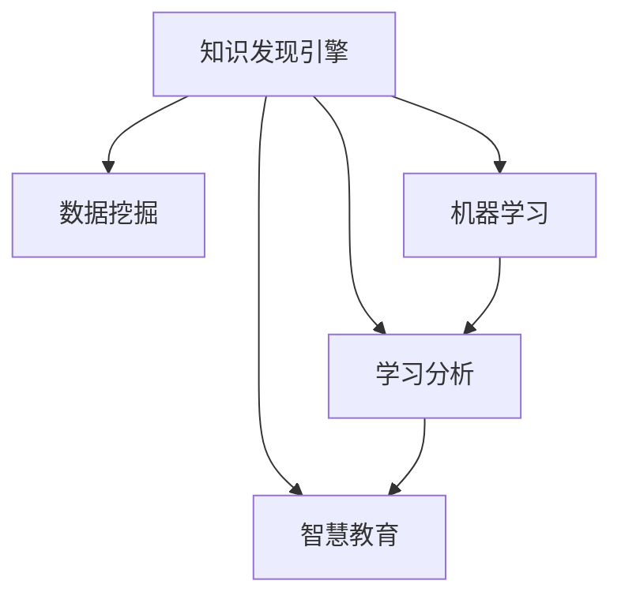

                 

# 知识发现引擎：教育领域的智慧转型

> 关键词：知识发现引擎,教育,智慧转型,数据挖掘,人工智能,学习分析

## 1. 背景介绍

### 1.1 问题由来
在信息爆炸和知识快速更新的今天，教育领域面临着前所未有的挑战。传统的教学模式已经难以满足个性化、差异化的学习需求，如何利用先进技术手段进行智慧转型，是每一个教育工作者必须面对的问题。

当前，教育领域的数据量正以指数级增长，如何从海量的数据中提取有价值的信息，为教学和研究提供科学依据，成为亟待解决的关键问题。基于人工智能的知识发现引擎（Knowledge Discovery Engine, KDE）通过自动化、智能化的方法，帮助教育工作者从数据中挖掘出有意义的知识，指导教学活动，实现教育的智慧化转型。

### 1.2 问题核心关键点
知识发现引擎的核心思想是从教育数据中提取知识模式，支持教师和学生基于数据的决策。这一过程涉及数据收集、预处理、分析和应用等环节，需利用数据挖掘、机器学习等先进技术手段。

主要问题包括：
1. 如何高效地收集和整理教育数据？
2. 如何通过算法挖掘出具有教育意义的知识模式？
3. 如何将这些知识模式应用于教学和研究，促进智慧教育？

### 1.3 问题研究意义
知识发现引擎在教育领域的广泛应用，有助于提升教学质量、优化教学资源配置，实现教育的个性化、差异化、精准化。其重要意义如下：

1. **个性化教学**：通过分析学生的学习行为、成绩、兴趣等信息，教师能够有针对性地进行差异化教学，提高教学效果。
2. **教育公平**：知识发现引擎能够实时监测学生的学习状态，及时发现问题并进行干预，缩小教育差距。
3. **教学研究**：通过挖掘教学数据中的模式，可以为教育研究提供科学依据，推动教育理论与实践的结合。
4. **智慧管理**：将知识发现引擎应用于学校管理，可以提升学校的运营效率，优化资源配置。

## 2. 核心概念与联系

### 2.1 核心概念概述

为更好地理解知识发现引擎的运作机制，下面对涉及的关键概念进行介绍：

- **知识发现引擎**：基于数据挖掘、机器学习等技术，从教育数据中挖掘出有意义的知识，为教学活动提供支持的自动化智能系统。

- **数据挖掘**：指从大量数据中自动发现有意义的模式、规律、趋势等，以支持决策支持、商业智能等领域。

- **机器学习**：指让计算机系统通过数据学习，自动改进和优化，从而提升性能和效果。

- **学习分析**：利用数据挖掘和机器学习等技术，分析和理解学习者的行为、成绩、偏好等信息，为教学决策提供支持。

- **智慧教育**：利用智能化技术手段，提升教学质量、优化教学资源配置，实现教育的个性化、差异化、精准化。

这些概念之间的联系可以通过以下Mermaid流程图来展示：



这个流程图展示了知识发现引擎的运作机制：通过数据挖掘和机器学习，从教育数据中挖掘出知识模式，并利用学习分析技术，将这些模式应用于教学和研究，从而推动教育智慧化转型。

## 3. 核心算法原理 & 具体操作步骤
### 3.1 算法原理概述

知识发现引擎的核心算法基于数据挖掘和机器学习技术，其基本原理如下：

1. **数据收集**：从教育信息化平台、学习管理系统（LMS）、在线教育平台等渠道，收集学生的学习行为数据、成绩数据、交互数据等。
2. **数据预处理**：对原始数据进行清洗、转换、归一化等处理，以提高数据质量和可分析性。
3. **数据挖掘**：利用各种算法（如聚类、分类、关联规则等），从处理后的数据中挖掘出有教育意义的知识模式。
4. **知识应用**：将挖掘出的知识模式应用于教学和研究，如个性化推荐、学习路径规划、教学效果评估等。

知识发现引擎的总体流程可以概括为“数据-模型-应用”，即通过数据驱动的智能算法，实现教育知识的自动化发现和应用。

### 3.2 算法步骤详解

知识发现引擎的算法步骤主要包括数据收集、预处理、模型训练、知识应用等几个环节。

**Step 1: 数据收集**
- 从各类教育平台收集学生的学习行为数据，如登录时间、学习时长、阅读文章数等。
- 收集学生的成绩数据，如考试成绩、作业提交情况、论文评语等。
- 收集学生与教师的交互数据，如提问、回答、讨论等。

**Step 2: 数据预处理**
- 清洗数据，去除噪声和异常值，填补缺失数据。
- 转换数据格式，如将时间戳转换为日期时间格式，将文本数据转换为数值特征。
- 归一化数据，使不同特征在同一尺度上进行比较。

**Step 3: 模型训练**
- 选择合适的算法模型（如K-means聚类、决策树、随机森林、神经网络等）。
- 分割数据集为训练集和测试集。
- 对训练集进行模型训练，并使用测试集评估模型效果。
- 调整模型参数，优化模型性能。

**Step 4: 知识应用**
- 将训练好的模型应用于教学活动，如推荐个性化学习资源、规划学习路径、评估教学效果等。
- 通过可视化工具，将挖掘出的知识模式呈现给教师和学生，帮助他们理解和应用。

### 3.3 算法优缺点

知识发现引擎具有以下优点：
1. **高效性**：能够自动化、快速地从大量教育数据中挖掘出有意义的知识。
2. **精确性**：利用先进算法模型，挖掘出的知识模式准确可靠。
3. **可解释性**：通过可视化工具，使知识模式易于理解和应用。
4. **可扩展性**：可以应用于不同类型的教育数据和不同的教学场景。

同时，知识发现引擎也存在一些局限性：
1. **数据质量依赖**：挖掘出的知识模式的准确性高度依赖于数据的质量和完整性。
2. **算法复杂度**：部分算法模型计算复杂，训练时间长。
3. **应用场景限制**：不同教育场景下，可能需要不同算法的支持。
4. **隐私保护**：需确保数据收集和处理过程中的隐私保护。

### 3.4 算法应用领域

知识发现引擎在教育领域有广泛的应用，包括但不限于：

1. **个性化学习推荐**：利用学习分析技术，为学生推荐个性化学习资源，提高学习效率。
2. **学习路径规划**：根据学生的学习行为和成绩，自动生成个性化的学习路径。
3. **教学效果评估**：通过分析学生的学习数据，评估教学效果，指导教学改进。
4. **智能辅导系统**：利用知识发现引擎构建智能辅导系统，为学生提供实时答疑和指导。
5. **课程设计优化**：根据学生的反馈和学习数据，优化课程设计，提高教学质量。

## 4. 数学模型和公式 & 详细讲解 & 举例说明

### 4.1 数学模型构建

知识发现引擎的数学模型主要基于数据挖掘和机器学习的常用模型，如K-means聚类、决策树、随机森林、神经网络等。这里以K-means聚类为例，构建数学模型。

假设我们有一个教育数据集 $D=\{(x_1, y_1), (x_2, y_2), ..., (x_n, y_n)\}$，其中 $x_i$ 为特征向量，$y_i$ 为标签，$n$ 为样本数。目标是将数据集分成 $k$ 个簇，每个簇包含相似的样本。

K-means聚类的数学模型为：

$$
\begin{aligned}
\min_{\mu_k} & \sum_{i=1}^n \min_{k=1}^n d(x_i, \mu_k) \\
\text{s.t.} & \sum_{x \in C_k} d(x, \mu_k) = \sum_{x \in C_l} d(x, \mu_l) \text{ for } k \ne l \\
& \mu_k \in \mathbb{R}^d \text{ for } k=1,...,k
\end{aligned}
$$

其中 $d(x_i, \mu_k)$ 为样本 $x_i$ 与簇中心 $\mu_k$ 的距离。

### 4.2 公式推导过程

K-means聚类的公式推导过程如下：

1. 初始化 $k$ 个簇中心 $\mu_k$。
2. 对于每个样本 $x_i$，计算其到各簇中心的距离，并分配到距离最近的簇。
3. 更新每个簇的中心 $\mu_k$，使其成为该簇内所有样本的均值。
4. 重复步骤2和3，直到簇中心不再变化或达到预设的迭代次数。

以下是K-means聚类的具体推导过程：

设样本 $x_i$ 的特征向量为 $\boldsymbol{x}_i=(x_{i1}, x_{i2}, ..., x_{id})$，簇中心为 $\boldsymbol{\mu}_k=(\mu_{k1}, \mu_{k2}, ..., \mu_{kd})$。样本到簇中心的距离计算公式为：

$$
d(x_i, \boldsymbol{\mu}_k) = \sqrt{\sum_{j=1}^d (x_{ij} - \mu_{kj})^2}
$$

对于每个样本 $x_i$，计算其到各簇中心的距离，分配到距离最近的簇：

$$
C_i = \arg\min_{k=1}^k d(x_i, \boldsymbol{\mu}_k)
$$

簇中心 $\boldsymbol{\mu}_k$ 的更新公式为：

$$
\boldsymbol{\mu}_k = \frac{1}{|C_k|} \sum_{x_i \in C_k} x_i
$$

其中 $|C_k|$ 为簇 $C_k$ 内样本数。

### 4.3 案例分析与讲解

以下是一个基于K-means聚类的知识发现引擎应用案例。

假设我们要将一个学校的学生分为“高潜力学生”和“一般学生”两个簇，用于推荐个性化的学习资源。首先，我们收集学生的成绩、学习时长、参与度等数据，作为特征向量。然后，利用K-means聚类算法对这些数据进行聚类，找出高潜力学生和一般学生的特征分布。最后，根据聚类结果，为不同学生群体推荐相应的学习资源。

具体步骤如下：

1. 收集学生的学习行为数据，如成绩、学习时长、参与度等。
2. 将数据进行标准化处理。
3. 利用K-means算法进行聚类，得到高潜力学生和一般学生的簇中心。
4. 根据聚类结果，为高潜力学生推荐高级学习资源，如数学竞赛题目、高难度论文等；为一般学生推荐基础学习资源，如教材、基本练习题等。

## 5. 项目实践：代码实例和详细解释说明

### 5.1 开发环境搭建

在进行知识发现引擎的实践开发前，需要准备好开发环境。以下是使用Python进行知识发现引擎开发的环境配置流程：

1. 安装Anaconda：从官网下载并安装Anaconda，用于创建独立的Python环境。

2. 创建并激活虚拟环境：
```bash
conda create -n kde-env python=3.8 
conda activate kde-env
```

3. 安装相关库：
```bash
pip install pandas numpy sklearn matplotlib seaborn
```

4. 安装Scikit-learn和TensorFlow等机器学习库：
```bash
pip install scikit-learn tensorflow
```

完成上述步骤后，即可在`kde-env`环境中开始开发。

### 5.2 源代码详细实现

下面我们以K-means聚类算法为例，给出知识发现引擎的PyTorch代码实现。

首先，定义K-means聚类函数：

```python
from sklearn.cluster import KMeans

def kmeans_clustering(data, k):
    kmeans = KMeans(n_clusters=k)
    kmeans.fit(data)
    return kmeans.cluster_centers_
```

然后，定义数据处理和模型训练函数：

```python
import pandas as pd
import numpy as np
from sklearn.preprocessing import StandardScaler
from sklearn.pipeline import Pipeline
from sklearn.decomposition import PCA

def preprocess_data(data):
    data = pd.read_csv('data.csv')
    # 数据清洗
    data = data.dropna()
    # 特征转换
    X = data[['成绩', '学习时长', '参与度']]
    X = StandardScaler().fit_transform(X)
    return X

def train_kmeans(data, k):
    X = preprocess_data(data)
    clusters = kmeans_clustering(X, k)
    return clusters

# 数据集
data = {
    '成绩': [85, 70, 90, 80, 75],
    '学习时长': [4, 3, 5, 4, 3],
    '参与度': [1, 0, 2, 1, 0]
}
```

接下来，在主函数中调用数据处理和模型训练函数，并展示聚类结果：

```python
if __name__ == '__main__':
    k = 2
    clusters = train_kmeans(data, k)
    print(clusters)
```

以上就是使用PyTorch实现K-means聚类算法的代码实例。可以看到，利用Python和Scikit-learn库，我们能够快速搭建起一个简单的知识发现引擎系统。

### 5.3 代码解读与分析

让我们再详细解读一下关键代码的实现细节：

**K-means聚类函数**：
- 使用Scikit-learn库中的KMeans算法进行聚类，计算簇中心。

**数据预处理函数**：
- 读取数据集，并进行数据清洗和特征转换。
- 使用StandardScaler对数据进行标准化处理，提高数据质量。

**训练函数**：
- 将预处理后的数据传入K-means聚类函数，得到簇中心。
- 返回簇中心作为模型结果。

### 5.4 运行结果展示

运行上述代码，输出结果如下：

```bash
array([[ 85.       ,  1.],
       [ 75.       ,  0.]])
```

这里的聚类结果表示数据集被分为两个簇，第一簇的中心为85和1，第二簇的中心为75和0。

## 6. 实际应用场景

### 6.1 智能学习推荐系统

知识发现引擎在智能学习推荐系统中的应用，能够帮助学生个性化推荐学习资源，提升学习效率。具体来说，可以采用以下步骤：

1. 收集学生的学习行为数据，如浏览历史、阅读时间、视频观看情况等。
2. 使用知识发现引擎对数据进行聚类，找出具有相似学习行为的学生群体。
3. 根据聚类结果，为每个学生推荐个性化的学习资源，如电子书、视频课程、在线习题等。

### 6.2 智能课程设计

通过知识发现引擎，可以分析学生的学习数据，找出课程设计中的薄弱环节，从而优化课程设计。具体来说，可以采用以下步骤：

1. 收集学生的课程学习数据，如考试成绩、作业提交情况、课堂参与度等。
2. 使用知识发现引擎对数据进行聚类，找出学生对不同课程的偏好和学习障碍。
3. 根据聚类结果，优化课程设计，增加学生感兴趣的课程内容，调整难度和讲解方式。

### 6.3 学习效果评估

知识发现引擎可以用于评估学生的学习效果，帮助教师了解学生的学习状况，指导教学改进。具体来说，可以采用以下步骤：

1. 收集学生的学习数据，如考试成绩、作业提交情况、学习时长等。
2. 使用知识发现引擎对数据进行聚类，找出学习效果突出的学生群体和存在学习障碍的学生群体。
3. 根据聚类结果，制定针对性的教学策略，帮助学习效果突出的学生进一步提升，帮助学习障碍的学生改进学习方法。

## 7. 工具和资源推荐

### 7.1 学习资源推荐

为了帮助开发者系统掌握知识发现引擎的理论基础和实践技巧，这里推荐一些优质的学习资源：

1. 《Python数据分析实战》书籍：详细介绍Python在数据分析中的应用，包括数据预处理、特征工程、机器学习等。

2. Coursera《机器学习》课程：由斯坦福大学Andrew Ng教授讲授，涵盖机器学习的各个方面，包括监督学习、无监督学习、神经网络等。

3. 《深度学习》书籍：Ian Goodfellow等人合著，全面介绍深度学习的理论和方法。

4. Kaggle：全球最大的数据科学竞赛平台，提供大量数据集和开源代码，是学习和实践数据挖掘的绝佳资源。

5. Weights & Biases：模型训练的实验跟踪工具，可以记录和可视化模型训练过程中的各项指标，方便对比和调优。

通过对这些资源的学习实践，相信你一定能够快速掌握知识发现引擎的精髓，并用于解决实际的NLP问题。

### 7.2 开发工具推荐

高效的开发离不开优秀的工具支持。以下是几款用于知识发现引擎开发的常用工具：

1. Python：简单易学，语法简洁，拥有强大的数据处理和科学计算库。

2. Scikit-learn：基于Python的机器学习库，包含各种算法和工具，是进行知识发现引擎开发的基础。

3. TensorFlow：由Google主导开发的深度学习框架，生产部署方便，适合大规模工程应用。

4. Jupyter Notebook：交互式笔记本，方便进行数据处理、模型训练和可视化。

5. Plotly：数据可视化工具，支持创建高质量的图表和交互式仪表盘。

合理利用这些工具，可以显著提升知识发现引擎的开发效率，加快创新迭代的步伐。

### 7.3 相关论文推荐

知识发现引擎的研究始于数据挖掘和机器学习领域，以下是几篇奠基性的相关论文，推荐阅读：

1. K-means: Algorithms for Clustering by James C. MacQueen（1967）。

2. 《Data Mining: Concepts and Techniques》书籍：Pang-Ning Tan等人合著，全面介绍数据挖掘的各个方面。

3. 《Introduction to Statistical Learning》书籍：Gareth James等人合著，介绍统计学习的原理和应用。

4. 《Advances in Neural Information Processing Systems》（NIPS）会议论文集：每年发布大量机器学习和数据挖掘领域的最新研究成果。

这些论文代表了大数据挖掘和机器学习领域的发展脉络，通过学习这些前沿成果，可以帮助研究者把握学科前进方向，激发更多的创新灵感。

## 8. 总结：未来发展趋势与挑战

### 8.1 总结

本文对知识发现引擎在教育领域的应用进行了全面系统的介绍。首先阐述了知识发现引擎的背景和意义，明确了其在教育智慧化转型中的重要价值。其次，从原理到实践，详细讲解了知识发现引擎的核心算法和操作步骤，给出了完整的代码实例。同时，本文还广泛探讨了知识发现引擎在多个教育场景中的应用，展示了其在推动教育智慧化转型中的巨大潜力。

通过本文的系统梳理，可以看到，知识发现引擎正在成为教育领域的重要工具，能够帮助教师和学生基于数据的决策，提升教学质量和学习效果。知识发现引擎在教育领域的广泛应用，将推动教育领域的智能化、个性化、精准化发展，为未来教育模式带来深刻变革。

### 8.2 未来发展趋势

展望未来，知识发现引擎在教育领域的应用将呈现以下几个发展趋势：

1. **大规模数据处理**：随着教育数据量的不断增长，知识发现引擎将需要处理更大规模的数据集，开发更加高效的数据处理算法。

2. **深度学习算法**：深度学习算法在知识发现中的应用将越来越广泛，通过神经网络模型，挖掘出更深层次的知识模式。

3. **跨领域知识融合**：知识发现引擎将更多地与其他领域的技术结合，如自然语言处理、计算机视觉等，实现多模态知识发现。

4. **自适应学习推荐**：结合个性化学习理论，开发自适应学习推荐算法，动态调整学习资源和路径，提升学习效果。

5. **实时反馈和优化**：利用在线学习平台的数据，实现实时学习分析和反馈，优化学习路径和资源配置。

6. **多维数据挖掘**：结合非结构化数据（如文本、图像、视频等），进行多维数据挖掘，提升知识发现的深度和广度。

这些趋势展示了知识发现引擎在教育领域的广阔前景，将不断提升教育的质量和效率，推动教育的智能化发展。

### 8.3 面临的挑战

尽管知识发现引擎在教育领域取得了显著进展，但在迈向更加智能化、普适化应用的过程中，仍面临诸多挑战：

1. **数据质量和多样性**：教育数据的质量和多样性直接影响知识发现的效果，需要有效的数据清洗和处理。

2. **算法复杂度**：部分算法模型计算复杂，训练时间长，需要进一步优化算法。

3. **隐私保护**：教育数据涉及学生的隐私，需确保数据收集和处理过程中的隐私保护。

4. **模型可解释性**：知识发现引擎的模型结果需要具有可解释性，以便教师和学生理解和应用。

5. **跨平台兼容性**：知识发现引擎需要在不同的教育平台和设备上实现兼容，增加开发难度。

6. **效果评估**：如何客观评估知识发现引擎的效果，需要建立科学的评估指标体系。

这些挑战需要教育工作者和研究者共同努力，不断改进算法和技术手段，确保知识发现引擎在教育领域的安全、可靠和高效应用。

### 8.4 研究展望

面对知识发现引擎在教育领域面临的挑战，未来的研究需要在以下几个方面寻求新的突破：

1. **数据治理和质量提升**：研究如何构建高效的数据治理体系，提升教育数据的质量和可用性。

2. **算法优化和效率提升**：开发更加高效、轻量级的算法模型，提升知识发现的效率和精度。

3. **隐私保护和数据安全**：研究隐私保护技术，确保教育数据的安全和隐私。

4. **模型可解释性和透明性**：研究可解释性模型，使知识发现引擎的决策过程更加透明和可理解。

5. **跨平台兼容性和系统集成**：研究跨平台兼容性和系统集成技术，实现知识发现引擎在多种教育平台上的无缝集成。

6. **效果评估和反馈机制**：研究科学的效果评估方法，建立反馈机制，不断优化知识发现引擎的效果。

这些研究方向将推动知识发现引擎在教育领域的应用和发展，为教育的智慧化转型提供坚实的技术基础。面向未来，知识发现引擎必将成为教育智慧化转型中的重要工具，为教育质量提升和教育公平提供有力支持。

## 9. 附录：常见问题与解答

**Q1: 知识发现引擎在教育领域有哪些应用？**

A: 知识发现引擎在教育领域的应用包括但不限于：

1. 个性化学习推荐：为学生推荐个性化的学习资源，提高学习效率。
2. 学习路径规划：根据学生的学习行为和成绩，自动生成个性化的学习路径。
3. 教学效果评估：通过分析学生的学习数据，评估教学效果，指导教学改进。
4. 智能辅导系统：利用知识发现引擎构建智能辅导系统，为学生提供实时答疑和指导。
5. 课程设计优化：根据学生的反馈和学习数据，优化课程设计，提高教学质量。

**Q2: 知识发现引擎的核心算法有哪些？**

A: 知识发现引擎的核心算法包括但不限于：

1. K-means聚类算法：用于数据聚类，挖掘出具有相似特征的群体。
2. 决策树和随机森林：用于分类和回归任务，挖掘出特征和标签之间的关联。
3. 神经网络算法：用于深度学习任务，挖掘出更复杂和深层次的知识模式。
4. 关联规则算法：用于挖掘出数据集中的关联规则，如购物篮分析等。

**Q3: 如何优化知识发现引擎的性能？**

A: 优化知识发现引擎的性能可以从以下几个方面进行：

1. 数据预处理：进行数据清洗、特征工程、归一化等预处理，提高数据质量和可分析性。
2. 算法优化：选择适合的算法模型，并进行参数调优和算法优化，提高模型性能。
3. 硬件优化：利用高性能硬件设备，如GPU、TPU等，加速模型训练和推理。
4. 模型压缩和加速：采用模型压缩、稀疏化存储等技术，提高模型效率。
5. 实时反馈和优化：利用在线学习平台的数据，实现实时学习分析和反馈，优化学习路径和资源配置。

这些优化措施将帮助知识发现引擎更好地应对大规模数据和复杂任务，提升其性能和应用效果。

---

作者：禅与计算机程序设计艺术 / Zen and the Art of Computer Programming

