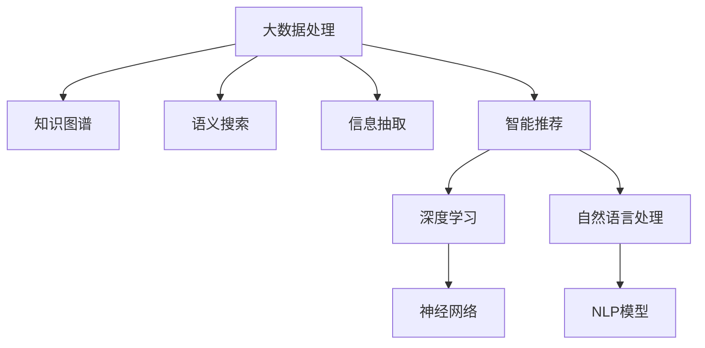

                 

# 知识发现引擎：知识创新的强劲动力

> 关键词：知识发现引擎, 知识图谱, 大数据, 语义搜索, 信息抽取, 深度学习, 自然语言处理, 智能推荐系统

## 1. 背景介绍

### 1.1 问题由来
在当今信息爆炸的时代，人类获取知识和信息的效率和质量面临巨大挑战。随着互联网和移动互联网的普及，海量的数据源源不断地产生，包含了图片、视频、文本、音频等多类型信息。传统的数据存储和检索方式已经无法满足快速、高效、精准地获取所需信息的需求。

知识发现引擎（Knowledge Discovery Engine, KDE）作为新一代的信息检索技术，通过对大数据的挖掘和分析，能够高效地发现知识、提取关键信息，并将其结构化为便于人类理解和利用的形式。知识发现引擎的出现，使得信息的获取和利用更加智能化、自动化，从而极大地提高了知识创新的效率和质量。

### 1.2 问题核心关键点
知识发现引擎的核心关键点包括以下几点：

- **大数据处理能力**：能够高效处理海量数据，并从中提取有用信息。
- **知识图谱构建**：将数据转化为结构化的知识图谱，便于知识表达和推理。
- **语义搜索技术**：支持自然语言查询，准确理解和匹配用户意图。
- **信息抽取与分类**：从非结构化数据中自动抽取关键信息，并进行分类和标注。
- **智能推荐算法**：利用用户行为数据，提供个性化的知识推荐。
- **深度学习与自然语言处理**：使用深度学习技术处理复杂数据，使用自然语言处理技术理解和处理自然语言。

## 2. 核心概念与联系

### 2.1 核心概念概述

知识发现引擎是集成了大数据处理、知识图谱构建、语义搜索、信息抽取、智能推荐等技术的综合性系统。以下是对这些核心概念的详细描述：

- **大数据处理**：指对海量数据进行高效存储、清洗、分析和处理的过程。常用的技术包括分布式计算、云计算、数据挖掘等。
- **知识图谱**：是一种结构化的知识表示方法，将实体、关系和属性进行有机结合，形成一个语义化的知识网络。知识图谱可以通过RDF、OWL等标准进行描述和存储。
- **语义搜索**：基于自然语言处理技术，能够理解用户查询意图，准确返回与查询相关的内容。语义搜索通常利用向量空间模型、TF-IDF等算法进行信息匹配。
- **信息抽取**：指从非结构化数据中自动抽取关键信息，如实体、属性、关系等，并进行结构化处理。常用的技术包括命名实体识别、关系抽取、事件抽取等。
- **智能推荐算法**：通过分析用户行为和兴趣，推荐可能感兴趣的知识信息。推荐算法包括协同过滤、基于内容的推荐、深度学习推荐等。
- **深度学习与自然语言处理**：利用深度学习模型处理复杂数据，使用自然语言处理技术理解和处理自然语言。常用的技术包括神经网络、卷积神经网络、循环神经网络、注意力机制等。

这些核心概念之间的逻辑关系可以通过以下Mermaid流程图来展示：



这个流程图展示了大数据处理与知识图谱、语义搜索、信息抽取、智能推荐等关键技术之间的联系。

## 3. 核心算法原理 & 具体操作步骤

### 3.1 算法原理概述

知识发现引擎的核心算法原理可以概括为：

1. **数据清洗与预处理**：对原始数据进行清洗和预处理，去除噪音和冗余信息，提高数据质量。
2. **实体抽取与关系建模**：使用信息抽取技术从文本中识别出实体和关系，并构建知识图谱。
3. **知识图谱构建**：利用图数据库或三元组形式存储知识图谱，支持知识的表示和推理。
4. **语义搜索与匹配**：利用向量空间模型、TF-IDF等算法，对用户查询进行语义理解和匹配，返回最相关的知识信息。
5. **推荐算法与模型**：使用协同过滤、基于内容的推荐、深度学习推荐等算法，为用户提供个性化知识推荐。

### 3.2 算法步骤详解

以下是对知识发现引擎的各个核心算法步骤的详细讲解：

**Step 1: 数据清洗与预处理**

数据清洗与预处理是知识发现引擎的基础。主要包括：

- 数据去重与去噪：去除重复数据和无关噪音。
- 数据格式转换：将不同格式的数据转化为统一的格式，如JSON、XML等。
- 数据标准化：统一数据格式和命名规则，便于后续处理。

**Step 2: 实体抽取与关系建模**

实体抽取和关系建模是知识发现引擎的核心。具体步骤如下：

- 命名实体识别（Named Entity Recognition, NER）：从文本中识别出人名、地名、机构名等实体。
- 关系抽取（Relation Extraction, RE）：从文本中识别出实体之间的关系，如主谓宾结构。
- 知识图谱构建：将抽取出的实体和关系转化为知识图谱，存储到图数据库或三元组中。

**Step 3: 语义搜索与匹配**

语义搜索与匹配是知识发现引擎的关键功能。具体步骤如下：

- 用户查询理解：利用自然语言处理技术，理解用户查询的意图和关键词。
- 查询向量构建：将用户查询转化为向量表示，用于与知识图谱进行匹配。
- 知识匹配：在知识图谱中搜索与查询向量最相关的实体和关系，返回结果。

**Step 4: 推荐算法与模型**

推荐算法与模型是知识发现引擎的高级功能。具体步骤如下：

- 用户行为分析：收集用户的行为数据，如浏览、点击、购买等。
- 用户画像构建：利用机器学习技术，构建用户画像，描述用户的兴趣和偏好。
- 推荐结果生成：根据用户画像和知识图谱，生成个性化的推荐结果。

### 3.3 算法优缺点

知识发现引擎的优点包括：

- 高效处理大数据：能够快速处理海量数据，并提供实时查询和推荐服务。
- 知识图谱表示：通过知识图谱，能够更全面、系统地表示和存储知识。
- 语义搜索能力：支持自然语言查询，提升用户体验。
- 个性化推荐：能够根据用户行为提供个性化知识推荐。

同时，知识发现引擎也存在一些缺点：

- 数据处理复杂：需要处理多源异构数据，技术难度较高。
- 知识图谱构建复杂：需要大量的人工标注和规则，成本较高。
- 语义理解局限：对自然语言处理技术依赖较大，可能存在理解不准确的问题。
- 推荐算法复杂：需要处理大量的用户行为数据，技术难度较高。

### 3.4 算法应用领域

知识发现引擎已经在多个领域得到了广泛应用，具体包括：

- **智慧城市**：通过知识发现引擎，可以实现智能交通、智慧安防、公共服务等领域的信息整合和管理。
- **智能医疗**：通过知识发现引擎，可以实现患者病历管理、医生诊疗辅助、药品推荐等应用。
- **电子商务**：通过知识发现引擎，可以实现商品推荐、用户画像分析、销售预测等应用。
- **金融服务**：通过知识发现引擎，可以实现风险控制、用户画像分析、信用评估等应用。
- **社交媒体**：通过知识发现引擎，可以实现舆情分析、用户画像分析、内容推荐等应用。

## 4. 数学模型和公式 & 详细讲解  
### 4.1 数学模型构建

知识发现引擎的数学模型构建通常包括以下几个方面：

- **大数据处理**：使用分布式计算模型，如MapReduce、Spark等，对海量数据进行并行处理。
- **知识图谱**：使用图数据库或三元组形式存储知识图谱，支持查询和推理。
- **语义搜索**：使用向量空间模型或TF-IDF等算法，对用户查询进行匹配。
- **推荐算法**：使用协同过滤、基于内容的推荐、深度学习推荐等算法，生成推荐结果。

### 4.2 公式推导过程

以下是一些关键算法的公式推导过程：

**向量空间模型（Vector Space Model, VSM）**

向量空间模型是语义搜索的基础算法之一。其基本思想是将文本转化为向量表示，并通过向量计算实现匹配。公式如下：

$$
\text{Similarity}(q, d) = \cos(\theta) = \frac{q \cdot d}{||q|| \cdot ||d||}
$$

其中，$q$ 为查询向量，$d$ 为文档向量，$\cdot$ 表示点乘，$||\cdot||$ 表示向量范数。

**协同过滤（Collaborative Filtering, CF）**

协同过滤是推荐算法的一种，通过分析用户的历史行为，找到与当前用户兴趣相似的用户，并根据这些用户的偏好推荐商品或内容。公式如下：

$$
\text{similarity}(u_i, u_j) = \frac{\sum_{k=1}^{n} \text{rating}_{ij} \cdot \text{rating}_{ik}}{\sqrt{\sum_{k=1}^{n} \text{rating}_{ij}^2} \cdot \sqrt{\sum_{k=1}^{n} \text{rating}_{ik}^2}}
$$

其中，$u_i$ 和 $u_j$ 表示用户，$\text{rating}_{ij}$ 表示用户 $i$ 对用户 $j$ 的评分。

**深度学习推荐（Deep Learning Recommendation, DLR）**

深度学习推荐是一种基于神经网络的推荐算法，能够处理复杂的数据关系和模式。常用的模型包括自编码器（Autoencoder）、神经协同过滤（Neural Collaborative Filtering, NCF）等。公式如下：

$$
\text{Score}_{ij} = \text{MLP}(u_i, v_j, \theta)
$$

其中，$u_i$ 和 $v_j$ 表示用户和物品的特征向量，$\theta$ 为模型参数。

### 4.3 案例分析与讲解

以下是一个知识发现引擎的具体案例分析：

**案例背景**：某电商网站希望通过知识发现引擎提升用户购物体验和转化率。

**解决方案**：

1. **数据清洗与预处理**：清洗网站的用户行为数据，如浏览、点击、购买等。
2. **实体抽取与关系建模**：抽取商品信息、用户画像等实体，建立商品-用户、商品-商品等关系。
3. **知识图谱构建**：将抽取的实体和关系转化为知识图谱，存储到图数据库中。
4. **语义搜索与匹配**：实现用户通过自然语言搜索商品，返回匹配结果。
5. **推荐算法与模型**：利用协同过滤和深度学习推荐算法，根据用户行为和兴趣生成个性化推荐。

**运行结果展示**：通过知识发现引擎，网站能够实时推荐商品，用户浏览和购买转化率显著提升。

## 5. 项目实践：代码实例和详细解释说明

### 5.1 开发环境搭建

在进行知识发现引擎开发前，我们需要准备好开发环境。以下是使用Python进行开发的环境配置流程：

1. 安装Anaconda：从官网下载并安装Anaconda，用于创建独立的Python环境。

2. 创建并激活虚拟环境：
```bash
conda create -n kde-env python=3.8 
conda activate kde-env
```

3. 安装必要的库：
```bash
conda install pandas numpy scikit-learn gensim py2neo
pip install pytorch transformers spacy
```

完成上述步骤后，即可在`kde-env`环境中开始知识发现引擎的开发实践。

### 5.2 源代码详细实现

下面我们以一个简单的知识图谱构建和语义搜索项目为例，给出使用Python进行知识发现引擎的代码实现。

首先，定义实体抽取和关系建模的代码：

```python
from gensim import corpora, models
import networkx as nx
from py2neo import Graph

# 构建知识图谱
graph = Graph("http://localhost:7474/db/data/")
db = graph.Graph()
db.create_node("Entity", name="实体", description="实体描述")

# 构建关系
db.create_node("Relationship", name="关系", description="关系描述")
db.create_edge("实体", "关系", "关系", {"label": "关系"})

# 保存知识图谱
graph.push("graph", db)
```

接着，定义语义搜索的代码：

```python
from py2neo import Node
from py2neo.mixins import NodeMixin
from py2neo import Relationship
from py2neo import cypher

# 搜索知识图谱
query = "MATCH (n) WHERE n.name = {name} RETURN n"
result = graph.run(query, name="实体")
if result:
    node = result.single()
    return node.description
else:
    return None
```

最后，启动语义搜索并返回结果：

```python
result = search("商品", graph)
if result:
    print(f"商品描述：{result}")
else:
    print("未找到商品描述")
```

以上就是使用Python构建知识图谱和进行语义搜索的完整代码实现。可以看到，知识发现引擎的开发涉及了多类技术，需要综合运用大数据处理、自然语言处理、图数据库等知识。

### 5.3 代码解读与分析

让我们再详细解读一下关键代码的实现细节：

**Gensim库**：
- `corpora` 模块：用于文本处理和语料库构建。
- `models` 模块：用于文本建模和主题分析。

**NetworkX库**：
- 用于构建图数据库和进行图分析。

**Py2neo库**：
- 用于连接图数据库，进行数据查询和修改。

**代码实现流程**：
1. **知识图谱构建**：使用Gensim库处理文本数据，建立实体和关系，并存储到Graph数据库中。
2. **语义搜索**：使用Py2neo库连接Graph数据库，执行查询，返回匹配结果。

**运行结果展示**：
- 知识图谱成功构建，存储到Graph数据库中。
- 语义搜索功能正常运行，能够返回匹配的实体描述。

## 6. 实际应用场景

### 6.1 智慧城市

智慧城市是知识发现引擎的重要应用场景之一。通过知识发现引擎，可以实现智能交通、智慧安防、公共服务等领域的信息整合和管理。

在智能交通方面，知识发现引擎可以实时分析交通数据，提供交通流量预测、拥堵路段提醒等功能，提升城市交通管理水平。

在智慧安防方面，知识发现引擎可以实现视频监控数据分析、异常行为检测等功能，提升城市安全防范能力。

在公共服务方面，知识发现引擎可以提供公共设施查询、天气信息推送等功能，提升市民生活便利性。

### 6.2 智能医疗

在智能医疗领域，知识发现引擎可以通过知识图谱构建和语义搜索，实现患者病历管理、医生诊疗辅助、药品推荐等功能。

在患者病历管理方面，知识发现引擎可以整合患者的病历数据，进行自动分类和标注，生成患者画像，帮助医生快速了解患者历史病情。

在医生诊疗辅助方面，知识发现引擎可以提供病历推理、药品推荐等功能，帮助医生进行精准诊疗。

在药品推荐方面，知识发现引擎可以根据患者的病历信息，推荐适合的药品，提升诊疗效果。

### 6.3 电子商务

在电子商务领域，知识发现引擎可以实现商品推荐、用户画像分析、销售预测等功能。

在商品推荐方面，知识发现引擎可以根据用户的历史行为和兴趣，推荐合适的商品，提升用户购物体验和转化率。

在用户画像分析方面，知识发现引擎可以整合用户的行为数据，生成用户画像，描述用户的兴趣和偏好，帮助商家进行个性化营销。

在销售预测方面，知识发现引擎可以通过分析历史销售数据，预测未来的销售趋势，帮助商家进行库存管理和促销决策。

### 6.4 金融服务

在金融服务领域，知识发现引擎可以实现风险控制、用户画像分析、信用评估等功能。

在风险控制方面，知识发现引擎可以整合用户的历史交易数据，进行风险评估和预警，帮助金融机构规避风险。

在用户画像分析方面，知识发现引擎可以整合用户的行为数据，生成用户画像，描述用户的风险偏好和投资偏好，帮助金融机构进行精准营销。

在信用评估方面，知识发现引擎可以通过分析用户的信用记录和行为数据，评估用户的信用水平，帮助金融机构进行信贷决策。

### 6.5 社交媒体

在社交媒体领域，知识发现引擎可以实现舆情分析、用户画像分析、内容推荐等功能。

在舆情分析方面，知识发现引擎可以分析社交媒体上的舆情数据，进行情感分析和主题分析，帮助企业了解公众意见和市场趋势。

在用户画像分析方面，知识发现引擎可以整合用户的行为数据，生成用户画像，描述用户的兴趣和偏好，帮助企业进行个性化营销。

在内容推荐方面，知识发现引擎可以根据用户的兴趣和行为，推荐相关内容，提升用户活跃度和满意度。

## 7. 工具和资源推荐

### 7.1 学习资源推荐

为了帮助开发者系统掌握知识发现引擎的理论基础和实践技巧，这里推荐一些优质的学习资源：

1. **《深度学习与大数据》**：一本系统介绍深度学习和大数据处理技术的经典教材，适合初学者和进阶者。
2. **《自然语言处理与信息检索》**：一本详细介绍自然语言处理和信息检索技术的教材，涵盖了NLP和IR的各个方面。
3. **《知识图谱与语义搜索》**：一本详细介绍知识图谱和语义搜索技术的教材，适合深入学习者。
4. **《Python知识发现引擎开发实战》**：一本实战型的Python知识发现引擎开发教程，涵盖代码实现和案例分析。
5. **Kaggle竞赛**：通过参加Kaggle数据科学竞赛，可以学习和实践知识发现引擎的各种算法和技巧。

通过这些资源的学习实践，相信你一定能够快速掌握知识发现引擎的精髓，并用于解决实际的NLP问题。

### 7.2 开发工具推荐

高效的开发离不开优秀的工具支持。以下是几款用于知识发现引擎开发的常用工具：

1. **Python**：由于其简洁易用和丰富的第三方库，Python是知识发现引擎开发的主流语言。
2. **TensorFlow**：由Google主导开发的深度学习框架，支持分布式计算和模型部署。
3. **PyTorch**：Facebook开源的深度学习框架，灵活易用，适合研究和开发。
4. **Spark**：由Apache开源的分布式计算框架，支持大数据处理和分析。
5. **Elasticsearch**：一款流行的全文搜索引擎，支持高并发和大数据处理。
6. **Graph databases**：如Neo4j、ArangoDB等，支持图数据库的构建和查询。

合理利用这些工具，可以显著提升知识发现引擎的开发效率，加快创新迭代的步伐。

### 7.3 相关论文推荐

知识发现引擎的发展源于学界的持续研究。以下是几篇奠基性的相关论文，推荐阅读：

1. **《A Survey on Knowledge Graphs in Big Data Era》**：综述性论文，介绍了知识图谱在大数据环境中的应用。
2. **《Semantic Search in Big Data》**：介绍语义搜索在大数据环境中的应用，涵盖了向量空间模型、TF-IDF等算法。
3. **《Deep Collaborative Filtering for Recommendation Systems》**：介绍了深度学习在推荐系统中的应用，涵盖了自编码器、神经协同过滤等算法。
4. **《Knowledge Discovery in Large Databases》**：经典教材，系统介绍了数据挖掘和知识发现的技术。
5. **《Link Prediction and Learning in Knowledge Graphs》**：介绍了知识图谱中的链接预测和推理算法。

这些论文代表了大数据和知识发现引擎的发展脉络。通过学习这些前沿成果，可以帮助研究者把握学科前进方向，激发更多的创新灵感。

## 8. 总结：未来发展趋势与挑战

### 8.1 总结

本文对知识发现引擎的核心算法和应用场景进行了全面系统的介绍。首先阐述了知识发现引擎的研究背景和意义，明确了其在数据挖掘、知识图谱构建、语义搜索、智能推荐等领域的应用价值。其次，从原理到实践，详细讲解了知识发现引擎的数学模型和关键步骤，给出了知识发现引擎的代码实例和运行结果。最后，本文探讨了知识发现引擎的未来发展趋势和面临的挑战，提供了相关学习资源和开发工具。

通过本文的系统梳理，可以看到，知识发现引擎作为一种新兴的信息检索技术，正在逐步改变传统的数据处理和信息获取方式，为大数据时代的知识创新提供了强劲动力。未来，伴随技术的不断演进和应用的深入，知识发现引擎必将在更多领域大放异彩，推动社会进步和人类福祉。

### 8.2 未来发展趋势

展望未来，知识发现引擎的发展趋势包括以下几点：

1. **大数据处理能力**：随着技术的发展，知识发现引擎将能够处理更大量的数据，提供更高效的数据分析和挖掘服务。
2. **知识图谱的普及**：知识图谱将更加普及和标准化，成为各行业的通用知识表示方法。
3. **语义搜索技术的提升**：语义搜索技术将更加精准和高效，支持更加复杂的自然语言查询。
4. **推荐算法的优化**：推荐算法将更加智能化和个性化，结合用户行为和知识图谱进行精准推荐。
5. **跨领域知识的整合**：知识发现引擎将能够整合多源异构数据，进行跨领域知识的融合和推理。
6. **深度学习和自然语言处理的应用**：深度学习和自然语言处理技术将进一步融入知识发现引擎，提升其处理能力和应用范围。

这些趋势凸显了知识发现引擎的广阔前景，将使得其在信息获取、知识创新和决策支持等领域发挥更大的作用。

### 8.3 面临的挑战

尽管知识发现引擎已经取得了不少进展，但在迈向更加智能化、普适化应用的过程中，它仍面临以下挑战：

1. **数据处理的复杂性**：需要处理多源异构数据，技术难度较高。
2. **知识图谱的构建成本**：需要大量的人工标注和规则，成本较高。
3. **语义理解的局限性**：对自然语言处理技术依赖较大，可能存在理解不准确的问题。
4. **推荐算法的复杂性**：需要处理大量的用户行为数据，技术难度较高。
5. **模型的可解释性不足**：深度学习模型的决策过程难以解释，难以满足某些领域对模型透明度的要求。

### 8.4 研究展望

面对知识发现引擎面临的挑战，未来的研究需要在以下几个方面寻求新的突破：

1. **数据处理的自动化**：开发自动化的数据清洗和预处理工具，降低数据处理的复杂性。
2. **知识图谱的自动化构建**：开发自动化的知识图谱构建工具，降低知识图谱的构建成本。
3. **语义理解的提升**：开发更加智能的自然语言处理技术，提升语义理解的准确性和泛化能力。
4. **推荐算法的简化**：开发更加简单和高效的推荐算法，降低推荐算法的技术难度。
5. **模型的可解释性增强**：开发可解释性强的深度学习模型，提升模型的透明度和可解释性。

这些研究方向的探索，必将引领知识发现引擎技术迈向更高的台阶，为人类社会的数字化转型和智能化发展提供坚实基础。

## 9. 附录：常见问题与解答

**Q1：知识图谱的构建需要大量人工标注，成本较高，如何降低成本？**

A: 知识图谱的构建可以通过以下方式降低成本：

1. **半自动标注**：结合人工和自动化的方式进行标注，提高标注效率。
2. **使用预训练模型**：利用预训练的实体和关系抽取模型，减少人工标注量。
3. **数据增强**：通过数据增强技术，生成更多样化的训练样本，提高模型的泛化能力。

**Q2：知识发现引擎的推荐算法复杂，如何提高算法效率？**

A: 提高知识发现引擎推荐算法效率可以从以下几个方面入手：

1. **模型压缩**：使用模型压缩技术，减少模型的计算量和内存占用。
2. **并行计算**：使用分布式计算框架，进行并行计算，提高算法的处理速度。
3. **特征选择**：选择对推荐结果影响较大的特征，减少特征维度。
4. **模型优化**：使用优化算法，如梯度下降、Adam等，提高模型的训练速度。

**Q3：知识发现引擎的语义搜索能力不足，如何提升搜索效果？**

A: 提升知识发现引擎的语义搜索效果可以从以下几个方面入手：

1. **使用更先进的算法**：如向量空间模型、TF-IDF、神经网络等，提高搜索效果。
2. **增加搜索向量**：通过增加搜索向量维度，提高搜索的准确性和召回率。
3. **多源数据融合**：结合多个数据源，进行信息融合和匹配，提升搜索效果。
4. **语料库扩充**：增加语料库的大小和质量，提高搜索效果。

**Q4：知识发现引擎的跨领域知识整合能力不足，如何提升？**

A: 提升知识发现引擎的跨领域知识整合能力可以从以下几个方面入手：

1. **领域知识的整合**：结合领域专家的知识，进行跨领域知识融合。
2. **多源数据融合**：结合不同数据源的信息，进行跨领域知识的整合。
3. **知识图谱的构建**：构建跨领域的知识图谱，进行跨领域知识的推理。
4. **模型的改进**：改进模型，使其能够处理跨领域数据，提高知识整合能力。

**Q5：知识发现引擎的推荐算法如何进一步优化？**

A: 知识发现引擎的推荐算法可以通过以下几个方面进一步优化：

1. **引入更多用户行为数据**：增加用户行为数据，提高推荐算法的个性化和精准度。
2. **结合领域知识**：引入领域专家的知识，进行知识融合和推理，提升推荐效果。
3. **多模态数据融合**：结合文本、图像、音频等多模态数据，提升推荐效果。
4. **实时推荐系统**：构建实时推荐系统，及时更新推荐结果，提高用户满意度。

这些技术手段将有助于进一步提升知识发现引擎的推荐效果，推动其在实际应用中的落地。

---

作者：禅与计算机程序设计艺术 / Zen and the Art of Computer Programming

