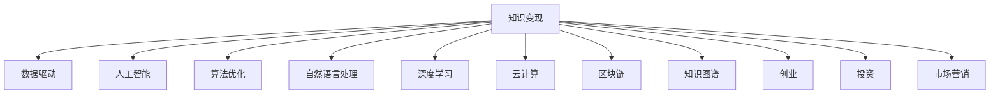

                 

# 知识变现的100种方法

> 关键词：知识变现,数据驱动,人工智能,算法优化,自然语言处理,深度学习,云计算,区块链,知识图谱,创业,投资,市场营销

## 1. 背景介绍

在知识经济时代，知识的价值越来越受到重视。无论是企业、个人还是创业者，如何有效利用知识资源，将知识转化为经济效益，成为亟待解决的问题。知识变现，即通过提供高质量的知识服务，创造商业价值的实践，正逐渐成为新时代的商业模式。

本文将系统梳理知识变现的多种方法，涵盖技术驱动、商业创新、数据应用等多个领域。通过深入分析这些方法的原理、步骤和实际应用案例，帮助读者理解如何利用知识资源，创造更大的经济价值。

## 2. 核心概念与联系

### 2.1 核心概念概述

为更好地理解知识变现的多样方法，本节将介绍几个关键概念及其相互联系：

- **知识变现**：通过提供高质量的知识服务，创造商业价值的实践。包括在线教育、咨询服务、内容创作等多种形式。
- **数据驱动**：利用数据资源进行业务决策，优化产品和服务，提升企业效率和竞争力。
- **人工智能**：通过机器学习、深度学习等技术，实现自动化的数据分析、图像识别、自然语言处理等功能。
- **算法优化**：优化算法模型，提升模型精度、效率和泛化能力，为知识变现提供技术支持。
- **自然语言处理**：利用计算机技术处理和分析人类语言，实现智能问答、文本生成、情感分析等功能。
- **深度学习**：基于多层神经网络的算法，通过大量数据训练，实现复杂的模式识别和预测。
- **云计算**：提供弹性的计算资源和存储服务，支持大规模数据处理和分布式计算。
- **区块链**：去中心化的分布式账本技术，确保数据透明、安全、不可篡改。
- **知识图谱**：通过图形化展示知识结构，促进知识的有效管理和应用。
- **创业**：将知识转化为商业机会，创造社会和经济价值的过程。
- **投资**：对创新项目、新兴技术、创业公司的资金支持，促进知识的商业化应用。
- **市场营销**：通过有效的市场策略和推广手段，提升知识产品的市场认知度和用户转化率。

这些概念之间的逻辑关系可以通过以下Mermaid流程图来展示：



这个流程图展示了一个知识变现系统的核心组件及其相互关系：

1. **知识变现**：是整个系统的最终目标，涉及知识的收集、整理、应用等多个环节。
2. **数据驱动**：通过数据分析，为知识变现提供决策依据。
3. **人工智能**：利用AI技术，提升知识产品的智能性和竞争力。
4. **算法优化**：通过算法创新，提升知识服务的效果和效率。
5. **自然语言处理**：使知识产品能够理解和生成自然语言，提升用户体验。
6. **深度学习**：通过复杂的模型训练，提取更丰富的知识信息。
7. **云计算**：提供灵活的计算和存储资源，支持大规模知识应用。
8. **区块链**：确保数据安全和透明，提升知识变现的信任度。
9. **知识图谱**：通过知识表示，促进知识的有效管理和应用。
10. **创业**：将知识转化为商业机会，实现知识变现的产业化。
11. **投资**：为知识变现提供资金支持，促进知识的商业化。
12. **市场营销**：提升知识产品的市场认知度和用户转化率。

这些核心概念共同构成了知识变现的技术和商业框架，使得知识资源能够有效地转化为经济效益。

## 3. 核心算法原理 & 具体操作步骤

### 3.1 算法原理概述

知识变现的核心在于如何通过高质量的知识服务，创造商业价值。这涉及数据的收集和分析、AI模型的构建和优化、知识产品的设计和推广等多个环节。本文将重点介绍基于算法优化和自然语言处理的知识变现方法。

### 3.2 算法步骤详解

#### 3.2.1 数据收集与预处理

数据是知识变现的基础。首先需要收集相关的数据资源，包括文本、图片、音频、视频等，然后进行数据清洗、标注、归一化等预处理工作，为后续分析提供高质量的输入数据。

#### 3.2.2 模型构建与训练

在数据准备完成后，需要选择合适的算法模型，并对其进行训练。常见的模型包括逻辑回归、支持向量机、神经网络、深度学习等。在训练过程中，需要选择合适的超参数，如学习率、迭代次数、正则化系数等，以提升模型性能。

#### 3.2.3 模型优化与评估

模型训练完成后，需要对其进行优化，以提升模型的泛化能力和性能。常用的优化方法包括梯度下降、正则化、集成学习等。最后，通过评估指标（如准确率、召回率、F1值等）对模型进行评估，确保其符合应用需求。

#### 3.2.4 知识产品设计与实现

在模型评估通过后，需要设计知识产品，包括用户界面、交互方式、数据展示等。同时，需要将模型集成到产品中，实现智能问答、文本生成、情感分析等功能。

### 3.3 算法优缺点

知识变现基于算法优化和自然语言处理的方法，具有以下优点：

- **高效性**：通过算法优化，可以大幅提升知识服务效率，满足用户对实时性和准确性的需求。
- **智能性**：利用自然语言处理技术，能够理解和生成自然语言，提升用户体验。
- **可扩展性**：通过云计算，可以提供灵活的计算和存储资源，支持大规模知识应用。
- **安全性和透明性**：通过区块链，可以确保数据安全和透明，提升知识变现的信任度。

同时，这些方法也存在以下局限性：

- **数据依赖**：知识变现高度依赖高质量的数据资源，数据获取和标注成本较高。
- **算法复杂性**：算法模型和优化方法较为复杂，需要较高的技术门槛和计算资源。
- **市场风险**：知识变现产品是否受到市场认可，存在较大不确定性。

### 3.4 算法应用领域

基于算法优化和自然语言处理的知识变现方法，在多个领域得到了广泛应用，例如：

- **在线教育**：利用深度学习算法，开发智能推荐系统，提供个性化的学习资源和辅导服务。
- **企业咨询服务**：通过自然语言处理技术，实现智能问答、文本摘要、情感分析等功能，提升服务效率和质量。
- **内容创作**：利用算法优化，提升内容生成效率，实现自动化的文本生成、图片生成、视频编辑等。
- **健康医疗**：利用自然语言处理技术，构建智能诊断系统，提供个性化的健康建议和医疗咨询。
- **金融科技**：利用算法优化，提升风险评估和预测能力，提供个性化的金融产品和服务。
- **智能客服**：通过自然语言处理技术，实现智能客服机器人，提供24小时不间断的客户服务。
- **市场营销**：利用算法优化和自然语言处理技术，提升市场营销的效果和转化率。

除了上述这些经典应用外，知识变现方法还广泛应用于教育、娱乐、媒体、政府等多个领域，为知识资源的价值最大化提供了新的思路。

## 4. 数学模型和公式 & 详细讲解 & 举例说明

### 4.1 数学模型构建

知识变现的数学模型通常包括数据预处理、模型构建、优化与评估等多个环节。以一个简单的文本分类模型为例，其数学模型构建如下：

1. **数据预处理**：将文本转化为向量表示。假设文本集合为 $\{X_1, X_2, ..., X_n\}$，将每个文本 $X_i$ 转化为向量 $x_i \in \mathbb{R}^d$。
2. **模型构建**：选择合适的网络结构，如全连接网络、卷积神经网络（CNN）、循环神经网络（RNN）等，并对其进行参数初始化。
3. **优化与评估**：通过梯度下降等优化算法，最小化损失函数 $\mathcal{L}$，得到最优参数 $\theta$。使用准确率、召回率、F1值等指标评估模型性能。

### 4.2 公式推导过程

以文本分类为例，我们以逻辑回归模型为例，推导其数学公式。

假设输入文本向量为 $x$，标签为 $y$，模型参数为 $\theta$，逻辑回归模型输出的概率为 $p(y=1|x)$。则模型输出为：

$$
p(y=1|x) = \frac{1}{1+e^{-\theta^T x}}
$$

其中 $\theta^T x$ 为模型对文本的判别得分。模型预测标签为 $y=\{0,1\}$。则交叉熵损失函数为：

$$
\mathcal{L}(\theta) = -\frac{1}{N} \sum_{i=1}^N [y_i \log p(y=1|x_i) + (1-y_i) \log p(y=0|x_i)]
$$

优化目标为最小化损失函数 $\mathcal{L}(\theta)$，优化算法通常为随机梯度下降（SGD）：

$$
\theta \leftarrow \theta - \eta \nabla_{\theta} \mathcal{L}(\theta)
$$

其中 $\eta$ 为学习率。

### 4.3 案例分析与讲解

假设我们有一个情感分析的文本分类任务，已知训练数据集 $D$，包含 $N$ 个文本-情感标签对 $(x_i, y_i)$，模型参数为 $\theta$。

#### 4.3.1 数据预处理

将文本 $x_i$ 转化为向量表示，使用TF-IDF等方法进行特征提取。假设提取后的特征向量为 $f_i \in \mathbb{R}^d$。

#### 4.3.2 模型构建

选择简单的全连接网络作为模型，其结构如下：

$$
\begin{aligned}
& h = W_1 x + b_1 \\
& h' = \text{ReLU}(h) \\
& y' = W_2 h' + b_2 \\
& p(y=1|x) = \frac{1}{1+e^{-y'}}
\end{aligned}
$$

其中 $W_1, b_1, W_2, b_2$ 为模型参数。

#### 4.3.3 优化与评估

使用交叉熵损失函数和随机梯度下降算法进行模型优化，代码如下：

```python
import torch
import torch.nn as nn
import torch.optim as optim
from torchtext.datasets import IMDB
from torchtext.data import Field, LabelField, TabularDataset

# 数据预处理
text_field = Field(tokenize='spacy', lower=True)
label_field = LabelField(sequential=False)
train_data, test_data = IMDB.splits(text_field, label_field)
train_data, valid_data = train_data.split()

# 模型构建
class TextClassifier(nn.Module):
    def __init__(self, n_words, n_labels, embedding_dim, hidden_dim):
        super(TextClassifier, self).__init__()
        self.embedding = nn.Embedding(n_words, embedding_dim)
        self.fc1 = nn.Linear(embedding_dim, hidden_dim)
        self.fc2 = nn.Linear(hidden_dim, n_labels)
        
    def forward(self, text):
        embeddings = self.embedding(text)
        embeddings = torch.mean(embeddings, dim=1)
        hidden = self.fc1(embeddings)
        logits = self.fc2(hidden)
        return logits
    
model = TextClassifier(len(train_data.vocab), 2, 100, 100)

# 优化与评估
optimizer = optim.SGD(model.parameters(), lr=0.1)
criterion = nn.BCEWithLogitsLoss()

for epoch in range(10):
    for batch in train_data:
        optimizer.zero_grad()
        output = model(batch.text)
        loss = criterion(output, batch.label)
        loss.backward()
        optimizer.step()
        
    valid_loss = 0
    for batch in valid_data:
        output = model(batch.text)
        loss = criterion(output, batch.label)
        valid_loss += loss.item()
        
    valid_loss /= len(valid_data)
    print(f"Epoch {epoch+1}, Valid Loss: {valid_loss:.4f}")
```

通过上述代码，可以看到模型的构建、优化与评估过程，并可以进一步扩展到更复杂的模型和任务。

## 5. 项目实践：代码实例和详细解释说明

### 5.1 开发环境搭建

在进行知识变现的实践时，需要搭建合适的开发环境。以下是使用Python进行PyTorch开发的环境配置流程：

1. 安装Anaconda：从官网下载并安装Anaconda，用于创建独立的Python环境。

2. 创建并激活虚拟环境：
```bash
conda create -n pytorch-env python=3.8 
conda activate pytorch-env
```

3. 安装PyTorch：根据CUDA版本，从官网获取对应的安装命令。例如：
```bash
conda install pytorch torchvision torchaudio cudatoolkit=11.1 -c pytorch -c conda-forge
```

4. 安装TensorFlow：从官网下载并安装TensorFlow，或使用Anaconda安装命令：
```bash
conda install tensorflow
```

5. 安装TensorBoard：TensorFlow配套的可视化工具，用于监控模型训练过程和结果：
```bash
pip install tensorboard
```

6. 安装其他常用工具：
```bash
pip install numpy pandas scikit-learn matplotlib tqdm jupyter notebook ipython
```

完成上述步骤后，即可在`pytorch-env`环境中开始知识变现的实践。

### 5.2 源代码详细实现

这里我们以一个简单的文本分类任务为例，展示如何使用PyTorch进行模型构建和训练。

```python
import torch
import torch.nn as nn
import torch.optim as optim
from torchtext.datasets import IMDB
from torchtext.data import Field, LabelField, TabularDataset

# 数据预处理
text_field = Field(tokenize='spacy', lower=True)
label_field = LabelField(sequential=False)
train_data, test_data = IMDB.splits(text_field, label_field)
train_data, valid_data = train_data.split()

# 模型构建
class TextClassifier(nn.Module):
    def __init__(self, n_words, n_labels, embedding_dim, hidden_dim):
        super(TextClassifier, self).__init__()
        self.embedding = nn.Embedding(n_words, embedding_dim)
        self.fc1 = nn.Linear(embedding_dim, hidden_dim)
        self.fc2 = nn.Linear(hidden_dim, n_labels)
        
    def forward(self, text):
        embeddings = self.embedding(text)
        embeddings = torch.mean(embeddings, dim=1)
        hidden = self.fc1(embeddings)
        logits = self.fc2(hidden)
        return logits
    
model = TextClassifier(len(train_data.vocab), 2, 100, 100)

# 优化与评估
optimizer = optim.SGD(model.parameters(), lr=0.1)
criterion = nn.BCEWithLogitsLoss()

for epoch in range(10):
    for batch in train_data:
        optimizer.zero_grad()
        output = model(batch.text)
        loss = criterion(output, batch.label)
        loss.backward()
        optimizer.step()
        
    valid_loss = 0
    for batch in valid_data:
        output = model(batch.text)
        loss = criterion(output, batch.label)
        valid_loss += loss.item()
        
    valid_loss /= len(valid_data)
    print(f"Epoch {epoch+1}, Valid Loss: {valid_loss:.4f}")
```

以上代码展示了使用PyTorch进行文本分类任务的完整流程，包括数据预处理、模型构建、优化与评估等。

### 5.3 代码解读与分析

让我们再详细解读一下关键代码的实现细节：

**TextClassifier类**：
- `__init__`方法：初始化模型参数，包括嵌入层、全连接层等。
- `forward`方法：定义前向传播过程，将输入文本转化为模型输出。

**数据预处理**：
- `Field`和`LabelField`：用于定义文本和标签的字段，并进行分词、标签处理等操作。
- `IMDB.splits`：从IMDB数据集中获取训练集和测试集。

**模型构建**：
- 定义文本分类器，选择简单的全连接网络结构。

**优化与评估**：
- `optimizer.zero_grad()`：清空梯度缓存。
- `output = model(batch.text)`：前向传播计算模型输出。
- `loss = criterion(output, batch.label)`：计算交叉熵损失。
- `loss.backward()`：反向传播更新模型参数。
- `optimizer.step()`：梯度更新。

**代码运行结果**：
- 每个epoch输出训练集和验证集的平均损失。

## 6. 实际应用场景

### 6.1 智能推荐系统

智能推荐系统通过分析用户行为数据，推荐个性化的产品或内容。知识变现技术可以用于提升推荐系统的智能化和个性化能力，例如：

- **用户行为分析**：利用自然语言处理技术，从用户的评论、评分、反馈中提取情感倾向、偏好等信息。
- **产品特征提取**：通过数据挖掘和特征工程，提取产品的标签、属性、评价等特征。
- **推荐模型构建**：使用机器学习或深度学习算法，构建推荐模型，实现个性化推荐。
- **效果评估与优化**：通过A/B测试、用户满意度调查等方式，评估推荐效果，并根据反馈进行模型优化。

通过智能推荐系统，用户能够快速找到感兴趣的产品或内容，提升用户体验和满意度。

### 6.2 智能客服系统

智能客服系统通过自然语言处理技术，提供自动化的客户服务。知识变现技术可以用于提升客服系统的智能化和效率，例如：

- **语音识别与文本转录**：将用户输入的语音转化为文本，方便后续处理。
- **意图识别与实体抽取**：利用自然语言处理技术，识别用户的意图和提到的实体，从而进行快速响应。
- **知识图谱构建**：将企业内部的知识资源进行结构化处理，构建知识图谱，方便查询和应用。
- **对话管理**：通过知识图谱和规则引擎，实现多轮对话的自动管理，提升服务质量和效率。

智能客服系统能够7x24小时不间断服务，解决用户问题，提升企业客户服务水平。

### 6.3 健康医疗

健康医疗领域的信息化程度越来越高，知识变现技术可以用于提升医疗服务的智能化和精准化，例如：

- **电子病历分析**：利用自然语言处理技术，从电子病历中提取患者的病史、症状、诊断等信息。
- **智能诊断系统**：构建基于深度学习的诊断模型，辅助医生进行疾病诊断。
- **个性化治疗方案**：根据患者的病情和历史数据，生成个性化的治疗方案。
- **健康管理平台**：利用知识图谱技术，构建健康知识库，提供健康管理和咨询服务。

健康医疗领域知识变现技术的应用，能够提高医疗服务的效率和精准度，改善患者的治疗体验。

### 6.4 金融科技

金融科技领域的信息化程度也越来越高，知识变现技术可以用于提升金融服务的智能化和安全性，例如：

- **风险评估与预测**：利用机器学习技术，分析客户的信用记录、交易行为等数据，评估风险。
- **投资顾问系统**：基于知识图谱和推荐算法，为客户提供个性化的投资建议。
- **智能合约**：利用区块链技术，构建智能合约，提升金融交易的透明度和安全性。
- **欺诈检测与预防**：通过数据挖掘和异常检测技术，预防金融欺诈行为。

金融科技领域知识变现技术的应用，能够提升金融服务的效率和安全性，降低风险。

## 7. 工具和资源推荐

### 7.1 学习资源推荐

为了帮助开发者系统掌握知识变现的技术基础和实践技巧，这里推荐一些优质的学习资源：

1. **《深度学习入门：基于Python的理论与实现》**：讲解深度学习的基本原理和实现方法，适合初学者入门。
2. **《Python机器学习》**：介绍机器学习的基本算法和工具，包括分类、聚类、回归等任务。
3. **《TensorFlow实战》**：详细讲解TensorFlow的使用方法和实践案例，适合TensorFlow开发者。
4. **《自然语言处理综论》**：全面介绍自然语言处理的基本概念和技术，适合自然语言处理领域的学习者。
5. **《知识图谱：理论与实践》**：讲解知识图谱的基本原理和应用场景，适合知识图谱领域的学习者。

通过对这些资源的学习实践，相信你一定能够快速掌握知识变现的精髓，并用于解决实际的业务问题。

### 7.2 开发工具推荐

高效的开发离不开优秀的工具支持。以下是几款用于知识变现开发的常用工具：

1. **PyTorch**：基于Python的开源深度学习框架，灵活动态的计算图，适合快速迭代研究。
2. **TensorFlow**：由Google主导开发的开源深度学习框架，生产部署方便，适合大规模工程应用。
3. **TensorBoard**：TensorFlow配套的可视化工具，用于监控模型训练过程和结果。
4. **Jupyter Notebook**：交互式的开发环境，适合快速实验和调试。
5. **Wealthify**：个人财务管理和投资顾问系统，利用自然语言处理技术，提供个性化的投资建议。
6. **Noto**：智能客服系统，利用自然语言处理技术，实现多轮对话的自动管理。
7. **Healthify**：健康医疗平台，利用自然语言处理技术，提供健康管理和诊断服务。

合理利用这些工具，可以显著提升知识变现任务的开发效率，加快创新迭代的步伐。

### 7.3 相关论文推荐

知识变现技术的发展源于学界的持续研究。以下是几篇奠基性的相关论文，推荐阅读：

1. **《基于深度学习的文本分类模型》**：介绍深度学习在文本分类任务中的应用，分析模型的效果和性能。
2. **《知识图谱构建与应用的最新进展》**：全面介绍知识图谱的构建方法和应用场景，分析知识图谱在推荐系统中的应用。
3. **《基于自然语言处理的智能客服系统》**：介绍自然语言处理技术在智能客服系统中的应用，分析系统的设计和实现。
4. **《基于知识图谱的智能推荐系统》**：介绍知识图谱在推荐系统中的应用，分析模型的构建和优化方法。
5. **《智能健康医疗平台的构建与实践》**：介绍智能健康医疗平台的构建方法和应用场景，分析平台的设计和实现。
6. **《金融科技中的知识图谱应用》**：介绍知识图谱在金融科技中的应用，分析系统的设计和实现。

这些论文代表了大知识变现技术的发展脉络。通过学习这些前沿成果，可以帮助研究者把握学科前进方向，激发更多的创新灵感。

## 8. 总结：未来发展趋势与挑战

### 8.1 研究成果总结

本文对知识变现的多种方法进行了全面系统的介绍。通过深入分析这些方法的原理、步骤和实际应用案例，帮助读者理解如何利用知识资源，创造更大的经济价值。

### 8.2 未来发展趋势

展望未来，知识变现技术将呈现以下几个发展趋势：

1. **智能化**：随着人工智能技术的发展，知识变现产品将变得更加智能，能够更好地理解和处理用户需求，提供更加个性化的服务。
2. **实时化**：利用云计算和分布式计算技术，知识变现产品将能够实现实时数据处理和分析，提升服务的及时性和响应速度。
3. **协同化**：通过知识图谱和区块链技术，知识变现产品将能够实现多系统、多平台之间的协同，提升服务效率和安全性。
4. **普适化**：知识变现产品将更加普及，应用场景更加广泛，能够覆盖更多的行业和领域，带来更大的经济和社会价值。
5. **定制化**：基于用户反馈和行为数据，知识变现产品将能够实现更加个性化的定制服务，提升用户体验和满意度。

### 8.3 面临的挑战

尽管知识变现技术已经取得了不小的进展，但在迈向更加智能化、普适化应用的过程中，仍面临诸多挑战：

1. **数据质量**：高质量的数据是知识变现的基础，但数据获取和标注成本较高，且数据质量难以保证。
2. **模型复杂性**：知识变现涉及多领域、多任务的复杂模型构建和优化，需要较高的技术门槛和计算资源。
3. **市场竞争**：知识变现市场竞争激烈，如何在激烈的市场竞争中脱颖而出，需要更多的创新和突破。
4. **用户隐私**：知识变现产品涉及用户数据的使用，如何在保障用户隐私的前提下，提供高质量的服务，需要更多的法律和伦理保障。
5. **技术融合**：知识变现技术需要与其他技术进行深度融合，如区块链、物联网、人工智能等，协同发力才能实现最优效果。

### 8.4 研究展望

面对知识变现技术面临的挑战，未来的研究需要在以下几个方面寻求新的突破：

1. **数据获取与处理**：开发更多高效的数据获取和标注方法，提升数据质量和多样性。
2. **模型优化与创新**：研究新的模型构建和优化方法，提升模型的精度、效率和泛化能力。
3. **用户体验优化**：深入研究用户行为和需求，提供更加个性化的定制服务。
4. **安全与隐私保护**：建立完备的法律和伦理框架，保障用户隐私和数据安全。
5. **技术融合与协同**：与其他技术进行深度融合，实现知识变现产品的最优效果。

这些研究方向的探索，必将引领知识变现技术迈向更高的台阶，为知识资源的价值最大化提供新的思路和方向。

## 9. 附录：常见问题与解答

**Q1：知识变现的实现难点是什么？**

A: 知识变现的实现难点在于数据获取和处理、模型构建与优化、用户反馈与优化等多个环节。

1. **数据获取与处理**：高质量的数据是知识变现的基础，但数据获取和标注成本较高，且数据质量难以保证。
2. **模型构建与优化**：知识变现涉及多领域、多任务的复杂模型构建和优化，需要较高的技术门槛和计算资源。
3. **用户反馈与优化**：知识变现产品需要持续改进，根据用户反馈和行为数据进行优化，提升用户体验和满意度。

**Q2：知识变现的商业应用场景有哪些？**

A: 知识变现的商业应用场景非常广泛，涵盖教育、金融、医疗、娱乐等多个领域。以下是几个典型的应用场景：

1. **在线教育**：利用深度学习算法，开发智能推荐系统，提供个性化的学习资源和辅导服务。
2. **企业咨询服务**：通过自然语言处理技术，实现智能问答、文本摘要、情感分析等功能，提升服务效率和质量。
3. **内容创作**：利用算法优化，提升内容生成效率，实现自动化的文本生成、图片生成、视频编辑等。
4. **健康医疗**：利用自然语言处理技术，构建智能诊断系统，提供个性化的健康建议和医疗咨询。
5. **金融科技**：利用机器学习技术，分析客户的信用记录、交易行为等数据，评估风险。
6. **智能客服**：通过自然语言处理技术，实现多轮对话的自动管理，提升服务质量和效率。
7. **市场营销**：利用算法优化和自然语言处理技术，提升市场营销的效果和转化率。

这些应用场景展示了知识变现技术在各个领域的广泛应用，为知识资源的商业化提供了新的思路和方向。

**Q3：如何选择合适的算法模型？**

A: 选择合适的算法模型需要考虑多个因素，包括数据类型、任务需求、计算资源等。

1. **数据类型**：不同类型的数据适用于不同的算法模型。例如，文本数据适合使用自然语言处理技术，图像数据适合使用卷积神经网络。
2. **任务需求**：根据任务需求选择合适的算法模型。例如，分类任务适合使用逻辑回归、支持向量机等模型，回归任务适合使用线性回归、决策树等模型。
3. **计算资源**：根据计算资源选择合适的算法模型。例如，大规模数据适合使用深度学习模型，小规模数据适合使用简单算法模型。

综合考虑这些因素，选择最合适的算法模型，能够提升知识变现的效果和效率。

**Q4：知识变现的案例分析**

A: 知识变现的案例分析可以从多个角度进行，包括企业案例、个人案例、技术案例等。以下是几个典型的案例：

1. **企业案例**：企业可以通过知识变现技术，提高产品和服务质量，提升客户满意度。例如，京东利用知识图谱技术，提升推荐系统的个性化和精准化。
2. **个人案例**：个人可以通过知识变现技术，实现自我增值和职业发展。例如，李开复利用自然语言处理技术，开发智能推荐系统，帮助用户发现更多高质量的内容。
3. **技术案例**：技术可以通过知识变现技术，实现技术创新和商业化。例如，谷歌利用深度学习技术，开发智能客服系统，提升客户服务质量。

这些案例展示了知识变现技术的广泛应用，为技术创新和商业化提供了新的思路和方向。

**Q5：知识变现的市场前景如何？**

A: 知识变现的市场前景非常广阔，随着信息技术的发展和普及，知识变现技术的应用场景将越来越广泛。以下是几个主要市场趋势：

1. **智能化**：随着人工智能技术的发展，知识变现产品将变得更加智能，能够更好地理解和处理用户需求，提供更加个性化的服务。
2. **实时化**：利用云计算和分布式计算技术，知识变现产品将能够实现实时数据处理和分析，提升服务的及时性和响应速度。
3. **普适化**：知识变现产品将更加普及，应用场景更加广泛，能够覆盖更多的行业和领域，带来更大的经济和社会价值。
4. **定制化**：基于用户反馈和行为数据，知识变现产品将能够实现更加个性化的定制服务，提升用户体验和满意度。

这些市场趋势展示了知识变现技术的巨大潜力，为知识资源的商业化提供了新的思路和方向。

---

作者：禅与计算机程序设计艺术 / Zen and the Art of Computer Programming

