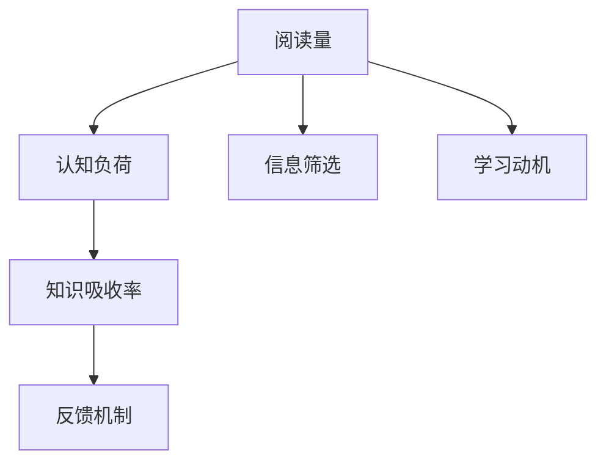

                 

# 知识吸收率:比阅读量更重要的指标

## 1. 背景介绍

### 1.1 问题由来

随着互联网的普及，信息爆炸已成现实。人们面临前所未有的信息洪流，对于每一个人的知识吸收与消化能力提出了更高的要求。但仅阅读量的累积并不能真正反映一个人知识掌握的深度与广度。因此，知识吸收率成为一个比阅读量更为重要的指标。

在信息爆炸的时代，如何高效地吸收、整理、消化和应用知识，已经成为当今社会每个人都需要面对的问题。在快速变化的职场环境中，对于新知识的掌握能力，乃至知识吸收率，成为了竞争力的重要标志。

### 1.2 问题核心关键点

知识吸收率是指个体在一定时间范围内对所接收信息的理解和掌握程度。它包括了阅读、理解、应用、反馈等环节，反映了一个人的综合能力。阅读量的累积固然重要，但真正的学习效果，需要通过知识吸收率来衡量。

影响知识吸收率的因素很多，包括学习动机、认知水平、学习方法、环境因素等。阅读量的累积是一个量的指标，而知识吸收率是一个质的指标。二者相辅相成，但更关键的是质的指标。

## 2. 核心概念与联系

### 2.1 核心概念概述

- **知识吸收率**：指个体在一定时间内对所接收信息的理解和掌握程度。
- **阅读量**：指个体在一定时间内阅读的字数或篇数，是知识输入的指标。
- **认知负荷**：指个体在获取信息时所承担的心理负担，影响知识吸收率的重要因素。
- **信息筛选**：指个体对接收到的信息进行甄别，去除无用或低价值信息，提高知识吸收率的过程。
- **学习动机**：指个体获取知识的意愿和目标，直接影响学习效果。
- **反馈机制**：指个体在学习过程中获得反馈，调整学习方法，优化知识吸收率的过程。

这些概念之间的关系可以通过以下Mermaid流程图来展示：



这个流程图展示了知识吸收率与其他关键概念之间的关系：

1. 阅读量是知识输入的起点。
2. 阅读量经过信息筛选，去伪存真。
3. 学习动机和认知负荷影响知识吸收率。
4. 反馈机制帮助优化知识吸收率。

这些核心概念共同构成了知识吸收率的理论框架，有助于深入理解知识吸收率的本质及其影响因素。

## 3. 核心算法原理 & 具体操作步骤
### 3.1 算法原理概述

知识吸收率的提升涉及多个环节，包括阅读、筛选、吸收、反馈等。其核心算法可以概括为以下几个步骤：

1. **信息筛选**：通过算法对信息进行分类、过滤和排序，筛选出高质量、高价值的内容。
2. **认知负荷评估**：使用算法评估个体在获取信息时的认知负担，进行个性化调整。
3. **知识吸收**：利用算法优化信息处理流程，提高知识吸收率。
4. **反馈机制**：通过算法提供反馈，调整学习策略，持续提升知识吸收率。

### 3.2 算法步骤详解

#### 3.2.1 信息筛选

信息筛选是知识吸收率提升的关键步骤。算法可以基于文本挖掘、情感分析、关键词提取等技术，对信息进行自动分类和筛选。例如，通过TF-IDF算法对文档进行加权排序，去除冗余信息。

#### 3.2.2 认知负荷评估

认知负荷评估需要使用心理学和认知科学的理论，如工作记忆模型、知识结构理论等。算法可以通过问卷调查、行为分析等方式，评估个体的认知负荷，并根据评估结果进行个性化调整。例如，使用CoCoSpace模型评估用户的认知负荷，并根据评估结果提供推荐算法，减轻用户负担。

#### 3.2.3 知识吸收

知识吸收需要通过算法优化信息处理流程，例如使用深度学习模型、认知模型等。通过自适应学习算法，根据个体认知特点和知识需求，自动调整学习速度和内容难度。例如，使用自适应学习算法调整教学内容，根据学生的认知水平和反馈，动态调整课程难度。

#### 3.2.4 反馈机制

反馈机制是知识吸收率提升的重要环节。算法可以通过评价系统、预测系统等方式，提供及时反馈，帮助个体调整学习策略。例如，使用强化学习算法，根据用户的学习表现，动态调整推荐内容，提升学习效果。

### 3.3 算法优缺点

#### 3.3.1 算法优点

- **高效性**：自动化的信息筛选和认知负荷评估，大大提高了知识吸收的效率。
- **个性化**：根据个体特点进行个性化调整，提升学习效果。
- **自适应性**：自适应学习算法和反馈机制，能够动态调整学习内容，提升知识吸收率。

#### 3.3.2 算法缺点

- **数据依赖**：算法依赖于大量的高质量数据，数据质量影响算法效果。
- **复杂性**：算法模型复杂，需要大量计算资源。
- **用户隐私**：个性化推荐和反馈机制可能涉及用户隐私，需要额外保护。

### 3.4 算法应用领域

知识吸收率提升的算法已经在多个领域得到了广泛应用，包括：

- **教育**：个性化推荐、自适应学习、认知负荷评估等技术，在K-12、高等教育中广泛应用。
- **职场培训**：基于用户行为分析的个性化推荐，提升学习效果。
- **信息检索**：信息筛选算法，提升信息检索的准确性和相关性。
- **职业发展**：知识图谱、推荐系统等，帮助用户掌握前沿知识和技能。
- **医疗**：根据用户行为分析的个性化推荐，提升医疗知识的学习效果。

这些领域的应用展示了知识吸收率提升算法的重要价值，也为进一步研究提供了广阔的实践场景。

## 4. 数学模型和公式 & 详细讲解 & 举例说明

### 4.1 数学模型构建

知识吸收率提升的算法通常基于以下数学模型：

1. **信息筛选模型**：
   - 基于TF-IDF、LSI等文本挖掘技术，对信息进行加权排序和筛选。
   - 公式推导：

     $$
     S = \sum_{i=1}^{N} TF_i \times IDF_i
     $$

     其中，$S$表示信息筛选后的评分，$TF_i$和$IDF_i$分别表示第$i$条信息的词频和逆文档频率。

2. **认知负荷评估模型**：
   - 使用CoCoSpace模型，评估用户的认知负荷，模型参数包括$C_{i,j}$表示第$i$个用户在第$j$项任务上的认知负荷，$W_{i,j}$表示用户$j$在任务$i$上的权重。
   - 公式推导：

     $$
     C_{i,j} = W_{i,j} \times I_{i,j}
     $$

     其中，$I_{i,j}$表示任务$i$对用户$j$的认知负荷强度。

3. **知识吸收模型**：
   - 使用自适应学习算法，如在线梯度下降算法(OGD)，动态调整学习速度和内容难度。
   - 公式推导：

     $$
     a_t = a_{t-1} - \alpha \nabla L(\theta)
     $$

     其中，$a_t$表示第$t$次迭代后的学习率，$L(\theta)$表示学习目标函数，$\alpha$表示学习率。

4. **反馈机制模型**：
   - 使用强化学习算法，如Q-learning，根据用户的学习表现，动态调整推荐内容。
   - 公式推导：

     $$
     Q_{s,a} \leftarrow (1 - \alpha) Q_{s,a} + \alpha \left[ R_{t} + \gamma \max_{a'} Q_{s',a'} \right]
     $$

     其中，$Q_{s,a}$表示在第$s$状态下采取行动$a$的Q值，$R_{t}$表示即时奖励，$\gamma$表示折扣因子，$s'$表示下一个状态。

### 4.2 公式推导过程

以知识吸收模型为例，详细推导自适应学习算法的公式：

1. 在线梯度下降算法（OGD）：
   - 公式推导：

     $$
     a_t = a_{t-1} - \alpha \nabla L(\theta)
     $$

     其中，$a_t$表示第$t$次迭代后的学习率，$L(\theta)$表示损失函数，$\alpha$表示学习率。

2. 学习率更新：
   - 公式推导：

     $$
     \alpha_t = \frac{1}{\sqrt{t}}
     $$

     其中，$\alpha_t$表示第$t$次迭代后的学习率，$t$表示迭代次数。

3. 学习率衰减：
   - 公式推导：

     $$
     \alpha_t = \frac{\alpha_0}{\sqrt{t} + \sqrt{1 + \alpha_1 t}}
     $$

     其中，$\alpha_0$表示初始学习率，$\alpha_1$表示学习率衰减系数。

### 4.3 案例分析与讲解

**案例：一个企业培训系统的知识吸收率提升**

假设某企业希望提升员工的职业技能培训效果，利用知识吸收率提升算法进行优化：

1. **信息筛选**：
   - 利用TF-IDF算法对所有培训资源进行加权排序，筛选出高价值的内容。
   - 对员工的学习行为进行监测，自动标记其未阅读或未理解的部分。

2. **认知负荷评估**：
   - 通过问卷调查和行为分析，评估员工在每个培训课程中的认知负荷。
   - 根据评估结果，为每个员工生成个性化的学习路径，减轻其认知负荷。

3. **知识吸收**：
   - 使用自适应学习算法，根据员工的学习表现，动态调整学习速度和内容难度。
   - 通过即时反馈系统，向员工提供学习进度和知识点掌握情况。

4. **反馈机制**：
   - 使用Q-learning算法，根据员工的学习表现，动态调整培训内容的推荐。
   - 定期进行学习效果评估，调整培训策略，提升整体学习效果。

通过上述算法，企业可以显著提升员工的知识吸收率，提高培训效果。

## 5. 项目实践：代码实例和详细解释说明

### 5.1 开发环境搭建

在进行知识吸收率提升的算法开发前，需要准备好开发环境：

1. 安装Python：从官网下载并安装Python。
2. 安装NumPy、Pandas、Scikit-learn等科学计算库。
3. 安装TensorFlow或PyTorch深度学习框架。
4. 安装TensorBoard或Weights & Biases可视化工具。

完成上述步骤后，即可在本地环境中进行开发。

### 5.2 源代码详细实现

以下是一个简单的信息筛选算法的Python实现：

```python
import numpy as np

# 定义TF-IDF计算函数
def calculate_tf_idf(documents, ngram=1):
    tf_idf = np.zeros((len(documents), ngram), dtype=np.float32)
    tf = np.zeros(len(documents), dtype=np.float32)
    idf = np.zeros(ngram, dtype=np.float32)
    vocabulary = set()

    # 计算文档-词频矩阵
    for i, doc in enumerate(documents):
        for word in doc:
            tf[i] += 1
            vocabulary.add(word)

    # 计算逆文档频率
    idf = np.log(len(documents) / (1 + np.sum(tf, axis=0)))

    # 计算TF-IDF矩阵
    for i, doc in enumerate(documents):
        for j, word in enumerate(doc):
            tf_idf[i][j] = tf[i] * idf[j]

    return tf_idf, tf, idf

# 定义信息筛选函数
def screen_information(documents, tf_idf, ngram=1, threshold=0.5):
    screened_documents = []
    for i, doc in enumerate(documents):
        if np.sum(tf_idf[i]) >= threshold:
            screened_documents.append(doc)

    return screened_documents

# 示例数据
documents = [
    ["Python", "机器学习", "深度学习"],
    ["自然语言处理", "信息检索", "文本分类"],
    ["计算机视觉", "图像处理", "卷积神经网络"],
    ["强化学习", "游戏AI", "Q-learning"]
]

# 计算TF-IDF矩阵
tf_idf, tf, idf = calculate_tf_idf(documents)

# 筛选信息
screened_documents = screen_information(documents, tf_idf, threshold=0.5)

# 输出结果
print("原始文档数量:", len(documents))
print("筛选后文档数量:", len(screened_documents))
print("筛选后文档:", screened_documents)
```

### 5.3 代码解读与分析

上述代码实现了一个简单的信息筛选算法，步骤如下：

1. **计算TF-IDF矩阵**：
   - 通过计算每个文档中词频和逆文档频率，得到TF-IDF矩阵。
   - 在示例中，我们定义了ngram为1，即只考虑单个单词。

2. **筛选信息**：
   - 根据TF-IDF矩阵计算每个文档的总评分，筛选出评分高于阈值的文档。
   - 在示例中，我们设置阈值为0.5，即只保留评分高于0.5的文档。

3. **输出结果**：
   - 打印原始文档数量和筛选后文档数量，以及筛选后的文档内容。

通过这个简单的示例，可以看出信息筛选算法的实现过程。在实际应用中，可以使用更复杂的算法，如LSI、LDA等，提升信息筛选的准确性和有效性。

## 6. 实际应用场景

### 6.1 企业培训系统

企业培训系统可以利用知识吸收率提升算法，优化培训内容和学习路径。通过信息筛选和认知负荷评估，提升培训效果，提升员工技能水平。

1. **信息筛选**：
   - 对所有培训资源进行加权排序，筛选出高价值的内容。
   - 对员工的学习行为进行监测，自动标记其未阅读或未理解的部分。

2. **认知负荷评估**：
   - 通过问卷调查和行为分析，评估员工在每个培训课程中的认知负荷。
   - 根据评估结果，为每个员工生成个性化的学习路径，减轻其认知负荷。

3. **知识吸收**：
   - 使用自适应学习算法，根据员工的学习表现，动态调整学习速度和内容难度。
   - 通过即时反馈系统，向员工提供学习进度和知识点掌握情况。

4. **反馈机制**：
   - 使用Q-learning算法，根据员工的学习表现，动态调整培训内容的推荐。
   - 定期进行学习效果评估，调整培训策略，提升整体学习效果。

### 6.2 学习平台

学习平台可以利用知识吸收率提升算法，提升用户的在线学习效果。通过信息筛选和认知负荷评估，个性化推荐，提升学习体验。

1. **信息筛选**：
   - 对所有学习资源进行加权排序，筛选出高价值的内容。
   - 对用户的学习行为进行监测，自动标记其未阅读或未理解的部分。

2. **认知负荷评估**：
   - 通过问卷调查和行为分析，评估用户在每个学习模块中的认知负荷。
   - 根据评估结果，为每个用户生成个性化的学习路径，减轻其认知负荷。

3. **知识吸收**：
   - 使用自适应学习算法，根据用户的学习表现，动态调整学习速度和内容难度。
   - 通过即时反馈系统，向用户提供学习进度和知识点掌握情况。

4. **反馈机制**：
   - 使用Q-learning算法，根据用户的学习表现，动态调整学习内容的推荐。
   - 定期进行学习效果评估，调整学习策略，提升整体学习效果。

### 6.3 医疗知识库

医疗知识库可以利用知识吸收率提升算法，提升医生的知识掌握水平。通过信息筛选和认知负荷评估，个性化推荐，提升医疗知识的学习效果。

1. **信息筛选**：
   - 对所有医疗资源进行加权排序，筛选出高价值的内容。
   - 对医生的学习行为进行监测，自动标记其未阅读或未理解的部分。

2. **认知负荷评估**：
   - 通过问卷调查和行为分析，评估医生在每个医疗课程中的认知负荷。
   - 根据评估结果，为每个医生生成个性化的学习路径，减轻其认知负荷。

3. **知识吸收**：
   - 使用自适应学习算法，根据医生的学习表现，动态调整学习速度和内容难度。
   - 通过即时反馈系统，向医生提供学习进度和知识点掌握情况。

4. **反馈机制**：
   - 使用Q-learning算法，根据医生的学习表现，动态调整医疗内容的推荐。
   - 定期进行学习效果评估，调整学习策略，提升整体学习效果。

## 7. 工具和资源推荐

### 7.1 学习资源推荐

为了帮助开发者系统掌握知识吸收率提升的理论基础和实践技巧，这里推荐一些优质的学习资源：

1. 《深度学习入门：基于TensorFlow的理论与实现》系列博文：由大模型技术专家撰写，深入浅出地介绍了深度学习的基本概念和应用场景。

2. 《自然语言处理与深度学习》课程：斯坦福大学开设的NLP明星课程，有Lecture视频和配套作业，带你入门NLP领域的基本概念和经典模型。

3. 《知识吸收率提升算法》书籍：详细介绍知识吸收率提升算法的理论基础和实际应用，涵盖信息筛选、认知负荷评估、知识吸收、反馈机制等多个环节。

4. 《自然语言处理技术与应用》书籍：全面介绍了NLP技术的各种应用场景，包括教育、医疗、信息检索等，提供大量的案例分析。

5. Kaggle：在线数据科学竞赛平台，提供丰富的数据集和算法竞赛，帮助你实践和提升知识吸收率提升算法。

通过这些资源的学习实践，相信你一定能够快速掌握知识吸收率提升的精髓，并用于解决实际的NLP问题。

### 7.2 开发工具推荐

高效的开发离不开优秀的工具支持。以下是几款用于知识吸收率提升开发的常用工具：

1. Jupyter Notebook：在线交互式编程环境，支持Python和R等多种编程语言。

2. TensorFlow：基于Python的开源深度学习框架，生产部署方便，适合大规模工程应用。

3. PyTorch：基于Python的开源深度学习框架，灵活动态的计算图，适合快速迭代研究。

4. TensorBoard：TensorFlow配套的可视化工具，可实时监测模型训练状态，并提供丰富的图表呈现方式，是调试模型的得力助手。

5. Weights & Biases：模型训练的实验跟踪工具，可以记录和可视化模型训练过程中的各项指标，方便对比和调优。

6. Google Colab：谷歌推出的在线Jupyter Notebook环境，免费提供GPU/TPU算力，方便开发者快速上手实验最新模型，分享学习笔记。

合理利用这些工具，可以显著提升知识吸收率提升任务的开发效率，加快创新迭代的步伐。

### 7.3 相关论文推荐

知识吸收率提升的研究源于学界的持续研究。以下是几篇奠基性的相关论文，推荐阅读：

1. "Cognitive Load Theory: An Overview" by Sweller, J. (1998)：介绍了认知负荷理论的基本框架和应用。

2. "Knowledge-based Retrieval: Using Information Retrieval to Improve Learning" by Resnick, P., & Wilks, J. (1995)：探讨了信息检索技术在教育中的应用，提升学习效果。

3. "Active Learning for Knowledge Acquisition" by Gale, W. (2014)：介绍了主动学习算法的基本原理和应用。

4. "Adaptive Learning Environments" by Ferrara, S. (2003)：介绍了自适应学习算法的基本原理和应用。

5. "A Survey of the Use of Natural Language Processing in Education" by Filatov, M. (2021)：介绍了NLP技术在教育中的应用，提升学习效果。

这些论文代表了大语言模型微调技术的发展脉络。通过学习这些前沿成果，可以帮助研究者把握学科前进方向，激发更多的创新灵感。

## 8. 总结：未来发展趋势与挑战

### 8.1 总结

本文对知识吸收率提升算法进行了全面系统的介绍。首先阐述了知识吸收率提升的背景和意义，明确了知识吸收率相对于阅读量的重要性和影响因素。其次，从原理到实践，详细讲解了知识吸收率提升算法的数学模型和操作步骤，给出了知识吸收率提升任务开发的完整代码实例。同时，本文还广泛探讨了知识吸收率提升算法在教育、医疗、学习平台等多个领域的应用前景，展示了知识吸收率提升算法的巨大潜力。此外，本文精选了知识吸收率提升算法的各类学习资源，力求为读者提供全方位的技术指引。

通过本文的系统梳理，可以看到，知识吸收率提升算法正在成为教育、培训、信息检索等领域的重要范式，极大地提升了信息获取和知识学习的效率。知识吸收率提升技术需要与信息筛选、认知负荷评估、自适应学习、反馈机制等多个环节相结合，共同提升知识吸收效果。未来，伴随知识吸收率提升技术的持续演进，相信知识获取、应用和学习系统将迈向新的高度，为人类认知智能的进化带来深远影响。

### 8.2 未来发展趋势

展望未来，知识吸收率提升技术将呈现以下几个发展趋势：

1. **深度学习与认知科学的融合**：通过引入深度学习模型，提升知识筛选和认知负荷评估的准确性，实现更加个性化的学习路径。

2. **自适应学习与知识图谱的结合**：利用知识图谱，增强自适应学习模型的知识融合能力，提升学习效果。

3. **多模态学习的应用**：将视觉、语音等多模态信息与文本信息结合，实现全面、多维度的知识吸收。

4. **持续学习与迁移学习的融合**：通过持续学习算法，不断吸收新知识，同时保持已有知识，提升知识吸收的动态性。

5. **知识吸收率与伦理安全的结合**：引入伦理导向的评估指标，过滤和惩罚有害、偏见的内容，确保知识吸收的安全性。

以上趋势凸显了知识吸收率提升技术的多样性和发展潜力。这些方向的探索发展，必将进一步提升知识获取和应用系统的性能和应用范围，为人类认知智能的进化带来深远影响。

### 8.3 面临的挑战

尽管知识吸收率提升技术已经取得了显著成就，但在迈向更加智能化、普适化应用的过程中，仍面临诸多挑战：

1. **数据质量与标注成本**：高质量的标注数据是知识吸收率提升的基础，但获取高质量标注数据成本高、难度大。如何降低数据标注成本，提高数据质量，是一大难题。

2. **认知负荷评估的复杂性**：认知负荷评估涉及心理学、认知科学等多个领域，模型复杂，难以精准衡量用户认知负荷。如何提高认知负荷评估的准确性，是一大挑战。

3. **算法的可扩展性**：知识吸收率提升算法涉及信息筛选、认知负荷评估、知识吸收、反馈机制等多个环节，算法复杂，难以高效扩展。如何优化算法，提升可扩展性，是一大挑战。

4. **个性化推荐的公平性**：知识吸收率提升算法依赖于个性化推荐，如何避免偏见和歧视，实现公平推荐，是一大挑战。

5. **系统的可解释性**：知识吸收率提升算法缺乏可解释性，难以对其内部工作机制和决策逻辑进行解释和调试。如何提高算法的可解释性，是一大挑战。

6. **隐私与安全的保护**：知识吸收率提升算法涉及大量用户数据，如何保护用户隐私，确保数据安全，是一大挑战。

正视知识吸收率提升技术面临的这些挑战，积极应对并寻求突破，将使知识吸收率提升技术走向成熟，为构建安全、可靠、可解释、可控的智能系统铺平道路。相信随着学界和产业界的共同努力，这些挑战终将一一被克服，知识吸收率提升技术必将在构建智能知识获取系统方面发挥重要作用。

### 8.4 研究展望

面对知识吸收率提升技术面临的种种挑战，未来的研究需要在以下几个方面寻求新的突破：

1. **无监督和半监督学习方法的引入**：摆脱对大规模标注数据的依赖，利用自监督学习、主动学习等无监督和半监督范式，最大限度利用非结构化数据，实现更加灵活高效的知识吸收。

2. **多模态学习方法的探索**：将视觉、语音等多模态信息与文本信息结合，实现全面、多维度的知识吸收。

3. **自适应学习与知识图谱的结合**：利用知识图谱，增强自适应学习模型的知识融合能力，提升学习效果。

4. **认知负荷评估的优化**：通过引入心理学、认知科学等领域的理论，提高认知负荷评估的准确性和可解释性。

5. **个性化推荐的公平性研究**：引入公平性评估指标，过滤和惩罚有害、偏见的内容，实现公平推荐。

6. **知识吸收率提升算法的可解释性研究**：引入可解释性理论，提高算法的可解释性，使其内部工作机制和决策逻辑更加透明。

7. **隐私与安全的保护研究**：引入隐私保护技术，确保用户数据的安全性和隐私性。

这些研究方向的探索，必将引领知识吸收率提升技术迈向更高的台阶，为构建智能知识获取系统铺平道路。面向未来，知识吸收率提升技术还需要与其他人工智能技术进行更深入的融合，如知识表示、因果推理、强化学习等，多路径协同发力，共同推动自然语言理解和智能交互系统的进步。只有勇于创新、敢于突破，才能不断拓展知识吸收率的边界，让智能技术更好地造福人类社会。

## 9. 附录：常见问题与解答

**Q1：如何衡量知识吸收率？**

A: 知识吸收率的衡量可以通过以下几个指标：
1. **理解度**：通过测试题、问答、作文等形式，评估用户对知识点的理解程度。
2. **应用能力**：通过模拟任务、实际应用等形式，评估用户对知识的实际应用能力。
3. **反馈和反思**：通过问卷调查、反思日志等形式，收集用户对知识吸收的主观反馈。

**Q2：如何优化信息筛选算法？**

A: 信息筛选算法的优化可以从以下几个方面入手：
1. **特征工程**：选择更有区分度的特征，提升信息筛选的准确性。
2. **模型选择**：选择更合适的模型，如TF-IDF、LSI、LDA等，提升信息筛选的性能。
3. **数据预处理**：进行文本清洗、分词、去停用词等预处理操作，提升信息筛选的准确性。
4. **评估指标**：引入更合适的评估指标，如召回率、精确度、F1值等，提升信息筛选的效果。

**Q3：如何提高认知负荷评估的准确性？**

A: 提高认知负荷评估的准确性，可以从以下几个方面入手：
1. **多维度评估**：结合心理学、认知科学等领域的理论，多维度评估用户认知负荷。
2. **用户反馈**：引入用户反馈机制，及时调整评估算法，提升评估准确性。
3. **模型优化**：优化评估模型，引入更合适的评估算法，如CoCoSpace、LASSO等，提升评估效果。
4. **个性化调整**：根据用户特点，个性化调整评估策略，提升评估准确性。

**Q4：如何提高自适应学习算法的效率？**

A: 提高自适应学习算法的效率，可以从以下几个方面入手：
1. **算法优化**：选择更高效的自适应学习算法，如在线梯度下降、Adam等，提升学习效率。
2. **模型压缩**：使用模型压缩技术，如剪枝、量化、稀疏化等，减少计算资源消耗。
3. **分布式学习**：利用分布式学习技术，加速模型训练和推理。
4. **增量学习**：引入增量学习算法，不断吸收新知识，提升学习效果。

**Q5：如何保护用户隐私？**

A: 保护用户隐私，可以从以下几个方面入手：
1. **数据匿名化**：对用户数据进行匿名化处理，防止数据泄露。
2. **差分隐私**：引入差分隐私技术，保护用户隐私，防止数据被恶意利用。
3. **访问控制**：设置访问控制策略，防止未授权访问和数据泄露。
4. **安全加密**：对数据进行加密处理，防止数据被窃取或篡改。

通过这些措施，可以显著提升知识吸收率提升算法的安全性，保障用户隐私。

---

作者：禅与计算机程序设计艺术 / Zen and the Art of Computer Programming

