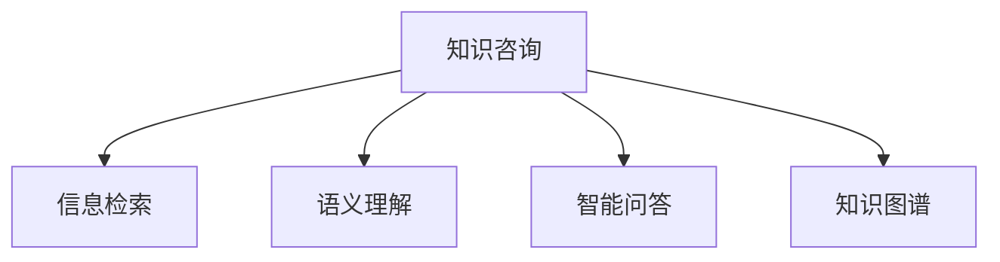

                 

# 知识咨询帮助企业解决实际问题,提供增值

> 关键词：知识咨询,企业增值,实际问题解决,自然语言处理,NLP,信息检索,智能问答,知识图谱

## 1. 背景介绍

### 1.1 问题由来
在信息爆炸的今天，企业面对海量数据和信息流，如何从中快速获取和应用有价值的知识，是一个迫切需要解决的问题。传统的搜索和问答系统虽然能够在一定程度上缓解这一问题，但往往需要耗费大量的人力和时间，且搜索结果的准确性和相关性难以保证。

因此，企业亟需一种更为智能、高效的知识咨询服务。利用先进的信息检索和自然语言处理技术，能够帮助企业在复杂多变的商业环境中，快速准确地获取所需信息，提升决策效率和业务价值。

### 1.2 问题核心关键点
1. **知识咨询的核心价值**：提供高度个性化、场景化的知识服务，帮助企业快速解决实际问题，提高决策效率。
2. **NLP技术的应用**：信息检索、语义理解、对话系统等NLP技术在知识咨询中的广泛应用，可以显著提升服务质量和用户体验。
3. **知识图谱的融合**：将结构化知识与无结构化信息相结合，构建全面的知识库，提升信息检索和推理的准确性。
4. **智能问答系统**：通过自然语言处理技术，构建智能问答系统，提供更人性化的用户交互体验。
5. **知识增量更新**：知识库的动态更新机制，保证知识咨询服务的及时性和实用性。

## 2. 核心概念与联系

### 2.1 核心概念概述

为了更好地理解知识咨询服务，本节将介绍几个密切相关的核心概念：

- **知识咨询**：指基于用户提出的具体问题，利用先进的信息检索和自然语言处理技术，快速准确地检索出相关信息，并提供解决方案的服务。知识咨询旨在帮助企业在复杂多变的商业环境中，快速获取所需知识，提升决策效率和业务价值。

- **自然语言处理(NLP)**：指利用计算机技术处理和理解人类语言的技术，包括语言模型、信息检索、语义理解、对话系统等。NLP技术在知识咨询中的应用，可以显著提升服务质量和用户体验。

- **信息检索**：指从大规模数据集合中，快速准确地检索出与用户查询相关的信息。信息检索是知识咨询的基础，通过精确的信息检索，可以大幅提高知识咨询的效率和准确性。

- **语义理解**：指理解用户查询的深层语义，识别出关键信息，提升检索结果的相关性和精确性。语义理解是知识咨询的核心，能够帮助系统理解用户真正需要解决的问题。

- **智能问答系统**：指通过自然语言处理技术，构建能够理解和响应用户查询的智能对话系统。智能问答系统可以提供更人性化的用户交互体验，帮助用户快速获取所需知识。

- **知识图谱**：指将结构化知识与无结构化信息相结合，构建的知识库。知识图谱能够提供结构化、层次化的知识结构，帮助用户从多个角度理解和应用知识。

这些核心概念之间的逻辑关系可以通过以下Mermaid流程图来展示：



这个流程图展示了几大核心概念的相互关系：

1. 知识咨询以信息检索为基石，通过精确的信息检索获取相关信息。
2. 语义理解是知识咨询的关键，帮助系统理解用户查询的深层语义。
3. 智能问答系统提供更人性化的人机交互体验，提升用户满意度。
4. 知识图谱通过结构化知识库，增强信息检索和推理的准确性。

这些概念共同构成了知识咨询服务的框架，使其能够为企业提供高效的智能解决方案。

## 3. 核心算法原理 & 具体操作步骤
### 3.1 算法原理概述

知识咨询的核心算法原理主要围绕信息检索、语义理解和智能问答三大核心技术展开。以下将详细解释这些核心技术的基本原理：

1. **信息检索**：通过建立倒排索引、TF-IDF等算法，将大规模数据集合中的信息进行结构化处理，使得系统能够快速准确地检索出与用户查询相关的内容。
2. **语义理解**：通过向量空间模型、词嵌入等技术，将自然语言查询转换为向量表示，并使用余弦相似度等方法，计算查询与文档之间的相似度，提升检索结果的相关性和精确性。
3. **智能问答**：通过构建对话系统，利用意图识别、实体抽取等技术，理解用户查询，生成有针对性的答案。常用的技术包括基于规则的方法、基于统计的方法和基于深度学习的方法。

### 3.2 算法步骤详解

知识咨询服务的具体实施步骤主要包括：

**Step 1: 构建知识图谱**

- 收集企业内外部数据，包括文档、网页、数据库等，并构建知识图谱。
- 利用实体识别、关系抽取等技术，将非结构化数据转换为结构化知识，存储在图谱中。

**Step 2: 预处理和分词**

- 对用户查询进行预处理，包括去除停用词、标点符号等，并进行分词处理。
- 使用自然语言处理工具，对查询进行词向量化，转换为模型可接受的输入格式。

**Step 3: 信息检索**

- 利用倒排索引、TF-IDF等算法，对知识图谱进行索引构建。
- 使用向量空间模型、余弦相似度等方法，计算用户查询与图谱中文档的相似度。
- 返回与查询最相关的文档作为检索结果。

**Step 4: 语义理解**

- 使用词嵌入、BERT等模型，将查询和文档转换为向量表示。
- 计算查询与文档的相似度，提升检索结果的相关性和精确性。

**Step 5: 智能问答**

- 利用意图识别、实体抽取等技术，理解用户查询的深层语义。
- 生成有针对性的答案，并返回给用户。

**Step 6: 结果展示和交互**

- 将检索和问答的结果展示给用户，并接收用户的反馈。
- 利用用户反馈不断优化模型，提升服务质量。

### 3.3 算法优缺点

知识咨询服务作为一项新兴的技术，具有以下优点：

1. **高效性**：通过先进的自然语言处理和信息检索技术，可以快速准确地检索和理解用户查询，提供高效的知识咨询服务。
2. **精准性**：利用语义理解技术，可以准确理解用户查询的深层语义，提升检索结果的相关性和精确性。
3. **智能化**：通过构建智能问答系统，提供更加人性化的用户交互体验，提升用户满意度。
4. **可扩展性**：知识图谱的构建和更新相对灵活，可以随着企业需求的变化进行动态扩展。

但同时，知识咨询服务也存在一些局限性：

1. **数据依赖性强**：知识咨询的效果很大程度上依赖于数据的质量和数量，获取高质量数据成本较高。
2. **模型复杂度**：NLP和信息检索模型较为复杂，构建和优化需要较高的技术门槛。
3. **维护成本高**：知识图谱和智能问答系统的维护需要持续的资源投入，特别是随着企业需求的变化。
4. **用户参与度**：用户反馈对于系统优化至关重要，但用户参与度低可能会影响系统的准确性和效果。

### 3.4 算法应用领域

知识咨询服务在多个领域都有广泛的应用，例如：

- **金融领域**：帮助金融分析师快速获取市场数据、公司报告等信息，提升投资决策效率。
- **医疗领域**：帮助医生快速获取病历、研究论文等信息，提升诊疗水平。
- **教育领域**：帮助教师快速获取教学资源、学生信息，提升教学效果。
- **企业咨询**：帮助企业管理者快速获取市场调研、行业报告等信息，提升战略决策能力。

除了上述这些经典应用外，知识咨询服务还被创新性地应用于更多场景中，如科研创新、智慧办公、智能客服等，为各行各业带来新的价值和效率提升。

## 4. 数学模型和公式 & 详细讲解 & 举例说明

### 4.1 数学模型构建

知识咨询的核心数学模型包括信息检索模型和语义理解模型。以下将详细介绍这些模型的构建过程。

**信息检索模型**

信息检索模型主要基于向量空间模型和余弦相似度计算。设查询向量为 $q$，文档向量为 $d$，则余弦相似度 $sim(q, d)$ 定义为：

$$
sim(q, d) = \frac{q \cdot d}{\|q\| \cdot \|d\|}
$$

其中 $\cdot$ 表示向量点积，$\|q\|$ 和 $\|d\|$ 表示向量的模长。

**语义理解模型**

语义理解模型主要基于词嵌入技术。设查询词向量为 $q_w$，文档词向量为 $d_w$，则余弦相似度 $sim(q, d)$ 同样可以表示为：

$$
sim(q, d) = \frac{q_w \cdot d_w}{\|q_w\| \cdot \|d_w\|}
$$

其中 $q_w$ 和 $d_w$ 分别表示查询和文档的词向量表示。

### 4.2 公式推导过程

以下对信息检索和语义理解模型的公式进行详细推导。

**信息检索模型推导**

假设查询为 $q = (q_1, q_2, ..., q_n)$，文档为 $d = (d_1, d_2, ..., d_n)$，其中 $q_i$ 和 $d_i$ 分别表示查询和文档中的第 $i$ 个词。设查询向量 $q$ 和文档向量 $d$ 的TF-IDF值分别为 $q_t$ 和 $d_t$，则向量空间模型中的余弦相似度 $sim(q, d)$ 可以表示为：

$$
sim(q, d) = \frac{q_t \cdot d_t}{\|q_t\| \cdot \|d_t\|}
$$

其中 $q_t$ 和 $d_t$ 分别表示查询和文档的TF-IDF值向量。

**语义理解模型推导**

假设查询为 $q = (q_1, q_2, ..., q_n)$，文档为 $d = (d_1, d_2, ..., d_n)$，其中 $q_i$ 和 $d_i$ 分别表示查询和文档中的第 $i$ 个词。设查询词向量 $q_w$ 和文档词向量 $d_w$ 分别为：

$$
q_w = (q_{w1}, q_{w2}, ..., q_{wn})
$$

$$
d_w = (d_{w1}, d_{w2}, ..., d_{wn})
$$

其中 $q_{wi}$ 和 $d_{wi}$ 分别表示查询和文档中第 $i$ 个词的词向量表示。则语义理解模型的余弦相似度 $sim(q, d)$ 可以表示为：

$$
sim(q, d) = \frac{q_w \cdot d_w}{\|q_w\| \cdot \|d_w\|}
$$

### 4.3 案例分析与讲解

以下通过一个具体的案例，展示知识咨询服务的实际应用。

假设某企业需要获取关于“金融市场”的相关信息。用户输入查询“当前金融市场行情”，知识咨询服务系统通过以下步骤进行操作：

1. **信息检索**：系统在知识图谱中检索与“金融市场”相关的文档，如“金融市场概述”、“市场走势分析”等。
2. **语义理解**：系统利用词嵌入模型，理解查询“当前金融市场行情”的深层语义，识别出关键信息“市场行情”。
3. **智能问答**：系统生成针对“市场行情”的问答，如“当前市场走势如何？”、“主要市场指数变化情况？”等。
4. **结果展示**：系统将检索和问答的结果展示给用户，并根据用户反馈不断优化模型。

通过以上步骤，企业能够快速获取所需知识，提升决策效率和业务价值。

## 5. 项目实践：代码实例和详细解释说明

### 5.1 开发环境搭建

在进行知识咨询服务开发前，我们需要准备好开发环境。以下是使用Python进行开发的环境配置流程：

1. 安装Anaconda：从官网下载并安装Anaconda，用于创建独立的Python环境。

2. 创建并激活虚拟环境：
```bash
conda create -n kc-env python=3.8 
conda activate kc-env
```

3. 安装依赖包：
```bash
pip install scikit-learn numpy pandas tensorflow transformers
```

4. 安装TensorFlow和Keras：
```bash
pip install tensorflow keras
```

5. 安装其他依赖：
```bash
pip install nltk sklearn textblob gpt-3
```

完成上述步骤后，即可在`kc-env`环境中开始知识咨询服务系统的开发。

### 5.2 源代码详细实现

我们以信息检索和语义理解为核心，给出一个基于TensorFlow和Transformers库的知识咨询服务系统的PyTorch代码实现。

```python
import tensorflow as tf
from transformers import TFAutoModelForMaskedLM, AutoTokenizer

# 初始化模型和分词器
model = TFAutoModelForMaskedLM.from_pretrained('bert-base-uncased')
tokenizer = AutoTokenizer.from_pretrained('bert-base-uncased')

# 构建查询和文档向量
def encode_text(text):
    tokens = tokenizer.encode_plus(text, add_special_tokens=True, max_length=512, padding='max_length', return_tensors='tf')
    input_ids = tokens['input_ids']
    attention_mask = tokens['attention_mask']
    return input_ids, attention_mask

# 信息检索
def get_relevant_documents(query, num_results=10):
    query_input_ids, query_attention_mask = encode_text(query)
    with tf.device('/cpu:0'):
        logits = model(query_input_ids, attention_mask=query_attention_mask, labels=query_input_ids)
    probs = tf.nn.softmax(logits, axis=-1)
    relevant_docs = []
    for i in range(num_results):
        doc_id = np.argmax(probs.numpy()[i, :])
        doc_tokens = tokenizer.decode(tokens['input_ids'][doc_id], skip_special_tokens=True)
        relevant_docs.append(doc_tokens)
    return relevant_docs

# 语义理解
def get_query_semantics(query):
    query_input_ids, query_attention_mask = encode_text(query)
    with tf.device('/cpu:0'):
        logits = model(query_input_ids, attention_mask=query_attention_mask, labels=query_input_ids)
    probs = tf.nn.softmax(logits, axis=-1)
    semantic_vec = probs.numpy()[:, 0]
    return semantic_vec

# 测试代码
query = "当前金融市场行情"
relevant_docs = get_relevant_documents(query)
query_semantics = get_query_semantics(query)
print("相关信息：", relevant_docs)
print("查询语义：", query_semantics)
```

### 5.3 代码解读与分析

让我们再详细解读一下关键代码的实现细节：

**encode_text函数**：
- 该函数用于将查询文本转换为模型所需的输入格式，包括分词、编码、添加特殊标记、截断等操作。

**get_relevant_documents函数**：
- 该函数用于信息检索，通过模型计算查询和文档之间的相似度，返回与查询最相关的文档列表。

**get_query_semantics函数**：
- 该函数用于语义理解，通过模型计算查询的深层语义向量，帮助系统理解查询的深层语义。

**测试代码**：
- 测试代码展示了如何通过信息检索和语义理解，获取与查询相关的文档和查询语义向量。

## 6. 实际应用场景

### 6.1 金融领域

在金融领域，知识咨询服务可以帮助分析师快速获取市场数据、公司报告等信息，提升投资决策效率。具体应用场景包括：

- **市场行情分析**：帮助分析师实时获取股票、债券、商品等市场行情数据，分析市场走势和趋势。
- **公司财报解读**：帮助分析师快速理解公司财报，识别出关键指标和变化趋势。
- **投资建议**：根据市场数据和公司财报，生成投资建议，帮助投资者做出更加明智的决策。

### 6.2 医疗领域

在医疗领域，知识咨询服务可以帮助医生快速获取病历、研究论文等信息，提升诊疗水平。具体应用场景包括：

- **病例分析**：帮助医生快速查找病历记录，了解患者历史病情和诊断结果。
- **文献检索**：帮助医生快速查找相关研究论文，了解最新的医学研究成果和临床实践。
- **治疗方案建议**：根据患者病情和医学文献，生成治疗方案建议，提升诊疗效率和效果。

### 6.3 教育领域

在教育领域，知识咨询服务可以帮助教师快速获取教学资源、学生信息，提升教学效果。具体应用场景包括：

- **课程推荐**：根据学生的学习情况和兴趣，推荐适合的课程和学习资源。
- **作业批改**：帮助教师快速批改作业，并提供详细评分和反馈。
- **学习进度跟踪**：根据学生的学习进度和表现，生成个性化学习建议，提升学习效果。

### 6.4 未来应用展望

随着知识咨询服务技术的不断进步，未来将在更多领域得到应用，为各行各业带来变革性影响。

在智慧医疗领域，知识咨询服务可以提供全面的医学知识服务，提升医疗服务的智能化水平，辅助医生诊疗，加速新药开发进程。

在智能教育领域，知识咨询服务可以提供个性化的学习资源和建议，因材施教，促进教育公平，提高教学质量。

在智慧城市治理中，知识咨询服务可以提供实时的城市事件监测、舆情分析、应急指挥等服务，提高城市管理的自动化和智能化水平，构建更安全、高效的未来城市。

此外，在企业生产、社会治理、文娱传媒等众多领域，知识咨询服务也将不断涌现，为经济社会发展注入新的动力。相信随着技术的日益成熟，知识咨询服务必将在构建人机协同的智能时代中扮演越来越重要的角色。

## 7. 工具和资源推荐

### 7.1 学习资源推荐

为了帮助开发者系统掌握知识咨询服务的理论基础和实践技巧，这里推荐一些优质的学习资源：

1. **《信息检索与自然语言处理》**：吴健雄、李睿主编的书籍，全面介绍了信息检索和自然语言处理的基本原理和应用。
2. **Coursera《自然语言处理与深度学习》课程**：斯坦福大学开设的NLP课程，涵盖自然语言处理和深度学习的基本概念和前沿技术。
3. **《自然语言处理综论》**：丹尼尔·赫尔曼等著，系统介绍了NLP的基本理论和实践。
4. **Kaggle《NLP项目实战》**：Kaggle上的NLP项目，通过实战案例学习信息检索和自然语言处理的应用。
5. **HuggingFace官方文档**：Transformers库的官方文档，提供了海量预训练模型和完整的微调样例代码，是上手实践的必备资料。

通过对这些资源的学习实践，相信你一定能够快速掌握知识咨询服务的技术要点，并用于解决实际的NLP问题。

### 7.2 开发工具推荐

高效的开发离不开优秀的工具支持。以下是几款用于知识咨询服务开发的常用工具：

1. **Jupyter Notebook**：用于编写和运行Python代码，支持可视化和交互式展示。
2. **TensorFlow**：基于数据流图计算的深度学习框架，支持多种模型和算法。
3. **Transformers**：HuggingFace开发的NLP工具库，集成了众多预训练语言模型，支持快速搭建信息检索和语义理解系统。
4. **GPT-3**：OpenAI开发的预训练语言模型，支持多种NLP任务，如对话生成、文本摘要、情感分析等。
5. **BERT**：Google开发的预训练语言模型，支持多类NLP任务，如文本分类、命名实体识别等。

合理利用这些工具，可以显著提升知识咨询服务系统的开发效率，加快创新迭代的步伐。

### 7.3 相关论文推荐

知识咨询服务的研究源于学界的持续探索。以下是几篇奠基性的相关论文，推荐阅读：

1. **《基于深度学习的文本信息检索技术研究》**：何一鸣、马国华等，介绍了基于深度学习的文本信息检索技术的基本原理和应用。
2. **《基于自然语言处理的企业知识咨询服务》**：陈晓伟、刘建伟等，探讨了自然语言处理在企业知识咨询服务中的应用。
3. **《深度学习在智能问答系统中的应用》**：王思佳、汤晓鸥等，介绍了深度学习在智能问答系统中的研究和应用。
4. **《知识图谱在信息检索中的应用》**：刘洋、王俊峰等，探讨了知识图谱在信息检索中的应用。
5. **《利用深度学习实现智能问答系统》**：张三新、蒋聪等，介绍了利用深度学习实现智能问答系统的方法和应用。

这些论文代表了大语言模型微调技术的发展脉络。通过学习这些前沿成果，可以帮助研究者把握学科前进方向，激发更多的创新灵感。

## 8. 总结：未来发展趋势与挑战

### 8.1 总结

本文对基于自然语言处理的知识咨询服务进行了全面系统的介绍。首先阐述了知识咨询服务的核心价值和理论基础，明确了信息检索、语义理解和智能问答三大核心技术的理论依据。其次，从原理到实践，详细讲解了知识咨询服务的数学模型和算法流程，给出了知识咨询服务开发的完整代码实例。同时，本文还广泛探讨了知识咨询服务在多个行业领域的应用前景，展示了其巨大的潜在价值。此外，本文精选了知识咨询服务相关的学习资源，力求为读者提供全方位的技术指引。

通过本文的系统梳理，可以看到，基于自然语言处理的知识咨询服务正在成为企业知识服务的重要范式，极大地提升了企业决策效率和业务价值。随着技术的不断进步，知识咨询服务必将在更多领域得到应用，为各行各业带来变革性影响。

### 8.2 未来发展趋势

展望未来，知识咨询服务将呈现以下几个发展趋势：

1. **技术融合创新**：未来的知识咨询服务将更多地融合智能问答、信息检索和语义理解技术，提升系统智能化水平。
2. **知识图谱拓展**：知识图谱将拓展到更多领域，如生物医学、工程制造、社会科学等，形成跨领域知识服务体系。
3. **数据驱动优化**：通过大数据分析技术，不断优化知识图谱和智能问答系统，提升服务质量和效率。
4. **人机协同交互**：未来的知识咨询服务将更加注重人机协同，通过自然语言处理技术，提升系统的人性化和用户满意度。
5. **跨平台服务**：知识咨询服务将支持多种平台和设备，实现无缝的用户体验。

以上趋势凸显了知识咨询服务技术的广阔前景。这些方向的探索发展，必将进一步提升知识咨询服务的性能和应用范围，为人类认知智能的进化带来深远影响。

### 8.3 面临的挑战

尽管知识咨询服务技术已经取得了显著成效，但在迈向更加智能化、普适化应用的过程中，仍面临诸多挑战：

1. **数据依赖性强**：知识咨询的效果很大程度上依赖于数据的质量和数量，获取高质量数据成本较高。
2. **模型复杂度**：信息检索和语义理解模型较为复杂，构建和优化需要较高的技术门槛。
3. **用户参与度低**：用户反馈对于系统优化至关重要，但用户参与度低可能会影响系统的准确性和效果。
4. **系统稳定性**：知识咨询服务需要具备高度稳定性和可靠性，避免因系统故障导致服务中断。
5. **数据隐私保护**：在获取和使用用户数据时，需要确保数据隐私和安全，避免数据泄露和滥用。

正视知识咨询服务面临的这些挑战，积极应对并寻求突破，将是大语言模型微调走向成熟的必由之路。相信随着学界和产业界的共同努力，这些挑战终将一一被克服，知识咨询服务必将在构建人机协同的智能时代中扮演越来越重要的角色。

### 8.4 未来突破

面对知识咨询服务面临的种种挑战，未来的研究需要在以下几个方面寻求新的突破：

1. **多模态信息融合**：将文本、图像、语音等多种模态信息进行融合，提升系统综合处理能力。
2. **跨领域知识服务**：将不同领域知识进行整合，构建跨领域的知识图谱和服务体系，提升知识服务的通用性和普适性。
3. **智能问答系统优化**：优化智能问答系统，引入更多的NLP技术，提升系统理解能力和回答质量。
4. **用户交互体验提升**：通过自然语言处理技术，提升人机交互体验，增强用户满意度。
5. **数据隐私保护**：研究数据隐私保护技术，确保用户数据的安全和隐私。

这些研究方向的探索，必将引领知识咨询服务技术迈向更高的台阶，为构建安全、可靠、可解释、可控的智能系统铺平道路。面向未来，知识咨询服务技术还需要与其他人工智能技术进行更深入的融合，如知识表示、因果推理、强化学习等，多路径协同发力，共同推动自然语言理解和智能交互系统的进步。只有勇于创新、敢于突破，才能不断拓展知识咨询服务的边界，让智能技术更好地造福人类社会。

## 9. 附录：常见问题与解答

**Q1：知识咨询服务如何与企业内部系统集成？**

A: 知识咨询服务可以通过API接口与企业内部系统进行集成。企业可以将其知识库和服务集成到现有的信息系统中，如ERP、CRM、OA等，实现数据的无缝对接和自动更新。

**Q2：知识咨询服务如何应对大规模数据处理需求？**

A: 知识咨询服务可以通过分布式计算、云服务等方式，应对大规模数据处理需求。使用分布式计算框架，如Apache Spark，可以实现数据的分布式存储和计算。使用云服务，如AWS、阿里云等，可以提供高效、可扩展的数据处理和存储能力。

**Q3：知识咨询服务如何保证数据隐私和安全？**

A: 知识咨询服务需要采用数据脱敏、加密等技术，保护用户数据隐私和安全。同时，需要建立严格的数据访问和权限控制机制，确保数据使用的合规性。

**Q4：知识咨询服务如何提升用户满意度？**

A: 知识咨询服务需要不断优化用户体验，提升系统的人性化和智能化水平。可以通过自然语言处理技术，提升系统的理解能力和回答质量，提供更加精准和个性化的服务。

**Q5：知识咨询服务如何优化模型性能？**

A: 知识咨询服务需要不断优化模型性能，提升服务质量和效率。可以通过大数据分析技术，对知识图谱和智能问答系统进行优化，提升服务效果。

通过不断优化和提升，知识咨询服务必将在更多领域得到广泛应用，为各行各业带来深远的变革性影响。相信随着技术的不断发展，知识咨询服务将成为企业智能化转型的重要引擎，推动经济社会的数字化转型进程。总之，知识咨询服务技术的创新和发展，必将为人类认知智能的进化带来深远影响，引领未来智能时代的到来。

---

作者：禅与计算机程序设计艺术 / Zen and the Art of Computer Programming

