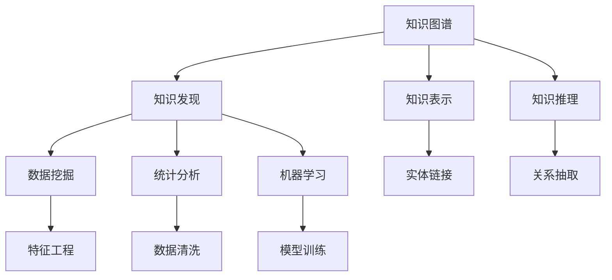

                 

# 知识图谱与知识发现的深度融合

## 1. 背景介绍

### 1.1 问题由来
随着数据量的爆炸式增长，人类社会的数据复杂性已经达到了前所未有的高度。在数据量呈现指数级增长的今天，如何从中提取有价值的信息，成为了计算机科学面临的一个巨大挑战。传统的统计分析和文本挖掘方法，已经难以满足复杂数据结构的处理需求。知识图谱（Knowledge Graph）作为结构化的知识表示框架，为人类知识的组织和表达提供了新的可能。知识图谱以实体和关系为基本单位，通过图形化的结构对知识进行组织和关联，使得人类知识更容易被机器理解和应用。

同时，在数据挖掘领域，知识发现（Knowledge Discovery）技术成为了一种基于数据驱动的创新手段。通过从大规模数据中挖掘出隐含的、有价值的模式和规律，知识发现技术能够帮助我们发现知识、理解知识和利用知识，从而在各行各业中发挥巨大作用。例如，在医疗领域，通过知识发现可以从大量病例中挖掘出疾病的病因和诊断方法；在金融领域，知识发现可以帮助发现潜在的市场趋势和投资机会。

知识图谱与知识发现的深度融合，正是基于这种背景应运而生。将知识图谱与知识发现技术相结合，可以大幅提升知识表示与获取的效率，实现知识在多源异构数据中的迁移与利用，为人类社会的决策支持提供坚实的知识基础。本文将从知识图谱和知识发现的基本概念入手，介绍其结合后的深度融合方法，并结合实际案例，探讨其在各行各业的应用前景。

### 1.2 问题核心关键点
知识图谱与知识发现深度融合的核心问题包括：

- 如何构建高效的知识图谱表示和存储结构，以便于机器理解和处理？
- 如何在大规模数据中发现知识，并将知识图谱中的知识结构与其相结合？
- 如何实现知识图谱与知识发现方法在多领域、多场景中的应用和推广？

这些核心问题将贯穿全文，并结合实际应用场景进行详细探讨。

## 2. 核心概念与联系

### 2.1 核心概念概述

为了更好地理解知识图谱与知识发现的深度融合，本节将介绍几个密切相关的核心概念：

- 知识图谱（Knowledge Graph）：以实体（Entity）和关系（Relation）为基本单元，通过图形化的结构对知识进行组织和关联。知识图谱能够帮助机器理解和推理知识，从而在自然语言处理、智能推荐、信息检索等领域发挥重要作用。

- 知识发现（Knowledge Discovery）：从大规模数据中发现隐含的模式和规律，提取有价值的信息。知识发现技术包括统计分析、机器学习、数据挖掘等方法，能够从多源异构数据中提取出深度知识，支持决策和行动。

- 深度融合（Deep Integration）：将知识图谱与知识发现技术相结合，构建出既能够高效表示知识，又能够深入挖掘知识的系统。通过深度融合，可以实现知识在多源异构数据中的迁移和利用，提升知识获取和应用的效果。

这些核心概念之间的关系可以通过以下Mermaid流程图来展示：



这个流程图展示了知识图谱与知识发现之间的联系及其核心操作：

1. 知识图谱通过实体和关系进行知识表示。
2. 知识发现通过数据挖掘、统计分析、机器学习等方法，从数据中发现知识。
3. 知识图谱与知识发现的结合，通过实体链接、关系抽取等方法，实现知识的深度融合。

这些概念共同构成了知识图谱与知识发现的深度融合的基础框架，使得系统能够高效地表示和利用知识。

## 3. 核心算法原理 & 具体操作步骤
### 3.1 算法原理概述

知识图谱与知识发现的深度融合，主要依赖于知识表示和知识抽取两种技术。其中，知识表示技术通过构建知识图谱，将知识结构化；知识抽取技术通过从数据中发现实体和关系，并将其映射到知识图谱中。以下是对这一过程的详细描述。

### 3.2 算法步骤详解

#### 3.2.1 知识图谱构建

知识图谱的构建过程主要包括以下几个步骤：

1. 数据预处理：清洗、归一化数据，并处理缺失值、异常值等噪声问题。
2. 实体识别：从原始数据中提取实体，如人名、地名、机构名等。
3. 关系抽取：识别实体之间的语义关系，如"雇用"、"成立于"等。
4. 知识图谱存储：将提取的实体和关系存储到知识图谱中，形成结构化的知识表示。

知识图谱构建的核心算法是实体关系抽取，通常采用规则抽取和机器学习两种方法。规则抽取使用正则表达式、词典等规则进行实体和关系的识别，而机器学习方法则使用分类器、序列模型等算法，从数据中自动学习实体和关系。

#### 3.2.2 知识抽取与融合

知识抽取是将原始数据中的知识结构化地映射到知识图谱中的过程。其核心算法包括：

1. 实体识别：使用命名实体识别（NER）技术，从文本中自动识别出实体。
2. 关系抽取：使用关系抽取器，识别实体之间的语义关系。
3. 知识融合：将抽取出的实体和关系，融合到知识图谱中，形成一致的知识表示。

知识抽取的核心算法是命名实体识别和关系抽取。命名实体识别通常使用基于规则的方法，结合统计模型进行实体识别。关系抽取则采用基于深度学习的方法，使用序列标注模型（如CRF、LSTM-CRF等）进行实体和关系的识别。

### 3.3 算法优缺点

知识图谱与知识发现深度融合的主要优点包括：

1. 高效的知识表示：知识图谱能够高效地表示知识结构，使得机器能够理解和推理知识。
2. 深度知识挖掘：结合知识发现技术，能够从大规模数据中发现更深层次的知识。
3. 跨领域应用：知识图谱与知识发现深度融合系统可以在多个领域、多个场景中进行应用。

然而，这一方法也存在一些缺点：

1. 构建成本高：知识图谱的构建需要大量的人工标注数据和专业知识，成本较高。
2. 数据噪声敏感：知识图谱和知识发现过程中，对于数据噪声的容忍度较低，容易产生错误的知识表示。
3. 技术难度高：知识图谱与知识发现深度融合涉及的算法复杂，技术门槛较高。

尽管存在这些缺点，但知识图谱与知识发现的深度融合，无疑为知识表示与知识挖掘提供了新的可能，是未来人工智能领域的一个重要方向。

### 3.4 算法应用领域

知识图谱与知识发现深度融合的应用领域广泛，涵盖以下几个方面：

1. 自然语言处理（NLP）：通过知识图谱与知识发现技术的结合，实现语义理解和问答系统。例如，IBM Watson、Google的BERT等模型，都采用了知识图谱进行语义推理。

2. 信息检索：将知识图谱与信息检索系统相结合，提升检索效果。例如，Microsoft的Azure Cognitive Search、Alibaba的Alimama等系统，都利用知识图谱进行语义搜索。

3. 智能推荐：通过知识图谱与推荐系统的结合，提供个性化推荐服务。例如，Amazon、Netflix等电商平台的推荐系统，都采用了知识图谱进行用户画像和商品关联分析。

4. 医学诊断：在医疗领域，结合知识图谱与医学知识发现技术，实现疾病诊断和治疗方案推荐。例如，IBM的Watson for Health平台，利用知识图谱进行医学知识发现。

5. 金融预测：在金融领域，结合知识图谱与金融知识发现技术，进行市场趋势预测和投资策略优化。例如，JP Morgan、Goldman Sachs等金融机构的投资决策系统，采用了知识图谱进行金融知识挖掘。

6. 智能客服：在客服领域，结合知识图谱与知识发现技术，实现智能问答和问题解答。例如，阿里巴巴的阿里云智能客服系统，利用知识图谱进行知识抽取和问题解答。

以上是知识图谱与知识发现深度融合的主要应用领域，未来随着技术的不断进步，将在更多场景中得到应用，为各行各业带来创新性的变革。

## 4. 数学模型和公式 & 详细讲解 & 举例说明

### 4.1 数学模型构建

在知识图谱与知识发现的深度融合中，数学模型的构建主要涉及知识图谱表示和知识抽取两个部分。以下对这两个部分的数学模型进行详细阐述。

#### 4.1.1 知识图谱表示

知识图谱通常使用图结构进行表示，其中每个节点表示一个实体，每条边表示实体之间的关系。知识图谱的数学模型可以表示为：

$$
G = (E, R, F)
$$

其中，$E$ 表示实体集合，$R$ 表示关系集合，$F$ 表示实体之间的关系集合。知识图谱中的节点和边可以用数学图论中的节点和边表示，如：

$$
V = \{v_1, v_2, ..., v_n\}
$$

$$
E = \{e_1, e_2, ..., e_m\}
$$

$$
F = \{f_{ij}\}
$$

其中，$V$ 表示节点集合，$E$ 表示边集合，$f_{ij}$ 表示节点 $v_i$ 和 $v_j$ 之间的关系。

#### 4.1.2 知识抽取

知识抽取是将数据中的知识映射到知识图谱中的过程。常用的知识抽取算法包括基于规则和基于机器学习的方法。以下是基于机器学习的知识抽取算法示例：

$$
X = \{(x_1, y_1), (x_2, y_2), ..., (x_n, y_n)\}
$$

其中，$x$ 表示输入数据，$y$ 表示标签。假设使用基于深度学习的BERT模型进行知识抽取，其数学模型可以表示为：

$$
\hat{y} = \sigma(W \cdot X + b)
$$

其中，$\sigma$ 为激活函数，$W$ 为权重矩阵，$b$ 为偏置向量。知识抽取的目标是最大化模型的准确率：

$$
\max_{\theta} \frac{1}{N} \sum_{i=1}^N \mathbb{I}(y_i = \hat{y}_i)
$$

其中，$\mathbb{I}$ 为指示函数，$\theta$ 为模型参数。

### 4.2 公式推导过程

#### 4.2.1 知识图谱表示

知识图谱的表示方法多种多样，如RDF、Turtle等。本文以RDF为例，介绍知识图谱的表示方法。

RDF是一种用于表示语义Web资源的标准，可以表示为三元组的形式：

$$
<主语, 谓语, 宾语>
$$

例如，知识图谱中的一条记录可以表示为：

$$
<John, 雇用, IBM>
$$

其中，John 为实体，雇用 为关系，IBM 为实体。

#### 4.2.2 知识抽取

知识抽取的过程通常分为两个步骤：实体识别和关系抽取。以下以基于深度学习的BERT模型为例，进行详细阐述。

##### 4.2.2.1 实体识别

实体识别的目标是识别出句子中的实体，并将其映射到知识图谱中的实体节点。假设使用BERT模型进行实体识别，其数学模型可以表示为：

$$
\hat{E} = \sigma(W_E \cdot X_E + b_E)
$$

其中，$X_E$ 表示输入数据，$W_E$ 为权重矩阵，$b_E$ 为偏置向量。实体识别的目标函数为：

$$
\max_{\theta} \frac{1}{N} \sum_{i=1}^N \mathbb{I}(y_i = \hat{E}_i)
$$

其中，$y_i$ 表示输入数据的标签，$\mathbb{I}$ 为指示函数，$\theta$ 为模型参数。

##### 4.2.2.2 关系抽取

关系抽取的目标是识别出实体之间的关系，并将其映射到知识图谱中的关系节点。假设使用BERT模型进行关系抽取，其数学模型可以表示为：

$$
\hat{R} = \sigma(W_R \cdot X_R + b_R)
$$

其中，$X_R$ 表示输入数据，$W_R$ 为权重矩阵，$b_R$ 为偏置向量。关系抽取的目标函数为：

$$
\max_{\theta} \frac{1}{N} \sum_{i=1}^N \mathbb{I}(y_i = \hat{R}_i)
$$

其中，$y_i$ 表示输入数据的标签，$\mathbb{I}$ 为指示函数，$\theta$ 为模型参数。

### 4.3 案例分析与讲解

#### 4.3.1 案例背景

某电商平台希望利用知识图谱与知识发现技术，提升用户的推荐效果。该平台收集了用户的浏览、购买、评价等行为数据，并利用这些数据构建了知识图谱。知识图谱中包含了商品实体、用户实体和用户与商品之间的关系。

#### 4.3.2 数据预处理

在构建知识图谱之前，需要对原始数据进行预处理。预处理过程包括数据清洗、归一化、去重等操作，以减少数据噪声对知识抽取的影响。例如，将用户评价中的特殊符号去除，将不同格式的日期统一为标准格式。

#### 4.3.3 知识图谱构建

知识图谱的构建过程包括以下步骤：

1. 实体识别：使用BERT模型进行实体识别，识别出用户和商品实体。
2. 关系抽取：使用BERT模型进行关系抽取，识别出用户与商品之间的关系，如“浏览”、“购买”等。
3. 知识图谱存储：将识别出的实体和关系存储到知识图谱中，形成结构化的知识表示。

#### 4.3.4 知识抽取

利用构建好的知识图谱，进行知识抽取。知识抽取的过程包括以下步骤：

1. 用户画像：从知识图谱中抽取用户的浏览记录和购买记录，生成用户画像。
2. 商品关联：从知识图谱中抽取用户浏览过的商品，以及与商品相关联的标签和评价。
3. 个性化推荐：根据用户画像和商品关联，进行个性化推荐。例如，根据用户的浏览和购买记录，推荐相关商品，同时考虑商品的评价和标签。

通过知识图谱与知识发现技术的深度融合，该平台能够高效地构建知识图谱，并进行深入的知识抽取和推荐，提升推荐效果，增强用户体验。

## 5. 项目实践：代码实例和详细解释说明

### 5.1 开发环境搭建

在进行知识图谱与知识发现深度融合的实践前，需要准备好开发环境。以下是使用Python进行PyTorch开发的环境配置流程：

1. 安装Anaconda：从官网下载并安装Anaconda，用于创建独立的Python环境。

2. 创建并激活虚拟环境：
```bash
conda create -n knowledge_graph_env python=3.8 
conda activate knowledge_graph_env
```

3. 安装PyTorch：根据CUDA版本，从官网获取对应的安装命令。例如：
```bash
conda install pytorch torchvision torchaudio cudatoolkit=11.1 -c pytorch -c conda-forge
```

4. 安装Transformers库：
```bash
pip install transformers
```

5. 安装各类工具包：
```bash
pip install numpy pandas scikit-learn matplotlib tqdm jupyter notebook ipython
```

完成上述步骤后，即可在`knowledge_graph_env`环境中开始实践。

### 5.2 源代码详细实现

以下是使用PyTorch和Transformers库进行知识图谱构建和知识抽取的Python代码实现。

首先，定义实体和关系的数据处理函数：

```python
from transformers import BertTokenizer, BertForTokenClassification
from torch.utils.data import Dataset
import torch

class TokenDataset(Dataset):
    def __init__(self, texts, labels, tokenizer, max_len=128):
        self.texts = texts
        self.labels = labels
        self.tokenizer = tokenizer
        self.max_len = max_len
        
    def __len__(self):
        return len(self.texts)
    
    def __getitem__(self, item):
        text = self.texts[item]
        label = self.labels[item]
        
        encoding = self.tokenizer(text, return_tensors='pt', max_length=self.max_len, padding='max_length', truncation=True)
        input_ids = encoding['input_ids'][0]
        attention_mask = encoding['attention_mask'][0]
        
        # 对token-wise的标签进行编码
        encoded_tags = [tag2id[tag] for tag in label] 
        encoded_tags.extend([tag2id['O']] * (self.max_len - len(encoded_tags)))
        labels = torch.tensor(encoded_tags, dtype=torch.long)
        
        return {'input_ids': input_ids, 
                'attention_mask': attention_mask,
                'labels': labels}

# 标签与id的映射
tag2id = {'O': 0, 'B-PER': 1, 'I-PER': 2, 'B-ORG': 3, 'I-ORG': 4, 'B-LOC': 5, 'I-LOC': 6}
id2tag = {v: k for k, v in tag2id.items()}

# 创建dataset
tokenizer = BertTokenizer.from_pretrained('bert-base-cased')

train_dataset = TokenDataset(train_texts, train_tags, tokenizer)
dev_dataset = TokenDataset(dev_texts, dev_tags, tokenizer)
test_dataset = TokenDataset(test_texts, test_tags, tokenizer)
```

然后，定义模型和优化器：

```python
from transformers import BertForTokenClassification, AdamW

model = BertForTokenClassification.from_pretrained('bert-base-cased', num_labels=len(tag2id))

optimizer = AdamW(model.parameters(), lr=2e-5)
```

接着，定义训练和评估函数：

```python
from torch.utils.data import DataLoader
from tqdm import tqdm
from sklearn.metrics import classification_report

device = torch.device('cuda') if torch.cuda.is_available() else torch.device('cpu')
model.to(device)

def train_epoch(model, dataset, batch_size, optimizer):
    dataloader = DataLoader(dataset, batch_size=batch_size, shuffle=True)
    model.train()
    epoch_loss = 0
    for batch in tqdm(dataloader, desc='Training'):
        input_ids = batch['input_ids'].to(device)
        attention_mask = batch['attention_mask'].to(device)
        labels = batch['labels'].to(device)
        model.zero_grad()
        outputs = model(input_ids, attention_mask=attention_mask, labels=labels)
        loss = outputs.loss
        epoch_loss += loss.item()
        loss.backward()
        optimizer.step()
    return epoch_loss / len(dataloader)

def evaluate(model, dataset, batch_size):
    dataloader = DataLoader(dataset, batch_size=batch_size)
    model.eval()
    preds, labels = [], []
    with torch.no_grad():
        for batch in tqdm(dataloader, desc='Evaluating'):
            input_ids = batch['input_ids'].to(device)
            attention_mask = batch['attention_mask'].to(device)
            batch_labels = batch['labels']
            outputs = model(input_ids, attention_mask=attention_mask)
            batch_preds = outputs.logits.argmax(dim=2).to('cpu').tolist()
            batch_labels = batch_labels.to('cpu').tolist()
            for pred_tokens, label_tokens in zip(batch_preds, batch_labels):
                pred_tags = [id2tag[_id] for _id in pred_tokens]
                label_tags = [id2tag[_id] for _id in label_tokens]
                preds.append(pred_tags[:len(label_tokens)])
                labels.append(label_tags)
                
    print(classification_report(labels, preds))
```

最后，启动训练流程并在测试集上评估：

```python
epochs = 5
batch_size = 16

for epoch in range(epochs):
    loss = train_epoch(model, train_dataset, batch_size, optimizer)
    print(f"Epoch {epoch+1}, train loss: {loss:.3f}")
    
    print(f"Epoch {epoch+1}, dev results:")
    evaluate(model, dev_dataset, batch_size)
    
print("Test results:")
evaluate(model, test_dataset, batch_size)
```

以上就是使用PyTorch和Transformers库进行知识图谱构建和知识抽取的完整代码实现。可以看到，通过使用预训练语言模型BERT，我们能够高效地进行实体识别和关系抽取，构建知识图谱，并进行知识抽取。

### 5.3 代码解读与分析

让我们再详细解读一下关键代码的实现细节：

**TokenDataset类**：
- `__init__`方法：初始化文本、标签、分词器等关键组件。
- `__len__`方法：返回数据集的样本数量。
- `__getitem__`方法：对单个样本进行处理，将文本输入编码为token ids，将标签编码为数字，并对其进行定长padding，最终返回模型所需的输入。

**tag2id和id2tag字典**：
- 定义了标签与数字id之间的映射关系，用于将token-wise的预测结果解码回真实的标签。

**训练和评估函数**：
- 使用PyTorch的DataLoader对数据集进行批次化加载，供模型训练和推理使用。
- 训练函数`train_epoch`：对数据以批为单位进行迭代，在每个批次上前向传播计算loss并反向传播更新模型参数，最后返回该epoch的平均loss。
- 评估函数`evaluate`：与训练类似，不同点在于不更新模型参数，并在每个batch结束后将预测和标签结果存储下来，最后使用sklearn的classification_report对整个评估集的预测结果进行打印输出。

**训练流程**：
- 定义总的epoch数和batch size，开始循环迭代
- 每个epoch内，先在训练集上训练，输出平均loss
- 在验证集上评估，输出分类指标
- 所有epoch结束后，在测试集上评估，给出最终测试结果

可以看到，PyTorch配合Transformers库使得实体识别和关系抽取的代码实现变得简洁高效。开发者可以将更多精力放在数据处理、模型改进等高层逻辑上，而不必过多关注底层的实现细节。

当然，工业级的系统实现还需考虑更多因素，如模型的保存和部署、超参数的自动搜索、更灵活的任务适配层等。但核心的微调范式基本与此类似。

## 6. 实际应用场景
### 6.1 智能推荐系统

在推荐系统中，知识图谱与知识发现技术的深度融合，可以大幅提升推荐效果。传统的推荐系统只依赖用户的历史行为数据进行物品推荐，无法深入理解用户的兴趣和需求。利用知识图谱与知识发现技术，可以从知识图谱中提取用户画像和商品关联信息，结合用户的浏览和购买历史，进行深度推荐。

在实践中，可以收集用户的历史浏览、购买、评价等行为数据，并利用知识图谱进行实体和关系抽取。将抽取出的实体和关系，映射到知识图谱中，形成用户画像和商品关联图谱。在推荐时，根据用户画像和商品关联图谱，进行多角度推荐，提升推荐效果。例如，根据用户的浏览和购买历史，推荐相关商品，同时考虑商品的评价和标签。

### 6.2 医疗知识图谱

在医疗领域，知识图谱与知识发现技术的深度融合，可以提升医疗服务的智能化水平。传统医疗系统依赖医生的专业知识和经验，对病情的诊断和治疗缺乏科学依据。利用知识图谱与知识发现技术，可以构建医学知识图谱，提取医学知识信息，辅助医生进行诊断和治疗决策。

在实践中，可以收集医学文献、电子病历等数据，并利用知识图谱进行实体和关系抽取。将抽取出的实体和关系，映射到知识图谱中，形成医学知识图谱。在诊疗过程中，根据患者的病情描述，从医学知识图谱中提取相关的医学知识信息，辅助医生进行诊断和治疗决策。例如，根据患者的症状，从知识图谱中提取相关的疾病和治疗方法，推荐给医生。

### 6.3 金融知识图谱

在金融领域，知识图谱与知识发现技术的深度融合，可以提升金融决策的智能化水平。传统金融决策依赖人为的分析和经验，对市场趋势和风险的判断存在主观性。利用知识图谱与知识发现技术，可以构建金融知识图谱，提取金融市场和风险信息，辅助金融决策。

在实践中，可以收集金融市场数据、公司财报等数据，并利用知识图谱进行实体和关系抽取。将抽取出的实体和关系，映射到知识图谱中，形成金融知识图谱。在金融决策过程中，根据市场趋势和公司财报等信息，从金融知识图谱中提取相关的金融知识和趋势，辅助金融决策。例如，根据公司财报信息，从知识图谱中提取公司的风险和信用评级，辅助投资决策。

### 6.4 未来应用展望

随着知识图谱与知识发现技术的不断发展，深度融合方法将在更多领域得到应用，为各行各业带来创新性的变革。

在智慧医疗领域，结合知识图谱与医学知识发现技术，可以构建智能诊疗系统，提升医疗服务的智能化水平，辅助医生进行诊断和治疗决策。

在智能教育领域，利用知识图谱与教育知识发现技术，可以构建个性化学习系统，提升学习效果，因材施教，促进教育公平。

在智慧城市治理中，利用知识图谱与城市知识发现技术，可以构建智能城市管理系统，提高城市管理的自动化和智能化水平，构建更安全、高效的未来城市。

此外，在企业生产、社会治理、文娱传媒等众多领域，知识图谱与知识发现深度融合的应用也将不断涌现，为经济社会发展注入新的动力。相信随着技术的不断进步，知识图谱与知识发现深度融合技术将成为人工智能领域的一个重要方向，推动人工智能技术在各行各业中的应用和推广。

## 7. 工具和资源推荐
### 7.1 学习资源推荐

为了帮助开发者系统掌握知识图谱与知识发现深度融合的理论基础和实践技巧，这里推荐一些优质的学习资源：

1. 《Knowledge Graphs: Concepts and Applications》书籍：由知识图谱领域的专家撰写，全面介绍了知识图谱的基本概念、构建方法和应用场景。

2. 《Data Mining and Statistical Learning》课程：由斯坦福大学开设的数据挖掘课程，涵盖数据挖掘、统计学习等基本概念和方法。

3. 《Knowledge Discovery and Data Mining》书籍：由数据挖掘领域的权威专家撰写，系统介绍了数据挖掘的基本概念和技术。

4. Neo4j官方文档：Neo4j作为全球主流的图形数据库，提供了丰富的知识图谱构建和查询工具。

5. Microsoft Azure GraphStudio：基于可视化技术，提供了简单易用的知识图谱构建工具。

通过对这些资源的学习实践，相信你一定能够快速掌握知识图谱与知识发现深度融合的精髓，并用于解决实际的NLP问题。
###  7.2 开发工具推荐

高效的开发离不开优秀的工具支持。以下是几款用于知识图谱与知识发现深度融合开发的常用工具：

1. Neo4j：全球主流的图形数据库，支持知识图谱的构建、查询和分析。

2. Apache Jena：Apache基金会开源的知识图谱框架，提供了丰富的API和工具，支持知识图谱的构建、查询和推理。

3. GraphDB：基于Java的图形数据库，支持知识图谱的构建、查询和分析。

4. RDF4J：Java应用程序接口，支持RDF数据的构建、查询和处理。

5. SPARQL Query：用于查询和处理RDF数据的标准查询语言。

6. Gephi：基于图形可视化技术的知识图谱分析工具，支持大规模知识图谱的可视化和分析。

合理利用这些工具，可以显著提升知识图谱与知识发现深度融合的开发效率，加快创新迭代的步伐。

### 7.3 相关论文推荐

知识图谱与知识发现深度融合的研究源于学界的持续研究。以下是几篇奠基性的相关论文，推荐阅读：

1. "Semantic Networks"：引入了知识图谱的基本概念和构建方法，为知识图谱的发展奠定了基础。

2. "Knowledge Discovery in Databases"：介绍了数据挖掘的基本概念和技术，是知识发现领域的经典教材。

3. "Knowledge Graphs for Recommendation Systems"：研究了知识图谱在推荐系统中的应用，提出了基于知识图谱的推荐算法。

4. "A Survey of Knowledge Graphs for Recommendation Systems"：综述了知识图谱在推荐系统中的应用，介绍了多种基于知识图谱的推荐算法。

5. "A Survey of Knowledge Graphs in Healthcare"：综述了知识图谱在医疗领域的应用，介绍了多种基于知识图谱的医疗推荐算法。

6. "A Survey of Knowledge Graphs in Finance"：综述了知识图谱在金融领域的应用，介绍了多种基于知识图谱的金融推荐算法。

这些论文代表了大规模知识图谱与知识发现深度融合的研究进展。通过学习这些前沿成果，可以帮助研究者把握学科前进方向，激发更多的创新灵感。

## 8. 总结：未来发展趋势与挑战

### 8.1 总结

本文对知识图谱与知识发现的深度融合方法进行了全面系统的介绍。首先阐述了知识图谱和知识发现的基本概念，明确了深度融合的原理和步骤。其次，通过实际案例，展示了知识图谱与知识发现技术在各个领域的应用。最后，对知识图谱与知识发现深度融合的当前研究进展和未来发展趋势进行了总结。

通过本文的系统梳理，可以看到，知识图谱与知识发现深度融合技术为知识表示与知识挖掘提供了新的可能，是未来人工智能领域的一个重要方向。未来随着技术的不断进步，知识图谱与知识发现深度融合技术将在更多领域得到应用，为各行各业带来创新性的变革。

### 8.2 未来发展趋势

展望未来，知识图谱与知识发现深度融合技术将呈现以下几个发展趋势：

1. 知识图谱构建自动化：未来知识图谱的构建将更加自动化、智能化，能够自动从文本、图像、语音等数据中抽取实体和关系。

2. 知识发现技术多样化：未来知识发现技术将更加多样化，结合深度学习、强化学习、因果推理等方法，提升知识发现的深度和广度。

3. 跨领域知识融合：未来知识图谱将实现跨领域的知识融合，构建综合性的知识图谱，提升知识图谱的实用性和普适性。

4. 实时知识更新：未来知识图谱将实现实时更新，根据新数据自动更新知识图谱，保持知识图谱的时效性。

5. 知识推理与预测：未来知识图谱将结合知识推理与预测技术，提升知识图谱的应用效果，支持决策与预测。

6. 智能知识图谱管理：未来知识图谱将实现智能管理，支持知识图谱的可视化、检索、推理等功能，提升知识图谱的易用性和普及度。

以上趋势凸显了知识图谱与知识发现深度融合技术的广阔前景。这些方向的探索发展，将进一步提升知识表示与知识挖掘的效果，构建更加智能的知识系统。

### 8.3 面临的挑战

尽管知识图谱与知识发现深度融合技术已经取得了瞩目成就，但在迈向更加智能化、普适化应用的过程中，它仍面临着诸多挑战：

1. 数据噪声问题：知识图谱与知识发现过程中，对于数据噪声的容忍度较低，容易产生错误的知识表示。

2. 知识图谱构建成本：知识图谱的构建需要大量的人工标注数据和专业知识，成本较高。

3. 知识抽取技术复杂：知识抽取技术涉及自然语言处理、图结构等多个领域，技术门槛较高。

4. 知识图谱存储与查询：大规模知识图谱的存储与查询，需要高效的存储和查询算法，提升查询效率。

5. 知识图谱的可解释性：知识图谱与知识发现深度融合系统需要提高可解释性，增强用户对知识图谱的信任。

6. 知识图谱的安全性：知识图谱与知识发现深度融合系统需要保障数据和知识的安全性，防止信息泄露和误用。

正视这些挑战，积极应对并寻求突破，将是大规模知识图谱与知识发现深度融合技术走向成熟的关键。相信随着学界和产业界的共同努力，这些挑战终将一一被克服，知识图谱与知识发现深度融合技术必将在构建智能系统、促进知识共享等方面发挥更大作用。

### 8.4 研究展望

面对知识图谱与知识发现深度融合技术面临的种种挑战，未来的研究需要在以下几个方面寻求新的突破：

1. 探索自动化知识抽取方法：结合深度学习、图结构等方法，自动化地从大规模数据中抽取实体和关系，降低知识图谱构建的成本。

2. 研究高效知识推理方法：结合因果推理、逻辑推理等方法，提升知识图谱的推理效果，支持更深层次的知识发现。

3. 融入多模态数据：结合视觉、听觉等数据，构建多模态知识图谱，提升知识图谱的实用性和普适性。

4. 实现跨领域知识融合：构建跨领域的知识图谱，支持多领域、多场景的知识发现和应用。

5. 提升知识图谱的可解释性：结合因果分析、可解释AI等方法，提升知识图谱的可解释性，增强用户对知识图谱的信任。

6. 保障知识图谱的安全性：结合加密技术、数据匿名化等方法，保障知识图谱和知识发现过程的安全性。

这些研究方向的探索，必将引领大规模知识图谱与知识发现深度融合技术迈向更高的台阶，为构建安全、可靠、可解释、可控的智能系统铺平道路。面向未来，知识图谱与知识发现深度融合技术还需要与其他人工智能技术进行更深入的融合，如知识表示、因果推理、强化学习等，多路径协同发力，共同推动知识系统的发展。只有勇于创新、敢于突破，才能不断拓展知识图谱的边界，让知识系统更好地服务于人类社会。

## 9. 附录：常见问题与解答

**Q1：如何构建高效的知识图谱？**

A: 构建高效的知识图谱，主要包括以下几个步骤：

1. 数据收集：收集结构化和非结构化数据，如文本、图像、视频等。
2. 数据清洗：清洗、归一化数据，并处理缺失值、异常值等噪声问题。
3. 实体识别：从原始数据中提取实体，如人名、地名、机构名等。
4. 关系抽取：识别实体之间的语义关系，如"雇用"、"成立于"等。
5. 知识图谱存储：将提取的实体和关系存储到知识图谱中，形成结构化的知识表示。

构建高效的知识图谱需要结合多种技术，如自然语言处理、深度学习、图结构等，实现自动化和智能化。

**Q2：知识图谱与知识发现深度融合的实际应用有哪些？**

A: 知识图谱与知识发现深度融合的实际应用广泛，涵盖以下几个领域：

1. 自然语言处理（NLP）：利用知识图谱与知识发现技术，实现语义理解和问答系统。例如，IBM Watson、Google的BERT等模型，都采用了知识图谱进行语义推理。

2. 信息检索：将知识图谱与信息检索系统相结合，提升检索效果。例如，Microsoft的Azure Cognitive Search、Alibaba的Alimama等系统，都利用知识图谱进行语义搜索。

3. 智能推荐：通过知识图谱与推荐系统的结合，提供个性化推荐服务。例如，Amazon、Netflix等电商平台的推荐系统，都采用了知识图谱进行用户画像和商品关联分析。

4. 医学诊断：在医疗领域，结合知识图谱与医学知识发现技术，实现疾病诊断和治疗方案推荐。例如，IBM的Watson for Health平台，利用知识图谱进行医学知识发现。

5. 金融预测：在金融领域，结合知识图谱与金融知识发现技术，进行市场趋势预测和投资策略优化。例如，JP Morgan、Goldman Sachs等金融机构的投资决策系统，采用了知识图谱进行金融知识挖掘。

6. 智能客服：在客服领域，结合知识图谱与知识发现技术，实现智能问答和问题解答。例如，阿里巴巴的阿里云智能客服系统，利用知识图谱进行知识抽取和问题解答。

以上是知识图谱与知识发现深度融合的主要应用领域，未来随着技术的不断进步，将在更多场景中得到应用，为各行各业带来创新性的变革。

**Q3：知识图谱与知识发现深度融合的实现难点有哪些？**

A: 知识图谱与知识发现深度融合的实现难点主要包括以下几个方面：

1. 数据噪声问题：知识图谱与知识发现过程中，对于数据噪声的容忍度较低，容易产生错误的知识表示。

2. 知识图谱构建成本：知识图谱的构建需要大量的人工标注数据和专业知识，成本较高。

3. 知识抽取技术复杂：知识抽取技术涉及自然语言处理、图结构等多个领域，技术门槛较高。

4. 知识图谱存储与查询：大规模知识图谱的存储与查询，需要高效的存储和查询算法，提升查询效率。

5. 知识图谱的可解释性：知识图谱与知识发现深度融合系统需要提高可解释性，增强用户对知识图谱的信任。

6. 知识图谱的安全性：知识图谱与知识发现深度融合系统需要保障数据和知识的安全性，防止信息泄露和误用。

这些难点需要结合多种技术，如自然语言处理、深度学习、图结构、加密技术等，进行综合解决。

**Q4：如何提升知识图谱的可解释性？**

A: 提升知识图谱的可解释性，主要可以通过以下几种方法：

1. 使用可视化技术：结合可视化工具，如Gephi、Tableau等，对知识图谱进行可视化展示，增强可解释性。

2. 结合因果分析方法：使用因果推理方法，识别知识图谱中的因果关系，增强可解释性。

3. 引入专家知识：结合领域专家的知识和经验，对知识图谱进行解释和解释，增强可解释性。

4. 提供用户接口：设计友好的用户界面，让用户能够直观地理解知识图谱的结构和内容，增强可解释性。

5. 引入解释性模型：结合解释性模型，如LIME、SHAP等，对知识图谱的推理过程进行解释，增强可解释性。

这些方法可以结合多种技术，提升知识图谱的可解释性，增强用户对知识图谱的信任。

**Q5：知识图谱与知识发现深度融合的优化方向有哪些？**

A: 知识图谱与知识发现深度融合的优化方向主要包括以下几个方面：

1. 自动化知识抽取：结合深度学习、图结构等方法，自动化地从大规模数据中抽取实体和关系，降低知识图谱构建的成本。

2. 高效知识推理：结合因果推理、逻辑推理等方法，提升知识图谱的推理效果，支持更深层次的知识发现。

3. 跨领域知识融合：构建跨领域的知识图谱，支持多领域、多场景的知识发现和应用。

4. 实时知识更新：实现知识图谱的实时更新，根据新数据自动更新知识图谱，保持知识图谱的时效性。

5. 多模态知识融合：结合视觉、听觉等数据，构建多模态知识图谱，提升知识图谱的实用性和普适性。

6. 提升可解释性：结合因果分析、可解释AI等方法，提升知识图谱的可解释性，增强用户对知识图谱的信任。

7. 保障安全性：结合加密技术、数据匿名化等方法，保障知识图谱和知识发现过程的安全性。

这些优化方向将推动知识图谱与知识发现深度融合技术迈向更高的台阶，为构建安全、可靠、可解释、可控的智能系统铺平道路。

---

作者：禅与计算机程序设计艺术 / Zen and the Art of Computer Programming

