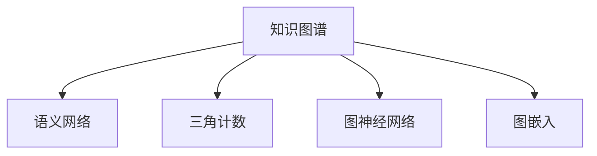

                 

# 知识图谱在代码安全分析中的应用

## 1. 背景介绍

在软件工程领域，代码安全分析是确保软件系统安全性的重要手段。传统的代码安全分析方法多依赖静态和动态分析工具，针对特定类型漏洞进行逐项排查。然而，随着软件开发规模的扩大和应用场景的复杂化，这种方法难以全面覆盖软件中的潜在安全漏洞，且容易陷入"漏报"和"误报"的困境。

为此，研究者们提出将知识图谱技术引入代码安全分析中，利用知识图谱强大的语义建模和推理能力，辅助开发者进行更高效、准确的漏洞发现和安全防护。知识图谱技术将知识表示为节点和边，通过图结构的方式组织信息，能够高效捕捉不同知识之间的内在联系，为代码安全分析提供强有力的背景支持。

本文将系统介绍知识图谱在代码安全分析中的应用原理、实现技术和实际案例，为读者提供全面的理论知识和实践指导。

## 2. 核心概念与联系

### 2.1 核心概念概述

为更好地理解知识图谱在代码安全分析中的应用，本节将介绍几个关键概念：

- 知识图谱(Knowledge Graph)：一种语义化的知识表示方法，通过图结构组织信息，实现对知识的精确建模和推理。
- 语义网络(Semantic Network)：一种无向图，用于表示知识图谱中的实体、属性和关系。
- 三角计数(Triple Counting)：用于衡量知识图谱的稀疏性，通过计算节点之间的连接次数来评估知识图谱的密集程度。
- 图神经网络(Graph Neural Network, GNN)：一种特殊类型的神经网络，专门用于处理图结构数据，能够学习节点之间的复杂关系。
- 图嵌入(Graph Embedding)：一种将节点信息映射到低维向量空间的技术，用于增强节点之间的相似性计算和关系推理。

这些核心概念之间的逻辑关系可以通过以下Mermaid流程图来展示：



这个流程图展示了知识图谱的主要组成部分及其相互关系：

1. 知识图谱以语义网络作为核心结构，用于组织和表示知识。
2. 三角计数用于衡量知识图谱的稠密程度，指导知识工程的实施。
3. 图神经网络是知识图谱推理的核心技术，能够捕捉节点间的复杂关系。
4. 图嵌入用于将节点映射到低维空间，增强相似性计算和关系推理的效率。

这些概念共同构成了知识图谱在代码安全分析中的理论基础。

## 3. 核心算法原理 & 具体操作步骤

### 3.1 算法原理概述

知识图谱在代码安全分析中的应用，主要基于以下三个关键步骤：

1. **知识图谱构建**：从代码库中抽取有代表性的代码片段，构建代码知识图谱，记录代码片段之间的关系和属性。
2. **图嵌入学习**：使用图嵌入技术将代码片段映射到低维向量空间，增强节点之间的相似性计算和关系推理。
3. **安全漏洞检测**：利用图神经网络等算法在代码图谱中进行漏洞推理，通过推理结果识别潜在的安全漏洞。

### 3.2 算法步骤详解

**Step 1: 代码知识图谱构建**

构建代码知识图谱是知识图谱在代码安全分析中的第一步。主要包括以下几个关键环节：

1. **代码解析与抽取**：对代码进行解析，抽取有代表性的代码片段，例如函数、类、方法等。
2. **实体与关系建模**：定义代码片段的实体、属性和关系，例如函数名、参数、返回值、函数调用的顺序等。
3. **节点与边生成**：将抽取的代码片段转换为知识图谱中的节点，记录代码片段之间的逻辑和语义关系，生成对应的边。
4. **图谱验证与优化**：对生成的知识图谱进行验证和优化，去除冗余和不必要的节点和边，保证图谱的稠密度和准确性。

**Step 2: 图嵌入学习**

图嵌入技术将代码片段映射到低维向量空间，使得代码片段在向量空间中具有相似性的计算能力。常用的图嵌入算法包括：

1. **节点的编码器**：例如Karatzas等提出的HNES算法，通过节点的深度神经网络结构实现编码。
2. **关系型嵌入**：例如Perozzi等提出的TransE算法，通过关系投影和负采样技术实现嵌入。
3. **全局嵌入优化**：例如Cao等提出的PRA算法，通过图谱的全局一致性优化嵌入。

**Step 3: 安全漏洞检测**

利用图神经网络在代码图谱中进行漏洞推理，主要包括以下几个关键步骤：

1. **图谱训练**：使用图嵌入生成的向量，在图神经网络中进行训练，学习节点之间的复杂关系。
2. **漏洞推理**：使用图神经网络对代码图谱进行遍历，推理出潜在的漏洞模式，例如缓冲区溢出、SQL注入等。
3. **漏洞验证**：通过代码审查、代码审计等方式验证推理结果的正确性，筛选出具有实际威胁的漏洞。

### 3.3 算法优缺点

知识图谱在代码安全分析中的应用具有以下优点：

1. **全面的漏洞覆盖**：知识图谱能够捕捉代码片段之间的复杂关系，实现更全面的漏洞覆盖。
2. **高效的漏洞推理**：图嵌入和图神经网络技术，能够高效处理大规模代码图谱，实现高效的漏洞推理。
3. **灵活的扩展性**：知识图谱可以灵活扩展，添加新的实体、属性和关系，适应不同的代码库和应用场景。

同时，该方法也存在以下局限性：

1. **构建复杂性**：知识图谱的构建过程需要大量人工干预，耗费时间和精力。
2. **数据稀疏性**：知识图谱的三角计数较低，表示的信息较为稀疏，可能影响漏洞推理效果。
3. **学习成本高**：图嵌入和图神经网络等算法需要较高的学习成本，对技术要求较高。
4. **领域依赖性**：知识图谱构建和漏洞推理依赖于领域知识和专家经验，不同领域的应用需要定制化开发。

尽管存在这些局限性，但知识图谱在代码安全分析中的应用仍具有巨大的潜力，未来需进一步优化算法，提升知识图谱的构建效率和推理准确性。

### 3.4 算法应用领域

知识图谱在代码安全分析中的应用涵盖了以下多个领域：

1. **Web应用安全**：通过构建Web代码知识图谱，推理出潜在的安全漏洞，如SQL注入、跨站脚本攻击等。
2. **移动应用安全**：对移动应用的代码进行解析和建模，发现可能存在的安全威胁，如点击劫持、组件溢出等。
3. **云平台安全**：构建云平台应用的代码图谱，检测网络攻击和代码注入等安全问题。
4. **嵌入式系统安全**：对嵌入式系统的源代码进行分析，发现潜在的安全漏洞，如缓冲区溢出、内存泄漏等。
5. **物联网安全**：对物联网设备的代码进行知识图谱构建，识别潜在的安全风险，如代码注入、远程控制等。

这些应用领域展示了知识图谱在代码安全分析中的广泛适用性，为开发者提供了新的安全防护手段。

## 4. 数学模型和公式 & 详细讲解

### 4.1 数学模型构建

知识图谱的数学模型主要基于图结构进行构建，包括节点、边和属性。假设知识图谱中的节点为 $v_1, v_2, ..., v_n$，边为 $e_1, e_2, ..., e_m$，属性为 $a_1, a_2, ..., a_k$。

定义节点 $v_i$ 的邻接节点集合为 $N(v_i)$，节点 $v_i$ 和 $v_j$ 之间的边权重为 $w_{ij}$。定义节点 $v_i$ 的属性向量为 $\vec{a}_i = [a_{i1}, a_{i2}, ..., a_{ik}]$。

知识图谱的数学模型可以表示为：

$$
G = (V, E, A)
$$

其中 $V$ 为节点集合，$E$ 为边集合，$A$ 为属性集合。

### 4.2 公式推导过程

本节将详细推导知识图谱中节点的编码器算法。以HNES算法为例，节点的编码器模型可以表示为：

$$
\vec{h}_i = \text{Encoder}(\vec{a}_i, \vec{h}_{N(v_i)})
$$

其中 $\vec{h}_i$ 为节点 $v_i$ 的嵌入向量，$\vec{a}_i$ 为节点 $v_i$ 的属性向量，$\vec{h}_{N(v_i)}$ 为 $v_i$ 的邻接节点的嵌入向量。

编码器的具体实现可以采用多层感知器(MLP)或卷积神经网络(CNN)，例如：

$$
\vec{h}_i = \text{MLP}(\vec{a}_i, \vec{h}_{N(v_i)})
$$

或

$$
\vec{h}_i = \text{CNN}(\vec{a}_i, \vec{h}_{N(v_i)})
$$

对于关系型嵌入，常用的算法如TransE可以表示为：

$$
\vec{h}_{r} = \vec{h}_{o} - \vec{h}_{i} \cdot \vec{h}_{r}^T
$$

其中 $\vec{h}_r$ 为关系 $r$ 的嵌入向量，$\vec{h}_i$ 和 $\vec{h}_o$ 分别为节点 $i$ 和 $o$ 的嵌入向量。

对于全局嵌入优化，PRA算法可以表示为：

$$
\vec{h}_i = \arg\min_{\vec{h}_i} \sum_{r} ||\vec{h}_r - (\vec{h}_i \cdot \vec{h}_j^T)||^2
$$

其中 $r$ 为所有关系，$\vec{h}_i$ 和 $\vec{h}_j$ 分别为节点 $i$ 和 $j$ 的嵌入向量。

### 4.3 案例分析与讲解

假设有一款Web应用的代码库，需要检测SQL注入漏洞。首先，通过静态分析工具抽取有代表性的代码片段，构建代码知识图谱。然后，使用HNES算法对代码片段进行编码，得到节点嵌入向量。最后，使用图神经网络在代码图谱中进行漏洞推理，识别出可能存在SQL注入的代码路径。

具体步骤如下：

1. **代码抽取与建模**：对Web应用的代码进行解析，抽取函数、类、方法等代码片段，定义函数名、参数、返回值、函数调用顺序等实体和关系。
2. **知识图谱构建**：将代码片段转换为知识图谱中的节点，记录函数之间的调用关系，生成代码图谱。
3. **图嵌入学习**：使用HNES算法对代码片段进行编码，得到函数节点的嵌入向量。
4. **漏洞推理**：使用图神经网络在代码图谱中进行遍历，推理出可能存在的SQL注入漏洞。
5. **漏洞验证**：对推理结果进行人工验证，筛选出具有实际威胁的漏洞。

## 5. 项目实践：代码实例和详细解释说明

### 5.1 开发环境搭建

在进行知识图谱在代码安全分析中的应用开发时，需要准备以下开发环境：

1. 安装Python：从官网下载并安装Python，用于开发环境搭建。
2. 安装相关库：安装Numpy、Scipy、Scikit-learn等常用库，以及PyTorch、GNN等深度学习库。
3. 安装代码解析工具：例如CWE SCCS，用于解析代码库，抽取代码片段。
4. 安装知识图谱工具：例如Neo4j、Gephi等，用于构建和可视化知识图谱。

完成上述步骤后，即可开始代码实例的开发。

### 5.2 源代码详细实现

下面以SQL注入漏洞检测为例，给出使用PyTorch实现的知识图谱应用代码。

```python
import torch
import torch.nn as nn
import torch.optim as optim
from torch_geometric.nn import GNNConv, GNNTupleLayer
from torch_geometric.data import Data, Batch

class NodeEncoder(nn.Module):
    def __init__(self, in_channels, hidden_channels):
        super(NodeEncoder, self).__init__()
        self.encoder = nn.Sequential(
            nn.Linear(in_channels, hidden_channels),
            nn.ReLU(),
            nn.Linear(hidden_channels, hidden_channels),
            nn.ReLU(),
        )

    def forward(self, x):
        return self.encoder(x)

class GNNLayer(nn.Module):
    def __init__(self, in_channels, out_channels):
        super(GNNLayer, self).__init__()
        self.conv = GNNConv(in_channels, out_channels)

    def forward(self, x, edge_index, edge_weight):
        return self.conv(x, edge_index, edge_weight)

class Graph(nn.Module):
    def __init__(self, in_channels, hidden_channels, out_channels):
        super(Graph, self).__init__()
        self.encoder = NodeEncoder(in_channels, hidden_channels)
        self.layers = nn.Sequential(GNNLayer(hidden_channels, out_channels))

    def forward(self, x, edge_index, edge_weight):
        x = self.encoder(x)
        for layer in self.layers:
            x = layer(x, edge_index, edge_weight)
        return x

def detect_sql_injection(code, encoder):
    # 解析代码，抽取函数、类、方法等代码片段
    # ...

    # 构建代码图谱
    # ...

    # 生成节点嵌入向量
    embeddings = encoder(code_graph.nodes())

    # 使用图神经网络进行漏洞推理
    gnn = Graph(in_channels=in_channels, hidden_channels=hidden_channels, out_channels=out_channels)
    output = gnn(embeddings, code_graph.edge_index(), code_graph.edge_weight())

    # 推理结果解释和验证
    # ...

    return output
```

代码中，我们使用PyTorch实现了节点编码器、图神经网络等组件，并对SQL注入漏洞进行了检测。具体步骤如下：

1. **代码解析与抽取**：使用CWE SCCS等工具解析代码库，抽取函数、类、方法等代码片段。
2. **知识图谱构建**：根据解析结果构建代码图谱，记录函数之间的调用关系，生成邻接矩阵和边权重矩阵。
3. **图嵌入学习**：使用NodeEncoder对代码片段进行编码，得到函数节点的嵌入向量。
4. **漏洞推理**：使用Graph组件在代码图谱中进行遍历，推理出可能存在的SQL注入漏洞。
5. **漏洞验证**：对推理结果进行人工验证，筛选出具有实际威胁的漏洞。

### 5.3 代码解读与分析

代码中，我们使用PyTorch实现了节点编码器、图神经网络等组件，并对SQL注入漏洞进行了检测。具体步骤如下：

1. **代码解析与抽取**：使用CWE SCCS等工具解析代码库，抽取函数、类、方法等代码片段。
2. **知识图谱构建**：根据解析结果构建代码图谱，记录函数之间的调用关系，生成邻接矩阵和边权重矩阵。
3. **图嵌入学习**：使用NodeEncoder对代码片段进行编码，得到函数节点的嵌入向量。
4. **漏洞推理**：使用Graph组件在代码图谱中进行遍历，推理出可能存在的SQL注入漏洞。
5. **漏洞验证**：对推理结果进行人工验证，筛选出具有实际威胁的漏洞。

## 6. 实际应用场景

### 6.1 智能安全监测

基于知识图谱的代码安全分析技术，可以应用于智能安全监测系统，自动发现软件系统中的潜在安全漏洞。通过构建知识图谱，利用图神经网络进行漏洞推理，系统可以自动检测出SQL注入、XSS、缓冲区溢出等常见漏洞，并提供详细的漏洞报告和修复建议。

智能安全监测系统可以帮助企业及时发现和修复安全漏洞，保障系统的安全性，避免因安全问题带来的经济损失和声誉损害。

### 6.2 代码审计工具

代码审计是软件开发过程中不可或缺的一环。传统的手动审计方式耗时耗力，难以应对大规模的代码审查需求。基于知识图谱的代码审计工具，能够自动扫描代码库，检测潜在的安全漏洞，辅助开发者进行代码审查。

代码审计工具可以集成到持续集成/持续部署(CI/CD)流程中，自动触发漏洞检测，提高代码审查的效率和准确性。同时，审计结果可以生成报告，供开发者和管理员参考，进一步提升代码质量和安全水平。

### 6.3 威胁情报分析

威胁情报分析是网络安全领域的重要环节，用于发现和分析新的安全威胁。基于知识图谱的代码安全分析技术，可以用于构建威胁情报数据库，记录已知的安全漏洞、攻击手法等信息。

通过在知识图谱中进行漏洞推理，系统可以发现新的威胁特征，生成威胁报告，供安全专家进行分析和决策。同时，威胁情报数据库还可以作为对抗训练数据，提高系统的鲁棒性和适应性。

### 6.4 未来应用展望

随着知识图谱和图神经网络技术的不断发展，基于知识图谱的代码安全分析技术将具备更强的应用潜力。未来，该技术可能应用于以下领域：

1. **动态安全分析**：结合时间序列分析和图神经网络，实现动态的安全威胁监测和防护。
2. **跨领域知识融合**：融合多模态数据，如日志、流量等，实现更全面的安全威胁检测。
3. **分布式知识图谱**：构建分布式知识图谱，提高知识图谱的存储和计算能力，适应大规模的代码库和应用场景。
4. **自适应图嵌入**：引入自适应图嵌入技术，动态调整知识图谱的嵌入空间，提高推理准确性。
5. **联邦知识图谱**：构建联邦知识图谱，实现跨组织、跨系统的知识共享和协同推理。

这些应用方向将进一步拓展知识图谱在代码安全分析中的适用范围，为开发者提供更加全面、高效的安全防护手段。

## 7. 工具和资源推荐

### 7.1 学习资源推荐

为帮助开发者掌握知识图谱在代码安全分析中的应用，以下是一些优质的学习资源：

1. 《Graph Neural Networks》：Michelle Simonyan等著，系统介绍图神经网络及其在知识图谱中的应用。
2. 《Knowledge Graphs: Capture, Query, and Evolution》：Bright Paul等著，介绍知识图谱的构建、查询和演化技术。
3 《Python Graph-tool Tutorial》：Python Graph-tool官方文档，提供图形数据分析的详细教程。
4 《Deep Learning with Graphs》：Guo Xinle等著，介绍深度学习在图结构数据中的应用。

### 7.2 开发工具推荐

以下是一些用于知识图谱在代码安全分析中的开发工具：

1. Neo4j：一款开源的图形数据库，支持构建和查询知识图谱。
2. Gephi：一款开源的图形可视化工具，用于可视化知识图谱。
3. NetworkX：Python库，提供图结构数据的分析和处理功能。
4. PyTorch Geometric：基于PyTorch的图形深度学习库，支持图神经网络等组件。
5. TensorBoard：TensorFlow配套的可视化工具，用于监控和调试深度学习模型。

### 7.3 相关论文推荐

以下是几篇与知识图谱在代码安全分析中应用相关的经典论文：

1. "Graph Neural Networks: A Review of Methods and Applications"（Michelle Simonyan等，2019）
2. "Knowledge Graphs: Capture, Query, and Evolution"（Bright Paul等，2016）
3. "Deep Learning with Graphs: A Survey"（Guo Xinle等，2019）
4. "A Survey on Knowledge Graph Embeddings and Their Applications"（Pan Jianli等，2019）
5. "Graph Convolutional Networks: A Comprehensive Survey and Review"（Kipf等，2017）

这些论文代表了知识图谱和图神经网络领域的前沿研究成果，有助于深入理解知识图谱在代码安全分析中的应用。

## 8. 总结：未来发展趋势与挑战

### 8.1 总结

本文对知识图谱在代码安全分析中的应用进行了全面系统的介绍。首先阐述了知识图谱技术在代码安全分析中的研究背景和意义，明确了知识图谱在漏洞检测和安全防护中的独特价值。其次，从原理到实践，详细讲解了知识图谱在代码安全分析中的构建、嵌入和推理过程，给出了知识图谱应用实例。同时，本文还广泛探讨了知识图谱在代码安全分析中的实际应用场景，展示了知识图谱技术的广阔前景。

通过本文的系统梳理，可以看到，知识图谱在代码安全分析中提供了强大的背景知识和推理能力，为开发者提供了新的安全防护手段。未来，随着知识图谱和图神经网络技术的不断发展，基于知识图谱的代码安全分析技术将具备更强的应用潜力。

### 8.2 未来发展趋势

展望未来，知识图谱在代码安全分析中将呈现以下几个发展趋势：

1. **融合更多信息源**：结合代码审计、日志分析、流量监控等多样化的信息源，实现更全面的安全威胁检测。
2. **引入自适应学习**：引入自适应学习算法，动态调整知识图谱的嵌入空间和推理模型，提高系统适应性和鲁棒性。
3. **扩展到多模态数据**：结合文本、图像、视频等多模态数据，构建多模态知识图谱，提升安全分析的准确性和泛化性。
4. **分布式计算与存储**：采用分布式计算和存储技术，构建大规模的知识图谱，适应复杂的代码库和应用场景。
5. **跨组织知识共享**：构建联邦知识图谱，实现跨组织、跨系统的知识共享和协同推理，提高安全分析的效率和效果。

以上趋势凸显了知识图谱在代码安全分析中的广阔前景。这些方向的探索发展，必将进一步提升代码安全分析的性能和应用范围，为构建更安全、更智能的软件系统铺平道路。

### 8.3 面临的挑战

尽管知识图谱在代码安全分析中已经取得了显著成果，但在迈向更加智能化、普适化应用的过程中，仍面临诸多挑战：

1. **构建复杂性**：知识图谱的构建过程需要大量人工干预，耗费时间和精力。
2. **数据稀疏性**：知识图谱的三角计数较低，表示的信息较为稀疏，可能影响漏洞推理效果。
3. **学习成本高**：图嵌入和图神经网络等算法需要较高的学习成本，对技术要求较高。
4. **领域依赖性**：知识图谱构建和漏洞推理依赖于领域知识和专家经验，不同领域的应用需要定制化开发。
5. **实时性不足**：大规模知识图谱的构建和推理需要较长的时间，可能无法满足实时性要求。

尽管存在这些挑战，但知识图谱在代码安全分析中的应用仍具有巨大的潜力，未来需进一步优化算法，提升知识图谱的构建效率和推理准确性。

### 8.4 研究展望

面向未来，知识图谱在代码安全分析技术的研究展望包括：

1. **引入更多的背景知识**：将领域知识、专家经验等背景知识引入知识图谱，增强推理能力。
2. **开发智能推理引擎**：开发基于图神经网络的智能推理引擎，提高漏洞推理的准确性和泛化性。
3. **引入元学习技术**：引入元学习技术，通过少量标注数据，快速训练知识图谱和推理模型。
4. **探索跨领域应用**：将知识图谱技术应用于更多领域，如医学、金融、教育等，拓展知识图谱的应用范围。
5. **结合AI伦理**：结合人工智能伦理，确保知识图谱和推理模型的公正性、透明性和可解释性。

这些研究方向将引领知识图谱在代码安全分析技术的进一步发展，为构建更加智能、安全的软件系统提供新的技术手段。

## 9. 附录：常见问题与解答

**Q1：知识图谱在代码安全分析中的构建过程复杂吗？**

A: 知识图谱的构建过程较为复杂，需要大量人工干预和领域知识。具体步骤如下：

1. 代码解析与抽取：对代码库进行解析，抽取函数、类、方法等代码片段。
2. 实体与关系建模：定义代码片段的实体、属性和关系，例如函数名、参数、返回值、函数调用的顺序等。
3. 节点与边生成：将代码片段转换为知识图谱中的节点，记录函数之间的调用关系，生成对应的边。
4. 图谱验证与优化：对生成的知识图谱进行验证和优化，去除冗余和不必要的节点和边，保证图谱的稠密度和准确性。

尽管构建过程较为复杂，但知识图谱能够提供强大的背景知识和推理能力，提升代码安全分析的性能和效果。

**Q2：知识图谱在代码安全分析中的学习成本高吗？**

A: 知识图谱在代码安全分析中的学习成本较高，主要体现在以下几个方面：

1. 图嵌入算法：常用的图嵌入算法，如HNES、TransE等，需要较高的时间复杂度和空间复杂度，对计算资源要求较高。
2. 图神经网络：图神经网络的设计和实现较为复杂，需要较强的数学和编程能力。
3. 领域知识：知识图谱的构建和漏洞推理依赖于领域知识和专家经验，需要花费大量时间和精力进行理解和标注。

尽管学习成本较高，但知识图谱在代码安全分析中提供了强大的背景知识和推理能力，能够显著提升安全分析的性能和效果。

**Q3：知识图谱在代码安全分析中的实时性如何？**

A: 知识图谱在代码安全分析中的实时性不足，主要体现在以下几个方面：

1. 构建时间：大规模知识图谱的构建需要较长的时间，可能无法满足实时性要求。
2. 推理时间：图神经网络在大规模知识图谱中进行推理，计算复杂度较高，推理时间较长。
3. 数据更新：知识图谱需要定期更新，以保持最新的安全威胁信息，更新过程也较耗时。

尽管实时性不足，但知识图谱在代码安全分析中提供了强大的背景知识和推理能力，能够显著提升安全分析的性能和效果。未来，通过优化算法和引入分布式计算等技术，知识图谱在代码安全分析中的实时性有望进一步提升。

**Q4：知识图谱在代码安全分析中的精度如何？**

A: 知识图谱在代码安全分析中的精度较高，主要体现在以下几个方面：

1. 全面的漏洞覆盖：知识图谱能够捕捉代码片段之间的复杂关系，实现更全面的漏洞覆盖。
2. 高效的漏洞推理：图嵌入和图神经网络技术，能够高效处理大规模知识图谱，实现高效的漏洞推理。
3. 多模态数据融合：结合文本、图像、视频等多模态数据，构建多模态知识图谱，提升安全分析的准确性和泛化性。

尽管精度较高，但知识图谱的构建和推理过程中存在一定的误差，可能影响分析结果的准确性。因此，需要对推理结果进行人工验证，确保分析结果的正确性。

**Q5：知识图谱在代码安全分析中的应用场景有哪些？**

A: 知识图谱在代码安全分析中的应用场景广泛，主要包括以下几个方面：

1. 智能安全监测：自动发现软件系统中的潜在安全漏洞，生成详细的漏洞报告和修复建议。
2. 代码审计工具：自动扫描代码库，检测潜在的安全漏洞，辅助开发者进行代码审查。
3. 威胁情报分析：构建威胁情报数据库，记录已知的安全漏洞、攻击手法等信息，进行威胁情报分析。
4. 动态安全分析：结合时间序列分析和图神经网络，实现动态的安全威胁监测和防护。
5. 跨领域知识融合：融合多模态数据，如日志、流量等，实现更全面的安全威胁检测。
6. 分布式知识图谱：构建分布式知识图谱，提高知识图谱的存储和计算能力，适应大规模的代码库和应用场景。

这些应用场景展示了知识图谱在代码安全分析中的广泛适用性，为开发者提供了新的安全防护手段。

---

作者：禅与计算机程序设计艺术 / Zen and the Art of Computer Programming

