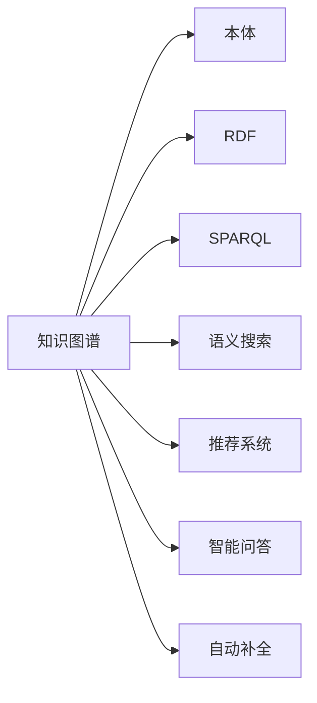
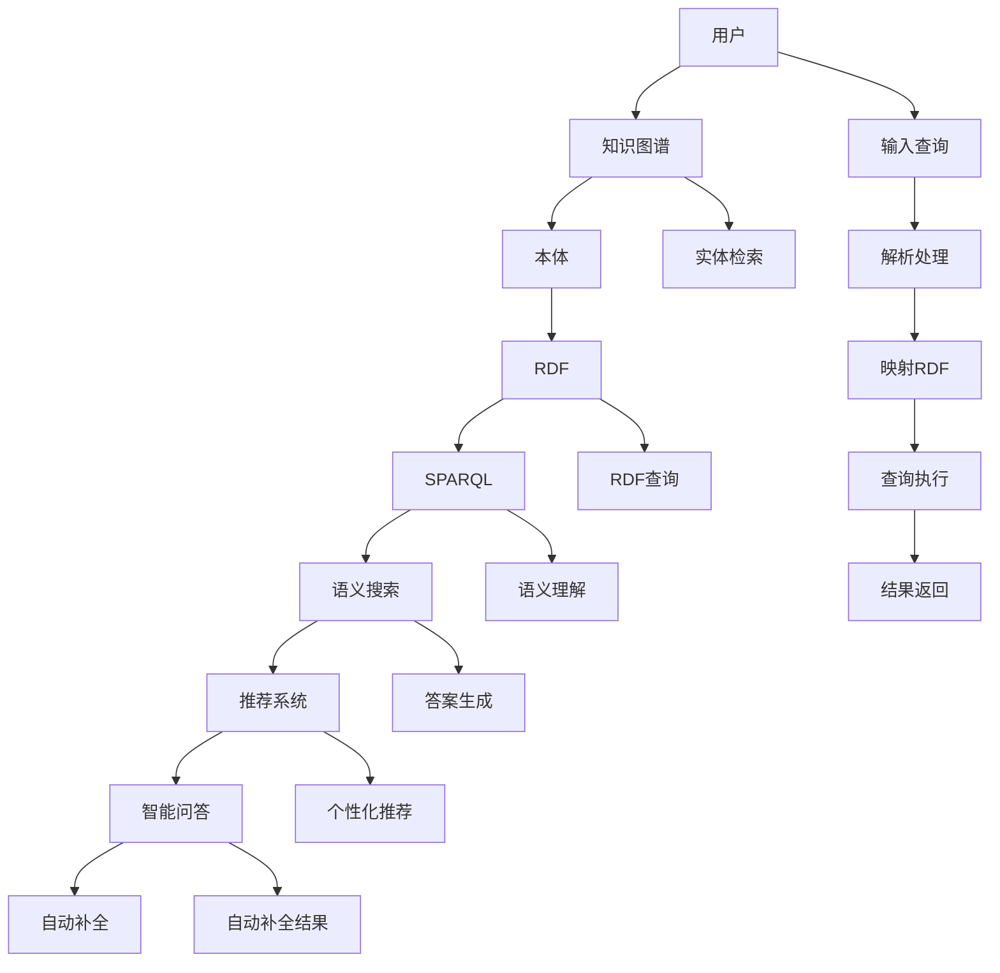

                 

# 知识图谱在知识管理系统中的应用

> 关键词：知识图谱, 知识管理系统, 本体, RDF, SPARQL, 语义搜索, 推荐系统, 问答系统, 自动补全

## 1. 背景介绍

### 1.1 问题由来
知识图谱（Knowledge Graph），作为数据融合与知识工程的重要手段，近年来在信息检索、推荐系统、智能问答等多个领域展示了其强大的价值。知识图谱是一种语义化的图结构数据，通过将实体、属性和关系进行结构化建模，以更为自然的方式捕捉实体之间的复杂语义关系，使得机器可以更直观地理解现实世界的知识。

在信息爆炸的今天，知识图谱的应用前景日益广阔。无论是面向消费者的电商推荐、个性化广告，还是面向企业的市场情报分析、风险评估，都亟需从海量数据中快速、准确地提取知识，进行高效的信息检索与处理。如何高效构建和维护知识图谱，使之与知识管理系统（Knowledge Management System, KMS）深度融合，已成为当前研究的重点。

### 1.2 问题核心关键点
知识图谱与知识管理系统之间的融合，主要涉及以下几个关键点：
- 知识图谱的构建与演化：包括知识图谱的初始化、持续更新与增长。
- 知识图谱与数据的融合：如何将结构化的知识图谱与非结构化数据进行无缝融合，进行统一的查询和管理。
- 知识图谱的应用场景：如何基于知识图谱构建高效的查询、推荐、自动补全等应用系统。
- 系统性能与可扩展性：如何在保证系统性能的同时，提高系统可扩展性和容错性。
- 安全性与隐私保护：如何在利用知识图谱提升系统性能的同时，保证用户数据的安全性和隐私性。

### 1.3 问题研究意义
知识图谱与知识管理系统的深度融合，将为信息检索、推荐系统、智能问答等应用提供强大的知识支撑，帮助用户在海量数据中快速找到所需信息，提升工作效率，减少决策成本。同时，基于知识图谱的系统，可以通过更丰富的语义信息进行内容推荐，满足用户的多样化需求，提升用户体验。在面向企业应用场景中，知识图谱还能够帮助企业快速分析市场趋势，预测风险，辅助决策。

因此，知识图谱与知识管理系统的结合，将显著提升信息检索与管理的效率，为知识驱动型的决策支持系统奠定坚实的基础。未来，随着知识图谱技术的进一步成熟，其在知识管理中的应用前景将更加广阔，成为企业智能化转型中的重要工具。

## 2. 核心概念与联系

### 2.1 核心概念概述

为了更好地理解知识图谱在知识管理系统中的应用，我们需要了解几个核心概念：

- **知识图谱（Knowledge Graph）**：一种语义化的图结构数据，由实体、属性和关系组成。知识图谱可以直观地表示实体间的语义关系，例如：人-地点、人-工作、人-事件等。

- **本体（Ontology）**：用于定义知识图谱的规则和约束，包括实体类型、属性类型、关系类型等。本体是构建知识图谱的基础。

- **RDF（Resource Description Framework）**：一种用于表示语义网资源的框架，是构建知识图谱的标准。RDF以三元组（实体、属性、值）的形式，将数据转换为可被机器理解的结构。

- **SPARQL（SPARQL Protocol and RDF Query Language）**：一种用于查询和操作RDF数据的标准化语言，基于SQL风格，易于理解和实现。

- **语义搜索（Semantic Search）**：一种基于知识图谱的智能搜索技术，通过理解查询语句的语义，实现更精确的信息检索。

- **推荐系统（Recommendation System）**：利用用户行为数据和知识图谱构建的智能推荐系统，可以提供个性化、定制化的内容推荐。

- **智能问答（Intelligent Question Answering）**：基于知识图谱构建的智能问答系统，可以理解自然语言问题，并提供准确的回答。

- **自动补全（Autocomplete）**：利用知识图谱和语义搜索技术，实现用户输入时自动补全建议。

这些核心概念之间的关系可以通过以下Mermaid流程图来展示：



### 2.2 核心概念原理和架构的 Mermaid 流程图

以下是知识图谱在知识管理系统中的核心概念及其原理和架构的详细图示：



这个流程图展示了用户通过输入查询、知识图谱进行实体检索、RDF查询、语义理解、推荐系统和智能问答等过程，最终输出结果。通过知识图谱的深层语义建模，可以大幅提升信息检索的精准度，同时为推荐系统和智能问答提供坚实的数据基础。

## 3. 核心算法原理 & 具体操作步骤

### 3.1 算法原理概述

知识图谱在知识管理系统中的应用，主要基于以下几个核心算法原理：

1. **本体映射与RDF构建**：将无结构化数据映射为本体知识，并通过RDF模型构建知识图谱。
2. **SPARQL查询与优化**：通过SPARQL语言进行高效的知识图谱查询，优化查询执行路径。
3. **语义搜索与推荐**：利用语义搜索技术，进行实体关联检索与推荐。
4. **智能问答与补全**：基于知识图谱构建智能问答系统，通过理解查询语句进行回答，并进行自动补全。

### 3.2 算法步骤详解

**Step 1: 构建知识图谱**

1. **数据收集与预处理**：收集与知识管理相关的结构化和非结构化数据，进行清洗和预处理。
2. **本体构建与映射**：根据业务需求，构建本体模型，定义实体类型、属性类型、关系类型等。
3. **RDF构建**：将预处理后的数据，通过RDF格式进行结构化表示，构建知识图谱。

**Step 2: 知识图谱与数据融合**

1. **数据源整合**：将知识图谱与业务系统中的数据源进行整合，建立统一的数据平台。
2. **数据映射与关联**：将数据映射到知识图谱中，建立数据与实体、属性和关系之间的关联。
3. **数据更新与维护**：定期对知识图谱进行更新，确保数据的时效性和准确性。

**Step 3: 语义搜索与推荐**

1. **SPARQL查询优化**：设计高效的SPARQL查询语句，优化查询路径。
2. **语义理解与检索**：利用语义搜索技术，实现实体关联检索。
3. **推荐系统构建**：根据用户行为数据，构建个性化推荐系统，实现内容推荐。

**Step 4: 智能问答与自动补全**

1. **自然语言处理**：使用NLP技术解析用户查询，转化为知识图谱查询语句。
2. **智能问答**：基于知识图谱进行答案生成，并提供多轮对话支持。
3. **自动补全**：利用语义搜索技术，进行自动补全建议，提高用户输入效率。

### 3.3 算法优缺点

知识图谱在知识管理系统中的应用具有以下优点：
1. **语义精确性**：知识图谱通过深度语义建模，能够提供更准确的实体关系检索。
2. **推荐与问答的智能化**：基于知识图谱，可以实现智能推荐和智能问答，提升用户体验。
3. **数据可扩展性**：知识图谱能够整合海量数据，支持大规模数据处理。

同时，知识图谱的应用也存在一些缺点：
1. **构建复杂性**：知识图谱的构建需要大量专家知识和人工操作，构建成本较高。
2. **实时性不足**：知识图谱的更新和维护需要一定时间，难以实时响应数据变化。
3. **隐私风险**：知识图谱中可能包含敏感信息，需要进行严格的隐私保护措施。

### 3.4 算法应用领域

知识图谱在知识管理系统中的应用，主要涵盖以下几个领域：

1. **智能推荐系统**：在电商、新闻、视频等多个领域，利用用户行为数据和知识图谱，构建个性化推荐系统。
2. **智能问答系统**：在医疗、教育、金融等多个领域，基于知识图谱构建智能问答系统，提高服务效率和准确性。
3. **自动补全系统**：在搜索、电商、应用等多个领域，利用知识图谱进行自动补全，提升用户输入体验。
4. **市场情报分析**：在金融、咨询等多个领域，利用知识图谱进行市场趋势分析和风险评估，辅助决策。
5. **内容管理与发布**：在媒体、新闻、出版等多个领域，利用知识图谱进行内容管理和发布，提升内容质量。
6. **企业知识管理**：在企业内部，利用知识图谱进行知识共享、员工培训、项目管理等，提升企业竞争力。

## 4. 数学模型和公式 & 详细讲解 & 举例说明

### 4.1 数学模型构建

知识图谱的构建与查询主要基于RDF数据模型。RDF以三元组的形式，表示实体、属性和值之间的关系。以下是一个简单的RDF三元组示例：

```
<http://www.w3.org/2000/01/rdf-schema#label> <http://www.example.com/people#Alice> "Alice" .
```

其中，`<http://www.w3.org/2000/01/rdf-schema#label>` 是属性，`<http://www.example.com/people#Alice>` 是实体，`"Alice"` 是值。

知识图谱的查询通常通过SPARQL进行。SPARQL查询语句包括变量、条件表达式、函数调用等，以下是一些示例：

```sql
PREFIX ex: <http://www.example.com/>

SELECT ?person WHERE { 
    ex:People ex:contains ?person .
    FILTER (?person="Alice")
}

SELECT ?friend WHERE { 
    ex:People ex:contains ?friend ;
    ex:knows ex:Person <http://www.example.com/people#Alice> .
    FILTER (?friend="Bob")
}
```

### 4.2 公式推导过程

在知识图谱的查询中，常用的计算和推理公式包括：

1. **SPARQL查询的语法与语义**：SPARQL查询语法基于SQL，通过变量、条件表达式、函数调用等，实现复杂的数据查询和推理。

2. **RDF图演算**：通过RDF图演算，计算实体之间的关系，并进行推理。常用的演算包括：

    - 实体查询：通过RDF图演算，查询指定的实体。
    - 关系查询：通过RDF图演算，查询实体之间的关系。
    - 属性查询：通过RDF图演算，查询实体的属性值。

3. **推理算法**：常用的推理算法包括：

    - 单调推理：通过单调逻辑推理，判断实体之间的蕴含关系。
    - 规则推理：通过规则库，实现复杂的推理和决策。
    - 统计推理：通过统计数据，实现概率推理。

### 4.3 案例分析与讲解

以下是一个基于知识图谱的推荐系统案例分析：

1. **数据收集与预处理**：收集用户的购买记录、评分数据、商品信息等，进行清洗和预处理。
2. **本体构建与映射**：根据业务需求，构建用户、商品、评分等本体模型。
3. **RDF构建**：将预处理后的数据，通过RDF格式进行结构化表示，构建推荐系统的知识图谱。
4. **SPARQL查询优化**：设计高效的SPARQL查询语句，优化查询路径。
5. **语义理解与检索**：利用语义搜索技术，进行实体关联检索。
6. **推荐系统构建**：根据用户行为数据，构建个性化推荐系统，实现内容推荐。

以下是一个简单的推荐系统实现代码示例：

```python
import rdflib
from rdflib import Namespace, RDF, RDFS, OWL, BNode
from rdflib.query import SPARQLQueryResult

# 构建知识图谱
graph = rdflib.Graph()
ex = Namespace("http://www.example.com/")

graph.add((ex.Person, RDFS.label, "Alice"))
graph.add((ex.Person, ex.knows, ex.Person))
graph.add((ex.Person, ex.contains, ex.Person))

# 查询推荐系统
query = """
PREFIX ex: <http://www.example.com/>
SELECT ?person WHERE { 
    ex:People ex:contains ?person .
    FILTER (?person="Alice")
}
"""
result = graph.query(query)

# 输出推荐结果
for row in result:
    print(row[0])
```

通过以上代码，我们实现了基于知识图谱的推荐系统。用户可以通过查询知识图谱，找到与其有特定关系的人，进行推荐。

## 5. 项目实践：代码实例和详细解释说明

### 5.1 开发环境搭建

在进行知识图谱项目实践前，我们需要准备好开发环境。以下是使用Python进行RDFTK开发的环境配置流程：

1. 安装Anaconda：从官网下载并安装Anaconda，用于创建独立的Python环境。

2. 创建并激活虚拟环境：
```bash
conda create -n rdftk-env python=3.8 
conda activate rdftk-env
```

3. 安装RDFTK：
```bash
pip install rdftk
```

4. 安装各类工具包：
```bash
pip install numpy pandas scikit-learn matplotlib tqdm jupyter notebook ipython
```

完成上述步骤后，即可在`rdftk-env`环境中开始项目实践。

### 5.2 源代码详细实现

下面以知识图谱查询推荐系统为例，给出使用RDFTK库进行知识图谱查询的PyTorch代码实现。

首先，定义知识图谱：

```python
from rdftk import RDFTK, RDFS, OWL

graph = RDFTK("http://www.example.com/").create_graph()
graph.add((graph.get_uri("Alice"), RDFS.label, "Alice"))
graph.add((graph.get_uri("Bob"), RDFS.label, "Bob"))
graph.add((graph.get_uri("Alice"), OWL.knows, graph.get_uri("Bob")))
```

然后，定义SPARQL查询：

```python
from rdftk.sparql import SPARQLQueryResult

query = """
PREFIX ex: <http://www.example.com/>
SELECT ?person WHERE { 
    ex:People ex:contains ?person .
    FILTER (?person="Alice")
}
"""
result = SPARQLQueryResult(graph, query)
for row in result:
    print(row[0])
```

最后，运行查询并输出结果：

```python
print(graph.to_json())
```

以上就是使用RDFTK对知识图谱进行查询推荐系统的完整代码实现。可以看到，RDFTK提供了丰富的API和工具，使得知识图谱的构建和查询变得简单易行。

### 5.3 代码解读与分析

让我们再详细解读一下关键代码的实现细节：

**知识图谱构建**：
- `RDFTK("http://www.example.com/").create_graph()`：创建知识图谱实例，并指定命名空间。
- `graph.add((graph.get_uri("Alice"), RDFS.label, "Alice"))`：向知识图谱中添加实体Alice。
- `graph.add((graph.get_uri("Bob"), RDFS.label, "Bob"))`：向知识图谱中添加实体Bob。
- `graph.add((graph.get_uri("Alice"), OWL.knows, graph.get_uri("Bob")))`：向知识图谱中添加Alice知道Bob的关系。

**SPARQL查询**：
- `SPARQLQueryResult(graph, query)`：使用SPARQLQueryResult执行查询，并返回查询结果。
- `result[0]`：查询结果中的第一个元素，即推荐系统中的推荐人。

**输出结果**：
- `graph.to_json()`：将知识图谱输出为JSON格式，方便后续分析和处理。

可以看到，通过RDFTK的API和工具，可以很方便地构建和查询知识图谱，实现推荐系统的需求。

## 6. 实际应用场景

### 6.1 智能推荐系统

智能推荐系统通过构建知识图谱，对用户行为数据和商品信息进行关联分析，提供个性化的推荐。例如，在电商平台，用户浏览、点击、购买等行为数据，都可以映射到知识图谱中进行处理。通过SPARQL查询，可以实时获取用户的兴趣和偏好，实现更精准的推荐。

### 6.2 智能问答系统

智能问答系统通过构建知识图谱，对自然语言问题进行语义理解，并根据知识图谱进行实体检索和关系推理，提供准确的回答。例如，在医疗领域，用户可以询问关于特定疾病的信息，系统通过查询知识图谱，获取相关医疗信息，并提供详细的解答。

### 6.3 自动补全系统

自动补全系统通过构建知识图谱，对用户输入的内容进行语义分析，并提供相关的补全建议。例如，在搜索引擎中，用户输入关键词，系统可以自动推荐相关的搜索词，提升搜索效率和准确性。

### 6.4 未来应用展望

随着知识图谱技术的不断成熟，其在知识管理系统中的应用前景将更加广阔。未来，知识图谱将与更多新兴技术结合，推动更多创新应用的发展：

1. **多模态知识图谱**：结合视觉、语音、文本等多种数据源，构建多模态知识图谱，提升系统的语义理解能力。
2. **实时知识图谱**：利用流数据处理技术，构建实时更新的知识图谱，及时响应用户需求。
3. **分布式知识图谱**：通过分布式存储和计算技术，构建可扩展的知识图谱系统，支持大规模数据处理。
4. **基于区块链的知识图谱**：利用区块链技术，构建透明、安全的知识图谱，保障数据的可信性和安全性。
5. **自然语言生成**：结合知识图谱和自然语言生成技术，实现自动化的问答和内容生成。
6. **智能合约**：将知识图谱与智能合约技术结合，构建自动化的智能合约系统，提高合同执行效率和准确性。

## 7. 工具和资源推荐

### 7.1 学习资源推荐

为了帮助开发者系统掌握知识图谱的理论基础和实践技巧，这里推荐一些优质的学习资源：

1. 《Knowledge Graphs: Concepts, Applications and Technologies》：由国际知识图谱领域知名学者编写，系统介绍了知识图谱的基本概念、构建方法、应用场景等。
2. 《The Basics of RDF》：由Web语义专家编写，介绍了RDF的基本概念、语法和应用，是学习知识图谱的基础教材。
3. 《SPARQL: A Query Language for RDF and Other Linked Data》：由SPARQL标准编写组编写的官方文档，介绍了SPARQL语法和用法。
4. 《Practical RDF and SPARQL》：由Web专家编写的实战教程，结合大量案例，讲解了知识图谱的构建和查询方法。
5. 《GraphDB》：GraphDB官方文档，介绍了GraphDB知识图谱平台的构建和使用方法。

通过对这些资源的学习实践，相信你一定能够快速掌握知识图谱的精髓，并用于解决实际的NLP问题。

### 7.2 开发工具推荐

高效的开发离不开优秀的工具支持。以下是几款用于知识图谱开发的工具：

1. GraphDB：一款功能强大的开源知识图谱平台，支持RDF、SPARQL、OWL等多种数据模型，提供了丰富的查询和分析工具。
2. Neo4j：一款图数据库，支持图结构数据的存储和查询，适用于构建复杂的关系图谱。
3. OntoGraphDB：一款轻量级的RDF数据库，支持本体构建、查询和推理，适合中小规模知识图谱的开发。
4. Protégé：一款免费的本体编辑工具，支持本体构建、推理、可视化等功能，适合学习和实践知识图谱开发。
5. SparQL-Bench：一款基于SPARQL的查询性能测试工具，可以测试知识图谱查询的性能和优化策略。

合理利用这些工具，可以显著提升知识图谱的开发效率，加快创新迭代的步伐。

### 7.3 相关论文推荐

知识图谱的研究领域非常广泛，涉及多个学科和技术方向。以下是几篇奠基性的相关论文，推荐阅读：

1. "Knowledge Representation and Reasoning" by Hector Levesque, Michael J. P. Smith, and Allen B. ling：介绍了知识表示和推理的基本概念和方法，是知识图谱研究的经典入门教材。
2. "Semantic Web: A Guide to the Foundations" by Patrick Henry and Anatoly Mayorov：介绍了语义网的基本概念、技术和应用，涵盖了知识图谱的构建和查询。
3. "The Graph Challenge: A Survey" by Sheni Avidor-Kalman and Shlomo Kraus：介绍了知识图谱的挑战和未来发展方向，探讨了知识图谱构建和应用的最新进展。
4. "Knowledge Graphs for Semantic Search" by Humble Zhang and Junichi Tsunoda：介绍了知识图谱在语义搜索中的应用，讲解了如何利用知识图谱进行实体关联检索。
5. "Knowledge Graphs for Recommendation Systems" by Francesca Fensel, et al.：介绍了知识图谱在推荐系统中的应用，讲解了如何构建基于知识图谱的推荐算法。

这些论文代表了大规模知识图谱的研究进展，通过学习这些前沿成果，可以帮助研究者把握学科前进方向，激发更多的创新灵感。

## 8. 总结：未来发展趋势与挑战

### 8.1 总结

本文对知识图谱在知识管理系统中的应用进行了全面系统的介绍。首先阐述了知识图谱构建和应用的相关背景，明确了知识图谱在信息检索、推荐系统、智能问答等应用中的重要价值。其次，从原理到实践，详细讲解了知识图谱的构建与查询方法，给出了知识图谱查询推荐系统的完整代码实现。同时，本文还探讨了知识图谱在智能推荐、智能问答、自动补全等应用场景中的应用前景，展示了知识图谱的广泛应用。此外，本文精选了知识图谱的相关学习资源，力求为读者提供全方位的技术指引。

通过本文的系统梳理，可以看到，知识图谱作为一种重要的知识表示和推理工具，正逐渐成为NLP领域的重要组成部分。它为信息检索、推荐系统、智能问答等应用提供了强大的知识支撑，能够显著提升系统的性能和用户体验。未来，随着知识图谱技术的进一步成熟，其在知识管理中的应用前景将更加广阔，成为企业智能化转型中的重要工具。

### 8.2 未来发展趋势

展望未来，知识图谱的发展趋势将呈现以下几个方向：

1. **自动化构建**：通过自动化构建技术，减少知识图谱构建的人力成本，提高构建效率和质量。
2. **多模态融合**：将知识图谱与视觉、语音、文本等多种数据源结合，构建多模态知识图谱，提升系统的语义理解能力。
3. **实时更新**：利用流数据处理技术，构建实时更新的知识图谱，及时响应用户需求。
4. **分布式架构**：通过分布式存储和计算技术，构建可扩展的知识图谱系统，支持大规模数据处理。
5. **基于区块链**：利用区块链技术，构建透明、安全的知识图谱，保障数据的可信性和安全性。
6. **自然语言生成**：结合知识图谱和自然语言生成技术，实现自动化的问答和内容生成。
7. **智能合约**：将知识图谱与智能合约技术结合，构建自动化的智能合约系统，提高合同执行效率和准确性。

以上趋势凸显了知识图谱技术的广阔前景。这些方向的探索发展，必将进一步提升知识图谱的性能和应用范围，为知识驱动型的决策支持系统奠定坚实的基础。

### 8.3 面临的挑战

尽管知识图谱技术已经取得了显著进展，但在迈向更加智能化、普适化应用的过程中，仍面临诸多挑战：

1. **构建复杂性**：知识图谱的构建需要大量专家知识和人工操作，构建成本较高。
2. **实时性不足**：知识图谱的更新和维护需要一定时间，难以实时响应数据变化。
3. **隐私风险**：知识图谱中可能包含敏感信息，需要进行严格的隐私保护措施。
4. **存储和计算成本**：大规模知识图谱的存储和计算需要高昂的成本，需要有效的压缩和优化技术。
5. **语义理解能力**：知识图谱的语义理解能力仍需进一步提升，以更好地应对复杂语义场景。
6. **异构数据融合**：知识图谱需要与多种数据源进行融合，实现跨领域知识共享。

### 8.4 研究展望

未来，知识图谱的研究需要在以下几个方面寻求新的突破：

1. **自动化构建技术**：探索更高效的自动化构建方法，减少人工干预，提升构建效率和质量。
2. **多模态融合方法**：开发更有效的多模态融合算法，提升系统的语义理解能力。
3. **实时更新机制**：研究高效的实时更新技术，提高知识图谱的实时响应能力。
4. **分布式架构设计**：设计可扩展的分布式知识图谱系统，支持大规模数据处理。
5. **隐私保护技术**：开发更严格的隐私保护算法，保障用户数据的隐私性。
6. **语义理解算法**：研究更先进的语义理解算法，提升知识图谱的语义理解能力。
7. **异构数据融合技术**：开发更高效的异构数据融合算法，实现跨领域知识共享。

这些研究方向的探索，必将引领知识图谱技术迈向更高的台阶，为构建安全、可靠、可解释、可控的智能系统铺平道路。面向未来，知识图谱技术还需要与其他人工智能技术进行更深入的融合，如知识表示、因果推理、强化学习等，多路径协同发力，共同推动知识驱动型的决策支持系统进步。只有勇于创新、敢于突破，才能不断拓展知识图谱的边界，让智能技术更好地造福人类社会。

## 9. 附录：常见问题与解答

**Q1：如何构建知识图谱？**

A: 构建知识图谱需要以下步骤：

1. **数据收集与预处理**：收集与知识管理相关的结构化和非结构化数据，进行清洗和预处理。
2. **本体构建与映射**：根据业务需求，构建本体模型，定义实体类型、属性类型、关系类型等。
3. **RDF构建**：将预处理后的数据，通过RDF格式进行结构化表示，构建知识图谱。

**Q2：知识图谱的查询效率如何提升？**

A: 提升知识图谱的查询效率可以从以下几个方面入手：

1. **索引优化**：建立实体、属性、关系等的索引，提高查询速度。
2. **查询优化**：设计高效的SPARQL查询语句，优化查询路径。
3. **缓存技术**：利用缓存技术，减少重复查询的计算。
4. **并行计算**：利用并行计算技术，提高查询处理的效率。
5. **分布式查询**：将查询任务分布到多个节点上，并行处理。

**Q3：知识图谱在推荐系统中的应用有哪些？**

A: 知识图谱在推荐系统中的应用主要包括以下几个方面：

1. **用户行为建模**：将用户行为数据映射到知识图谱中，构建用户画像。
2. **实体关系推理**：通过推理算法，发现用户与商品之间的关系，进行个性化推荐。
3. **多属性分析**：利用知识图谱进行多属性分析，提升推荐效果。
4. **实时推荐**：通过实时更新知识图谱，进行实时的个性化推荐。

**Q4：知识图谱在智能问答中的应用有哪些？**

A: 知识图谱在智能问答中的应用主要包括以下几个方面：

1. **自然语言理解**：利用NLP技术解析用户查询，转化为知识图谱查询语句。
2. **实体检索与推理**：通过实体检索和推理，从知识图谱中获取答案。
3. **多轮对话支持**：利用多轮对话技术，实现智能问答系统的对话能力。

**Q5：知识图谱的隐私保护有哪些措施？**

A: 知识图谱的隐私保护可以从以下几个方面入手：

1. **数据匿名化**：通过数据匿名化技术，保护用户隐私。
2. **访问控制**：通过访问控制技术，限制对知识图谱的访问权限。
3. **差分隐私**：通过差分隐私技术，保护个体数据隐私。
4. **数据加密**：通过数据加密技术，保护知识图谱中的敏感信息。
5. **隐私审计**：通过隐私审计技术，定期检查和监测隐私保护措施的效果。

---

作者：禅与计算机程序设计艺术 / Zen and the Art of Computer Programming

