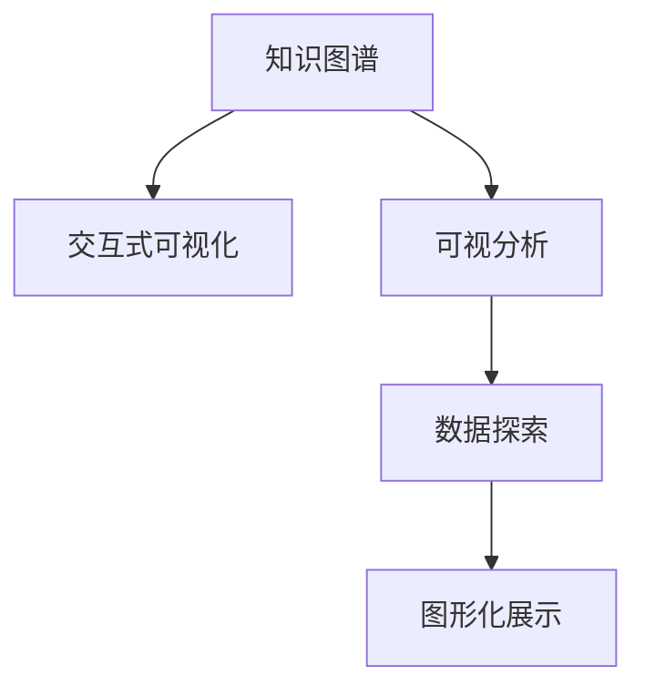
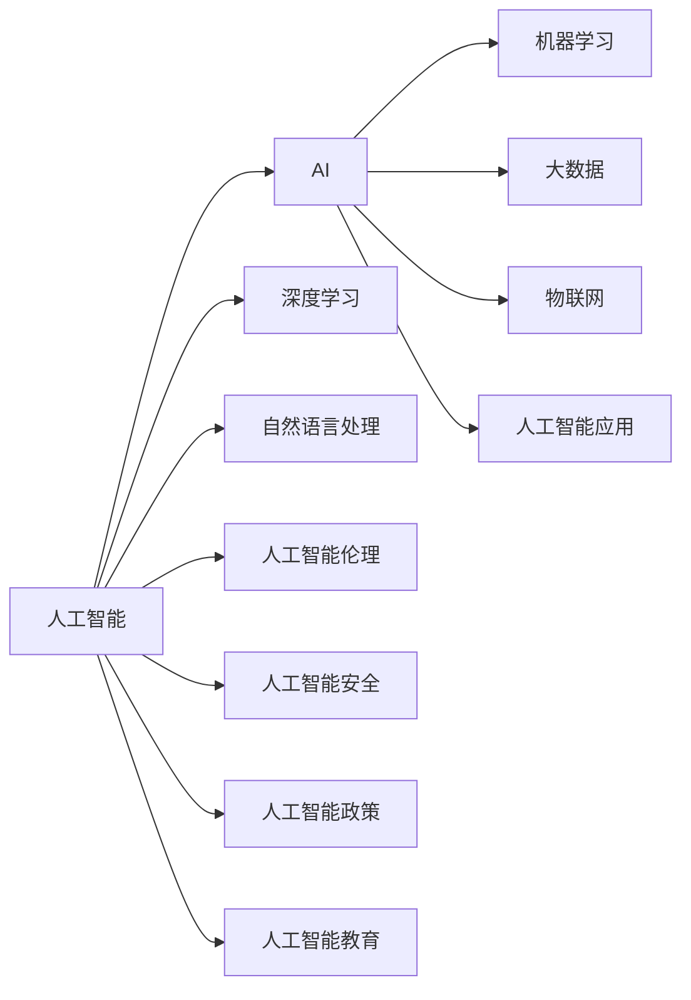
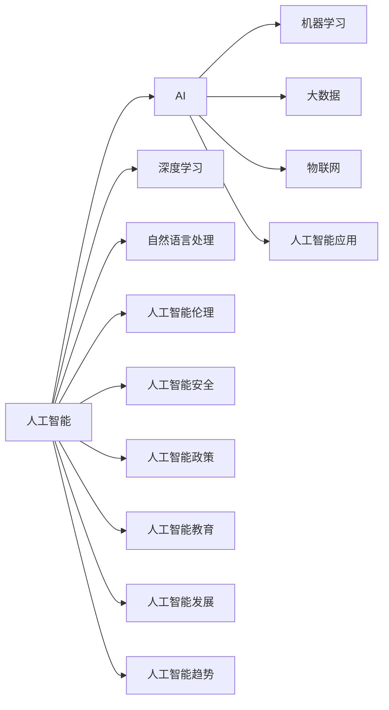
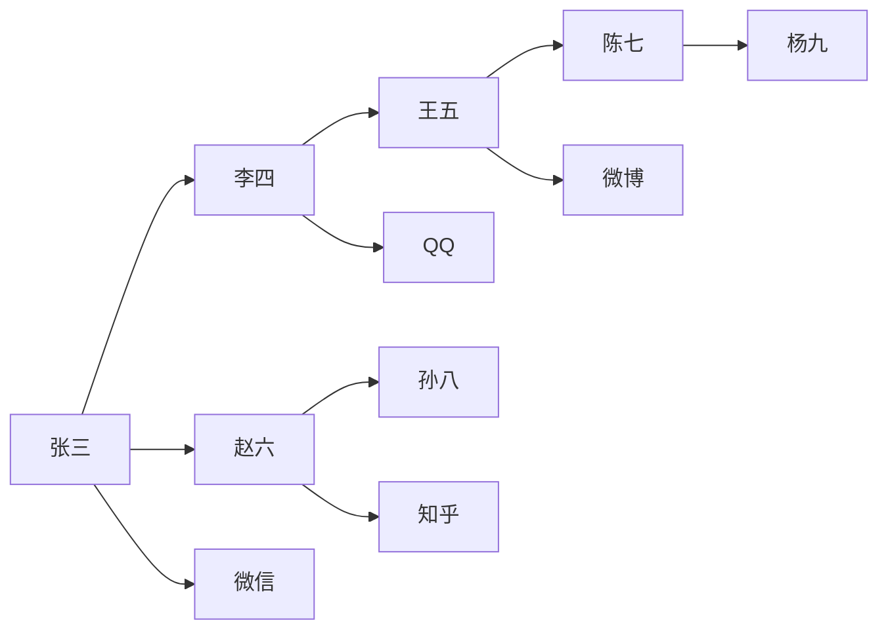

                 

# 知识图谱的可视化设计:交互式可视化和可视分析

> 关键词：知识图谱, 交互式可视化, 可视分析, 数据探索, 图形化展示

## 1. 背景介绍

### 1.1 问题由来
在信息爆炸的今天，如何有效利用和分析数据成为大数据时代的重要课题。知识图谱（Knowledge Graph）作为一种结构化表示和推理数据的方式，将复杂的多关系数据以图形化的形式呈现，使得数据处理变得更加直观、高效。然而，知识图谱的构建和维护成本高昂，且在可视化时仅提供静态图形界面，无法直观展示数据动态变化和深入分析。因此，如何实现知识图谱的交互式可视化和可视分析，是当前研究的一个热门话题。

### 1.2 问题核心关键点
本节将介绍知识图谱在数据处理、图形化展示和交互式分析等方面的核心概念和关键点，以便更好地理解其交互式可视化和可视分析方法。

## 2. 核心概念与联系

### 2.1 核心概念概述

为更好地理解知识图谱的交互式可视化和可视分析方法，本节将介绍几个密切相关的核心概念：

- **知识图谱**：以图结构形式表示的知识库，包含节点和边，用于存储实体、属性和关系等知识元素。知识图谱广泛应用于搜索引擎、推荐系统、智能问答等领域，具有结构化和半结构化的特点。
- **交互式可视化**：利用可视化工具实现人机交互，用户可以通过点击、拖拽等方式动态调整和探索数据，从而增强对数据的理解和洞察。
- **可视分析**：通过图形化界面展示数据，用户可以通过视图定制、数据操作和可视化交互，揭示数据背后隐藏的模式和关系。
- **数据探索**：通过交互式可视化工具和数据操作，用户可以自由地探索数据，发现数据中的新洞见和新模式。
- **图形化展示**：利用图表、地图等图形化元素，将数据以直观、美观的方式展示出来，便于用户理解和使用。

这些核心概念之间的逻辑关系可以通过以下Mermaid流程图来展示：



这个流程图展示出知识图谱、交互式可视化、可视分析、数据探索和图形化展示之间的联系：

1. 知识图谱提供基础数据，通过交互式可视化和可视分析工具进行处理和展示。
2. 用户通过数据探索和交互式可视化工具，对数据进行深入分析和探索。
3. 最终，数据通过图形化展示的方式，直观、美观地呈现给用户，帮助其理解和使用。

## 3. 核心算法原理 & 具体操作步骤
### 3.1 算法原理概述

知识图谱的交互式可视化和可视分析方法，本质上是一个将结构化数据转换为图形化界面的过程。其核心思想是：将知识图谱中的节点和边，通过图形化的方式展示出来，并利用交互式可视化工具，支持用户对数据进行动态调整和深入分析。

形式化地，假设知识图谱 $G=(V,E)$，其中 $V$ 为节点集合，$E$ 为边集合。定义节点 $v_i$ 的可视化表示为 $vis(v_i)$，边 $e_{i,j}$ 的可视化表示为 $vis(e_{i,j})$。知识图谱的交互式可视化过程如下：

1. 将知识图谱中的节点和边，转换为图形化界面元素。
2. 用户通过交互式可视化工具，调整和定制可视化界面，从而展示数据的变化。
3. 用户在可视化界面中进行操作，触发可视分析算法，进行深入的数据探索和分析。

### 3.2 算法步骤详解

知识图谱的交互式可视化过程一般包括以下几个关键步骤：

**Step 1: 构建知识图谱**
- 使用知识图谱构建工具，如Neo4j、Gephi等，将知识图谱中的实体、属性和关系等数据转换为图形化的节点和边。

**Step 2: 设计可视化界面**
- 选择合适的可视化界面框架，如D3.js、Three.js、ECharts等，设计界面布局和交互方式。
- 设计可视化界面元素，如节点、边、标签、提示等，满足用户对数据展示和操作的需求。

**Step 3: 实现交互功能**
- 利用JavaScript等编程语言实现可视化界面的交互逻辑，如节点拖拽、边折叠、节点编辑等。
- 设计数据更新和同步机制，确保用户操作能够即时反映在可视化界面中。

**Step 4: 实施可视分析算法**
- 在可视化界面中实现可视化分析算法，如节点聚类、边分类、关联规则挖掘等。
- 提供数据导出和报告生成功能，便于用户对分析结果进行保存和分享。

**Step 5: 部署和测试**
- 将构建好的可视化界面部署到服务器或云端，确保其能够稳定运行。
- 对可视化界面进行测试，确保其性能和功能满足用户需求。

### 3.3 算法优缺点

知识图谱的交互式可视化和可视分析方法具有以下优点：
1. 直观展示：图形化界面使得数据展示直观、美观，便于用户理解和使用。
2. 数据探索：用户可以通过交互式可视化工具，对数据进行深入探索和分析，发现隐藏的模式和关系。
3. 实时更新：用户可以通过动态调整和操作，即时反映数据的变化，实时更新可视化界面。
4. 灵活性高：可视化界面可根据用户需求进行定制和调整，支持多维度的数据展示和分析。

同时，该方法也存在一定的局限性：
1. 数据复杂度高：知识图谱中的数据往往复杂多样，涉及实体、属性、关系等多个维度，可视化过程需要处理大量的数据信息。
2. 实现难度大：交互式可视化和可视分析的实现涉及多种技术和工具，需要丰富的开发经验和技术积累。
3. 数据准确性问题：可视化过程中可能存在数据丢失、噪声和错误，需要数据清洗和校验。
4. 计算资源需求高：大规模数据集的处理和可视化分析，需要高性能的计算资源和设备支持。

尽管存在这些局限性，但就目前而言，知识图谱的交互式可视化和可视分析方法仍然是大数据时代重要的数据处理和分析手段。未来相关研究的重点在于如何进一步降低可视化实现难度，提高数据处理效率，同时兼顾可视化的美观和准确性。

### 3.4 算法应用领域

知识图谱的交互式可视化和可视分析方法，广泛应用于以下几个领域：

- **搜索引擎优化**：通过可视化界面展示搜索结果中的实体和关系，帮助用户快速定位和优化搜索结果。
- **推荐系统**：将知识图谱中的数据进行可视化展示，辅助用户理解推荐结果的来源和依据。
- **智能问答系统**：展示问答系统中的知识图谱，便于用户理解和反馈系统的推理过程。
- **社交网络分析**：通过可视化界面展示社交网络中的实体和关系，帮助用户进行社交分析和用户画像构建。
- **医疗健康分析**：展示医疗健康数据中的实体和关系，辅助医生进行疾病诊断和患者管理。
- **金融风险监控**：展示金融市场中的实体和关系，帮助用户进行风险预警和监控。

除了上述这些经典应用外，知识图谱的交互式可视化和可视分析方法还在更多场景中得到创新应用，如城市规划、物流管理、资源分配等，为大数据时代的决策支持提供了新的解决方案。随着知识图谱构建和可视化技术的不断进步，相信可视化方法将在更多领域得到应用，为人类认知智能的进化提供新的工具和方法。

## 4. 数学模型和公式 & 详细讲解 & 举例说明

### 4.1 数学模型构建

本节将使用数学语言对知识图谱的交互式可视化和可视分析过程进行更加严格的刻画。

假设知识图谱 $G=(V,E)$，其中 $V$ 为节点集合，$E$ 为边集合。定义节点 $v_i$ 的可视化表示为 $vis(v_i)$，边 $e_{i,j}$ 的可视化表示为 $vis(e_{i,j})$。知识图谱的交互式可视化过程可以形式化为：

$$
vis(G) = \bigcup_{v_i \in V} vis(v_i) \cup \bigcup_{e_{i,j} \in E} vis(e_{i,j})
$$

其中 $\bigcup$ 表示并集。

### 4.2 公式推导过程

以下我们以知识图谱中的实体和关系展示为例，推导可视化界面的数学表示。

假设知识图谱中包含两个实体 $v_1$ 和 $v_2$，有一条关系 $e_{1,2}$ 连接它们。可视化界面的表示可以形式化为：

$$
vis(v_1) = \begin{cases}
\text{节点} & \text{当} \\
\text{边} & \text{当} v_1 \text{和} v_2 \text{相连} \\
\text{无} & \text{当} v_1 \text{和} v_2 \text{未相连}
\end{cases}
$$

$$
vis(e_{1,2}) = \begin{cases}
\text{边} & \text{当} v_1 \text{和} v_2 \text{相连} \\
\text{无} & \text{当} v_1 \text{和} v_2 \text{未相连}
\end{cases}
$$

这样，通过数学公式的形式化表达，可以更清晰地理解知识图谱的可视化表示和实现方法。

### 4.3 案例分析与讲解

以搜索引擎优化为例，说明知识图谱的交互式可视化和可视分析方法的应用：

假设搜索引擎需要优化某个查询关键词 "人工智能" 的搜索结果。使用知识图谱展示相关的实体和关系，如下图所示：



在可视化界面中，用户可以通过拖拽节点、点击边等方式，探索不同实体和关系之间的连接，发现知识图谱中的新洞见和模式。例如，用户可能发现 "人工智能" 和 "大数据" 之间有很强的关联，从而优化搜索结果，增加 "大数据" 相关内容的比例。同时，用户还可以对可视化界面进行定制和调整，如隐藏无关的实体和边，放大相关的节点和边，满足不同用户的使用需求。

通过知识图谱的交互式可视化和可视分析，用户能够直观、高效地理解数据背后的模式和关系，快速定位和优化搜索结果，提升搜索引擎的效果和用户体验。

## 5. 项目实践：代码实例和详细解释说明

### 5.1 开发环境搭建

在进行知识图谱交互式可视化和可视分析的实践前，我们需要准备好开发环境。以下是使用Python进行D3.js开发的环境配置流程：

1. 安装Node.js：从官网下载并安装Node.js，用于运行JavaScript代码。
2. 安装npm和Git：使用npm进行JavaScript库的安装，使用Git进行版本控制。
3. 安装D3.js：使用npm安装D3.js库，作为可视化开发的基础工具。

```bash
npm install d3
```

完成上述步骤后，即可在本地开发环境中开始项目实践。

### 5.2 源代码详细实现

下面我们以知识图谱中的实体和关系展示为例，给出使用D3.js对可视化界面进行开发的PyTorch代码实现。

首先，定义可视化界面的HTML模板和CSS样式：

```html
<!DOCTYPE html>
<html>
<head>
    <meta charset="utf-8">
    <title>知识图谱可视化</title>
    <style>
        .node {
            cursor: pointer;
            font-size: 14px;
        }
        .link {
            stroke-width: 2px;
        }
    </style>
</head>
<body>
    <svg id="vis"></svg>
    <script src="d3.min.js"></script>
    <script src="vis.js"></script>
</body>
</html>
```

然后，定义知识图谱中的节点和边：

```javascript
var nodes = [
    { id: "A", label: "人工智能" },
    { id: "B", label: "AI" },
    { id: "C", label: "机器学习" },
    { id: "D", label: "深度学习" },
    { id: "E", label: "自然语言处理" },
    { id: "F", label: "大数据" },
    { id: "G", label: "物联网" },
    { id: "H", label: "人工智能伦理" },
    { id: "I", label: "人工智能应用" },
    { id: "J", label: "人工智能安全" },
    { id: "K", label: "人工智能政策" },
    { id: "L", label: "人工智能教育" }
];

var edges = [
    { source: "A", target: "B" },
    { source: "B", target: "C" },
    { source: "A", target: "D" },
    { source: "A", target: "E" },
    { source: "B", target: "F" },
    { source: "B", target: "G" },
    { source: "A", target: "H" },
    { source: "B", target: "I" },
    { source: "A", target: "J" },
    { source: "A", target: "K" },
    { source: "A", target: "L" }
];
```

接着，使用D3.js绘制可视化界面：

```javascript
var vis = d3.select("#vis");

// 添加节点
var node = vis.selectAll(".node")
    .data(nodes)
    .enter().append("g")
    .attr("class", "node")
    .attr("transform", function(d) { return "translate(" + x(d.id) + "," + y(d.id) + ")" });

// 添加边
var link = vis.selectAll(".link")
    .data(edges)
    .enter().append("line")
    .attr("class", "link")
    .attr("x1", function(d) { return x(d.source) })
    .attr("y1", function(d) { return y(d.source) })
    .attr("x2", function(d) { return x(d.target) })
    .attr("y2", function(d) { return y(d.target) });

// 定义坐标系
var x = d3.scaleOrdinal(d3.setOf(d => d.id));
var y = d3.scaleOrdinal(d3.setOf(d => d.label));
x.range([0, vis.size()[0]]);
y.range([0, vis.size()[1]]);

// 添加节点标签
node.append("text")
    .text(function(d) { return d.label })
    .attr("x", function(d) { return x(d.id) })
    .attr("y", function(d) { return y(d.label) });

// 添加节点工具提示
node.append("title")
    .text(function(d) { return d.label });

// 添加边工具提示
link.append("title")
    .text(function(d) { return d.source + " -- " + d.target });
```

最后，实现交互式功能：

```javascript
// 添加节点点击事件
node.on("click", function(d) {
    d3.select(this).attr("transform", function(d) { return "translate(" + x(d.id) + "," + y(d.id) + ")" });
});

// 添加边点击事件
link.on("click", function(d) {
    d3.select(this).attr("x1", function(d) { return x(d.source) })
        .attr("y1", function(d) { return y(d.source) })
        .attr("x2", function(d) { return x(d.target) })
        .attr("y2", function(d) { return y(d.target) });
});
```

以上代码实现了知识图谱中的实体和关系展示，并通过节点和边点击事件，实现了交互式可视化。通过此代码，用户可以通过点击节点和边，动态调整可视化界面，探索数据背后的模式和关系。

### 5.3 代码解读与分析

让我们再详细解读一下关键代码的实现细节：

**HTML和CSS模板**：
- 定义了可视化界面的HTML模板和CSS样式，通过SVG元素展示图形界面。

**节点和边定义**：
- 使用JavaScript数组定义了可视化界面中的节点和边，包含每个节点和边的ID和标签。

**D3.js绘制界面**：
- 使用D3.js的选中、添加和转换方法，将节点和边添加到可视化界面中。
- 定义了坐标系，将节点和边映射到可视化界面。
- 添加节点和边标签和工具提示，方便用户理解和使用。

**交互式功能实现**：
- 通过点击事件，动态调整节点和边的位置和样式，增强用户对数据的操作和探索。
- 实现节点的放大和缩小，边的折叠和展开，进一步提升可视化界面的灵活性和可定制性。

通过这些代码，用户可以通过简单的交互操作，探索和分析知识图谱中的数据，发现数据背后的模式和关系。这种交互式可视化方法，使得数据处理和分析变得更加直观和高效，极大提升了用户的使用体验。

## 6. 实际应用场景

### 6.1 智能问答系统

在智能问答系统中，知识图谱的交互式可视化和可视分析方法可以提供强大的数据支持，帮助用户理解问答系统中的知识图谱和推理过程。

假设用户输入了问题 "什么是人工智能？"，智能问答系统通过知识图谱展示相关的实体和关系，帮助用户理解问题的背景和依据。如下图所示：


用户可以通过点击节点和边，探索不同实体和关系之间的连接，发现知识图谱中的新洞见和模式。例如，用户可能发现 "人工智能" 和 "大数据" 之间有很强的关联，从而优化问答系统的输出结果，增加 "大数据" 相关内容的比例。

通过知识图谱的交互式可视化和可视分析，用户能够直观、高效地理解问答系统中的知识图谱和推理过程，快速定位和优化问答系统的输出结果，提升问答系统的准确性和智能性。

### 6.2 推荐系统

在推荐系统中，知识图谱的交互式可视化和可视分析方法可以辅助用户理解推荐结果的来源和依据，从而提升用户对推荐结果的信任度和满意度。

假设推荐系统需要为用户推荐一篇关于 "人工智能" 的博客文章，知识图谱展示相关的实体和关系，帮助用户理解推荐结果的来源和依据。如下图所示：



用户可以通过点击节点和边，探索不同实体和关系之间的连接，发现知识图谱中的新洞见和模式。例如，用户可能发现 "人工智能" 和 "机器学习" 之间有很强的关联，从而理解推荐结果的依据，提升对推荐结果的信任度和满意度。

通过知识图谱的交互式可视化和可视分析，用户能够直观、高效地理解推荐结果的来源和依据，快速定位和优化推荐结果，提升推荐系统的准确性和用户满意度。

### 6.3 社交网络分析

在社交网络分析中，知识图谱的交互式可视化和可视分析方法可以提供强大的数据支持，帮助用户分析社交网络中的实体和关系。

假设用户需要分析某社交网络中的人际关系和信息传播情况，知识图谱展示相关的实体和关系，帮助用户理解社交网络的结构和动态变化。如下图所示：



用户可以通过点击节点和边，探索不同实体和关系之间的连接，发现社交网络中的新洞见和模式。例如，用户可能发现 "张三" 和 "李四" 之间有很强的关联，从而分析社交网络中的人际关系和信息传播情况，帮助用户进行社交分析和用户画像构建。

通过知识图谱的交互式可视化和可视分析，用户能够直观、高效地理解社交网络的结构和动态变化，快速定位和分析社交网络中的新洞见和模式，提升社交网络分析的准确性和智能性。

## 7. 工具和资源推荐

### 7.1 学习资源推荐

为了帮助开发者系统掌握知识图谱交互式可视化和可视分析的理论基础和实践技巧，这里推荐一些优质的学习资源：

1. 《图数据库技术与应用》书籍：详细介绍了图数据库的基本概念和应用场景，提供了丰富的代码示例和实际案例。
2. 《知识图谱构建与应用》课程：由知识图谱领域的专家讲授，涵盖了知识图谱的构建、管理和应用等各方面内容。
3. 《D3.js官方文档》：D3.js的官方文档，提供了详细的API文档和示例代码，方便开发者学习和使用。
4. 《GraphQL 入门与实战》书籍：介绍了GraphQL的原理和应用场景，提供了丰富的代码示例和实战案例。
5. 《WebGL入门与实战》课程：介绍了WebGL的原理和应用场景，提供了丰富的代码示例和实战案例。

通过对这些资源的学习实践，相信你一定能够快速掌握知识图谱交互式可视化和可视分析的精髓，并用于解决实际的NLP问题。

### 7.2 开发工具推荐

高效的开发离不开优秀的工具支持。以下是几款用于知识图谱交互式可视化和可视分析开发的常用工具：

1. D3.js：一个流行的JavaScript可视化库，提供了丰富的图形化组件和动画效果，适用于交互式可视化开发。
2. Three.js：一个基于WebGL的3D图形库，提供了丰富的3D图形化组件和动画效果，适用于复杂的数据可视化。
3. WebGL：一个基于OpenGL的图形库，提供了高性能的图形化渲染能力，适用于大规模数据可视化。
4. GraphQL：一个基于REST的API标准，提供了高效的查询语言和数据管理能力，适用于Web应用的数据接口设计。
5. React：一个流行的JavaScript框架，提供了丰富的组件和状态管理能力，适用于Web应用的交互式开发。

合理利用这些工具，可以显著提升知识图谱交互式可视化和可视分析的开发效率，加快创新迭代的步伐。

### 7.3 相关论文推荐

知识图谱交互式可视化和可视分析技术的研究源于学界的持续研究。以下是几篇奠基性的相关论文，推荐阅读：

1. "Visualization of Knowledge Graphs: Towards a Multi-Perspective and Hybrid Approach"：介绍了一种多视角和混合方法的知识图谱可视化技术，利用多种视图和交互方式展示知识图谱。
2. "Visualizing Knowledge Graphs for Exploration and Learning"：介绍了一种交互式可视化技术，通过用户交互揭示知识图谱中的模式和关系，辅助用户进行数据探索和分析。
3. "Graph Visualization: Past, Present, and Future"：回顾了知识图谱可视化技术的发展历程，展望了未来发展的方向和趋势。
4. "Interactive Visualization of Large Knowledge Graphs"：介绍了一种交互式可视化技术，通过用户交互探索知识图谱中的模式和关系，支持用户进行数据探索和分析。
5. "Knowledge Graph Visualization: Challenges and Opportunities"：介绍了一种知识图谱可视化技术，探讨了其面临的挑战和未来的发展方向。

这些论文代表了大数据时代知识图谱可视化技术的发展脉络。通过学习这些前沿成果，可以帮助研究者把握学科前进方向，激发更多的创新灵感。

## 8. 总结：未来发展趋势与挑战

### 8.1 总结

本文对知识图谱的交互式可视化和可视分析方法进行了全面系统的介绍。首先阐述了知识图谱在数据处理、图形化展示和交互式分析等方面的核心概念和关键点，以便更好地理解其交互式可视化和可视分析方法。其次，从原理到实践，详细讲解了知识图谱交互式可视化和可视分析的数学原理和操作步骤，给出了交互式可视化任务开发的完整代码实例。同时，本文还广泛探讨了知识图谱交互式可视化和可视分析方法在搜索引擎优化、推荐系统、智能问答系统、社交网络分析等诸多领域的应用前景，展示了交互式可视化方法在数据处理和分析中的巨大潜力。最后，本文精选了知识图谱交互式可视化和可视分析的学习资源和开发工具，力求为开发者提供全方位的技术指引。

通过本文的系统梳理，可以看到，知识图谱的交互式可视化和可视分析方法已经成为大数据时代重要的数据处理和分析手段，极大地提升了数据处理和分析的直观性和高效性。未来，伴随知识图谱构建和可视化技术的不断进步，相信交互式可视化方法将在更多领域得到应用，为人类认知智能的进化提供新的工具和方法。

### 8.2 未来发展趋势

展望未来，知识图谱的交互式可视化和可视分析方法将呈现以下几个发展趋势：

1. 数据量增大：伴随大数据技术的进步，知识图谱中的数据量将不断增大，涵盖更多维度、更复杂的关系。交互式可视化方法将能够更好地处理和展示这些复杂的数据信息。
2. 技术多样化：交互式可视化方法将结合多种技术和工具，如WebGL、Three.js、D3.js等，提供更丰富、更灵活的展示和分析方式。
3. 用户交互增强：交互式可视化方法将结合自然语言处理、语音识别等技术，提供更自然、更便捷的用户交互方式。
4. 实时性提升：交互式可视化方法将结合流式数据处理和实时计算技术，提供更高效的实时数据展示和分析。
5. 多模态融合：交互式可视化方法将结合图像、视频、语音等多种模态数据，提供更全面的数据展示和分析方式。

这些趋势凸显了知识图谱交互式可视化和可视分析技术的广阔前景。这些方向的探索发展，必将进一步提升数据处理和分析的直观性和高效性，为人类认知智能的进化提供新的工具和方法。

### 8.3 面临的挑战

尽管知识图谱交互式可视化和可视分析技术已经取得了瞩目成就，但在迈向更加智能化、普适化应用的过程中，它仍面临着诸多挑战：

1. 数据复杂度高：知识图谱中的数据往往复杂多样，涉及实体、属性、关系等多个维度，可视化过程需要处理大量的数据信息。
2. 技术实现难度大：交互式可视化和可视分析的实现涉及多种技术和工具，需要丰富的开发经验和技术积累。
3. 数据准确性问题：可视化过程中可能存在数据丢失、噪声和错误，需要数据清洗和校验。
4. 计算资源需求高：大规模数据集的处理和可视化分析，需要高性能的计算资源和设备支持。

尽管存在这些挑战，但就目前而言，知识图谱的交互式可视化和可视分析方法仍然是大数据时代重要的数据处理和分析手段。未来相关研究的重点在于如何进一步降低可视化实现难度，提高数据处理效率，同时兼顾可视化的美观和准确性。

### 8.4 研究展望

面对知识图谱交互式可视化和可视分析所面临的种种挑战，未来的研究需要在以下几个方面寻求新的突破：

1. 探索无监督和半监督可视化和可视分析方法。摆脱对大规模标注数据的依赖，利用自监督学习、主动学习等无监督和半监督范式，最大限度利用非结构化数据，实现更加灵活高效的可视化和可视分析。
2. 研究参数高效和计算高效的可视化和可视分析范式。开发更加参数高效的可视化和可视分析方法，在固定大部分预训练参数的同时，只更新极少量的任务相关参数。同时优化可视化和可视分析模型的计算图，减少前向传播和反向传播的资源消耗，实现更加轻量级、实时性的部署。
3. 融合因果和对比学习范式。通过引入因果推断和对比学习思想，增强可视化和可视分析模型建立稳定因果关系的能力，学习更加普适、鲁棒的数据表征，从而提升模型泛化性和抗干扰能力。
4. 引入更多先验知识。将符号化的先验知识，如知识图谱、逻辑规则等，与神经网络模型进行巧妙融合，引导可视化和可视分析过程学习更准确、合理的知识图谱。同时加强不同模态数据的整合，实现视觉、语音等多模态信息与文本信息的协同建模。
5. 结合因果分析和博弈论工具。将因果分析方法引入可视化和可视分析模型，识别出模型决策的关键特征，增强输出解释的因果性和逻辑性。借助博弈论工具刻画人机交互过程，主动探索并规避模型的脆弱点，提高系统稳定性。

这些研究方向的探索，必将引领知识图谱交互式可视化和可视分析技术迈向更高的台阶，为构建安全、可靠、可解释、可控的智能系统铺平道路。面向未来，知识图谱交互式可视化和可视分析技术还需要与其他人工智能技术进行更深入的融合，如知识表示、因果推理、强化学习等，多路径协同发力，共同推动自然语言理解和智能交互系统的进步。只有勇于创新、敢于突破，才能不断拓展知识图谱的边界，让智能技术更好地造福人类社会。

## 9. 附录：常见问题与解答

**Q1：知识图谱交互式可视化是否适用于所有数据类型？**

A: 知识图谱交互式可视化方法适用于结构化、半结构化数据类型，如关系型数据库中的数据、图数据库中的图结构等。对于非结构化数据，如文本、图像、音频等，需要结合其他可视化技术进行处理和展示。

**Q2：如何进行知识图谱的交互式可视化？**

A: 知识图谱的交互式可视化过程包括数据预处理、图结构构建、图形化展示和交互式操作。具体步骤包括：
1. 收集和预处理数据，提取实体、属性和关系等知识元素。
2. 使用知识图谱构建工具，将数据转换为图结构。
3. 选择合适的可视化工具，如D3.js、Three.js等，设计可视化界面。
4. 使用JavaScript等编程语言实现可视化界面的交互逻辑，如节点拖拽、边折叠等。
5. 定义数据更新和同步机制，确保用户操作能够即时反映在可视化界面中。

**Q3：知识图谱可视化有哪些应用场景？**

A: 知识图谱可视化广泛应用于搜索引擎优化、推荐系统、智能问答系统、社交网络分析、医疗健康分析、金融风险监控等诸多领域。通过可视化界面，用户可以直观、高效地理解数据背后的模式和关系，发现数据中的新洞见和模式，提升数据处理和分析的直观性和高效性。

**Q4：如何设计知识图谱的交互式可视化界面？**

A: 设计知识图谱的交互式可视化界面需要考虑以下几个方面：
1. 界面布局：合理设计界面布局，展示数据的关键信息。
2. 交互逻辑：设计交互逻辑，支持用户对数据的操作和探索。
3. 动画效果：使用动画效果，增强用户的操作体验。
4. 数据更新：实现数据更新和同步机制，确保用户操作能够即时反映在可视化界面中。
5. 用户体验：注重用户体验，提供简洁、美观的界面和操作方式。

通过这些设计原则，可以设计出功能丰富、易于使用的知识图谱交互式可视化界面。

**Q5：知识图谱可视化过程中需要注意哪些问题？**

A: 知识图谱可视化过程中需要注意以下问题：
1. 数据准确性：确保可视化过程中数据的准确性，避免数据丢失、噪声和错误。
2. 交互性：实现良好的交互性，支持用户对数据的操作和探索。
3. 可扩展性：设计可扩展的可视化界面，支持大数据量和高复杂度的数据展示。
4. 可定制性：提供可定制的可视化界面，满足不同用户的需求。
5. 性能优化：优化可视化界面的性能，确保界面的响应速度和流畅性。

通过这些注意事项，可以设计出高效、稳定的知识图谱可视化界面。

---

作者：禅与计算机程序设计艺术 / Zen and the Art of Computer Programming

