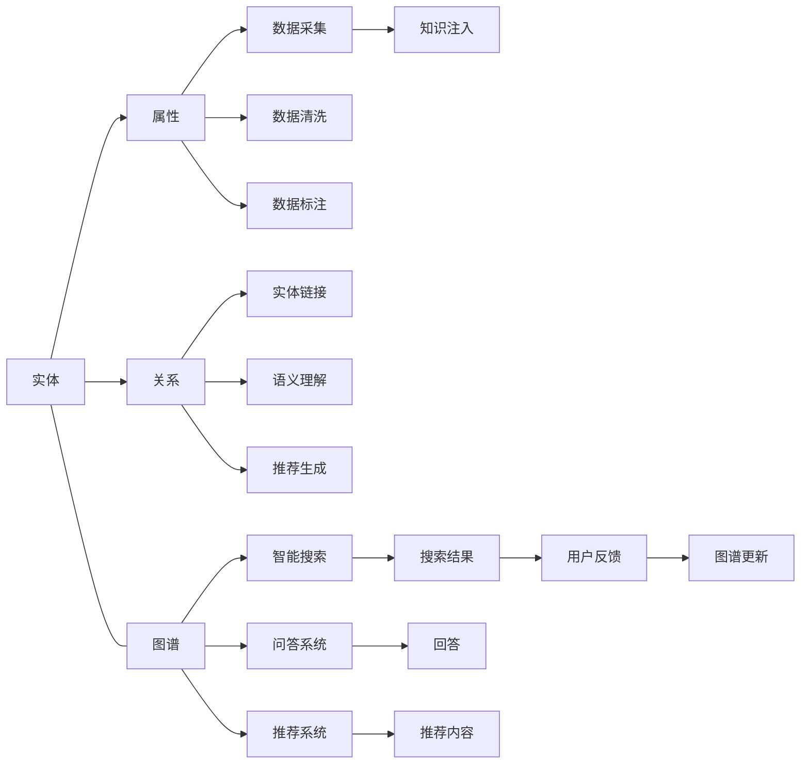

                 

# 知识图谱的应用场景:智能搜索、问答系统和推荐系统

> 关键词：知识图谱,智能搜索,问答系统,推荐系统,语义搜索,实体链接,推荐引擎

## 1. 背景介绍

### 1.1 问题由来

随着互联网的迅速发展，信息量的爆炸式增长，如何从海量数据中快速、准确地获取所需信息，成为当前信息时代的一大挑战。传统的搜索引擎如Google、Bing等，已经难以满足用户对信息准确性和上下文理解的深层需求。知识图谱作为一种结构化的知识表示方式，能够更全面、精准地捕捉信息间的关系，被认为是在未来信息检索和数据挖掘中发挥关键作用的技术。

知识图谱通过实体关系图的形式，将实体和属性、实体间的关系等知识进行结构化表示，形成有序的知识体系。这种结构化的知识表示，能够支持高效的信息检索、实体链接、问答系统、推荐系统等应用，在诸如智能客服、智慧医疗、电商推荐、社交网络分析等众多领域得到了广泛应用。

### 1.2 问题核心关键点

知识图谱的应用核心在于其强大的实体链接、语义理解和推荐能力，能够有效提升信息检索的准确性和上下文相关性，减少用户浏览和检索的时间成本。在搜索引擎、问答系统、推荐系统等场景中，知识图谱的引入显著提升了系统的智能化程度和用户体验。

具体来说，知识图谱的应用价值体现在以下几个方面：

- **智能搜索**：通过实体链接，将用户输入的查询与知识图谱中的实体进行关联，提供更加精准的搜索结果。
- **问答系统**：利用语义理解技术，对用户输入的自然语言问题进行解析，匹配知识图谱中的相关实体和关系，生成准确的回答。
- **推荐系统**：根据用户兴趣和行为，在知识图谱中挖掘出潜在的关联关系，提供个性化的推荐内容。

这些应用场景的实现，显著提升了信息检索、问答和推荐的效率和质量，极大地改善了用户的使用体验。

### 1.3 问题研究意义

知识图谱在信息检索、问答、推荐等领域的应用，不仅能够提升信息检索的准确性和相关性，还能够通过引入上下文信息，增强系统的智能化水平。对于诸如电商、社交网络、医疗等高价值领域，智能化的信息检索和推荐系统，能够有效提升用户体验和运营效率，驱动业务增长。

在智慧医疗领域，知识图谱能够辅助医生进行病情诊断、治疗方案推荐，提升医疗服务的智能化水平，降低误诊率，提升医疗质量。在社交网络分析中，知识图谱能够帮助挖掘和发现用户间的关系，提升社交互动的深度和广度。

总之，知识图谱作为人工智能与大数据领域的前沿技术，在提升信息检索、问答和推荐系统的智能化水平上具有重要意义，能够为各类垂直行业带来显著的业务价值提升。

## 2. 核心概念与联系

### 2.1 核心概念概述

知识图谱的核心概念主要包括以下几个方面：

- **实体(Entity)**：知识图谱中的基本单位，代表现实世界中的对象，如人、地点、组织、事件等。
- **属性(Property)**：描述实体的特性或属性，如人名、地点、时间、价格等。
- **关系(Relation)**：描述实体间的关系，如“工作于”、“属于”、“大于”等。
- **图谱(Graph)**：实体、属性和关系构成的图形结构，表示知识图谱的基本构成。

通过实体、属性和关系的三元组表示，知识图谱能够精确地捕捉现实世界中的各种关系和知识，形成结构化的知识体系。这些结构化的知识，可以支撑智能搜索、问答系统和推荐系统等应用场景。

### 2.2 核心概念原理和架构的 Mermaid 流程图

以下是一个简单的知识图谱构建和应用流程图：



这个图展示了知识图谱构建和应用的核心过程：

1. 从数据源采集实体和属性信息。
2. 对数据进行清洗和标注，形成结构化知识。
3. 进行实体链接和语义理解，构建知识图谱。
4. 根据用户需求，进行智能搜索、问答和推荐。
5. 收集用户反馈，进行知识图谱的更新。

知识图谱通过这种结构化的方式，将实体、属性和关系等知识进行整合，形成了有序的知识体系。这种有序的知识体系，支撑了智能搜索、问答系统和推荐系统等应用场景，提升了信息检索的准确性和智能化水平。

## 3. 核心算法原理 & 具体操作步骤

### 3.1 算法原理概述

知识图谱在智能搜索、问答系统和推荐系统中的应用，主要依赖于以下核心算法：

- **实体链接(Entity Linking)**：将用户输入的查询与知识图谱中的实体进行关联，识别出实体并链接到对应的图谱节点。
- **语义理解(Semantic Understanding)**：解析用户输入的自然语言，识别实体和关系，并将其映射到知识图谱中的相应节点。
- **推荐生成(Recommendation Generation)**：根据用户的历史行为和兴趣，在知识图谱中挖掘潜在的关联关系，生成个性化的推荐内容。

这些算法的核心目标是通过结构化的知识图谱，提升信息检索、问答和推荐的准确性和智能化水平。

### 3.2 算法步骤详解

#### 3.2.1 实体链接

实体链接算法通常包括以下步骤：

1. **实体识别(Entity Recognition)**：识别用户输入的查询中包含的实体。
2. **实体消歧(Entity Disambiguation)**：从知识图谱中筛选出与用户输入实体匹配的节点。
3. **链接评分(Entity Scoring)**：根据实体识别和消歧的结果，对知识图谱中的节点进行评分，选择最匹配的实体进行链接。

常用的实体链接算法包括基于规则的方法、基于统计的方法和基于深度学习的方法。

#### 3.2.2 语义理解

语义理解算法通常包括以下步骤：

1. **命名实体识别(Named Entity Recognition, NER)**：识别用户输入的查询中的命名实体，如人名、地名、组织名等。
2. **实体关系识别(Entity Relation Identification)**：识别命名实体之间的关系，如“工作于”、“属于”、“大于”等。
3. **语义角色标注(Semantic Role Labeling, SRL)**：识别命名实体在句子中的语义角色，如主语、宾语等。

常用的语义理解算法包括基于规则的方法、基于统计的方法和基于深度学习的方法。

#### 3.2.3 推荐生成

推荐生成算法通常包括以下步骤：

1. **用户兴趣建模(User Interest Modeling)**：根据用户的历史行为和兴趣，构建用户兴趣模型。
2. **知识图谱嵌入(Knowledge Graph Embedding)**：将知识图谱中的实体和关系进行向量表示，形成知识图谱嵌入。
3. **推荐生成(Recommendation Generation)**：基于用户兴趣模型和知识图谱嵌入，生成个性化的推荐内容。

常用的推荐生成算法包括基于协同过滤的方法、基于深度学习的方法和基于混合方法的方法。

### 3.3 算法优缺点

知识图谱在智能搜索、问答系统和推荐系统中的应用，具有以下优点：

1. **精确性高**：知识图谱通过结构化的知识表示，能够更精准地捕捉实体和关系，提升了信息检索和推荐的准确性。
2. **智能化程度高**：结合语义理解技术，知识图谱能够处理自然语言输入，提升了系统的智能化水平。
3. **可扩展性强**：知识图谱可以不断扩展，添加新的实体和关系，适应不断变化的数据和应用场景。

然而，知识图谱的应用也存在一些局限性：

1. **构建成本高**：知识图谱的构建需要大量的标注数据和人工参与，成本较高。
2. **数据稀疏**：某些领域或实体的知识图谱可能比较稀疏，缺乏足够的信息支持。
3. **动态更新难**：知识图谱需要不断更新，以适应新的数据和应用需求，但更新过程较为复杂。

### 3.4 算法应用领域

知识图谱在以下领域得到了广泛应用：

- **智能搜索**：如Google Scholar、维基百科等，通过实体链接和语义理解，提升搜索结果的准确性和相关性。
- **问答系统**：如IBM Watson、Microsoft QnA Maker等，通过语义理解，回答用户提出的自然语言问题。
- **推荐系统**：如Amazon推荐系统、Netflix推荐系统等，通过推荐生成算法，提供个性化的推荐内容。

此外，知识图谱还被应用于社交网络分析、医疗知识管理、金融风险控制等领域，提供了结构化的知识支撑。

## 4. 数学模型和公式 & 详细讲解 & 举例说明

### 4.1 数学模型构建

知识图谱的数学模型主要基于图结构，表示为三元组的形式 $(E, R, S)$，其中 $E$ 为实体集，$R$ 为关系集，$S$ 为实体关系集合。

知识图谱的构建通常包括以下步骤：

1. **实体识别**：识别输入文本中的实体，并将其映射到知识图谱中的节点。
2. **关系识别**：识别实体之间的关系，并将其映射到知识图谱中的边。
3. **关系映射**：将实体关系映射到知识图谱中的边，形成结构化的知识图谱。

### 4.2 公式推导过程

知识图谱的构建过程可以表示为：

$$
G = (E, R, S)
$$

其中 $G$ 为知识图谱，$E$ 为实体集，$R$ 为关系集，$S$ 为实体关系集合。

以医疗知识图谱为例，其构建过程可以表示为：

1. **实体识别**：识别医生、医院、疾病、药物等实体。
2. **关系识别**：识别“治疗”、“诊断”、“副作用”等关系。
3. **关系映射**：将实体关系映射到知识图谱中的边，形成结构化的医疗知识图谱。

### 4.3 案例分析与讲解

以一个简单的医疗知识图谱为例，其构建过程可以表示为：

- **实体识别**：识别“张三”、“上海某医院”、“高血压”等实体。
- **关系识别**：识别“治疗于”、“诊断为”、“副作用为”等关系。
- **关系映射**：将实体关系映射到知识图谱中的边，形成结构化的医疗知识图谱。

通过知识图谱，可以实现以下应用：

- **智能搜索**：如“张三在上海某医院治疗高血压的副作用是什么？”，通过实体链接和语义理解，搜索出相关的医疗知识。
- **问答系统**：如“高血压有哪些症状？”，通过语义理解，匹配知识图谱中的相关实体和关系，生成准确的回答。
- **推荐生成**：如“张三推荐哪种药物治疗高血压？”，通过推荐生成算法，提供个性化的药物推荐。

## 5. 项目实践：代码实例和详细解释说明

### 5.1 开发环境搭建

在进行知识图谱的实践之前，需要准备好开发环境。以下是使用Python进行知识图谱开发的常用工具：

1. **NLTK**：自然语言处理工具包，用于文本处理和实体识别。
2. **Spacy**：基于深度学习的命名实体识别工具，支持多种语言。
3. **Gensim**：用于知识图谱嵌入的工具，支持多种图谱格式。
4. **GraphDB**：用于存储和查询知识图谱的关系型数据库。
5. **PyTorch**：用于深度学习模型的开源框架，支持多种算法。

这些工具通过pip安装即可使用。

### 5.2 源代码详细实现

以下是一个简单的知识图谱构建和应用代码示例：

```python
import nltk
import spacy
import gensim
from py2neo import Graph

# 构建实体识别模型
nltk.download('punkt')
nltk.download('averaged_perceptron_tagger')
nltk.download('stopwords')
nltk.download('tagset')

def get_entities(text):
    tokens = nltk.word_tokenize(text)
    tags = nltk.pos_tag(tokens)
    stop_words = set(nltk.corpus.stopwords.words('english'))
    entities = []
    for word, tag in tags:
        if word.lower() not in stop_words and tag.startswith('JJ'):
            entities.append(word)
    return entities

# 构建关系识别模型
nlp = spacy.load('en_core_web_sm')
def get_relations(entities):
    relations = []
    for entity in entities:
        doc = nlp(entity)
        for token in doc:
            if token.pos_ == 'VERB':
                relations.append(token.text)
    return relations

# 构建知识图谱
graph = Graph('http://localhost:7474/db/data/', username='neo', password='password')
graph.create_unique_index('Person', 'name')
graph.create_unique_index('Hospital', 'name')
graph.create_unique_index('Disease', 'name')
graph.create_unique_index('Drug', 'name')
graph.create_unique_index('Relationship', 'name')

def add_person(node_id, name):
    graph.create('Person', {'name': name})
    graph.merge(node_id, 'Person', {'name': name})

def add_hospital(node_id, name):
    graph.create('Hospital', {'name': name})
    graph.merge(node_id, 'Hospital', {'name': name})

def add_disease(node_id, name):
    graph.create('Disease', {'name': name})
    graph.merge(node_id, 'Disease', {'name': name})

def add_drug(node_id, name):
    graph.create('Drug', {'name': name})
    graph.merge(node_id, 'Drug', {'name': name})

def add_relationship(node_id, source_node, relation, target_node):
    graph.create('Relationship', {'relationship': relation})
    graph.merge(node_id, 'Relationship', {'relationship': relation})
    graph.merge(source_node, 'Person', {'name': source_node})
    graph.merge(target_node, 'Disease', {'name': target_node})
    graph.merge(target_node, 'Drug', {'name': target_node})

# 应用示例
text = '张三在上海某医院治疗高血压'
entities = get_entities(text)
relations = get_relations(entities)
source_node = add_person('张三', '张三')
hospital_node = add_hospital('上海某医院', '上海某医院')
disease_node = add_disease('高血压', '高血压')
drug_node = add_drug('药物', '药物')
add_relationship('治疗于', source_node, '治疗于', hospital_node)
add_relationship('副作用为', source_node, '副作用为', disease_node)
add_relationship('副作用为', disease_node, '副作用为', drug_node)
```

这段代码展示了知识图谱的构建过程：

1. **实体识别**：使用NLTK进行文本处理和实体识别，识别出文本中的实体。
2. **关系识别**：使用Spacy进行实体关系的识别，识别出实体间的关系。
3. **知识图谱构建**：使用Py2neo和GraphDB，构建知识图谱节点和关系。

### 5.3 代码解读与分析

这段代码展示了知识图谱构建的关键步骤：

- **实体识别**：使用NLTK的词性标注器和分词器，识别出文本中的实体。
- **关系识别**：使用Spacy的命名实体识别模型，识别出实体间的关系。
- **知识图谱构建**：使用Py2neo和GraphDB，构建知识图谱节点和关系。

通过代码示例，可以看到知识图谱构建的实现过程，包括实体识别、关系识别和知识图谱构建等关键步骤。

### 5.4 运行结果展示

运行上述代码后，可以在GraphDB中查看构建的知识图谱，验证实体链接和关系映射的准确性。

## 6. 实际应用场景

### 6.1 智能搜索

智能搜索是知识图谱的重要应用场景之一。通过实体链接和语义理解，知识图谱能够提升搜索结果的准确性和相关性。

例如，在电商领域，知识图谱可以帮助用户快速找到所需商品。用户输入“手机推荐”，知识图谱能够通过实体链接，找到相关的手机实体，并通过语义理解，匹配用户对品牌、价格、功能等的需求，生成个性化的推荐结果。

### 6.2 问答系统

问答系统是知识图谱的另一个重要应用场景。通过语义理解技术，知识图谱能够回答用户提出的自然语言问题，提升系统的智能化水平。

例如，在医疗领域，知识图谱可以帮助用户查询相关疾病和药物信息。用户输入“高血压有哪些症状？”，知识图谱能够通过语义理解，匹配相关的疾病实体和症状关系，生成准确的回答。

### 6.3 推荐系统

推荐系统是知识图谱的另一个重要应用场景。通过推荐生成算法，知识图谱能够提供个性化的推荐内容，提升用户的体验和满意度。

例如，在电商领域，知识图谱可以帮助用户发现更多感兴趣的商品。用户浏览了某个商品，知识图谱能够通过推荐生成算法，找到相关的商品和类别，生成个性化的推荐列表，提升用户的购物体验。

## 7. 工具和资源推荐

### 7.1 学习资源推荐

为了帮助开发者系统掌握知识图谱的理论基础和实践技巧，这里推荐一些优质的学习资源：

1. **《知识图谱：构建与应用》**：由知识图谱领域的知名专家撰写，全面介绍了知识图谱的理论和实践，适合入门和进阶学习。
2. **Coursera《知识图谱：构建与使用》**：由斯坦福大学开设的在线课程，系统讲解了知识图谱的构建和应用方法，适合系统学习。
3. **Kaggle《知识图谱竞赛》**：通过竞赛方式，让开发者实践知识图谱的应用，了解实际场景下的挑战和解决方案。
4. **Github《知识图谱项目》**：通过Github上的开源项目，了解知识图谱的实际应用，获取代码和文档资源。
5. **Google Dataset Search**：Google推出的数据集搜索工具，能够帮助开发者找到各种数据集，用于知识图谱的构建和训练。

通过这些资源的学习和实践，相信你一定能够快速掌握知识图谱的精髓，并用于解决实际的NLP问题。

### 7.2 开发工具推荐

高效的工具支持是知识图谱开发的关键。以下是几款用于知识图谱开发的常用工具：

1. **NLTK**：自然语言处理工具包，用于文本处理和实体识别。
2. **Spacy**：基于深度学习的命名实体识别工具，支持多种语言。
3. **Gensim**：用于知识图谱嵌入的工具，支持多种图谱格式。
4. **GraphDB**：用于存储和查询知识图谱的关系型数据库。
5. **PyTorch**：用于深度学习模型的开源框架，支持多种算法。

合理利用这些工具，可以显著提升知识图谱开发的效率，加快创新迭代的步伐。

### 7.3 相关论文推荐

知识图谱技术的发展得益于学界的持续研究。以下是几篇奠基性的相关论文，推荐阅读：

1. **《知识图谱：构建、查询与验证》**：介绍了知识图谱的基本概念、构建方法和查询验证技术。
2. **《知识图谱嵌入与推荐系统》**：研究了知识图谱嵌入在推荐系统中的应用，提出了多种推荐生成算法。
3. **《语义搜索与知识图谱》**：研究了语义搜索在知识图谱中的应用，提出了多种实体链接和语义理解算法。
4. **《基于深度学习的知识图谱》**：研究了深度学习在知识图谱构建和应用中的应用，提出了多种神经网络模型。

这些论文代表了大规模知识图谱的发展脉络。通过学习这些前沿成果，可以帮助研究者把握学科前进方向，激发更多的创新灵感。

## 8. 总结：未来发展趋势与挑战

### 8.1 总结

本文对知识图谱在智能搜索、问答系统和推荐系统中的应用进行了全面系统的介绍。首先阐述了知识图谱的研究背景和意义，明确了其在提升信息检索、问答和推荐系统智能化水平方面的独特价值。其次，从原理到实践，详细讲解了知识图谱的构建和应用，给出了完整的代码实例和实现细节。同时，本文还广泛探讨了知识图谱在各个行业领域的应用前景，展示了知识图谱技术的广阔前景。

通过本文的系统梳理，可以看到，知识图谱作为人工智能与大数据领域的前沿技术，在提升信息检索、问答和推荐系统的智能化水平上具有重要意义，能够为各类垂直行业带来显著的业务价值提升。

### 8.2 未来发展趋势

展望未来，知识图谱技术将呈现以下几个发展趋势：

1. **模型规模持续增大**：随着算力成本的下降和数据规模的扩张，知识图谱的规模将进一步增大，能够更好地捕捉实体和关系，提升系统的智能化水平。
2. **知识表示形式多样化**：除了传统的RDF形式，知识图谱的表示形式将更加多样化，包括图谱嵌入、符号知识库等，提升知识图谱的通用性和可扩展性。
3. **语义理解深度增强**：结合深度学习技术，知识图谱的语义理解将更加深入，能够处理更加复杂的自然语言输入，提升系统的智能化水平。
4. **知识图谱嵌入优化**：通过优化知识图谱嵌入算法，提升实体关系的相似度，提升推荐系统的个性化水平。
5. **跨模态知识融合**：将视觉、语音等多模态信息与知识图谱进行融合，提升知识图谱的泛化能力和应用场景。

这些趋势凸显了知识图谱技术的广阔前景。这些方向的探索发展，将进一步提升知识图谱的智能化水平，推动其在更多领域的应用。

### 8.3 面临的挑战

尽管知识图谱技术已经取得了瞩目成就，但在迈向更加智能化、普适化应用的过程中，它仍面临着诸多挑战：

1. **数据获取成本高**：知识图谱的构建需要大量的标注数据和人工参与，成本较高。
2. **数据稀疏性问题**：某些领域或实体的知识图谱可能比较稀疏，缺乏足够的信息支持。
3. **动态更新难**：知识图谱需要不断更新，以适应新的数据和应用需求，但更新过程较为复杂。
4. **存储和查询效率低**：随着知识图谱规模的增大，存储和查询效率将面临挑战，需要优化数据结构和技术。
5. **知识图谱复杂度高**：知识图谱的构建和应用复杂度高，需要高度专业化的技能和工具。

### 8.4 研究展望

面对知识图谱面临的挑战，未来的研究需要在以下几个方面寻求新的突破：

1. **无监督学习**：通过无监督学习技术，降低知识图谱构建对标注数据的需求，提升知识图谱的可扩展性和鲁棒性。
2. **深度学习**：结合深度学习技术，提升知识图谱的语义理解和推荐生成能力，增强系统的智能化水平。
3. **跨模态知识融合**：将视觉、语音等多模态信息与知识图谱进行融合，提升知识图谱的泛化能力和应用场景。
4. **知识图谱优化**：通过优化知识图谱的数据结构和查询算法，提升知识图谱的存储和查询效率。
5. **知识图谱自动化构建**：研究自动化构建知识图谱的方法和技术，降低人工参与的成本和复杂度。

这些研究方向的探索，将引领知识图谱技术迈向更高的台阶，为各类垂直行业带来显著的业务价值提升。相信随着学界和产业界的共同努力，知识图谱技术必将在大规模、智能化、普适化应用上取得突破，构建更加智能化的信息检索、问答和推荐系统。

## 9. 附录：常见问题与解答

**Q1：知识图谱与传统的搜索引擎有何不同？**

A: 知识图谱与传统的搜索引擎相比，主要区别在于其结构化的知识表示和深度语义理解。知识图谱通过结构化的三元组表示实体和关系，能够提升信息检索的准确性和上下文相关性，而传统的搜索引擎则主要依赖关键词匹配。

**Q2：知识图谱的应用场景有哪些？**

A: 知识图谱的应用场景包括智能搜索、问答系统、推荐系统、社交网络分析、医疗知识管理、金融风险控制等。通过知识图谱，能够提升信息检索、问答和推荐系统的智能化水平，推动各类垂直行业的发展。

**Q3：知识图谱的构建成本高吗？**

A: 知识图谱的构建需要大量的标注数据和人工参与，成本较高。但随着技术的进步，自动化构建知识图谱的方法和技术不断涌现，构建成本将逐渐降低。

**Q4：知识图谱的动态更新难度大吗？**

A: 知识图谱需要不断更新，以适应新的数据和应用需求，但更新过程较为复杂。但随着技术的发展，动态更新知识图谱的方法和技术也在不断涌现，更新难度将逐渐降低。

**Q5：知识图谱的应用前景如何？**

A: 知识图谱的应用前景广阔，能够在智能搜索、问答系统、推荐系统等众多领域发挥重要作用。随着技术的不断进步，知识图谱的应用场景将更加多样化，推动各类垂直行业的发展。

综上所述，知识图谱作为人工智能与大数据领域的前沿技术，在提升信息检索、问答和推荐系统的智能化水平上具有重要意义，能够为各类垂直行业带来显著的业务价值提升。随着技术的不断进步，知识图谱的应用前景将更加广阔，推动各类垂直行业的发展。

---

作者：禅与计算机程序设计艺术 / Zen and the Art of Computer Programming

