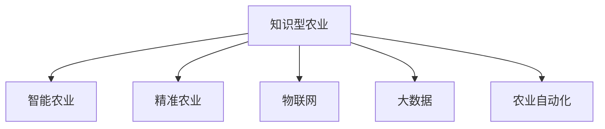

                 

# 知识型农业的发展与挑战

> 关键词：知识型农业, 智能农业, 精准农业, 大数据, 物联网, 农业自动化

## 1. 背景介绍

### 1.1 问题由来

随着科技的迅猛发展，人类社会在各行各业都发生了翻天覆地的变化。农业作为人类社会的基石，也不例外。传统的农业生产方式以人力和土地为基础，受制于自然环境和社会经济因素的制约，生产效率低下，资源浪费严重。然而，随着信息技术的进步，特别是大数据、人工智能、物联网等新兴技术的引入，农业产业正在经历一场深刻的变革。

知识型农业，作为现代农业发展的高级阶段，是信息技术与农业生产深度融合的产物。它利用现代科技手段，对农业生产全流程进行智能化、精准化、数据化的管理，通过分析海量数据，优化种植方案，提高资源利用效率，从而实现可持续、高效、环保的农业生产目标。

### 1.2 问题核心关键点

知识型农业的核心关键点在于其对数据驱动、智能决策和精准管理的依赖。具体而言，包括以下几个方面：

- **数据驱动**：农业生产涉及大量的环境数据和作物数据，通过数据分析可以科学地指导农业生产，提高生产效率和产量。
- **智能决策**：利用人工智能算法对农业数据进行建模，可以自动化地作出生产决策，降低人力成本，提升生产质量。
- **精准管理**：借助精确的传感器和设备，实现对农业生产环境的精确监控和作物生长的精确管理。

这些关键点共同构成了知识型农业的特征，使得其能够实现从传统农业向现代农业的跨越。

## 2. 核心概念与联系

### 2.1 核心概念概述

为了更好地理解知识型农业的发展与挑战，本节将介绍几个密切相关的核心概念：

- **知识型农业**：是指利用信息技术对农业生产进行智能化、精准化管理的农业生产方式，强调数据驱动、智能决策和精准管理。
- **智能农业**：通过自动化设备和人工智能技术，实现农业生产的自动化、智能化管理，提高生产效率。
- **精准农业**：利用精确的传感器和设备，对农业生产环境进行精确监控和作物生长进行精确管理，提升资源利用效率。
- **物联网(IoT)**：通过传感器、通信技术和云平台，实现农业生产环境的数据采集和实时监控。
- **大数据**：海量农业数据的收集、存储和分析，为农业生产决策提供科学依据。
- **农业自动化**：利用机械、设备和智能系统，实现农业生产过程的自动化和智能化管理。

这些核心概念之间的逻辑关系可以通过以下Mermaid流程图来展示：



这个流程图展示了这个领域的基本概念及其之间的关系：

1. 知识型农业是以智能农业、精准农业、物联网、大数据和农业自动化为基础的高级发展阶段。
2. 智能农业和精准农业是知识型农业的重要组成部分，通过自动化和智能化手段，提升农业生产效率。
3. 物联网和大数据提供了农业生产环境的数据采集和分析基础，为决策提供支持。
4. 农业自动化是实现农业生产过程自动化的核心技术手段。

## 3. 核心算法原理 & 具体操作步骤

### 3.1 算法原理概述

知识型农业的核心算法原理在于数据驱动和智能决策。具体来说，通过物联网和大数据技术采集和分析农业生产环境的数据，结合智能算法对农业生产进行优化和决策。

知识型农业的算法原理包括以下几个方面：

- **数据采集**：利用传感器和物联网设备采集农业生产环境的数据，如土壤湿度、温度、光照、气象等。
- **数据存储与处理**：通过云平台和大数据技术，对采集到的数据进行存储和处理，生成结构化的数据集。
- **智能算法**：利用机器学习和深度学习算法，对农业生产数据进行建模和预测，优化种植方案，指导生产决策。
- **决策支持**：结合专家知识和规则库，利用智能决策系统对农业生产进行自动化管理，提升生产效率。

### 3.2 算法步骤详解

知识型农业的算法步骤通常包括以下几个关键步骤：

**Step 1: 数据采集与预处理**
- 部署传感器和物联网设备，采集农业生产环境的数据。
- 清洗和整理数据，去除噪音和不一致性，生成结构化的数据集。

**Step 2: 数据建模与分析**
- 选择合适的算法模型，如回归分析、分类、聚类等，对农业生产数据进行建模。
- 利用机器学习算法，如随机森林、支持向量机等，对数据进行分析和预测。

**Step 3: 智能决策与优化**
- 利用深度学习算法，如卷积神经网络(CNN)、循环神经网络(RNN)等，对农业生产数据进行进一步建模和优化。
- 结合专家知识和规则库，利用智能决策系统进行自动化管理。

**Step 4: 实施与评估**
- 根据智能决策系统的输出，调整农业生产方案。
- 实时监控农业生产过程，评估优化效果，持续改进。

### 3.3 算法优缺点

知识型农业的算法具有以下优点：

- **提升效率**：通过数据分析和智能决策，提高农业生产效率，减少资源浪费。
- **降低成本**：自动化和智能化手段降低了人力成本，提升生产质量。
- **科学决策**：基于数据的决策更加科学和可靠，提升生产质量。

同时，该算法也存在一些局限性：

- **数据依赖**：算法效果依赖于数据质量和数据完整性，数据采集和预处理是关键。
- **技术复杂**：算法模型和智能决策系统需要较高的技术门槛，需要专业人才维护。
- **初期投入高**：传感器和物联网设备的部署需要较高的初期投入，且需要专业知识和技术支持。

尽管如此，知识型农业的算法仍为农业生产提供了一种高效的解决方案，具有广阔的应用前景。

### 3.4 算法应用领域

知识型农业的算法应用领域非常广泛，涵盖了农业生产的各个环节：

- **种植管理**：通过数据分析和智能决策，优化种植方案，提高作物产量和质量。
- **病虫害防治**：利用智能算法对病虫害进行预测和监控，及时采取防治措施。
- **土壤管理**：对土壤数据进行分析，指导施肥和土壤管理，提高土壤肥力。
- **水资源管理**：通过数据分析和智能决策，优化灌溉系统，提高水资源利用效率。
- **气象预测**：利用气象数据分析，预测天气变化，指导农业生产。

这些应用领域体现了知识型农业算法的强大能力和广泛应用前景。

## 4. 数学模型和公式 & 详细讲解 & 举例说明

### 4.1 数学模型构建

知识型农业的核心数学模型通常基于农业生产数据的分析与建模。以下是一个简单的线性回归模型为例：

假设农业生产数据可以表示为：

$$
y_i = \beta_0 + \beta_1 x_{i1} + \beta_2 x_{i2} + \cdots + \beta_p x_{ip} + \epsilon_i
$$

其中，$y_i$ 表示第 $i$ 个样本的目标变量，$x_{ij}$ 表示第 $i$ 个样本的第 $j$ 个特征，$\beta_j$ 表示第 $j$ 个特征的系数，$\epsilon_i$ 表示误差项。

利用最小二乘法对模型进行估计，得到系数估计值：

$$
\hat{\beta} = (X^TX)^{-1}X^Ty
$$

其中，$X$ 表示特征矩阵，$Y$ 表示目标变量向量。

### 4.2 公式推导过程

线性回归模型的推导过程如下：

- **最小二乘法的目标函数**：

$$
\text{最小化} \quad \sum_{i=1}^n (y_i - \hat{y}_i)^2
$$

其中，$\hat{y}_i = \beta_0 + \beta_1 x_{i1} + \beta_2 x_{i2} + \cdots + \beta_p x_{ip}$。

- **对系数进行估计**：

$$
\hat{\beta} = (X^TX)^{-1}X^Ty
$$

其中，$X = [x_{i1}, x_{i2}, \cdots, x_{ip}]$，$Y = [y_1, y_2, \cdots, y_n]$。

- **误差项的估计**：

$$
\epsilon_i = y_i - \hat{y}_i = y_i - (\beta_0 + \beta_1 x_{i1} + \beta_2 x_{i2} + \cdots + \beta_p x_{ip})
$$

- **模型的预测**：

$$
\hat{y} = \beta_0 + \beta_1 x_1 + \beta_2 x_2 + \cdots + \beta_p x_p
$$

以上公式展示了线性回归模型的构建和推导过程。

### 4.3 案例分析与讲解

假设某农业项目需要优化施肥方案，已知过去一年中每天的气象数据和施肥量，以及最终的作物产量。以下是数据集和模型的构建步骤：

1. **数据准备**：收集过去一年中每天的气象数据和施肥量，以及最终的作物产量。
2. **特征工程**：对气象数据进行处理，生成用于回归分析的特征。
3. **模型训练**：利用线性回归模型对施肥量进行建模，预测最优施肥量。
4. **模型评估**：利用测试集评估模型的预测效果，进行优化。

以下是Python代码实现：

```python
import pandas as pd
from sklearn.linear_model import LinearRegression
from sklearn.metrics import mean_squared_error

# 读取数据集
data = pd.read_csv('fertilizer.csv')

# 特征工程
X = data[['temperature', 'rainfall', 'wind_speed']]
y = data['yield']

# 模型训练
model = LinearRegression()
model.fit(X, y)

# 模型预测
y_pred = model.predict(X)

# 模型评估
mse = mean_squared_error(y, y_pred)
print('Mean Squared Error:', mse)
```

通过上述代码，可以构建一个简单的线性回归模型，预测最优施肥量，从而优化作物产量。

## 5. 项目实践：代码实例和详细解释说明

### 5.1 开发环境搭建

在进行知识型农业项目的开发时，需要准备以下开发环境：

1. **Python环境**：安装Python 3.x版本，推荐使用Anaconda环境管理工具。
2. **科学计算库**：安装常用的科学计算库，如NumPy、Pandas、Scikit-learn等。
3. **机器学习库**：安装机器学习库，如Scikit-learn、TensorFlow、Keras等。
4. **数据处理库**：安装数据处理库，如pandas、NumPy等。
5. **可视化工具**：安装可视化工具，如Matplotlib、Seaborn等。

### 5.2 源代码详细实现

以下是使用Python和Scikit-learn库实现的知识型农业项目的代码实现。

**数据准备与预处理**：

```python
import pandas as pd
from sklearn.preprocessing import StandardScaler

# 读取数据集
data = pd.read_csv('agriculture_data.csv')

# 数据预处理
X = data[['temperature', 'rainfall', 'wind_speed']]
y = data['yield']

# 特征标准化
scaler = StandardScaler()
X = scaler.fit_transform(X)
```

**模型训练与评估**：

```python
from sklearn.linear_model import LinearRegression
from sklearn.metrics import mean_squared_error

# 模型训练
model = LinearRegression()
model.fit(X, y)

# 模型预测
y_pred = model.predict(X)

# 模型评估
mse = mean_squared_error(y, y_pred)
print('Mean Squared Error:', mse)
```

**可视化分析**：

```python
import matplotlib.pyplot as plt
import seaborn as sns

# 可视化分析
sns.lineplot(x=range(len(X)), y=y, label='Actual Yield')
sns.lineplot(x=range(len(X)), y=y_pred, label='Predicted Yield')
plt.legend()
plt.show()
```

### 5.3 代码解读与分析

以下是关键代码的解读和分析：

- **数据准备与预处理**：通过读取数据集，进行特征工程和标准化处理，为模型训练做准备。
- **模型训练与评估**：利用线性回归模型进行训练和预测，计算均方误差作为评估指标。
- **可视化分析**：通过可视化工具，展示模型预测结果与实际产量的对比。

## 6. 实际应用场景

### 6.1 智能灌溉系统

智能灌溉系统是知识型农业的重要应用之一。传统灌溉方式往往存在水资源浪费和效率低下的问题，而智能灌溉系统通过物联网传感器实时监控土壤湿度、温度等环境数据，自动调整灌溉策略，实现精准灌溉。

具体而言，可以部署土壤湿度传感器和气象监测设备，收集农业生产环境数据。通过数据分析，生成灌溉计划，实时监控和调整灌溉系统，确保作物获得最佳的水分供应。

### 6.2 病虫害监测与防治

病虫害是农业生产中的常见问题，传统防治方式往往依赖人工识别和手动喷洒农药，效率低下且效果不理想。智能病虫害监测系统可以通过物联网设备实时采集作物健康数据，利用智能算法进行病虫害预测和防治。

具体而言，可以部署摄像头和传感器，监测作物生长状态和病虫害发生情况。通过数据分析和智能决策，及时采取防治措施，减少农药使用，提高防治效果。

### 6.3 土壤监测与施肥管理

土壤是农业生产的基础，土壤监测与施肥管理是知识型农业的重要组成部分。通过智能土壤监测系统，可以实时采集土壤湿度、养分含量等数据，指导施肥管理，提高土壤肥力。

具体而言，可以部署土壤湿度传感器和养分检测设备，实时监测土壤环境。通过数据分析和智能决策，生成施肥计划，实时调整施肥量，确保作物获得最佳的生长条件。

### 6.4 未来应用展望

未来，知识型农业将进一步向智能化、自动化、数据化方向发展，实现更加精准、高效、环保的农业生产。

- **智能化**：通过人工智能算法和大数据分析，实现农业生产的自动化管理，降低人力成本，提升生产效率。
- **自动化**：利用自动化设备和系统，实现农业生产过程的自动化管理，提高生产效率和质量。
- **数据化**：利用大数据技术，对农业生产数据进行全面分析和管理，为决策提供科学依据。

## 7. 工具和资源推荐

### 7.1 学习资源推荐

为了帮助开发者系统掌握知识型农业的理论基础和实践技巧，这里推荐一些优质的学习资源：

1. **《智能农业与精准农业》**：详细介绍智能农业和精准农业的基本概念、原理和技术。
2. **《农业大数据分析与可视化》**：讲解农业大数据采集、存储、分析和可视化的全流程。
3. **《机器学习与农业智能化》**：介绍机器学习算法在农业智能化中的应用，包括数据预处理、模型构建、评估和优化等。
4. **Kaggle农业数据集**：提供丰富的农业数据集和竞赛，帮助开发者进行实践和练习。
5. **Coursera农业大数据课程**：由斯坦福大学等知名高校提供的农业大数据相关课程，涵盖农业数据分析、机器学习、农业智能等多个领域。

### 7.2 开发工具推荐

在知识型农业的开发中，以下工具可以帮助开发者提高效率：

1. **Python**：作为数据科学和机器学习的标准编程语言，Python提供了丰富的科学计算和机器学习库，如NumPy、Pandas、Scikit-learn等。
2. **Jupyter Notebook**：支持代码块和可视化图表的交互式开发环境，方便进行实验和演示。
3. **TensorFlow**：谷歌开发的深度学习框架，提供了强大的计算图和分布式训练能力，适合复杂模型的构建和训练。
4. **Keras**：高层深度学习框架，基于TensorFlow等低层框架构建，提供了简单易用的API，方便快速原型开发。
5. **PyTorch**：Facebook开发的深度学习框架，提供了动态计算图和灵活的模型构建方式，适合快速迭代和实验。

### 7.3 相关论文推荐

知识型农业的发展离不开学界的持续研究。以下是几篇奠基性的相关论文，推荐阅读：

1. **《基于机器学习的农业生产优化》**：提出机器学习在农业生产中的应用，包括数据采集、模型构建和优化等。
2. **《物联网技术在农业中的应用》**：介绍物联网技术在农业生产中的应用，涵盖数据采集、传感器部署和智能决策等。
3. **《大数据与农业智能化》**：探讨大数据技术在农业智能化中的应用，涵盖数据采集、存储、分析和可视化等。
4. **《知识型农业：未来农业的智能之路》**：深入探讨知识型农业的基本概念、原理和应用场景，展望未来发展趋势。
5. **《农业物联网系统的设计与实现》**：介绍农业物联网系统的设计原理和实现方法，涵盖传感器部署、数据采集和智能决策等。

## 8. 总结：未来发展趋势与挑战

### 8.1 研究成果总结

知识型农业的研究成果主要集中在以下几个方面：

1. **数据驱动的农业生产管理**：通过数据分析和机器学习算法，实现农业生产的自动化和智能化管理。
2. **智能灌溉与病虫害防治**：利用物联网传感器和智能算法，优化灌溉系统和病虫害防治策略，提高生产效率和效果。
3. **土壤监测与施肥管理**：通过土壤监测系统和大数据分析，优化施肥计划，提高土壤肥力和作物产量。
4. **数据化农业生产决策**：利用大数据技术，全面分析农业生产数据，为决策提供科学依据。

### 8.2 未来发展趋势

知识型农业的未来发展趋势主要包括以下几个方面：

1. **智能化**：通过人工智能算法和大数据分析，实现农业生产的自动化管理，降低人力成本，提升生产效率。
2. **自动化**：利用自动化设备和系统，实现农业生产过程的自动化管理，提高生产效率和质量。
3. **数据化**：利用大数据技术，对农业生产数据进行全面分析和管理，为决策提供科学依据。
4. **精准化**：通过精确的传感器和设备，实现对农业生产环境的精确监控和作物生长的精确管理。
5. **可持续化**：通过智能决策和资源优化，提高农业生产的可持续性和环保性。

### 8.3 面临的挑战

尽管知识型农业的前景广阔，但在实践中仍面临诸多挑战：

1. **数据获取与处理**：数据获取和处理是知识型农业的基础，但数据质量、数据完整性和数据获取成本是关键问题。
2. **技术门槛**：知识型农业需要较高的技术门槛，涉及数据分析、机器学习、自动化等多个领域，需要专业知识和技术支持。
3. **初期投入高**：传感器和物联网设备的部署需要较高的初期投入，且需要专业知识和技术支持。
4. **系统集成复杂**：知识型农业需要多个系统协同工作，如传感器、物联网、数据分析和智能决策等，系统集成复杂。

### 8.4 研究展望

未来，知识型农业需要在以下几个方面进行深入研究：

1. **数据获取与处理**：探索高效的数据采集和处理技术，提高数据质量和数据完整性，降低数据获取成本。
2. **技术优化与集成**：优化知识型农业系统的各个环节，提高系统的稳定性和可靠性，降低技术门槛。
3. **模型优化与优化**：开发更加高效和精确的模型，提高模型的预测准确率和泛化能力。
4. **知识管理与融合**：将专家知识和规则库与机器学习模型进行有机结合，提升系统的智能化水平。
5. **可持续发展**：探索可持续农业生产的新模式，实现资源高效利用和环境保护。

## 9. 附录：常见问题与解答

**Q1：知识型农业与传统农业有何区别？**

A: 知识型农业与传统农业的最大区别在于其对数据驱动和智能决策的依赖。传统农业主要依赖人力和经验，缺乏科学依据。而知识型农业通过数据分析和机器学习算法，科学指导农业生产，提高生产效率和质量。

**Q2：知识型农业需要哪些技术支持？**

A: 知识型农业需要以下技术支持：

- **物联网(IoT)**：通过传感器和通信技术，实时采集农业生产环境的数据。
- **大数据**：海量农业数据的收集、存储和分析，为农业生产决策提供科学依据。
- **人工智能**：利用机器学习和深度学习算法，对农业生产数据进行建模和预测，优化种植方案，指导生产决策。
- **自动化技术**：利用自动化设备和系统，实现农业生产过程的自动化管理。

**Q3：知识型农业面临哪些挑战？**

A: 知识型农业面临以下挑战：

- **数据获取与处理**：数据获取和处理是知识型农业的基础，但数据质量、数据完整性和数据获取成本是关键问题。
- **技术门槛**：知识型农业需要较高的技术门槛，涉及数据分析、机器学习、自动化等多个领域，需要专业知识和技术支持。
- **初期投入高**：传感器和物联网设备的部署需要较高的初期投入，且需要专业知识和技术支持。
- **系统集成复杂**：知识型农业需要多个系统协同工作，如传感器、物联网、数据分析和智能决策等，系统集成复杂。

**Q4：知识型农业的未来发展趋势是什么？**

A: 知识型农业的未来发展趋势主要包括以下几个方面：

- **智能化**：通过人工智能算法和大数据分析，实现农业生产的自动化管理，降低人力成本，提升生产效率。
- **自动化**：利用自动化设备和系统，实现农业生产过程的自动化管理，提高生产效率和质量。
- **数据化**：利用大数据技术，对农业生产数据进行全面分析和管理，为决策提供科学依据。
- **精准化**：通过精确的传感器和设备，实现对农业生产环境的精确监控和作物生长的精确管理。
- **可持续化**：通过智能决策和资源优化，提高农业生产的可持续性和环保性。

---

作者：禅与计算机程序设计艺术 / Zen and the Art of Computer Programming

