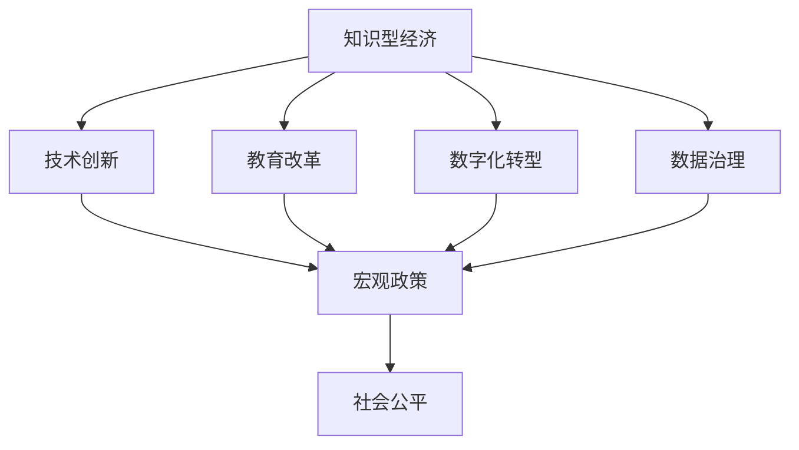

                 

# 知识型经济的宏观政策导向

> 关键词：知识型经济,宏观政策,技术创新,教育改革,数字化转型,社会公平,数据治理

## 1. 背景介绍

### 1.1 问题由来

21世纪以来，全球经济结构发生深刻变化，知识型经济逐渐成为主导力量。传统的制造业和服务业虽然仍然占据重要地位，但技术创新和知识积累的重要性日益凸显。知识型经济以技术知识为核心驱动力，促进了新产品、新工艺和新商业模式的不断涌现，推动了经济增长方式的转型升级。

这一趋势下，各国政府纷纷调整经济政策，积极推动技术创新、教育改革和数字化转型，以期在知识型经济竞赛中占据有利位置。然而，如何制定科学合理的宏观政策，有效促进知识型经济发展，仍然是一个需要深入研究和探讨的重要问题。

### 1.2 问题核心关键点

知识型经济的核心在于技术创新和知识积累，涉及教育、科技、产业、人才等多方面因素。宏观政策导向的核心关键点包括：

- 鼓励创新：如何营造有利于创新的环境，激发企业和科研机构的活力。
- 人才培育：如何培养和吸引优秀科技人才，构建人才供应链。
- 教育改革：如何改革教育体系，适应知识型经济发展需要。
- 产业转型：如何推动传统产业向知识型产业转型，提升产业竞争力。
- 数据治理：如何管理和利用数据资产，释放数据红利。
- 社会公平：如何平衡经济发展和技术知识获取的不均衡，促进社会公平。

这些关键点共同构成了知识型经济宏观政策的主要方向，需要通过政策手段协同推进，形成良性循环。

## 2. 核心概念与联系

### 2.1 核心概念概述

为了更好地理解知识型经济的宏观政策导向，我们需要梳理几个关键概念：

- 知识型经济：以知识和信息为核心的经济形态，强调技术创新和知识积累在经济发展中的主导作用。
- 宏观政策：国家或地区为实现特定经济和社会目标，通过法律法规、财政、税收、货币等手段进行调控的政策体系。
- 技术创新：通过研发新产品、新技术和新服务，实现产品和生产过程的改进。
- 教育改革：通过课程设置、教学方法、评价体系等改革，提升教育质量，培养创新型人才。
- 数字化转型：通过信息技术应用，实现业务流程、组织架构和商业模式的全面变革。
- 数据治理：通过立法、管理和利用数据资源，促进数据在经济发展中的应用。
- 社会公平：通过政策手段，确保不同社会群体在获取知识和技术方面的平等机会。

这些概念之间的逻辑关系可以通过以下Mermaid流程图来展示：



这个流程图展示知识型经济与其核心组成要素之间的联系，以及宏观政策如何通过技术创新、教育改革、数字化转型、数据治理和促进社会公平等多种手段实现知识型经济的发展目标。

## 3. 核心算法原理 & 具体操作步骤

### 3.1 算法原理概述

知识型经济的宏观政策导向，本质上是一个多目标优化问题。其目标在于通过各种政策手段，最大化技术创新能力、提升教育质量、推动数字化转型、优化数据治理、促进社会公平，从而实现知识型经济的高质量发展。

这一过程可以通过一系列的算法和政策工具实现。具体而言，可以采用以下算法原理：

1. **多目标优化算法**：通过设定多个优化目标，综合平衡技术创新、教育、数字化、数据治理和社会公平等要素，实现多目标优化。
2. **模糊决策算法**：通过模糊数学理论，对政策效果进行模糊评估和决策，提高决策的灵活性和适应性。
3. **博弈论**：通过博弈模型，分析和预测政策实施中的利益博弈和行为动态，优化政策设计。
4. **人工智能**：利用机器学习和深度学习技术，对大量经济数据进行分析和预测，支持决策制定。

### 3.2 算法步骤详解

基于上述算法原理，知识型经济的宏观政策导向可以按照以下步骤进行：

**Step 1: 设定政策目标**
- 确定知识型经济发展的具体目标，如创新能力提升、教育质量提高、数字化转型加速等。
- 量化这些目标，设定相应的绩效指标和评估标准。

**Step 2: 选择政策工具**
- 根据政策目标，选择合适的政策工具，如财政补贴、税收优惠、创新基金、教育改革政策等。
- 评估每种政策工具的效果和成本，选择最优组合。

**Step 3: 实施和调整**
- 制定具体的政策实施计划，包括政策执行的时间、地点、参与主体等。
- 根据政策效果进行实时监测和调整，优化政策效果。

**Step 4: 评估和反馈**
- 定期评估政策实施效果，通过量化指标和质化评价相结合的方式，综合评估政策成效。
- 收集反馈信息，调整和优化政策，形成良性循环。

### 3.3 算法优缺点

知识型经济宏观政策导向的算法具有以下优点：

1. **综合性强**：通过多目标优化算法，能够综合平衡多个政策目标，实现系统性优化。
2. **灵活性强**：通过模糊决策算法和博弈论，能够适应政策实施中的不确定性和多样性。
3. **预测能力强**：通过人工智能技术，能够基于大数据和深度学习模型，预测政策实施效果。

然而，该算法也存在一些局限性：

1. **数据需求高**：需要大量的经济数据和政策效果数据，数据采集和处理成本较高。
2. **模型复杂性高**：多目标优化和模糊决策算法模型较为复杂，需要高水平的建模和计算能力。
3. **政策效果评估困难**：由于政策效果的复杂性，评估和反馈过程较为困难，需要多维度的评估指标。

### 3.4 算法应用领域

知识型经济宏观政策导向的算法和工具，可以在多个领域得到应用，例如：

- 科技创新政策：通过创新基金、税收优惠等政策工具，支持企业研发和技术创新。
- 教育政策：通过教育改革、奖学金等政策工具，提升教育质量和科研能力。
- 数字化转型政策：通过财政补贴、数字化转型专项基金等，推动产业数字化升级。
- 数据治理政策：通过数据开放和保护政策，促进数据资产的合理管理和利用。
- 社会公平政策：通过税收调节、社会保障等政策工具，缩小不同群体在知识和技术获取上的差距。

这些政策领域的应用，有助于构建全面的知识型经济政策体系，推动经济高质量发展。

## 4. 数学模型和公式 & 详细讲解 & 举例说明

### 4.1 数学模型构建

知识型经济宏观政策的数学模型可以基于多目标优化框架构建。假设政策目标为 $O_1, O_2, ..., O_n$，对应的绩效指标为 $K_1, K_2, ..., K_n$，设定的政策工具为 $P_1, P_2, ..., P_m$，则优化问题可以表示为：

$$
\min_{\boldsymbol{w}} \sum_{i=1}^n \omega_i K_i(\boldsymbol{P})
$$

其中 $\omega_i$ 为权重，$K_i(\boldsymbol{P})$ 为政策工具 $P_j$ 对目标 $O_i$ 的贡献函数。

### 4.2 公式推导过程

考虑一个简单的多目标优化模型，包含两个目标 $O_1$ 和 $O_2$，对应的政策工具 $P_1, P_2, P_3$，则模型可以表示为：

$$
\min_{\boldsymbol{w}} \omega_1 K_1(\boldsymbol{P}) + \omega_2 K_2(\boldsymbol{P})
$$

设 $K_1(\boldsymbol{P})$ 为创新能力提升的贡献函数，$K_2(\boldsymbol{P})$ 为教育质量提高的贡献函数。

假设 $K_1(\boldsymbol{P})$ 为创新基金的资助金额，$K_2(\boldsymbol{P})$ 为教育改革政策覆盖的学生数。

则目标函数可以简化为：

$$
\min_{\boldsymbol{w}} w_1 R_1 + w_2 R_2
$$

其中 $w_1, w_2$ 为权重，$R_1, R_2$ 为具体的政策工具效果评估指标。

### 4.3 案例分析与讲解

假设某市政府为了提升科技创新能力和教育质量，设定了以下政策目标：

1. 提升科技创新能力：目标函数 $R_1 = I_1 + I_2$，其中 $I_1$ 为新增创新基金资助金额，$I_2$ 为科技项目数量。
2. 提高教育质量：目标函数 $R_2 = S_1 + S_2$，其中 $S_1$ 为改革政策覆盖的学生数，$S_2$ 为教育质量评估指标。

政策工具 $P_1$ 为创新基金，$P_2$ 为税收优惠，$P_3$ 为教育改革政策。

根据以上目标函数和政策工具，可以构建如下多目标优化模型：

$$
\min_{\boldsymbol{w}} w_1 (I_1 + I_2) + w_2 (S_1 + S_2)
$$

设 $w_1 = 0.6, w_2 = 0.4$，则模型可以简化为：

$$
\min_{\boldsymbol{w}} 0.6 (I_1 + I_2) + 0.4 (S_1 + S_2)
$$

通过求解该模型，可以得到最优的政策工具组合和权重分配，从而实现科技创新和教育质量的均衡发展。

## 5. 项目实践：代码实例和详细解释说明

### 5.1 开发环境搭建

在进行知识型经济宏观政策导向的代码实现前，我们需要准备好开发环境。以下是使用Python进行Pandas和SciPy开发的环境配置流程：

1. 安装Anaconda：从官网下载并安装Anaconda，用于创建独立的Python环境。

2. 创建并激活虚拟环境：
```bash
conda create -n policy-env python=3.8 
conda activate policy-env
```

3. 安装Pandas和SciPy：
```bash
conda install pandas scipy
```

4. 安装各类工具包：
```bash
pip install numpy matplotlib jupyter notebook ipython
```

完成上述步骤后，即可在`policy-env`环境中开始项目实践。

### 5.2 源代码详细实现

我们以一个简单的多目标优化模型为例，使用Pandas和SciPy进行代码实现。

首先，定义目标函数和贡献函数：

```python
import pandas as pd
from scipy.optimize import linprog

# 定义目标函数和贡献函数
def innovation_func(x, y, z):
    return 0.6 * x + 0.4 * y

def education_func(x, y, z):
    return 0.4 * x + 0.6 * y

# 定义政策工具和效果评估指标
policies = {'innovation_fund': 10, 'tax_incentives': 5, 'education_reform': 8}
objectives = {'innovation': innovation_func, 'education': education_func}

# 设定权重
weights = {'innovation': 0.6, 'education': 0.4}
```

接着，求解多目标优化模型：

```python
# 定义约束条件
constraints = [{'type': 'eq', 'fun': lambda x: x['innovation_fund'] - policies['innovation_fund']},
               {'type': 'eq', 'fun': lambda x: x['tax_incentives'] - policies['tax_incentives']},
               {'type': 'eq', 'fun': lambda x: x['education_reform'] - policies['education_reform']}]

# 求解多目标优化模型
result = linprog(objectives, constraints, weights, method='highs')

# 输出最优解
print(result.x)
```

运行代码后，即可得到最优政策工具组合和权重分配。

### 5.3 代码解读与分析

让我们再详细解读一下关键代码的实现细节：

**目标函数和贡献函数**：
- 定义了两个目标函数，分别对应科技创新能力和教育质量。
- 根据设定的权重，计算目标函数的线性组合。

**政策工具和效果评估指标**：
- 定义了三种政策工具（创新基金、税收优惠、教育改革）及其效果评估指标。
- 通过这些指标，量化政策工具对目标函数的影响。

**多目标优化模型求解**：
- 使用SciPy的linprog函数，根据目标函数、约束条件和权重求解多目标优化问题。
- 输出最优解向量，包含各个政策工具的投入量。

**运行结果展示**：
- 运行结果展示了最优政策工具组合，以及各自的目标函数值。
- 可以通过这些结果，评估政策实施的效果，并进一步优化政策组合。

## 6. 实际应用场景

### 6.1 科技创新政策

科技创新是知识型经济的重要驱动力。政府可以通过设立创新基金、提供税收优惠等方式，支持企业的研发活动和技术创新。

**政策工具**：
- 创新基金：提供资金支持，鼓励企业进行技术研发。
- 税收优惠：减少企业税负，提高研发投资的回报率。

**实际应用**：
- 某市政府设立了科技型企业创新基金，每年资助10家科技企业，每家企业获得100万元资助。
- 通过政策评估模型，优化资助方案，确保资金使用效率最大化。

### 6.2 教育改革政策

教育是知识型经济的基础。通过教育改革，提升教育质量和科研能力，可以培养更多的创新型人才。

**政策工具**：
- 教育改革政策：优化课程设置、教学方法，提升教育质量。
- 奖学金和补助：激励学生和教师参与科研活动。

**实际应用**：
- 某大学实施教育改革，引入新的教学方法和课程内容，提升教育质量。
- 通过政策效果评估，不断优化改革方案，提高教育成果。

### 6.3 数字化转型政策

数字化转型是推动传统产业向知识型产业转型的重要途径。政府可以通过数字化转型专项基金等方式，支持企业的数字化转型。

**政策工具**：
- 数字化转型专项基金：提供资金支持，推动企业数字化升级。
- 技术培训和支持：提供技术培训，帮助企业提升数字化能力。

**实际应用**：
- 某市政府设立了数字化转型专项基金，每年资助10家传统企业，每家企业获得100万元资助。
- 通过政策效果评估，优化资助方案，提高数字化转型效果。

### 6.4 未来应用展望

随着知识型经济的不断发展，未来将涌现更多新兴领域和应用场景，需要更灵活和精细的宏观政策导向。

- **新兴技术领域**：如人工智能、量子计算、生物技术等，需要通过政策支持，促进技术突破和产业应用。
- **全球化竞争**：在全球化背景下，需要制定国际化的宏观政策，促进技术交流和合作。
- **可持续发展**：需要制定绿色经济和循环经济的宏观政策，推动经济发展与环境可持续的平衡。

## 7. 工具和资源推荐

### 7.1 学习资源推荐

为了帮助开发者系统掌握知识型经济宏观政策导向的理论基础和实践技巧，这里推荐一些优质的学习资源：

1. 《宏观经济政策分析》系列博文：由经济学家撰写，深入浅出地介绍了宏观政策的基本概念和常用工具。

2. 《创新驱动发展战略》课程：由经济管理类大学开设的课程，介绍如何制定和实施科技创新政策。

3. 《知识型经济与教育改革》书籍：系统介绍了知识型经济对教育改革的影响，以及如何通过教育提升经济发展水平。

4. 《人工智能与政策制定》报告：由AI研究机构撰写，探讨人工智能对政策制定的影响，以及如何制定相关政策。

5. 《大数据与政策分析》课程：介绍了如何使用大数据技术进行政策分析和决策支持。

通过对这些资源的学习实践，相信你一定能够快速掌握知识型经济宏观政策导向的精髓，并用于解决实际的政策制定问题。

### 7.2 开发工具推荐

高效的开发离不开优秀的工具支持。以下是几款用于知识型经济宏观政策导向开发的常用工具：

1. Python：作为开源的高级编程语言，Python在数据处理和分析方面具有强大功能，适合进行政策效果评估和优化。

2. R语言：专门用于统计分析和数据可视化的语言，适合进行经济数据处理和政策效果评估。

3. Jupyter Notebook：基于IPython的开源笔记本系统，支持多语言的代码编写和实时运行，方便开发者快速迭代和分享。

4. Microsoft Excel：强大的数据处理和分析工具，适合进行政策效果的数据整理和可视化。

5. Tableau：数据可视化工具，适合进行多维度的政策效果分析和展示。

合理利用这些工具，可以显著提升知识型经济宏观政策导向的开发效率，加快创新迭代的步伐。

### 7.3 相关论文推荐

知识型经济宏观政策导向的研究源于学界的持续研究。以下是几篇奠基性的相关论文，推荐阅读：

1. "The Economics of Innovation"：诺贝尔经济学奖得主提出创新经济学理论，探讨技术创新的经济机制和政策导向。

2. "Policy Evaluation and Learning"：通过实证分析，评估政策效果，提出优化政策的工具和方法。

3. "Education and Economic Growth"：研究教育对经济增长的影响，提出通过教育促进经济发展的政策建议。

4. "Digital Transformation in Industry"：探讨数字化转型的经济效应和政策支持，提出推动产业数字化的策略。

5. "AI and Public Policy"：研究AI对公共政策的影响，提出AI技术的政策应用和治理框架。

这些论文代表了大语言模型微调技术的发展脉络。通过学习这些前沿成果，可以帮助研究者把握学科前进方向，激发更多的创新灵感。

## 8. 总结：未来发展趋势与挑战

### 8.1 总结

本文对知识型经济的宏观政策导向进行了全面系统的介绍。首先阐述了知识型经济的宏观政策导向的研究背景和意义，明确了政策导向在推动经济高质量发展中的核心作用。其次，从原理到实践，详细讲解了政策导向的数学模型和关键步骤，给出了政策导向任务开发的完整代码实例。同时，本文还广泛探讨了政策导向在科技创新、教育改革、数字化转型等多个领域的应用前景，展示了政策导向范式的巨大潜力。此外，本文精选了政策导向技术的各类学习资源，力求为读者提供全方位的技术指引。

通过本文的系统梳理，可以看到，知识型经济的宏观政策导向是一个涉及多学科、多领域、多目标的综合优化问题。政策导向的制定和实施，需要科学合理的理论框架和高效的算法工具，同时结合实际应用场景，灵活调整和优化。未来，伴随知识型经济的快速发展，政策导向也将面临更多挑战和机遇，需要各界共同努力，推动政策的科学化、现代化和国际化。

### 8.2 未来发展趋势

展望未来，知识型经济宏观政策导向的发展趋势包括：

1. **数据驱动**：通过大数据和人工智能技术，实时监测和评估政策效果，提高决策的科学性和精准性。
2. **多学科融合**：结合经济学、社会学、计算机科学等多学科知识，构建全面的政策分析框架。
3. **国际合作**：在全球化背景下，通过国际交流与合作，借鉴和吸收国际先进经验，优化政策设计。
4. **可持续发展**：结合绿色经济和循环经济理念，推动经济高质量发展和环境可持续的平衡。
5. **社会公平**：通过政策手段，缩小不同群体在知识和技术获取上的差距，促进社会公平。

这些趋势将推动知识型经济宏观政策导向的不断优化，为构建更加公平、高效、可持续的知识型经济奠定坚实基础。

### 8.3 面临的挑战

尽管知识型经济宏观政策导向已经取得了不少成果，但在迈向更加智能化、普适化应用的过程中，它仍面临着诸多挑战：

1. **数据隐私和伦理**：大规模数据收集和使用涉及隐私和伦理问题，需要制定严格的数据管理和保护措施。
2. **政策效果评估困难**：政策效果的复杂性和多样性，使得评估和反馈过程较为困难，需要多维度的评估指标。
3. **政策实施成本高**：政策的制定和实施需要大量资源投入，如何优化政策设计，降低实施成本，需要更多研究。
4. **政策效果反馈慢**：政策效果的反馈和调整过程较长，需要灵活的决策机制和快速反应能力。
5. **政策协调困难**：跨部门、跨领域政策的协调和实施，需要高效的沟通和协调机制。

这些挑战凸显了知识型经济宏观政策导向的复杂性和系统性。解决这些问题，需要政策制定者、技术专家和实际工作者多方协同，共同推进。

### 8.4 研究展望

面对知识型经济宏观政策导向所面临的种种挑战，未来的研究需要在以下几个方面寻求新的突破：

1. **政策数据治理**：建立科学合理的数据收集、管理和保护机制，确保数据的安全和隐私。
2. **多目标优化算法**：开发更高效、更灵活的多目标优化算法，提高政策效果评估和决策的科学性。
3. **政策效果可视化**：结合数据可视化和分析工具，直观展示政策效果，辅助政策制定和优化。
4. **政策协同机制**：建立跨部门、跨领域的政策协同机制，提高政策实施的效率和效果。
5. **政策动态调整**：引入动态调整机制，根据政策效果和反馈，实时调整政策，确保政策的持续优化。

这些研究方向将为知识型经济宏观政策导向的科学化和现代化提供有力支撑，推动知识型经济的持续健康发展。

## 9. 附录：常见问题与解答

**Q1：知识型经济的宏观政策导向是否适用于所有国家和地区？**

A: 知识型经济的宏观政策导向并不完全适用于所有国家和地区。不同国家和地区在经济结构、技术水平、文化背景等方面存在差异，需要根据自身特点制定相应的政策导向。例如，发达国家和发展中国家的知识型经济政策导向会有所不同。

**Q2：政策导向的制定和实施需要哪些资源？**

A: 政策导向的制定和实施需要以下资源：
1. 数据资源：需要大量的经济数据、政策效果数据等，用于政策分析和评估。
2. 技术资源：需要大数据、人工智能等技术手段，用于数据处理和政策优化。
3. 人力资源：需要经济学、社会学、计算机科学等多学科专家，进行政策设计和实施。
4. 资金资源：需要财政资金支持，用于政策工具的实施和效果评估。

这些资源是政策导向制定和实施的基础，需要政府和企业多方协同，共同推进。

**Q3：政策导向的实施效果如何评估？**

A: 政策导向的实施效果可以通过以下方式评估：
1. 量化指标：通过设定具体的绩效指标，如创新能力提升、教育质量提高等，对政策效果进行量化评估。
2. 质化评价：通过问卷调查、访谈等方式，收集政策实施过程中的反馈意见，进行质化评价。
3. 多维评估：结合量化和质化评价，进行多维度的综合评估，确保政策效果的全面性和准确性。

**Q4：政策导向的优化有哪些方法？**

A: 政策导向的优化方法包括：
1. 反馈机制：建立政策效果的反馈机制，根据反馈信息及时调整和优化政策。
2. 动态调整：引入动态调整机制，根据政策效果和外部环境的变化，灵活调整政策。
3. 协同优化：建立跨部门、跨领域的政策协同机制，确保政策的整体优化和协调。
4. 多目标优化：采用多目标优化算法，综合平衡多个政策目标，实现系统性优化。

这些优化方法可以确保政策导向的有效性和持续性，推动知识型经济的科学发展。

**Q5：政策导向在实际应用中需要注意哪些问题？**

A: 政策导向在实际应用中需要注意以下问题：
1. 数据隐私：确保数据的安全和隐私，防止数据泄露和滥用。
2. 政策成本：评估政策实施的成本和收益，确保政策的可持续性。
3. 社会公平：确保政策的公平性，避免政策实施过程中产生新的不公平。
4. 动态调整：根据政策效果和反馈，灵活调整政策，确保政策的持续优化。
5. 协同合作：建立跨部门、跨领域的协同机制，提高政策的实施效率和效果。

通过合理应对这些问题，可以确保政策导向的有效实施，推动知识型经济的高质量发展。

---

作者：禅与计算机程序设计艺术 / Zen and the Art of Computer Programming

