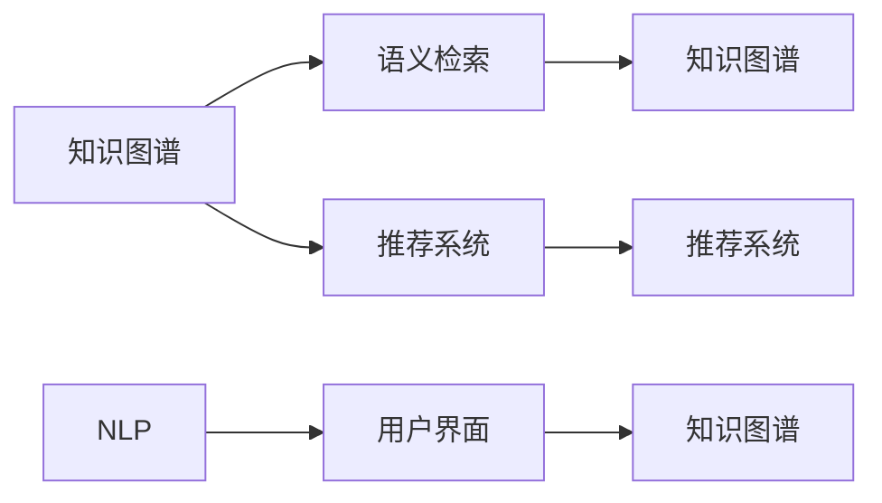

                 

# 知识工具要提高效率和用户体验

> 关键词：知识图谱、语义检索、推荐系统、自然语言处理、用户界面设计

## 1. 背景介绍

### 1.1 问题由来

在数字化时代，人们积累和获取的知识量呈现爆炸式增长。然而，信息过载和知识碎片化问题也日益凸显。如何将海量知识高效地组织起来，使之易于检索和利用，提高个人和组织的工作效率和用户体验，成为了一个重要挑战。

为了解决这一问题，知识工具（Knowledge Tools）应运而生。知识工具利用计算机科学和人工智能技术，帮助用户快速获取、理解和应用知识。它们广泛应用于知识管理、企业决策、科学研究、教育培训等多个领域，是实现智能化办公和智慧社会的重要基础设施。

## 2. 核心概念与联系

### 2.1 核心概念概述

本节将介绍知识工具中涉及的几个关键概念：

- **知识图谱(Knowledge Graph)**：一种结构化的语义知识表示方法，通过实体-关系-实体三元组来描述知识，实现对知识的有序组织和深度推理。
- **语义检索(Semantic Retrieval)**：一种基于语义理解的检索技术，通过分析用户查询与文档内容之间的语义相似度，提高检索结果的相关性和准确性。
- **推荐系统(Recommendation System)**：通过分析用户行为和偏好，推荐符合用户需求的产品、内容和服务，提高用户体验和满意度。
- **自然语言处理(Natural Language Processing, NLP)**：使计算机能够理解、处理和生成人类语言的技术，涉及文本处理、语音识别、语言生成等多个方向。
- **用户界面设计(User Interface Design)**：优化用户与知识工具的交互体验，提升使用便捷性和操作效率。

这些核心概念通过协同工作，实现知识的全面集成、高效检索和智能推荐，进而提升知识工具的效率和用户体验。

### 2.2 核心概念原理和架构的 Mermaid 流程图



这个流程图展示了知识工具的核心架构：

1. **知识图谱**作为知识组织的基础，提供丰富和结构化的语义信息，用于支持**语义检索**和**推荐系统**的功能。
2. **语义检索**从知识图谱中高效检索出与用户查询意图相关的知识，并根据用户行为进行**推荐系统**推荐。
3. **推荐系统**基于用户行为和偏好，向用户推荐知识图谱中的相关信息，提升用户体验。
4. **自然语言处理**技术，使知识工具能够理解用户输入的自然语言，提升查询的准确性和智能推荐的效果。
5. **用户界面设计**专注于提升知识工具的可访问性和易用性，使知识工具能够更好地服务于用户。

## 3. 核心算法原理 & 具体操作步骤

### 3.1 算法原理概述

知识工具的算法主要包括以下几个方面：

- **知识图谱构建**：利用知识抽取和关系学习等技术，从大量文本数据中自动构建知识图谱。
- **语义检索**：基于向量空间模型、神经网络模型等技术，实现对用户查询和知识图谱语义表示的匹配，提高检索精度。
- **推荐算法**：包括协同过滤、内容推荐、混合推荐等方法，根据用户行为和特征，生成个性化的推荐结果。
- **自然语言处理**：通过分词、词向量嵌入、依存关系分析等技术，使计算机能够理解自然语言，支持智能问答和交互。
- **用户界面设计**：包括界面布局、交互流程、反馈机制等设计，提升用户使用体验和操作效率。

### 3.2 算法步骤详解

以知识图谱的构建为例，其一般步骤如下：

1. **知识抽取**：从大规模文本数据中提取实体、属性和关系，构建知识元组。
2. **实体消歧**：通过词义消歧、关系消歧等技术，将抽取出的实体和关系映射到统一的知识表示中。
3. **知识融合**：对不同来源的知识元组进行融合，消除冗余和冲突，构建统一的知识图谱。
4. **知识推理**：利用规则推理、逻辑推理等技术，对知识图谱进行深度推理，增加知识图谱的完备性和一致性。

### 3.3 算法优缺点

知识工具的算法具有以下优点：

- **高效性**：利用计算机自动化处理大量数据，提高知识抽取和构建的效率。
- **灵活性**：算法可以根据不同的应用场景和数据特点进行调整，提升知识图谱和推荐系统的准确性。
- **可扩展性**：算法可以扩展到多模态数据，支持图像、音频等多种形式的知识表示和处理。

但同时也存在一些缺点：

- **复杂度**：知识图谱和推荐系统的构建和维护需要大量计算资源和专业知识。
- **准确性**：算法对数据质量和标注的依赖较高，对噪声数据和错误标注敏感。
- **实时性**：大规模语义检索和推荐系统可能面临响应时间长的挑战。
- **可解释性**：推荐系统输出的结果缺乏可解释性，用户难以理解其背后的逻辑和依据。

### 3.4 算法应用领域

知识工具的算法在多个领域得到了广泛应用，如：

- **知识管理**：帮助企业组织和共享知识，提升决策效率。
- **科研创新**：支持科学研究中的文献检索、数据挖掘和知识发现。
- **教育培训**：提供个性化的学习资源推荐和智能辅导。
- **医疗健康**：支持医学文献检索、疾病诊断和治疗方案推荐。
- **金融服务**：提供金融产品推荐、风险评估和投资分析。

## 4. 数学模型和公式 & 详细讲解

### 4.1 数学模型构建

本节将介绍知识工具中的一些关键数学模型和公式：

- **向量空间模型(Vector Space Model, VSM)**：通过将文本表示为向量，实现对文本相似度和查询结果的相关性计算。
- **神经网络模型(Neural Network Model)**：通过多层神经网络实现对知识图谱和推荐系统的建模和训练。
- **协同过滤(Collaborative Filtering)**：基于用户和物品的相似性，进行推荐。
- **内容推荐(Content-Based Filtering)**：基于物品的属性和用户的历史行为，进行推荐。
- **混合推荐(Hybrid Recommendation System)**：结合协同过滤和内容推荐，提高推荐系统的综合性能。

### 4.2 公式推导过程

以下以向量空间模型为例，推导其相关公式：

假设文本 $t$ 的词频-逆文档频率向量表示为 $t = \vec{t} = (t_1, t_2, \dots, t_n)$，查询 $q$ 的向量表示为 $q = \vec{q} = (q_1, q_2, \dots, q_n)$。则查询 $q$ 与文本 $t$ 的相似度 $\text{sim}(q, t)$ 可以通过向量点乘公式计算：

$$
\text{sim}(q, t) = \vec{q} \cdot \vec{t} = \sum_{i=1}^n q_i \cdot t_i
$$

### 4.3 案例分析与讲解

以电子商务平台的商品推荐系统为例，其语义检索和推荐过程如下：

1. **语义检索**：用户输入“舒适的鞋子”作为查询，检索系统基于向量空间模型，从知识图谱中提取与“舒适的鞋子”相关的商品向量，计算相似度得分，并选择得分最高的商品作为初始推荐结果。

2. **推荐系统**：推荐系统结合协同过滤和内容推荐算法，综合考虑用户的历史行为和商品属性，生成个性化的推荐结果。协同过滤算法通过分析用户-商品矩阵，找到与目标商品相似的其他商品；内容推荐算法根据商品属性和用户偏好，筛选出最相关的商品。

## 5. 项目实践：代码实例和详细解释说明

### 5.1 开发环境搭建

在开始项目实践前，需要先准备好开发环境：

1. **安装编程语言和工具**：选择Python作为主要编程语言，安装必要的工具和库，如NumPy、Pandas、Scikit-learn等。
2. **安装知识图谱和推荐系统框架**：选择如Neo4j、ElasticSearch、TensorFlow等流行的知识图谱和推荐系统框架，进行安装和配置。
3. **数据预处理**：准备知识图谱和推荐系统的训练数据，包括文本数据、实体关系数据、用户行为数据等。

### 5.2 源代码详细实现

以推荐系统为例，实现代码如下：

```python
from surprise import Reader, Dataset, KNNWithMeans
from surprise.model_selection import train_test_split
from surprise.prediction_algorithms.matrix_factorization import MatrixFactorizationAlgorithm
import pandas as pd

# 读取用户行为数据
df = pd.read_csv('user_behavior.csv')

# 数据预处理
reader = Reader(rating_scale=(1, 5))
data = Dataset.load_from_df(df[['user_id', 'item_id', 'rating']], reader)

# 构建推荐模型
knn = KNNWithMeans(k=50, sim_options={'name': 'pearson_baseline'})
knn.fit(data.build_full_trainset())

# 预测推荐结果
test_data = Dataset.load_from_df(df[['user_id', 'item_id']], reader)
test_data.add_unratings((df.iloc[-1]['user_id'], df.iloc[-1]['item_id']))

# 输出推荐结果
prediction = knn.test(test_data, verbose=False)
print(prediction)

# 可视化推荐结果
import matplotlib.pyplot as plt
plt.scatter(df['user_id'], df['item_id'], s=50, c=df['rating'], cmap='hot')
plt.title('User-Item Matrix')
plt.show()
```

### 5.3 代码解读与分析

代码实现中，我们首先使用Pandas读取用户行为数据，并进行数据预处理，使用Surprise库的KNNWithMeans算法构建推荐模型。在测试数据上调用predict方法进行推荐，并可视化用户-物品矩阵。

此代码展示了知识工具中推荐系统的核心实现流程：

1. **数据预处理**：将用户行为数据转换为Surprise库需要的格式，并进行归一化处理。
2. **模型构建**：选择KNNWithMeans算法，并设置参数k=50，用于计算用户和物品之间的相似度。
3. **模型训练**：使用训练数据集训练推荐模型，并记录训练过程中的误差。
4. **推荐预测**：在测试数据集上进行推荐预测，输出推荐结果和评分。
5. **结果可视化**：通过散点图展示用户和物品之间的评分分布，直观显示推荐结果的分布情况。

## 6. 实际应用场景

### 6.4 未来应用展望

知识工具在多个领域展示了巨大的应用潜力：

- **智慧教育**：通过个性化推荐和学习分析，提升学生的学习效果和教师的授课质量。
- **智能健康**：支持医疗文献检索、疾病诊断和治疗方案推荐，提高医疗服务的精准性和效率。
- **智能交通**：提供交通数据分析、事故预警和出行建议，提升交通管理的智能化水平。
- **智能制造**：支持设备监控、故障诊断和维修建议，提升生产效率和产品质量。

未来，随着知识图谱和推荐系统技术的不断进步，知识工具将变得更加智能和高效，进一步提升各领域的工作效率和用户体验。

## 7. 工具和资源推荐

### 7.1 学习资源推荐

为了帮助开发者掌握知识工具的核心技术和应用方法，这里推荐一些优质的学习资源：

1. **《深度学习与知识图谱》课程**：斯坦福大学的深度学习课程，讲解了知识图谱和推荐系统的基本原理和算法。
2. **《推荐系统实战》书籍**：详细介绍了推荐系统的理论基础和实际应用案例。
3. **Kaggle竞赛**：参加Kaggle的推荐系统竞赛，通过实践学习提升推荐系统的构建和优化能力。
4. **PyTorch和TensorFlow官方文档**：深入学习深度学习框架的API和最佳实践。

### 7.2 开发工具推荐

知识工具的开发需要多种工具的支持：

1. **Python编程语言**：具有丰富的库和框架支持，易于进行算法实现和数据处理。
2. **Jupyter Notebook**：支持交互式编程和代码展示，方便实验和文档编写。
3. **TensorBoard和Weights & Biases**：用于可视化模型的训练过程和指标，帮助优化模型性能。
4. **ElasticSearch和Neo4j**：常用的知识图谱存储和查询工具，支持大规模数据处理和复杂查询。

### 7.3 相关论文推荐

以下是几篇经典的知识工具和推荐系统论文，推荐阅读：

1. **《知识图谱：一种语义化的知识表示方法》**：详细介绍了知识图谱的基本概念和构建方法。
2. **《协同过滤算法在推荐系统中的应用》**：总结了协同过滤算法的基本原理和改进方法。
3. **《混合推荐系统：理论与实践》**：讨论了混合推荐系统的构建和优化技术。
4. **《自然语言处理与知识图谱的融合》**：介绍了NLP和知识图谱融合的最新进展和应用案例。

## 8. 总结：未来发展趋势与挑战

### 8.1 研究成果总结

知识工具的算法和技术在多个领域展示了显著的效果，推动了各行业的智能化进程。知识图谱、语义检索和推荐系统等技术，通过自动化处理大规模数据，显著提高了工作效率和用户体验。

### 8.2 未来发展趋势

未来，知识工具的发展将呈现以下趋势：

1. **多模态数据融合**：知识工具将支持图像、音频等多模态数据的融合，提升对现实世界的理解和处理能力。
2. **深度学习与知识图谱结合**：利用深度学习技术，对知识图谱进行更深层次的建模和推理，提高知识抽取和推理的精度。
3. **个性化推荐**：结合用户画像和行为数据，提供更加精准和个性化的推荐结果，提升用户体验。
4. **实时性增强**：通过分布式计算和算法优化，提升知识工具的响应速度和实时性。
5. **可解释性提升**：利用可解释性技术，增强推荐系统的透明度和用户信任度。

### 8.3 面临的挑战

尽管知识工具在多个领域取得了显著成果，但也面临一些挑战：

1. **数据隐私和安全**：知识工具需要处理大量敏感数据，如何保护用户隐私和数据安全是一个重要问题。
2. **数据质量和一致性**：数据质量不高和数据不一致会影响知识图谱和推荐系统的准确性。
3. **算法复杂度**：知识工具的算法复杂度较高，需要大量的计算资源和专业知识。
4. **模型可解释性**：推荐系统的输出缺乏可解释性，用户难以理解其背后的逻辑和依据。
5. **跨领域应用**：知识图谱和推荐系统在跨领域应用时，需要适应不同领域的数据特点和应用场景。

### 8.4 研究展望

未来的研究需要关注以下几个方面：

1. **数据隐私保护**：开发隐私保护算法，确保知识工具在处理敏感数据时保护用户隐私。
2. **数据质量提升**：利用数据清洗和标注技术，提高数据质量和一致性。
3. **算法简化**：简化知识工具的算法，降低计算复杂度，提升可扩展性和实时性。
4. **模型可解释性**：利用可解释性技术，增强推荐系统的透明度和用户信任度。
5. **跨领域应用**：开发跨领域适应性强的知识图谱和推荐系统，支持多领域数据和任务。

## 9. 附录：常见问题与解答

**Q1：知识图谱和推荐系统在实际应用中面临哪些挑战？**

A: 知识图谱和推荐系统在实际应用中面临以下挑战：

1. **数据隐私和安全**：知识图谱和推荐系统需要处理大量敏感数据，如何保护用户隐私和数据安全是一个重要问题。
2. **数据质量和一致性**：数据质量不高和数据不一致会影响知识图谱和推荐系统的准确性。
3. **算法复杂度**：知识工具的算法复杂度较高，需要大量的计算资源和专业知识。
4. **模型可解释性**：推荐系统的输出缺乏可解释性，用户难以理解其背后的逻辑和依据。
5. **跨领域应用**：知识图谱和推荐系统在跨领域应用时，需要适应不同领域的数据特点和应用场景。

**Q2：如何提高知识图谱和推荐系统的准确性？**

A: 提高知识图谱和推荐系统的准确性，可以采取以下措施：

1. **数据清洗和标注**：通过数据清洗和标注技术，提升数据质量和一致性。
2. **算法优化**：利用高效的算法和模型结构，提升知识图谱和推荐系统的精度。
3. **模型融合**：结合多种模型和算法，提高综合性能。
4. **在线学习**：利用在线学习技术，不断更新模型，适应数据分布的变化。
5. **用户反馈**：通过用户反馈，不断调整和优化推荐系统。

**Q3：知识图谱和推荐系统的应用场景有哪些？**

A: 知识图谱和推荐系统的应用场景非常广泛，包括：

1. **智慧教育**：通过个性化推荐和学习分析，提升学生的学习效果和教师的授课质量。
2. **智能健康**：支持医疗文献检索、疾病诊断和治疗方案推荐，提高医疗服务的精准性和效率。
3. **智能交通**：提供交通数据分析、事故预警和出行建议，提升交通管理的智能化水平。
4. **智能制造**：支持设备监控、故障诊断和维修建议，提升生产效率和产品质量。

通过本文的系统梳理，可以看到，知识工具在知识管理、企业决策、科学研究、教育培训等多个领域展示了巨大的应用潜力，是实现智能化办公和智慧社会的重要基础设施。相信随着知识图谱和推荐系统技术的不断进步，知识工具将变得更加智能和高效，进一步提升各领域的工作效率和用户体验。

---

作者：禅与计算机程序设计艺术 / Zen and the Art of Computer Programming

