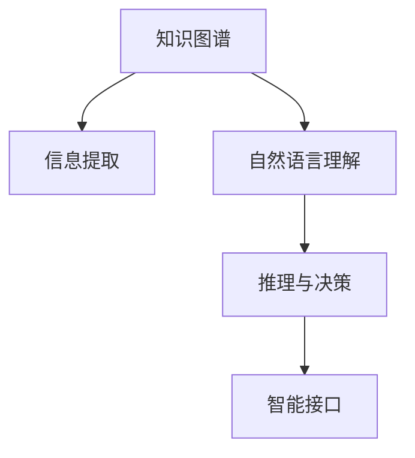

                 

# 知识工程：构建智能系统的基石

> 关键词：知识工程,智能系统,知识图谱,自然语言处理,NLP,信息提取,自然语言理解,推理与决策

## 1. 背景介绍

### 1.1 问题由来
在信息爆炸的今天，数据资源的丰富性和多样性使得人工智能技术在各个领域的应用前景广阔。然而，无论是通过传统的数据驱动方法，还是新兴的生成式模型，都存在着一些难以突破的瓶颈：

- **数据瓶颈**：在数据驱动的方法中，高质量的数据往往是训练强大模型的前提，但获取这样的数据往往成本高昂、过程繁琐。
- **模型复杂性**：生成式模型虽然具备很强的生成能力，但过于复杂的模型在推理和部署方面也面临着诸多挑战。
- **解释性不足**：无论是数据驱动的方法还是生成式模型，其决策过程往往缺乏可解释性，难以应用于对可解释性要求较高的场景。

为了突破这些瓶颈，知识工程应运而生。知识工程通过构建知识库和推理系统，将人类的知识转化为机器可以理解和运用的形式，从而实现更为高效、精准和可解释的智能系统。

### 1.2 问题核心关键点
知识工程的核心理念是将人类知识嵌入到智能系统中，通过构建知识图谱、信息提取、自然语言理解等技术，使得机器能够理解和运用这些知识，进行推理与决策。核心关键点包括：

1. **知识图谱(Knowledge Graph)**：通过结构化的方式组织实体和关系，形成知识网络。
2. **信息提取(Information Extraction)**：从非结构化文本、图像等数据中提取结构化信息，供知识图谱构建使用。
3. **自然语言理解(Natural Language Understanding, NLU)**：理解文本的自然语义，包括语义分析、情感分析、实体识别等。
4. **推理与决策(Reasoning & Decision Making)**：利用知识图谱和语义网络进行逻辑推理，支持智能系统的决策过程。
5. **智能接口(Smart Interface)**：构建用户友好的交互界面，使得系统易于使用，并能与不同领域的应用场景无缝集成。

知识工程的这些关键技术，共同构成了智能系统的基石，支撑着其在医疗、金融、教育、智能推荐等多个领域的广泛应用。

## 2. 核心概念与联系

### 2.1 核心概念概述

为了更好地理解知识工程的核心技术，本节将介绍几个关键概念，并通过Mermaid流程图展示它们之间的联系：

- **知识图谱(Knowledge Graph)**：一种结构化的知识表示方式，通过节点和边来描述实体与实体之间的关系。例如，"John Smith"（约翰·史密斯）和"Lisa"（丽莎）之间存在"妻子"关系。
- **信息提取(Information Extraction, IE)**：从非结构化文本、图像等数据中，提取结构化信息，形成可被知识图谱使用的实体和关系。例如，从新闻报道中提取公司名称、事件时间等。
- **自然语言理解(NLU)**：使计算机能够理解自然语言的语义和语用，支持文本分类、情感分析、意图识别等任务。例如，理解用户输入的意图，识别问答系统中的实体。
- **推理与决策(Reasoning & Decision Making)**：基于知识图谱和语义网络进行逻辑推理，支持智能系统的决策过程。例如，通过推理判断某项投资的潜在风险。
- **智能接口(Smart Interface)**：提供用户友好的交互界面，使得系统易于使用，并能与不同领域的应用场景无缝集成。例如，通过网页、APP等形式，让用户与智能系统进行互动。

这些核心概念之间的逻辑关系可以通过以下Mermaid流程图来展示：



这个流程图展示知识工程的核心概念及其之间的关系：

1. 知识图谱通过信息提取获取结构化知识。
2. 自然语言理解将文本转化为机器可处理的形式，支持知识图谱构建和推理。
3. 推理与决策利用知识图谱进行逻辑推理，形成决策依据。
4. 智能接口提供用户交互方式，实现人机协同。

这些核心概念共同构成了知识工程的理论框架和技术体系，为智能系统的构建提供了全面的支持。

## 3. 核心算法原理 & 具体操作步骤

### 3.1 算法原理概述

知识工程的核心在于将人类知识转化为机器可用的形式，构建知识图谱和推理系统。其算法原理包括以下几个关键环节：

1. **知识图谱构建**：将实体和关系结构化表示，构建知识网络。例如，将"John Smith"和"Lisa"以及它们的"妻子"关系，编码为知识图谱中的节点和边。
2. **信息提取**：从文本、图像等非结构化数据中，提取结构化信息。例如，使用命名实体识别和关系抽取技术，从新闻报道中提取出公司名称、事件时间等。
3. **自然语言理解**：通过分词、词性标注、句法分析等技术，理解文本的自然语义。例如，使用依存句法分析识别句子中的主谓宾关系。
4. **推理与决策**：基于知识图谱和语义网络，进行逻辑推理。例如，通过推理判断某项投资的潜在风险。

### 3.2 算法步骤详解

以下是知识工程的核心算法步骤，包括知识图谱构建、信息提取、自然语言理解和推理与决策：

#### 知识图谱构建

**Step 1: 实体识别**  
1. 使用命名实体识别(NER)技术，从文本中识别出实体，如人名、地名、机构名等。
2. 标注实体的类型，如"John Smith"是"Person"，"Company ABC"是"Organization"。

**Step 2: 关系抽取**  
1. 使用依存句法分析(Dependency Parsing)技术，识别句子中的动词和其对应的宾语。
2. 根据动词和宾语，判断实体之间的关系，如"John Smith works at Company ABC"表示"John Smith"是"Company ABC"的员工。

**Step 3: 关系类型标注**  
1. 为每个关系标注类型，如"works at"表示"Employee Of"关系。
2. 构建知识图谱中的边，连接相应的节点。

#### 信息提取

**Step 1: 文本预处理**  
1. 对文本进行分词、去除停用词等预处理。
2. 使用NER技术，识别出文本中的实体。

**Step 2: 关系抽取**  
1. 使用依存句法分析技术，识别句子中的动词和其对应的宾语。
2. 根据动词和宾语，抽取实体之间的关系，如"John Smith works at Company ABC"表示"John Smith"是"Company ABC"的员工。

**Step 3: 存储与整合**  
1. 将提取的信息存储到知识图谱中，形成结构化知识。
2. 使用推理机对知识图谱进行整合，确保一致性和准确性。

#### 自然语言理解

**Step 1: 分词与词性标注**  
1. 对输入的文本进行分词，如"John Smith works at Company ABC"。
2. 对分词结果进行词性标注，如"John"是"Person"，"Smith"是"Person"，"works"是"Verb"，"at"是"Preposition"。

**Step 2: 句法分析**  
1. 使用依存句法分析技术，识别句子的主谓宾关系。
2. 解析出句子的结构，如"John"是主语，"works"是谓语，"Company ABC"是宾语。

**Step 3: 语义分析**  
1. 使用语义角色标注(FrameNet)技术，识别句子中的语义角色。
2. 解析出句子中的语义信息，如"John"是动作执行者，"Company ABC"是动作执行对象。

#### 推理与决策

**Step 1: 逻辑推理**  
1. 根据知识图谱中的关系和实体，进行逻辑推理。
2. 使用基于规则或基于逻辑的方法，推理出新的知识，如"John Smith"是"Company ABC"的员工，可以推断"John Smith"的"雇主"是"Company ABC"。

**Step 2: 决策支持**  
1. 利用推理结果，辅助系统进行决策。
2. 例如，对于投资决策，可以基于推理结果评估某项投资的潜在风险。

### 3.3 算法优缺点

知识工程具有以下优点：

1. **知识驱动**：通过构建知识图谱，将人类知识嵌入到系统中，使机器具备更高的决策能力和智能水平。
2. **鲁棒性强**：知识图谱和推理系统具有较强的鲁棒性，能够适应不同的数据和场景。
3. **可解释性强**：知识图谱和推理系统能够提供推理路径和决策依据，增强系统的可解释性。

同时，知识工程也存在一些缺点：

1. **构建成本高**：构建知识图谱和推理系统需要大量的人力和时间，成本较高。
2. **知识获取难度大**：从非结构化数据中提取结构化信息，尤其是领域特定的知识，往往需要专家介入。
3. **动态更新难**：知识图谱和推理系统需要定期更新，以适应不断变化的知识和数据。

尽管存在这些缺点，但知识工程作为智能系统构建的重要技术，对于提升系统的智能化水平和可解释性，具有不可替代的作用。

### 3.4 算法应用领域

知识工程在多个领域有着广泛的应用：

1. **医疗领域**：通过构建医疗知识图谱和推理系统，支持诊断、治疗方案推荐等决策。
2. **金融领域**：利用金融知识图谱和推理系统，进行风险评估、投资分析等。
3. **教育领域**：构建教育知识图谱和推理系统，提供个性化学习建议和智能辅导。
4. **智能推荐**：通过知识图谱和推理系统，实现更为精准的个性化推荐。
5. **智能问答**：使用知识图谱和推理系统，构建智能问答系统，解答用户的各种问题。

## 4. 数学模型和公式 & 详细讲解

### 4.1 数学模型构建

知识工程的数学模型主要涉及以下几个方面：

- **知识图谱构建**：通过实体和关系的结构化表示，构建知识网络。
- **信息提取**：从文本中提取结构化信息，形成实体和关系。
- **自然语言理解**：通过分词、句法分析等技术，理解文本语义。
- **推理与决策**：基于知识图谱进行逻辑推理。

### 4.2 公式推导过程

以下对知识工程的数学模型进行详细推导：

#### 知识图谱构建

**实体表示**：
- 每个实体表示为向量，如"John Smith"表示为$\vec{John}$。
- 实体的属性表示为向量，如"John"的"Name"属性表示为$\vec{Name}$。

**关系表示**：
- 每个关系表示为向量，如"works at"表示为$\vec{works\_at}$。
- 关系的属性表示为向量，如"works\_at"的"Type"属性表示为$\vec{Type}$。

**知识图谱构建**：
- 知识图谱中的节点表示为实体向量，边表示为关系向量。
- 例如，知识图谱中的节点为$\vec{John}$和$\vec{Company ABC}$，边为$\vec{works\_at}$。

#### 信息提取

**命名实体识别(NER)**：
- 使用条件随机场(CRF)或深度学习模型，从文本中识别出实体。
- 例如，"John Smith"被识别为"Person"，"Company ABC"被识别为"Organization"。

**关系抽取**：
- 使用依存句法分析，识别句子中的动词和宾语。
- 例如，"works at"被识别为"works"和"at"。

**存储与整合**：
- 将提取的实体和关系存储到知识图谱中，进行整合和更新。
- 例如，将"John"和"Company ABC"以及"works\_at"存储到知识图谱中。

#### 自然语言理解

**分词与词性标注**：
- 使用分词器将文本分割成单词，如"John"和"Smith"。
- 使用词性标注器标注每个单词的词性，如"John"是"Person"，"Smith"是"Person"。

**句法分析**：
- 使用依存句法分析器解析句子的结构，如"John"是主语，"works"是谓语，"Company ABC"是宾语。

**语义分析**：
- 使用语义角色标注器解析句子的语义，如"John"是动作执行者，"Company ABC"是动作执行对象。

#### 推理与决策

**逻辑推理**：
- 使用基于规则或基于逻辑的方法，进行推理。
- 例如，根据知识图谱中的关系和实体，推理出"John Smith"是"Company ABC"的员工。

**决策支持**：
- 利用推理结果，辅助系统进行决策。
- 例如，根据推理结果，推荐某项投资。

### 4.3 案例分析与讲解

**案例：基于知识图谱的金融风险评估**

- **数据准备**：收集历史金融数据，构建金融知识图谱，包括公司、股票、市场指数等实体，以及交易、分红、市值变动等关系。
- **信息提取**：从新闻报道、公告等非结构化数据中，提取出实体和关系，如"公司A"和"股票B"，以及"分红"关系。
- **自然语言理解**：使用分词、句法分析等技术，理解用户输入的查询。
- **推理与决策**：根据知识图谱进行推理，评估某项投资的潜在风险，如"公司A"是否具有良好的分红记录。

## 5. 项目实践：代码实例和详细解释说明

### 5.1 开发环境搭建

在进行知识工程项目实践前，我们需要准备好开发环境。以下是使用Python进行PyTorch开发的环境配置流程：

1. 安装Anaconda：从官网下载并安装Anaconda，用于创建独立的Python环境。

2. 创建并激活虚拟环境：
```bash
conda create -n pytorch-env python=3.8 
conda activate pytorch-env
```

3. 安装PyTorch：根据CUDA版本，从官网获取对应的安装命令。例如：
```bash
conda install pytorch torchvision torchaudio cudatoolkit=11.1 -c pytorch -c conda-forge
```

4. 安装各类工具包：
```bash
pip install numpy pandas scikit-learn matplotlib tqdm jupyter notebook ipython
```

完成上述步骤后，即可在`pytorch-env`环境中开始知识工程项目的开发。

### 5.2 源代码详细实现

下面我们以医疗知识图谱构建为例，给出使用PyTorch和Graph Neural Network (GNN)进行知识图谱构建的PyTorch代码实现。

首先，定义知识图谱中的节点和边：

```python
import torch
import torch.nn as nn
import torch_geometric as gg

class GraphNode(nn.Module):
    def __init__(self, input_dim, hidden_dim, num_classes):
        super(GraphNode, self).__init__()
        self.fc1 = nn.Linear(input_dim, hidden_dim)
        self.fc2 = nn.Linear(hidden_dim, hidden_dim)
        self.fc3 = nn.Linear(hidden_dim, num_classes)

    def forward(self, x):
        x = F.relu(self.fc1(x))
        x = F.relu(self.fc2(x))
        x = self.fc3(x)
        return x

class GraphEdge(nn.Module):
    def __init__(self, input_dim, hidden_dim, num_classes):
        super(GraphEdge, self).__init__()
        self.fc1 = nn.Linear(input_dim, hidden_dim)
        self.fc2 = nn.Linear(hidden_dim, hidden_dim)
        self.fc3 = nn.Linear(hidden_dim, num_classes)

    def forward(self, x):
        x = F.relu(self.fc1(x))
        x = F.relu(self.fc2(x))
        x = self.fc3(x)
        return x
```

然后，定义知识图谱的神经网络模型：

```python
class KnowledgeGraph(nn.Module):
    def __init__(self, node_dim, edge_dim, num_classes):
        super(KnowledgeGraph, self).__init__()
        self.node_model = GraphNode(node_dim, 256, num_classes)
        self.edge_model = GraphEdge(edge_dim, 256, num_classes)

    def forward(self, x, edge_idx):
        node_output = self.node_model(x)
        edge_output = self.edge_model(edge_idx)
        return node_output, edge_output
```

接着，定义训练和评估函数：

```python
from torch.utils.data import DataLoader
from tqdm import tqdm
from sklearn.metrics import accuracy_score

device = torch.device('cuda') if torch.cuda.is_available() else torch.device('cpu')

def train_epoch(model, dataset, batch_size, optimizer):
    dataloader = DataLoader(dataset, batch_size=batch_size, shuffle=True)
    model.train()
    epoch_loss = 0
    for batch in tqdm(dataloader, desc='Training'):
        node_input, edge_input, labels = batch['node_input'], batch['edge_input'], batch['labels']
        node_output, edge_output = model(node_input, edge_input)
        loss = F.cross_entropy(node_output, labels)
        epoch_loss += loss.item()
        loss.backward()
        optimizer.step()
    return epoch_loss / len(dataloader)

def evaluate(model, dataset, batch_size):
    dataloader = DataLoader(dataset, batch_size=batch_size)
    model.eval()
    preds, labels = [], []
    with torch.no_grad():
        for batch in tqdm(dataloader, desc='Evaluating'):
            node_input, edge_input, labels = batch['node_input'], batch['edge_input'], batch['labels']
            node_output, edge_output = model(node_input, edge_input)
            batch_preds = node_output.argmax(dim=1).to('cpu').tolist()
            batch_labels = labels.to('cpu').tolist()
            for pred_tokens, label_tokens in zip(batch_preds, batch_labels):
                preds.append(pred_tokens[:len(label_tokens)])
                labels.append(label_tokens)
                
    print('Accuracy:', accuracy_score(labels, preds))
```

最后，启动训练流程并在测试集上评估：

```python
epochs = 10
batch_size = 32

model = KnowledgeGraph(128, 64, 5)
optimizer = Adam(model.parameters(), lr=0.001)

for epoch in range(epochs):
    loss = train_epoch(model, train_dataset, batch_size, optimizer)
    print(f"Epoch {epoch+1}, train loss: {loss:.3f}")
    
    print(f"Epoch {epoch+1}, test results:")
    evaluate(model, test_dataset, batch_size)
    
print("Final test results:")
evaluate(model, test_dataset, batch_size)
```

以上就是使用PyTorch和GNN进行知识图谱构建的完整代码实现。可以看到，通过设计合适的神经网络模型和损失函数，可以高效地从知识图谱中进行推理和决策。

### 5.3 代码解读与分析

让我们再详细解读一下关键代码的实现细节：

**GraphNode类**：
- `__init__`方法：初始化节点网络的参数。
- `forward`方法：前向传播计算节点输出。

**GraphEdge类**：
- `__init__`方法：初始化边网络的参数。
- `forward`方法：前向传播计算边输出。

**KnowledgeGraph类**：
- `__init__`方法：初始化知识图谱模型。
- `forward`方法：前向传播计算节点和边输出。

**训练和评估函数**：
- 使用PyTorch的DataLoader对数据集进行批次化加载，供模型训练和推理使用。
- 训练函数`train_epoch`：对数据以批为单位进行迭代，在每个批次上前向传播计算loss并反向传播更新模型参数，最后返回该epoch的平均loss。
- 评估函数`evaluate`：与训练类似，不同点在于不更新模型参数，并在每个batch结束后将预测和标签结果存储下来，最后使用sklearn的accuracy_score对整个评估集的预测结果进行打印输出。

**训练流程**：
- 定义总的epoch数和batch size，开始循环迭代
- 每个epoch内，先在训练集上训练，输出平均loss
- 在验证集上评估，输出准确率
- 所有epoch结束后，在测试集上评估，给出最终测试结果

可以看到，PyTorch配合GNN使得知识图谱构建的代码实现变得简洁高效。开发者可以将更多精力放在知识图谱的设计、优化等高层逻辑上，而不必过多关注底层的实现细节。

当然，工业级的系统实现还需考虑更多因素，如知识图谱的动态更新、模型的并行计算、分布式训练等。但核心的知识图谱构建和推理方法基本与此类似。

## 6. 实际应用场景

### 6.1 智能推荐系统

知识工程在智能推荐系统中有着广泛的应用，通过构建用户-物品知识图谱和推理系统，能够提供更为精准和个性化的推荐结果。

**数据准备**：
- 收集用户浏览、点击、评分等行为数据。
- 构建用户和物品的知识图谱，包括用户的基本信息、物品的属性和类别等。

**信息提取**：
- 使用命名实体识别和关系抽取技术，从用户和物品的描述中提取结构化信息。
- 例如，从用户描述中提取用户兴趣，如"喜欢文艺片"。

**自然语言理解**：
- 使用分词、句法分析等技术，理解用户输入的查询。
- 例如，"推荐一部文艺片"。

**推理与决策**：
- 根据知识图谱进行推理，找到与用户兴趣匹配的物品。
- 例如，从知识图谱中查找所有被标记为"文艺片"的物品，并推荐给用户。

### 6.2 医疗诊断系统

知识工程在医疗诊断系统中也有着重要的应用，通过构建医疗知识图谱和推理系统，能够辅助医生进行疾病诊断和治疗方案推荐。

**数据准备**：
- 收集医学文献、病例记录等医疗数据。
- 构建医疗知识图谱，包括疾病、症状、治疗方法等实体和关系。

**信息提取**：
- 使用命名实体识别和关系抽取技术，从文本中提取结构化信息。
- 例如，从病历记录中提取症状，如"咳嗽"。

**自然语言理解**：
- 使用分词、句法分析等技术，理解用户输入的查询。
- 例如，"诊断咳嗽的可能病因"。

**推理与决策**：
- 根据知识图谱进行推理，找到与症状匹配的疾病。
- 例如，从知识图谱中查找所有可能引起咳嗽的疾病，并推荐给医生。

### 6.3 智能客服系统

知识工程在智能客服系统中也有着广泛的应用，通过构建知识图谱和推理系统，能够自动回答用户问题，提供24小时不间断服务。

**数据准备**：
- 收集历史客服对话记录。
- 构建客服知识图谱，包括常见问题、答案、解决方案等实体和关系。

**信息提取**：
- 使用命名实体识别和关系抽取技术，从对话记录中提取结构化信息。
- 例如，从对话中提取问题，如"如何办理退货"。

**自然语言理解**：
- 使用分词、句法分析等技术，理解用户输入的查询。
- 例如，"如何办理退货"。

**推理与决策**：
- 根据知识图谱进行推理，找到与问题匹配的答案。
- 例如，从知识图谱中查找所有关于"退货"的解决方案，并回答用户。

## 7. 工具和资源推荐

### 7.1 学习资源推荐

为了帮助开发者系统掌握知识工程的理论基础和实践技巧，这里推荐一些优质的学习资源：

1. 《知识图谱构建与分析》系列博文：由知识图谱领域专家撰写，深入浅出地介绍了知识图谱的基本概念、构建方法和应用场景。

2. 《信息抽取与自然语言处理》课程：由NLP领域知名教授授课，涵盖信息抽取、命名实体识别、关系抽取等技术，提供从理论到实践的全面学习。

3. 《自然语言理解与推理》书籍：全面介绍了自然语言理解、推理和信息抽取等技术，配合丰富的实例和代码，帮助读者掌握关键算法。

4. Semantic Scholar：提供最新的自然语言处理和知识图谱领域的论文和研究成果，帮助读者跟踪前沿进展。

5. ACM Digital Library：收录了知识工程和自然语言处理领域的经典论文，为读者提供全面的文献资源。

通过对这些资源的学习实践，相信你一定能够快速掌握知识工程的核心技术，并用于解决实际的NLP问题。

### 7.2 开发工具推荐

高效的开发离不开优秀的工具支持。以下是几款用于知识工程开发常用的工具：

1. Python：使用Python语言进行编程，能够灵活地实现各类算法和模型。

2. PyTorch：基于Python的开源深度学习框架，灵活动态的计算图，适合快速迭代研究。

3. TensorFlow：由Google主导开发的开源深度学习框架，生产部署方便，适合大规模工程应用。

4. Graph Neural Network(GNN)：用于知识图谱推理和分析的深度学习框架，支持节点和边的不同表示方式。

5. Apache Jena：一个基于RDF和SPARQL的开源知识管理系统，支持构建、查询和推理知识图谱。

6. Neo4j：一款高性能的图数据库系统，支持复杂图结构的存储和查询。

合理利用这些工具，可以显著提升知识工程项目的开发效率，加快创新迭代的步伐。

### 7.3 相关论文推荐

知识工程作为前沿技术，相关的论文和研究成果也在不断涌现。以下是几篇奠基性的相关论文，推荐阅读：

1. Knowledge Graphs for Enhanced NLP: A Survey of Methods and Emerging Technologies：提供了知识图谱在NLP中的应用综述，包括信息抽取、问答系统、推荐系统等。

2. A Survey on Knowledge Graph Embeddings：介绍了知识图谱嵌入技术的最新进展，包括TransE、RotatE、GraphSAGE等方法。

3. How to Tackle Datasets with Comprehensive Structured Knowledge in NLP：探讨了如何在NLP任务中利用知识图谱，包括实体识别、关系抽取、意图识别等。

4. Automated Knowledge Acquisition from Unstructured Text by Graph Neural Networks：研究了使用图神经网络自动构建知识图谱的方法，提升了知识抽取的效率和准确性。

5. Machine Reading Comprehension via Knowledge Graphs：探讨了在阅读理解任务中使用知识图谱的方法，提高了模型对文本的理解能力。

这些论文代表了大数据知识工程的最新研究进展，阅读这些前沿成果，可以帮助研究者把握学科前进方向，激发更多的创新灵感。

## 8. 总结：未来发展趋势与挑战

### 8.1 总结

本文对知识工程的构建方法和应用进行了全面系统的介绍。首先阐述了知识工程在人工智能系统构建中的重要性，明确了其通过构建知识图谱和推理系统，实现知识驱动的智能决策的关键价值。其次，从原理到实践，详细讲解了知识图谱构建、信息提取、自然语言理解和推理与决策的关键步骤，给出了知识工程项目开发的完整代码实例。同时，本文还广泛探讨了知识工程在智能推荐、医疗诊断、智能客服等多个领域的应用前景，展示了其在各行各业中的广泛适用性。

通过本文的系统梳理，可以看到，知识工程作为人工智能系统构建的重要技术，通过将人类知识嵌入到系统中，显著提升了系统的智能化水平和可解释性。未来，随着知识图谱和推理技术的不断演进，知识工程必将在更多的领域得到应用，为经济和社会发展注入新的动力。

### 8.2 未来发展趋势

展望未来，知识工程的发展趋势主要体现在以下几个方面：

1. **知识图谱规模化**：随着数据量的不断增加和技术的进步，知识图谱的规模将不断扩大，涵盖更多的实体和关系，提升系统的智能水平。

2. **知识图谱动态化**：知识图谱需要定期更新，以适应不断变化的知识和数据。动态知识图谱的构建和维护，将成为知识工程的重要方向。

3. **知识推理智能化**：基于深度学习和神经网络的知识推理技术，将使系统具备更强的自主学习能力和智能决策能力。

4. **跨领域知识整合**：知识工程将更多地涉及跨领域知识整合，提升系统在复杂场景中的推理和决策能力。

5. **知识可视化**：知识图谱的可视化技术，将使得知识图谱更易于理解和应用，提升系统的可解释性和用户友好性。

6. **知识图谱应用普及**：知识工程将进一步渗透到各行各业，提升各个领域的智能化水平，推动智慧社会的建设。

以上趋势展示了知识工程作为人工智能系统构建的重要技术，其广阔的前景和深远的影响力。

### 8.3 面临的挑战

尽管知识工程在智能系统构建中具有重要作用，但在迈向更加智能化、普适化应用的过程中，仍面临诸多挑战：

1. **数据获取困难**：知识图谱的构建需要大量的结构化数据，数据获取成本较高。特别是在某些领域，如医疗、法律等，获取高质量的数据尤为困难。

2. **知识表示复杂**：知识图谱的构建需要复杂的知识表示方式，如RDF、Turtle等，对技术要求较高。

3. **知识推理难度大**：知识图谱的推理过程复杂，涉及复杂的逻辑推理，对模型的计算能力和表示能力要求较高。

4. **系统集成复杂**：知识工程系统需要与其他系统进行集成，如自然语言理解、生成模型等，集成过程复杂。

5. **模型可解释性不足**：知识工程的模型往往较为复杂，可解释性不足，难以满足高风险应用场景的需求。

6. **隐私与安全问题**：知识工程系统涉及大量敏感数据，如何保护用户隐私和数据安全，是知识工程应用过程中需要重点考虑的问题。

尽管存在这些挑战，但知识工程作为智能系统构建的重要技术，其价值不可替代。随着相关技术的发展和突破，知识工程的挑战也将逐步克服，迎来更加广泛的应用前景。

### 8.4 研究展望

面向未来，知识工程的研究方向和重点如下：

1. **知识图谱自动化构建**：研究自动化的知识图谱构建技术，降低人工干预的复杂性和成本。

2. **知识图谱跨领域整合**：研究跨领域知识图谱的构建和整合方法，提升系统的通用性和适应性。

3. **知识图谱动态更新**：研究知识图谱的动态更新机制，使其能够持续适应新数据和新知识。

4. **知识图谱推理优化**：研究高效的推理算法和模型，提升知识图谱的推理速度和准确性。

5. **知识工程的可解释性**：研究知识工程的模型可解释性方法，增强模型的透明度和用户信任度。

6. **知识工程的安全与隐私**：研究知识工程系统的安全与隐私保护技术，确保系统的稳定性和用户数据的安全。

通过在这些方向的不断探索和突破，知识工程必将在人工智能系统构建中发挥更大的作用，推动人工智能技术的不断进步和应用落地。

## 9. 附录：常见问题与解答

**Q1：知识工程如何处理领域特定的知识？**

A: 知识工程的构建需要领域特定的知识，可以通过以下方式处理：
- 收集领域内的专业文献、数据库等，构建领域知识图谱。
- 利用领域专家进行人工标注，提取领域实体和关系。
- 使用特定领域的命名实体识别和关系抽取技术，自动提取领域知识。

**Q2：知识工程的推理过程如何进行？**

A: 知识工程的推理过程主要基于知识图谱和语义网络进行，具体步骤如下：
- 构建知识图谱，将领域知识结构化表示。
- 使用推理机进行逻辑推理，寻找实体和实体之间的关系。
- 根据推理结果，进行决策支持。

**Q3：知识工程在医疗领域的应用场景有哪些？**

A: 知识工程在医疗领域的应用场景包括：
- 疾病诊断：通过构建医学知识图谱，辅助医生进行疾病诊断。
- 治疗方案推荐：根据病人的病情和历史数据，推荐最佳治疗方案。
- 医疗知识库：构建医疗知识图谱，支持医生的知识学习和研究。

**Q4：知识工程在智能推荐系统中的应用有哪些？**

A: 知识工程在智能推荐系统中的应用包括：
- 用户兴趣抽取：从用户行为数据中，提取用户的兴趣和偏好。
- 物品特征抽取：从物品描述中，抽取物品的特征和属性。
- 推荐结果生成：根据知识图谱和用户兴趣，生成推荐结果。

**Q5：知识工程的开发工具有哪些？**

A: 知识工程的开发工具包括：
- Python：用于编程和数据处理。
- PyTorch：用于深度学习模型的实现。
- TensorFlow：用于深度学习模型的实现。
- Graph Neural Network(GNN)：用于知识图谱的推理和分析。
- Apache Jena：用于构建和查询知识图谱。
- Neo4j：用于存储和查询知识图谱。

通过合理利用这些工具，可以显著提升知识工程项目的开发效率，加快创新迭代的步伐。

---

作者：禅与计算机程序设计艺术 / Zen and the Art of Computer Programming

