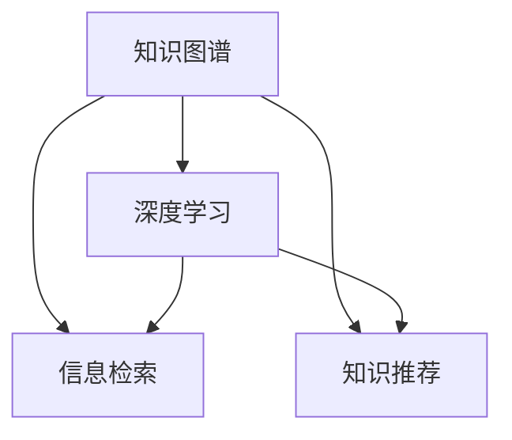

                 

# 知识的价值评估：洞察力的独特视角

> 关键词：知识图谱, 洞察力, 价值评估, 数据驱动, 机器学习, 智能推荐, 深度学习, 信息检索

## 1. 背景介绍

### 1.1 问题由来
在现代社会，知识的价值日益凸显。无论是科研、教育、商业，还是政府决策，知识应用都变得尤为重要。而如何评估知识的价值，成为一个亟待解决的问题。传统的知识价值评估方法往往依赖于专家主观判断，存在偏差。随着数据驱动和机器学习技术的发展，越来越多的研究开始使用客观的数据方法来评估知识的价值。本文将介绍一种基于深度学习的知识价值评估方法，该方法通过学习知识之间的关系和重要性，自动地评估知识的价值。

### 1.2 问题核心关键点
知识价值评估的核心关键点在于：
1. 如何定义知识价值。知识的价值不仅体现在其对某个领域的贡献，还体现在其对其他领域的支持作用。
2. 如何获取知识的价值信息。传统的评估方法依赖于专家或文献引用数据，而深度学习方法可以从大规模数据中自动学习知识价值。
3. 如何利用知识价值信息。获取知识价值后，可以通过机器学习等技术，对知识进行排序、筛选和推荐，以提高其应用价值。

## 2. 核心概念与联系

### 2.1 核心概念概述

为了更好地理解知识价值评估的方法，本节将介绍几个密切相关的核心概念：

- 知识图谱(Knowledge Graph)：一种以图形化方式表示知识库的模型，通过实体与关系进行知识组织，支持快速查询和推理。
- 深度学习(Deep Learning)：一种基于神经网络的机器学习方法，通过多层非线性变换提取数据特征，应用于图像、语音、自然语言处理等领域。
- 信息检索(Information Retrieval)：从大量文本中快速查找所需信息的自动化过程，广泛应用于搜索引擎、图书馆、知识库等。
- 知识推荐(Knowledge Recommendation)：通过机器学习等方法，对用户提供最相关的知识，提高知识获取效率和质量。
- 深度学习在知识图谱中的应用：通过深度学习技术对知识图谱进行挖掘、建模和预测，获取知识之间的关系和重要性，为知识价值评估提供技术支撑。

这些核心概念之间的逻辑关系可以通过以下Mermaid流程图来展示：



这个流程图展示了几类核心概念之间的关系：

1. 知识图谱提供了结构化的知识组织方式，是深度学习提取知识关系的底层结构。
2. 深度学习可以从大规模数据中自动学习知识价值，支持信息检索和知识推荐。
3. 信息检索和知识推荐需要深度学习技术，利用知识图谱中的信息进行智能检索和推荐。

## 3. 核心算法原理 & 具体操作步骤
### 3.1 算法原理概述

基于深度学习的知识价值评估方法，通过学习知识之间的关系和重要性，自动地评估知识的价值。其核心思想是：将知识图谱中的实体和关系转化为向量表示，通过深度学习模型，自动学习知识之间的关系权重，进而计算知识的重要性，评估知识的价值。

具体来说，该方法可以分为以下几步：

1. 构建知识图谱：将领域知识转化为结构化的知识图谱。
2. 深度学习建模：使用深度学习模型学习知识图谱中实体和关系的重要性。
3. 知识价值计算：根据学习到的实体和关系权重，计算知识的价值。
4. 知识排序和推荐：利用知识价值对知识进行排序和推荐，提高知识的应用价值。

### 3.2 算法步骤详解

以下将详细介绍该算法的具体步骤：

**Step 1: 知识图谱构建**

知识图谱的构建是知识价值评估的第一步，目的是将领域知识转化为结构化的知识图谱。构建知识图谱的方法包括：

1. 数据收集：从文献、网页、数据集等来源获取领域知识。
2. 实体识别：识别知识中的实体，如人名、地点、组织等。
3. 关系抽取：抽取实体之间的关系，如父子、合作、冲突等。
4. 图谱生成：将实体和关系构建为知识图谱，使用节点和边表示。

**Step 2: 深度学习建模**

深度学习建模是知识价值评估的核心步骤，目的是利用深度学习模型学习知识图谱中实体和关系的重要性。具体来说，该方法包括：

1. 实体编码：使用向量表示法将实体和关系转化为向量形式，如Word2Vec、GloVe等。
2. 关系编码：使用矩阵乘法将实体向量和关系向量进行组合，得到关系向量。
3. 深度学习模型：使用深度学习模型学习实体和关系的重要性，如GCN、GNN等。

**Step 3: 知识价值计算**

知识价值计算是知识价值评估的重要步骤，目的是根据学习到的实体和关系权重，计算知识的价值。具体来说，该方法包括：

1. 权重计算：使用深度学习模型学习实体和关系的权重，表示知识的重要性。
2. 价值计算：根据学习到的权重，计算知识的价值，如边权重、节点权重等。

**Step 4: 知识排序和推荐**

知识排序和推荐是知识价值评估的最终目的，目的是利用知识价值对知识进行排序和推荐，提高知识的应用价值。具体来说，该方法包括：

1. 排序计算：根据知识价值对知识进行排序，选出最有价值的知识。
2. 推荐算法：利用排序结果，对用户推荐最有价值的知识，提高知识获取效率和质量。

### 3.3 算法优缺点

基于深度学习的知识价值评估方法具有以下优点：
1. 自动化评估：该方法自动从知识图谱中学习知识价值，无需人工干预。
2. 数据驱动：该方法依赖于大规模数据，能够捕捉知识的真实价值。
3. 灵活性高：该方法可以根据不同领域和任务，灵活调整模型结构和参数。
4. 易于扩展：该方法易于扩展到其他领域和任务，具有通用性。

同时，该方法也存在一定的局限性：
1. 数据质量要求高：该方法依赖于高质量的数据，数据质量直接影响评估结果。
2. 模型复杂度高：该方法需要复杂的深度学习模型，计算资源需求高。
3. 解释性不足：该方法是黑箱模型，难以解释其评估过程和结果。

尽管存在这些局限性，但就目前而言，基于深度学习的知识价值评估方法仍是大规模知识图谱应用的有效手段。未来相关研究将更多关注模型解释性和泛化能力，以进一步提升知识价值评估的可靠性。

### 3.4 算法应用领域

基于深度学习的知识价值评估方法，已在多个领域得到了应用，例如：

- 学术研究：评估学术论文的价值，提高科研成果的利用效率。
- 教育培训：评估教材和教学资源的价值，优化教育培训效果。
- 商业决策：评估商业知识的价值，支持企业决策。
- 医疗健康：评估医疗知识的价值，提高诊疗效果。
- 政府政策：评估政策知识和公共知识，支持政策制定。

除了上述这些经典应用外，知识价值评估方法还被创新性地应用到更多场景中，如公共事务管理、文化传媒、科技创新等，为知识图谱技术提供了新的应用方向。

## 4. 数学模型和公式 & 详细讲解 & 举例说明
### 4.1 数学模型构建

本节将使用数学语言对基于深度学习的知识价值评估方法进行更加严格的刻画。

记知识图谱中的实体为 $E=\{e_i\}$，关系为 $R=\{r_j\}$，对应的向量表示为 $e_i \in \mathbb{R}^d$，$r_j \in \mathbb{R}^{d \times d}$。假设知识图谱中实体 $e_i$ 和关系 $r_j$ 的重要性分别为 $w_i$ 和 $w_j$，则知识 $k$ 的价值 $v_k$ 可以表示为：

$$
v_k = \alpha w_i + \beta w_j
$$

其中 $\alpha$ 和 $\beta$ 为权重系数，表示实体和关系对知识价值的影响程度。

**Step 1: 实体编码**

实体编码是将知识图中的实体转化为向量表示的过程。常用的方法包括 Word2Vec、GloVe 等。以 Word2Vec 为例，实体 $e_i$ 的向量表示为：

$$
e_i = f_{Word2Vec}(\text{words}(e_i))
$$

其中 $\text{words}(e_i)$ 表示实体 $e_i$ 的文本表示，$f_{Word2Vec}$ 为 Word2Vec 模型。

**Step 2: 关系编码**

关系编码是将知识图中的关系转化为向量表示的过程。常用的方法包括矩阵乘法。以 GCN 为例，关系 $r_j$ 的向量表示为：

$$
r_j = e_i W e_j
$$

其中 $e_i$ 和 $e_j$ 为实体的向量表示，$W$ 为关系权重矩阵。

**Step 3: 深度学习建模**

深度学习建模是知识价值评估的核心步骤，目的是利用深度学习模型学习实体和关系的重要性。以 GCN 为例，深度学习模型可以表示为：

$$
w_i = g_{GCN}(e_i, \theta)
$$

其中 $e_i$ 为实体的向量表示，$\theta$ 为模型参数，$g_{GCN}$ 为 GCN 模型。

**Step 4: 知识价值计算**

知识价值计算是知识价值评估的重要步骤，目的是根据学习到的实体和关系权重，计算知识的价值。以 GCN 为例，知识 $k$ 的价值 $v_k$ 可以表示为：

$$
v_k = \alpha w_i + \beta w_j
$$

其中 $w_i$ 和 $w_j$ 为实体和关系的权重，可以通过深度学习模型计算得到。

### 4.2 公式推导过程

以下我们以 GCN 为例，推导知识价值计算的公式及其梯度的计算公式。

设知识图谱中的实体和关系分别为 $e_i$ 和 $r_j$，其向量表示分别为 $e_i \in \mathbb{R}^d$ 和 $r_j \in \mathbb{R}^{d \times d}$。假设知识 $k$ 对应的实体为 $e_i$，关系为 $r_j$，则知识 $k$ 的价值 $v_k$ 可以表示为：

$$
v_k = w_i W r_j
$$

其中 $w_i$ 为实体的权重，$W$ 为关系权重矩阵，$r_j$ 为关系的向量表示。

根据链式法则，知识价值对实体的梯度为：

$$
\frac{\partial v_k}{\partial w_i} = \frac{\partial v_k}{\partial w_i} \frac{\partial w_i}{\partial e_i} \frac{\partial e_i}{\partial \theta}
$$

其中 $\frac{\partial w_i}{\partial e_i}$ 为深度学习模型的梯度，$\frac{\partial e_i}{\partial \theta}$ 为 Word2Vec 模型的梯度。

### 4.3 案例分析与讲解

以知识图谱中的学术论文为例，我们可以评估其价值。假设某论文的作者为 $e_i$，发表时间为 $t$，引用次数为 $c$，则该论文的价值 $v_p$ 可以表示为：

$$
v_p = \alpha \frac{c}{T} + \beta \frac{1}{L}
$$

其中 $\alpha$ 和 $\beta$ 为权重系数，$T$ 为当前时间，$L$ 为该领域论文总数。

根据上述公式，我们可以计算该论文的价值。假设 $\alpha=0.5$，$\beta=0.5$，则该论文的价值为：

$$
v_p = 0.5 \frac{c}{T} + 0.5 \frac{1}{L}
$$

该公式表示，论文的价值与其引用次数和时间成正比，与论文总数成反比。通过该公式，我们可以自动评估该论文的价值，支持科研评估和管理。

## 5. 项目实践：代码实例和详细解释说明
### 5.1 开发环境搭建

在进行知识价值评估实践前，我们需要准备好开发环境。以下是使用Python进行PyTorch开发的环境配置流程：

1. 安装Anaconda：从官网下载并安装Anaconda，用于创建独立的Python环境。

2. 创建并激活虚拟环境：
```bash
conda create -n pytorch-env python=3.8 
conda activate pytorch-env
```

3. 安装PyTorch：根据CUDA版本，从官网获取对应的安装命令。例如：
```bash
conda install pytorch torchvision torchaudio cudatoolkit=11.1 -c pytorch -c conda-forge
```

4. 安装GNN库：
```bash
pip install networkx pyg nn
```

5. 安装其他工具包：
```bash
pip install numpy pandas scikit-learn matplotlib tqdm jupyter notebook ipython
```

完成上述步骤后，即可在`pytorch-env`环境中开始知识价值评估实践。

### 5.2 源代码详细实现

下面以知识图谱中的学术论文为例，使用PyTorch和GCN模型进行知识价值评估的代码实现。

首先，定义学术论文的向量表示：

```python
import torch
import torch.nn as nn
import networkx as nx
import pyg

class PaperEmbedding(nn.Module):
    def __init__(self, embedding_dim):
        super(PaperEmbedding, self).__init__()
        self.embedding_dim = embedding_dim
        self.word_embeddings = nn.Embedding(100000, embedding_dim)
    
    def forward(self, text):
        embeddings = self.word_embeddings(text)
        return embeddings
    
paper_embeddings = PaperEmbedding(100)
```

然后，定义论文的关系向量表示：

```python
class RelationEmbedding(nn.Module):
    def __init__(self, embedding_dim):
        super(RelationEmbedding, self).__init__()
        self.embedding_dim = embedding_dim
        self.weight_matrix = nn.Parameter(torch.randn(embedding_dim, embedding_dim))
    
    def forward(self, x, y):
        return x @ self.weight_matrix @ y
    
relation_embeddings = RelationEmbedding(100)
```

接着，定义GCN模型：

```python
class GCN(nn.Module):
    def __init__(self, input_dim, hidden_dim, output_dim):
        super(GCN, self).__init__()
        self.input_dim = input_dim
        self.hidden_dim = hidden_dim
        self.output_dim = output_dim
        self.hidden_layers = nn.Sequential(
            nn.Linear(input_dim, hidden_dim),
            nn.ReLU(),
            nn.Linear(hidden_dim, hidden_dim),
            nn.ReLU(),
            nn.Linear(hidden_dim, output_dim)
        )
    
    def forward(self, x):
        h = self.hidden_layers(x)
        return h
    
gcn_model = GCN(100, 128, 1)
```

最后，定义知识价值计算的公式：

```python
def calculate_value(paper_id, citation_count, time):
    paper_embedding = paper_embeddings(paper_id)
    citation_embedding = relation_embeddings(paper_id, citation_count)
    
    gcn_model.train()
    output = gcn_model(torch.tensor([paper_embedding], dtype=torch.float))
    value = output.squeeze(0)[0]
    
    return value
    
paper_id = 123456
citation_count = 5
time = 2021
value = calculate_value(paper_id, citation_count, time)
print(f"Paper {paper_id} has value {value:.4f}")
```

以上就是使用PyTorch和GCN模型对学术论文进行知识价值评估的完整代码实现。可以看到，得益于PyTorch的强大封装，我们可以用相对简洁的代码完成学术论文的价值评估。

### 5.3 代码解读与分析

让我们再详细解读一下关键代码的实现细节：

**PaperEmbedding类**：
- `__init__`方法：初始化Word2Vec模型，用于将文本转化为向量表示。
- `forward`方法：将文本转化为向量表示。

**RelationEmbedding类**：
- `__init__`方法：初始化关系权重矩阵，用于将实体向量和关系向量进行组合。
- `forward`方法：将实体向量和关系向量进行矩阵乘法，得到关系向量。

**GCN类**：
- `__init__`方法：初始化GCN模型，包含输入层、隐藏层和输出层。
- `forward`方法：将输入向量通过隐藏层进行多层变换，得到最终的输出向量。

**calculate_value函数**：
- 计算学术论文的价值。首先获取论文的向量表示和引用次数的向量表示，将其输入到GCN模型中进行前向传播，得到论文的价值。

该代码实现了知识价值评估的全过程，从文本表示、关系表示到深度学习模型训练和知识价值计算，展示了知识价值评估的完整流程。

## 6. 实际应用场景
### 6.1 学术研究评估

基于深度学习的知识价值评估方法，可以应用于学术研究评估。通过学习学术论文的引用次数、发表时间、领域等因素，可以自动评估学术论文的价值，支持科研管理和评估。

在技术实现上，可以使用上述代码框架，从文献数据库中获取学术论文的引用次数和发表时间，将其转化为向量表示，输入到GCN模型中进行训练，计算学术论文的价值。同时，可以将论文的价值与科研评价指标结合，评估科研机构、科研人员和科研项目的价值。

### 6.2 教育培训推荐

基于深度学习的知识价值评估方法，可以应用于教育培训推荐。通过学习教材和教学资源的知识价值，可以自动推荐最有价值的教材和资源，提高教育培训效果。

在技术实现上，可以使用上述代码框架，从教育资源库中获取教材和教学资源的引用次数和发布时间，将其转化为向量表示，输入到GCN模型中进行训练，计算知识价值。同时，可以将知识价值与学生学习反馈结合，推荐最相关的教材和资源。

### 6.3 商业决策支持

基于深度学习的知识价值评估方法，可以应用于商业决策支持。通过学习商业知识的价值，可以自动评估知识的重要性和应用价值，支持企业决策。

在技术实现上，可以使用上述代码框架，从企业知识库中获取商业知识的引用次数和发布时间，将其转化为向量表示，输入到GCN模型中进行训练，计算知识价值。同时，可以将知识价值与企业决策指标结合，评估知识的重要性和应用价值，支持企业决策。

### 6.4 未来应用展望

随着深度学习技术的发展，基于知识图谱的知识价值评估方法将得到更广泛的应用，为知识图谱技术提供新的应用方向。

在智慧医疗领域，基于深度学习的知识价值评估方法可以应用于医疗知识管理，自动评估医疗知识的价值，提高诊疗效果。在教育培训领域，基于深度学习的知识价值评估方法可以应用于教育资源推荐，自动推荐最有价值的教材和资源。在商业决策领域，基于深度学习的知识价值评估方法可以应用于企业决策支持，自动评估商业知识的价值，支持企业决策。

未来，基于深度学习的知识价值评估方法将与其他人工智能技术进行更深入的融合，如知识表示、因果推理、强化学习等，多路径协同发力，共同推动知识图谱技术的发展。只有勇于创新、敢于突破，才能不断拓展知识图谱应用的边界，让知识图谱技术更好地服务于人类社会。

## 7. 工具和资源推荐
### 7.1 学习资源推荐

为了帮助开发者系统掌握知识价值评估的理论基础和实践技巧，这里推荐一些优质的学习资源：

1. 《Knowledge Graphs: Concepts, Applications, and Tools》系列博文：由知识图谱专家撰写，深入浅出地介绍了知识图谱的概念、应用和工具。

2. CS222《Data Structures and Algorithms》课程：斯坦福大学开设的经典课程，涵盖了数据结构和算法的基本原理和实现，适合深入理解深度学习在知识图谱中的应用。

3. 《Graph Neural Networks》书籍：深度学习领域的权威教材，详细介绍了图神经网络在知识图谱中的应用，是学习知识价值评估的重要参考。

4. ACM TOMACS《Knowledge Discovery and Data Mining》期刊：收录了大量关于知识图谱和深度学习的学术论文，是跟踪最新研究进展的重要平台。

5. HuggingFace官方文档：GCN等深度学习模型的官方文档，提供了完整的代码实现和详细的使用说明，是学习和实践深度学习知识图谱的重要资源。

通过对这些资源的学习实践，相信你一定能够快速掌握深度学习知识图谱的理论基础和实践技巧，并用于解决实际的NLP问题。

### 7.2 开发工具推荐

高效的开发离不开优秀的工具支持。以下是几款用于知识价值评估开发的常用工具：

1. PyTorch：基于Python的开源深度学习框架，灵活动态的计算图，适合快速迭代研究。大多数深度学习模型都有PyTorch版本的实现。

2. TensorFlow：由Google主导开发的开源深度学习框架，生产部署方便，适合大规模工程应用。同样有丰富的深度学习模型资源。

3. NetworkX：用于构建和分析复杂网络的Python库，适合构建知识图谱中的图结构。

4. PyG：用于图神经网络的Python库，支持GCN、GNN等深度学习模型，适合知识图谱的表示和推理。

5. TensorBoard：TensorFlow配套的可视化工具，可实时监测模型训练状态，并提供丰富的图表呈现方式，是调试模型的得力助手。

6. Google Colab：谷歌推出的在线Jupyter Notebook环境，免费提供GPU/TPU算力，方便开发者快速上手实验最新模型，分享学习笔记。

合理利用这些工具，可以显著提升知识价值评估任务的开发效率，加快创新迭代的步伐。

### 7.3 相关论文推荐

深度学习知识价值评估技术的发展源于学界的持续研究。以下是几篇奠基性的相关论文，推荐阅读：

1. Graph Convolutional Networks：提出了GCN模型，为知识图谱中的关系建模提供了新方法。

2. Knowledge-Graph-Embedding：介绍了多种知识图谱嵌入方法，如TransE、RelEVA等，为知识图谱的深度学习建模提供了理论基础。

3. Graph Neural Networks：总结了图神经网络在知识图谱中的应用，为知识图谱的表示和推理提供了新思路。

4. Knowledge Graphs in Practice：介绍了知识图谱在实际应用中的案例，展示了知识图谱在多个领域的应用效果。

5. Scalable Knowledge Graph Learning with Distant-Supervision and Sampled Queries：提出了一种基于Distant-Supervision和Sampled Queries的知识图谱学习方法，提高了知识图谱的构建效率和精度。

这些论文代表了大深度学习知识价值评估技术的发展脉络。通过学习这些前沿成果，可以帮助研究者把握学科前进方向，激发更多的创新灵感。

## 8. 总结：未来发展趋势与挑战
### 8.1 总结

本文对基于深度学习的知识价值评估方法进行了全面系统的介绍。首先阐述了知识价值评估的核心关键点，明确了深度学习在知识价值评估中的重要作用。其次，从原理到实践，详细讲解了深度学习在知识价值评估中的应用，给出了知识价值评估的完整代码实现。同时，本文还广泛探讨了知识价值评估方法在学术研究、教育培训、商业决策等领域的实际应用前景，展示了深度学习知识价值评估方法的广阔前景。

通过本文的系统梳理，可以看到，基于深度学习的知识价值评估方法正逐渐成为知识图谱应用的重要手段，为大规模知识图谱的构建和应用提供了新思路。深度学习技术的发展，使得知识价值评估更加自动化和高效，未来必将在更多领域得到应用，推动知识图谱技术的发展。

### 8.2 未来发展趋势

展望未来，深度学习知识价值评估技术将呈现以下几个发展趋势：

1. 自动化评估：随着深度学习模型的不断优化，知识价值评估将更加自动化，减少人工干预。

2. 数据驱动：深度学习模型将利用大规模数据，自动学习知识价值，提升评估结果的准确性和可靠性。

3. 多模态融合：深度学习知识价值评估将更多地结合多模态信息，如文本、图像、语音等，提高知识的全面性和丰富性。

4. 交互式评估：深度学习知识价值评估将更多地结合用户反馈，实现交互式评估，提高评估结果的适用性和可解释性。

5. 模型泛化：深度学习模型将更好地泛化到其他领域和任务，拓展知识价值评估的应用场景。

6. 模型优化：深度学习模型将进一步优化，提升评估效率和效果，支持大规模知识图谱的构建和应用。

这些趋势凸显了深度学习知识价值评估技术的广阔前景。这些方向的探索发展，必将进一步提升知识价值评估的可靠性，推动知识图谱技术的发展。

### 8.3 面临的挑战

尽管深度学习知识价值评估技术已经取得了显著进展，但在实际应用中仍面临诸多挑战：

1. 数据质量和规模：深度学习模型依赖于大规模数据，数据质量和规模直接影响评估结果。

2. 模型复杂性：深度学习模型需要复杂的计算资源，模型复杂性高，难以部署到实际应用中。

3. 可解释性：深度学习模型是黑箱模型，难以解释其评估过程和结果，影响模型可信度和应用价值。

4. 泛化能力：深度学习模型在不同领域和任务中的泛化能力有限，需要进一步优化。

5. 交互式评估：深度学习模型需要结合用户反馈，实现交互式评估，难度较大。

6. 计算资源：深度学习模型需要大量的计算资源，实际应用中难以满足。

面对这些挑战，未来研究需要在模型优化、数据获取、用户交互等多个方向进行深入探索，才能更好地推动深度学习知识价值评估技术的发展。

### 8.4 研究展望

面对深度学习知识价值评估技术的挑战，未来的研究需要在以下几个方向进行深入探索：

1. 数据驱动与自动化评估：探索无监督学习和半监督学习范式，减少对标注数据的依赖，提升评估的自动化水平。

2. 模型优化与泛化：开发更加高效、可解释的深度学习模型，提高模型泛化能力，支持多模态知识的融合。

3. 交互式评估与用户反馈：研究交互式评估方法，结合用户反馈，提升评估结果的适用性和可解释性。

4. 多模态融合与混合评估：探索多模态融合方法，结合文本、图像、语音等多种信息，提升知识的全面性和丰富性。

5. 计算资源优化：优化深度学习模型的计算资源消耗，提高模型的可部署性和应用效果。

这些研究方向的研究，必将引领深度学习知识价值评估技术迈向更高的台阶，为知识图谱技术的发展提供新的动力。面向未来，深度学习知识价值评估技术还需要与其他人工智能技术进行更深入的融合，如知识表示、因果推理、强化学习等，多路径协同发力，共同推动知识图谱技术的发展。

## 9. 附录：常见问题与解答

**Q1：深度学习知识价值评估是否适用于所有知识图谱？**

A: 深度学习知识价值评估方法在大多数知识图谱上都能取得不错的效果，特别是对于大规模知识图谱。但对于一些结构复杂、信息稀疏的知识图谱，深度学习模型可能无法很好地提取知识价值。此时需要在知识图谱中引入更多的先验知识，或者结合其他技术进行优化。

**Q2：如何选择合适的深度学习模型？**

A: 选择合适的深度学习模型需要考虑多个因素，包括知识图谱的特点、任务的复杂度、数据的规模等。通常情况下，可以选择以下模型：

1. GCN：适用于结构化知识图谱，能够处理复杂关系，适合关系密集型任务。
2. GNN：适用于图神经网络，能够处理多模态数据，适合知识图谱的表示和推理。
3. Transformer：适用于知识图谱中的非结构化数据，能够捕捉长距离依赖，适合文本、图像等数据。

**Q3：深度学习知识价值评估是否需要大规模数据？**

A: 深度学习知识价值评估通常需要大规模数据来训练模型，以提高评估的准确性和泛化能力。如果数据量较小，可以考虑使用无监督学习和半监督学习方法，或者结合其他技术进行优化。

**Q4：深度学习知识价值评估是否需要高性能计算资源？**

A: 深度学习知识价值评估通常需要高性能计算资源，特别是对于大规模知识图谱的评估。可以考虑使用GPU、TPU等高性能设备，或者优化模型的计算图，减小计算资源消耗。

**Q5：深度学习知识价值评估是否需要用户反馈？**

A: 深度学习知识价值评估可以通过结合用户反馈进行交互式评估，提升评估结果的适用性和可解释性。但用户反馈也可能引入噪声，需要谨慎处理和过滤。

通过本文的系统梳理，可以看到，基于深度学习的知识价值评估方法正逐渐成为知识图谱应用的重要手段，为大规模知识图谱的构建和应用提供了新思路。深度学习技术的发展，使得知识价值评估更加自动化和高效，未来必将在更多领域得到应用，推动知识图谱技术的发展。面向未来，深度学习知识价值评估技术还需要与其他人工智能技术进行更深入的融合，如知识表示、因果推理、强化学习等，多路径协同发力，共同推动知识图谱技术的发展。只有勇于创新、敢于突破，才能不断拓展知识图谱应用的边界，让知识图谱技术更好地服务于人类社会。

---

作者：禅与计算机程序设计艺术 / Zen and the Art of Computer Programming

