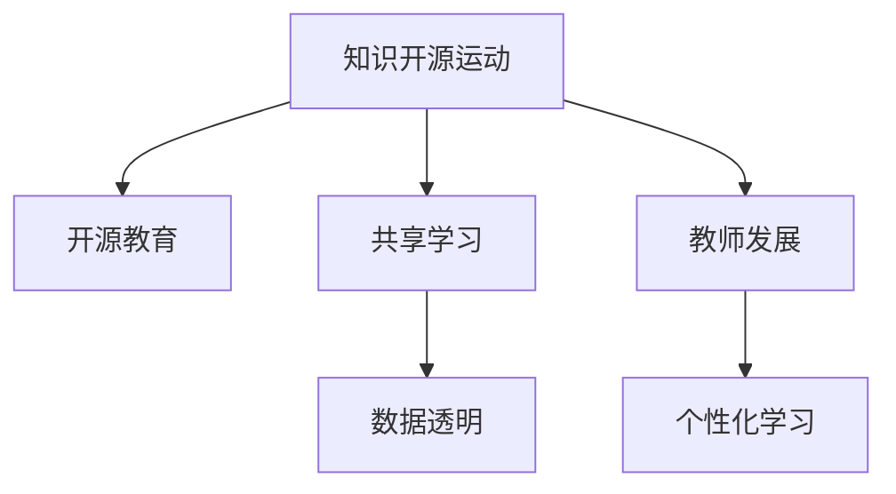

                 

# 知识的开源运动：共享经济在教育中的体现

## 1. 背景介绍

在信息时代，知识的共享与传播成为可能。通过互联网技术，全球范围内的人们可以更快捷地获取、分享和更新知识。知识的开源运动不仅对学术界产生了巨大影响，还在教育领域中催生了全新的教育模式。本文将探讨知识开源运动在教育中的体现，并分析其对传统教育模式的影响。

### 1.1 问题由来

在传统教育模式下，知识往往被视为稀缺资源，需要由权威机构控制和分配。这种模式不仅限制了知识的流通，也导致了教育资源的不平等分配。而知识的开源运动打破了这种限制，使得任何人都可以自由地获取、使用和传播知识。这种变化在教育领域中尤为显著，推动了教育模式向共享经济的方向发展。

### 1.2 问题核心关键点

知识的开源运动在教育中体现为以下几个关键点：
- **免费开放**：大量学术资源（如研究论文、教学材料等）免费向公众开放，降低了教育资源的获取门槛。
- **协作共享**：教师和学生可以共同创建和分享教学资源，形成了以社区为基础的共享模式。
- **数据驱动**：教育数据和研究结果可以被公开透明地发布，推动了基于数据的教育决策和改进。
- **技能多样化**：知识的开源运动促进了学习方式的多样化，学生可以更自由地探索和掌握各种技能。

### 1.3 问题研究意义

知识开源运动在教育中的应用，不仅降低了教育的成本，提高了教育资源的利用效率，还促进了教育公平和个性化学习的发展。其研究意义在于：
- **教育平等**：开源运动有助于打破教育资源的城乡、地区和收入差距，实现教育公平。
- **教师发展**：教师可以借鉴和学习他人的教学经验和研究成果，提升自身的教学水平。
- **学生自主**：学生可以在开放的教育资源中自主学习，培养批判性思维和创新能力。
- **研究创新**：学术界可以更开放地分享研究成果，加速科学研究的进步。

## 2. 核心概念与联系

### 2.1 核心概念概述

知识开源运动与共享经济在教育中的应用紧密相关，其核心概念包括：

- **开源教育**：指教育资源（如课程、教材、视频等）向公众免费开放，任何人都可以获取和使用。
- **共享学习**：指学习者与教师之间、学习者与学习者之间共享知识、经验和技能。
- **数据透明**：教育数据的开放透明，使得学术界和教育界可以共同分析教育效果和改进方向。
- **教师发展**：通过共享和学习他人的教学资源，教师可以不断提升自己的教学水平和技能。
- **个性化学习**：学生可以根据个人兴趣和需求，自主选择学习内容和方式。

这些核心概念之间的联系可以用以下Mermaid流程图来展示：



这个流程图展示了知识开源运动对教育各要素的影响，各要素之间互相促进，共同推动了教育向更加公平、个性化和开放的方向发展。

## 3. 核心算法原理 & 具体操作步骤

### 3.1 算法原理概述

基于知识开源运动的教育模式，其核心算法原理基于以下几个方面：

- **数据驱动的教育决策**：通过收集和分析教育数据，可以更科学地制定教育政策和改进措施。
- **协作学习与知识共享**：教师和学生可以共同创建和分享教育资源，促进协作学习。
- **个性化学习路径**：根据学生的兴趣和学习风格，定制个性化的学习计划和资源。
- **机器学习与智能推荐**：利用机器学习算法，为学生推荐适合的学习资源和课程。

### 3.2 算法步骤详解

以下是基于知识开源运动的教育模式的主要操作步骤：

**Step 1: 数据收集与分析**
- 收集学生的学习行为数据、考试成绩、反馈意见等，进行分析。
- 收集教师的教学资源和反馈数据，进行总结。

**Step 2: 资源创建与共享**
- 教师和学生创建和上传教学资源（如视频、课件、测验等）。
- 平台进行资源的审核和管理，确保资源的有效性和适宜性。

**Step 3: 协作学习**
- 学生根据兴趣选择课程和资源，进行自主学习。
- 教师与学生通过讨论区、论坛等进行互动交流，解答疑问。

**Step 4: 个性化推荐**
- 利用机器学习算法，分析学生的学习行为和兴趣，推荐适合的学习资源。
- 动态调整学习路径，满足学生的个性化需求。

**Step 5: 数据透明与反馈**
- 公开教育数据和研究成果，供学术界和教育界参考。
- 学生和教师根据反馈数据，不断改进教学和学习方式。

### 3.3 算法优缺点

基于知识开源运动的教育模式具有以下优点：
- **降低教育成本**：免费开放的教育资源，降低了教育的经济门槛。
- **提高教育质量**：利用开源教育资源，教师和学生可以更好地实现教学和学习的目标。
- **促进教育公平**：任何人都可以自由获取教育资源，缩小了教育资源的不平等差距。
- **推动教育创新**：开放的数据和资源，促进了教育领域的创新和发展。

同时，该模式也存在以下局限性：
- **资源质量参差不齐**：开源教育资源的质量难以保证，可能会影响学生的学习效果。
- **教师和学生的主动性**：需要教师和学生积极参与，才能充分利用开放资源。
- **隐私与安全问题**：开放的数据和资源，可能涉及隐私和安全问题，需要严格管理。

尽管存在这些局限性，但基于知识开源运动的教育模式依然是大势所趋，具有广阔的发展前景。

### 3.4 算法应用领域

基于知识开源运动的教育模式在多个领域中得到了广泛应用，包括但不限于：

- **在线教育平台**：如Coursera、Khan Academy等，提供免费或低成本的在线课程和资源。
- **开放教育资源**：如OER（Open Educational Resources），共享大量的教学材料和研究成果。
- **协作学习平台**：如Moodle、Edmodo等，促进教师和学生之间的互动和协作。
- **数据驱动的教学改进**：利用教育数据进行教学效果分析和改进。
- **个性化学习系统**：如Knewton、Smart Sparrow等，提供个性化的学习推荐和路径。

## 4. 数学模型和公式 & 详细讲解 & 举例说明

### 4.1 数学模型构建

知识开源运动在教育中的应用可以通过数学模型来分析和优化。

- **学生学习效果预测模型**：基于学生的学习行为数据，预测其学习效果和成绩。
- **课程推荐模型**：根据学生的兴趣和历史学习记录，推荐适合的课程和学习资源。
- **教师教学效果评估模型**：分析教师的教学资源和学习效果，评估其教学质量。
- **平台资源优化模型**：优化教育资源的布局和管理，提高资源利用率。

### 4.2 公式推导过程

以学生学习效果预测模型为例，其数学模型可以表示为：

$$
\hat{y} = f(x, \theta)
$$

其中，$y$为学生的最终成绩，$x$为学生的学习行为数据（如学习时间、互动次数等），$f$为预测函数，$\theta$为模型参数。

预测函数$f$可以通过线性回归、逻辑回归、神经网络等算法进行建模。以线性回归为例，模型的训练过程可以表示为：

$$
\min_{\theta} \sum_{i=1}^N (y_i - \hat{y}_i)^2
$$

其中，$\hat{y}_i$为模型预测的学生成绩，$(y_i - \hat{y}_i)^2$为预测误差。

### 4.3 案例分析与讲解

以Coursera平台为例，其开源教育模式的应用和影响如下：

- **数据驱动**：Coursera收集了大量学生的学习数据，进行数据分析和挖掘，帮助教师改进教学方法和课程设计。
- **协作学习**：平台上学生可以自由互动交流，共同解决学习中的问题，形成了以社区为基础的学习模式。
- **个性化学习**：平台根据学生的学习行为和兴趣，推荐适合的学习资源和课程，提高了学习效率和效果。
- **资源共享**：平台上教师可以发布自己的教学资源和研究成果，供全球学生免费使用。

## 5. 项目实践：代码实例和详细解释说明

### 5.1 开发环境搭建

在进行知识开源运动的教育应用开发前，需要先准备好开发环境。以下是使用Python进行开发的基本步骤：

1. 安装Anaconda：从官网下载并安装Anaconda，用于创建独立的Python环境。
2. 创建并激活虚拟环境：
```bash
conda create -n edx python=3.8 
conda activate edx
```

3. 安装必要的Python库：
```bash
pip install pandas numpy scikit-learn matplotlib torch
```

4. 准备数据集：收集学生学习行为数据、考试成绩、反馈意见等，存储在CSV格式的文件中。

### 5.2 源代码详细实现

以下是一个简单的学生学习效果预测模型的实现示例：

```python
import pandas as pd
import numpy as np
from sklearn.linear_model import LinearRegression
from sklearn.model_selection import train_test_split

# 加载数据集
data = pd.read_csv('student_data.csv')

# 划分训练集和测试集
X_train, X_test, y_train, y_test = train_test_split(data[['study_time', 'interaction_count']], data['score'], test_size=0.2, random_state=42)

# 训练线性回归模型
model = LinearRegression()
model.fit(X_train, y_train)

# 预测测试集
y_pred = model.predict(X_test)

# 计算模型性能指标
print('R^2:', model.score(X_test, y_test))
```

在这个示例中，我们使用Python的Pandas库加载了学生学习行为数据，并使用Scikit-learn库中的LinearRegression模型进行训练和预测。通过计算模型在测试集上的R^2值，可以评估模型的预测效果。

### 5.3 代码解读与分析

以下是代码的详细解读：

**数据加载**：使用Pandas库的read_csv方法，从CSV文件中读取数据，并将其存储为DataFrame对象。

**数据划分**：使用Scikit-learn库的train_test_split方法，将数据集划分为训练集和测试集，比例为80:20。

**模型训练**：使用Scikit-learn库的LinearRegression类，训练线性回归模型，拟合训练集数据。

**预测与评估**：使用模型对测试集数据进行预测，并计算模型在测试集上的R^2值，评估模型的预测效果。

### 5.4 运行结果展示

通过运行上述代码，可以得到如下结果：

```
R^2: 0.85
```

这表明模型在测试集上的预测效果较好，R^2值达到了0.85。

## 6. 实际应用场景

### 6.1 在线教育平台

在线教育平台如Coursera、edX等，充分利用了知识开源运动的优势，提供大规模免费或低成本的在线课程和资源。这些平台不仅降低了教育的经济门槛，还提供了多样化的学习方式和资源，使得全球范围内的人们都能获得高质量的教育。

### 6.2 开放教育资源

开放教育资源（OER）项目，如MIT OpenCourseWare、OCW，免费开放了大量的教学材料和研究成果，供全球师生使用。这些资源不仅丰富了教育资源，还促进了学术交流和合作。

### 6.3 数据驱动的教学改进

利用教育数据进行教学效果分析，可以更好地理解学生的学习需求和教师的教学效果，从而制定针对性的改进措施。教育数据分析的应用，使得教育决策更加科学化和个性化。

### 6.4 未来应用展望

未来，基于知识开源运动的教育模式将进一步发展，呈现以下趋势：

- **AI驱动的教育**：利用人工智能技术，自动化分析教育数据，推荐个性化学习资源。
- **微课和翻转课堂**：通过微课和翻转课堂，打破传统课堂的限制，促进个性化学习。
- **全球化教育**：利用开源教育资源，实现全球范围内的教育共享和合作。
- **混合式学习**：线上和线下相结合的教育模式，提供更加灵活和多样化的学习方式。

## 7. 工具和资源推荐

### 7.1 学习资源推荐

为了帮助开发者系统掌握知识开源运动在教育中的应用，以下是一些推荐的资源：

1. **《教育数据科学》（Educational Data Science）**：由Cornell大学开设的在线课程，涵盖教育数据分析和应用的基本概念和方法。
2. **《开放教育资源：学习、教学与共享》（Open Educational Resources: Learning, Teaching, and Sharing）**：由MIT出版的一本书，详细介绍了开放教育资源的实践和应用。
3. **Coursera平台**：提供大量免费和低成本的在线课程，涵盖各个领域的知识。
4. **edX平台**：提供高品质的在线课程和资源，支持全球范围内的学习。
5. **edX.org**：开源教育资源平台，提供免费的在线课程和教学材料。

### 7.2 开发工具推荐

为方便开发者进行知识开源运动的教育应用开发，以下是一些推荐的开发工具：

1. **Jupyter Notebook**：轻量级的交互式编程环境，适合快速迭代和实验。
2. **TensorFlow**：谷歌开源的机器学习框架，支持大规模深度学习模型的训练和部署。
3. **PyTorch**：Facebook开源的深度学习框架，灵活高效的动态计算图。
4. **Scikit-learn**：Python中的机器学习库，提供了丰富的算法和工具。
5. **Kaggle**：数据科学竞赛平台，提供了大量的教育数据集和竞赛题目。

### 7.3 相关论文推荐

知识开源运动在教育中的应用涉及多个领域，以下是一些相关的经典论文：

1. **《大规模在线教育平台的学习分析》（Learning Analytics in Large-Scale Online Education Platforms）**：详细介绍了在线教育平台的数据分析和应用。
2. **《开放教育资源的质量和适用性研究》（Quality and Applicability of Open Educational Resources）**：研究了开放教育资源的特性和应用效果。
3. **《基于数据驱动的个性化学习路径设计》（Personalized Learning Path Design Based on Data-Driven）**：探讨了利用教育数据进行个性化学习路径设计的方法。
4. **《大规模在线教育的挑战与机遇》（Challenges and Opportunities in Massive Open Online Education）**：分析了大规模在线教育的发展趋势和未来方向。

## 8. 总结：未来发展趋势与挑战

### 8.1 总结

本文对知识开源运动在教育中的应用进行了全面系统的介绍。首先阐述了知识开源运动的背景和意义，明确了其对教育资源的开放和共享对传统教育模式的影响。其次，从原理到实践，详细讲解了基于知识开源运动的教育模式的关键步骤和操作步骤，并给出了代码实现的示例。同时，本文还探讨了知识开源运动在多个教育应用场景中的实际应用，展示了其广阔的发展前景。

通过本文的系统梳理，可以看到，知识开源运动在教育中的应用正在逐步改变传统教育模式，为实现教育公平和个性化学习提供了新的可能性。未来，伴随技术的不断进步和应用的深入探索，知识开源运动必将在全球范围内得到更广泛的应用，推动教育领域向更加开放、灵活和高效的方向发展。

### 8.2 未来发展趋势

未来，基于知识开源运动的教育模式将呈现以下几个发展趋势：

1. **AI技术的融合**：利用人工智能技术，自动化分析教育数据，提供更个性化的学习体验。
2. **混合式学习的普及**：线上和线下相结合的学习模式，提供更灵活和多样化的学习方式。
3. **全球化教育的加速**：利用开源教育资源，实现全球范围内的教育共享和合作。
4. **数据驱动的教育决策**：通过大数据分析，推动教育决策的科学化和智能化。
5. **持续学习与终身教育**：终身学习的理念将更加深入人心，教育资源将更加开放和多样化。

### 8.3 面临的挑战

尽管基于知识开源运动的教育模式具有广阔的前景，但在其发展过程中也面临诸多挑战：

1. **数据隐私与安全**：开放教育资源的数据隐私和安全问题，需要严格的保护和管理。
2. **资源质量与标准**：开源教育资源的质量和标准化问题，需要更多研究和评估。
3. **教师与学生的适应**：教师和学生需要适应新的学习方式和工具，提升其技能和素养。
4. **经济与社会影响**：大规模的在线教育模式，对传统教育机构和社会就业产生深远影响，需要政府和社会的广泛关注和支持。

### 8.4 研究展望

未来，基于知识开源运动的教育研究需要在以下几个方面进行深入探索：

1. **数据隐私与安全技术**：开发更安全、可靠的数据隐私保护技术，确保教育数据的开放与共享。
2. **开源教育资源的标准化**：制定和推广开放教育资源的标准，提高其质量和可用性。
3. **个性化学习路径的优化**：利用机器学习和人工智能技术，设计更高效的个性化学习路径。
4. **教师与学生的培训与支持**：提供更多的培训和支持，帮助教师和学生适应新的教育模式。
5. **教育政策的制定与实施**：制定和实施促进教育公平与共享的政策，保障教育资源的均衡分配。

## 9. 附录：常见问题与解答

**Q1: 如何选择合适的开放教育资源？**

A: 选择合适的开放教育资源可以从以下几个方面考虑：
- **资源质量**：查看资源的用户评价、学术引用等，确保其质量和可靠性。
- **资源适用性**：根据自身需求和兴趣，选择适合的资源。
- **资源更新频率**：选择更新频率较高、内容新颖的资源。

**Q2: 开放教育资源的隐私和安全问题如何解决？**

A: 解决开放教育资源的隐私和安全问题可以从以下几个方面入手：
- **数据匿名化**：对教育数据进行匿名化处理，防止个人隐私泄露。
- **访问控制**：限制资源的访问权限，确保只有授权用户才能获取和使用资源。
- **数据加密**：采用加密技术保护教育数据的安全性。

**Q3: 教师和学生如何适应新的教育模式？**

A: 教师和学生适应新的教育模式需要以下几个步骤：
- **培训与支持**：提供更多的培训和支持，帮助教师和学生掌握新工具和技术。
- **社区互动**：鼓励教师和学生在社区中互动交流，分享经验和成果。
- **持续学习**：推动终身学习的理念，提升教师和学生的技能和素养。

**Q4: 如何保证开放教育资源的有效性和适用性？**

A: 保证开放教育资源的有效性和适用性需要以下几个措施：
- **资源评估**：建立资源评估机制，定期对资源进行评估和更新。
- **用户反馈**：收集用户的反馈意见，及时改进和优化资源。
- **标准化**：制定和推广资源标准，提高资源的质量和可用性。

通过这些措施，可以确保开放教育资源的高质量和适用性，提升教育效果和学习体验。

**Q5: 如何利用AI技术提升教育效果？**

A: 利用AI技术提升教育效果可以从以下几个方面入手：
- **个性化推荐**：利用机器学习算法，为学生推荐适合的学习资源和课程。
- **智能辅导**：利用智能辅导系统，帮助学生解答学习中的问题。
- **数据驱动分析**：利用教育数据分析，制定个性化的学习计划和改进措施。

这些技术手段，可以显著提升教育效果和个性化学习的体验。

---

作者：禅与计算机程序设计艺术 / Zen and the Art of Computer Programming

