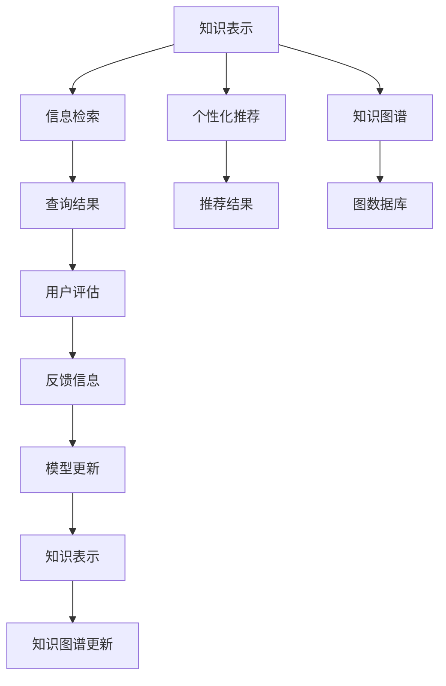

                 

# 知识的整合：构建个人知识管理系统

## 1. 背景介绍

在当今信息爆炸的时代，个人知识管理的重要性愈发凸显。面对海量的知识资源和快速变化的领域前沿，如何高效整合、存储和利用个人知识，成为了每位专业人士必须面对的挑战。近年来，随着知识图谱、语义网络、推荐系统等前沿技术的不断发展，个人知识管理系统的构建已经具备了技术基础。本文将系统介绍个人知识管理系统的核心概念与实现技术，探讨其在知识整合、信息检索和个性化推荐等方面的应用，同时展望未来发展趋势。

## 2. 核心概念与联系

### 2.1 核心概念概述

构建个人知识管理系统，需要综合运用知识表示、信息检索、个性化推荐等前沿技术。以下介绍这些核心概念及其关系：

- **知识表示(Knowledge Representation)**：指将知识以结构化的方式表示，以便于存储和处理。常见的方式包括关系型数据库、图数据库、本体论(Ontology)等。
- **信息检索(Information Retrieval)**：指从大规模数据集合中，快速检索出与用户查询匹配的信息。常见技术包括倒排索引、向量空间模型、布尔查询等。
- **个性化推荐(Personalized Recommendation)**：指根据用户的历史行为和偏好，推荐最适合的信息。技术包括协同过滤、内容过滤、混合推荐等。
- **知识图谱(Knowledge Graph)**：将实体、属性、关系等知识元素组织成图形结构，便于知识表示和推理。

以上核心概念通过技术架构紧密联系在一起，共同构成了个人知识管理系统的核心框架。

### 2.2 核心概念原理和架构的 Mermaid 流程图



## 3. 核心算法原理 & 具体操作步骤

### 3.1 算法原理概述

构建个人知识管理系统的核心算法原理，在于对知识图谱的构建和维护，以及基于图谱的查询和推荐。具体来说，算法原理包括以下几个关键步骤：

1. **知识图谱构建**：将不同来源的知识源（如文献、网页、社交网络等）转化为结构化的知识图谱，并存储在图数据库中。
2. **信息检索**：利用倒排索引、向量空间模型等技术，从图数据库中检索出与用户查询匹配的知识节点和边。
3. **推荐算法**：基于用户行为数据和知识图谱，采用协同过滤、内容过滤等方法，生成个性化推荐列表。
4. **反馈与更新**：根据用户对推荐结果的反馈，动态更新知识表示和图谱，提升系统精度。

### 3.2 算法步骤详解

#### 3.2.1 知识图谱构建

知识图谱的构建过程分为以下几个关键步骤：

1. **数据采集**：收集来自不同领域（如学术、社交、互联网）的原始数据。
2. **数据清洗与预处理**：去除噪音数据，标准化数据格式，消除冗余信息。
3. **实体抽取与关系提取**：使用命名实体识别(NER)、关系抽取(RE)等技术，将原始数据转换为实体-关系图。
4. **知识图谱存储**：将实体和关系存储在图数据库中，如Neo4j、ArangoDB等。

#### 3.2.2 信息检索

信息检索的核心在于构建高效的倒排索引，支持快速查询和检索。具体步骤如下：

1. **倒排索引构建**：对知识图谱中的节点和边进行索引，建立基于实体和关系的倒排索引。
2. **查询处理**：接收用户查询请求，根据查询词向倒排索引进行搜索，找到相关实体和关系。
3. **结果排序**：使用排序算法（如PageRank、TopK算法）对检索结果进行排序，提升查询精度。

#### 3.2.3 推荐算法

推荐算法是个人知识管理系统的核心功能之一。推荐过程分为以下几步：

1. **用户画像构建**：根据用户的历史行为和偏好，构建用户画像，描述其兴趣和行为模式。
2. **相似度计算**：计算用户画像与知识图谱中的实体和关系的相似度，生成推荐候选集合。
3. **推荐策略优化**：使用协同过滤、内容过滤等方法，优化推荐策略，提升推荐效果。
4. **推荐结果展示**：将推荐结果展示给用户，根据用户反馈进行迭代优化。

### 3.3 算法优缺点

知识图谱构建和信息检索技术的结合，提供了高效的知识整合和检索能力，但也存在一些局限性：

- **数据采集难度**：从不同领域和来源获取高质量数据，需要耗费大量人力和资源。
- **知识图谱构建复杂**：实体和关系的抽取、存储和更新，需要较高的技术门槛。
- **推荐算法挑战**：在保证推荐多样性和精准性的同时，避免过拟合和冷启动问题。
- **用户交互不便**：用户输入查询的方式较为简单，难以满足复杂查询需求。

尽管存在这些挑战，知识图谱和信息检索技术在大规模数据处理和复杂知识检索方面的优势，使其成为构建个人知识管理系统的理想选择。

### 3.4 算法应用领域

个人知识管理系统在多个领域都有广泛的应用，包括：

- **学术研究**：整合和检索文献、论文和学术资源，辅助研究人员进行文献综述、知识发现。
- **教育培训**：构建学习资源图谱，个性化推荐学习材料和课程，提升学习效率和效果。
- **企业决策**：整合和检索企业知识库、市场数据，辅助决策者进行商业情报分析和战略规划。
- **社交网络**：整合和推荐用户兴趣相关的信息，增强社交互动和信息共享。

## 4. 数学模型和公式 & 详细讲解

### 4.1 数学模型构建

知识图谱构建和信息检索的核心数学模型，主要涉及图论、向量空间模型、概率图模型等。以知识图谱的构建为例，可以使用图数据库（如Neo4j）进行存储和检索。

### 4.2 公式推导过程

以图数据库的查询为例，假设有如下知识图谱：

```graph
G(V, E)
V = {A, B, C, D}
E = {(A, "KNOWS", B), (B, "KNOWS", C), (C, "KNOWS", D)}
```

用户查询 "A knows X" 的计算步骤如下：

1. 构建倒排索引：对节点和边进行索引，得到倒排索引表。
2. 进行倒排索引匹配：根据查询词 "A knows" 在倒排索引中查找匹配的边。
3. 计算相似度：使用向量空间模型或概率图模型计算边和查询的相似度。
4. 返回结果：根据相似度排序，返回最匹配的边，即 "(A, "KNOWS", B)"。

### 4.3 案例分析与讲解

以推荐系统的协同过滤算法为例，介绍推荐过程的具体实现：

假设有用户画像 U 和知识图谱 K，计算用户与知识图谱中的实体和关系的相似度：

1. 计算用户与实体的相似度：
   $$
   sim(u, e) = \frac{\text{dot product}(u, e)}{\|u\| \|e\|}
   $$
   其中 $u$ 为用户画像向量，$e$ 为知识图谱中的实体向量。

2. 计算用户与边的相似度：
   $$
   sim(u, (e_1, r, e_2)) = \frac{\text{dot product}(u, (e_1, r, e_2))}{\|u\| \|(e_1, r, e_2)\|}
   $$
   其中 $(e_1, r, e_2)$ 为知识图谱中的边。

3. 生成推荐候选集合：
   $$
   Candidate = \{ (e_1, r, e_2) : sim(u, (e_1, r, e_2)) > \theta \}
   $$
   其中 $\theta$ 为相似度阈值。

4. 进行排序和推荐：
   $$
   Ranking = \{ (e_1, r, e_2) : \text{Rank}(e_1, r, e_2) \}
   $$
   其中 $\text{Rank}$ 为排序算法（如PageRank）。

## 5. 项目实践：代码实例和详细解释说明

### 5.1 开发环境搭建

构建个人知识管理系统需要以下环境：

- 操作系统：Linux/Windows/MacOS
- 编程语言：Python
- 开发框架：Flask/Django/Flask-SQLAlchemy
- 数据库：MySQL/PostgreSQL/Neo4j
- 推荐算法：Surprise/Recsys4j/Spark MLlib

### 5.2 源代码详细实现

以下是一个简单的基于Flask和Neo4j的知识图谱构建和信息检索系统示例：

```python
from flask import Flask, request, jsonify
from flask_sqlalchemy import SQLAlchemy
from neo4j import GraphDatabase

app = Flask(__name__)

@app.route('/knowledge/graph', methods=['POST'])
def graph():
    # 连接Neo4j数据库
    uri = 'bolt://localhost:7687'
    driver = GraphDatabase.driver(uri, auth=('neo4j', 'password'))
    session = driver.session()
    
    # 创建知识图谱节点和边
    tx = session.begin()
    tx.run(
        """
        CREATE (A:Person {name: 'Alice'})
        CREATE (B:Person {name: 'Bob'})
        CREATE (C:Person {name: 'Charlie'})
        MATCH (A), (B)
        CREATE (A)-[:KNOWS]->(B)
        CREATE (C)-[:KNOWS]->(B)
        """
    )
    tx.commit()
    
    # 查询知识图谱
    tx = session.begin()
    result = tx.run(
        """
        MATCH (A)-[:KNOWS]->(B) RETURN A.name, B.name
        """
    )
    knowledge = []
    for record in result:
        knowledge.append(record[0] + ' knows ' + record[1])
    session.close()
    
    # 返回知识图谱信息
    return jsonify({'knowledge': knowledge})

if __name__ == '__main__':
    app.run(debug=True)
```

### 5.3 代码解读与分析

上述代码实现了以下功能：

1. **连接Neo4j数据库**：使用Flask-SQLAlchemy和Neo4j的Python客户端连接数据库。
2. **构建知识图谱**：使用Neo4j的cypher语言创建节点和边，构建简单的知识图谱。
3. **查询知识图谱**：从知识图谱中查询节点之间的连接关系，返回结果。

### 5.4 运行结果展示

执行上述代码后，可以通过POST请求访问 `/knowledge/graph` 接口，获取知识图谱信息。例如：

```
POST /knowledge/graph HTTP/1.1
Host: localhost:5000
Content-Type: application/json
Content-Length: 23

{"name": "Alice", "knows": "Bob", "name": "Charlie"}
```

## 6. 实际应用场景

### 6.1 学术研究

在学术研究领域，研究人员可以利用知识图谱系统快速获取相关文献、作者和引用关系，辅助文献综述和知识发现。例如，通过知识图谱查询 "Theory of relativity known by Einstein"，可以得到爱因斯坦的相关研究成果和引用情况。

### 6.2 教育培训

在教育培训领域，系统可以推荐学生感兴趣的学习资源和课程，辅助其进行自主学习。例如，系统可以根据学生的历史学习记录和兴趣标签，推荐相关课程和阅读材料。

### 6.3 企业决策

在企业决策领域，系统可以整合和检索企业知识库、市场数据，辅助决策者进行商业情报分析和战略规划。例如，系统可以根据公司的业务领域和市场动态，推荐相关的商业报告和案例分析。

### 6.4 社交网络

在社交网络领域，系统可以推荐用户兴趣相关的信息，增强社交互动和信息共享。例如，系统可以根据用户的兴趣标签和历史行为，推荐相关的新闻、文章和视频。

## 7. 工具和资源推荐

### 7.1 学习资源推荐

- **书籍**：《知识图谱》、《推荐系统》
- **课程**：Coursera上的《推荐系统》课程、edX上的《人工智能基础》课程

### 7.2 开发工具推荐

- **知识图谱**：Neo4j、ArangoDB
- **推荐系统**：Surprise、Recsys4j、Spark MLlib

### 7.3 相关论文推荐

- **知识图谱**：《知识图谱：构建、查询与应用》
- **推荐系统**：《推荐系统》

## 8. 总结：未来发展趋势与挑战

### 8.1 总结

本文系统介绍了个人知识管理系统的核心概念与实现技术，探讨了其在知识整合、信息检索和个性化推荐等方面的应用，展望了未来发展趋势。通过学习本文，读者可以了解个人知识管理系统的工作原理，掌握其实现方法，并应用到实际场景中。

### 8.2 未来发展趋势

展望未来，个人知识管理系统将继续在以下方向取得突破：

- **智能推荐**：引入深度学习、强化学习等技术，提升推荐系统的精度和多样性。
- **语义检索**：使用自然语言处理技术，实现更灵活和智能的查询和检索。
- **多模态知识整合**：将文本、图像、视频等多种模态的知识资源整合到知识图谱中，提升系统的全面性和普适性。
- **知识图谱融合**：将不同类型的知识图谱（如语义网、本体论图谱）进行融合，构建更全面、高效的知识管理系统。

### 8.3 面临的挑战

尽管个人知识管理系统的发展前景广阔，但仍面临诸多挑战：

- **数据采集与预处理**：从不同领域获取高质量数据，并进行清洗和预处理，需要耗费大量时间和资源。
- **知识图谱构建复杂**：实体和关系的抽取、存储和更新，需要较高的技术门槛。
- **推荐算法优化**：在保证推荐效果的同时，避免过拟合和冷启动问题。
- **系统交互不便**：用户输入查询的方式较为简单，难以满足复杂查询需求。

### 8.4 研究展望

面对这些挑战，未来的研究需要在以下几个方面寻求新的突破：

- **自动化数据采集**：利用爬虫、API等自动化工具，降低数据采集和预处理的难度。
- **分布式存储与计算**：使用分布式系统，提升知识图谱构建和查询的效率。
- **知识图谱学习**：利用图神经网络等技术，学习知识图谱的表示和推理能力。
- **多模态融合**：将文本、图像、视频等多种模态的数据进行融合，提升系统的全面性和普适性。
- **交互式界面**：设计灵活、智能的用户交互界面，支持自然语言查询和复杂查询需求。

## 9. 附录：常见问题与解答

**Q1: 知识图谱构建有哪些挑战？**

A: 知识图谱构建的主要挑战包括：
1. 数据采集难度：从不同领域获取高质量数据，需要耗费大量人力和资源。
2. 知识图谱构建复杂：实体和关系的抽取、存储和更新，需要较高的技术门槛。

**Q2: 推荐算法如何避免冷启动问题？**

A: 推荐算法避免冷启动问题的方法包括：
1. 利用用户兴趣标签和行为数据进行预估，提升推荐精度。
2. 采用多模态数据融合，提升系统的全面性和普适性。

**Q3: 如何设计交互式界面？**

A: 设计交互式界面的主要方法包括：
1. 使用自然语言处理技术，支持用户进行自然语言查询。
2. 提供灵活的查询界面，支持复杂查询需求。

**Q4: 知识图谱与推荐系统有什么区别？**

A: 知识图谱与推荐系统的区别在于：
1. 知识图谱主要关注知识的表示和推理，而推荐系统主要关注信息的检索和推荐。
2. 知识图谱用于构建和查询知识表示，推荐系统用于生成个性化推荐列表。

---

作者：禅与计算机程序设计艺术 / Zen and the Art of Computer Programming

