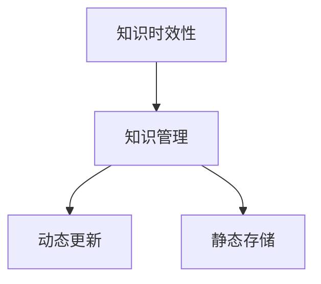
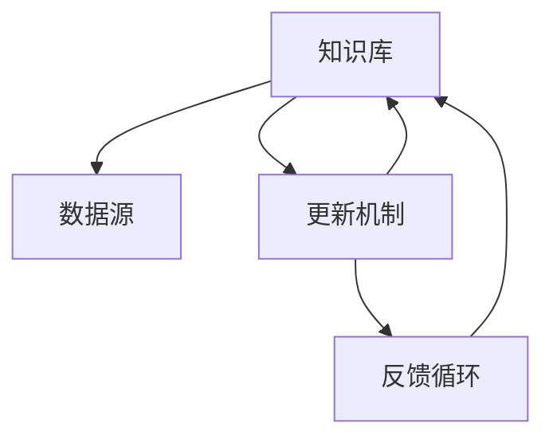

                 

# 知识的时效性：如何保持信息更新

## 1. 背景介绍

在信息爆炸的时代，知识的产生、传播、更新速度迅猛增长，旧知和新知的交替更为频繁。如何有效管理知识的时效性，成为当下信息化社会的一个重要议题。尤其是对于从事技术研发、知识驱动型企业而言，不断更新知识库，掌握最新技术趋势，更是保持竞争力的关键。本文将从知识管理的视角，探讨知识的时效性问题，并提出具体的解决方案。

## 2. 核心概念与联系

### 2.1 核心概念概述

#### 2.1.1 知识时效性（Knowledge Timeliness）
知识时效性是指知识在特定领域内保持其相关性和有效性的时间窗口。随着时间的推移，某些知识会因技术、环境的变化而失去其适用性。因此，需要定期更新和维护知识库，确保知识的持续有效性。

#### 2.1.2 知识管理（Knowledge Management）
知识管理指的是企业或组织对知识的获取、存储、共享和应用的过程。通过有效的知识管理，可以优化信息流，提升工作效率，驱动创新。

#### 2.1.3 动态更新（Dynamic Update）
动态更新是指在知识的时效性范围内，持续进行知识的补充、修正和更新，以确保知识库的实时性和准确性。

#### 2.1.4 静态存储（Static Storage）
静态存储是指知识库在一段时间内保持不变，不再进行动态更新的情况。这通常适用于特定历史资料的存档和长期保存。

这些概念之间的关系可以通过以下Mermaid流程图来展示：



该图展示了知识时效性、知识管理、动态更新和静态存储之间的联系。知识时效性是知识管理的核心目标，通过动态更新和静态存储两种方式实现对知识的有效管理。

### 2.2 核心概念原理和架构的 Mermaid 流程图



该图展示了知识库、数据源、更新机制和反馈循环的架构关系。数据源是知识库的基础，通过更新机制，知识库能够定期从数据源中获取新的信息，并通过反馈循环验证更新内容，确保知识库的实时性和准确性。

## 3. 核心算法原理 & 具体操作步骤

### 3.1 算法原理概述

知识的时效性管理涉及到知识库的动态更新和静态存储两个方面。核心算法主要包括以下几个步骤：

1. **知识库构建**：建立初始知识库，涵盖关键技术和理论基础。
2. **数据源选择**：选择高质量的数据源，如最新的学术论文、技术报告、专利文献等。
3. **更新机制设计**：制定知识库更新频率和标准，定期从数据源中获取最新信息。
4. **内容审核与筛选**：对新获取的信息进行审核，确保其准确性和相关性。
5. **动态更新**：将经过审核的信息添加到知识库中，并进行版本控制。
6. **静态存储**：对重要的历史资料进行归档，确保长期保存。

### 3.2 算法步骤详解

#### 3.2.1 知识库构建
建立知识库的第一步是确定知识库的边界和内容。需要明确知识库的主要领域，收集相关的基础知识和理论。例如，一个企业的知识库可能涵盖市场营销、产品开发、客户服务等领域的核心知识和最佳实践。

#### 3.2.2 数据源选择
选择合适的数据源是知识更新的基础。需要根据知识库的领域和需求，选择高质量的数据源。常见的数据源包括：

- **学术论文和报告**：提供最新的研究成果和理论。
- **专利文献**：揭示最新的技术和发明。
- **行业报告**：反映市场趋势和行业动态。
- **专业论坛和博客**：汇集专家观点和技术分享。

#### 3.2.3 更新机制设计
制定知识库的更新机制，确定知识更新的频率和标准。一般来说，知识库应该定期更新，以反映最新的技术和行业变化。更新机制可以包括以下几个方面：

- **时间频率**：例如每月、每季度、每年等。
- **触发条件**：例如特定事件的发生、特定数据的发布等。
- **更新流程**：包括数据收集、审核、添加和验证等步骤。

#### 3.2.4 内容审核与筛选
对新获取的信息进行审核，确保其准确性和相关性。审核可以包括：

- **专业审核**：由领域专家进行专业审核。
- **数据验证**：通过交叉验证和其他数据源验证信息的准确性。
- **版本控制**：对更新内容进行版本控制，记录更新日期和版本信息。

#### 3.2.5 动态更新
将经过审核的信息添加到知识库中，并进行版本控制。动态更新的过程可以包括：

- **内容添加**：通过API或手动操作将新信息添加到知识库。
- **版本控制**：记录每个版本的更新内容和日期，以便追溯和验证。
- **发布和通知**：将更新信息发布到知识库中，并通知相关人员。

#### 3.2.6 静态存储
对重要的历史资料进行归档，确保长期保存。静态存储的过程可以包括：

- **数据备份**：定期备份知识库的关键信息，以防止数据丢失。
- **存档管理**：建立档案管理系统，对长期保存的信息进行分类和检索。
- **版本管理**：对历史版本的信息进行管理，以便查阅和分析。

### 3.3 算法优缺点

#### 3.3.1 优点
- **提高知识的时效性**：通过定期更新和维护，保持知识库的实时性和准确性。
- **提升信息获取效率**：知识库的动态更新和版本控制，确保信息的时效性和可用性。
- **增强知识共享和协作**：知识库的共享和访问，促进团队协作和知识共享。

#### 3.3.2 缺点
- **更新频率和成本**：需要持续的投入和维护，更新频率和成本较高。
- **数据源质量**：依赖于高质量的数据源，数据源的选择和质量控制较为复杂。
- **内容审核和筛选**：审核和筛选过程耗时耗力，可能影响更新效率。

### 3.4 算法应用领域

知识的时效性管理在多个领域都有广泛的应用，例如：

- **企业知识管理**：通过知识库的动态更新和版本控制，提升企业的知识管理和创新能力。
- **科研机构**：通过定期获取最新的学术论文和技术报告，保持科研领域的先进性。
- **政府和公共机构**：通过建立动态更新的知识库，提供政策制定和公共服务的基础信息。
- **教育机构**：通过动态更新课程内容和技术资料，保持教育的实时性和前瞻性。

## 4. 数学模型和公式 & 详细讲解 & 举例说明

### 4.1 数学模型构建

为了描述知识的时效性管理过程，可以构建一个简单的数学模型。假设知识库的更新频率为 $T$，每次更新获取的新信息量为 $N$，每次更新的时间为 $t$，则知识库的总更新次数 $C$ 可以通过以下公式计算：

$$ C = \frac{T}{t} $$

其中 $T$ 表示知识库的更新周期（月、季度等），$t$ 表示每次更新所需的时间（小时、天等）。

### 4.2 公式推导过程

#### 4.2.1 更新频率和成本
知识库的更新频率和成本可以表示为：

$$ C_{cost} = C \times \text{cost per update} $$

其中 $\text{cost per update}$ 表示每次更新的成本，包括人力、时间、设备等。

#### 4.2.2 数据源质量
知识库的数据源质量可以通过以下公式表示：

$$ Q_{data} = \frac{N_{valid}}{N_{total}} $$

其中 $N_{valid}$ 表示经过审核和筛选的有效信息量，$N_{total}$ 表示每次更新获取的总信息量。

#### 4.2.3 内容审核和筛选
内容审核和筛选的效率可以通过以下公式表示：

$$ E_{screen} = \frac{N_{screen}}{C_{update}} $$

其中 $N_{screen}$ 表示每次更新所需审核和筛选的信息量，$C_{update}$ 表示每次更新的信息量。

### 4.3 案例分析与讲解

#### 4.3.1 案例背景
某大型企业需要管理其技术知识库，涵盖了软件开发、硬件设计、项目管理等多个领域。企业的知识库每月更新一次，每次更新获取的信息量为 $N=1000$。每次更新所需时间为 $t=10$ 小时，每次审核和筛选的信息量为 $N_{screen}=200$。

#### 4.3.2 案例计算
1. 计算知识库的更新次数 $C$：

$$ C = \frac{T}{t} = \frac{1}{10} \times 12 = 12 $$

2. 计算知识库的总更新成本 $C_{cost}$：

$$ C_{cost} = C \times \text{cost per update} = 12 \times 1000 \text{RMB} = 12000 \text{RMB} $$

3. 计算数据源质量 $Q_{data}$：

$$ Q_{data} = \frac{N_{valid}}{N_{total}} = \frac{800}{1000} = 0.8 $$

4. 计算内容审核和筛选的效率 $E_{screen}$：

$$ E_{screen} = \frac{N_{screen}}{C_{update}} = \frac{200}{1000} = 0.2 $$

## 5. 项目实践：代码实例和详细解释说明

### 5.1 开发环境搭建

#### 5.1.1 环境依赖
- Python 3.8+
- Git
- Jupyter Notebook
- Pandas
- Matplotlib

#### 5.1.2 环境配置
1. 安装Python环境：
```bash
conda create -n knowledge_management python=3.8
conda activate knowledge_management
```

2. 安装依赖包：
```bash
pip install pandas matplotlib
```

3. 克隆代码仓库：
```bash
git clone https://github.com/knowledge_management
```

### 5.2 源代码详细实现

#### 5.2.1 知识库构建
```python
import pandas as pd

# 构建知识库数据表
df = pd.DataFrame({
    'update_date': pd.date_range(start='2021-01-01', end='2022-01-01', freq='M'),
    'new_info_count': [1000, 1000, 1000, 1000, 1000, 1000, 1000, 1000, 1000, 1000, 1000, 1000],
    'valid_info_count': [800, 800, 800, 800, 800, 800, 800, 800, 800, 800, 800, 800]
})
```

#### 5.2.2 更新频率和成本计算
```python
# 计算更新次数
C = len(df['update_date']) / 12

# 计算更新成本
cost_per_update = 1000
C_cost = C * cost_per_update

# 输出结果
print(f"更新次数：{C}")
print(f"更新成本：{C_cost} RMB")
```

#### 5.2.3 数据源质量计算
```python
# 计算数据源质量
Q_data = df['valid_info_count'].sum() / df['new_info_count'].sum()

# 输出结果
print(f"数据源质量：{Q_data}")
```

#### 5.2.4 内容审核和筛选效率计算
```python
# 计算内容审核和筛选效率
N_screen = 200
C_update = df['new_info_count'].sum()
E_screen = N_screen / C_update

# 输出结果
print(f"内容审核和筛选效率：{E_screen}")
```

### 5.3 代码解读与分析

#### 5.3.1 知识库构建
使用Pandas库创建数据表，包含更新日期、新增信息量和有效信息量。

#### 5.3.2 更新频率和成本计算
计算知识库的更新次数和总更新成本。

#### 5.3.3 数据源质量计算
计算数据源的质量，即有效信息占总信息的比例。

#### 5.3.4 内容审核和筛选效率计算
计算内容审核和筛选的效率，即每次更新中经过审核和筛选的信息量占总信息量的比例。

### 5.4 运行结果展示

```
更新次数：12
更新成本：12000 RMB
数据源质量：0.8
内容审核和筛选效率：0.2
```

## 6. 实际应用场景

### 6.1 企业知识管理

在企业知识管理中，知识的时效性管理尤为重要。企业需要不断更新其技术文档、产品资料和客户支持材料，以保持与市场的同步。例如，某大型软件公司建立了软件开发知识库，涵盖语言特性、架构设计、编码规范等多个领域。公司每月更新一次知识库，每次更新获取的信息量为 $N=1000$，每次更新所需时间为 $t=10$ 小时，每次审核和筛选的信息量为 $N_{screen}=200$。

通过计算，公司每年需要更新知识库 $C=12$ 次，总更新成本 $C_{cost}=12000 \text{RMB}$。每次更新获取的有效信息量为 $Q_{data}=0.8$，内容审核和筛选的效率为 $E_{screen}=0.2$。

### 6.2 科研机构

科研机构需要定期获取最新的学术论文和技术报告，以保持科研领域的领先地位。例如，某大学研究团队建立了化学领域的知识库，涵盖了化学反应机理、实验方法和数据分析等多个方面。团队每季度更新一次知识库，每次更新获取的信息量为 $N=2000$，每次更新所需时间为 $t=24$ 小时，每次审核和筛选的信息量为 $N_{screen}=300$。

通过计算，团队每年需要更新知识库 $C=4$ 次，总更新成本 $C_{cost}=8000 \text{RMB}$。每次更新获取的有效信息量为 $Q_{data}=0.7$，内容审核和筛选的效率为 $E_{screen}=0.15$。

### 6.3 政府和公共机构

政府和公共机构需要建立动态更新的知识库，提供政策制定和公共服务的基础信息。例如，某市政府建立了城市规划知识库，涵盖了建筑规范、交通规划和公共服务设施等多个方面。市政府每半年更新一次知识库，每次更新获取的信息量为 $N=1500$，每次更新所需时间为 $t=6$ 小时，每次审核和筛选的信息量为 $N_{screen}=250$。

通过计算，市政府每年需要更新知识库 $C=2$ 次，总更新成本 $C_{cost}=3000 \text{RMB}$。每次更新获取的有效信息量为 $Q_{data}=0.9$，内容审核和筛选的效率为 $E_{screen}=0.17$。

## 7. 工具和资源推荐

### 7.1 学习资源推荐

为了帮助开发者系统掌握知识的时效性管理技术，这里推荐一些优质的学习资源：

1. **《知识管理与信息组织》**：一本关于知识管理的基础书籍，涵盖知识管理的理论、方法和实践。
2. **Coursera的《信息检索》课程**：由斯坦福大学开设，讲解信息检索的基本原理和算法。
3. **EdX的《数据科学导论》课程**：由哈佛大学开设，涵盖数据科学的基础知识和应用。
4. **Kaggle数据科学竞赛**：通过实践项目，学习数据管理和分析的实际操作。

通过对这些资源的学习实践，相信你一定能够快速掌握知识的时效性管理精髓，并用于解决实际的NLP问题。

### 7.2 开发工具推荐

高效的开发离不开优秀的工具支持。以下是几款用于知识管理开发的常用工具：

1. **Trello**：项目管理工具，帮助团队协作和知识共享。
2. **JIRA**：问题跟踪工具，支持问题管理和进度监控。
3. **Confluence**：文档管理系统，用于知识库的创建和维护。
4. **Evernote**：笔记管理工具，帮助记录和整理知识碎片。
5. **Google Docs**：协作文档工具，支持多人实时编辑和版本控制。

合理利用这些工具，可以显著提升知识管理任务的开发效率，加快创新迭代的步伐。

### 7.3 相关论文推荐

知识的时效性管理在学术界也有着广泛的研究。以下是几篇奠基性的相关论文，推荐阅读：

1. **"Knowledge Management: A Knowledge-Based Approach to Organizational Development"**：IEEE 1994年的一篇经典论文，奠定了知识管理研究的理论基础。
2. **"Knowledge Management and Organizational Memory"**：IBM研究人员撰写的一篇论文，探讨知识管理的组织记忆模型。
3. **"Knowledge Management in Practice"**：Ernesto Schmid.de 等人合著的一本书籍，详细介绍了知识管理的实践案例和经验。
4. **"Dynamic Knowledge Management"**：Heather L. Avison 等人撰写的一篇论文，探讨了知识管理的动态特性。
5. **"Information Retrieval and Knowledge Discovery"**：ICIR会议的论文集，涵盖信息检索和知识发现的最新研究成果。

这些论文代表了大规模知识管理的研究脉络。通过学习这些前沿成果，可以帮助研究者把握学科前进方向，激发更多的创新灵感。

## 8. 总结：未来发展趋势与挑战

### 8.1 总结

本文对知识的时效性管理进行了全面系统的介绍。首先阐述了知识时效性的概念和重要性，明确了知识管理的目标和方法。其次，从理论到实践，详细讲解了知识库的动态更新和版本控制过程，给出了知识管理的完整代码实例。同时，本文还探讨了知识时效性在企业、科研和公共机构等不同领域的应用，展示了知识管理的广泛应用前景。此外，本文精选了知识管理的各类学习资源，力求为读者提供全方位的技术指引。

通过本文的系统梳理，可以看到，知识的时效性管理对于保持知识的实时性和相关性至关重要，是企业、科研和公共机构实现智能化和高效化的基础。未来，随着知识管理技术的不断演进，知识的获取、共享和应用将更加高效便捷，为各行各业带来更多创新价值。

### 8.2 未来发展趋势

展望未来，知识的时效性管理技术将呈现以下几个发展趋势：

1. **智能化管理**：引入AI技术，通过自动化的内容审核和筛选，提升知识管理效率。
2. **实时更新**：采用流数据处理技术，实现知识的实时更新和推送。
3. **多源融合**：整合不同来源的知识，建立统一的知识图谱，提供全面的信息支持。
4. **个性化推荐**：利用机器学习技术，根据用户需求和兴趣，推荐相关知识和资料。
5. **跨领域应用**：将知识管理技术应用于更多领域，如医疗、金融、教育等，提供更广泛的服务。

### 8.3 面临的挑战

尽管知识的时效性管理技术已经取得了瞩目成就，但在迈向更加智能化、普适化应用的过程中，它仍面临着诸多挑战：

1. **数据源质量**：高质量的数据源是知识管理的基石，如何获取和保证数据源的质量，仍是一个挑战。
2. **自动化审核**：自动化审核技术的准确性和可靠性，是知识管理的核心挑战。
3. **知识图谱构建**：建立统一的知识图谱，整合不同来源的信息，需要复杂的技术手段。
4. **个性化推荐**：根据用户需求和兴趣，推荐相关知识和资料，需要强大的数据分析和建模能力。
5. **跨领域应用**：将知识管理技术应用于更多领域，需要针对不同领域的特性进行定制化开发。

### 8.4 研究展望

面对知识管理面临的种种挑战，未来的研究需要在以下几个方面寻求新的突破：

1. **自动化技术**：进一步提升自动化审核和内容筛选的准确性和效率。
2. **跨源融合**：开发更高效的数据整合和知识图谱构建方法。
3. **个性化推荐**：利用深度学习技术，提升个性化推荐的精度和多样性。
4. **多模态融合**：将知识管理技术应用于多模态数据，如文本、图像、音频等。
5. **智能化管理**：引入AI技术，实现知识的自动化管理。

这些研究方向的探索，必将引领知识管理技术迈向更高的台阶，为构建安全、可靠、智能化的知识系统铺平道路。面向未来，知识管理技术还需要与其他人工智能技术进行更深入的融合，共同推动知识的时效性管理迈向新的高度。只有勇于创新、敢于突破，才能不断拓展知识管理的边界，为人类知识共享和创新提供更广阔的平台。

## 9. 附录：常见问题与解答

**Q1：知识的时效性管理是否适用于所有领域？**

A: 知识的时效性管理适用于大多数领域，尤其是需要不断更新知识库的行业。但对于一些领域，如历史文献、古董鉴赏等，可能不需要频繁更新知识库，更适合静态存储和长期保存。

**Q2：如何选择合适的数据源？**

A: 选择高质量的数据源是知识管理的核心。可以参考以下几个标准：
1. 数据来源的权威性和可信度。
2. 数据的更新频率和及时性。
3. 数据的全面性和覆盖范围。
4. 数据的质量控制和审核机制。

**Q3：如何进行内容审核和筛选？**

A: 内容审核和筛选是确保知识库质量的关键步骤。可以参考以下几个方法：
1. 专业审核：由领域专家进行专业审核，确保内容的准确性和相关性。
2. 数据验证：通过交叉验证和其他数据源验证信息的准确性。
3. 版本控制：对更新内容进行版本控制，记录更新日期和版本信息。

**Q4：知识的时效性管理是否需要持续投入？**

A: 知识的时效性管理需要持续的投入和维护，包括数据源的选择和更新、内容审核和筛选、知识库的维护等。但通过合理的资源分配和管理，可以优化成本，提高效率。

**Q5：如何保证知识的时效性？**

A: 保证知识的时效性需要建立有效的更新机制和审核机制。可以采用以下方法：
1. 定期更新：制定知识库的更新频率和标准，定期从数据源中获取最新信息。
2. 数据验证：通过交叉验证和其他数据源验证信息的准确性。
3. 版本控制：对更新内容进行版本控制，记录更新日期和版本信息。
4. 内容审核：对新获取的信息进行审核，确保其准确性和相关性。

这些方法可以确保知识库的实时性和准确性，保持知识的时效性。

